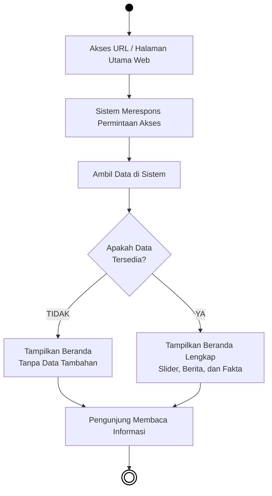

# BAB IV — PERANCANGAN SISTEM: 4.1.2 Activity Diagram (Publik)

## 4.1.2 Pengertian *Activity Diagram* Sisi Pengunjung
*Activity Diagram* (Diagram Aktivitas) berikut ini menjabarkan urutan proses pada sistem saat diakses secara terbuka oleh **Sivitas Akademika, Calon Mahasiswa, maupun Masyarakat Umum**. Tidak seperti struktur Administrator, akses di ranah Publik ini (*Frontend*) tidak membutuhkan tahapan *login*, melainkan berfokus pada kegiatan pencarian informasi, pengunduhan berkas, membaca berita, hingga partisipasi mendaftar. Diagram tetap menggunakan pola model *flowchart* konvensional agar mudah dimengerti. Komponen lingkaran penuh berwarna solid menandai *Start Node* (titik permulaan pengguna mengakses web), dan lingkaran dengan batas garis ganda menunjukkan *End Node* (titik akhir kegiatan).

---

## 4.3 Alur Aktivitas Publik (Pengunjung)

### 4.3.1 Activity Diagram Akses Halaman Beranda (Home)

***Gambar 4.22** Activity Diagram Akses Halaman Beranda (Home)*

**Penjelasan:**  
Sebagai antarmuka penyambutan pertama, halaman *Home* (Beranda) menawarkan informasi sekilas dengan muatan lengkap namun padat. Proses ini diawali dari kunjungan alamat web (URL) fakultas oleh masyarakat umum. Untuk memunculkannya, mesin sistem utama akan segera menghubungi pangkalan data (*database*) untuk mencari ketersediaan komponen gambar gulir promosi (*Slider*), cuplikan warta terkini (*Berita*), dan parameter pencapaian (*Fakta Fakultas*). Di titik pemeriksaan ini (*Decision Node*), peramban mempertegas ketersediaan konten tersebut. Andai koneksi ke basis datanya tidak ditemukan maupun data sungguh kosong, sistem menyederhanakan pelaporannya melalui tayangan profil beranda standar tanpa pelengkap data. Berlawanan jika pengambilan data sistem dipastikan tersedia komplit sepenuhnya, penampang halaman utama dimuat sempurna bersama sajian grafis *Slider* dan artikel cuplikan *Berita* untuk dikonsumsi serta dibaca sepuasnya oleh para pengunjung di layar mereka.
