# BAB IV — PERANCANGAN SISTEM: 4.1.2 Activity Diagram (Publik)

## 4.1.2 Pengertian *Activity Diagram* Sisi Pengunjung
*Activity Diagram* (Diagram Aktivitas) berikut ini menjabarkan urutan proses pada sistem saat diakses secara terbuka oleh **Sivitas Akademika, Calon Mahasiswa, maupun Masyarakat Umum**. Tidak seperti struktur Administrator, akses di ranah Publik ini (*Frontend*) tidak membutuhkan tahapan *login*, melainkan memodelkan interaksi nyata antara antarmuka (*User Interface*) dengan pilihan navigasi pengunjung (seperti kehendak mengklik tombol, membaca rincian, atau melakukan *scroll*). Lingkaran penuh berwarna solid menandai *Start Node* (titik permulaan pengguna membuka halaman), *Decision Node* (bentuk ketupat) merepresentasikan persimpangan pilihan pengguna, dan lingkaran dengan batas garis ganda menunjukkan *End Node* (titik akhir kegiatan di suatu halaman).

---

## 4.3 Alur Aktivitas Publik (Pengunjung)

### 4.3.1 Activity Diagram Interaksi Halaman Beranda (Home)

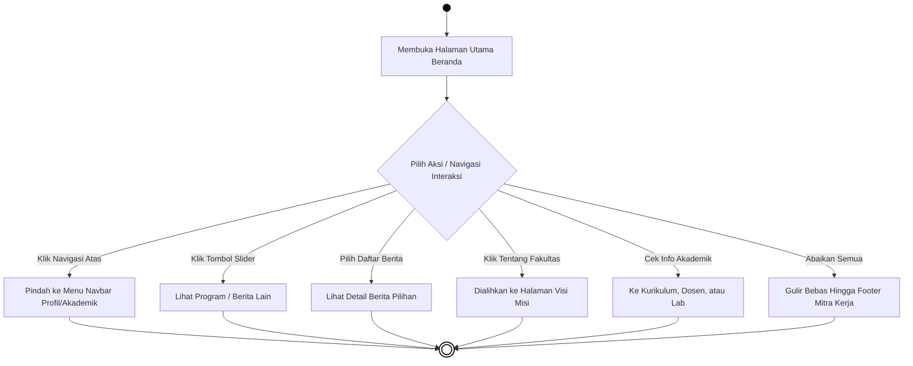
***Gambar 4.22** Activity Diagram Interaksi Halaman Beranda (Home)*

**Penjelasan:**  
Bagan mendatar (*fan-out*) di atas merunut jejak pilihan pengguna di Beranda. Karena sistem menampung banyak porsi, alur interaksi tidak berjalan menukik ke bawah, melainkan disebar berjajar menyamping. Pengguna dihadapkan seketika pada berbagai pintu cabang: menu atas, *slider*, berita, info akademik, hingga sekadar menggulir ke bawah tanpa hambatan. Tiap pintu berdiri sejajar mengarah penyelesaian yang bersangkutan.

---

### 4.3.2 Activity Diagram Interaksi Halaman Visi dan Misi

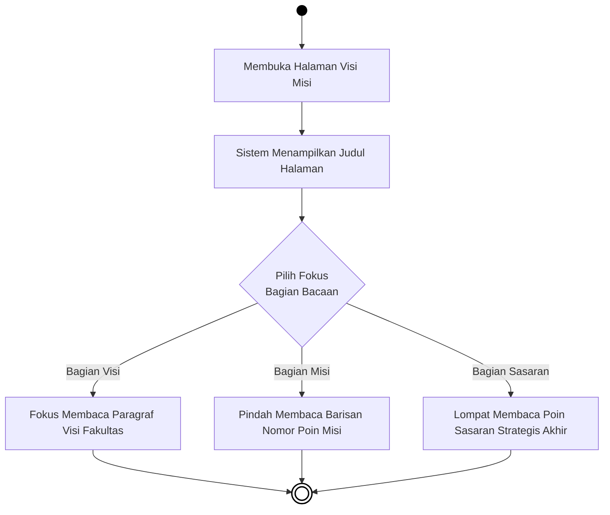
***Gambar 4.23** Activity Diagram Interaksi Halaman Visi dan Misi*

**Penjelasan:**  
Halaman ini menyajikan teks informasi statis. Pembaca dapat menelusuri ketiga elemen bacaan utamanya (Visi, Misi, Sasaran Strategis) secara leluasa dan berjajar menyamping selonjor selagi mereka menggulir dinamis layarnya hingga dirasa cukup dan keluar dari sirkuit interaksi.

---

### 4.3.3 Activity Diagram Interaksi Halaman Sambutan Pimpinan

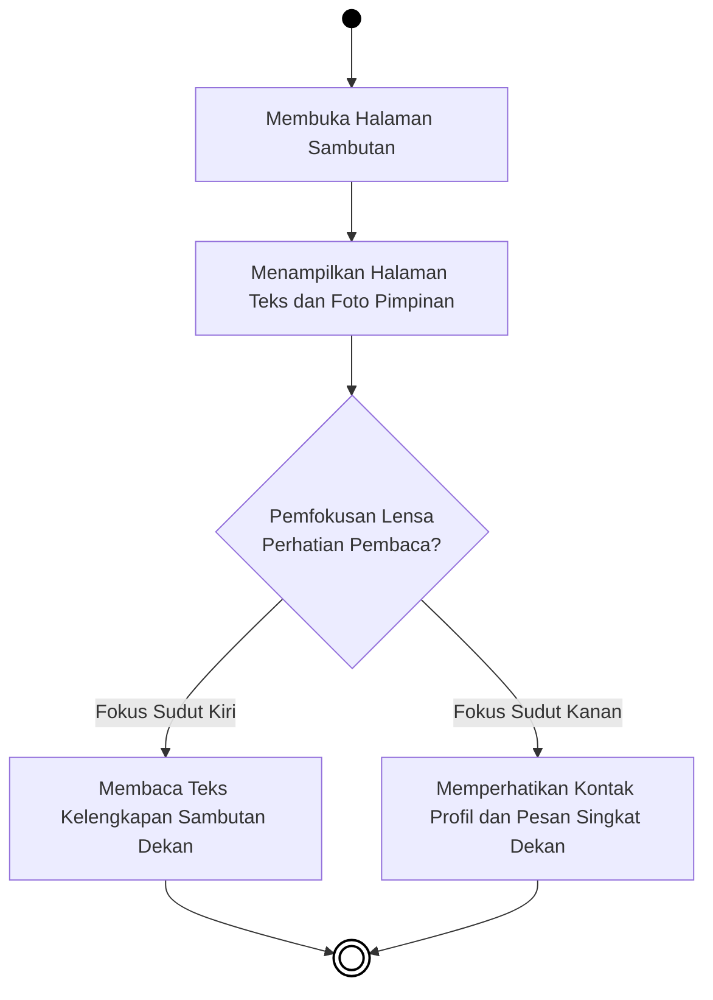
***Gambar 4.24** Activity Diagram Interaksi Halaman Sambutan*

**Penjelasan:**  
Skema area *Sambutan Dekan* memaparkan pengalaman relasi persepsi responsif. Setibanya pengguna, antarmuka mendatangkan kisi persilangan posisi kiri dan kanan. Andil pengunjung dibentangkan bercabang mengarah samping, menyusuri paragraf di satu sisi pandang, lalu memantau kutipan ringkas di seberangnya di waktu yang berdampingan.

---

### 4.3.4 Activity Diagram Interaksi Direktori Dosen

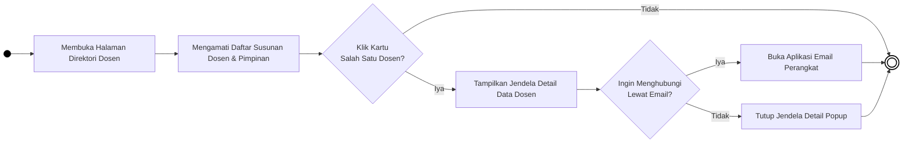
***Gambar 4.25** Activity Diagram Interaksi Direktori Dosen*

**Penjelasan:**  
Pengalaman di etalase pengajar dibentuk menjalur ke samping (*Left-to-Right*). Bila pembaca mendapati instrukturnya lalu mengeklik salah satu susunan muka dosen, antarmuka mencuatkan pop-up (*jendela lapisan*). Kehadiran fungsional rute ini terpecah menjadi interaksi pelunasan pesan melalui email perangkat bersurat, atau sekadar membuang lapisannya menuju akhir jalur horisontal.

---

### 4.3.5 Activity Diagram Interaksi Halaman Struktur Organisasi

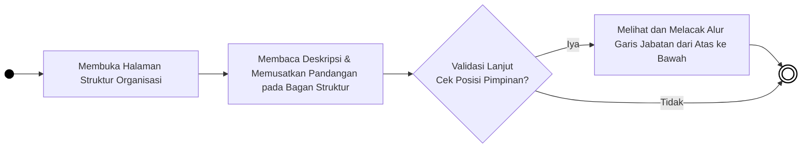
***Gambar 4.26** Activity Diagram Interaksi Halaman Struktur Organisasi*

**Penjelasan:**  
Berdasarkan bagan berorientasi bentang menyamping ini, cakupan navigasi visual perhadapkan di pusat peta gambar struktural. Pengamatan bergerak linear dari membaca judul membelah fokus jabatan pada alur pengawasan institusional fakultas dalam bagannya secara lurus dan segera selesai di kanan.

---

### 4.3.6 Activity Diagram Interaksi Halaman Pendaftaran Mahasiswa Baru

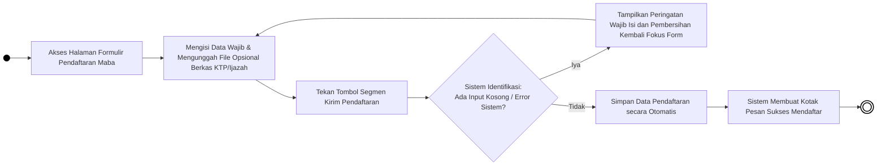
***Gambar 4.27** Activity Diagram Interaksi Halaman Pendaftaran Mahasiswa Baru*

**Penjelasan:**  
Formulir Pendaftaran memodelkan untaian sekuensial yang merambat utuh lurus dari pelataran kiri menuju kanan agar menumpas ketebalan vertikal layar. Setelah menekan tombol konfirmasi, bila ada luput format, iterasi putaran berpelintir kembali pada pengisian. Jika keakuratan terisi pas, diagram bergulir menuju penyimpanan data dan disudahi laporan kesuksesan hijau melintang.

---

### 4.3.7 Activity Diagram Prodi TI (Informatika)

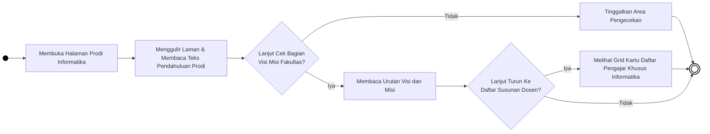
***Gambar 4.28** Activity Diagram Prodi TI (Informatika)*

**Penjelasan:**  
Pemodelan *Informatika* dilarikan horizontal persis pergerakan ular. Interaksinya menggugah dari penelaahan *header* riwayat sambutan lalu mencadangkan lintasan pilihan: berakselerasi putus awal atau meluncur menyelami *grid* pengumuman muka-muka dosen pengampu jurusan.

---

### 4.3.8 Activity Diagram Prodi Pendidikan Teknologi Informasi (PTI)

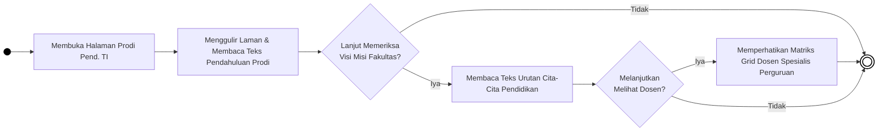
***Gambar 4.29** Activity Diagram Prodi Pend. TI*

**Penjelasan:**  
Menyulap urutan bertingkat jadi berjajar memanjang melukiskan rute jelajah halaman pendidikan vokasi ini. Lintasan setara presisinya dengan Informatika; meluncur dari profil, menyelami pendalaman materi visi sampai menemukan ujung galeri dewan lektor perguruan bersangkutan dengan arah ke samping.

---

### 4.3.9 Activity Diagram Menu Ruangan Kelas

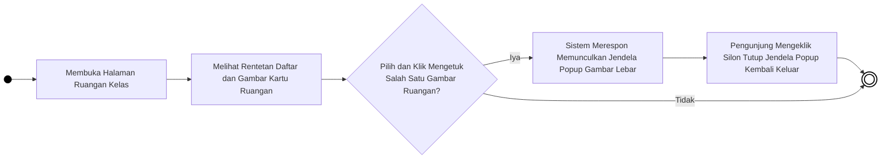
***Gambar 4.30** Activity Diagram Menu Ruangan Kelas*

**Penjelasan:**  
Merunut ke samping guna pangkas kepadatan susunan, ruangan kelas dihidupkan via penempatan galeri foto. Jantung pengait visual ditekankan pada gestur penekanan foto memancing *lightbox popup*, dilanjutkan keharusan pembaca mengetuk penyelesaian persilangan layarnya agar pudar.

---

### 4.3.10 Activity Diagram Menu Laboratorium

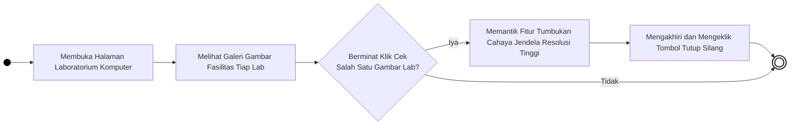
***Gambar 4.31** Activity Diagram Menu Laboratorium*

**Penjelasan:**  
Diagram menjalar rebah yang menjernihkan simulasi fasilitas laborat komputasi. Begitu memasuki pelelangan foto peralatan praktik, simpul mengizinkan penarikan tirai lebar *(Popup Mode)* ketika disinggung tombol intip oleh partisipan situs menjorok mengayun rute interaksi.

---

### 4.3.11 Activity Diagram Menu Kurikulum

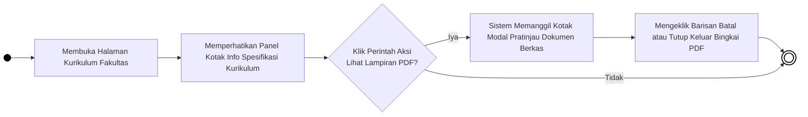
***Gambar 4.32** Activity Diagram Menu Kurikulum*

**Penjelasan:**  
Lintasan lateral *(kiri ke kanan)* melukis skenario ekstraksi dokumen kurikulum akademis. Bila tumpukan info kotak direkam mata, dorongan aksi "Lihat PDF" menginstruksi modul bayangan menampilkan berkas *inline frame*. Perputaran diagram dipungkasi sekalian pengunjung mematikan panggung proyektor layar pratinjau itu.

---

### 4.3.12 Activity Diagram Menu Kalender Akademik

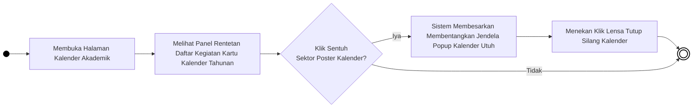
***Gambar 4.33** Activity Diagram Menu Kalender Akademik*

**Penjelasan:**  
Skema pamungkas publik dirangkai horizontal berjejer. Pengunjung memasuki gerbang kalender dibebaskan menggali poster jadwal per tahun. Menyetuh bidang kalender mana pun seketika membangunkan proyektor poster makro penanggalan. Lalu, memusnahkan modul dengan menekan silang jadi palang penutup sirkulasi interaktinya yang utuh.
