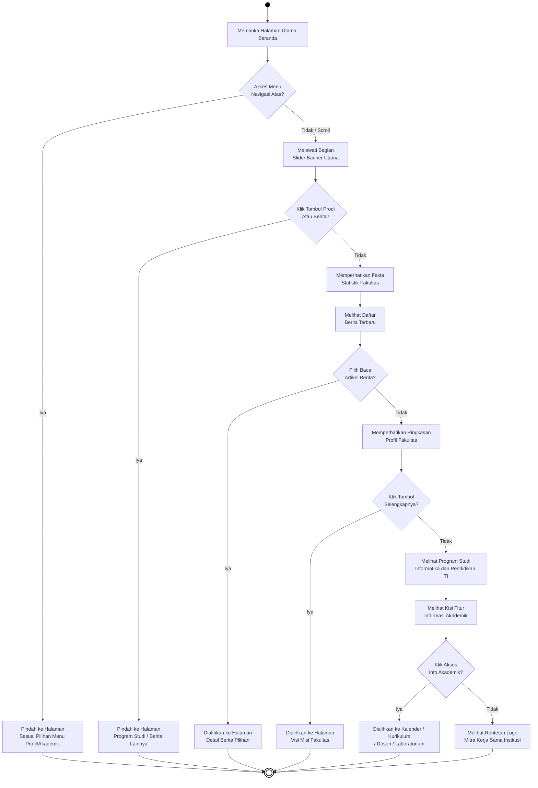
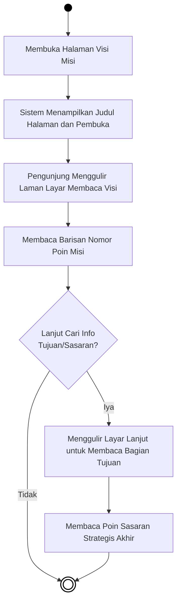
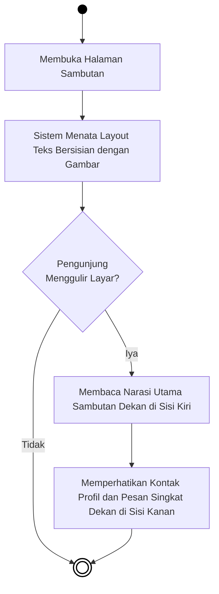
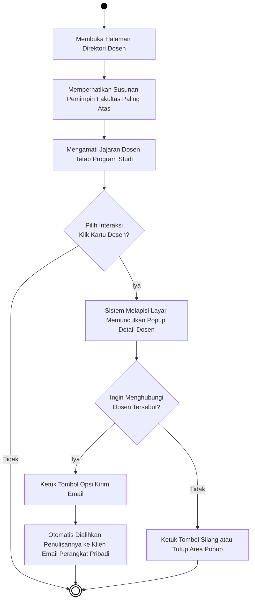
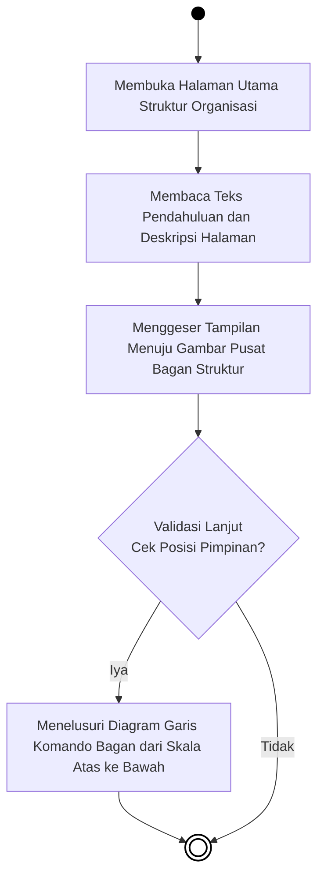
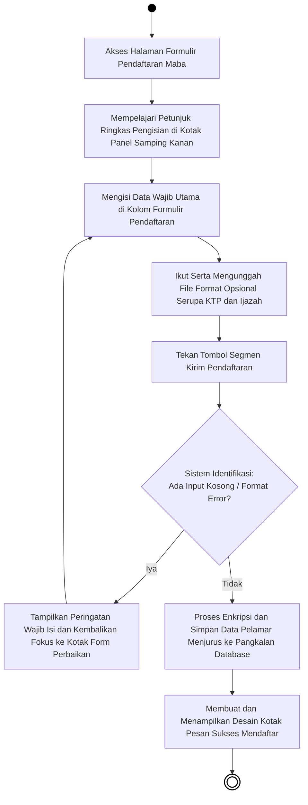

# BAB IV — PERANCANGAN SISTEM: 4.1.2 Activity Diagram (Publik)

## 4.1.2 Pengertian *Activity Diagram* Sisi Pengunjung
*Activity Diagram* (Diagram Aktivitas) berikut ini menjabarkan urutan proses pada sistem saat diakses secara terbuka oleh **Sivitas Akademika, Calon Mahasiswa, maupun Masyarakat Umum**. Tidak seperti struktur Administrator, akses di ranah Publik ini (*Frontend*) tidak membutuhkan tahapan *login*, melainkan memodelkan interaksi nyata antara antarmuka (*User Interface*) dengan pilihan navigasi pengunjung (seperti kehendak mengklik tombol, membaca rincian, atau melakukan *scroll*). Lingkaran penuh berwarna solid menandai *Start Node* (titik permulaan pengguna membuka halaman), *Decision Node* (bentuk ketupat) merepresentasikan persimpangan pilihan pengguna, dan lingkaran dengan batas garis ganda menunjukkan *End Node* (titik akhir kegiatan di suatu halaman).

---

## 4.3 Alur Aktivitas Publik (Pengunjung)

### 4.3.1 Activity Diagram Interaksi Halaman Beranda (Home)

***Gambar 4.22** Activity Diagram Interaksi Halaman Beranda (Home)*

**Penjelasan:**  
Bagan di atas merunut jejak interaksi pengguna selagi mereka berada di Beranda (*Home*). Seusai *loading* selesai, pengguna dihadapkan pada pilihan menggunakan fasilitas tombol menu atas *(Navbar)* atau menggerakkan layar *(scroll)* menelusuri penampang bawah. Setiap area *section* halaman semisal *Slider*, Berita, Tentang Fakultas, dan Informasi Akademik menawarkan penawaran tombol lanjutan (Persimpangan *Decision*) yang memungkinkan pengguna menghentikan perjalanan bacanya untuk langsung dikirim ke halaman cabang lain. Bila satu pun tombol pelintas tidak dihiraukan, rute interaksi linier berlanjut hanya sekadar memandangi ringkasan komprehensif hingga memutari galeri logo mitra kerja di titik akhir *footer*.

---

### 4.3.2 Activity Diagram Interaksi Halaman Visi dan Misi

***Gambar 4.23** Activity Diagram Interaksi Halaman Visi dan Misi*

**Penjelasan:**  
Halaman ini bersifat mutlak pembacaan statis dan memiliki pola pergerakan vertikal yang konsisten. Kehadiran pembaca berujung pada konsumsi naskah-teks yang disusun per petak (*card*). Setelah membuka URL Visi Misi, pengguna pertama kali mencerna judul dan tujuan halaman. Interaksi kognitif kemudian dipetakan searah seputar apakah figur pembaca itu mendedikasikan waktu sekadar menyerap makna Visi, bergeser memilah target di dalam balok daftar Misi, hingga bersedia mempertimbangkan sasaran strategis di segmen penutup yang bermuara menyelesaikan tur informasi halamannya.

---

### 4.3.3 Activity Diagram Interaksi Halaman Sambutan Pimpinan

***Gambar 4.24** Activity Diagram Interaksi Halaman Sambutan*

**Penjelasan:**  
Diagram interaksi area *Sambutan Dekan* tidak dikontrol serangkaian tombol rumit namun mengukur pengalaman persepsi *layout* responsif yang direkam ke dalam *database*. Setibanya pengguna, antarmuka mendatangkan kisi persilangan (*Grid Sidebar*) yang mengatur komposisi sosiokultural halaman. Andil pengunjung dikerucutkan pada aksi menyusuri paragraf pengantar di satu sisi layar (Kiri), sembari sesekali menoleh memeperhatikan penyeranta ringkasan petatah jabatan pimpinan dan potret fotonya di penadah bingkai (Kanan), yang kesemuanya dapat diselesaikan dalam durasi guliran pendek ke *End Node*.

---

### 4.3.4 Activity Diagram Interaksi Direktori Dosen

***Gambar 4.25** Activity Diagram Interaksi Direktori Dosen*

**Penjelasan:**  
Pengalaman berselancar di hamparan etalase pengajar (*Dosen*) membawa pengayaan antarmuka *Popup* (tumpangan modul layar kecil). Diagram mendikte pengunjung melewati identifikasi struktur utama menuju pemindaian tumpukan muka edukator. Bila pembaca menemukan instrukturnya lalu memicu klik pada salah satu kartunya, sistem mengabulkan inisiatif itu lewat tebaran informasi mendalam berupa biodata di dalam kotak interaktif *Popup*. Rute terpecah menjadi eksekusi tombol komunikasi rujukan menuju layanan bersurat menyurat elektronik (*Email*), ataupun tindakan sepele menutup bingkai modul guna melanjutkan penyarian ke dosen-dosen lainnya menuju kesimpulan penelusuran.

---

### 4.3.5 Activity Diagram Interaksi Halaman Struktur Organisasi

***Gambar 4.26** Activity Diagram Interaksi Halaman Struktur Organisasi*

**Penjelasan:**  
Cakupan fungsi di menu struktural amat ringkas. Skenario diagram merunut perjalanan navigasi visual terhadap cetak penampang grafis (*image/picture*) yang termuat di pusat kanvas. Urutan alurnya dipukul rata mulai dari menangkap maklumat nama bagannya, lalu fokus membelah dan menerjemahkan hirarki jabatan (misal melacak alur wewenang pengawasan program dan dewan kepengurusan) pada jalinan anak panah yang melakat di gambar struktur tersebut menuju penutup kegiatan.

---

### 4.3.6 Activity Diagram Interaksi Halaman Pendaftaran Mahasiswa Baru

***Gambar 4.27** Activity Diagram Interaksi Halaman Pendaftaran Mahasiswa Baru*

**Penjelasan:**  
Memperagakan salah satu transaksi fungsional paling sibuk di panggung terdepan (*Frontend*), borang *Pendaftaran Mahasiswa Baru* meminta jaminan kepastian. *Flowchart* merekam kebebasan pembaca bersiap siaga mencocokkan wejangan pendaftaran sebelum akhirnya menceburkan data kependudukannya semisal NIK dan berkas PDF berlampir ke bilah kosongnya. Titik berat kehandalan sistem dipertontonkan kala tombol registrasi digenjrot. Bila kejanggalan format menaungi *(seperti sel pengisian masih rumpang atau terdeteksi cacat CSRF)*, siklus merendahkan putarannya menolak simpanan serta menandai blok eror guna direkayasa ulang partisipan (*Validasi*). Keluwesan lolos saringan meyakinkan pangkalan mematri identitas terpusat seiring munculnya sapaan selamat sukses berwujud plakat kecil di baris layarnya.
