# BAB IV — PERANCANGAN SISTEM: 4.1.2 Activity Diagram (Publik)

## 4.1.2 Pengertian *Activity Diagram* Sisi Pengunjung
*Activity Diagram* berikut menjabarkan urutan interaksi sistem saat diakses oleh pengunjung umum, sivitas akademika, maupun calon mahasiswa. Akses publik tidak memerlukan proses *login*, sehingga diagram ini berfokus pada alur navigasi dan pilihan yang dapat dilakukan pengguna pada setiap halaman. Simbol lingkaran hitam penuh menandai titik awal (*Start*), sedangkan lingkaran dengan batas ganda menandai titik akhir (*End*) dari setiap aktivitas.

---

## 4.3 Alur Aktivitas Publik (Pengunjung)

### 4.3.1 Activity Diagram Interaksi Halaman Beranda (Home)

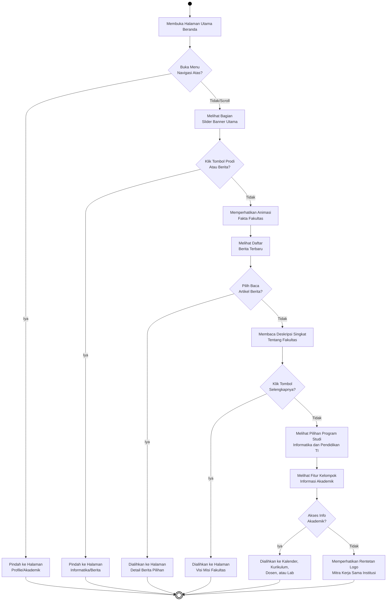
***Gambar 4.22** Activity Diagram Interaksi Halaman Beranda (Home)*

**Penjelasan:**
Pengguna membuka halaman beranda dan memiliki beberapa jalur interaksi. Jika pengguna menggunakan menu navigasi atas, sistem langsung memindahkan ke halaman tujuan. Jika pengguna menggulir ke bawah, sistem menampilkan konten secara berurutan mulai dari *slider*, fakta fakultas, berita terbaru, deskripsi fakultas, pilihan program studi, hingga logo mitra kerjasama. Pada setiap bagian, pengguna dapat mengklik untuk berpindah ke halaman yang lebih detail.

---

### 4.3.2 Activity Diagram Interaksi Halaman Visi dan Misi

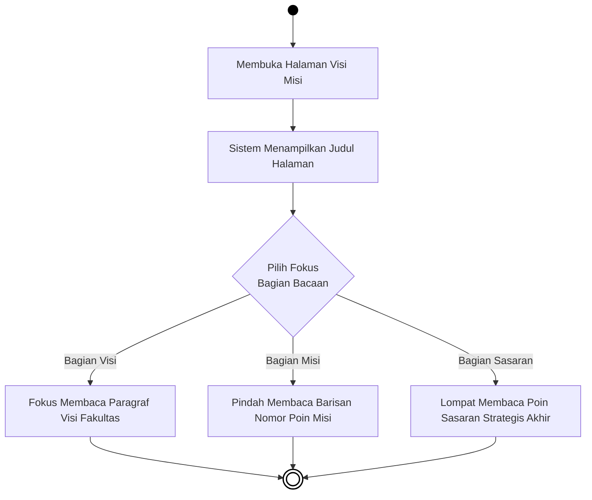
***Gambar 4.23** Activity Diagram Interaksi Halaman Visi dan Misi*

**Penjelasan:**
Setelah halaman terbuka, pengguna dapat memilih untuk membaca salah satu dari tiga bagian konten yang tersedia, yaitu Visi, Misi, atau Sasaran Strategis Fakultas. Sistem menampilkan konten yang dipilih dan aktivitas berakhir setelah pengguna selesai membaca bagian tersebut.

---

### 4.3.3 Activity Diagram Interaksi Halaman Sambutan Pimpinan

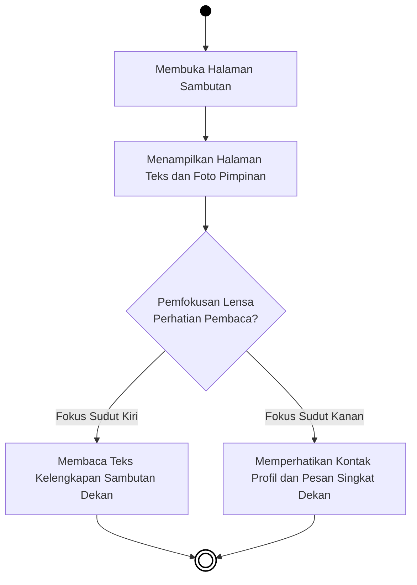
***Gambar 4.24** Activity Diagram Interaksi Halaman Sambutan*

**Penjelasan:**
Sistem memuat halaman yang menampilkan teks sambutan lengkap dan foto pimpinan secara bersamaan. Pengguna dapat memilih untuk fokus membaca narasi sambutan Dekan di sisi kiri, atau melihat informasi kontak singkat Dekan di sisi kanan halaman.

---

### 4.3.4 Activity Diagram Interaksi Direktori Dosen

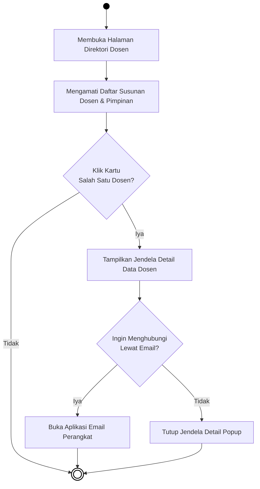
***Gambar 4.25** Activity Diagram Interaksi Direktori Dosen*

**Penjelasan:**
Sistem menampilkan daftar kartu dosen dan pimpinan fakultas. Jika pengguna mengklik salah satu kartu, sistem memunculkan jendela *popup* berisi detail informasi dosen tersebut. Dari jendela *popup*, pengguna dapat langsung menghubungi dosen melalui email atau menutup jendela untuk kembali ke daftar.

---

### 4.3.5 Activity Diagram Interaksi Halaman Struktur Organisasi

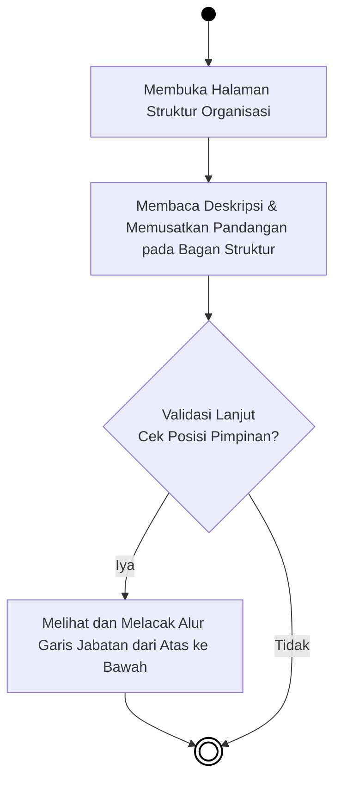
***Gambar 4.26** Activity Diagram Interaksi Halaman Struktur Organisasi*

**Penjelasan:**
Sistem menampilkan bagan hierarki jabatan beserta deskripsi singkat struktur organisasi fakultas. Pengguna dapat menelusuri alur garis jabatan dari posisi tertinggi hingga ke bawah, atau cukup melihat sekilas bagan yang tersaji.

---

### 4.3.6 Activity Diagram Interaksi Halaman Pendaftaran Mahasiswa Baru

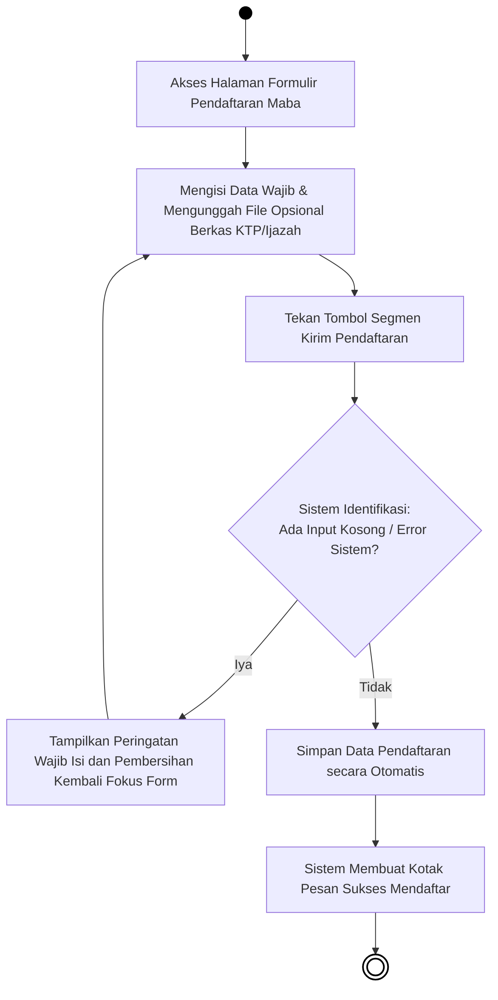
***Gambar 4.27** Activity Diagram Interaksi Halaman Pendaftaran Mahasiswa Baru*

**Penjelasan:**
Pengguna mengisi formulir pendaftaran beserta berkas pendukung, lalu menekan tombol kirim. Sistem memeriksa kelengkapan isian; jika ada data yang kosong atau tidak valid, sistem menampilkan peringatan agar diperbaiki. Jika semua data valid, sistem menyimpan data pendaftaran dan menampilkan notifikasi berhasil.

---

### 4.3.7 Activity Diagram Prodi TI (Informatika)

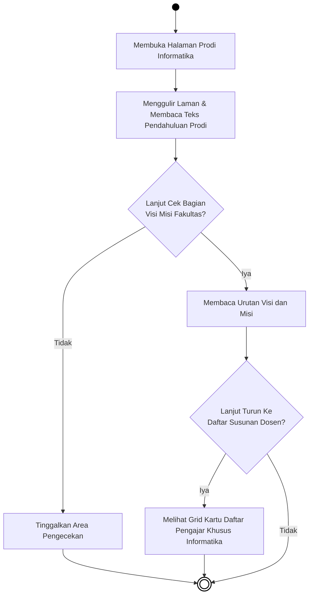
***Gambar 4.28** Activity Diagram Prodi TI (Informatika)*

**Penjelasan:**
Halaman Prodi Informatika menampilkan teks pendahuluan, lalu pengguna dapat melanjutkan ke bagian Visi dan Misi, kemudian ke daftar dosen yang ditampilkan dalam format kartu grid. Pengguna dapat berhenti di bagian mana saja sesuai kebutuhan.

---

### 4.3.8 Activity Diagram Prodi Pendidikan Teknologi Informasi (PTI)

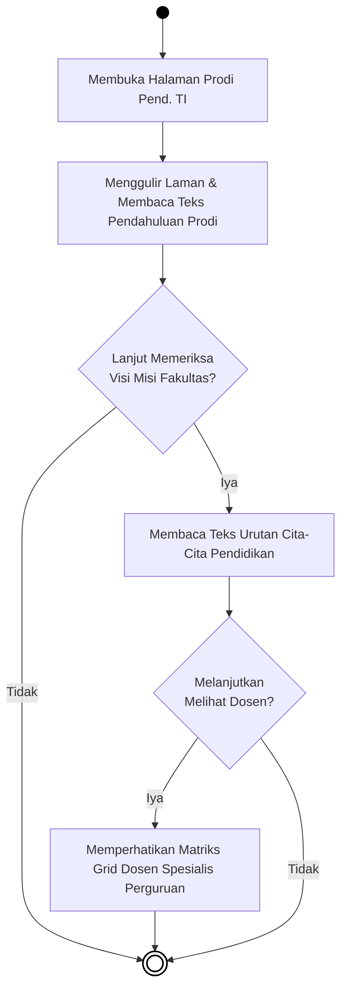
***Gambar 4.29** Activity Diagram Prodi Pend. TI*

**Penjelasan:**
Halaman Prodi PTI memiliki alur yang sama dengan Prodi Informatika, namun menampilkan data khusus Program Studi Pendidikan Teknologi Informasi. Pengguna dapat menelusuri pendahuluan, visi misi, dan daftar dosen PTI secara berurutan sesuai kebutuhan.

---

### 4.3.9 Activity Diagram Menu Ruangan Kelas

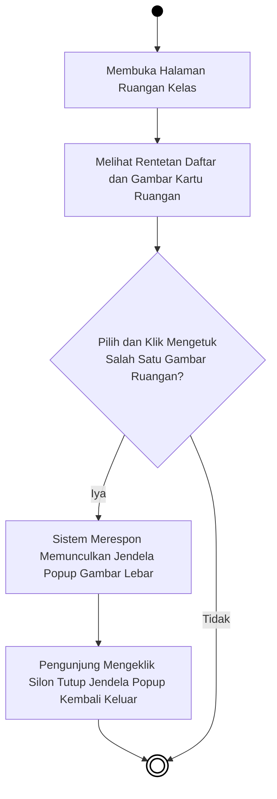
***Gambar 4.30** Activity Diagram Menu Ruangan Kelas*

**Penjelasan:**
Sistem menampilkan daftar kartu gambar ruangan kelas yang tersedia. Jika pengguna mengklik salah satu gambar, sistem membuka jendela *popup* yang menampilkan gambar tersebut dalam ukuran penuh. Pengguna menutup jendela dengan mengklik tombol silang untuk kembali ke daftar.

---

### 4.3.10 Activity Diagram Menu Laboratorium

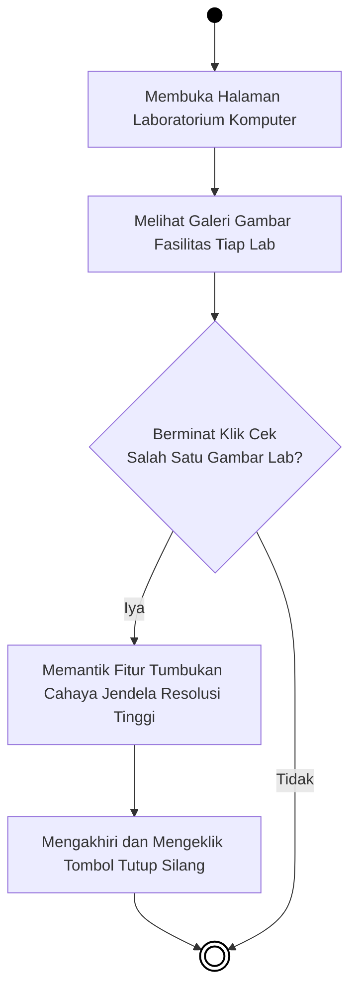
***Gambar 4.31** Activity Diagram Menu Laboratorium*

**Penjelasan:**
Sistem menampilkan galeri foto fasilitas setiap laboratorium komputer yang ada di fakultas. Pengguna dapat mengklik foto untuk melihatnya dalam ukuran besar, kemudian menutup tampilan tersebut dengan tombol silang.

---

### 4.3.11 Activity Diagram Menu Kurikulum

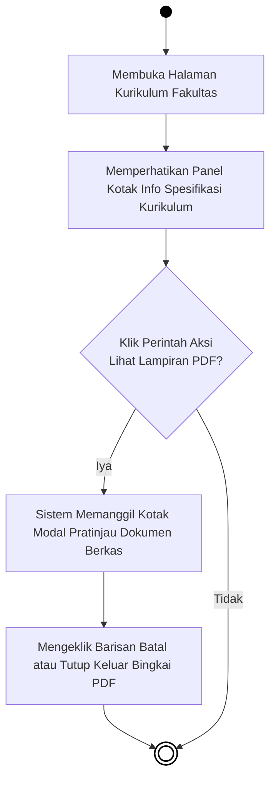
***Gambar 4.32** Activity Diagram Menu Kurikulum*

**Penjelasan:**
Sistem menampilkan panel informasi kurikulum akademik yang berlaku. Pengguna dapat mengklik tombol untuk membuka pratinjau dokumen PDF kurikulum secara langsung di dalam halaman, lalu menutupnya jika sudah selesai membaca.

---

### 4.3.12 Activity Diagram Menu Kalender Akademik

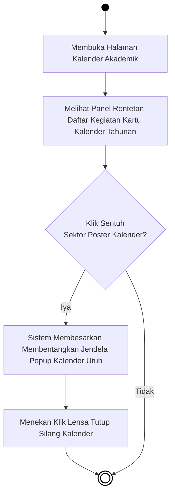
***Gambar 4.33** Activity Diagram Menu Kalender Akademik*

**Penjelasan:**
Sistem menampilkan daftar kartu kalender akademik per semester atau tahun ajaran. Pengguna dapat mengklik poster kalender untuk melihatnya dalam tampilan penuh melalui jendela *popup*, kemudian menutupnya dengan tombol silang.

---

### 4.3.13 Activity Diagram Menu Dokumen Fakultas

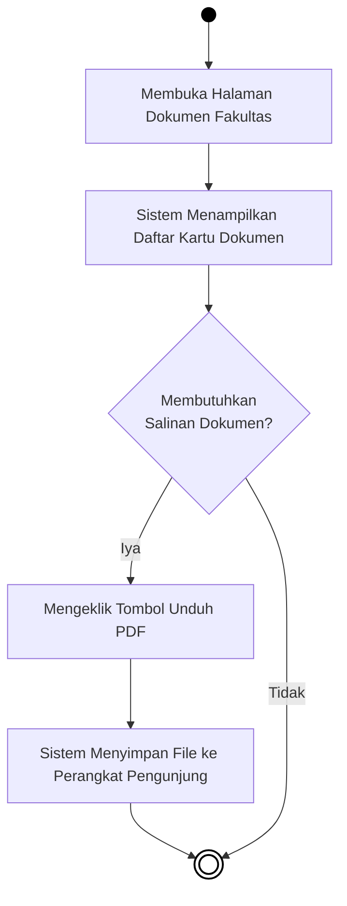
***Gambar 4.34** Activity Diagram Menu Dokumen Fakultas*

**Penjelasan:**
Sistem menampilkan daftar dokumen resmi fakultas (seperti Renop, Renstra, atau SOP) yang tersedia. Jika pengguna membutuhkan salinan, pengguna mengklik tombol unduh dan sistem secara otomatis menyimpan berkas PDF ke perangkat pengguna.

---

### 4.3.14 Activity Diagram Menu Rencana Strategis (Renstra)


***Gambar 4.35** Activity Diagram Menu Rencana Strategis*

**Penjelasan:**
Sistem menampilkan daftar dokumen Rencana Strategis (Renstra) yang tersedia untuk diakses publik. Pengguna yang memerlukan salinan dapat langsung mengunduh berkas PDF yang dipilih ke perangkat mereka.

---

### 4.3.15 Activity Diagram Menu Standar Operasional Prosedur (SOP)

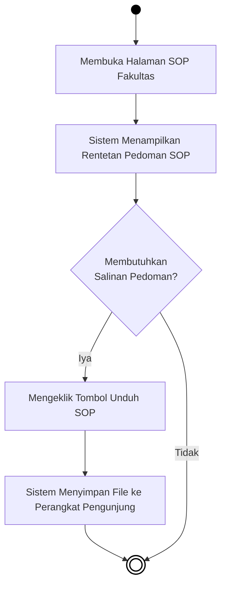
***Gambar 4.36** Activity Diagram Menu SOP*

**Penjelasan:**
Sistem menampilkan daftar pedoman Standar Operasional Prosedur (SOP) yang berlaku di lingkungan fakultas. Pengguna yang memerlukan salinan pedoman dapat mengunduhnya langsung ke perangkat masing-masing.

---

### 4.3.16 Activity Diagram Menu Penelitian Dosen

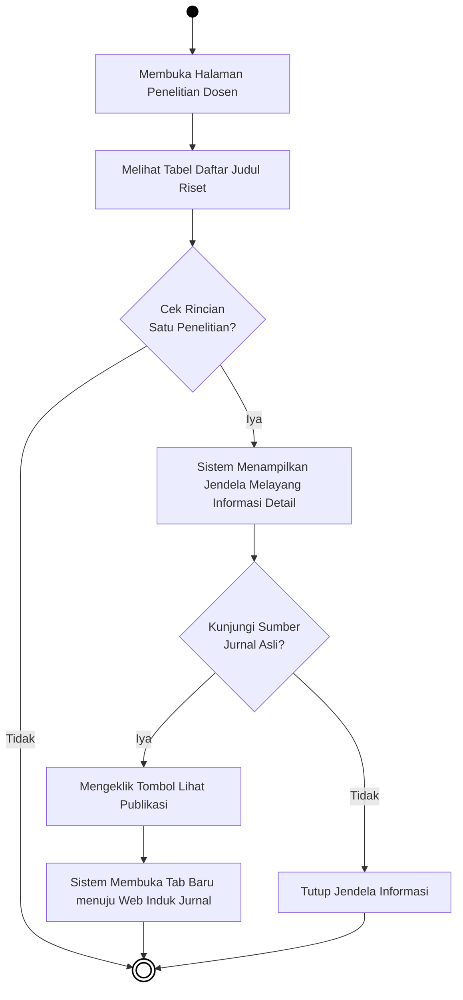
***Gambar 4.37** Activity Diagram Menu Penelitian Dosen*

**Penjelasan:**
Sistem menampilkan tabel daftar judul penelitian dosen fakultas. Pengguna dapat mengklik salah satu judul untuk melihat detail penelitian melalui jendela *popup*. Dari jendela tersebut, pengguna juga dapat mengunjungi sumber jurnal asli yang akan dibuka di tab baru peramban.

---

### 4.3.17 Activity Diagram Menu Pengabdian Masyarakat

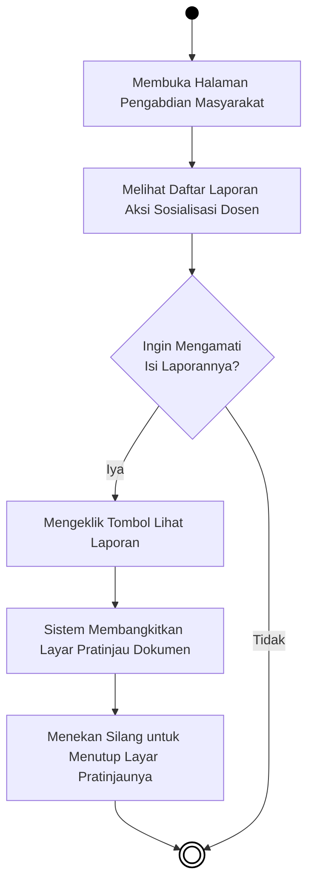
***Gambar 4.38** Activity Diagram Menu Pengabdian Masyarakat*

**Penjelasan:**
Sistem menampilkan daftar laporan kegiatan pengabdian masyarakat yang telah dilaksanakan oleh dosen. Pengguna dapat mengklik tombol "Lihat Laporan" untuk membuka pratinjau dokumen secara langsung, lalu menutupnya setelah selesai membaca.

---

### 4.3.18 Activity Diagram Menu Badan Eksekutif Mahasiswa (BEM)

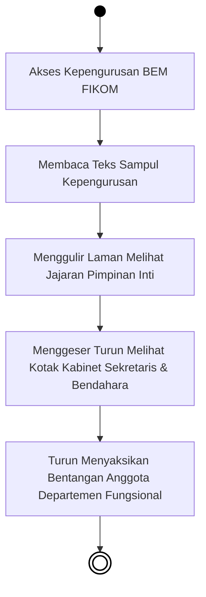
***Gambar 4.39** Activity Diagram Menu Badan Eksekutif Mahasiswa (BEM)*

**Penjelasan:**
Halaman BEM menampilkan konten secara berurutan dari atas ke bawah tanpa persimpangan pilihan. Pengguna melihat teks pengantar, jajaran pimpinan inti, susunan kabinet, hingga daftar anggota departemen fungsional BEM FIKOM.

---

### 4.3.19 Activity Diagram Menu Kegiatan UKM

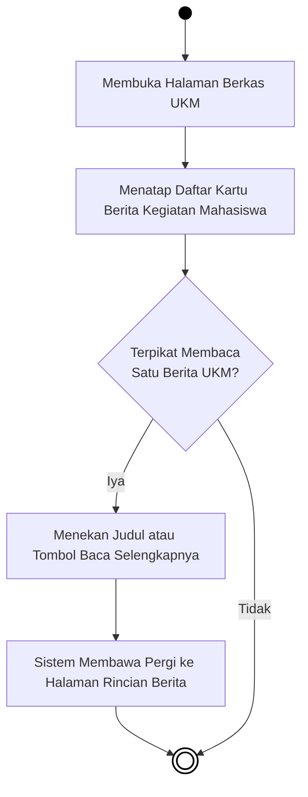
***Gambar 4.40** Activity Diagram Menu Kegiatan UKM*

**Penjelasan:**
Sistem menampilkan daftar kartu berita kegiatan Unit Kegiatan Mahasiswa (UKM). Jika pengguna tertarik membaca salah satu berita, pengguna mengklik judul atau tombol "Baca Selengkapnya" dan sistem mengarahkan ke halaman detail berita tersebut.

---

### 4.3.20 Activity Diagram Menu Himpunan Mahasiswa

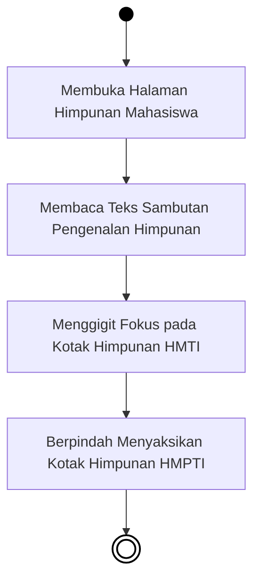
***Gambar 4.41** Activity Diagram Menu Himpunan Mahasiswa*

**Penjelasan:**
Halaman Himpunan Mahasiswa menampilkan konten secara linear. Pengguna membaca teks pengantar, kemudian melihat informasi Himpunan Mahasiswa Teknik Informatika (HMTI), dilanjutkan dengan Himpunan Mahasiswa Pendidikan Teknologi Informasi (HMPTI).

---

### 4.3.21 Activity Diagram Menu Alumni (Tracer Study)

```mermaid
flowchart TD
    Start(( )) --> A[Membuka Halaman Alumni & Tracer Study]
    
    A --> B[Sistem Menampilkan Statistik Sebaran Alumni]
    B --> C[Melihat Persentase Kebekerjaan & Masa Tunggu]
    
    C --> D{Ingin Mengisi\nTracer Study?}
    
    D -- Iya --> E[Mengeklik Tombol Isi Form Tracer Study]
    E --> F[Sistem Mengarahkan ke Web Eksternal Tracer Study]
    F --> End((( )))
    
    D -- Tidak --> End
    
    style Start fill:#000,stroke:#000,color:#000
    style End fill:#fff,stroke:#000,stroke-width:2px
```
***Gambar 4.42** Activity Diagram Menu Alumni*

**Penjelasan:**
Sistem memuat halaman alumni yang menyajikan data statistik riwayat lulusan. Pengguna dapat melihat grafik atau angka pencapaian alumni. Jika pengguna adalah alumni yang ingin berkontribusi data, pengguna dapat mengklik tombol "Isi Form Tracer Study" yang akan mengarahkan ke platform eksternal resmi kemdikbud.
