# BAB IV — PERANCANGAN SISTEM: 4.1.2 Activity Diagram (Publik)

## 4.1.2 Pengertian *Activity Diagram* Sisi Pengunjung
*Activity Diagram* (Diagram Aktivitas) berikut ini menjabarkan urutan proses pada sistem saat diakses secara terbuka oleh **Sivitas Akademika, Calon Mahasiswa, maupun Masyarakat Umum**. Tidak seperti struktur Administrator, akses di ranah Publik ini (*Frontend*) tidak membutuhkan tahapan *login*, melainkan memodelkan interaksi nyata antara antarmuka (*User Interface*) dengan pilihan navigasi pengunjung (seperti kehendak mengklik tombol, membaca rincian, atau melakukan *scroll*). Lingkaran penuh berwarna solid menandai *Start Node* (titik permulaan pengguna membuka halaman), *Decision Node* (bentuk ketupat) merepresentasikan persimpangan pilihan pengguna, dan lingkaran dengan batas garis ganda menunjukkan *End Node* (titik akhir kegiatan di suatu halaman).

---

## 4.3 Alur Aktivitas Publik (Pengunjung)

### 4.3.1 Activity Diagram Interaksi Halaman Beranda (Home)

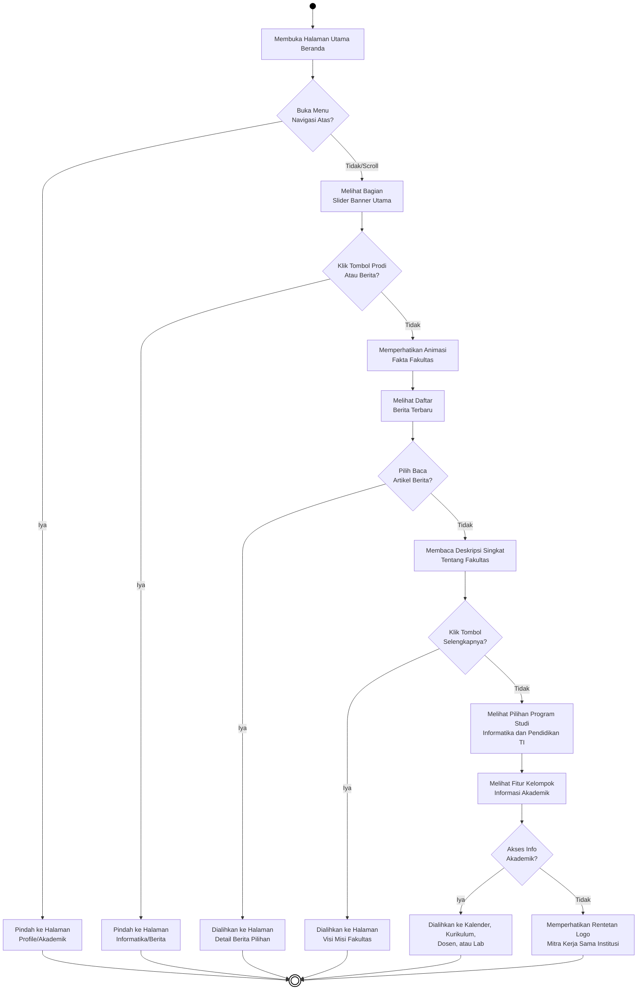
***Gambar 4.22** Activity Diagram Interaksi Halaman Beranda (Home)*

**Penjelasan:**
Alur interaksi dimulai ketika pengguna membuka halaman utama beranda. Pada titik pertama, sistem menyajikan menu navigasi di bagian atas halaman. Apabila pengguna langsung memilih salah satu menu navigasi, sistem akan memindahkan pengguna ke halaman yang dituju, misalnya halaman Profil atau Akademik, dan aktivitas di beranda pun berakhir. Namun jika pengguna memilih untuk terus menggulir ke bawah, sistem akan menampilkan bagian *slider* banner utama. Di sini terdapat pilihan untuk mengklik tombol menuju halaman Program Studi Informatika atau halaman Berita; jika dipilih, pengguna langsung diarahkan ke halaman tersebut. Jika tidak ada klik, sistem menampilkan animasi fakta singkat tentang fakultas, kemudian dilanjutkan dengan daftar berita terbaru. Saat pengguna memilih untuk membaca salah satu berita, sistem mengalihkan tampilan ke halaman detail berita yang bersangkutan. Jika tidak ada berita yang dipilih, pengguna akan melihat deskripsi singkat tentang fakultas yang dilengkapi tombol "Selengkapnya"; jika tombol tersebut diklik, sistem membawa pengguna ke halaman Visi dan Misi. Jika tidak, halaman beranda menampilkan pilihan dua program studi beserta fitur kelompok informasi akademik seperti Kalender, Kurikulum, Dosen, dan Laboratorium. Apabila pengguna mengakses salah satu fitur tersebut, sistem langsung mengarahkannya. Apabila tidak ada tindakan lebih lanjut, pengguna akan melihat barisan logo mitra kerja sama instansi, yang menjadi bagian terakhir dari halaman beranda sebelum aktivitas berakhir.

---

### 4.3.2 Activity Diagram Interaksi Halaman Visi dan Misi

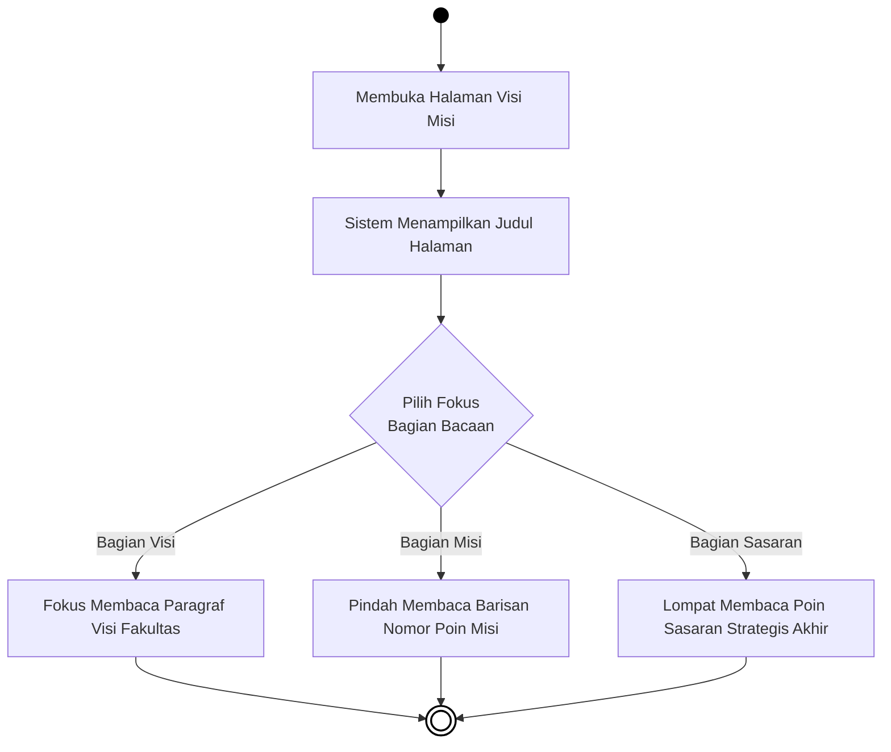
***Gambar 4.23** Activity Diagram Interaksi Halaman Visi dan Misi*

**Penjelasan:**
Alur ini dimulai ketika pengguna mengakses halaman Visi dan Misi. Sistem kemudian menampilkan judul halaman sebagai penanda awal konten. Setelah judul termuat, pengguna dihadapkan pada tiga bagian konten yang dapat dipilih sesuai kebutuhan, yaitu bagian Visi, bagian Misi, dan bagian Sasaran Strategis. Jika pengguna memilih untuk membaca paragraf Visi Fakultas, system memfokuskan tampilan ke bagian tersebut. Jika pengguna lebih tertarik pada butir-butir Misi, sistem menampilkan daftar poin misi secara berurutan. Sementara jika pengguna memilih bagian Sasaran Strategis, tampilan diarahkan ke bagian paling bawah halaman yang memuat poin-poin sasaran tersebut. Ketiga jalur tersebut masing-masing berujung pada akhir aktivitas di halaman ini setelah pengguna selesai membaca bagian yang dipilihnya.

---

### 4.3.3 Activity Diagram Interaksi Halaman Sambutan Pimpinan

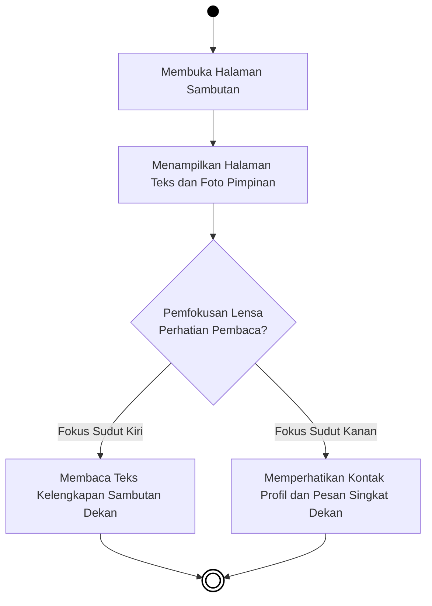
***Gambar 4.24** Activity Diagram Interaksi Halaman Sambutan*

**Penjelasan:**
Alur dimulai ketika pengguna membuka halaman Sambutan Pimpinan. Sistem kemudian memuat seluruh konten halaman yang mencakup teks sambutan dan foto pimpinan secara bersamaan. Setelah halaman termuat, perhatian pengguna dapat diarahkan ke dua sisi konten yang berbeda. Jika pengguna memusatkan perhatian ke sisi kiri halaman, sistem memfasilitasi pembacaan narasi teks sambutan lengkap dari Dekan Fakultas. Sebaliknya, jika pengguna lebih memperhatikan sisi kanan halaman, sistem menampilkan informasi kontak profil dan pesan singkat Dekan. Kedua jalur tersebut berakhir setelah pengguna selesai mengamati bagian yang dipilihnya, menandai berakhirnya aktivitas di halaman ini.

---

### 4.3.4 Activity Diagram Interaksi Direktori Dosen

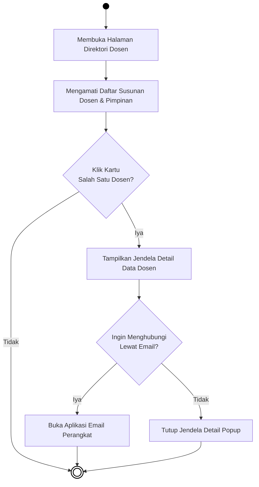
***Gambar 4.25** Activity Diagram Interaksi Direktori Dosen*

**Penjelasan:**
Alur dimulai ketika pengguna membuka halaman Direktori Dosen. Sistem langsung memuat dan menampilkan susunan kartu-kartu dosen beserta pimpinan yang terdaftar di fakultas. Apabila pengguna tidak tertarik untuk mengklik kartu dosen manapun, aktivitas di halaman ini langsung berakhir. Namun jika pengguna mengklik salah satu kartu dosen, sistem akan memunculkan jendela *popup* yang berisi detail informasi dosen yang dipilih, seperti nama, jabatan, dan kontak. Dari jendela tersebut, pengguna dihadapkan pada dua pilihan: menghubungi dosen melalui email atau menutup jendela. Apabila pengguna memilih untuk mengirim email, sistem akan membuka aplikasi email yang tersedia di perangkat pengguna. Jika tidak, pengguna cukup menutup jendela *popup* tersebut, dan aktivitas pun berakhir.

---

### 4.3.5 Activity Diagram Interaksi Halaman Struktur Organisasi

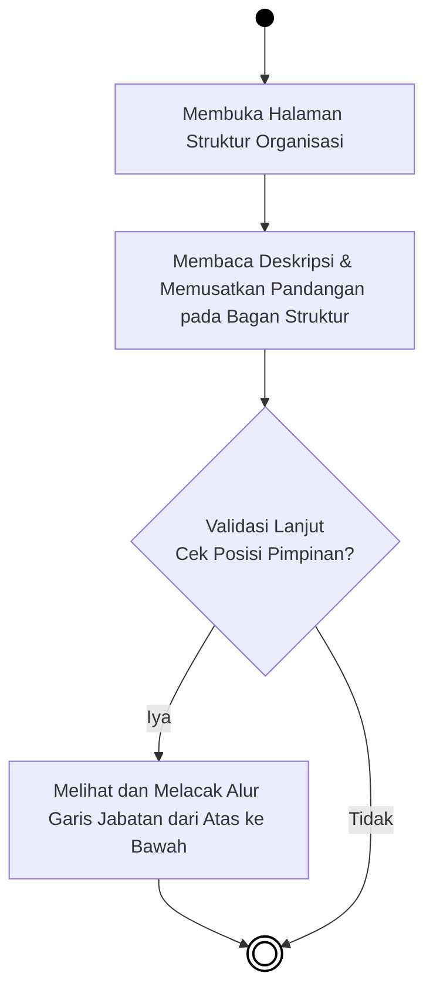
***Gambar 4.26** Activity Diagram Interaksi Halaman Struktur Organisasi*

**Penjelasan:**
Alur dimulai saat pengguna mengakses halaman Struktur Organisasi Fakultas. Sistem langsung memuat halaman yang berisi teks deskripsi serta bagan hierarki jabatan. Pengguna kemudian membaca deskripsi dan memusatkan pandangan pada bagan struktural tersebut. Jika pengguna ingin menelusuri lebih lanjut posisi setiap pimpinan, sistem memfasilitasi pelacakan alur garis jabatan secara berurutan dari posisi tertinggi hingga ke bawah, setelah itu aktivitas berakhir. Sebaliknya, jika pengguna hanya sekadar melihat tanpa menelusuri lebih lanjut, aktivitas di halaman ini langsung berakhir tanpa tindakan tambahan.

---

### 4.3.6 Activity Diagram Interaksi Halaman Pendaftaran Mahasiswa Baru

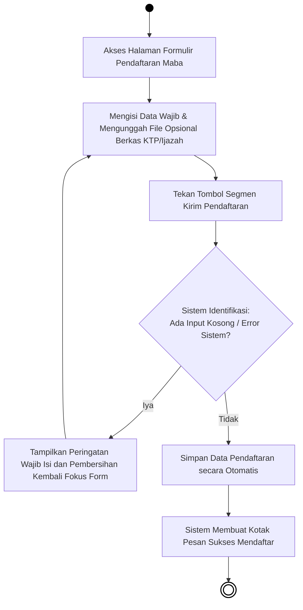
***Gambar 4.27** Activity Diagram Interaksi Halaman Pendaftaran Mahasiswa Baru*

**Penjelasan:**
Alur dimulai ketika pengguna mengakses halaman formulir Pendaftaran Mahasiswa Baru. Pengguna kemudian mengisi seluruh data yang diwajibkan oleh sistem, seperti nama, alamat, dan informasi pribadi lainnya, sekaligus mengunggah berkas pendukung seperti foto KTP atau ijazah apabila diminta. Setelah semua isian dirasa lengkap, pengguna menekan tombol "Kirim Pendaftaran". Sistem kemudian melakukan identifikasi terhadap formulir yang dikirimkan. Apabila ditemukan kolom yang masih kosong atau terdapat kesalahan input, sistem akan menampilkan pesan peringatan dan mengembalikan fokus ke bagian formulir yang bermasalah, sehingga pengguna harus mengisi ulang dan mengirimkan kembali. Namun apabila seluruh data terisi dengan benar dan valid, sistem secara otomatis menyimpan data pendaftaran ke dalam pangkalan data, kemudian menampilkan kotak pesan konfirmasi yang memberitahukan bahwa proses pendaftaran telah berhasil dilakukan. Pada titik inilah aktivitas di halaman pendaftaran dinyatakan selesai.

---

### 4.3.7 Activity Diagram Prodi TI (Informatika)

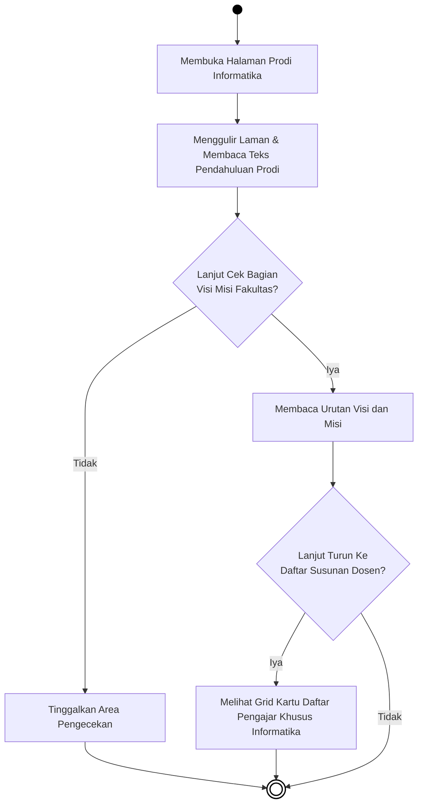
***Gambar 4.28** Activity Diagram Prodi TI (Informatika)*

**Penjelasan:**
Alur dimulai saat pengguna membuka halaman Program Studi Teknik Informatika. Sistem memuat halaman yang diawali dengan teks pendahuluan yang mendeskripsikan program studi secara singkat. Pengguna langsung dapat menggulir dan membaca teks pengantar tersebut. Setelah itu, terdapat persimpangan pilihan: apabila pengguna ingin melanjutkan membaca bagian Visi dan Misi, sistem menampilkan urutan visi dan misi yang berlaku untuk program studi Informatika. Dari bagian tersebut, pengguna dapat melanjutkan ke bawah untuk melihat daftar dosen yang ditampilkan dalam format kartu grid; jika pengguna memilih untuk melihat daftar dosen tersebut, sistem menampilkannya secara lengkap dan aktivitas berakhir. Jika tidak, aktivitas langsung berakhir dari bagian visi misi. Sebaliknya, apabila sejak awal pengguna tidak ingin menelusuri visi misi, pengguna dapat meninggalkan area tersebut dan aktivitas di halaman ini pun berakhir.

---

### 4.3.8 Activity Diagram Prodi Pendidikan Teknologi Informasi (PTI)

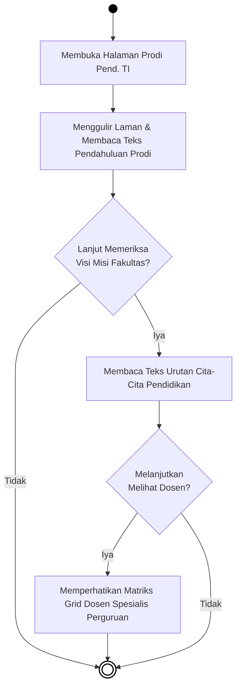
***Gambar 4.29** Activity Diagram Prodi Pend. TI*

**Penjelasan:**
Alur dimulai saat pengguna membuka halaman Program Studi Pendidikan Teknologi Informasi (PTI). Sistem memuat halaman dengan teks pendahuluan yang menjelaskan gambaran umum program studi tersebut. Pengguna membaca teks pendahuluan sambil menggulir layar. Kemudian terdapat persimpangan: apabila pengguna ingin menelusuri lebih lanjut, sistem menampilkan bagian Visi dan Misi yang memuat cita-cita dan arah pendidikan dari program studi PTI. Setelah membaca visi misi, pengguna dapat memilih untuk melanjutkan melihat daftar dosen spesialis PTI yang ditampilkan dalam format grid; jika dipilih, sistem menampilkan kartu-kartu dosen yang bersangkutan sebelum aktivitas berakhir. Jika pengguna tidak ingin melihat daftar dosen, aktivitas berakhir setelah bagian visi misi. Sebaliknya, jika sejak awal pengguna tidak tertarik melihat visi misi, aktivitas di halaman ini langsung berakhir.

---

### 4.3.9 Activity Diagram Menu Ruangan Kelas

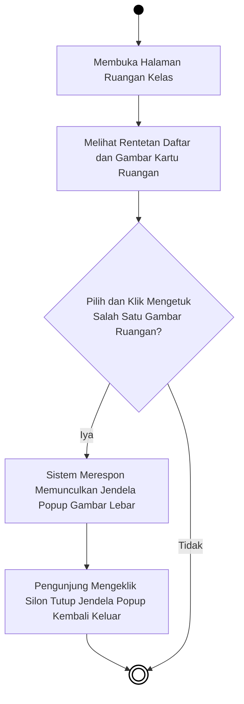
***Gambar 4.30** Activity Diagram Menu Ruangan Kelas*

**Penjelasan:**
Alur dimulai saat pengguna membuka halaman Ruangan Kelas. Sistem langsung memuat dan menampilkan daftar ruangan yang tersedia dalam bentuk kartu-kartu gambar yang tersusun rapi. Pengguna kemudian mengamati deretan kartu ruangan tersebut. Apabila pengguna tertarik mengklik salah satu gambar ruangan untuk melihat lebih jelas, sistem merespons dengan memunculkan jendela *popup* yang menampilkan gambar ruangan tersebut dalam ukuran yang lebih besar. Setelah selesai melihat, pengguna cukup mengklik tombol silang untuk menutup jendela *popup*, dan aktivitas di halaman ini pun berakhir. Jika sejak awal pengguna tidak mengklik gambar apapun, aktivitas langsung berakhir setelah melihat daftar ruangan.

---

### 4.3.10 Activity Diagram Menu Laboratorium

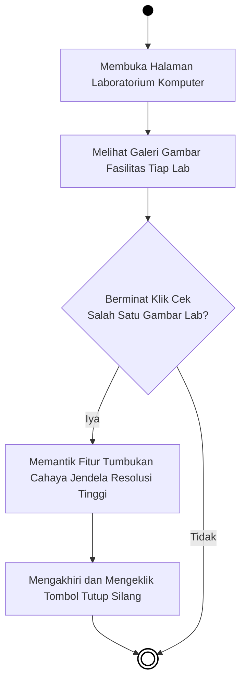
***Gambar 4.31** Activity Diagram Menu Laboratorium*

**Penjelasan:**
Alur dimulai saat pengguna membuka halaman Laboratorium Komputer. Sistem memuat halaman yang menampilkan galeri gambar fasilitas dari setiap laboratorium yang tersedia di fakultas. Pengguna dapat melihat-lihat koleksi gambar tersebut. Apabila pengguna ingin melihat salah satu gambar laboratorium secara lebih detail, pengguna mengklik gambar yang diinginkan. Sistem kemudian merespons dengan membuka jendela *popup* yang menampilkan gambar tersebut dalam resolusi tinggi dan tampilan melebar. Setelah puas melihat, pengguna mengklik tombol silang untuk menutup jendela, dan aktivitas di halaman ini berakhir. Jika pengguna tidak mengklik gambar apapun, aktivitas langsung berakhir tanpa interaksi tambahan.

---

### 4.3.11 Activity Diagram Menu Kurikulum

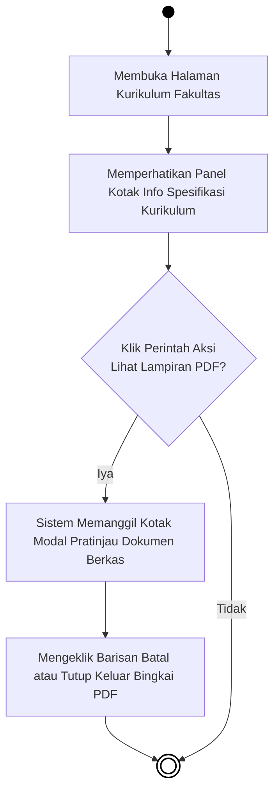
***Gambar 4.32** Activity Diagram Menu Kurikulum*

**Penjelasan:**
Alur dimulai saat pengguna membuka halaman Kurikulum Fakultas. Sistem memuat halaman yang langsung menampilkan panel berisi informasi spesifikasi kurikulum akademik yang berlaku. Pengguna mengamati panel informasi tersebut. Apabila pengguna ingin melihat dokumen kurikulum secara lengkap, pengguna mengklik tombol untuk membuka lampiran PDF. Sistem kemudian menampilkan jendela modal pratinjau yang menampilkan isi dokumen secara langsung tanpa harus meninggalkan halaman. Setelah selesai membaca atau menelusuri isi dokumen, pengguna menutup jendela modal dengan mengklik tombol batal atau tutup. Aktivitas di halaman Kurikulum pun berakhir. Jika pengguna tidak membuka lampiran PDF sama sekali, aktivitas langsung berakhir setelah melihat panel informasi kurikulum.

---

### 4.3.12 Activity Diagram Menu Kalender Akademik

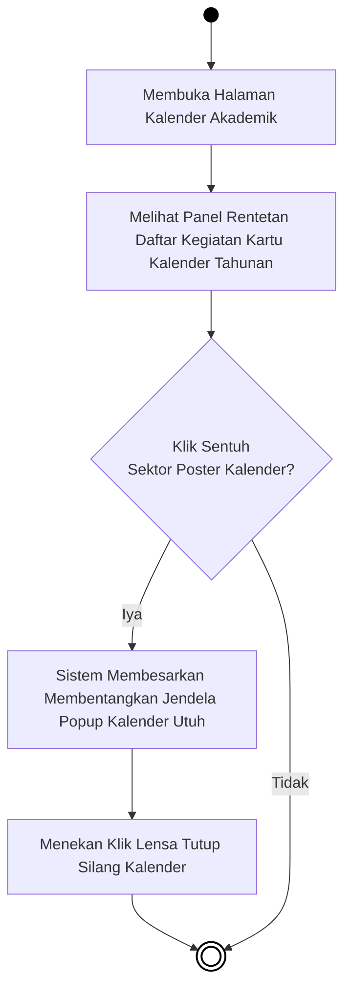
***Gambar 4.33** Activity Diagram Menu Kalender Akademik*

**Penjelasan:**
Alur dimulai ketika pengguna membuka halaman Kalender Akademik. Sistem memuat halaman yang menampilkan panel daftar kegiatan dalam bentuk kartu-kartu kalender tahunan. Pengguna dapat melihat rangkaian agenda akademik yang tersaji. Apabila pengguna ingin melihat salah satu kalender secara lebih jelas, pengguna mengklik pada area poster kalender yang diinginkan. Sistem merespons dengan memperbesar tampilan kalender tersebut ke dalam sebuah jendela *popup* yang melebar hingga memenuhi area pandang layar. Setelah selesai melihat, pengguna menutup jendela *popup* dengan menekan tombol silang, dan aktivitas di halaman ini berakhir. Jika pengguna tidak mengklik poster kalender manapun, aktivitas langsung berakhir setelah melihat panel daftar kalender.

---

### 4.3.13 Activity Diagram Menu Rencana Operasional (Renop)

***Gambar 4.34** Activity Diagram Menu Rencana Operasional*

**Penjelasan:**
Alur dimulai ketika pengguna mengakses halaman Rencana Operasional (Renop) Fakultas. Sistem langsung memuat dan menampilkan daftar kartu dokumen Renop yang tersedia. Pengguna kemudian melihat daftar tersebut dan mempertimbangkan apakah membutuhkan salinan dokumen. Apabila pengguna membutuhkan salinan, pengguna mengklik tombol "Unduh PDF" pada dokumen yang diinginkan. Sistem kemudian memproses permintaan unduhan dan menyimpan berkas PDF tersebut langsung ke perangkat pengguna, setelah itu aktivitas berakhir. Apabila pengguna tidak memerlukan salinan dokumen, aktivitas di halaman ini langsung berakhir setelah melihat daftar yang tersedia.

---

### 4.3.14 Activity Diagram Menu Rencana Strategis (Renstra)

***Gambar 4.35** Activity Diagram Menu Rencana Strategis*

**Penjelasan:**
Alur dimulai ketika pengguna mengakses halaman Rencana Strategis (Renstra) Fakultas. Sistem memuat halaman dan menampilkan daftar kartu dokumen Renstra yang telah tersedia. Pengguna mengamati daftar dokumen tersebut. Apabila pengguna ingin mendapatkan salinan dokumen Renstra, pengguna mengklik tombol "Unduh PDF" pada dokumen yang diperlukan. Sistem kemudian mengeksekusi proses unduhan dan menyimpan berkas PDF secara langsung ke perangkat pengguna, lalu aktivitas berakhir. Jika pengguna tidak memerlukan salinan dokumen, aktivitas di halaman ini cukup berakhir setelah melihat daftar yang tersaji tanpa tindakan unduhan apapun.

---

### 4.3.15 Activity Diagram Menu Standar Operasional Prosedur (SOP)

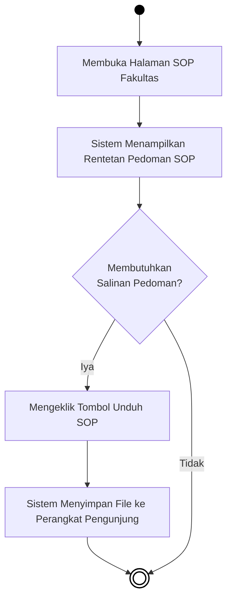
***Gambar 4.36** Activity Diagram Menu SOP*

**Penjelasan:**
Alur dimulai ketika pengguna mengakses halaman SOP (Standar Operasional Prosedur) Fakultas. Sistem memuat halaman dan langsung menampilkan daftar pedoman SOP yang berlaku di lingkungan fakultas. Pengguna kemudian melihat dan menelusuri daftar pedoman tersebut. Apabila pengguna membutuhkan salinan salah satu pedoman SOP, pengguna mengklik tombol "Unduh SOP" pada baris yang sesuai. Sistem kemudian memproses permintaan tersebut dan menyimpan berkas pedoman langsung ke perangkat pengguna, setelah itu aktivitas berakhir. Jika pengguna tidak memerlukan salinan, aktivitas di halaman ini berakhir setelah melihat daftar SOP yang tersedia.

---

### 4.3.16 Activity Diagram Menu Penelitian Dosen

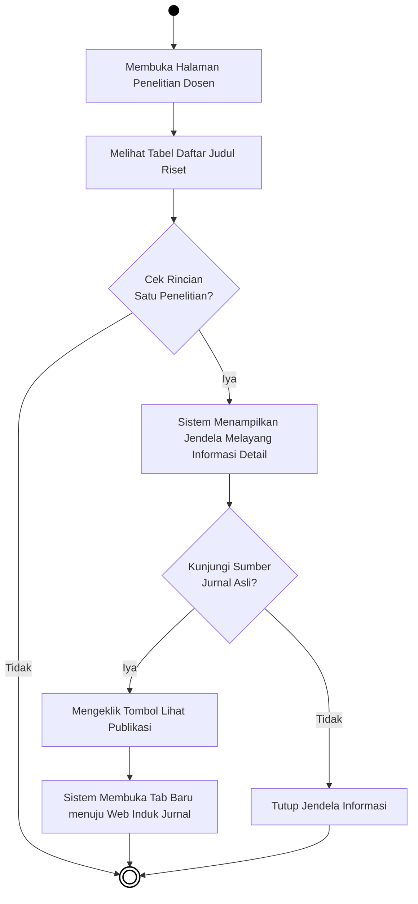
***Gambar 4.37** Activity Diagram Menu Penelitian Dosen*

**Penjelasan:**
Alur dimulai ketika pengguna membuka halaman Penelitian Dosen. Sistem memuat dan menampilkan tabel berisi daftar judul-judul riset yang pernah dilakukan oleh para dosen fakultas. Pengguna kemudian melihat tabel tersebut. Apabila pengguna tidak ingin menelusuri lebih lanjut, aktivitas di halaman ini langsung berakhir. Namun jika pengguna ingin melihat rincian dari salah satu penelitian, pengguna mengklik baris yang diinginkan; sistem kemudian merespons dengan menampilkan jendela melayang (*popup*) yang berisi informasi detail mengenai penelitian tersebut, seperti judul lengkap, abstrak, dan nama peneliti. Dari jendela tersebut, pengguna dihadapkan pada dua pilihan: jika ingin mengunjungi sumber jurnal aslinya, pengguna mengklik tombol "Lihat Publikasi" dan sistem akan membuka tab baru yang mengarahkan pengguna ke situs induk jurnal yang bersangkutan. Jika tidak, pengguna cukup menutup jendela informasi tersebut, dan aktivitas pun berakhir.

---

### 4.3.17 Activity Diagram Menu Pengabdian Masyarakat

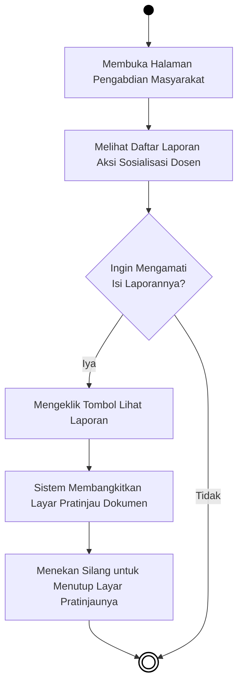
***Gambar 4.38** Activity Diagram Menu Pengabdian Masyarakat*

**Penjelasan:**
Alur dimulai ketika pengguna membuka halaman Pengabdian Masyarakat. Sistem memuat daftar laporan kegiatan pengabdian masyarakat yang telah dilakukan oleh para dosen dan civitas akademika fakultas. Pengguna kemudian melihat-lihat daftar laporan tersebut. Apabila pengguna tertarik untuk melihat isi dari salah satu laporan, pengguna mengklik tombol "Lihat Laporan" pada baris yang diinginkan. Sistem kemudian merespons dengan membuka layar pratinjau dokumen secara langsung di dalam halaman, sehingga pengguna dapat membaca isi laporan tanpa harus berpindah halaman. Setelah selesai membaca, pengguna menutup layar pratinjau dengan menekan tombol silang, dan aktivitas di halaman ini berakhir. Jika pengguna tidak ingin membaca isi laporan manapun, aktivitas langsung berakhir setelah melihat daftar yang tersedia.

---

### 4.3.18 Activity Diagram Menu Badan Eksekutif Mahasiswa (BEM)

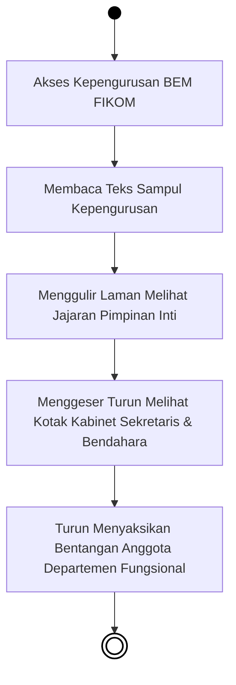
***Gambar 4.39** Activity Diagram Menu Badan Eksekutif Mahasiswa (BEM)*

**Penjelasan:**
Alur dimulai ketika pengguna mengakses halaman kepengurusan Badan Eksekutif Mahasiswa (BEM) FIKOM. Berbeda dengan halaman-halaman lain yang memiliki persimpangan pilihan, halaman BEM mengikuti alur linear dari atas ke bawah sesuai urutan tata letak konten. Setelah halaman terbuka, sistem langsung menampilkan teks sampul yang memperkenalkan BEM secara umum, kemudian pengguna menggulir ke bawah untuk melihat jajaran pimpinan inti BEM. Pengguliran dilakukan secara berurutan: pengguna berikutnya menyaksikan susunan kabinet Sekretaris dan Bendahara, lalu terus turun untuk melihat seluruh anggota dari setiap departemen fungsional yang ada di bawah naungan BEM. Setelah seluruh konten halaman selesai ditampilkan dan ditelusuri, aktivitas di halaman ini berakhir.

---

### 4.3.19 Activity Diagram Menu Kegiatan UKM

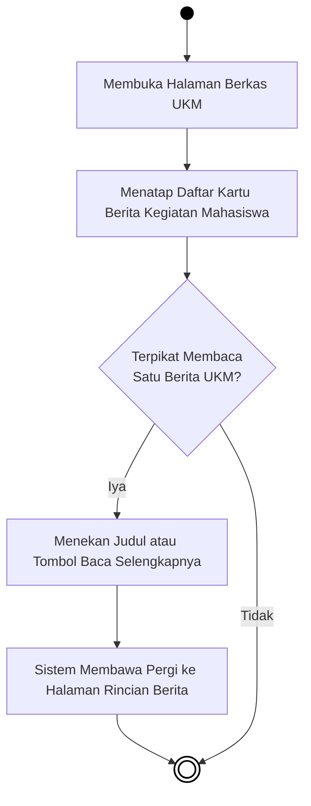
***Gambar 4.40** Activity Diagram Menu Kegiatan UKM*

**Penjelasan:**
Alur dimulai ketika pengguna membuka halaman Kegiatan UKM (Unit Kegiatan Mahasiswa). Sistem memuat dan menampilkan daftar kartu berita yang berisi berbagai kegiatan dan aktivitas yang telah dilakukan oleh unit-unit kegiatan mahasiswa di fakultas. Pengguna kemudian melihat-lihat kartu berita tersebut. Apabila salah satu berita menarik perhatian dan pengguna ingin membacanya secara lebih lengkap, pengguna mengklik judul atau tombol "Baca Selengkapnya" pada kartu berita yang dipilih. Sistem kemudian mengarahkan pengguna ke halaman rincian berita tersebut, dan aktivitas beralih ke halaman baru hingga berakhir. Jika pengguna tidak tertarik membaca berita apapun, aktivitas di halaman Kegiatan UKM langsung berakhir.

---

### 4.3.20 Activity Diagram Menu Himpunan Mahasiswa

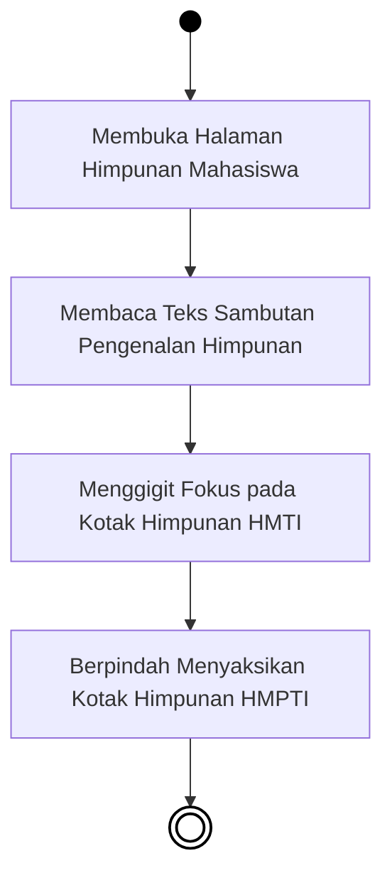
***Gambar 4.41** Activity Diagram Menu Himpunan Mahasiswa*

**Penjelasan:**
Alur dimulai ketika pengguna membuka halaman Himpunan Mahasiswa. Seperti halaman BEM, halaman ini juga mengikuti alur linear tanpa persimpangan pilihan. Setelah halaman terbuka, sistem menampilkan teks sambutan yang memperkenalkan kedua himpunan mahasiswa yang ada di FIKOM. Pengguna membaca teks pengantar tersebut, kemudian perhatian diarahkan ke kotak informasi Himpunan Mahasiswa Teknik Informatika (HMTI) yang menampilkan profil dan informasi singkat tentang himpunan tersebut. Setelah itu, halaman berlanjut ke kotak informasi Himpunan Mahasiswa Pendidikan Teknologi Informasi (HMPTI). Setelah seluruh konten dari kedua himpunan selesai ditampilkan dan dibaca oleh pengguna, aktivitas di halaman ini dinyatakan berakhir.
