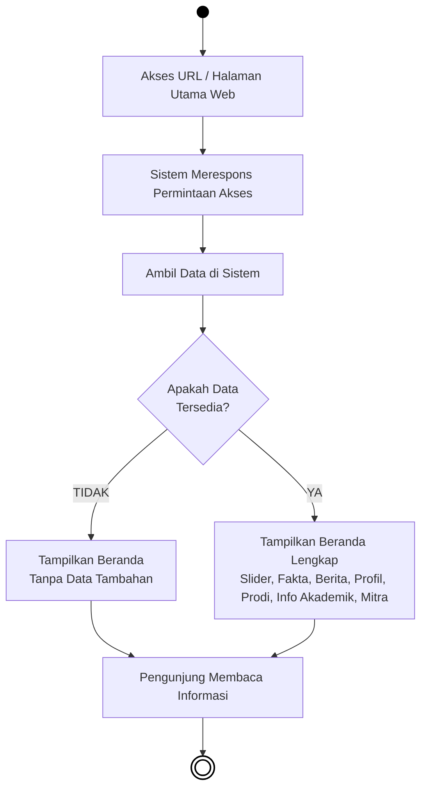

# BAB IV — PERANCANGAN SISTEM: 4.1.2 Activity Diagram (Publik)

## 4.1.2 Pengertian *Activity Diagram* Sisi Pengunjung
*Activity Diagram* (Diagram Aktivitas) berikut ini menjabarkan urutan proses pada sistem saat diakses secara terbuka oleh **Sivitas Akademika, Calon Mahasiswa, maupun Masyarakat Umum**. Tidak seperti struktur Administrator, akses di ranah Publik ini (*Frontend*) tidak membutuhkan tahapan *login*, melainkan berfokus pada kegiatan pencarian informasi, pengunduhan berkas, membaca berita, hingga partisipasi mendaftar. Diagram tetap menggunakan pola model *flowchart* konvensional agar mudah dimengerti. Komponen lingkaran penuh berwarna solid menandai *Start Node* (titik permulaan pengguna mengakses web), dan lingkaran dengan batas garis ganda menunjukkan *End Node* (titik akhir kegiatan).

---

## 4.3 Alur Aktivitas Publik (Pengunjung)

### 4.3.1 Activity Diagram Akses Halaman Beranda (Home)

***Gambar 4.22** Activity Diagram Akses Halaman Beranda (Home)*

**Penjelasan:**  
Sebagai antarmuka penyambutan pertama, halaman *Home* (Beranda) menawarkan informasi sekilas dengan muatan melimpah namun padat. Proses ini diawali dari kunjungan alamat web (URL) fakultas oleh pengunjung publik. Untuk memunculkannya, mesin sistem utama seketika menghubungi *database* untuk mengambil sekumpulan data penting yang mencakup: gambar promosi gulir (*Slider*), data bilangan statistik (*Fakta Fakultas*), cuplikan warta terkini (*Berita*), ringkasan sejarah (*Tentang Fakultas*), hingga aset logo relasi (*Mitra Kerja Sama*). Di titik pemeriksaan ini, program mengevaluasi apakah seluruh informasi tersebut kosong atau eksis. Andai koleksi data basis utamanya benar-benar rumpang, sistem memotong pelaporannya ke wujud tampilan beranda polosan tanpa elemen data dinamis. Akan tetapi di skenario sempurnanya tatkala data sukses dibawa keluar, penampang halaman utama dimuat sempurna menjembrengkan semua komponen kebesaran fakultas (mulai dari *Slider*, *Fakta*, *Berita*, *Tentang*, *Program Studi*, tautan *Informasi Akademik*, dan selasar *Mitra*) untuk ditelusuri pengunjung dengan keleluasaan penuh.
