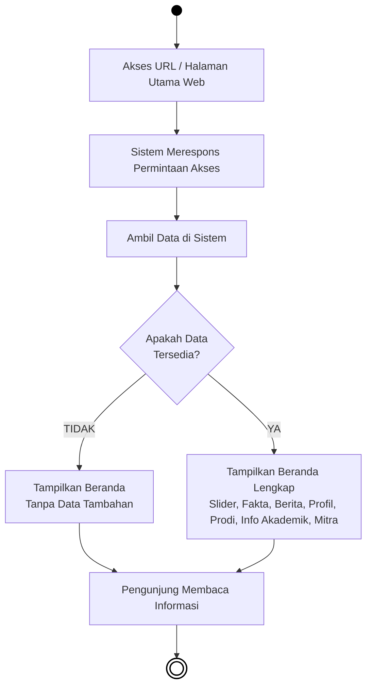
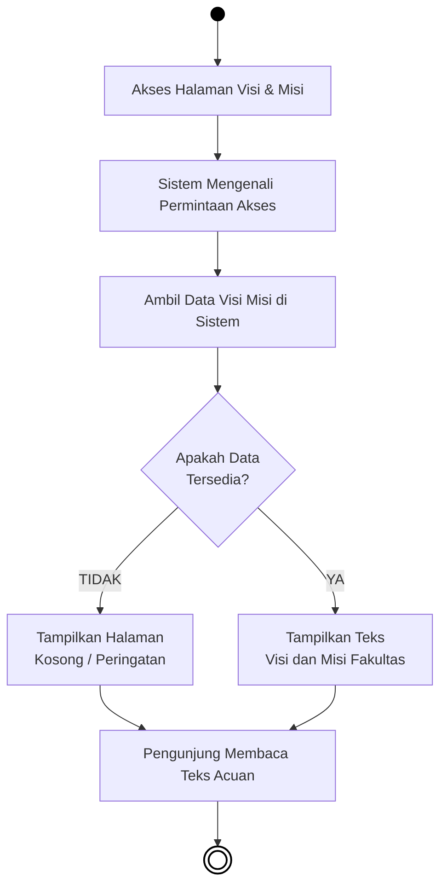
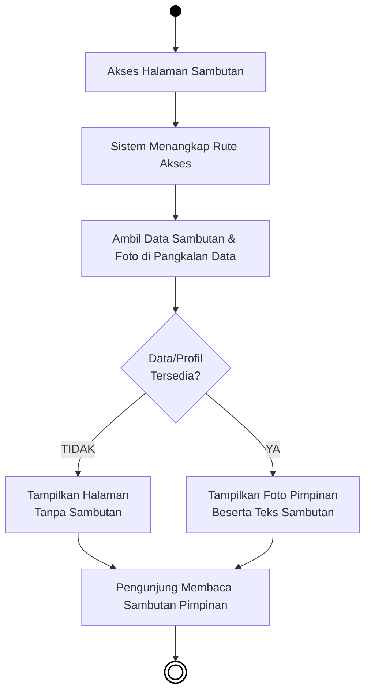
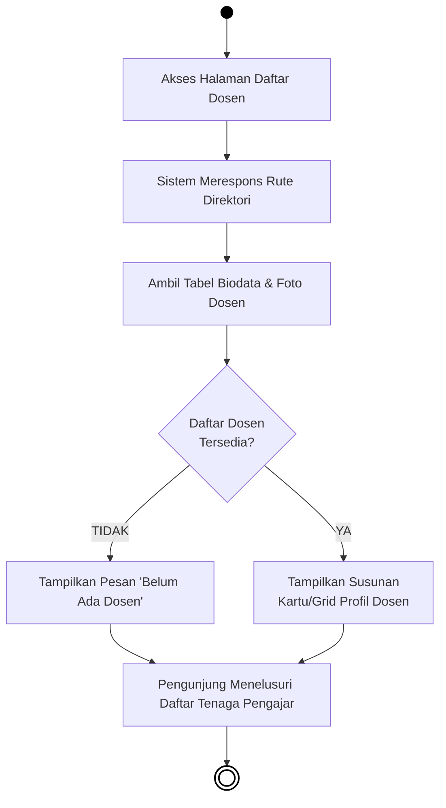
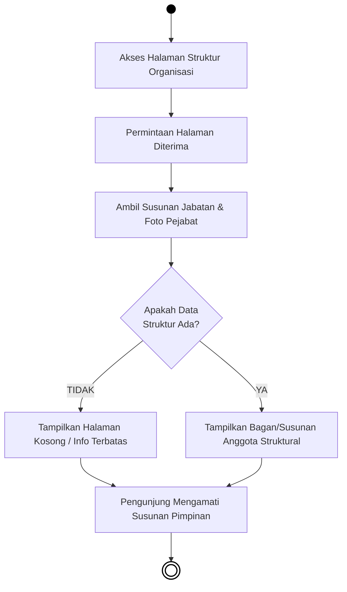

# BAB IV — PERANCANGAN SISTEM: 4.1.2 Activity Diagram (Publik)

## 4.1.2 Pengertian *Activity Diagram* Sisi Pengunjung
*Activity Diagram* (Diagram Aktivitas) berikut ini menjabarkan urutan proses pada sistem saat diakses secara terbuka oleh **Sivitas Akademika, Calon Mahasiswa, maupun Masyarakat Umum**. Tidak seperti struktur Administrator, akses di ranah Publik ini (*Frontend*) tidak membutuhkan tahapan *login*, melainkan berfokus pada kegiatan pencarian informasi, pengunduhan berkas, membaca berita, hingga partisipasi mendaftar. Diagram tetap menggunakan pola model *flowchart* konvensional agar mudah dimengerti. Komponen lingkaran penuh berwarna solid menandai *Start Node* (titik permulaan pengguna mengakses web), dan lingkaran dengan batas garis ganda menunjukkan *End Node* (titik akhir kegiatan).

---

## 4.3 Alur Aktivitas Publik (Pengunjung)

### 4.3.1 Activity Diagram Akses Halaman Beranda (Home)


***Gambar 4.22** Activity Diagram Akses Halaman Beranda (Home)*

**Penjelasan:**  
Sebagai antarmuka penyambutan pertama, halaman *Home* (Beranda) menawarkan informasi sekilas dengan muatan melimpah namun padat. Proses ini diawali dari kunjungan alamat web (URL) fakultas oleh pengunjung publik. Untuk memunculkannya, mesin sistem utama seketika menghubungi *database* untuk mengambil sekumpulan data penting yang mencakup: gambar promosi gulir (*Slider*), data bilangan statistik (*Fakta Fakultas*), cuplikan warta terkini (*Berita*), ringkasan sejarah (*Tentang Fakultas*), hingga aset logo relasi (*Mitra Kerja Sama*). Di titik pemeriksaan ini, program mengevaluasi apakah seluruh informasi tersebut kosong atau eksis. Andai koleksi data basis utamanya benar-benar rumpang, sistem memotong pelaporannya ke wujud tampilan beranda polosan tanpa elemen data dinamis. Akan tetapi di skenario sempurnanya tatkala data sukses dibawa keluar, penampang halaman utama dimuat sempurna menjembrengkan semua komponen kebesaran fakultas (mulai dari *Slider*, *Fakta*, *Berita*, *Tentang*, *Program Studi*, tautan *Informasi Akademik*, dan selasar *Mitra*) untuk ditelusuri pengunjung dengan keleluasaan penuh.

---

### 4.3.2 Activity Diagram Menu Visi dan Misi


***Gambar 4.23** Activity Diagram Halaman Visi dan Misi (Publik)*

**Penjelasan:**  
Kunjungan ke sub-menu Visi dan Misi mencerminkan rutinitas pencarian informasi profil dasar kelembagaan. Tatkala tautan menu ini diklik dari antarmuka *navbar* utama, sistem menerjemahkan rute lalu serta merta mencabut catatan parameter narasi Visi dan Misi yang diamankan di susunan *database*. Tahapan pemeriksaan ditugaskan untuk mengenali apakah *record* ini belum pernah diisi sebelumnya oleh admin (*kosong*), yang mana kondisi rumpang tersebut lantas merespons halaman menjadi lembaran polos berdampingan dengan teguran (*Error* / Tidak Tersedia). Di skenario yang sah, pencarian data mendeteksi rentetan wacana Visi Misi yang lengkap, sehingga halamannya dipermak menyajikan seluruh penjabaran poin kelembagaan itu bagi mata pengunjung.

---

### 4.3.3 Activity Diagram Menu Sambutan Dekan (Pimpinan)


***Gambar 4.24** Activity Diagram Halaman Sambutan (Publik)*

**Penjelasan:**  
Halaman sambutan menampilkan pengantar kehormatan yang dimandatkan oleh figur dekan atau pimpinan dosen struktural fakultas. Pemanggilan halaman ini tidak memerlukan rute interaksi yang sulit. Setibanya pengunjung menyusuri *link* sambutan ini, instruksi peramban disalurkan menelusuri memori *server* dalam rangkan mencari dua aset utama: wacana naratif sambutan dan potret gambar sang pemimpin terkait. Verifikasi keberadaan kelengkapan komponen tersebut menyumbang kepastian alurnya; apabila hampa nihil tidak terkalibrasi data apapun dalam *database*, maka rute membelok menghasilkan rupa area antarmuka kosong yang sunyi wacana. Sebaliknya jika berkas sedia, potret sambutannya dipampang terencana di baris depan memuat pembuka kata-kata yang layak ditelaah bersama.

---

### 4.3.4 Activity Diagram Menu Direktori Dosen


***Gambar 4.25** Activity Diagram Halaman Direktori Dosen (Publik)*

**Penjelasan:**  
Direktori pengenalan kolektif atas tenaga pendidik fakultanya diringkus lengkap lewat menu khusus yang menampilkan barisan potret dosen. Keriaan operasional publik ini bermuara pada kesanggupan komputasi saat merampas kumpulan (*array*) jejeran data dari sel-sel basis server. Proses di dalam kotak keputusan (*Decision Node*) ditugaskan mengevaluasi hitungan rekaman struktur tabel ini: apabila cacah jumlah tabel dosen berangka nol, halaman yang dirender hanyalah menginformasikan tiadanya laporan profil pengajar di prodi bersangkutan. Di ranah operasional lazimnya saat kalkulasi database meluas karena kepenuhan input, antarmuka ditata berjejer rapi mengeluarkan profil NIDN, jabatan, bersama pasfoto personal instruktur dalam selimut *grid* demi diperhatikan saksama oleh mahasiswa.

---

### 4.3.5 Activity Diagram Menu Struktur Organisasi


***Gambar 4.26** Activity Diagram Halaman Struktur Organisasi (Publik)*

**Penjelasan:**  
Sebagai refleksi hirarki dari tata kendali kepemimpinan akademik maupun dekanat, susunan *Struktur Organisasi* mutlak dikunjungi saat masa ajaran awal dimulai. Prosedur pemaparannya mengikuti skema seragam pemanggilan (*fetching data*) entitas profil jajaran direksi dari pangkalan penyimpan terpusat. Keputusan mutlak fungsionalitas memantau ketersediaan jalinan relasional anggota organisasi, bila struktur terlewat sama sekali perihal tak dirawatnya kepengurusan dari *backend*, kerangka halaman berinisiatif menggulirkan pemberitahuan sunyi struktur kosong. Bila dijumpai porsi tabel tersusun rapi seirama foto-foto jabatannya, sistem mencetaknya tegak dan sistematis memberikan kemudahan pengunjung mengenali bagan penguasa tata urutan pimpinan tertingginya.

---

### 4.3.6 Activity Diagram Menu Pendaftaran Mahasiswa Baru

```mermaid
flowchart TD
    Start(( )) --> A[Akses Halaman Pendaftaran]
    
    A --> B[Tampilkan Formulir Pendaftaran Maba]
    B --> C[Pengunjung Mengisi Data\n(Nama, Alamat, Info Pendukung)]
    C --> D[Klik Tombol Daftar / Submit]
    
    D --> E{Input Kolom\nTelah Lengkap?}
    E -- TIDAK --> F[Munculkan Peringatan Validasi Input]
    F --> B
    
    E -- YA --> G[Simpan Data Pelamar ke Sistem (Tabel Pendaftar)]
    G --> H[Tampilkan Notifikasi Pendaftaran Berhasil]
    H --> End((( )))
    
    style Start fill:#000,stroke:#000,color:#000
    style End fill:#fff,stroke:#000,stroke-width:2px
```
***Gambar 4.27** Activity Diagram Halaman Pendaftaran Calon Mahasiswa*

**Penjelasan:**  
Keikutsertaan *user* di fasilitasi penuh lewat interaksi pengisian borang elektronik bagi bakal calon mahasiswa/peserta pada layanan pendaftaran fakultas. Tatkala laman ini membentangkan diri di peramban publik, fungsionalitas menghendaki isian rinci yang mencerminkan ketepatan info pribadi pelamar (contohnya data pokok, alamat, serta instrumen pelengkap kontak). Saat calon pendaftar menyudahi rincian formnya dan menjatuhkan konfirmasi persetujuan daftar ujung form (*Submit*), saringan perantara menangkap alur tersebut memvalidasi kelengkapan teks dan kolom vitalnya secara serentak. Kepintangan data yang dibiarkan rumpang maupun korup disanksi keras oleh sistem mencetak peringatan kendala warna merah guna diulang dan disempurnakan pelamar (*Form Error*). Meloloskan tahapan penyaringan data (*Validasi: YA*) mengemban langkah akhir terkirimnya catatan pelamar langsung terekam menggerus bilah-bilah *database* di bagian admin, memandu pelamar menikmati pengumuman kesuksesan terdaftarnya partisipasi tersebut.
