# BAB IV — PERANCANGAN SISTEM: Activity Diagram

## 4.1 Pengertian Activity Diagram

*Activity Diagram* merupakan salah satu jenis diagram dalam *Unified Modeling Language* (UML) yang digunakan untuk memodelkan dan merepresentasikan alur aktivitas dalam sebuah proses sistem secara visual. Diagram ini menggambarkan urutan langkah-langkah dari titik awal hingga titik akhir suatu proses, termasuk percabangan kondisi (*decision node*), aktivitas paralel, dan alur kerja antar aktor. Dalam konteks pengembangan sistem, *Activity Diagram* sangat berguna untuk memotret interaksi antara pengguna dan sistem serta logika bisnis yang mendasarinya.

Sementara itu, pendekatan *Swimlane* digunakan untuk membagi area tanggung jawab setiap aktor dalam satu diagram yang terpadu. Setiap *swimlane* (jalur renang) merepresentasikan satu aktor atau komponen, sehingga keterlibatan masing-masing pihak dalam suatu proses dapat divisualisasikan secara terstruktur dan mudah dipahami.

### Tabel Aktor yang Terlibat

| Aktor | Emoji | Keterangan |
|:------|:-----:|:-----------|
| **Pengunjung** | 👤 | Pengguna publik yang mengakses halaman *frontend* website tanpa perlu login |
| **Admin** | 🔐 | Administrator sistem yang telah terautentikasi dan memiliki akses penuh ke panel manajemen |
| **Sistem** | ⚙️ | Komponen *backend* PHP yang memproses logika bisnis, validasi, dan query database |
| **Database** | 🗄️ | MySQL (`db_web_fikom`) yang menyimpan seluruh data website fakultas |

---

## 4.2 Activity Diagram Fitur-Fitur Sistem

### 4.2.1 Activity Diagram — Autentikasi Admin (Login)

```mermaid
flowchart TD
    subgraph Admin["🔐 Admin"]
        A1([▶ Mulai]) --> A2[Membuka halaman\nadmin/login]
        A2 --> A3[Mengisi username/email\ndan password]
        A3 --> A4[Menekan tombol\nMasuk]
        A8[Melihat pesan\nerror login] --> A3
        A9([⏹ Selesai])
    end

    subgraph Sistem["⚙️ Sistem"]
        S1{Field kosong?}
        S2[Query SELECT ke tabel\n'users' via Prepared Statement]
        S3{User\nditemukan?}
        S4[Verifikasi password\ndengan password_verify]
        S5{Password\ncocok?}
        S6[Buat sesi:\n$_SESSION\['admin_logged_in'\]=true]
        S7[Redirect ke\nadmin/dashboard]
        S8[Tampilkan pesan:\n'Username atau Password salah!']
    end

    A4 --> S1
    S1 -- Ya --> A8
    S1 -- Tidak --> S2
    S2 --> S3
    S3 -- Tidak --> S8
    S3 -- Ya --> S4
    S4 --> S5
    S5 -- Tidak --> S8
    S5 -- Ya --> S6
    S6 --> S7
    S7 --> A9
    S8 --> A8
```

***Gambar 4.1** Activity Diagram Autentikasi Admin (Login)*

Diagram ini mengilustrasikan proses autentikasi administrator sistem Web FIKOM. Alur dimulai ketika admin mengakses halaman `admin/login` dan mengisi kredensial berupa *username* atau *email* beserta *password*. Sistem melakukan validasi kelengkapan *field* terlebih dahulu; apabila ada kolom yang kosong, sistem akan menampilkan pesan kesalahan dan mengembalikan admin ke formulir. Jika *field* telah terisi, sistem mengeksekusi *query* `SELECT` ke tabel `users` menggunakan *Prepared Statement* untuk mencegah injeksi SQL. **Apabila akun ditemukan**, sistem memverifikasi *password* menggunakan fungsi `password_verify()` yang membandingkan input dengan nilai *hash* yang tersimpan di basis data. Jika verifikasi berhasil, sistem meregistrasi variabel sesi `$_SESSION['admin_logged_in'] = true` dan mengarahkan admin ke halaman *dashboard*; sebaliknya, pesan kesalahan ditampilkan tanpa mengungkapkan detail kegagalan untuk alasan keamanan.

---

### 4.2.2 Activity Diagram — Lupa Kata Sandi (*Forgot Password*)

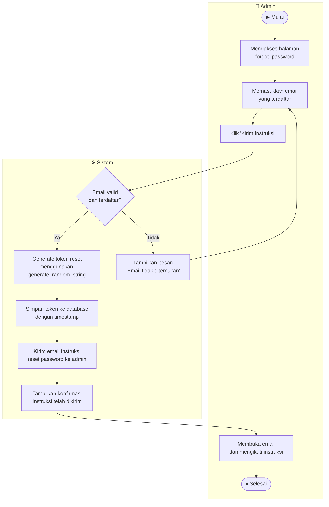
```mermaid
flowchart TD
    subgraph Admin["🔐 Admin"]
        A1([▶ Mulai]) --> A2[Mengakses halaman\nforgot_password]
        A2 --> A3[Memasukkan email\nyang terdaftar]
        A3 --> A4[Klik 'Kirim Instruksi']
        A7[Membuka email\ndan mengikuti instruksi] --> A8
        A8([⏹ Selesai])
    end

    subgraph Sistem["⚙️ Sistem"]
        S1{Email valid\ndan terdaftar?}
        S2[Generate token reset\nmenggunakan generate_random_string]
        S3[Simpan token ke database\ndengan timestamp]
        S4[Kirim email instruksi\nreset password ke admin]
        S5[Tampilkan pesan\n'Email tidak ditemukan']
        S6[Tampilkan konfirmasi\n'Instruksi telah dikirim']
    end

    A4 --> S1
    S1 -- Tidak --> S5
    S5 --> A3
    S1 -- Ya --> S2
    S2 --> S3
    S3 --> S4
    S4 --> S6
    S6 --> A7
```

***Gambar 4.2** Activity Diagram Lupa Kata Sandi*

Diagram ini merepresentasikan alur pemulihan akses administrator yang lupa kata sandi. Proses diawali dengan admin mengakses halaman `forgot_password` dan memasukkan alamat *email* yang terdaftar. Jika *email* tidak ditemukan dalam basis data, sistem menampilkan pesan kesalahan dan meminta admin untuk memasukkan ulang. **Apabila *email* valid**, sistem menghasilkan *token* reset acak menggunakan fungsi `generate_random_string()`, menyimpannya ke basis data beserta *timestamp* untuk keperluan validasi kedaluwarsa, kemudian mengirimkan instruksi pemulihan ke alamat *email* yang bersangkutan. Admin selanjutnya mengikuti tautan dalam *email* tersebut untuk mengatur ulang kata sandi melalui halaman `reset_password`.

---

### 4.2.3 Activity Diagram — Kelola Berita (CRUD)

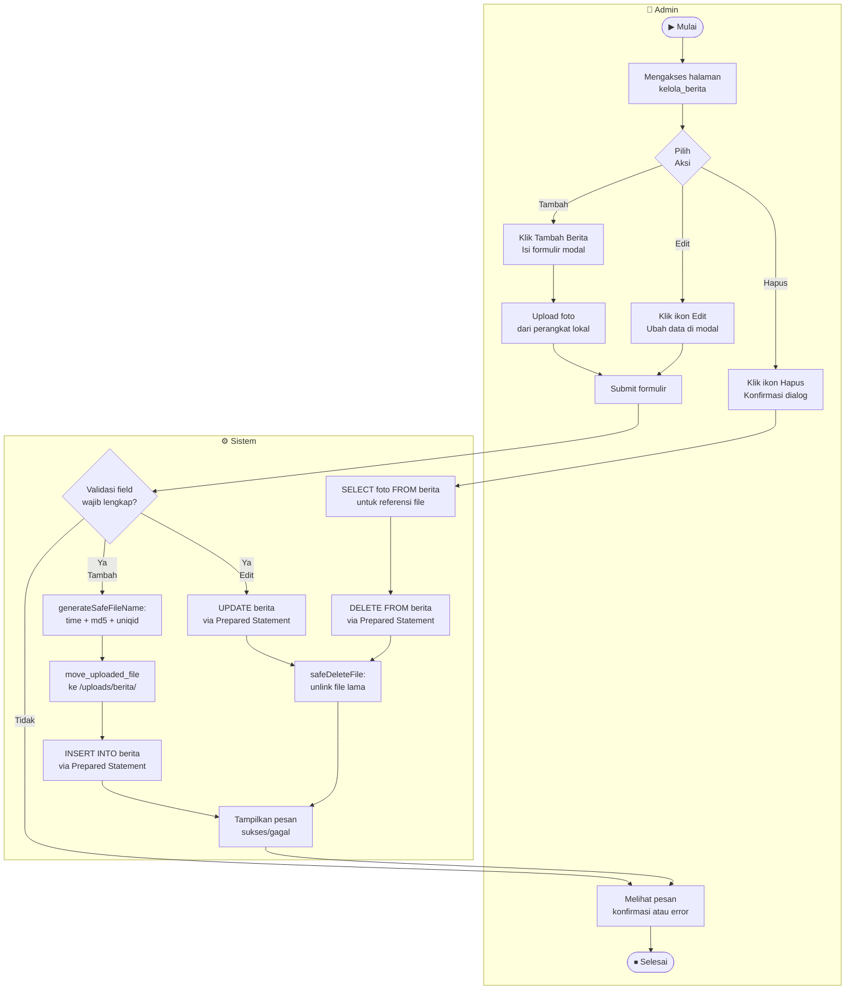
```mermaid
flowchart TD
    subgraph Admin["🔐 Admin"]
        A1([▶ Mulai]) --> A2[Mengakses halaman\nkelola_berita]
        A2 --> A3{Pilih\nAksi}
        A3 -- Tambah --> A4[Klik Tambah Berita\nIsi formulir modal]
        A3 -- Edit --> A5[Klik ikon Edit\nUbah data di modal]
        A3 -- Hapus --> A6[Klik ikon Hapus\nKonfirmasi dialog]
        A4 --> A7[Upload foto\ndari perangkat lokal]
        A7 --> A8[Submit formulir]
        A5 --> A8
        A11[Melihat pesan\nkonfirmasi atau error] --> A12([⏹ Selesai])
    end

    subgraph Sistem["⚙️ Sistem"]
        S1{Validasi field\nwajib lengkap?}
        S2[generateSafeFileName:\ntime + md5 + uniqid]
        S3[move_uploaded_file\nke /uploads/berita/]
        S4[INSERT INTO berita\nvia Prepared Statement]
        S5[UPDATE berita\nvia Prepared Statement]
        S6[SELECT foto FROM berita\nuntuk referensi file]
        S7[DELETE FROM berita\nvia Prepared Statement]
        S8[safeDeleteFile:\nunlink file lama]
        S9[Tampilkan pesan\nsukses/gagal]
    end

    A8 --> S1
    S1 -- Tidak --> A11
    S1 -- Ya\nTambah --> S2
    S2 --> S3
    S3 --> S4
    S4 --> S9
    S1 -- Ya\nEdit --> S5
    S5 --> S8
    S8 --> S9
    A6 --> S6
    S6 --> S7
    S7 --> S8
    S9 --> A11
```

***Gambar 4.3** Activity Diagram Kelola Berita (CRUD)*

Diagram ini menggambarkan alur lengkap pengelolaan data berita oleh administrator. Terdapat tiga cabang aksi utama: **Tambah**, **Edit**, dan **Hapus**. Pada aksi *tambah*, admin mengisi formulir melalui *modal popup* dan mengunggah foto; sistem kemudian mengeksekusi fungsi `generateSafeFileName()` yang menghasilkan nama file unik berbasis `time() + md5(uniqid())` untuk mencegah konflik nama, dilanjutkan dengan operasi `INSERT INTO berita` menggunakan *Prepared Statement*. Pada aksi *edit*, data lama diperbarui melalui `UPDATE`; jika terdapat foto baru, file lama dihapus menggunakan fungsi `safeDeleteFile()` yang mencoba penghapusan hingga tiga kali iterasi dengan jeda 100ms untuk menangani *file lock*. Pada aksi *hapus*, sistem terlebih dahulu mengambil referensi nama foto dari basis data sebelum mengeksekusi `DELETE`, kemudian menghapus file fisik dari direktori `uploads/berita/`.

---

### 4.2.4 Activity Diagram — Kelola Dosen (CRUD)

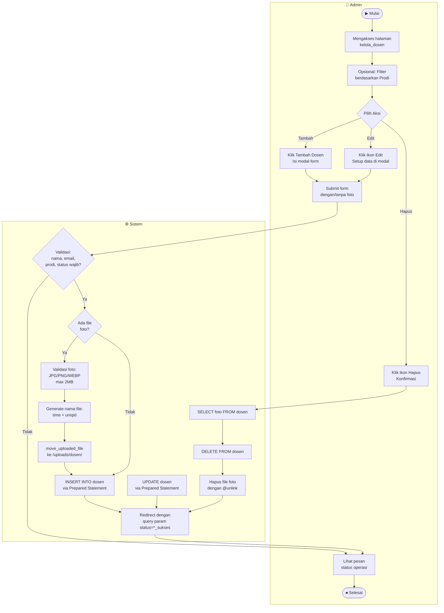
```mermaid
flowchart TD
    subgraph Admin["🔐 Admin"]
        A1([▶ Mulai]) --> A2[Mengakses halaman\nkelola_dosen]
        A2 --> A3[Opsional: Filter\nberdasarkan Prodi]
        A3 --> A4{Pilih Aksi}
        A4 -- Tambah --> A5[Klik Tambah Dosen\nIsi modal form]
        A4 -- Edit --> A6[Klik ikon Edit\nSetup data di modal]
        A4 -- Hapus --> A7[Klik ikon Hapus\nKonfirmasi]
        A5 --> A8[Submit form\ndengan/tanpa foto]
        A6 --> A8
        A10[Lihat pesan\nstatus operasi] --> A11([⏹ Selesai])
    end

    subgraph Sistem["⚙️ Sistem"]
        S1{Validasi:\nnama, email,\nprodi, status wajib?}
        S2{Ada file\nfoto?}
        S3[Validasi foto:\nJPG/PNG/WEBP\nmax 2MB]
        S4[Generate nama file:\ntime + uniqid]
        S5[move_uploaded_file\nke /uploads/dosen/]
        S6[INSERT INTO dosen\nvia Prepared Statement]
        S7[UPDATE dosen\nvia Prepared Statement]
        S8[SELECT foto FROM dosen]
        S9[DELETE FROM dosen]
        S10[Hapus file foto\ndengan @unlink]
        S11[Redirect dengan\nquery param status=*_sukses]
    end

    A8 --> S1
    S1 -- Tidak --> A10
    S1 -- Ya --> S2
    S2 -- Ya --> S3
    S3 --> S4
    S4 --> S5
    S5 --> S6
    S2 -- Tidak --> S6
    S6 --> S11
    S7 --> S11
    A7 --> S8
    S8 --> S9
    S9 --> S10
    S10 --> S11
    S11 --> A10
```

***Gambar 4.4** Activity Diagram Kelola Dosen (CRUD)*

Diagram ini merepresentasikan proses manajemen data dosen Fakultas Ilmu Komputer. Sebelum melakukan operasi CRUD, admin dapat memfilter daftar dosen berdasarkan Program Studi (Informatika atau Pendidikan Teknologi Informasi) melalui parameter *query string* `GET`. Pada proses tambah dan edit, validasi dilakukan terhadap field wajib yaitu nama, *email*, program studi, status, dan pendidikan. **Apabila foto diunggah**, sistem memvalidasi tipe file (hanya JPG, PNG, WEBP) dan ukuran maksimum 2MB sebelum menyimpannya ke direktori `uploads/dosen/`. Fungsi `real_escape_string()` digunakan pada data teks untuk lapisan keamanan tambahan. Setelah operasi berhasil, sistem tidak menampilkan pesan di halaman yang sama melainkan menggunakan mekanisme *redirect* dengan parameter status (contoh: `?status=tambah_sukses`) untuk mencegah pengiriman formulir berulang (*double submit*).

---

### 4.2.5 Activity Diagram — Kelola Penelitian

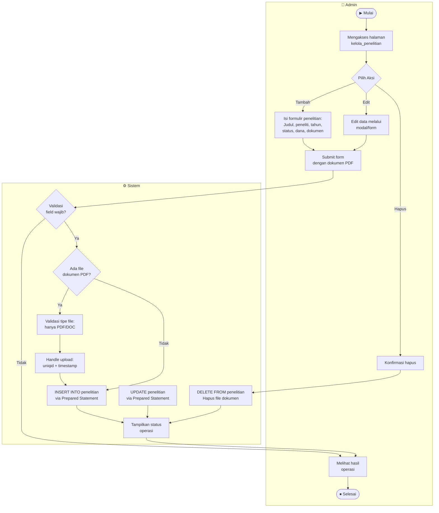
```mermaid
flowchart TD
    subgraph Admin["🔐 Admin"]
        A1([▶ Mulai]) --> A2[Mengakses halaman\nkelola_penelitian]
        A2 --> A3{Pilih Aksi}
        A3 -- Tambah --> A4[Isi formulir penelitian:\nJudul, peneliti, tahun,\nstatus, dana, dokumen]
        A3 -- Edit --> A5[Edit data melalui\nmodal/form]
        A3 -- Hapus --> A6[Konfirmasi hapus]
        A4 --> A7[Submit form\ndengan dokumen PDF]
        A5 --> A7
        A9[Melihat hasil\noperasi] --> A10([⏹ Selesai])
    end

    subgraph Sistem["⚙️ Sistem"]
        S1{Validasi\nfield wajib?}
        S2{Ada file\ndokumen PDF?}
        S3[Validasi tipe file:\nhanya PDF/DOC]
        S4[Handle upload:\nuniqid + timestamp]
        S5[INSERT INTO penelitian\nvia Prepared Statement]
        S6[UPDATE penelitian\nvia Prepared Statement]
        S7[DELETE FROM penelitian\nHapus file dokumen]
        S8[Tampilkan status\noperasi]
    end

    A7 --> S1
    S1 -- Tidak --> A9
    S1 -- Ya --> S2
    S2 -- Ya --> S3
    S3 --> S4
    S4 --> S5
    S2 -- Tidak --> S5
    S5 --> S8
    S6 --> S8
    A6 --> S7
    S7 --> S8
    S8 --> A9
```

***Gambar 4.5** Activity Diagram Kelola Penelitian*

Diagram ini mengilustrasikan alur pengelolaan data penelitian dosen di Fakultas Ilmu Komputer. Modul ini mendukung pencatatan lengkap penelitian yang mencakup judul, nama peneliti, tahun pelaksanaan, status penelitian (*Draft*, *Sedang Berjalan*, *Selesai*), nominal dana hibah, serta unggah dokumen pendukung berformat PDF atau DOC. Sistem memvalidasi tipe dan ukuran file sesuai konstanta `ALLOWED_DOC_TYPES` dan `MAX_FILE_SIZE` yang didefinisikan di `config/constants.php`. **Seluruh operasi INSERT dan UPDATE** menggunakan *Prepared Statement* untuk mencegah serangan injeksi SQL. Saat penghapusan data, sistem tidak hanya menghapus rekaman dari tabel `penelitian` tetapi juga menghapus file dokumen fisik dari direktori `uploads/` untuk menjaga konsistensi penyimpanan.

---

### 4.2.6 Activity Diagram — Kelola Pengabdian Masyarakat

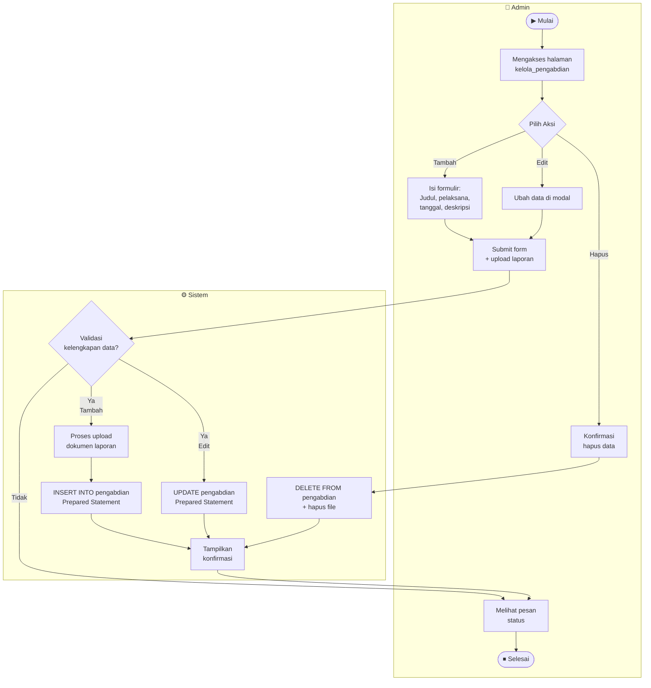
```mermaid
flowchart TD
    subgraph Admin["🔐 Admin"]
        A1([▶ Mulai]) --> A2[Mengakses halaman\nkelola_pengabdian]
        A2 --> A3{Pilih Aksi}
        A3 -- Tambah --> A4[Isi formulir:\nJudul, pelaksana,\ntanggal, deskripsi]
        A3 -- Edit --> A5[Ubah data di modal]
        A3 -- Hapus --> A6[Konfirmasi\nhapus data]
        A4 --> A7[Submit form\n+ upload laporan]
        A5 --> A7
        A9[Melihat pesan\nstatus] --> A10([⏹ Selesai])
    end

    subgraph Sistem["⚙️ Sistem"]
        S1{Validasi\nkelengkapan data?}
        S2[Proses upload\ndokumen laporan]
        S3[INSERT INTO pengabdian\nPrepared Statement]
        S4[UPDATE pengabdian\nPrepared Statement]
        S5[DELETE FROM pengabdian\n+ hapus file]
        S6[Tampilkan\nkonfirmasi]
    end

    A7 --> S1
    S1 -- Tidak --> A9
    S1 -- Ya\nTambah --> S2
    S2 --> S3
    S3 --> S6
    S1 -- Ya\nEdit --> S4
    S4 --> S6
    A6 --> S5
    S5 --> S6
    S6 --> A9
```

***Gambar 4.6** Activity Diagram Kelola Pengabdian Masyarakat*

Diagram ini merepresentasikan pengelolaan data kegiatan pengabdian kepada masyarakat sebagai implementasi Tri Dharma Perguruan Tinggi aspek ketiga. Proses penginputan mencakup judul kegiatan, nama pelaksana, tanggal kegiatan, deskripsi singkat, dan unggahan laporan pelaksanaan. Seluruh operasi manipulasi data menggunakan *Prepared Statement* MySQL yang dieksekusi melalui objek `$conn` dari kelas `mysqli`. **Saat penghapusan**, sistem secara atomik menghapus rekaman database dan file fisik dokumen secara bersamaan untuk menjaga integritas data. Data pengabdian yang tersimpan akan ditampilkan pada halaman publik `pages/pengabdian.php` sebagai bukti implementasi Tri Dharma.

---

### 4.2.7 Activity Diagram — Kelola Kerjasama (MoU/MoA)

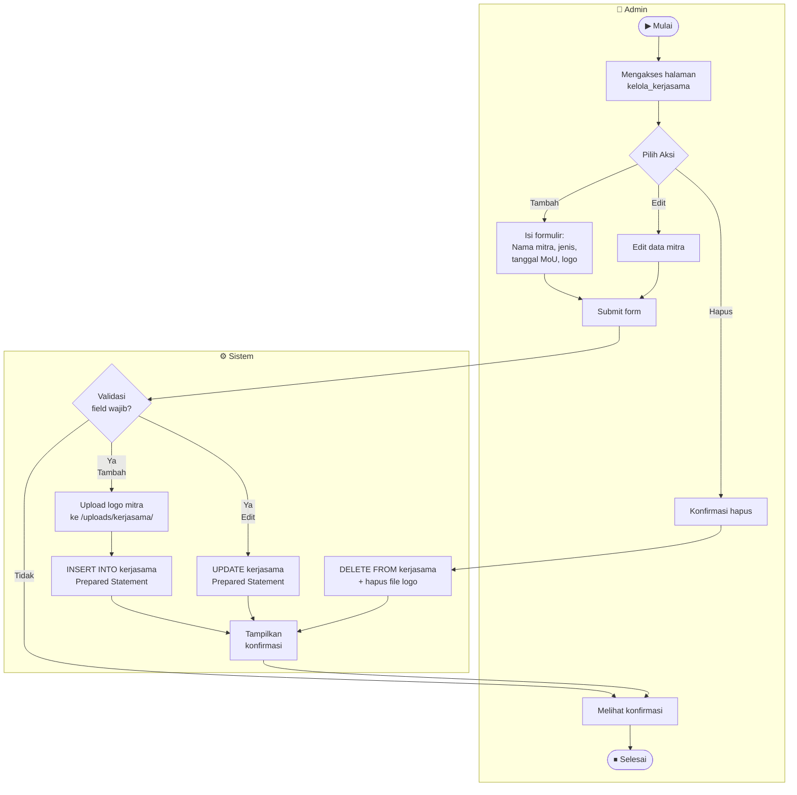
```mermaid
flowchart TD
    subgraph Admin["🔐 Admin"]
        A1([▶ Mulai]) --> A2[Mengakses halaman\nkelola_kerjasama]
        A2 --> A3{Pilih Aksi}
        A3 -- Tambah --> A4[Isi formulir:\nNama mitra, jenis,\ntanggal MoU, logo]
        A3 -- Edit --> A5[Edit data mitra]
        A3 -- Hapus --> A6[Konfirmasi hapus]
        A4 --> A7[Submit form]
        A5 --> A7
        A9[Melihat konfirmasi] --> A10([⏹ Selesai])
    end

    subgraph Sistem["⚙️ Sistem"]
        S1{Validasi\nfield wajib?}
        S2[Upload logo mitra\nke /uploads/kerjasama/]
        S3[INSERT INTO kerjasama\nPrepared Statement]
        S4[UPDATE kerjasama\nPrepared Statement]
        S5[DELETE FROM kerjasama\n+ hapus file logo]
        S6[Tampilkan\nkonfirmasi]
    end

    A7 --> S1
    S1 -- Tidak --> A9
    S1 -- Ya\nTambah --> S2
    S2 --> S3
    S3 --> S6
    S1 -- Ya\nEdit --> S4
    S4 --> S6
    A6 --> S5
    S5 --> S6
    S6 --> A9
```

***Gambar 4.7** Activity Diagram Kelola Kerjasama*

Diagram ini menggambarkan manajemen data kemitraan strategis Fakultas Ilmu Komputer. Administrator dapat mendata instansi mitra yang telah menandatangani *Memorandum of Understanding* (MoU) atau *Memorandum of Agreement* (MoA), lengkap dengan logo instansi, jenis kemitraan, dan tanggal penandatanganan dokumen. Logo mitra diunggah ke direktori `uploads/kerjasama/` dengan nama file yang diencode menggunakan kombinasi `time()` dan `uniqid()` untuk keunikan. **Data kerjasama** yang tersimpan ditampilkan pada halaman publik *homepage* dalam format *carousel* berjalan, berfungsi sebagai pernyataan kredibilitas dan jangkauan jejaring institusi.

---

### 4.2.8 Activity Diagram — Kelola BEM

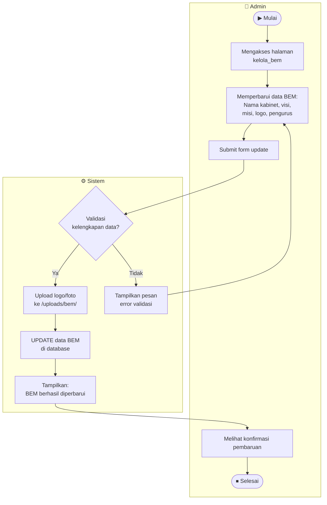
```mermaid
flowchart TD
    subgraph Admin["🔐 Admin"]
        A1([▶ Mulai]) --> A2[Mengakses halaman\nkelola_bem]
        A2 --> A3[Memperbarui data BEM:\nNama kabinet, visi,\nmisi, logo, pengurus]
        A3 --> A4[Submit form update]
        A6[Melihat konfirmasi pembaruan] --> A7([⏹ Selesai])
    end

    subgraph Sistem["⚙️ Sistem"]
        S1{Validasi\nkelengkapan data?}
        S2[Upload logo/foto\nke /uploads/bem/]
        S3[UPDATE data BEM\ndi database]
        S4[Tampilkan:\nBEM berhasil diperbarui]
        S5[Tampilkan pesan\nerror validasi]
    end

    A4 --> S1
    S1 -- Tidak --> S5
    S5 --> A3
    S1 -- Ya --> S2
    S2 --> S3
    S3 --> S4
    S4 --> A6
```

***Gambar 4.8** Activity Diagram Kelola BEM*

Diagram ini mengilustrasikan alur pembaruan profil Badan Eksekutif Mahasiswa (BEM) Fakultas Ilmu Komputer. Modul ini berfungsi untuk menampilkan informasi terkini mengenai kabinet BEM aktif, termasuk nama kabinet, visi dan misi organisasi, serta susunan pengurus periode berjalan. Pembaruan data dilakukan melalui operasi `UPDATE` ke tabel `bem` di basis data. **Foto atau logo** kabinet diunggah ke direktori `uploads/bem/` dengan validasi format gambar. Data yang diperbarui akan langsung terpublikasi ke halaman kemahasiswaan di *frontend* website, mencerminkan komitmen institusi dalam mendukung aktifitas organisasi kemahasiswaan secara transparan.

---

### 4.2.9 Activity Diagram — Kelola Visi & Misi

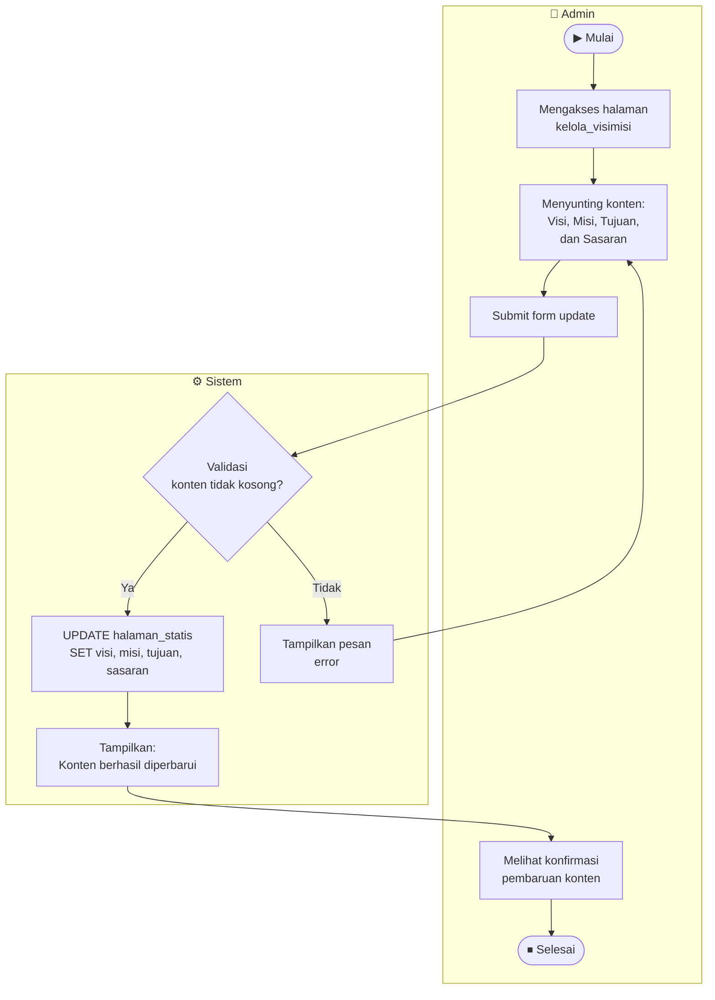
```mermaid
flowchart TD
    subgraph Admin["🔐 Admin"]
        A1([▶ Mulai]) --> A2[Mengakses halaman\nkelola_visimisi]
        A2 --> A3[Menyunting konten:\nVisi, Misi, Tujuan,\ndan Sasaran]
        A3 --> A4[Submit form update]
        A6[Melihat konfirmasi\npembaruan konten] --> A7([⏹ Selesai])
    end

    subgraph Sistem["⚙️ Sistem"]
        S1{Validasi\nkonten tidak kosong?}
        S2[UPDATE halaman_statis\nSET visi, misi, tujuan, sasaran]
        S3[Tampilkan:\nKonten berhasil diperbarui]
        S4[Tampilkan pesan\nerror]
    end

    A4 --> S1
    S1 -- Tidak --> S4
    S4 --> A3
    S1 -- Ya --> S2
    S2 --> S3
    S3 --> A6
```

***Gambar 4.9** Activity Diagram Kelola Visi dan Misi*

Diagram ini merepresentasikan alur pembaruan konten fundamental halaman Visi, Misi, Tujuan, dan Sasaran Fakultas Ilmu Komputer. Konten ini merupakan elemen kritis yang menjadi identitas dan arah pengembangan institusi. Data disimpan dalam tabel `halaman_statis` di basis data yang diperbarui melalui operasi `UPDATE` setiap kali administrator melakukan revisi. **Pembaruan bersifat *real-time***, artinya setiap perubahan yang disimpan akan langsung tercermin pada halaman `pages/visi-misi.php` di *frontend* tanpa memerlukan proses *deploy* atau perubahan kode sumber. Mekanisme ini mengimplementasikan prinsip *Content Management System* (CMS) yang memisahkan lapisan data dari lapisan presentasi.

---

### 4.2.10 Activity Diagram — Kelola Slider/Hero Banner

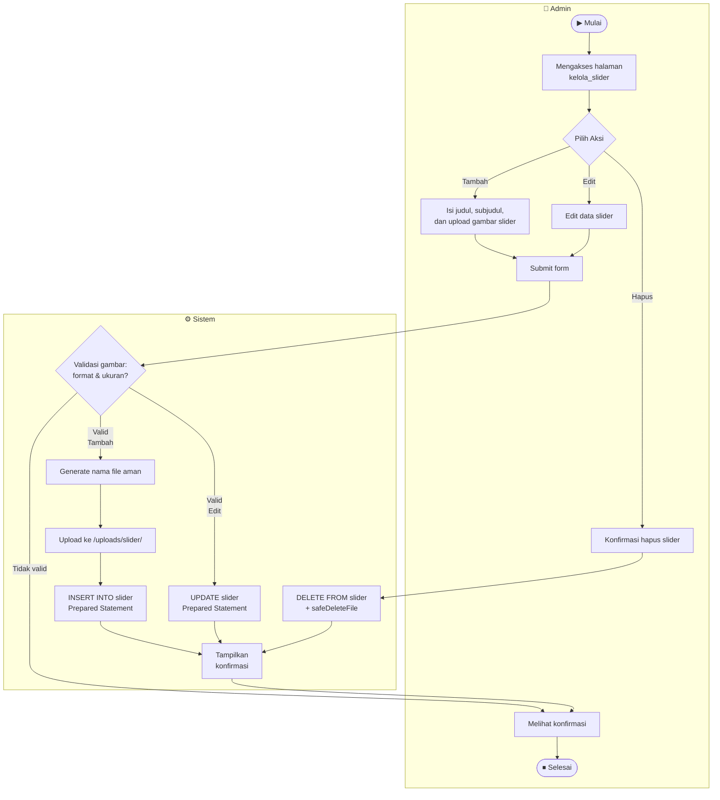
```mermaid
flowchart TD
    subgraph Admin["🔐 Admin"]
        A1([▶ Mulai]) --> A2[Mengakses halaman\nkelola_slider]
        A2 --> A3{Pilih Aksi}
        A3 -- Tambah --> A4[Isi judul, subjudul,\ndan upload gambar slider]
        A3 -- Edit --> A5[Edit data slider]
        A3 -- Hapus --> A6[Konfirmasi hapus slider]
        A4 --> A7[Submit form]
        A5 --> A7
        A9[Melihat konfirmasi] --> A10([⏹ Selesai])
    end

    subgraph Sistem["⚙️ Sistem"]
        S1{Validasi gambar:\nformat & ukuran?}
        S2[Generate nama file aman]
        S3[Upload ke /uploads/slider/]
        S4[INSERT INTO slider\nPrepared Statement]
        S5[UPDATE slider\nPrepared Statement]
        S6[DELETE FROM slider\n+ safeDeleteFile]
        S7[Tampilkan\nkonfirmasi]
    end

    A7 --> S1
    S1 -- Tidak valid --> A9
    S1 -- Valid\nTambah --> S2
    S2 --> S3
    S3 --> S4
    S4 --> S7
    S1 -- Valid\nEdit --> S5
    S5 --> S7
    A6 --> S6
    S6 --> S7
    S7 --> A9
```

***Gambar 4.10** Activity Diagram Kelola Slider/Hero Banner*

Diagram ini menggambarkan pengelolaan konten *Hero Slider* yang menjadi elemen visual utama di halaman beranda website. Admin dapat menambah, mengedit, atau menghapus slide dengan memuat gambar berkualitas tinggi beserta teks judul dan sub-judul. Sistem memvalidasi format gambar yang diizinkan (JPEG, PNG, GIF, WebP) sesuai konstanta `ALLOWED_IMAGE_TYPES` dan membatasi ukuran maksimum file sebesar 5MB sesuai konstanta `MAX_FILE_SIZE`. **Nama file gambar** diencode secara aman menggunakan `generateSafeFileName()` untuk mencegah eksekusi skrip berbahaya yang menyamar sebagai file gambar. Gambar slider yang tersimpan ditampilkan pada *frontend* melalui halaman `pages/home.php` dalam format *slideshow* otomatis.

---

### 4.2.11 Activity Diagram — Kelola Ruangan

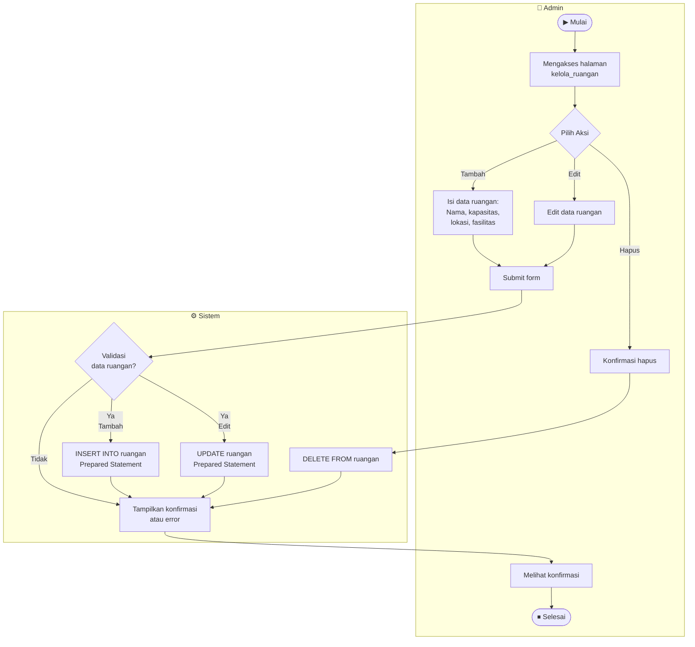
```mermaid
flowchart TD
    subgraph Admin["🔐 Admin"]
        A1([▶ Mulai]) --> A2[Mengakses halaman\nkelola_ruangan]
        A2 --> A3{Pilih Aksi}
        A3 -- Tambah --> A4[Isi data ruangan:\nNama, kapasitas,\nlokasi, fasilitas]
        A3 -- Edit --> A5[Edit data ruangan]
        A3 -- Hapus --> A6[Konfirmasi hapus]
        A4 --> A7[Submit form]
        A5 --> A7
        A9[Melihat konfirmasi] --> A10([⏹ Selesai])
    end

    subgraph Sistem["⚙️ Sistem"]
        S1{Validasi\ndata ruangan?}
        S2[INSERT INTO ruangan\nPrepared Statement]
        S3[UPDATE ruangan\nPrepared Statement]
        S4[DELETE FROM ruangan]
        S5[Tampilkan konfirmasi\natau error]
    end

    A7 --> S1
    S1 -- Tidak --> S5
    S1 -- Ya\nTambah --> S2
    S2 --> S5
    S1 -- Ya\nEdit --> S3
    S3 --> S5
    A6 --> S4
    S4 --> S5
    S5 --> A9
```

***Gambar 4.11** Activity Diagram Kelola Ruangan*

Diagram ini mengilustrasikan manajemen inventaris ruang kelas dan ruang pertemuan Fakultas Ilmu Komputer. Data yang dikelola meliputi nama ruangan, kapasitas, lokasi (nomor lantai dan gedung), serta deskripsi kelengkapan fasilitas seperti *Air Conditioner* (AC), proyektor, dan papan tulis interaktif. Seluruh operasi CRUD diimplementasikan menggunakan *Prepared Statement* yang terhubung ke tabel `ruangan` di basis data `db_web_fikom`. **Informasi ruangan** yang terdaftar ditampilkan pada halaman publik `pages/ruangan.php` sehingga sivitas akademika dapat mengetahui ketersediaan dan spesifikasi ruang yang dapat digunakan untuk kegiatan perkuliahan maupun kemahasiswaan.

---

### 4.2.12 Activity Diagram — Kelola Laboratorium

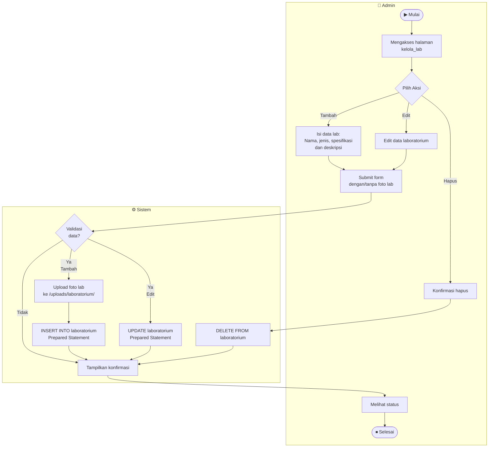
```mermaid
flowchart TD
    subgraph Admin["🔐 Admin"]
        A1([▶ Mulai]) --> A2[Mengakses halaman\nkelola_lab]
        A2 --> A3{Pilih Aksi}
        A3 -- Tambah --> A4[Isi data lab:\nNama, jenis, spesifikasi\ndan deskripsi]
        A3 -- Edit --> A5[Edit data laboratorium]
        A3 -- Hapus --> A6[Konfirmasi hapus]
        A4 --> A7[Submit form\ndengan/tanpa foto lab]
        A5 --> A7
        A9[Melihat status] --> A10([⏹ Selesai])
    end

    subgraph Sistem["⚙️ Sistem"]
        S1{Validasi\ndata?}
        S2[Upload foto lab\nke /uploads/laboratorium/]
        S3[INSERT INTO laboratorium\nPrepared Statement]
        S4[UPDATE laboratorium\nPrepared Statement]
        S5[DELETE FROM laboratorium]
        S6[Tampilkan konfirmasi]
    end

    A7 --> S1
    S1 -- Tidak --> S6
    S1 -- Ya\nTambah --> S2
    S2 --> S3
    S3 --> S6
    S1 -- Ya\nEdit --> S4
    S4 --> S6
    A6 --> S5
    S5 --> S6
    S6 --> A9
```

***Gambar 4.12** Activity Diagram Kelola Laboratorium*

Diagram ini merepresentasikan pengelolaan profil laboratorium yang menjadi sarana penunjang utama kegiatan praktikum. Data yang dikelola mencakup nama laboratorium, jenis praktikum yang didukung, spesifikasi perangkat keras dan perangkat lunak unggulan, serta deskripsi lengkap fasilitas. **Foto laboratorium** dapat diunggah untuk memberikan gambaran visual kepada calon mahasiswa. Data laboratorium ditampilkan pada halaman `pages/laboratorium.php` di *frontend* sebagai bukti kesiapan infrastruktur praktikum yang dimiliki Fakultas Ilmu Komputer.

---

### 4.2.13 Activity Diagram — Kelola Kurikulum

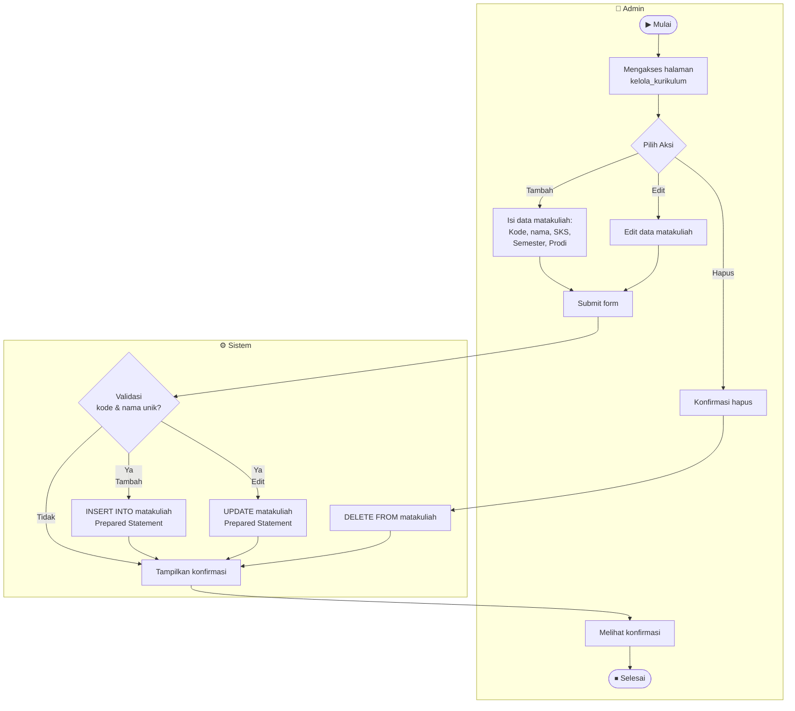
```mermaid
flowchart TD
    subgraph Admin["🔐 Admin"]
        A1([▶ Mulai]) --> A2[Mengakses halaman\nkelola_kurikulum]
        A2 --> A3{Pilih Aksi}
        A3 -- Tambah --> A4[Isi data matakuliah:\nKode, nama, SKS,\nSemester, Prodi]
        A3 -- Edit --> A5[Edit data matakuliah]
        A3 -- Hapus --> A6[Konfirmasi hapus]
        A4 --> A7[Submit form]
        A5 --> A7
        A9[Melihat konfirmasi] --> A10([⏹ Selesai])
    end

    subgraph Sistem["⚙️ Sistem"]
        S1{Validasi\nkode & nama unik?}
        S2[INSERT INTO matakuliah\nPrepared Statement]
        S3[UPDATE matakuliah\nPrepared Statement]
        S4[DELETE FROM matakuliah]
        S5[Tampilkan konfirmasi]
    end

    A7 --> S1
    S1 -- Tidak --> S5
    S1 -- Ya\nTambah --> S2
    S2 --> S5
    S1 -- Ya\nEdit --> S3
    S3 --> S5
    A6 --> S4
    S4 --> S5
    S5 --> A9
```

***Gambar 4.13** Activity Diagram Kelola Kurikulum*

Diagram ini menggambarkan manajemen basis data mata kuliah program studi Informatika dan Pendidikan Teknologi Informasi. Data yang dikelola mencakup kode mata kuliah, nama mata kuliah, bobot *Satuan Kredit Semester* (SKS), semester penawaran, dan afiliasi program studi. Sistem memvalidasi keunikan kode mata kuliah untuk mencegah duplikasi data yang dapat menimbulkan ambiguitas jadwal perkuliahan. **Data kurikulum** yang terdaftar ditampilkan secara publik melalui halaman `pages/kurikulum.php`, memberikan transparansi mengenai struktur dan isi program pendidikan kepada calon mahasiswa, mahasiswa aktif, dan pemangku kepentingan eksternal.

---

### 4.2.14 Activity Diagram — Kelola Kalender Akademik

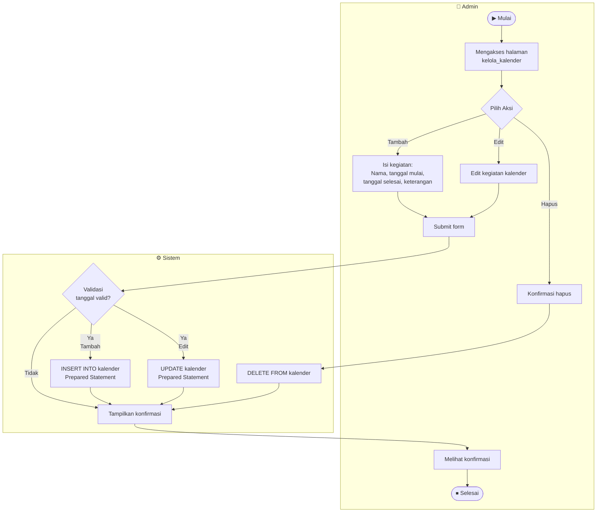
```mermaid
flowchart TD
    subgraph Admin["🔐 Admin"]
        A1([▶ Mulai]) --> A2[Mengakses halaman\nkelola_kalender]
        A2 --> A3{Pilih Aksi}
        A3 -- Tambah --> A4[Isi kegiatan:\nNama, tanggal mulai,\ntanggal selesai, keterangan]
        A3 -- Edit --> A5[Edit kegiatan kalender]
        A3 -- Hapus --> A6[Konfirmasi hapus]
        A4 --> A7[Submit form]
        A5 --> A7
        A9[Melihat konfirmasi] --> A10([⏹ Selesai])
    end

    subgraph Sistem["⚙️ Sistem"]
        S1{Validasi\ntanggal valid?}
        S2[INSERT INTO kalender\nPrepared Statement]
        S3[UPDATE kalender\nPrepared Statement]
        S4[DELETE FROM kalender]
        S5[Tampilkan konfirmasi]
    end

    A7 --> S1
    S1 -- Tidak --> S5
    S1 -- Ya\nTambah --> S2
    S2 --> S5
    S1 -- Ya\nEdit --> S3
    S3 --> S5
    A6 --> S4
    S4 --> S5
    S5 --> A9
```

***Gambar 4.14** Activity Diagram Kelola Kalender Akademik*

Diagram ini merepresentasikan pengelolaan jadwal kalender akademik semester berjalan oleh administrator. Sistem memungkinkan penginputan kegiatan akademik penting seperti masa pembayaran *Sumbangan Pembinaan Pendidikan* (SPP), periode pengisian *Kartu Rencana Studi* (KRS), jadwal Ujian Tengah Semester (UTS), Ujian Akhir Semester (UAS), dan yudisium. Validasi dilakukan untuk memastikan format tanggal yang diinput valid dan tanggal selesai tidak mendahului tanggal mulai. **Jadwal kalender** ditampilkan pada halaman publik `pages/kalender.php` sebagai acuan waktu resmi bagi seluruh sivitas akademika dalam menjalankan aktivitas perkuliahan.

---

### 4.2.15 Activity Diagram — Kelola SOP, Renstra, dan Renop

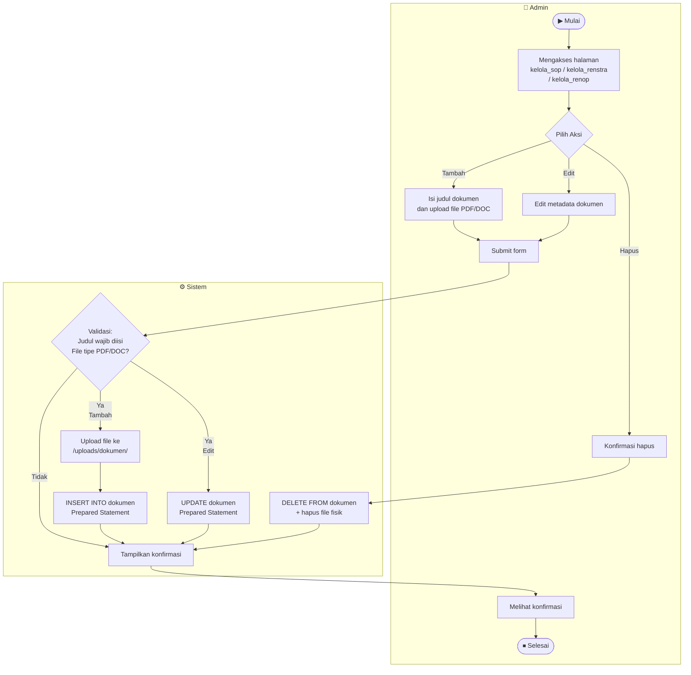
```mermaid
flowchart TD
    subgraph Admin["🔐 Admin"]
        A1([▶ Mulai]) --> A2[Mengakses halaman\nkelola_sop / kelola_renstra\n/ kelola_renop]
        A2 --> A3{Pilih Aksi}
        A3 -- Tambah --> A4[Isi judul dokumen\ndan upload file PDF/DOC]
        A3 -- Edit --> A5[Edit metadata dokumen]
        A3 -- Hapus --> A6[Konfirmasi hapus]
        A4 --> A7[Submit form]
        A5 --> A7
        A9[Melihat konfirmasi] --> A10([⏹ Selesai])
    end

    subgraph Sistem["⚙️ Sistem"]
        S1{Validasi:\nJudul wajib diisi\nFile tipe PDF/DOC?}
        S2[Upload file ke\n/uploads/dokumen/]
        S3[INSERT INTO dokumen\nPrepared Statement]
        S4[UPDATE dokumen\nPrepared Statement]
        S5[DELETE FROM dokumen\n+ hapus file fisik]
        S6[Tampilkan konfirmasi]
    end

    A7 --> S1
    S1 -- Tidak --> S6
    S1 -- Ya\nTambah --> S2
    S2 --> S3
    S3 --> S6
    S1 -- Ya\nEdit --> S4
    S4 --> S6
    A6 --> S5
    S5 --> S6
    S6 --> A9
```

***Gambar 4.15** Activity Diagram Kelola Dokumen (SOP, Renstra, Renop)*

Diagram ini menggambarkan pengelolaan repositori digital dokumen resmi Fakultas Ilmu Komputer yang mencakup Standar Operasional Prosedur (SOP), Rencana Strategis (Renstra), dan Rencana Operasional (Renop). Proses unggah dokumen divalidasi untuk memastikan tipe file yang diizinkan adalah PDF atau DOC sesuai konstanta `ALLOWED_DOC_TYPES`. File disimpan di direktori `uploads/dokumen/` dengan nama aman yang diencode untuk mencegah eksekusi *payload* berbahaya. **Dokumen yang diunggah** dapat diakses oleh publik melalui halaman front-end masing-masing (`pages/sop.php`, `pages/rencana_strategis.php`, `pages/rencana_operasional.php`), mencerminkan prinsip transparansi dan akuntabilitas manajemen fakultas.

---

### 4.2.16 Activity Diagram — Kelola Data Pendaftaran

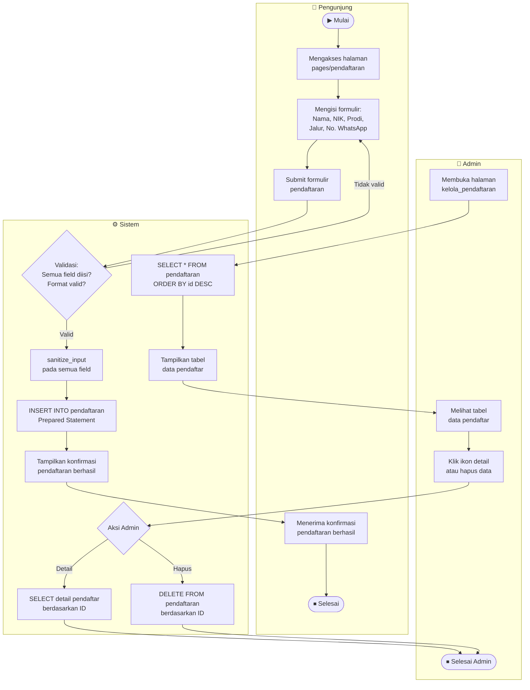
```mermaid
flowchart TD
    subgraph Pengunjung["👤 Pengunjung"]
        PV1([▶ Mulai]) --> PV2[Mengakses halaman\npages/pendaftaran]
        PV2 --> PV3[Mengisi formulir:\nNama, NIK, Prodi,\nJalur, No. WhatsApp]
        PV3 --> PV4[Submit formulir\npendaftaran]
        PV8[Menerima konfirmasi\npendaftaran berhasil] --> PV9([⏹ Selesai])
    end

    subgraph Admin["🔐 Admin"]
        A1[Membuka halaman\nkelola_pendaftaran]
        A2[Melihat tabel\ndata pendaftar]
        A3[Klik ikon detail\natau hapus data]
        A4([⏹ Selesai Admin])
    end

    subgraph Sistem["⚙️ Sistem"]
        S1{Validasi:\nSemua field diisi?\nFormat valid?}
        S2[sanitize_input\npada semua field]
        S3[INSERT INTO pendaftaran\nPrepared Statement]
        S4[Tampilkan konfirmasi\npendaftaran berhasil]
        S5[SELECT * FROM pendaftaran\nORDER BY id DESC]
        S6[Tampilkan tabel\ndata pendaftar]
        S7{Aksi Admin}
        S8[SELECT detail pendaftar\nberdasarkan ID]
        S9[DELETE FROM pendaftaran\nberdasarkan ID]
    end

    PV4 --> S1
    S1 -- Tidak valid --> PV3
    S1 -- Valid --> S2
    S2 --> S3
    S3 --> S4
    S4 --> PV8

    A1 --> S5
    S5 --> S6
    S6 --> A2
    A2 --> A3
    A3 --> S7
    S7 -- Detail --> S8
    S7 -- Hapus --> S9
    S8 --> A4
    S9 --> A4
```

***Gambar 4.16** Activity Diagram Kelola Data Pendaftaran*

Diagram ini merepresentasikan dua alur yang saling terintegrasi: alur pendaftaran mahasiswa baru melalui *frontend* dan alur pengelolaan data pendaftar oleh administrator. Calon mahasiswa mengakses formulir pendaftaran online dan mengisi identitas diri (Nama Lengkap, NIK), pilihan akademik (Program Studi dan Jalur Pendaftaran), serta kontak WhatsApp. Sistem menerapkan fungsi `sanitize_input()` pada seluruh input sebelum disimpan ke basis data untuk mencegah serangan *Cross-Site Scripting* (XSS). **Dari sisi administrator**, data pendaftar ditampilkan dalam tabel responsif pada halaman `kelola_pendaftaran.php` dilengkapi fitur *click-to-chat* WhatsApp dan aksi hapus data yang tidak valid, menjadikan modul ini sebagai pusat verifikasi panitia Penerimaan Mahasiswa Baru (PMB).

---

### 4.2.17 Activity Diagram — Kelola Profil Admin (*Profile*)

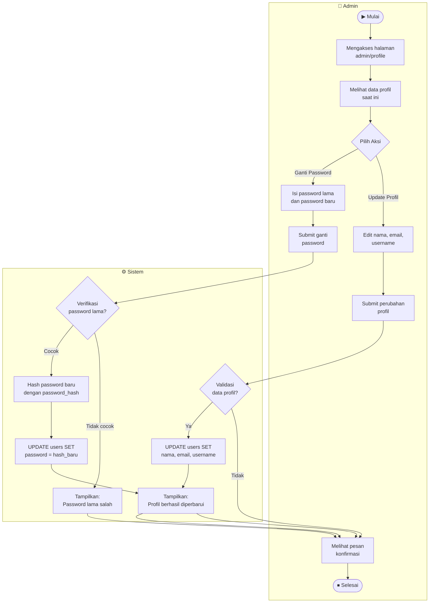
```mermaid
flowchart TD
    subgraph Admin["🔐 Admin"]
        A1([▶ Mulai]) --> A2[Mengakses halaman\nadmin/profile]
        A2 --> A3[Melihat data profil\nsaat ini]
        A3 --> A4{Pilih Aksi}
        A4 -- Update Profil --> A5[Edit nama, email,\nusername]
        A4 -- Ganti Password --> A6[Isi password lama\ndan password baru]
        A5 --> A7[Submit perubahan\nprofil]
        A6 --> A8[Submit ganti\npassword]
        A10[Melihat pesan\nkonfirmasi] --> A11([⏹ Selesai])
    end

    subgraph Sistem["⚙️ Sistem"]
        S1{Validasi\ndata profil?}
        S2[UPDATE users SET\nnama, email, username]
        S3{Verifikasi\npassword lama?}
        S4[Hash password baru\ndengan password_hash]
        S5[UPDATE users SET\npassword = hash_baru]
        S6[Tampilkan:\nProfil berhasil diperbarui]
        S7[Tampilkan:\nPassword lama salah]
    end

    A7 --> S1
    S1 -- Tidak --> A10
    S1 -- Ya --> S2
    S2 --> S6
    S6 --> A10

    A8 --> S3
    S3 -- Tidak cocok --> S7
    S7 --> A10
    S3 -- Cocok --> S4
    S4 --> S5
    S5 --> S6
    S6 --> A10
```

***Gambar 4.17** Activity Diagram Kelola Profil Admin*

Diagram ini mengilustrasikan pengelolaan data akun administrator sistem. Terdapat dua sub-proses utama: pembaruan data profil dan penggantian kata sandi. Pembaruan profil memungkinkan admin mengubah nama tampilan, *email*, dan *username* yang langsung diperbarui ke tabel `users` via `UPDATE`. Penggantian kata sandi mengimplementasikan verifikasi ganda: sistem terlebih dahulu memvalidasi kata sandi lama menggunakan `password_verify()`, dan hanya jika cocok maka kata sandi baru di-*hash* menggunakan `password_hash()` dengan algoritma `PASSWORD_DEFAULT` (bcrypt) sebelum disimpan. **Mekanisme ini** memastikan hanya pemilik akun yang sah yang dapat mengubah kredensial, mencegah pengambilalihan akun oleh pihak tidak berwenang.

---

### 4.2.18 Activity Diagram — Halaman Publik (Frontend)

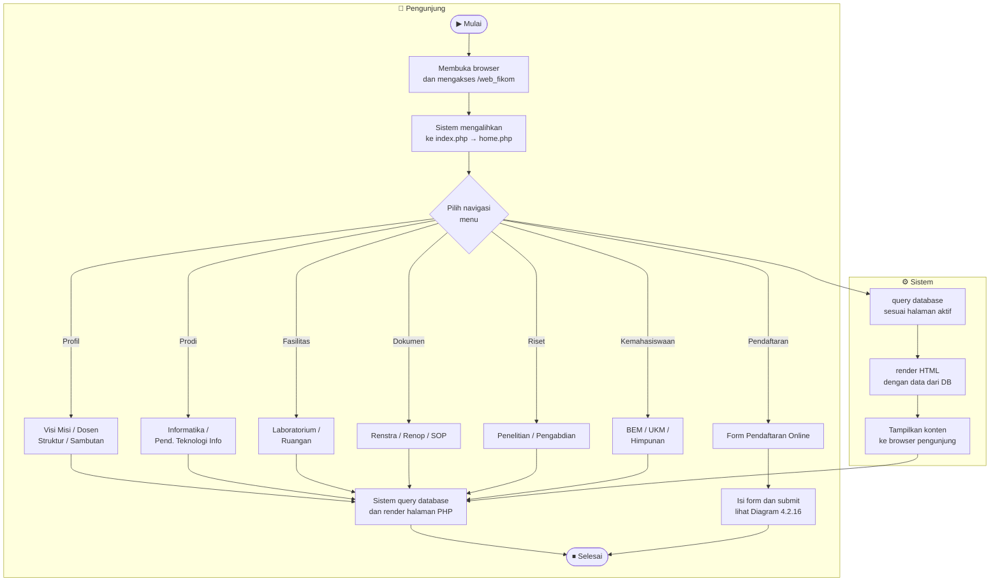
```mermaid
flowchart TD
    subgraph Pengunjung["👤 Pengunjung"]
        PV1([▶ Mulai]) --> PV2[Membuka browser\ndan mengakses /web_fikom]
        PV2 --> PV3[Sistem mengalihkan\nke index.php → home.php]
        PV3 --> PV4{Pilih navigasi\nmenu}
        PV4 -- Profil --> PV5[Visi Misi / Dosen\nStruktur / Sambutan]
        PV4 -- Prodi --> PV6[Informatika /\nPend. Teknologi Info]
        PV4 -- Fasilitas --> PV7[Laboratorium /\nRuangan]
        PV4 -- Dokumen --> PV8[Renstra / Renop / SOP]
        PV4 -- Riset --> PV9[Penelitian / Pengabdian]
        PV4 -- Kemahasiswaan --> PV10[BEM / UKM /\nHimpunan]
        PV4 -- Pendaftaran --> PV11[Form Pendaftaran Online]
        PV5 & PV6 & PV7 & PV8 & PV9 & PV10 --> PV12[Sistem query database\ndan render halaman PHP]
        PV11 --> PV13[Isi form dan submit\nlihat Diagram 4.2.16]
        PV12 --> PV14([⏹ Selesai])
        PV13 --> PV14
    end

    subgraph Sistem["⚙️ Sistem"]
        S1[query database\nsesuai halaman aktif]
        S2[render HTML\ndengan data dari DB]
        S3[Tampilkan konten\nke browser pengunjung]
    end

    PV4 --> S1
    S1 --> S2
    S2 --> S3
    S3 --> PV12
```

***Gambar 4.18** Activity Diagram Halaman Publik Frontend*

Diagram ini menggambarkan alur navigasi pengunjung umum di halaman *frontend* website Fakultas Ilmu Komputer UNISAN. Seluruh halaman publik menggunakan arsitektur *Server-Side Rendering* (SSR) berbasis PHP, di mana sistem mengeksekusi *query* ke basis data `db_web_fikom` dan merender HTML secara dinamis pada setiap permintaan. Header dan footer bersama dikelola melalui *include* file `includes/header.php` dan `includes/footer.php` untuk konsistensi tampilan. **Konten seluruh halaman publik** bersifat dinamis dan terhubung langsung ke basis data, sehingga setiap perubahan yang dilakukan administrator melalui panel backend akan langsung terpublikasi tanpa perlu intervensi teknis tambahan.

---

*Dokumen Activity Diagram ini merupakan bagian dari dokumentasi teknis skripsi Website Fakultas Ilmu Komputer Universitas Muhammadiyah Sidenreng Rappang (UNISAN).*
