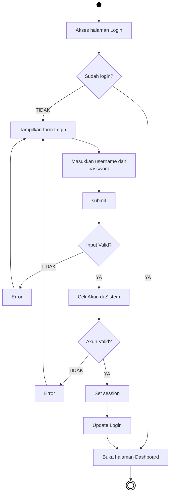
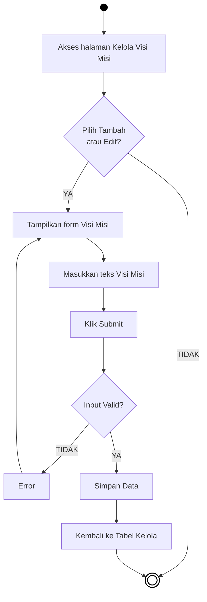
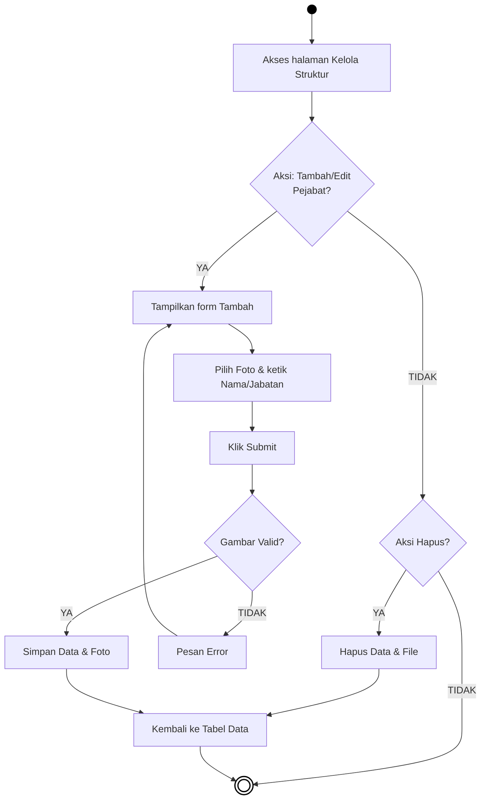
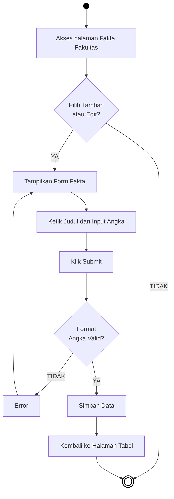
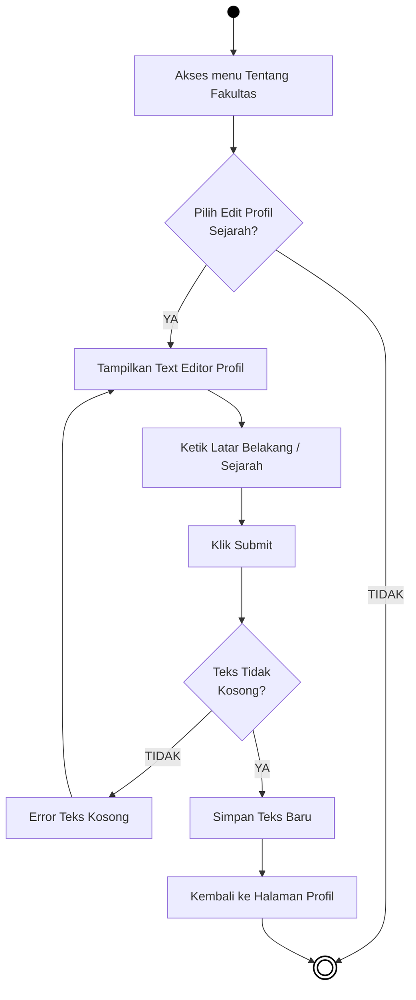

# BAB IV — PERANCANGAN SISTEM: 4.1 Activity Diagram (Administrator)

## 4.1.1 Pengertian *Activity Diagram* 
*Activity Diagram* (Diagram Aktivitas) digunakan untuk menggambarkan urutan aktivitas proses pada suatu sistem. Pada dokumen ini, diagram difokuskan pada pengelolaan konten dan antarmuka yang dikendalikan secara eksklusif oleh pihak **Administrator**. Diagram ini menggunakan model aliran konvensional demi kemudahan pembacaan. Komponen lingkaran penuh berwarna solid menunjukkan *Start Node* (titik awal kegiatan), sedangkan lingkaran dengan garis ganda menunjukkan *End Node* (titik akhir kegiatan).

---

## 4.2 Alur Aktivitas Administrator

### 4.2.1 Activity Diagram Login Administrator

***Gambar 4.1** Activity Diagram Login Administrator*

**Penjelasan:**  
Diagram ini menjelaskan alur sistem saat administrator melakukan proses masuk (*login*) agar dapat mengelola web. Pertama, saat pengguna masuk ke halaman *login*, sistem akan memeriksa apakah perangkat mereka masih menyimpan sesi aktif. Jika iya, pengguna tak perlu login dan langsung dialihkan menuju halaman *dashboard*. Namun jika sesi belum terbuka, pengguna harus berhadapan dengan formulir akun. Sesudah administrator mengisi teks *username* berserta *password* dan menekan tombol *submit*, validasi program berjalan. Jika ada ruang form yang melompong, pesan peringatan akan mencuat. Apabila divalidasi tidak kosong, kombinasi pengguna pun dicocokkan di dalam sistem utama (*database*). Di mana saat data bersikap sah bersesuaian, interaksi direkam lalu otorisasinya ditetapkan demi memberikan ruang bagi penggunanya masuk mengakses manajemen pusat sistemnya (*dashboard*).

---

### 4.2.2 Activity Diagram Menu Kelola Visi dan Misi

***Gambar 4.2** Activity Diagram Menu Kelola Visi Misi*

**Penjelasan:**  
Siklus kegiatan administrasi sistem pada pandangan pertama dapat diamati dari pengelolaan tabel informasi dasar yakni Visi Misi ini. Usai administrator bermula mengakses tabel di halaman, ia mendapat rute ke pengubahan jika memencet bel tombol *Tambah* atau *Edit*. Interaksi ini memampangkan kotak perihal untuk ditaruh ketikan wacananya. Selepas penekan tombol operasional (*Submit*) dieksekusi, permeriksaan ketelitian mencegah kejadian kotak form yang sekadar diisi kosong. Form kosong membawakan rute alur mundur yang memamerkan rintangan wujud pesan keluhan program (*Error*). Bilamana tulisan masukan bernilai patut dan dinilai aman kelengkapanya, pemrosesan bertungkus lumus memposisikan dan melabuhkan wacana baru mendarat di kerangka basis data demi kelak memperlihatkan profil gubahannya secara cepat sewaktu layar dialihkan.

---

### 4.2.3 Activity Diagram Menu Pengelolaan Struktur Organisasi

***Gambar 4.3** Activity Diagram Menu Kelola Struktur Organisasi*

**Penjelasan:**  
Penambahan deretan profil Pemangku Organisasi tidak leluasa membiarkan pendaftaran nama teks, haruslah dibarengi unggahan media visual sosok potretnya. Begitu aksi tambah form menyala, kelengkapannya mesti direstui melalui tombol pengajuan (*Submit*). Hal yang diandalkan dari pemeriksaan tahapan kali ini condong tertitik berat pada kewajaran bentuk format gambarnya, sekiranya dokumen disetorkan ternyata berupa format video berlawanan (bukan berjenis berkas profil potret awam .JPG / .PNG). Atas kekeliruan pementasan formatnya, transaksi ini terhadang memicu instruksi peringatan eror. Di satu bingkai lainnya saat semua diisi komplit beserta lampiran medianya pas, pengunggahan dilakukan terpadu mentransfer fotonya ke penyimpan *server* sekalian mendelegasikannya serangkaian dengan catatannya melintasi *Database*. Sementara aksi sekunder administrator seputar memusnahkan salah satu laporan pejabat, alur ini akan memuat pencopotan terintegrasi data tulis pada *database* sekaligus membuang fotonya sama rata.

---

### 4.2.4 Activity Diagram Menu Pengelolaan Fakta Fakultas

***Gambar 4.4** Activity Diagram Menu Kelola Fakta Fakultas*

**Penjelasan:**  
Administrasi pengisian papan kuantitas hitung mahasiswa mapun kepegawaian dilaksanakan mengikuti kelola Fakta Fakultas. Di saat administrator memasuki area form entri parameter angkanya lalu diutuskan penekanan kiriman, kelengkapan inputannya senantiasa difilter mencegah masuknya campur tangan abjad murni di dalam kolom bilangan berhitungnya. Parameter numerik ditugaskan menuntut pengisian hitungan wajar agar saat eksekusinya berjalan sistem mampu mencerna angka dan menyimpannya ke memori tanpa *error*. Melanggar standar validasi kuantitas tersebut bakalan mencegat kemajuan transaksi mengembalikan pandang form dibulatkan dengan isyarat pesan kegagalan pelaporan, namun ketersediaan form wajar berisikan bilangan murni pasti lolos menembus tatanan perubah di *database* dan segera merefleksikan jumlah terbarunya.

---

### 4.2.5 Activity Diagram Menu Pengelolaan Tentang Fakultas

***Gambar 4.5** Activity Diagram Menu Kelola Tentang Fakultas*

**Penjelasan:**  
Prosedur kelola catatan Latar Belakang (Tentang Fakultas) ini dipahami layaknya kelola modul kepenulisan wacana editor utuh, mendayagunakan antarmuka pengetikan artikel lapang. Di mana kelar mengetikan cerita kampus, operasional transmisi tombol pengiriman difungsikan ke peladen yang mendewasakan kebijakan blok proteksi tulisan tak kasat rumpang. Umpamanya form narasi ditaksir lolos dalam bingkai kondisi kepunahan spasi berkat hilangnya masukan keseluruhan, form seerta merta menjatuhkan penggunanya tersandung pesan hambatan operasional kosong ketikan isi wacana. Sebalik rute amannya, keberhasilan mencatatnya bakal menuangkan gubahan penceritaan itu merombak letak tabel catatannya lalu mengalihkan tampil ke profil peragaan semulanya.
