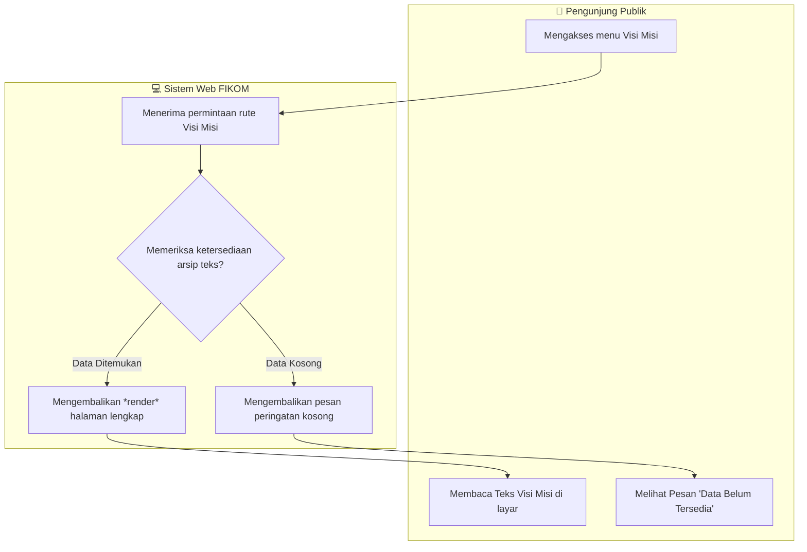
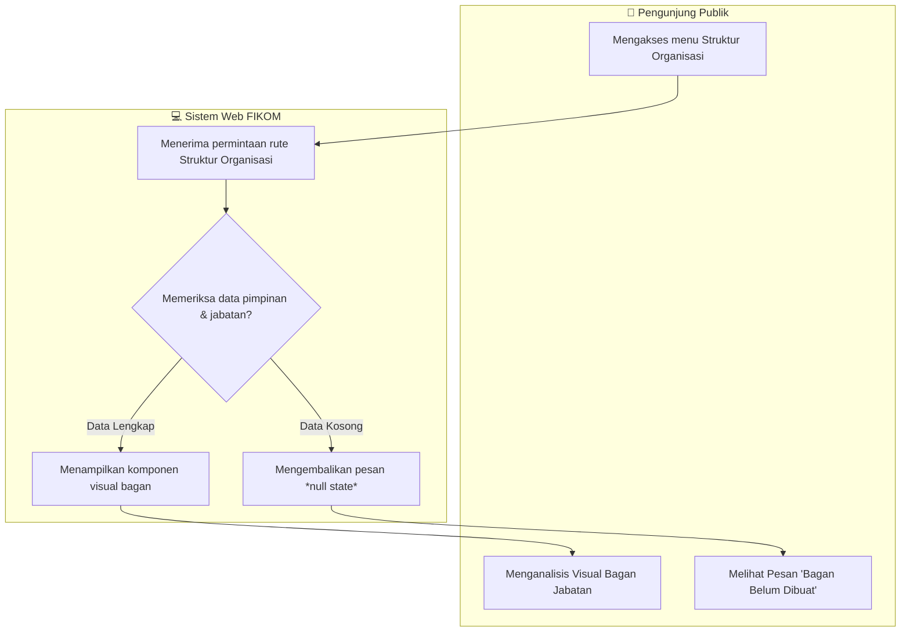
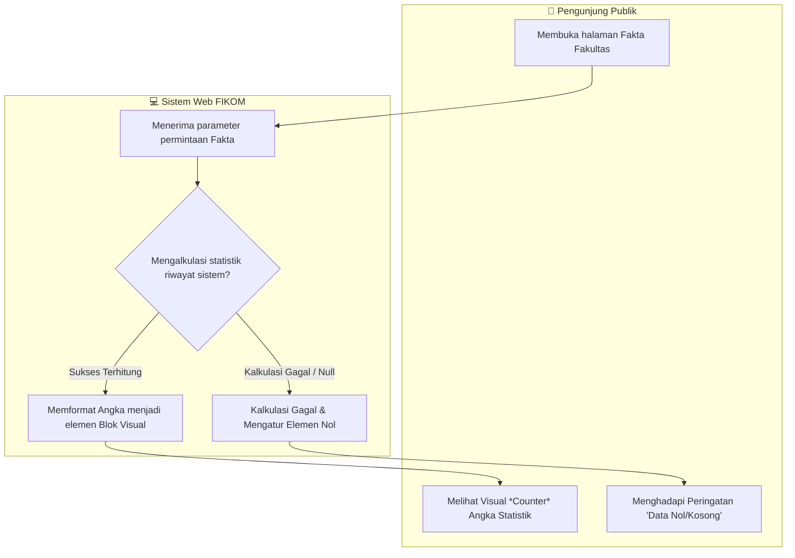
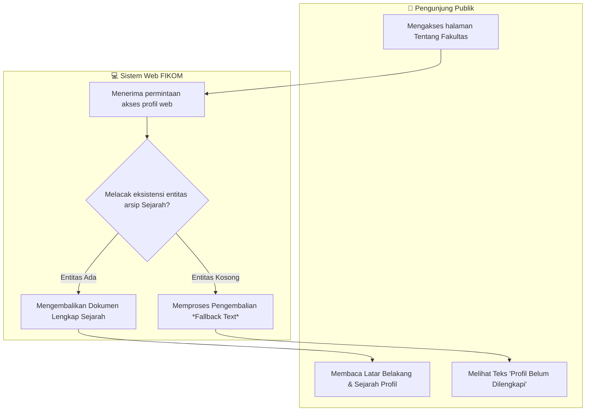

# BAB IV — PERANCANGAN SISTEM: 4.1 Activity Diagram

## 4.1.1 Pengertian *Activity Diagram* dan *Swimlane*
*Activity Diagram* adalah salah satu diagram perilaku (*behavioral diagram*) dalam *Unified Modeling Language* (UML) yang digunakan untuk mengilustrasikan alur kerja atau aktivitas dari sebuah sistem maupun proses bisnis. Diagram ini memodelkan langkah-langkah prosedural, percabangan keputusan (*decision*), hingga proses paralel. Penggunaan *Swimlane* (jalur renang) bertujuan untuk mempartisi atau membagi aktivitas berdasarkan aktor atau komponen yang bertanggung jawab atas setiap proses, sehingga memberikan kejelasan mengenai siapa yang mengeksekusi tindakan tertentu dan bagaimana interaksinya dengan sistem.

## 4.1.2 Aktor yang Terlibat
Pada sistem *Web* Fakultas Ilmu Komputer, aktor-aktor yang berinteraksi dalam modul profil publik ini direpresentasikan dalam tabel berikut:

| Aktor | Emoji | Keterangan |
|:---|:---:|:---|
| Pengunjung / Mahasiswa | 👤 | Pengguna publik yang mengakses halaman sistem untuk mencari informasi profil fakultas tanpa memerlukan autentikasi (*login*). |

---

## 4.2 Alur Aktivitas Sistem

### 4.2.1 Activity Diagram Visi dan Misi

***Gambar 4.1** Activity Diagram Visi dan Misi*

Diagram di atas mengilustrasikan alur proses ketika seorang pengunjung mencoba mengakses informasi **Visi dan Misi** fakultas. Proses diawali dengan interaksi pengguna pada antarmuka navigasi yang kemudian ditransmisikan menuju ke sisi peladen (*server*). Sistem selanjutnya mengeksekusi protokol pencarian pada pangkalan basis data untuk menentukan keberadaan entitas data visi dan misi. Apabila kueri dinilai valid dan rekaman tersedia, sistem akan mengimplementasikan proses *rendering* sehingga dokumen tekstual tersebut direpresentasikan pada halaman publik secara utuh. Sebaliknya, apabila pengembalian parameter mendeteksi nilai nihil, sistem akan secara otomatis merespons melalui percabangan kondisi yang memunculkan peringatan bahwa informasi belum tersedia.

---

### 4.2.2 Activity Diagram Struktur Organisasi

***Gambar 4.2** Activity Diagram Struktur Organisasi*

Diagram ini menggambarkan interaksi struktural manakala pengunjung bermaksud meninjau hierarki pemangku jabatan melalui menu **Struktur Organisasi**. Proses diinisiasi saat permintaan pengaksesan rute diantarkan ke lapisan logika backend. Sistem mengeksekusi evaluasi terhadap sekumpulan baris data yang menyimpan parameter relasional mengenai posisi pimpinan fakultas. Konfirmasi bahwa data pimpinan berhasil diurai akan mendorong sistem untuk merangkainya ke dalam format elemen antarmuka hierarkis yang tertata secara simetris ke hadapan pengguna. Namun, jika basis data mengonfirmasi kekosongan daftar pejabat, percabangan penolakan akan aktif untuk merepresentasikan *null state* sebagai informasi transisional.

---

### 4.2.3 Activity Diagram Fakta Fakultas

***Gambar 4.3** Activity Diagram Fakta Fakultas*

Interaksi konseptual pada diagram di atas mengilustrasikan mekanisme kalkulasi komputasional saat pengunjung menjelajahi menu **Fakta Fakultas**. Fase mula dipicu ketika akses navigasi diarahkan untuk memanggil rangkuman angka pendataan (*counter*). Sistem lantas menelusuri secara rekursif agregasi hitungan dari entri rekaman (contohnya angka total mahasiswa dan jumlah dosen) guna menghasilkan parameter kuantitas absolut. Sekiranya kalkulasi logika memicu konfirmasi nilai yang wajar, sistem kemudian mengonversi digit matriks tersebut menjadi komponen grafis numerik (*counter*) elegan. Walau demikian, seandainya komputasi tersebut menghadapi anomali ketidaktersediaan referensi logis, sistem diwajibkan menjerat pengecualian (*exception*) tersebut menjadi representasi konvensional bernilai empiris nol (0).

---

### 4.2.4 Activity Diagram Tentang Fakultas

***Gambar 4.4** Activity Diagram Tentang Fakultas*

Dokumen visual pamungkas di atas mensimulasikan protokol sistematis ketika pengunjung menjelajahi rekam jejak retrospeksi pada antarmuka **Tentang Fakultas**. Bersamaan dengan datangnya kueri pada arsitektur web tersebut, modul logika diperintahkan melacak dan membongkar entitas wacana panjang (*long-form text*) yang mendeskripsikan secara utuh riwayat histori fakultas. Apabila parameter respons menjustifikasi eksistensi narasi tersebut, blok *rendering* layar seketika difungsikan guna menghidangkan representasi naskah utuh yang menemanai pengalaman membaca audiens (*readability*). Pada skenario limitasi di mana tidak terdapat *string* karakter yang dimuat atau belum diedit oleh admin, fungsionalitas dialihkan paksa untuk menyalurkan *fallback text* moderat sebagai bentuk toleransi pembatasan konten sementara.
