# BAB IV — PERANCANGAN SISTEM: 4.1 Activity Diagram (Administrator)

## 4.1.1 Pengertian *Activity Diagram* 
*Activity Diagram* digunakan untuk menggambarkan urutan aktivitas pada suatu sistem. Dokumen ini berfokus pada **sisi Administrator** dalam mengelola konten web. Lingkaran hitam penuh menandai titik awal (*Start Node*), sedangkan lingkaran dengan garis ganda menandai titik akhir (*End Node*).

---

## 4.2 Alur Aktivitas Administrator

### 4.2.1 Activity Diagram Login Administrator

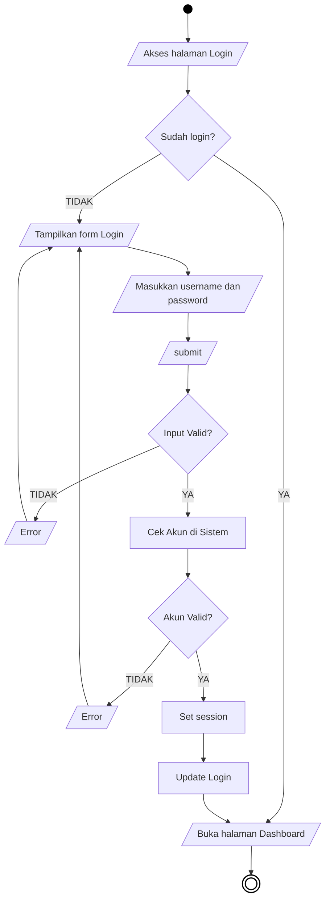
```mermaid
flowchart TD
    Start(( )) --> A[/Akses halaman Login/]
    A --> B{Sudah login?}
    
    B -- YA --> C[/Buka halaman Dashboard/]
    C --> End((( )))
    
    B -- TIDAK --> D[/Tampilkan form Login/]
    D --> E[/Masukkan username dan<br>password/]
    E --> F[/submit/]
    F --> G{Input Valid?}
    
    G -- TIDAK --> H[/Error/]
    H --> D
    
    G -- YA --> I[Cek Akun di Sistem]
    I --> J{Akun Valid?}
    
    J -- TIDAK --> K[/Error/]
    K --> D
    
    J -- YA --> L[Set session]
    L --> M[Update Login]
    M --> C
    
    style Start fill:#000,stroke:#000,color:#000
    style End fill:#fff,stroke:#000,stroke-width:2px
```
***Gambar 4.1** Activity Diagram Login Administrator*

**Penjelasan:**
Ketika admin mengakses halaman login, sistem memeriksa apakah sesi masih aktif. Jika aktif, admin langsung diarahkan ke Dashboard. Jika belum, admin mengisi formulir *username* dan *password*. Sistem memvalidasi input; jika kosong atau tidak cocok dengan data di sistem, muncul pesan error dan admin harus mengisi ulang. Jika valid, sesi dibuat dan admin diarahkan ke Dashboard.

---

### 4.2.2 Activity Diagram Menu Kelola Visi dan Misi

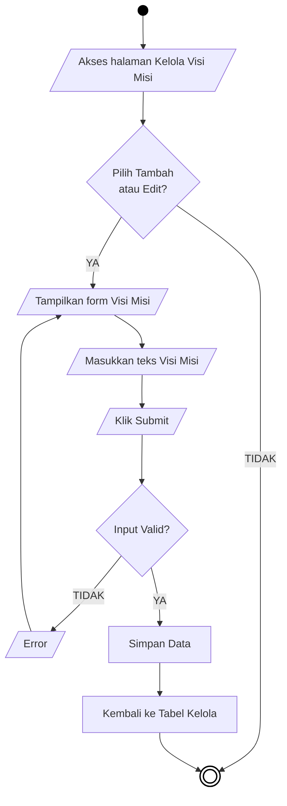
```mermaid
flowchart TD
    Start(( )) --> A[/Akses halaman Kelola Visi Misi/]
    
    A --> B{Pilih Tambah\natau Edit?}
    
    B -- YA --> C[/Tampilkan form Visi Misi/]
    B -- TIDAK --> End((( )))
    
    C --> D[/Masukkan teks Visi Misi/]
    D --> E[/Klik Submit/]
    E --> F{Input Valid?}
    
    F -- TIDAK --> G[/Error/]
    G --> C
    
    F -- YA --> H[Simpan Data]
    H --> I[Kembali ke Tabel Kelola]
    I --> End
    
    style Start fill:#000,stroke:#000,color:#000
    style End fill:#fff,stroke:#000,stroke-width:2px
```
***Gambar 4.2** Activity Diagram Menu Kelola Visi Misi*

**Penjelasan:**
Admin membuka halaman, lalu memilih **Tambah** atau **Edit** untuk menampilkan formulir isian teks Visi dan Misi. Setelah menekan Submit, sistem memeriksa apakah form terisi. Jika kosong, muncul pesan error. Jika valid, data disimpan dan admin dikembalikan ke halaman tabel.

---

### 4.2.3 Activity Diagram Menu Pengelolaan Struktur Organisasi

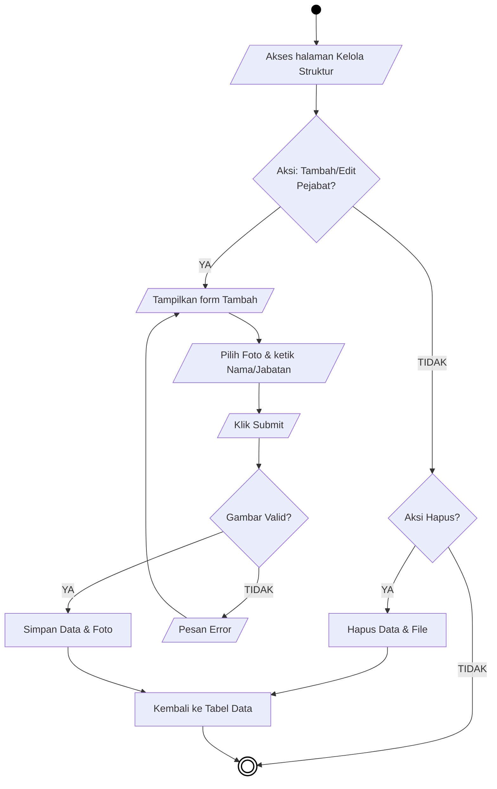
```mermaid
flowchart TD
    Start(( )) --> A[/Akses halaman Kelola Struktur/]
    
    A --> B{Aksi: Tambah/Edit\nPejabat?}
    
    B -- TIDAK --> Hapus{Aksi Hapus?}
    Hapus -- YA --> HC[Hapus Data & File]
    Hapus -- TIDAK --> End((( )))
    HC --> I[Kembali ke Tabel Data]
    
    B -- YA --> C[/Tampilkan form Tambah/]
    C --> D[/Pilih Foto & ketik Nama/Jabatan/]
    D --> E[/Klik Submit/]
    E --> F{Gambar Valid?}
    
    F -- TIDAK --> G[/Pesan Error/]
    G --> C
    
    F -- YA --> H[Simpan Data & Foto]
    H --> I
    I --> End
    
    style Start fill:#000,stroke:#000,color:#000
    style End fill:#fff,stroke:#000,stroke-width:2px
```
***Gambar 4.3** Activity Diagram Menu Kelola Struktur Organisasi*

**Penjelasan:**
Admin mengisi formulir dengan Nama, Jabatan, dan Foto Pejabat, lalu menekan Submit. Sistem memvalidasi format file gambar; jika tidak valid (bukan JPG/PNG), muncul pesan error. Jika valid, foto disimpan ke server dan data disimpan ke database. Untuk **Hapus**, sistem menghapus foto dan data sekaligus.

---

### 4.2.4 Activity Diagram Menu Pengelolaan Fakta Fakultas

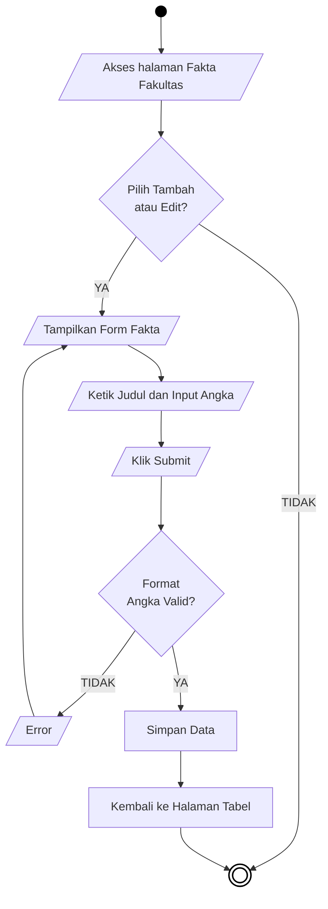
```mermaid
flowchart TD
    Start(( )) --> A[/Akses halaman Fakta Fakultas/]
    
    A --> B{Pilih Tambah\natau Edit?}
    B -- TIDAK --> End((( )))
    
    B -- YA --> C[/Tampilkan Form Fakta/]
    C --> D[/Ketik Judul dan Input Angka/]
    D --> E[/Klik Submit/]
    
    E --> F{Format\nAngka Valid?}
    F -- TIDAK --> G[/Error/]
    G --> C
    
    F -- YA --> H[Simpan Data]
    H --> I[Kembali ke Halaman Tabel]
    I --> End
    
    style Start fill:#000,stroke:#000,color:#000
    style End fill:#fff,stroke:#000,stroke-width:2px
```
***Gambar 4.4** Activity Diagram Menu Kelola Fakta Fakultas*

**Penjelasan:**
Admin mengisi Judul dan nilai angka statistik fakultas, lalu menekan Submit. Sistem memvalidasi bahwa kolom angka hanya berisi bilangan numerik. Jika formatnya salah, muncul error. Jika valid, data disimpan dan halaman kembali ke tabel.

---

### 4.2.5 Activity Diagram Menu Pengelolaan Tentang Fakultas

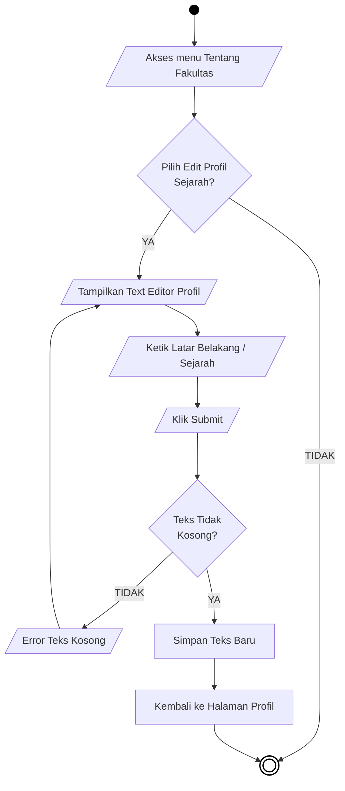
```mermaid
flowchart TD
    Start(( )) --> A[/Akses menu Tentang Fakultas/]
    
    A --> B{Pilih Edit Profil\nSejarah?}
    B -- TIDAK --> End((( )))
    
    B -- YA --> C[/Tampilkan Text Editor Profil/]
    C --> D[/Ketik Latar Belakang / Sejarah/]
    D --> E[/Klik Submit/]
    E --> F{Teks Tidak\nKosong?}
    
    F -- TIDAK --> G[/Error Teks Kosong/]
    G --> C
    
    F -- YA --> H[Simpan Teks Baru]
    H --> I[Kembali ke Halaman Profil]
    I --> End
    
    style Start fill:#000,stroke:#000,color:#000
    style End fill:#fff,stroke:#000,stroke-width:2px
```
***Gambar 4.5** Activity Diagram Menu Kelola Tentang Fakultas*

**Penjelasan:**
Admin mengedit narasi sejarah dan latar belakang fakultas melalui *Text Editor*. Setelah Submit, sistem memeriksa apakah teks tidak kosong. Jika kosong, muncul pesan error. Jika terisi, teks baru disimpan ke database dan halaman kembali ke tampilan profil.

---

### 4.2.6 Activity Diagram Menu Kelola Slider Beranda

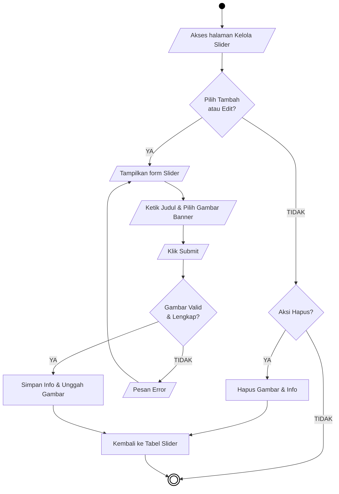
```mermaid
flowchart TD
    Start(( )) --> A[/Akses halaman Kelola Slider/]
    
    A --> B{Pilih Tambah\natau Edit?}
    
    B -- TIDAK --> Hapus{Aksi Hapus?}
    Hapus -- YA --> HC[Hapus Gambar & Info]
    Hapus -- TIDAK --> End((( )))
    HC --> I[Kembali ke Tabel Slider]
    
    B -- YA --> C[/Tampilkan form Slider/]
    C --> D[/Ketik Judul & Pilih Gambar Banner/]
    D --> E[/Klik Submit/]
    
    E --> F{Gambar Valid\n& Lengkap?}
    F -- TIDAK --> G[/Pesan Error/]
    G --> C
    
    F -- YA --> H[Simpan Info & Unggah Gambar]
    H --> I
    I --> End
    
    style Start fill:#000,stroke:#000,color:#000
    style End fill:#fff,stroke:#000,stroke-width:2px
```
***Gambar 4.6** Activity Diagram Menu Kelola Slider*

**Penjelasan:**
Admin mengisi judul dan mengunggah gambar *banner* untuk halaman beranda. Sistem memvalidasi format dan kelengkapan file gambar. Jika tidak valid, muncul error. Jika valid, gambar diunggah ke server dan data disimpan ke database. Untuk **Hapus**, gambar dan data dihapus sekaligus.

---

### 4.2.7 Activity Diagram Menu Kelola Berita & Artikel

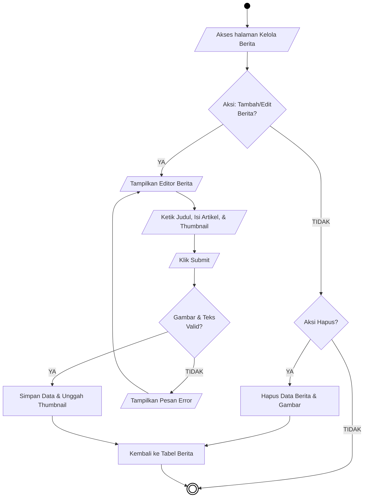
```mermaid
flowchart TD
    Start(( )) --> A[/Akses halaman Kelola Berita/]
    
    A --> B{Aksi: Tambah/Edit\nBerita?}
    
    B -- TIDAK --> Hapus{Aksi Hapus?}
    Hapus -- YA --> HC[Hapus Data Berita & Gambar]
    Hapus -- TIDAK --> End((( )))
    HC --> I[Kembali ke Tabel Berita]
    
    B -- YA --> C[/Tampilkan Editor Berita/]
    C --> D[/Ketik Judul, Isi Artikel, & Thumbnail/]
    D --> E[/Klik Submit/]
    
    E --> F{Gambar & Teks\nValid?}
    F -- TIDAK --> G[/Tampilkan Pesan Error/]
    G --> C
    
    F -- YA --> H[Simpan Data & Unggah Thumbnail]
    H --> I
    I --> End
    
    style Start fill:#000,stroke:#000,color:#000
    style End fill:#fff,stroke:#000,stroke-width:2px
```
***Gambar 4.7** Activity Diagram Menu Kelola Berita*

**Penjelasan:**
Admin mengisi Judul, Isi Artikel (*Rich Text Editor*), dan Foto Thumbnail, lalu menekan Submit. Sistem memvalidasi teks dan format gambar. Jika tidak valid, muncul error. Jika valid, thumbnail diunggah ke server dan data berita disimpan ke database. Untuk **Hapus**, foto dan data berita dihapus sekaligus.

---

### 4.2.8 Activity Diagram Menu Kelola Dosen

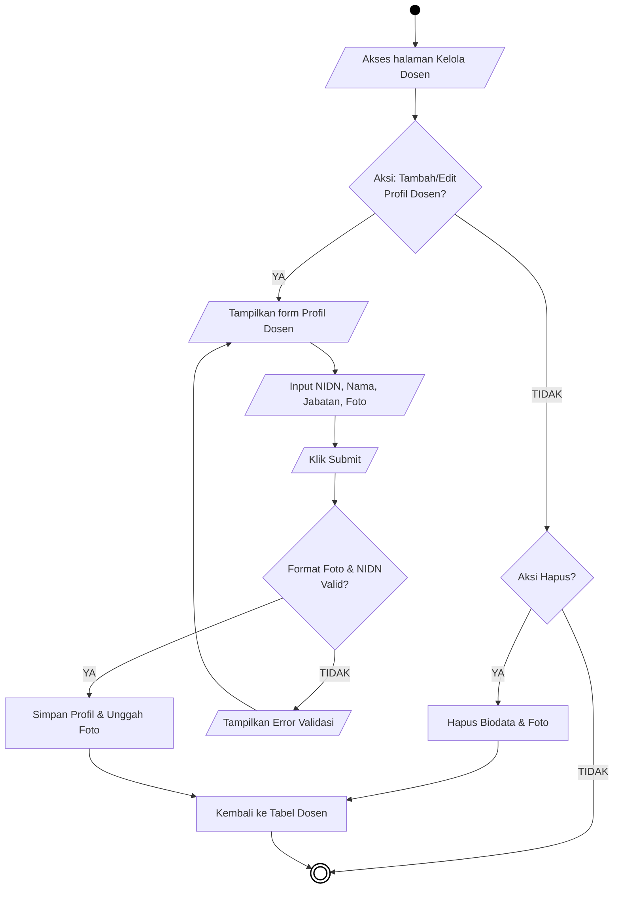
```mermaid
flowchart TD
    Start(( )) --> A[/Akses halaman Kelola Dosen/]
    
    A --> B{Aksi: Tambah/Edit\nProfil Dosen?}
    
    B -- TIDAK --> Hapus{Aksi Hapus?}
    Hapus -- YA --> HC[Hapus Biodata & Foto]
    Hapus -- TIDAK --> End((( )))
    HC --> I[Kembali ke Tabel Dosen]
    
    B -- YA --> C[/Tampilkan form Profil Dosen/]
    C --> D[/Input NIDN, Nama, Jabatan, Foto/]
    D --> E[/Klik Submit/]
    
    E --> F{Format Foto & NIDN\nValid?}
    F -- TIDAK --> G[/Tampilkan Error Validasi/]
    G --> C
    
    F -- YA --> H[Simpan Profil & Unggah Foto]
    H --> I
    I --> End
    
    style Start fill:#000,stroke:#000,color:#000
    style End fill:#fff,stroke:#000,stroke-width:2px
```
***Gambar 4.8** Activity Diagram Menu Kelola Dosen*

**Penjelasan:**
Admin mengisi data dosen (NIDN, Nama, Jabatan) dan mengunggah Foto Profil. Sistem memvalidasi format foto dan nomor NIDN. Jika tidak valid, muncul pesan error. Jika valid, foto diunggah ke server dan data dosen disimpan ke database. Untuk **Hapus**, foto dan biodata dihapus sekaligus.

---

### 4.2.9 Activity Diagram Menu Kelola Ruangan Kelas

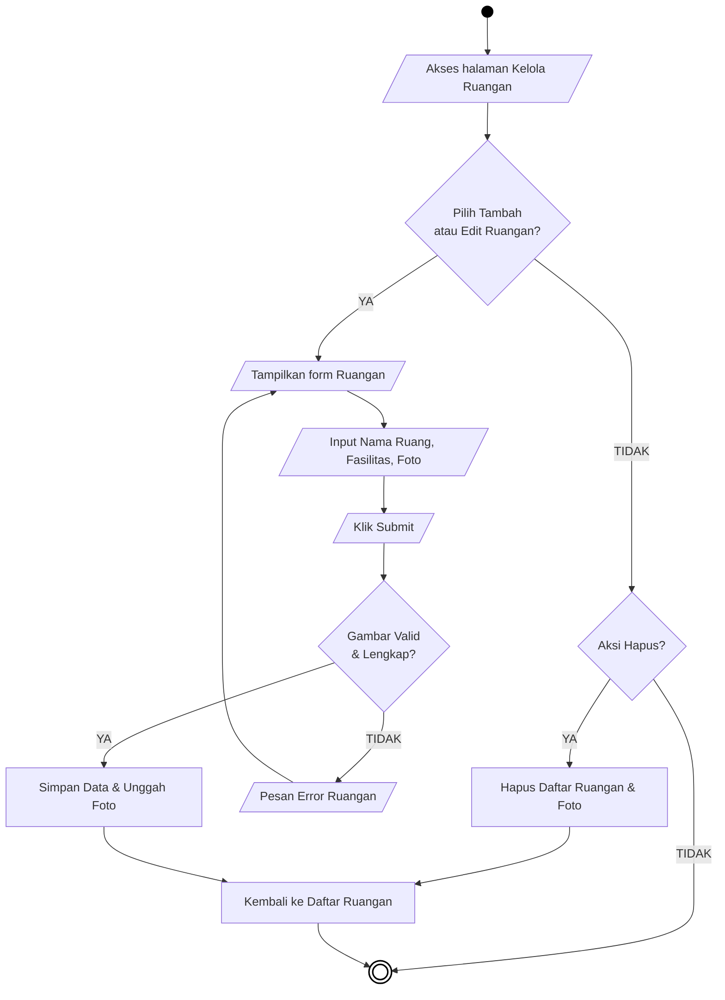
```mermaid
flowchart TD
    Start(( )) --> A[/Akses halaman Kelola Ruangan/]
    
    A --> B{Pilih Tambah\natau Edit Ruangan?}
    
    B -- TIDAK --> Hapus{Aksi Hapus?}
    Hapus -- YA --> HC[Hapus Daftar Ruangan & Foto]
    Hapus -- TIDAK --> End((( )))
    HC --> I[Kembali ke Daftar Ruangan]
    
    B -- YA --> C[/Tampilkan form Ruangan/]
    C --> D[/Input Nama Ruang, Fasilitas, Foto/]
    D --> E[/Klik Submit/]
    
    E --> F{Gambar Valid\n& Lengkap?}
    F -- TIDAK --> G[/Pesan Error Ruangan/]
    G --> C
    
    F -- YA --> H[Simpan Data & Unggah Foto]
    H --> I
    I --> End
    
    style Start fill:#000,stroke:#000,color:#000
    style End fill:#fff,stroke:#000,stroke-width:2px
```
***Gambar 4.9** Activity Diagram Menu Kelola Ruangan Kelas*

**Penjelasan:**
Admin mengisi Nama Ruang, keterangan Fasilitas, dan mengunggah Foto Ruangan. Sistem memvalidasi format dan kelengkapan gambar. Jika tidak valid, muncul error. Jika valid, foto disimpan ke server dan data ruangan tersimpan ke database. Untuk **Hapus**, foto dan data ruangan dihapus sekaligus.

---

### 4.2.10 Activity Diagram Menu Kelola Laboratorium

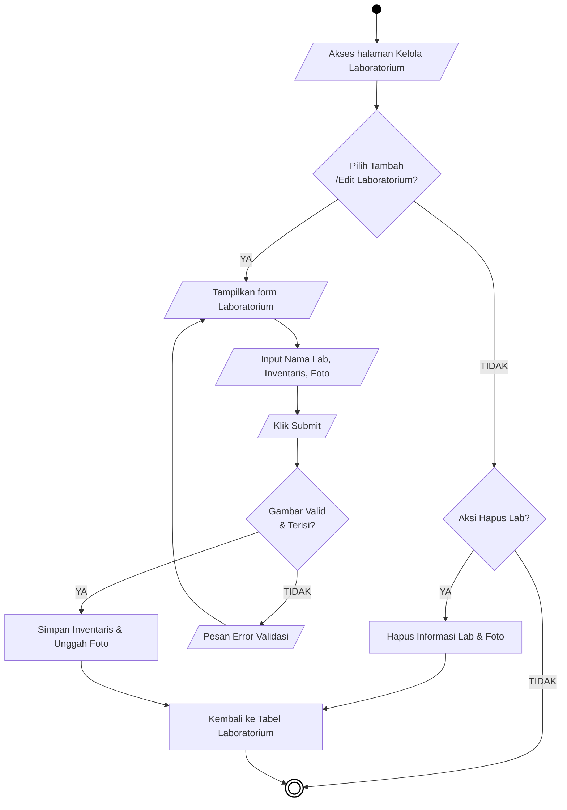
```mermaid
flowchart TD
    Start(( )) --> A[/Akses halaman Kelola Laboratorium/]
    
    A --> B{Pilih Tambah\n/Edit Laboratorium?}
    
    B -- TIDAK --> Hapus{Aksi Hapus Lab?}
    Hapus -- YA --> HC[Hapus Informasi Lab & Foto]
    Hapus -- TIDAK --> End((( )))
    HC --> I[Kembali ke Tabel Laboratorium]
    
    B -- YA --> C[/Tampilkan form Laboratorium/]
    C --> D[/Input Nama Lab, Inventaris, Foto/]
    D --> E[/Klik Submit/]
    
    E --> F{Gambar Valid\n& Terisi?}
    F -- TIDAK --> G[/Pesan Error Validasi/]
    G --> C
    
    F -- YA --> H[Simpan Inventaris & Unggah Foto]
    H --> I
    I --> End
    
    style Start fill:#000,stroke:#000,color:#000
    style End fill:#fff,stroke:#000,stroke-width:2px
```
***Gambar 4.10** Activity Diagram Menu Kelola Laboratorium*

**Penjelasan:**
Admin mengisi Nama Lab, daftar Inventaris, dan mengunggah Foto Laboratorium. Sistem memvalidasi format gambar dan kelengkapan isian. Jika tidak valid, muncul error. Jika valid, foto diunggah ke server dan data lab disimpan ke database. Untuk **Hapus**, foto dan data lab dihapus sekaligus.

---

### 4.2.11 Activity Diagram Menu Kelola Kalender Akademik

```mermaid
flowchart TD
    Start(( )) --> A[/Akses halaman Kelola Kalender/]
    
    A --> B{Pilih Tambah\n/Edit Agenda?}
    
    B -- TIDAK --> Hapus{Aksi Hapus?}
    Hapus -- YA --> HC[Hapus Jadwal Akademik]
    Hapus -- TIDAK --> End((( )))
    HC --> I[Kembali ke Tabel Kalender]
    
    B -- YA --> C[/Tampilkan form Kalender/]
    C --> D[/Input Kegiatan, Tanggal, & SMT/]
    D --> E[/Klik Submit/]
    
    E --> F{Tanggal &\nTeks Valid?}
    F -- TIDAK --> G[/Pesan Error Validasi/]
    G --> C
    
    F -- YA --> H[Simpan Data]
    H --> I
    I --> End
    
    style Start fill:#000,stroke:#000,color:#000
    style End fill:#fff,stroke:#000,stroke-width:2px
```
***Gambar 4.11** Activity Diagram Menu Kelola Kalender Akademik*

**Penjelasan:**
Admin mengisi Nama Kegiatan, Tanggal, dan Semester, lalu menekan Submit. Sistem memvalidasi format tanggal dan kelengkapan teks. Jika tidak valid, muncul error. Jika valid, data kalender disimpan dan halaman kembali ke tabel agenda.

---

### 4.2.12 Activity Diagram Menu Kelola Kurikulum

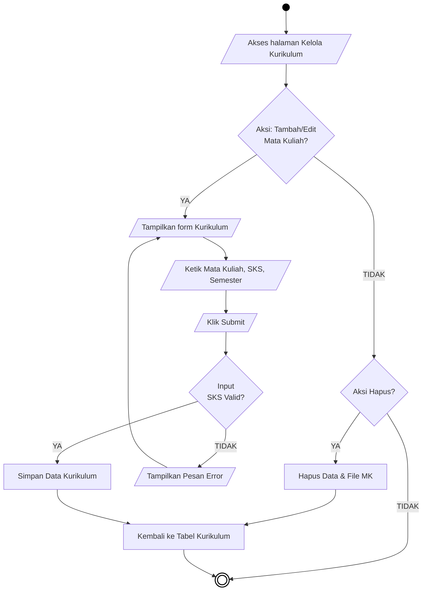
```mermaid
flowchart TD
    Start(( )) --> A[/Akses halaman Kelola Kurikulum/]
    
    A --> B{Aksi: Tambah/Edit\nMata Kuliah?}
    
    B -- TIDAK --> Hapus{Aksi Hapus?}
    Hapus -- YA --> HC[Hapus Data & File MK]
    Hapus -- TIDAK --> End((( )))
    HC --> I[Kembali ke Tabel Kurikulum]
    
    B -- YA --> C[/Tampilkan form Kurikulum/]
    C --> D[/Ketik Mata Kuliah, SKS, Semester/]
    D --> E[/Klik Submit/]
    
    E --> F{Input\nSKS Valid?}
    F -- TIDAK --> G[/Tampilkan Pesan Error/]
    G --> C
    
    F -- YA --> H[Simpan Data Kurikulum]
    H --> I
    I --> End
    
    style Start fill:#000,stroke:#000,color:#000
    style End fill:#fff,stroke:#000,stroke-width:2px
```
***Gambar 4.12** Activity Diagram Menu Kelola Kurikulum*

**Penjelasan:**
Admin mengisi Nama Mata Kuliah, jumlah SKS, dan Semester, lalu menekan Submit. Sistem memvalidasi bahwa kolom SKS berisi angka yang valid. Jika tidak valid, muncul error. Jika valid, data kurikulum disimpan ke database dan halaman kembali ke tabel.

---

### 4.2.13 Activity Diagram Menu Kelola Kerjasama

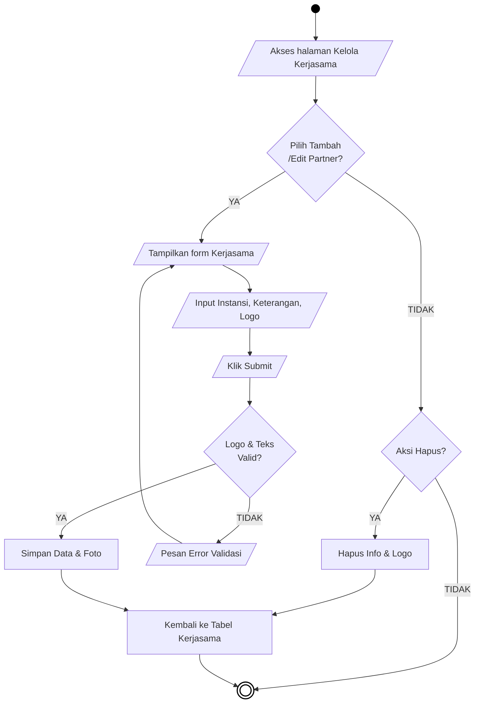
```mermaid
flowchart TD
    Start(( )) --> A[/Akses halaman Kelola Kerjasama/]
    
    A --> B{Pilih Tambah\n/Edit Partner?}
    
    B -- TIDAK --> Hapus{Aksi Hapus?}
    Hapus -- YA --> HC[Hapus Info & Logo]
    Hapus -- TIDAK --> End((( )))
    HC --> I[Kembali ke Tabel Kerjasama]
    
    B -- YA --> C[/Tampilkan form Kerjasama/]
    C --> D[/Input Instansi, Keterangan, Logo/]
    D --> E[/Klik Submit/]
    
    E --> F{Logo & Teks\nValid?}
    F -- TIDAK --> G[/Pesan Error Validasi/]
    G --> C
    
    F -- YA --> H[Simpan Data & Foto]
    H --> I
    I --> End
    
    style Start fill:#000,stroke:#000,color:#000
    style End fill:#fff,stroke:#000,stroke-width:2px
```
***Gambar 4.13** Activity Diagram Menu Kelola Kerjasama*

**Penjelasan:**
Admin mengisi Nama Instansi, Keterangan MoU, dan mengunggah Logo mitra. Sistem memvalidasi format logo dan kelengkapan teks. Jika tidak valid, muncul error. Jika valid, logo diunggah ke server dan data mitra disimpan ke database. Untuk **Hapus**, logo dan data dihapus sekaligus.

---

### 4.2.14 Activity Diagram Menu Kelola Pengabdian

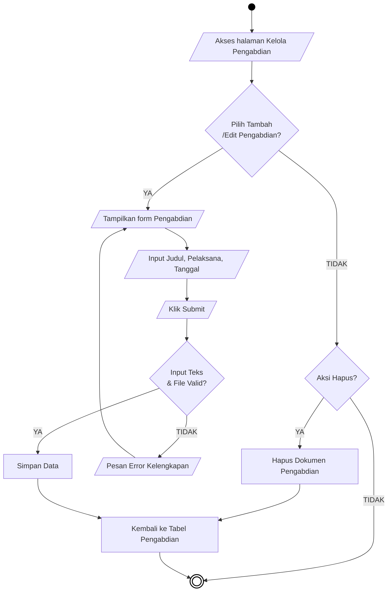
```mermaid
flowchart TD
    Start(( )) --> A[/Akses halaman Kelola Pengabdian/]
    
    A --> B{Pilih Tambah\n/Edit Pengabdian?}
    
    B -- TIDAK --> Hapus{Aksi Hapus?}
    Hapus -- YA --> HC[Hapus Dokumen Pengabdian]
    Hapus -- TIDAK --> End((( )))
    HC --> I[Kembali ke Tabel Pengabdian]
    
    B -- YA --> C[/Tampilkan form Pengabdian/]
    C --> D[/Input Judul, Pelaksana, Tanggal/]
    D --> E[/Klik Submit/]
    
    E --> F{Input Teks\n& File Valid?}
    F -- TIDAK --> G[/Pesan Error Kelengkapan/]
    G --> C
    
    F -- YA --> H[Simpan Data]
    H --> I
    I --> End
    
    style Start fill:#000,stroke:#000,color:#000
    style End fill:#fff,stroke:#000,stroke-width:2px
```
***Gambar 4.14** Activity Diagram Menu Kelola Pengabdian*

**Penjelasan:**
Admin mengisi Judul Kegiatan, Nama Pelaksana, dan Tanggal, lalu menekan Submit. Sistem memvalidasi kelengkapan teks dan file. Jika tidak lengkap, muncul error. Jika valid, data pengabdian disimpan ke database dan halaman kembali ke tabel.

---

### 4.2.15 Activity Diagram Menu Kelola Penelitian

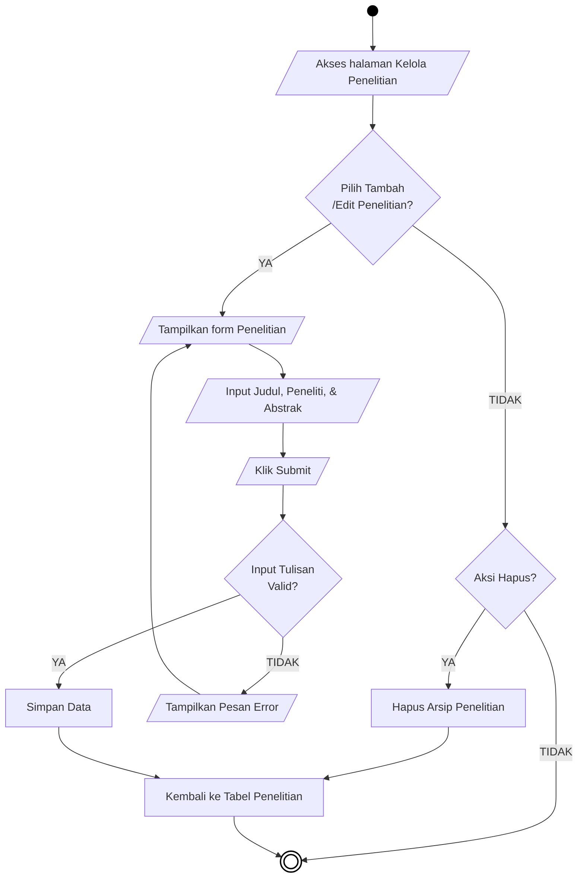
```mermaid
flowchart TD
    Start(( )) --> A[/Akses halaman Kelola Penelitian/]
    
    A --> B{Pilih Tambah\n/Edit Penelitian?}
    
    B -- TIDAK --> Hapus{Aksi Hapus?}
    Hapus -- YA --> HC[Hapus Arsip Penelitian]
    Hapus -- TIDAK --> End((( )))
    HC --> I[Kembali ke Tabel Penelitian]
    
    B -- YA --> C[/Tampilkan form Penelitian/]
    C --> D[/Input Judul, Peneliti, & Abstrak/]
    D --> E[/Klik Submit/]
    
    E --> F{Input Tulisan\nValid?}
    F -- TIDAK --> G[/Tampilkan Pesan Error/]
    G --> C
    
    F -- YA --> H[Simpan Data]
    H --> I
    I --> End
    
    style Start fill:#000,stroke:#000,color:#000
    style End fill:#fff,stroke:#000,stroke-width:2px
```
***Gambar 4.15** Activity Diagram Menu Kelola Penelitian*

**Penjelasan:**
Admin mengisi Judul Penelitian, Nama Peneliti, dan Abstrak, lalu menekan Submit. Sistem memvalidasi bahwa semua kolom teks terisi dan tidak kosong. Jika ada yang kosong, muncul error. Jika valid, data penelitian disimpan ke database dan halaman kembali ke tabel.

---

### 4.2.16 Activity Diagram Menu Kelola Dokumen Fakultas

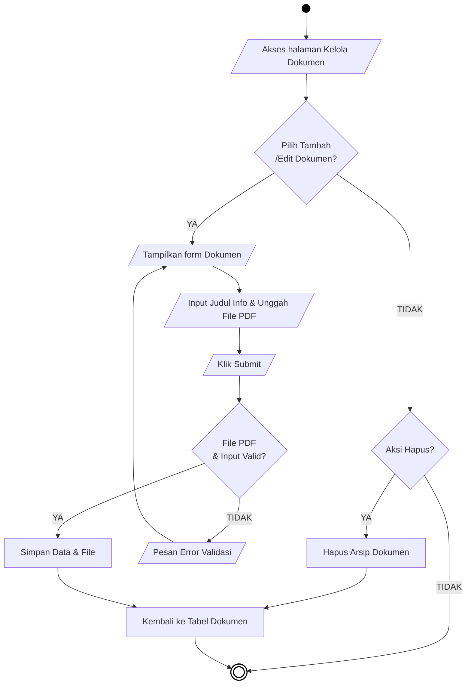
```mermaid
flowchart TD
    Start(( )) --> A[/Akses halaman Kelola Dokumen/]
    
    A --> B{Pilih Tambah\n/Edit Dokumen?}
    
    B -- TIDAK --> Hapus{Aksi Hapus?}
    Hapus -- YA --> HC[Hapus Arsip Dokumen]
    Hapus -- TIDAK --> End((( )))
    HC --> I[Kembali ke Tabel Dokumen]
    
    B -- YA --> C[/Tampilkan form Dokumen/]
    C --> D[/Input Judul Info & Unggah File PDF/]
    D --> E[/Klik Submit/]
    
    E --> F{File PDF\n& Input Valid?}
    F -- TIDAK --> G[/Pesan Error Validasi/]
    G --> C
    
    F -- YA --> H[Simpan Data & File]
    H --> I
    I --> End
    
    style Start fill:#000,stroke:#000,color:#000
    style End fill:#fff,stroke:#000,stroke-width:2px
```
***Gambar 4.16** Activity Diagram Menu Kelola Dokumen Fakultas*

**Penjelasan:**
Admin mengisi Judul Dokumen dan mengunggah file PDF. Sistem memvalidasi bahwa file yang diunggah berformat PDF. Jika bukan PDF, muncul error. Jika valid, file disimpan ke server dan data dokumen tersimpan ke database. Untuk **Hapus**, file dan data dihapus sekaligus.

---

### 4.2.17 Activity Diagram Menu Kelola Renstra

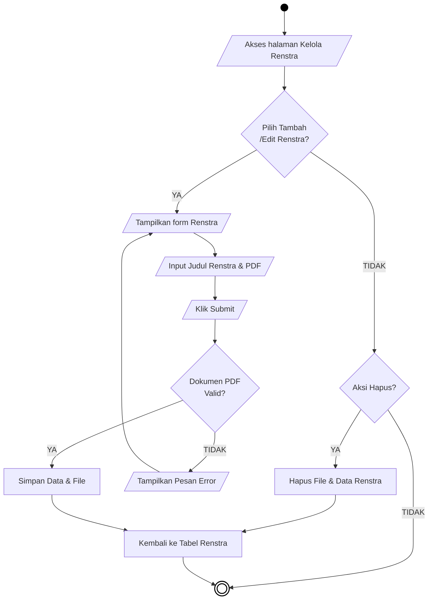
```mermaid
flowchart TD
    Start(( )) --> A[/Akses halaman Kelola Renstra/]
    
    A --> B{Pilih Tambah\n/Edit Renstra?}
    
    B -- TIDAK --> Hapus{Aksi Hapus?}
    Hapus -- YA --> HC[Hapus File & Data Renstra]
    Hapus -- TIDAK --> End((( )))
    HC --> I[Kembali ke Tabel Renstra]
    
    B -- YA --> C[/Tampilkan form Renstra/]
    C --> D[/Input Judul Renstra & PDF/]
    D --> E[/Klik Submit/]
    
    E --> F{Dokumen PDF\nValid?}
    F -- TIDAK --> G[/Tampilkan Pesan Error/]
    G --> C
    
    F -- YA --> H[Simpan Data & File]
    H --> I
    I --> End
    
    style Start fill:#000,stroke:#000,color:#000
    style End fill:#fff,stroke:#000,stroke-width:2px
```
***Gambar 4.17** Activity Diagram Menu Kelola Renstra*

**Penjelasan:**
Admin mengisi Judul dan mengunggah file PDF Rencana Strategis. Sistem memvalidasi format file PDF. Jika tidak valid, muncul error. Jika valid, file diunggah ke server dan data Renstra disimpan ke database. Untuk **Hapus**, file dan data dihapus sekaligus.

---

### 4.2.18 Activity Diagram Menu Kelola SOP

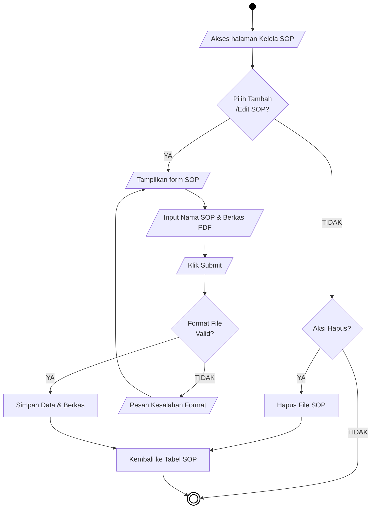
```mermaid
flowchart TD
    Start(( )) --> A[/Akses halaman Kelola SOP/]
    
    A --> B{Pilih Tambah\n/Edit SOP?}
    
    B -- TIDAK --> Hapus{Aksi Hapus?}
    Hapus -- YA --> HC[Hapus File SOP]
    Hapus -- TIDAK --> End((( )))
    HC --> I[Kembali ke Tabel SOP]
    
    B -- YA --> C[/Tampilkan form SOP/]
    C --> D[/Input Nama SOP & Berkas PDF/]
    D --> E[/Klik Submit/]
    
    E --> F{Format File\nValid?}
    F -- TIDAK --> G[/Pesan Kesalahan Format/]
    G --> C
    
    F -- YA --> H[Simpan Data & Berkas]
    H --> I
    I --> End
    
    style Start fill:#000,stroke:#000,color:#000
    style End fill:#fff,stroke:#000,stroke-width:2px
```
***Gambar 4.18** Activity Diagram Menu Kelola SOP*

**Penjelasan:**
Admin mengisi Nama SOP dan mengunggah file PDF pedoman. Sistem memvalidasi format file; jika bukan PDF, muncul error. Jika valid, file disimpan ke server dan data SOP tersimpan ke database. Untuk **Hapus**, file dan data SOP dihapus sekaligus.

---

### 4.2.19 Activity Diagram Menu Kelola BEM

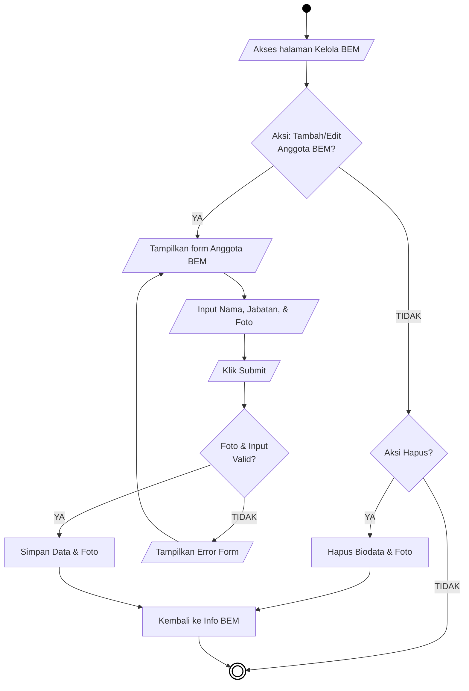
```mermaid
flowchart TD
    Start(( )) --> A[/Akses halaman Kelola BEM/]
    
    A --> B{Aksi: Tambah/Edit\nAnggota BEM?}
    
    B -- TIDAK --> Hapus{Aksi Hapus?}
    Hapus -- YA --> HC[Hapus Biodata & Foto]
    Hapus -- TIDAK --> End((( )))
    HC --> I[Kembali ke Info BEM]
    
    B -- YA --> C[/Tampilkan form Anggota BEM/]
    C --> D[/Input Nama, Jabatan, & Foto/]
    D --> E[/Klik Submit/]
    
    E --> F{Foto & Input\nValid?}
    F -- TIDAK --> G[/Tampilkan Error Form/]
    G --> C
    
    F -- YA --> H[Simpan Data & Foto]
    H --> I
    I --> End
    
    style Start fill:#000,stroke:#000,color:#000
    style End fill:#fff,stroke:#000,stroke-width:2px
```
***Gambar 4.19** Activity Diagram Menu Kelola BEM*

**Penjelasan:**
Admin mengisi Nama, Jabatan, dan mengunggah Foto anggota BEM. Sistem memvalidasi format foto dan kelengkapan isian. Jika tidak valid, muncul error. Jika valid, foto diunggah ke server dan data anggota BEM disimpan ke database. Untuk **Hapus**, foto dan data dihapus sekaligus.

---

### 4.2.20 Activity Diagram Verifikasi Pendaftaran

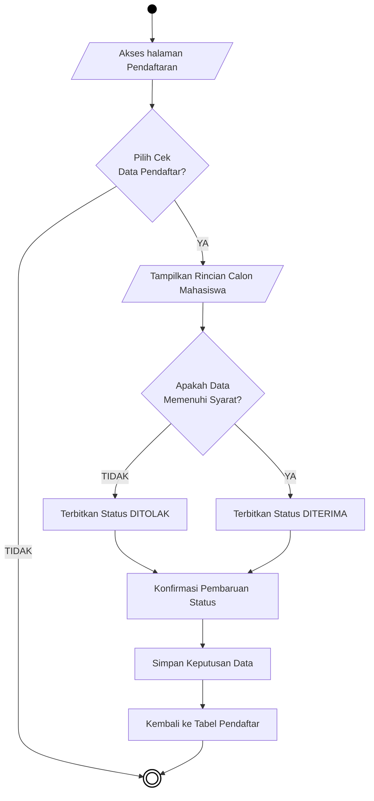
```mermaid
flowchart TD
    Start(( )) --> A[/Akses halaman Pendaftaran/]
    
    A --> B{Pilih Cek\nData Pendaftar?}
    B -- TIDAK --> End((( )))
    
    B -- YA --> C[/Tampilkan Rincian Calon Mahasiswa/]
    C --> D{Apakah Data\nMemenuhi Syarat?}
    
    D -- TIDAK --> E[Terbitkan Status DITOLAK]
    E --> G
    
    D -- YA --> F[Terbitkan Status DITERIMA]
    F --> G
    
    G[Konfirmasi Pembaruan Status] --> H[Simpan Keputusan Data]
    H --> I[Kembali ke Tabel Pendaftar]
    I --> End
    
    style Start fill:#000,stroke:#000,color:#000
    style End fill:#fff,stroke:#000,stroke-width:2px
```
***Gambar 4.20** Activity Diagram Verifikasi Pendaftaran*

**Penjelasan:**
Admin membuka halaman dan memeriksa rincian data setiap pendaftar. Berdasarkan kelengkapan berkas, admin menetapkan status **DITERIMA** atau **DITOLAK**. Keputusan tersebut dikonfirmasi dan disimpan ke database, lalu halaman kembali ke daftar antrean pendaftar.

---

### 4.2.21 Activity Diagram Pengaturan Sistem (Setelan)

```mermaid
flowchart TD
    Start(( )) --> A[/Akses halaman Pengaturan Sistem/]
    
    A --> B{Aksi: Ubah\nNama/Logo?}
    B -- TIDAK --> End((( )))
    
    B -- YA --> C[/Tampilkan form Pengaturan Utama/]
    C --> D[/Ketik Nama Situs, Kontak, Logo/]
    D --> E[/Klik Submit/]
    
    E --> F{Gambar Logo\nValid?}
    F -- TIDAK --> G[/Tampilkan Kesalahan Logo/]
    G --> C
    
    F -- YA --> H[Simpan Pengaturan & Ganti Logo]
    H --> I[Sistem Memuat Ulang Pengaturan]
    I --> End
    
    style Start fill:#000,stroke:#000,color:#000
    style End fill:#fff,stroke:#000,stroke-width:2px
```
***Gambar 4.21** Activity Diagram Pengaturan Sistem (Setelan)*

**Penjelasan:**
Admin mengubah informasi situs (Nama, Kontak) atau mengunggah Logo baru. Sistem memvalidasi format file logo. Jika tidak valid, muncul error. Jika valid, logo baru disimpan ke server (menggantikan yang lama) dan pengaturan diperbarui di database, kemudian sistem memuat ulang konfigurasi.
