# BAB IV — PERANCANGAN SISTEM: 4.1 Activity Diagram (Administrator)

## 4.1.1 Pengertian *Activity Diagram* 
*Activity Diagram* (Diagram Aktivitas) digunakan untuk menggambarkan urutan aktivitas proses pada suatu sistem. Pada dokumen ini, seluruh diagram difokuskan secara eksklusif pada **Pengelolaan Konten (sisi Administrator)**. Diagram ini menggunakan model aliran konvensional demi kemudahan pembacaan. Komponen lingkaran penuh berwarna solid menunjukkan *Start Node* (titik awal kegiatan), sedangkan lingkaran dengan garis ganda menunjukkan *End Node* (titik akhir kegiatan).

---

## 4.2 Alur Aktivitas Administrator

### 4.2.1 Activity Diagram Login Administrator

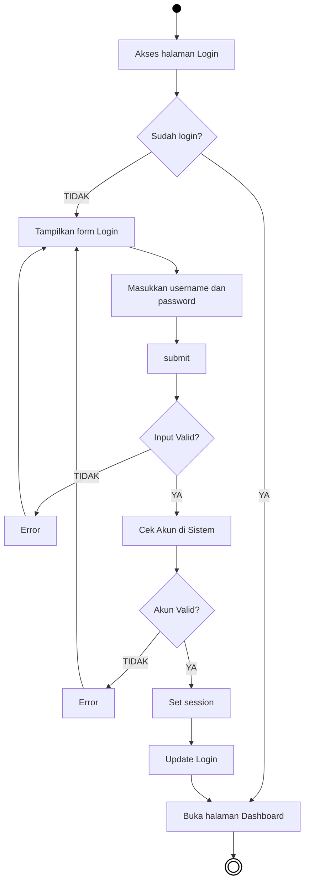
***Gambar 4.1** Activity Diagram Login Administrator*

**Penjelasan:**  
Diagram ini menjelaskan alur sistem saat administrator melakukan proses masuk (*login*) agar dapat mengelola web. Pertama, saat pengguna masuk ke halaman *login*, sistem akan memeriksa apakah perangkat mereka masih menyimpan sesi aktif. Jika iya, pengguna tak perlu login dan langsung dialihkan menuju halaman *dashboard*. Namun jika sesi belum terbuka, pengguna harus berhadapan dengan formulir akun. Sesudah administrator mengisi teks *username* berserta *password* dan menekan tombol *submit*, validasi program berjalan. Jika ada ruang form yang melompong, pesan peringatan akan mencuat. Apabila divalidasi tidak kosong, kombinasi pengguna pun dicocokkan di dalam sistem utama (*database*). Di mana saat data bersikap sah bersesuaian, interaksi direkam lalu otorisasinya ditetapkan demi memberikan ruang bagi penggunanya masuk mengakses manajemen pusat sistemnya (*dashboard*).

---

### 4.2.2 Activity Diagram Menu Kelola Visi dan Misi

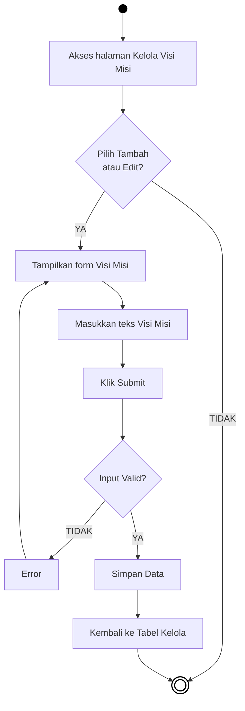
***Gambar 4.2** Activity Diagram Menu Kelola Visi Misi*

**Penjelasan:**  
Siklus kegiatan administrasi sistem pada pandangan pertama dapat diamati dari pengelolaan tabel informasi dasar yakni Visi Misi. Usai administrator mengakses tabel di halaman, ia mendapat rute ke pengubahan jika menekan opsi *Tambah* atau *Edit*. Interaksi ini memampangkan kotak perihal untuk ditaruh ketikan wacananya. Selepas penekan tombol operasional (*Submit*) dieksekusi, pemeriksaan ketelitian mencegah kejadian kotak form yang sekadar diisi kosong. Form kosong membawakan rute alur mundur yang memamerkan rintangan wujud pesan keluhan program (*Error*). Bilamana tulisan masukan bernilai patut dan dinilai aman kelengkapannya, pemrosesan akan memposisikan dan melabuhkan wacana baru mendarat di kerangka basis data demi kelak memperlihatkan profil gubahannya secara cepat sewaktu layar dialihkan.

---

### 4.2.3 Activity Diagram Menu Pengelolaan Struktur Organisasi

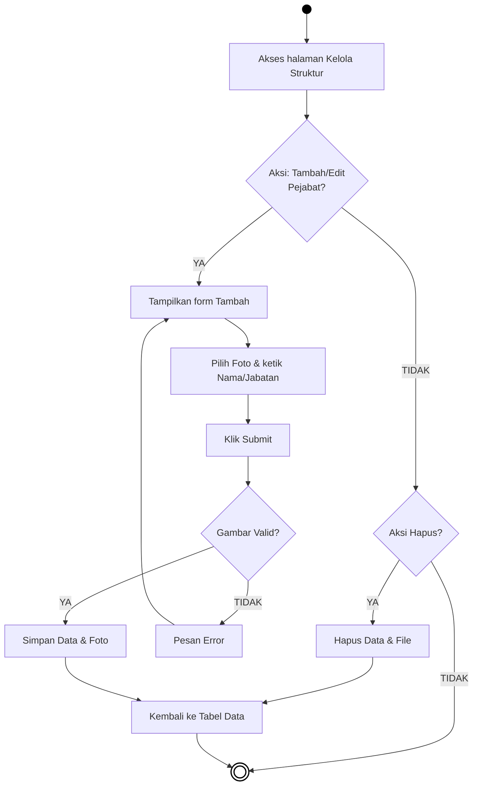
***Gambar 4.3** Activity Diagram Menu Kelola Struktur Organisasi*

**Penjelasan:**  
Penambahan deretan profil Pemangku Organisasi tidak leluasa membiarkan pendaftaran nama teks, haruslah dibarengi unggahan media visual sosok potretnya. Begitu aksi form menyala, kelengkapannya mesti direstui melalui tombol pengajuan (*Submit*). Hal yang diandalkan dari pemeriksaan tahapan kali ini condong tertitik berat pada kewajaran bentuk format gambarnya, sekiranya dokumen disetorkan ternyata berlawanan format (bukan berjenis berkas profil potret awam .JPG/.PNG). Atas kekeliruan parameternya, transaksi ini terhadang memicu instruksi peringatan eror. Di kondisi lainnya saat semua diisi komplit beserta lampiran medianya pas, pengunggahan dilakukan terpadu mentransfer fotonya ke penyimpan *server* sekalian mendelegasikannya serangkaian dengan catatannya melintasi sistem. Sementara aksi sekunder seputar pemusnahan salah satu laporan pejabat, alur ini memuat pencopotan terintegrasi data tulis pada *database* sekaligus membuang fotonya sama rata.

---

### 4.2.4 Activity Diagram Menu Pengelolaan Fakta Fakultas

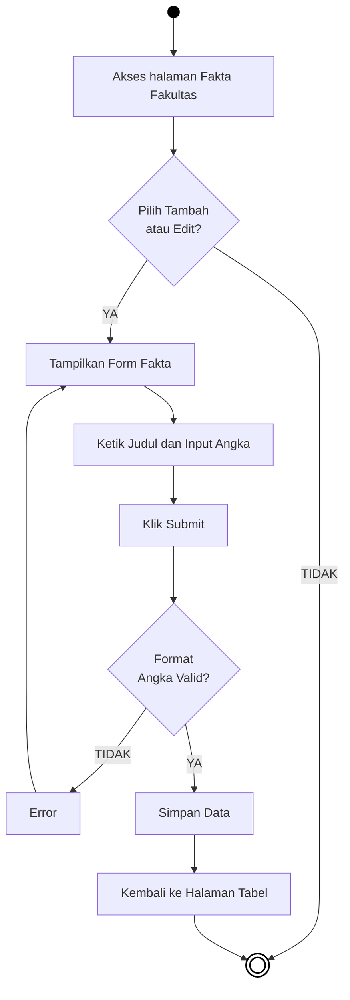
***Gambar 4.4** Activity Diagram Menu Kelola Fakta Fakultas*

**Penjelasan:**  
Administrasi pengisian papan kuantitas hitung mahasiswa maupun kepegawaian dilaksanakan mengikuti kelola Fakta Fakultas. Di saat administrator memasuki area form entri parameter angkanya lalu menekan tombol kirim, kelengkapan inputannya senantiasa difilter mencegah campur tangan abjad/teks di dalam kolom bilangannya. Parameter numerik menuntut pengisian hitungan wajar agar saat eksekusinya berjalan sistem mampu mencerna angka ke memori tanpa *error*. Melanggar standar validasi tersebut akan mencegat kemajuan transaksi lalu mengembalikan pandangan ke form utama dengan isyarat pesan kegagalan, namun ketersediaan form wajar yang berisikan bilangan murni pasti lolos menembus *database* dan segera merefleksikan jumlah terbarunya.

---

### 4.2.5 Activity Diagram Menu Pengelolaan Tentang Fakultas

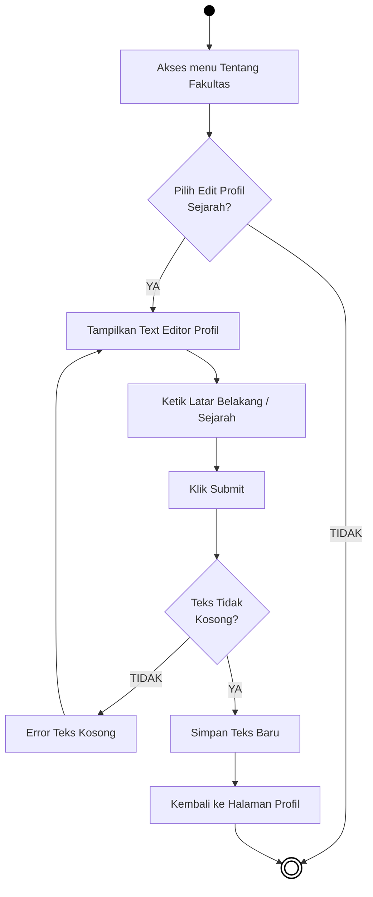
***Gambar 4.5** Activity Diagram Menu Kelola Tentang Fakultas*

**Penjelasan:**  
Prosedur kelola catatan Latar Belakang (Tentang Fakultas) ini dipahami layaknya modul kepenulisan artikel utuh, yang mendayagunakan antarmuka pengetikan lapang (*Text Editor*). Di mana kelar mengetikan cerita sejarah kampus, operasional transmisi (*submit*) difungsikan mengarah ke peladen yang memberlakukan proteksi tulisan tak kasat rumpang. Umpamanya form narasi dikirim dalam kondisi bersih tanpa teks sama sekali, aplikasi serta-merta menjatuhkan penggunanya pada pesan hambatan operasional kosong ketikan. Sebalik rute amannya, keberhasilan wacana bakal dituangkan merombak letak tabel catatannya lalu mengalihkan layar kembali ke visual profil semulanya untuk dipinjau ulang.

---

### 4.2.6 Activity Diagram Menu Kelola Slider Beranda

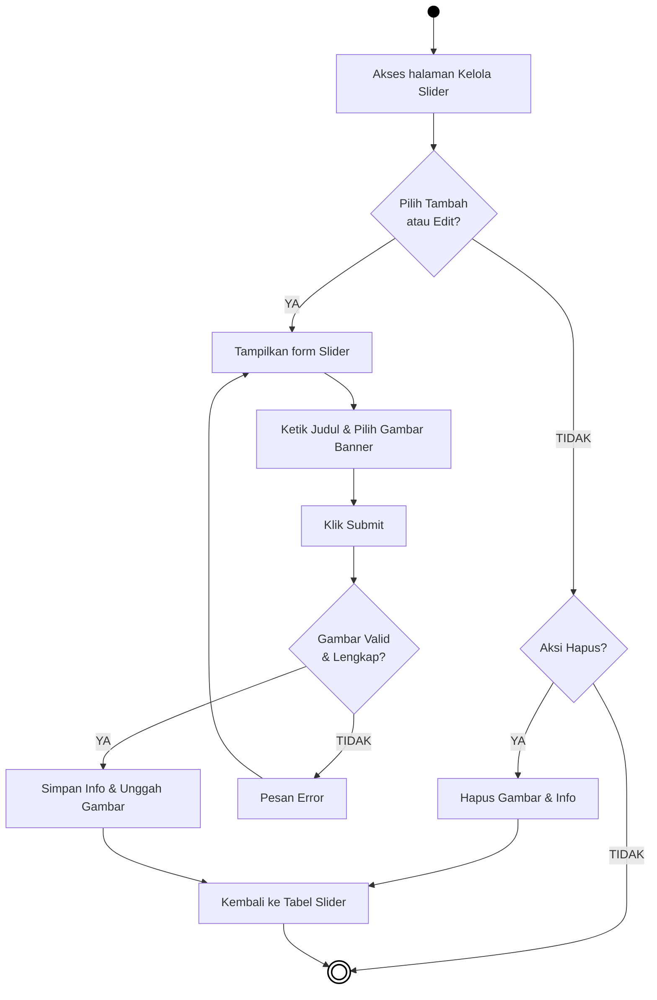
***Gambar 4.6** Activity Diagram Menu Kelola Slider*

**Penjelasan:**  
Modul *Slider* digunakan untuk mengatur *banner* atau *carousel* gambar yang menempati posisi teratas pada halaman publik beranda utama Fakultas. Ketika administrator memilih untuk melakukan aksi penambahan, ia akan menjumpai format isian untuk mengunggah gambar promosi (*banner*) yang menarik beserta serangkaian label judulnya. Verifikasi terhadap masukan ini memiliki peran ganda: menilai perihal tak luputnya tulisan selagi tetap mengawal kepastian identitas jenis gambar (*upload validation*). Berkas ilustrasi selain ekstensi standar akan dirintangi, mewujudkan larangan operasi simpan yang diinfokan dalam kemasan pemberitahuan *error*. Apabila *banner* foto tersebut resmi dikonfirmasi lulus ketentuan, materi disiarkan mendarat aman di peladen dan tabel referensi berkoheren untuk menampilkannya di laman *frontend* nantinya. Hal serupa juga berlaku sewaktu gambar lama hendak dihapus tuntas dari sistem.

---

### 4.2.7 Activity Diagram Menu Kelola Berita & Artikel

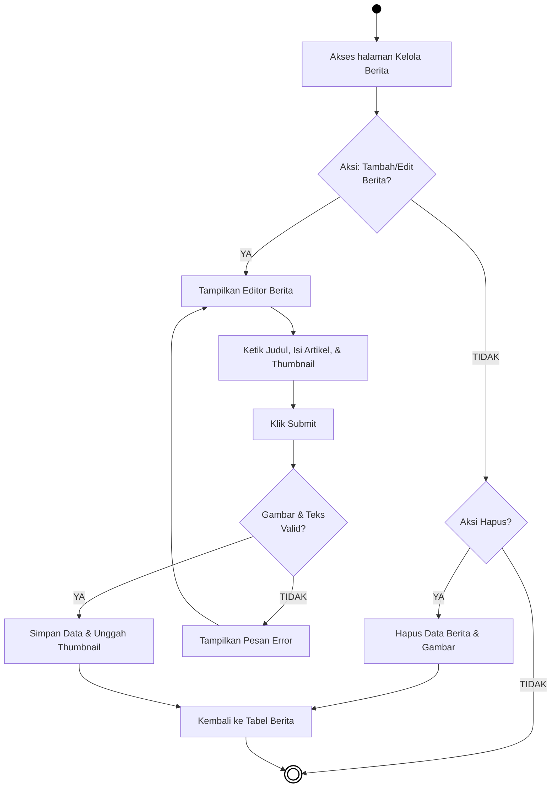
***Gambar 4.7** Activity Diagram Menu Kelola Berita*

**Penjelasan:**  
Halaman ini menampung manajemen publikasi artikel portal berita harian fakultas. Kegiatan administrasi di modul ini membutuhkan konsentrasi besar meliputi pembubuhan tajuk artikel, pelampiran gambar *thumbnail*, serta penulisan rincian laporan (melalui perkakas *Rich Text Editor*). Setelah administrator mengirim dokumen ini (*submit*), validasi sistem menelisik kesiapan materi gambar media *thumbnail* juga keseluruhan panjang teks artikelnya. Andaikata parameter dikesampingkan (seperti artikel kosong panjang atau jenis gambar ditolak), sistem menyanggah aktivitas simpan menaikkan keterangan *Error*. Di jalur validitas sukses, program mengangkat wujud *thumbnail* ini merebahkan diri pada lokasi penyimpan server, berdampingan menyuntik tatanan baris teks artikel tersebut menetap rapi di tabel basis datanya.

---

### 4.2.8 Activity Diagram Menu Kelola Dosen

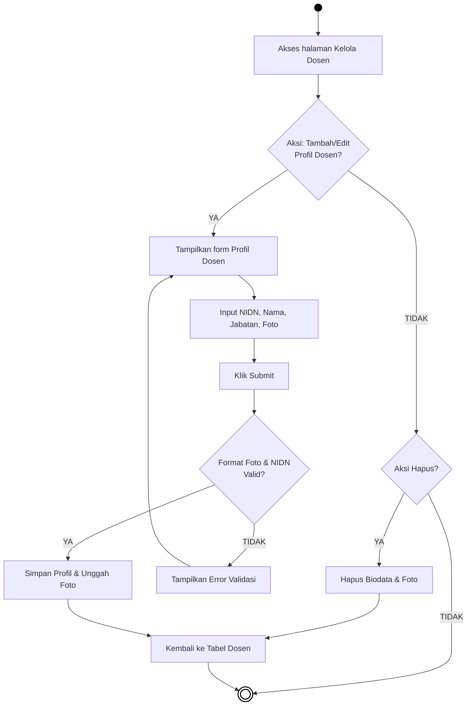
***Gambar 4.8** Activity Diagram Menu Kelola Dosen*

**Penjelasan:**  
Menu Dosen menangani kerangka pencatatan portofolio para tenaga pelatih dan dosen pengampu akademik. Aktivitas pengelolaan mewajibkan komponen unik pendaftaran semacam penulisan Nomor Induk Dosen (NIDN) sampai kepada penempatan figur gambaran potret dosen tersebut. Penekanan fungsi pemeriksaan di tahapan konfirmasi peluncuran meliput akurasi pengunggahan *file* foto sekaligus memastikan nomor seri input identitasnya. Segala ketidaksesuaian prosedur kelola entri profil tersebut akan dijegal perampungannya menampilkan kendala *Error* agar memanggil atensi penyunting ulangnya. Jika berkedudukan normal tanpa anomali, pasfoto tertransfer matang bersemayam dalam ranah *server*, dan deskripsi sisa pelengkapnya dipadukan mendaftarkan entri di simpanan profil tenaga pengajar untuk dapat disoroti para mahasiswa dari beranda depan situs.

---

### 4.2.9 Activity Diagram Menu Kelola Ruangan Kelas

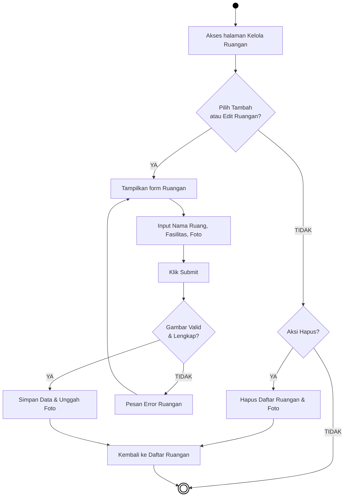
***Gambar 4.9** Activity Diagram Menu Kelola Ruangan Kelas*

**Penjelasan:**  
Pengurusan prasarana kampus dibagikan porsinya ke ruang Kelola Ruangan, area kelola fasilitas kelas harian. Urutan tindakan pada bagan meruntut perihal administrator menciptakan daftar katalog ruang kelas baru berserta memuat kelengkapan potret denah fisiknya. Mekanisme keamanan operasional beraksi menyortir kewajaran berkas potret fasilitas sewaktu administrasi menempatkan perizinan simpan datanya (*submit*). Kendala pemilahan file asing otomatis mencabut jalannya skenario penyimpanan sejalan menyiagakan keterangan *Error*. Tatkala format masukan diresmikan tervalidasi layak operasional, salinan citra ruang diamankan ke lokasi cadangan seraya mengkaitkannya berkolerasi sepadan dengan nama ruangannya di relasi parameter pangkalan data, bersambung pergeseran menyodorkan ringkasan tabel ruangan asali.

---

### 4.2.10 Activity Diagram Menu Kelola Laboratorium

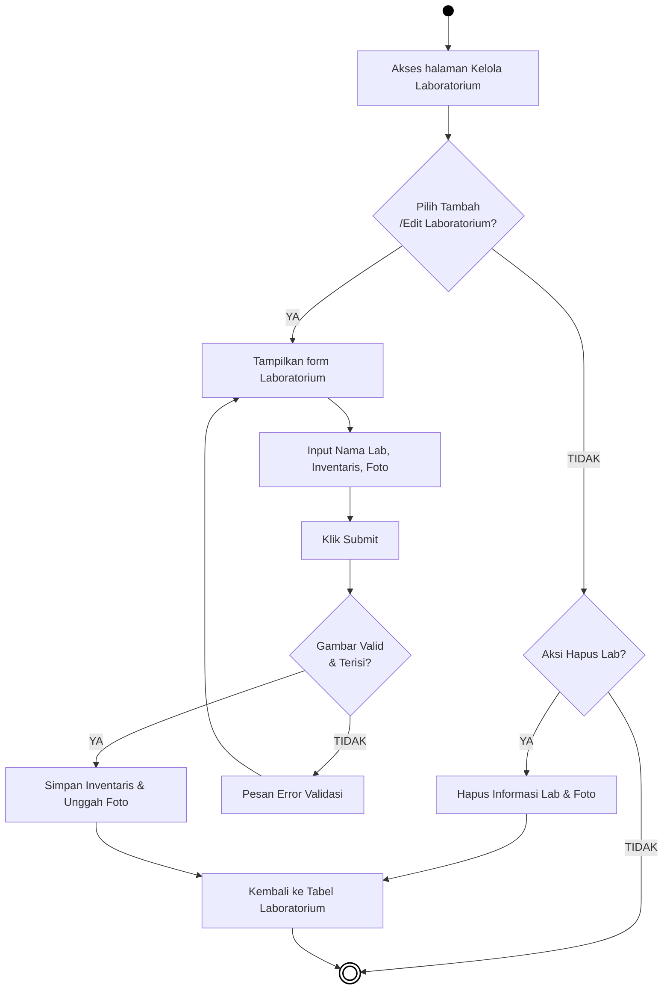
***Gambar 4.10** Activity Diagram Menu Kelola Laboratorium*

**Penjelasan:**  
Ruang laboratorium memegang hierarki penempatan setaraf menu ruangan umum yang mengikutsertakan manajemen perlengkapan (*inventaris*) inventaris penelitian praktiknya. Kegiatan pencatatan fasilitas ini menuntun administrator menggubah narasi deskriptif fasilitas alat praktek bersama perwakilan foto interiornya. Interaksi form terkonfirmasi mengemban pemeriksaan kesesuaian potret foto yang dipersangkakan melampaui aturan kompresi, bila itu terwujud larangan berbalut panel peringatan *Error* beraksi menyelamatkan ekosistem penampungannya dengan menahan *editing*. Namun jika kondisi gambar bersesuaian dengan deskriptif fasilitasnya, potret lab di*upload* sempurna menempatkan letaknya selaras bersama keterangan penunjangnya dalam daftar *database* sistem. Kelancaran aktivitas merelokasi kembali layar fungsional administrator mengarahkan pemunculan penampang tabel Laboratorium dengan kelengkapan data hasil olah teranyarnya.

---

### 4.2.11 Activity Diagram Menu Kelola Kalender Akademik

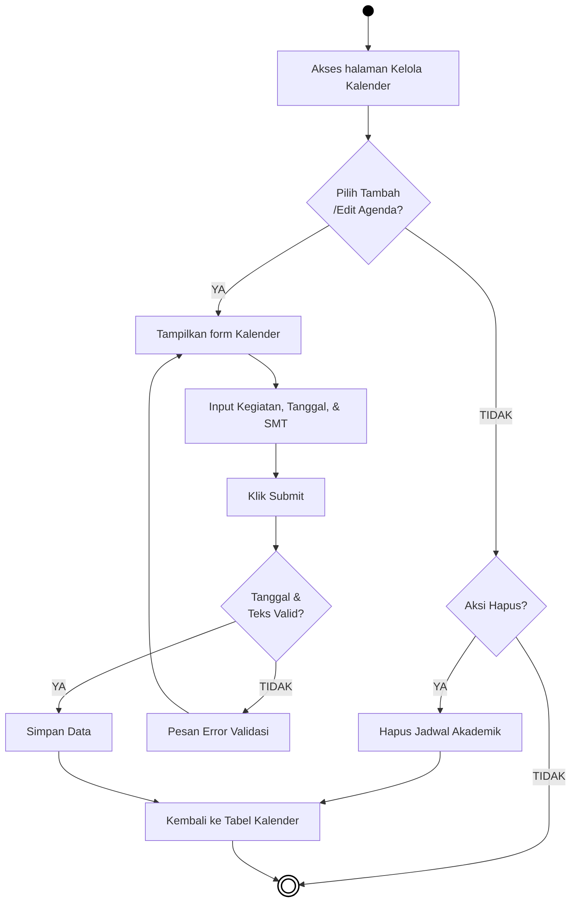
***Gambar 4.11** Activity Diagram Menu Kelola Kalender Akademik*

**Penjelasan:**  
Pengelolaan parameter jadwal akademik dirancang untuk disesuaikan secara rutin oleh administrator pengelola. Tatkala administrator memutuskan menambahkan butir agenda terbaru, antarmuka layar mengarahkan ke formulir pencatatan tanggal beserta rincian nama acara. Kewajiban saat eksekusi form disimpan adalah memvalidasi kelogisan parameter input format tanggal dan teks agar berpadanan dengan syarat kalender. Ketidakcocokan format berimbas melontarkan layar *error* pencegahan, yang mendesak pengguna menelaah isiannya lagi. Andaikata seluruh kolom masukan sahih memenuhi syarat, kalender pendataan tercatat di sistem tatanan memori untuk bisa dibaca masyarakat umum dan disusul kepulangan antarmuka ke halaman daftar agendanya.

---

### 4.2.12 Activity Diagram Menu Kelola Kurikulum

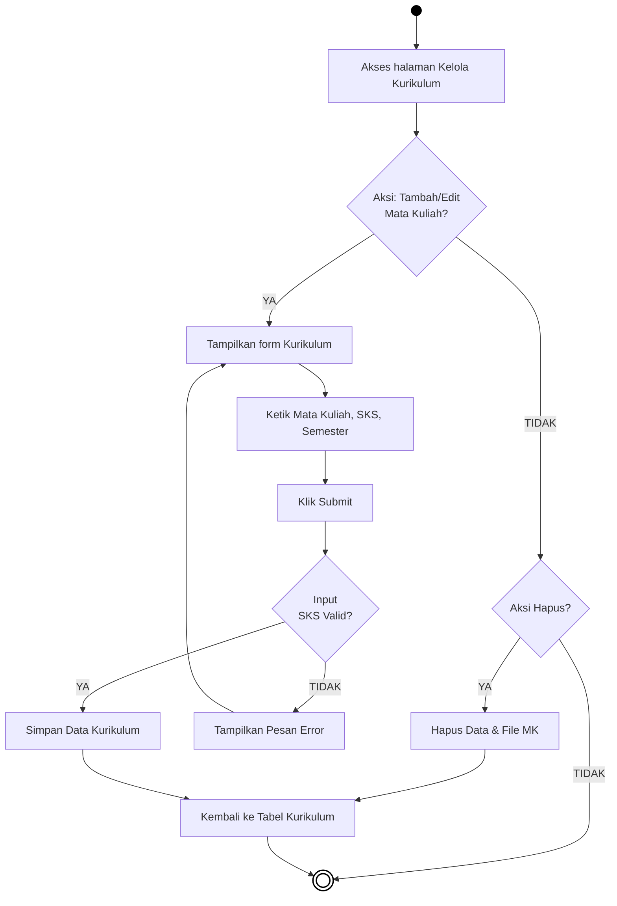
***Gambar 4.12** Activity Diagram Menu Kelola Kurikulum*

**Penjelasan:**  
Tahap manajemen dokumen kurikulum akademik diampu sepenuhnya dalam rute administrator ini. Dari form interaksi yang disodorkan seusai pemilihan menu, penyusunan matakuliah berserta beban bobot SKS-nya mesti ditugaskan tanpa luput terisi. Mengantisipasi anomali *input* berupa pengetikan di luar angka pada kolom jumlah SKS, arsitektur validasi sigap menilai dan memeriksa parameter (*Decision Node: Input SKS Valid?*). Manakala keteledoran memasukkan input karakter bukan angka terjadi, maka pergeseran data direm untuk memberitahukan perbaikan kepada penggunanya (*Error*). Kelancaran konfirmasi dan evaluasi inputan yang sepenuhnya akurat mendorong berjalannya penanaman lajur rekaman data ke basis sistem secara permanen.

---

### 4.2.13 Activity Diagram Menu Kelola Kerjasama

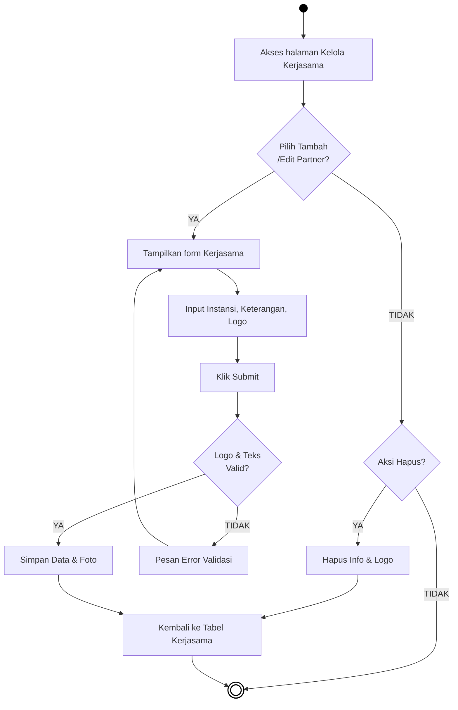
***Gambar 4.13** Activity Diagram Menu Kelola Kerjasama*

**Penjelasan:**  
Pengelolaan informasi identitas kemitraan kerja (*Partnership*) direkam dengan memasukkan bukti visual logo instansi terpadu. Serupa dengan operasi gambar pendahulu, pembaharuan entri memerlukan pelampiran ekstensi visual ke kotak *form*. Pelaksanaan *submit* segera menghantarkan dokumen media ke pemeriksaan ekstensi foto legal (.JPG/.PNG). Pelanggaran di tahapan *upload* logo itu secara otomatis memberhentikan eksekusi peremajaan *database* selagi menahan pengguna di tempat asalnya berhias teks teguran keliru ekstensi media (*Error*). Pada kondisi form media diterima wajar, operasi selanjutnya menjamin kelancaran unggahan foto instansi partner ke simpanan peladennya sekalian mengukir informasi kerja samanya di laci pencatatan basis data, dituntaskan kepulangan ke menu awal kelolanya.

---

### 4.2.14 Activity Diagram Menu Kelola Pengabdian

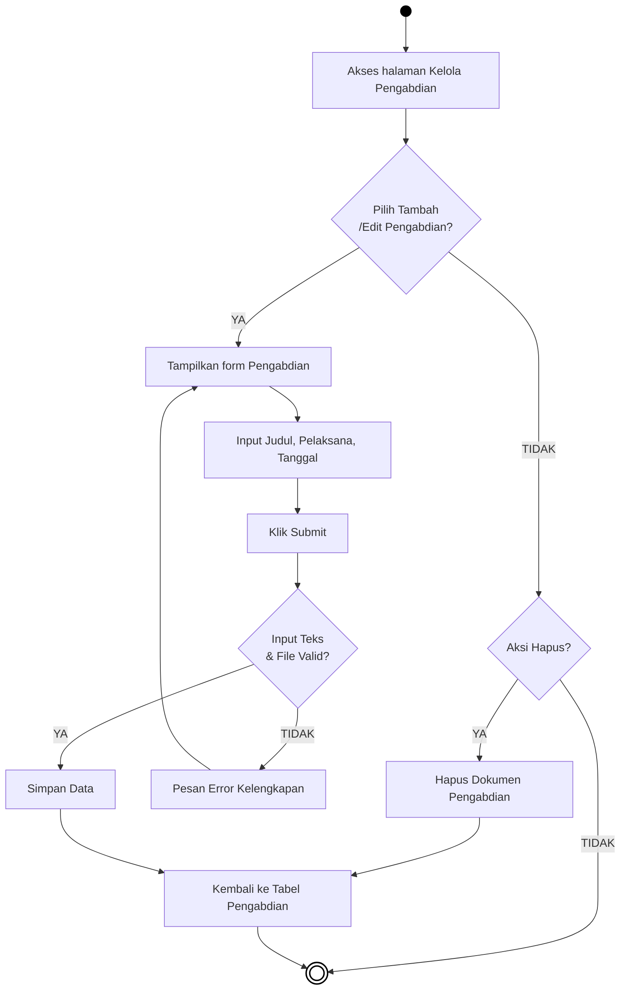
***Gambar 4.14** Activity Diagram Menu Kelola Pengabdian*

**Penjelasan:**  
Aktivitas pencatatan daftar rekam jejak Pengabdian Masyarakat oleh civitas akademika dikelola menurut runtunan diagram ke-14 ini. Modul mendayagunakan administrator mencatatkan rincian entri baru semisal keterangan judul penugasan abdi masyarakat juga tanggal pengayaannya. Mekanisme fungsional menjaga kekompakan kelengkapan teks ini agar rincian nama pelaksananya tak terkecualikan untuk dibiarkan rumpang kosong. Mengalihkan proses pendaftaran manakala menjumpai kealpaan pengisian *form*, modul menyanggah transaksi di tahap *Error*. Bila data perihal pengabdiannya sungguh absah dikerjakan, jejak kegiatannya diarsip rapi ke dalam tabel direktori data demi menghibur profil sivitas akademika sembari menyelesaikan siklus ini melalui halaman *redirect* beranda utamanya.

---

### 4.2.15 Activity Diagram Menu Kelola Penelitian

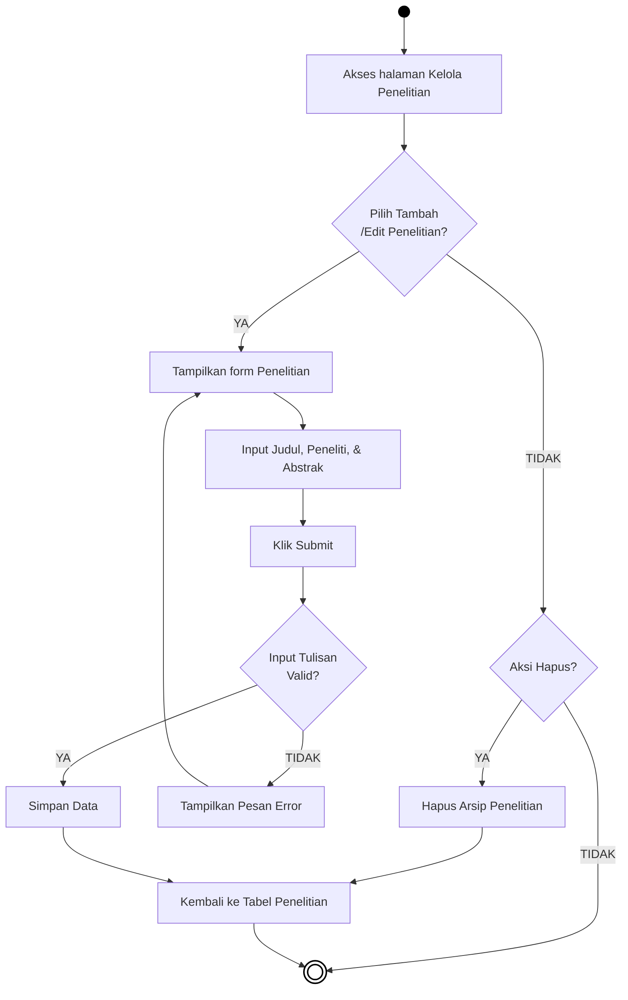
***Gambar 4.15** Activity Diagram Menu Kelola Penelitian*

**Penjelasan:**  
Kegiatan pembaharuan jurnal keilmuan dan kajian reset direkam di instrumen pengolahan Penelitian ini. Sesaat *form* antarmukanya beroperasi, administrator difasilitasi rincian parameter bagi masukan deskripsi hasil risetnya secara teliti (Judul Jurnal, Abstrak). Evaluasi yang dibebankan terhadap transaksi pengirimannya melingkupi pendeteksian apakah form berwacana teks panjang tersebut sungguh murni tak kehilangan perannya dari kekosongan masukan. Bilamana penceritaannya dirasakan kurang bobot minimalnya atau justru tertinggal blanko bersih nilainya, arsitektur otomatis membantah perintah pelaporan selagi mewujudkan pemunculan wujud kendala (*Error*). Menanggapi terlewatinya pengujian standar ini akibat sempurnanya wacana risetnya, aktivitas lantas tertutup memberkati perpindahan data penelitian ini menjealajah barisan *Database* peladennya yang mengabari rute penyelesaiannya di relokasi muatan antarmuka tabelnya.
