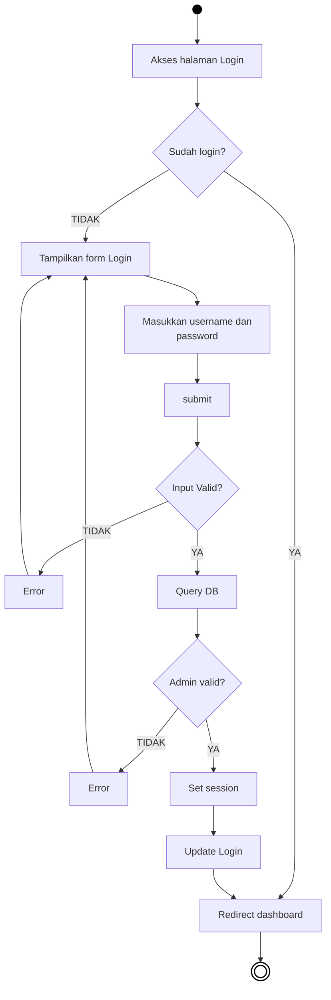
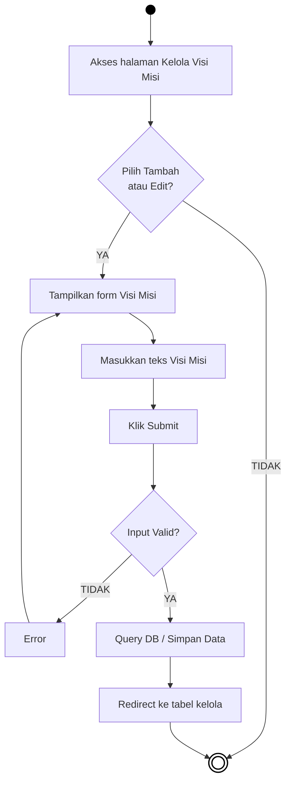
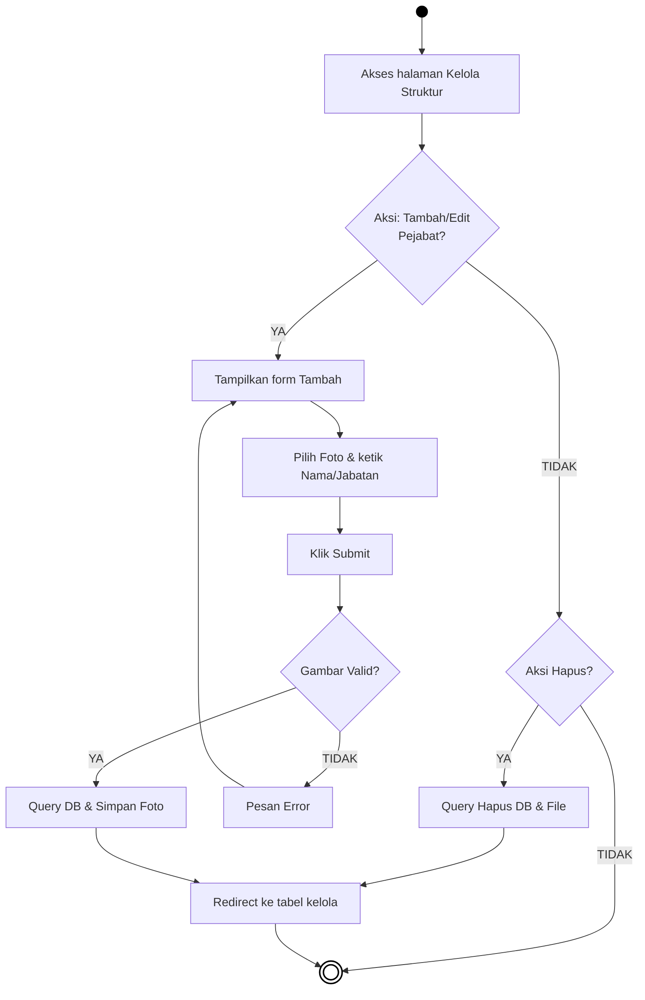
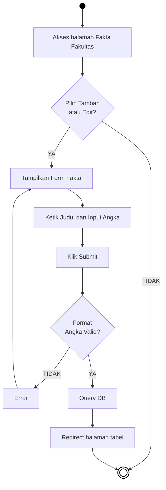
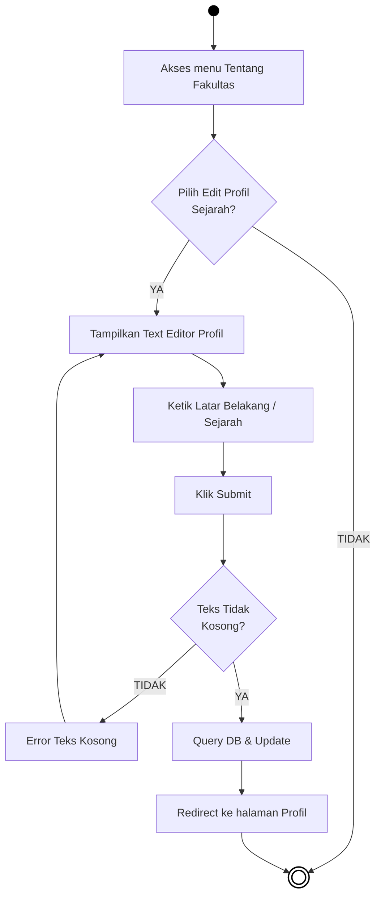

# BAB IV — PERANCANGAN SISTEM: 4.1 Activity Diagram (Administrator)

## 4.1.1 Pengertian *Activity Diagram* 
*Activity Diagram* (Diagram Aktivitas) digunakan untuk menggambarkan alur aktivitas suatu proses pada sistem. Pada dokumen ini, diagram difokuskan pada pengelolaan konten yang dilakukan melalui antarmuka pihak **Administrator**, di mana bahasanya telah disederhanakan agar mudah dipahami alurnya. Komponen bulat penuh menunjukkan titik awal (mulai), dan komponen bulat bergaris ganda menunjukkan titik akhir (selesai).

---

## 4.2 Alur Aktivitas Administrator

### 4.2.1 Activity Diagram Login Admin

***Gambar 4.1** Activity Diagram Login Administrator*

**Penjelasan:**  
Alur ini mengilustrasikan proses otentikasi admin. Ketika admin masuk ke halaman login, sistem terlebih dahulu memeriksa apakah admin tersebut sudah dalam status *login* sebelumnya. Jika sudah, maka ia langsung dialihkan ke *dashboard*. Bila belum, ia akan melihat *form login*. Setelah mengisikan kata sandi dan menekan tombol *submit*, sistem mengevaluasi kekosongan/validitas masukan, kemudian mencocokkannya ke *database*. Jika kredensial terbukti valid, sistem akan mengatur (*set*) memori *session* untuk pengguna tersebut lalu mengarahkannya ke dalam *dashboard*.

---

### 4.2.2 Activity Diagram Menu Visi dan Misi

***Gambar 4.2** Activity Diagram Menu Kelola Visi Misi*

**Penjelasan:**  
Setelah admin tiba di *dashboard*, ia dapat membuka halaman Kelola Visi Misi. Dari sana, admin memilih untuk menambah rekaman baru atau mengubah isi yang lama (edit). Sesudah pengisian formulir teks Visi Misi beres dan *submit* ditekankan, sistem secara cepat menyeleksi kebenaran format (*Input Valid*). Apabila lolos kriteria aman, sistem akan menyimpan riwayat teks tersebut ke *database* dan segera menyegarkan tabel Visi Misi kembali.

---

### 4.2.3 Activity Diagram Menu Struktur Organisasi

***Gambar 4.3** Activity Diagram Menu Kelola Struktur Organisasi*

**Penjelasan:**  
Halaman struktur organisasi membutuhkan *file* fisik tambahan yaitu unggahan *Foto Pejabat*. Karena itu, diagram ini meperjelas bahwa sesaat setelah *submit* ditekankan, fokus sistem adalah mengeksekusi validasi gambar (*apakah itu benar berformat JPG/PNG?*). Bila sesuai, gambar foto tersebut langsung diunggah (*upload*) ke kandar penyimpan arsip seraya memperbarui letaknya secara bersamaan pada *database*. Alur ini juga menampilkan jalur kilat ke kiri bagi admin yang hanya ingin menghapus satu profil pimpinan dari sistem.

---

### 4.2.4 Activity Diagram Menu Fakta Fakultas

***Gambar 4.4** Activity Diagram Menu Kelola Fakta Fakultas*

**Penjelasan:**  
Pada halaman fakta (statistik capaian angka kampus), *field* pengisian dititikberatkan pada numerik/teks. Sistem akan bereaksi memblokir input jika di dalam isian angka ditaruh huruf, sehingga menelurkan reaksi penolakan kembali (*Error*). Andaikata form tersebut wajar dan diisi dengan benar, eksekusi berjalan tanpa halangan dengan mengubah wujud angka secara dinamis ke pada *database*.

---

### 4.2.5 Activity Diagram Menu Tentang Fakultas

***Gambar 4.5** Activity Diagram Menu Kelola Tentang Fakultas*

**Penjelasan:**  
Profil sejarah (*Tentang Fakultas*) lazimnya diakomodasi melalui modul *Text Editor* karena teksnya yang panjang dan terformat tebal/miring. Setelah admin merasa sudah cukup mengutarakan sejarah, tombol simpan ditekan. Apresiasi validasi dari program semata-mata memeriksa *apakah bidang isian luput dari keterisian kosong?* Jika tidak kosong (yaitu, memiliki konten memadai), maka jejak sejarah direkam menuju *database* dan segera diekspos sebagai laporan mutakhir web kampus.
