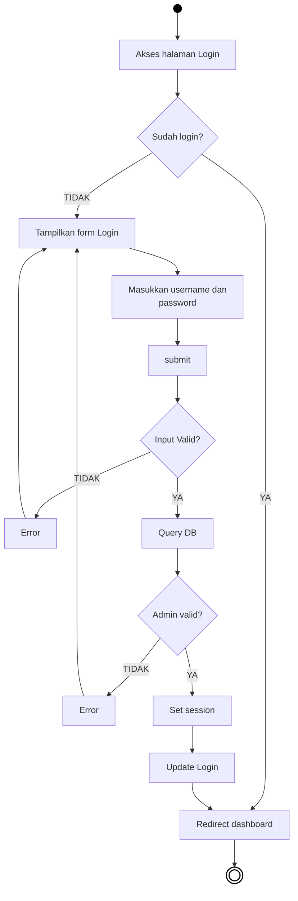
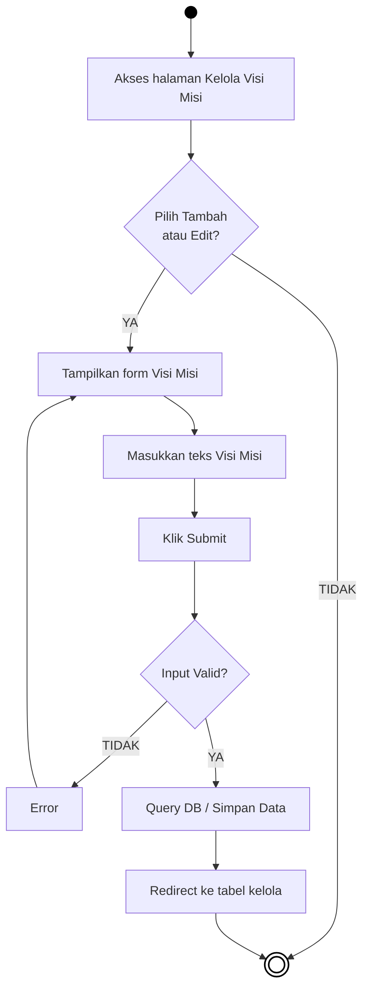
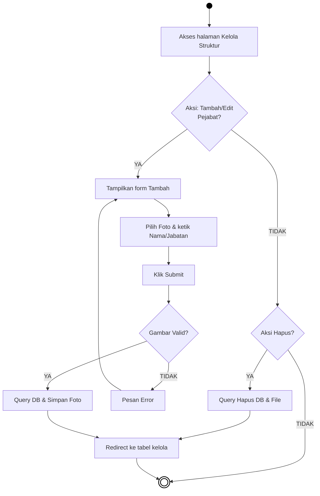
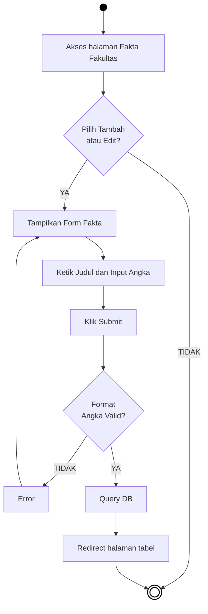
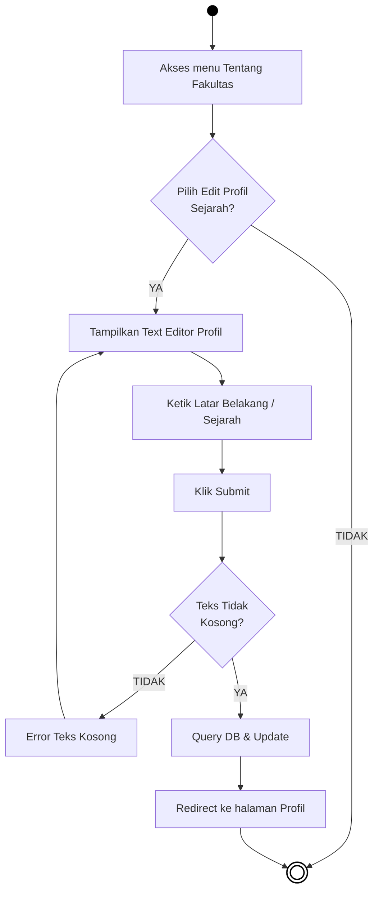

# BAB IV — PERANCANGAN SISTEM: 4.1 Activity Diagram (Administrator)

## 4.1.1 Pengertian *Activity Diagram* 
*Activity Diagram* (Diagram Aktivitas) digunakan untuk menggambarkan urutan aktivitas proses pada suatu sistem. Pada dokumen ini, diagram difokuskan pada pengelolaan konten dan antarmuka yang dikendalikan secara eksklusif oleh pihak **Administrator**. Diagram ini menggunakan model aliran konvensional demi kemudahan pembacaan. Komponen lingkaran penuh berwarna solid menunjukkan *Start Node* (titik awal), sedangkan lingkaran dengan border ganda menunjukkan *End Node* (titik akhir kegiatan).

---

## 4.2 Alur Aktivitas Administrator

### 4.2.1 Activity Diagram Login Administrator

***Gambar 4.1** Activity Diagram Login Administrator*

**Penjelasan:**  
Diagram ini menjelaskan alur sistem saat administrator melakukan proses autentikasi atau *login* agar bisa mengelola web. Pertama kali, saat pengguna masuk ke halaman *login*, sistem akan memeriksa apakah mereka masih memiliki sesi akses masuk yang belum kedaluwarsa. Jika ya, pengguna langsung dialihkan secara kilat bergeser menuju *dashboard* tanpa perlu mengetik ulang kredensialnya. Namun jika sesi di peramban belum terbuka, maka sistem akan menampilkan formulir pengisian akun. Administrator diperintahkan mengetik teks *username* dan *password* lalu menekan tombol *submit*. Sistem bertugas memvalidasi isian tersebut; bila masukan kosong, muncul pesan penolakan dan form dimunculkan lagi. Apabila isi formulir berhasil masuk, lalu dicocokkan dengan sandi dan tabel administrator di ranah *Database* dan hasilnya sesuai (*valid*), sistem seketika melepaskan izin berupa entitas rekaman *session*. Di fase ini proses mencakup penyelesaian kelangsungan jejak log, selanjutnya peramban menerobos akses administrasi menuju *dashboard* beranda perwakilan menu manajemen seutuhnya.

---

### 4.2.2 Activity Diagram Menu Kelola Visi dan Misi

***Gambar 4.2** Activity Diagram Menu Kelola Visi Misi*

**Penjelasan:**  
Siklus kegiatan administrasi pada halaman pengaturan Visi dan Misi dijabarkan di diagram di atas. Administrator bermula mengakses halaman kelola tersebut pada wilayah antarmuka kerjanya, dengan penawaran menyusun kembali tulisan dengan mengklik opsi *Tambah/Edit*. Bila *form* dibiarkan kosong sewaktu proses penyajian lalu Administrator bersikeras menekan perintah pemrosesan *submit*, lapisan perlindungan kelayakan isian akan menjengkelkan tangkapan kegagalan (*Input Valid: TIDAK*). Menindaklanjuti ketidakakuratan rincian input, layar segera menangguhkan operasional lalu menimpali keluhan gangguan peringatan agar pengguna menyunting kembali tulisan kosong itu hingga melengkapi validasi dasar. Bilamana teks perumusan wacana telah rapi, sempurna isiannya dan divalidasi ketiadaan galat oleh sistem tersebut, data terdorong membarui tabel terkait dari sistem pangkalan database-nya. Aktivitas administrator beralih dinonaktifkan kala layarnya dipandu bergerak meninggalkan kotak *form* lalu diredirect mengutamakan *interface* layar daftar profil Visi Misi semula.

---

### 4.2.3 Activity Diagram Menu Pengelolaan Struktur Organisasi

***Gambar 4.3** Activity Diagram Menu Kelola Struktur Organisasi*

**Penjelasan:**  
Struktur Organisasi membutuhkan integrasi lebih lanjut tidak cukup mendasari pengetikan melainkan pelampiran ekstensi pengunggahan objek dokumentasi media (Foto Struktural Pejabat). Merujuk langkah siklus prosedur pembaharuan data pimpinan (*Tambah/Edit Pejabat*), kegiatan mutlak memberatkan persyaratan *Upload* dokumen visual per orangnya. Selesai memencet persetujuan operasi simpan rekaman form (*submit*), parameter pendeteksian rincian sistem (*Decision node: Gambar Valid?*) memberlakukan cek ganda kualifikasi dimensi ukuran maupun kepatuhan akhiran berkas medianya (.JPG/.PNG). Jikalau kriteria dokumen dirusakkan kesesuaian ekstensinya maupun cacat bentuk pengunggahannya, eksekusi pembaruan serta-merta dicabut sebelum penanaman di memori dan memberitahukan perihal notifikasi koreksinya kepada administrator pendata tersebut (*Error*). Secara beruntun jika keseluruhan data parameter dan gambarnya disahkan berhasil berkorespondensi baik, dokumen foto dikoleksi pada memori file peladen bersamaan mensinkronkan rujukan nilainya bersama teks catatan Pejabat memutar langsung masuk dan bergelimpangan di sel-sel relasional tatanan tabel memori basis datanya. Seberkas kegiatan ini memudar dan diputus pada instruksi pamungkas (*redirect*).

---

### 4.2.4 Activity Diagram Menu Pengelolaan Fakta Fakultas

***Gambar 4.4** Activity Diagram Menu Kelola Fakta Fakultas*

**Penjelasan:**  
Kegiatan merekap info faktual capaian kampus diletakkan pada rincian operasional Kelola Fakta Fakultas. Layar pengelolaan *form* pembaharuan parameter nominal mengharuskankan ketelitian nilai hitungan matematis absolut berwujud angka bilangan utuh. Selepas pengetikan *input* deskripsi kolom naratif dan hitungan rekor selesai diterjemahkan lewat tindakan instruksi penyampaian akhir (*submit*), fungsionalitas memusatkan kendalinya mendeteksi validitas tipe input parameter numerik tersebut. Bila ada entri yang secara tidak sengaja terganggu kombinasi huruf/simbol spesifik sehingga menciderai konversi bilangan aslinya, sistem menginisiasi rintangan (*barrier*) kegagalan format dan membiarkan layar form masih menyuarakan seruan koreksi perbaikan (*Error*). Andaikata seluruh konversi data pengetikan lolos dan sah memenuhi standar tipe angkanya, data termodifikasi otomatis mengaktifkan parameter peletakan (*Query* Eksekusi) guna mengkristalkan wujud angka capaian baru menembus database sembari menampakkan fungsionalitas penyegaran ulang susunan rekaman antarmukanya.

---

### 4.2.5 Activity Diagram Menu Pengelolaan Tentang Fakultas

***Gambar 4.5** Activity Diagram Menu Kelola Tentang Fakultas*

**Penjelasan:**  
Pemenuhan dokumentasi artikel kepenulisan wacana panjang menyerap fitur utama perangkat pembentuk naskah di kelola komponen antarmuka admin (*Text Editor*) seperti halnya narasi profil *Tentang Fakultas*. Prosedur awal diajukan merambah *form* tersebut seraya menumpuk paragraf deskriptif latar jejak institusinya. Batasan eksekusi penyimpan sistem mendudukkan posisi kehati-hatian evaluasi sistem akan luputnya eksistensi karakter data yang mengakibatkan laporan form hampa tak bertulang (*Decision node: Teks Tidak Kosong?*). Jika komponen wacana gagal memenuhi ketetapan jumlah keterisian parameter mutlak ini (kondisi form murni polos dilempar/bersih tanpa ketikan) maka penempatan peringatan tanggapan keengganan pencatatan bakal mengentikan aliran transaksi administrasi di depan mata. Sedemikian sehingga begitu tervalidasi tulisan terangkum wajar disajikan tanpa melangggar kaidah pengecekan kosong formulir, operasional membebaskan transaksi pemutakhiran jejak catatannya dan sukses dirangkum menyimpannya bersama tumpukan database mengonfirmasi keberhasilan melalui sirkulasi *redirect*.
