# BAB II — DIAGRAM URUTAN

Bagian ini mendeskripsikan secara teknis dan formal urutan pengiriman pesan antar-objek atau pilar arsitektur sistem. Interaksi diuraikan menggunakan pendekatan kerangka kerja Arsitektur Lapis Tiga (Frontend, Sistem Pengendali Pusat, Database) dengan narasi deskriptif berbentuk paragraf baku.

## 2.1 Lingkungan Pengunjung
Bagian ini memvisualisasikan interaksi yang terjadi saat antarmuka publik atau pengunjung berinteraksi dengan sistem peladen.

### 2.1.1 Sequence Diagram: Halaman Utama
Secara garis besar, proses interaksi pada Halaman Utama dimulai ketika pengguna mengakses antarmuka penelusuran utama melalui peramban web mereka. Permintaan awal tersebut segera diterima oleh sistem peladen utama yang bertugas sebagai pengendali rute. Sistem ini selanjutnya akan mengarahkan dan memuat modul khusus untuk halaman beranda. Pada tahapan persiapan ini, halaman beranda akan terlebih dahulu memuat seluruh konfigurasi dasar, fungsi pelengkap, serta memulai sesi koneksi yang aman menuju pangkalan data fakultas.

Setelah simpul koneksi pangkalan data tersambung, sistem akan melanjutkan instruksi dengan melakukan serangkaian operasi pengambilan data secara komprehensif. Operasi penarikan ini mencakup pengambilan 6 (enam) rilis berita paling baru, pencatatan statistik dan fakta kampus, pemanggilan daftar media gambar untuk panel tata letak sorotan yang sedang berstatus aktif, hingga pencarian rincian singkatan profil fakultas dan rekaman entitas mitra kerja sama. Seluruh data mentah yang sukses diperingkas oleh *Pangkalan Data* ini selanjutnya diracik untuk melengkapi komponen visual kerangka struktural web. Sistem akan mendirikan batas atas antarmuka serta merangkai balok-balok informasi utama ke dalam *grid*, sebelum akhirnya menyudahi rangkuman halaman tersebut dengan pemuatan seksi penutup dan berkas interaktif JavaScript yang relevan. Pada ujung jalurnya, sistem melepas kompilasi struktur final dalam bentuk halaman web siap saji penuh yang kemudian dibentangkan dengan tuntas pada layar pengguna.

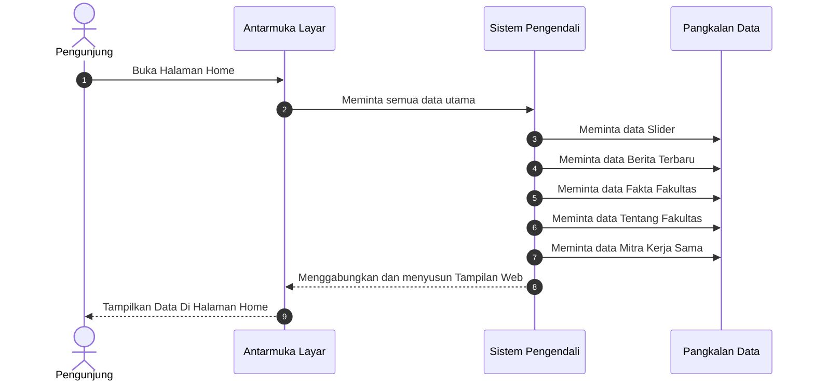

---

### 2.1.2 Sequence Diagram: Halaman Data Civitas Akademika
Alur komunikasi pada diagram sekuensial ini bermula tatkala pengguna mengeklik menu atau langsung mengarahkan tautan tautan alamat untuk mengakses halaman Data Civitas Akademika. Panggilan antarmuka tersebut ditangkap terlebih dahulu oleh tulang punggung aplikasi, yang berperan meretas rute agar sistem dapat memanggil skrip fungsional yang berkaitan dengan halaman data. Setelah skrip diinisiasi, sebuah sesi negosiasi kepada lapis *Pangkalan Data* (pangkalan penyimpanan data) pun disiapkan supaya situs web dapat bertukar informasi dengan aman.

Melalui saluran penghubung basis data inilah, halaman Data Civitas secara aktif menghantarkan sekumpulan perintah pencarian data untuk membentangkan profil para tenaga pengajar (dosen) berserta staf kependidikan yang terekam pada tabel sistem. Data rincian yang antara lain memuat potret jabatan dan latar belakang akademik tersebut lantas direkam sejenak di sisi *server*. Tak lama setelahnya, kerangka visual atas navigasi halaman diproses. Sistem merakit profil tiap-tiap entitas sivitas ini dalam tata letak yang berkesinambungan layaknya sebuah presentasi balok matriks statis, menyelaraskannya dengan blok ujung, hingga terbentuk sebuah keluaran tanggapan perwajahan tampilan web yang dikirim dan dicetak ke peramban pengguna.

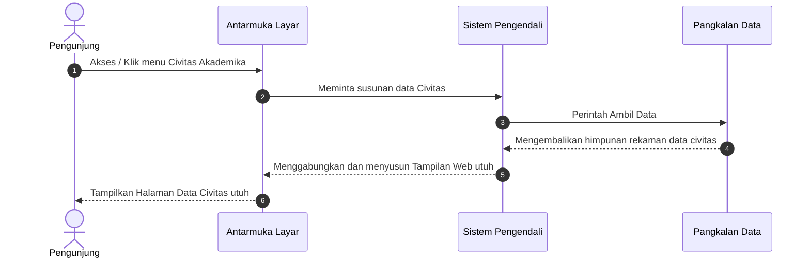

---

### 2.1.3 Sequence Diagram: Halaman Struktur Organisasi
Rangkaian interaksi skema Struktur Organisasi bermula di titik ketika pengguna mencetuskan kunjungan sistemnya melalui perpindahan navigasi menuju halaman struktur. Layaknya sistem manajemen rute satu pintu, pengelola `pengendali arah utama situs` senantiasa mencatat dan mengolah permintaan ini supaya dapat menyerahkan wewenang kontrol pemrosesan kepada unit berkas yang secara dedikatif dirancang untuk membacakan struktur organisasi fakultas. Sejak unit ini menerima beban kerja, konfigurasi *framework* dan modul ikatan basis data pangkalan penyimpanan data pun seketika dibangun guna merembuk kesepakatan penarikan informasi antara *server* dan *Pangkalan Data*.

Dengan meluncurkan baris perintah penarikan data, sistem lantas membongkar koleksi tabel data untuk mengekstraksi senarai pimpinan pemegang mandat struktural fakultas dan mengambil rincian grafis terkait urutan eselon bagan hierarki tersebut. Bersamaan dengan pangkalan data yang menggulirkan balikan nilai data, sistem membagi kerangka *tampilan muka pengguna* dengan menganyam batas navigasi pucuk situs, mengisi badan kerangka tampilan situs dengan hasil pementasan daftar bagan pemimpin, serta melampirkan modul pengaya yang ada pada lantai kaki elemen. Lewat penggabungan tripartit inilah, sebuah arsitektur dokumen penyajian web terwujud paripurna lalu dipersembahkan ke arah layar peramban audiens.

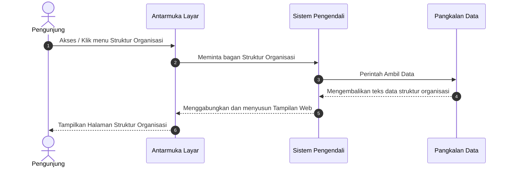

---

### 2.1.4 Sequence Diagram: Halaman Tentang Fakultas
Pemanggilan atas profil naratif "Tentang Fakultas" digerakkan oleh aksi navigasi pengunjung yang bertamu ke halaman profil fakultas. Alur ini otomatis merangsang rekam permintaan akses dari layar pengguna, yang dengan sigap dipaparkan dan diambil alih posisinya oleh inti situs selaku pintu pengatur presisi rute. Berkas inti menangguhkan tugas tersebut kepada skrip unit penampil Tentang Fakultas, di mana tahapan berikutnya sangat esensial: memicu pemanggilan basis data menuju titik akses repositori pangkalan data terpusat (pangkalan penyimpanan data).

Sejenak sesudah sambungan *Pangkalan Data* terbentuk mumpuni, sistem mengajukan perintah untuk mengambil daftar rekam jejak histori fakultas, ikhtisar gambaran umum, dan atribut profil esensial lainnya. Luaran teks dari basis data yang sarat memori sejarah itu pun diteruskan lurus ke *sistem pusat peladen* peladen. Sementara data disinggahkan, kerangka tatanan kepala bernavigasi situs beserta segenap berkas tata letak dikail, dirakit dengan memeluk pementasan rincian dokumen susunan situs, sebelum disempurnakan lagi dengan bingkai jejak bawah. Sebagai tahap penyegelan fungsional, kumpulan balok-balok susunan komponen layar diumpankan satu arah menjadi bingkisan respons visual yang utuh di sisi antarmuka sang pengunjung.

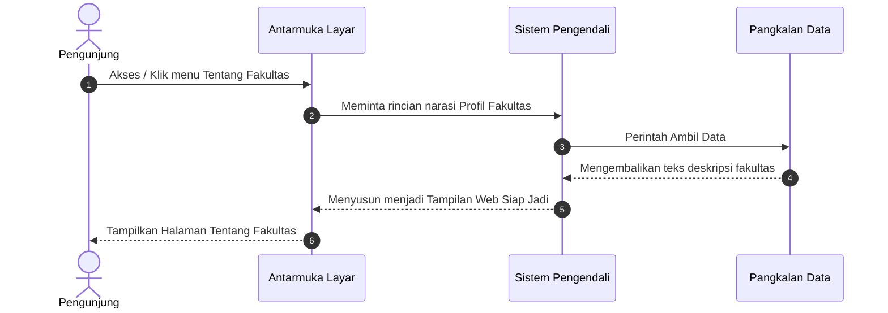

---

### 2.1.5 Sequence Diagram: Halaman Visi dan Misi
Alur pergerakan pada tayangan halaman Visi dan Misi mencerminkan sinkronisasi yang berkesinambungan seketika audiens melakukan permintaan akses ke dalam sub-tautan tersebut. Langkah komputasi yang pertama langsung terpusat pada file perutean utama aplikasi, di mana sistem tidak sekadar mengatur konfigurasi mutlak *platform* tetapi juga dengan teliti memahami parameter pemuatan spesifik bagi halaman visi misi. Terbekali oleh jembatan inisialisasi koneksi repositori penyimpanan data fakultas, sistem *sistem pusat peladen* lalu mendirikan pilar konektivitas kokoh menuju pangkalan data (pangkalan penyimpanan data) yang berjalan menopang aplikasi.

Tugas perintah pengambilan data kemudian dipercayakan untuk merengkuh elemen teks penjabaran visi dan butir misi fakultas paling termutakhir yang bersembunyi dalam tabel basis data. Pangkalan data selanjutnya mendelegasikan balik substansi nilai itu guna ditempatkan teratur ke bilik pementasan antarmuka. Dengan sinkronisasi tata letak yang bersandar pada bingkai hiasan *header* serta batasan informasi kaki, skrip-skrip inti tersebut secara tuntas menyempurnakan wujud balasan penyajian perwajahan situs murni. Tahap purwarupa respons tersebut perlahan disuguhkan dan dirilis ke hadapan peramban, meyakinkan bahwa audiens memandang rincian Visi dan Misi secara harmonis.

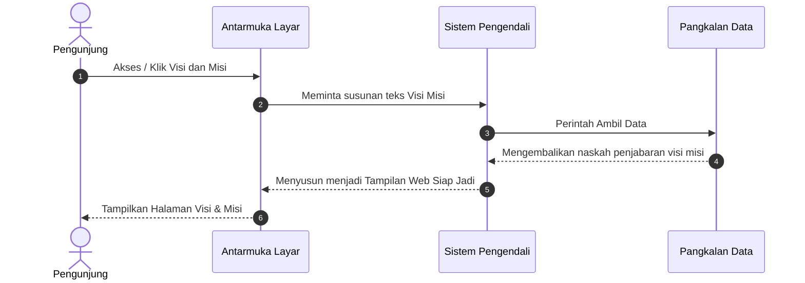

---

### 2.1.6 Sequence Diagram: Halaman Profil Dosen
Dokumen ini mendeskripsikan runtutan logis tatkala seorang pengunjung menatap deretan profil pakar pendidik pada laman Profil Dosen. Bermula dari klik navigasi pengguna menuju halaman koleksi pengajar, sistem Antarmuka Layar lantas menyuarakan permohonan pengambilan data riwayat dosen ke arah Sistem Pengendali Pusat. Sistem Pengendali Pusat dengan sigap mencarikan padanan spesifik pada pangkalan tabel guru/dosen di database, lantas mengangkut atribut-atribut pokok layaknya nama penuh, NIDN, jabatan fungsional institusi, sampai bingkisan relasi penyematan pasfoto potret fisik mereka. Sekumpulan perolehan hasil bacaan lurus ini dipersatukan ke dalam bungkus tayangan tampilan layar yang mempesona lalu disodorkan menghadap peramban, mencetak antaran rapi deretan susun grid profil pengajar yang meredakan pandangan audiensi pengguna.

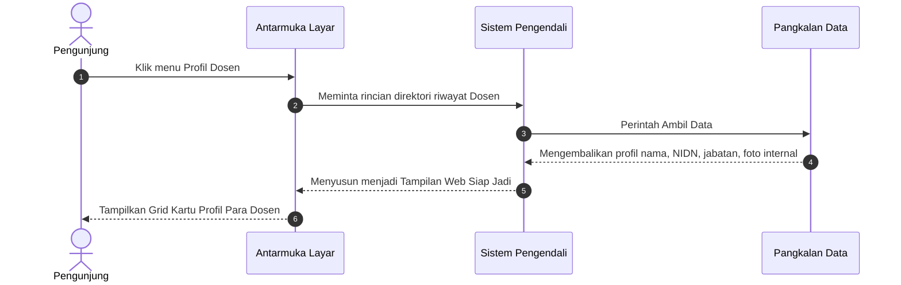

---

### 2.1.7 Sequence Diagram: Halaman Pendaftaran Mahasiswa Baru
Rute dokumentasi ini memvisualisasikan skema tatkala calon sivitas akademika mengoperasikan gerbang Pendaftaran Publik. Alur dipicu ketika pengguna rampung mengetikkan rincian identitasnya dan mengunggah pindaian berkas administratif, lalu memantapkan niatnya menekan tombol "Daftar". Antarmuka Layar akan memaketkan seluruh masukan borang penyerahan data menyeberang menuju Sistem Pengendali Pusat. Filter Sistem Pengendali Pusat mengevaluasi format persyaratan berkas pindaian, dan jika valid, sistem akan menyandarkan bongkahan fail salinan fisik secara aman di brankas server lokal. Baru setelah wujud penyimpanannya sukses, Sistem Pengendali Pusat menancapkan barisan ketikan detail identitas mereka memasuki gerbang penyimpanan tabel Pangkalan Data dengan membubuhkan cap status penantian konfirmasi. Babak akhirnya, paras Antarmuka Layar dimanipulasi beralih corak guna menayangkan rilis kotak notifikasi suka cita pendaftaran tersampaikan mulus ke genggaman.

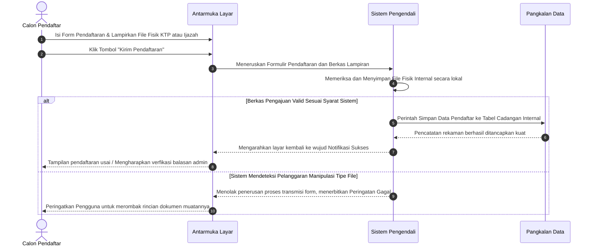

---

### 2.1.8 Sequence Diagram: Halaman Program Studi TI (Teknik Informatika)
Laman navigasi Program Studi TI memiliki penarikan parameter terspesifikasi utuh. Ketika pengunjung menyelami halaman identitas Teknik Informatika, jembatan Antarmuka Layar mendelegasikan perintah pelacakan paket materi ke Sistem Pengendali Pusat. Alih-alih merambani seluruh rekam fakultas, rute penelusuran Sistem Pengendali Pusat dibidik telak melacak ikhtisar terseleksi dari lapisan rekam Database; meringkus serentetan rilis Silabus/Kurikulum spesifik TI, manifestasi Visi-Misi identik kepunyaan TI, beserta senarai nama daftar pelatih ilmu pengetahuan bersangkutan yang menetap eksklusif membela pamor TI itu sendiri. Elemen-elemen terpilah tajam ini selanjutnya dipadu Sistem Pengendali Pusat sedemikian rupa memoles keanggunan presentasi halaman profil prodi TI secara mumpuni lewat tampilan layar peramban.

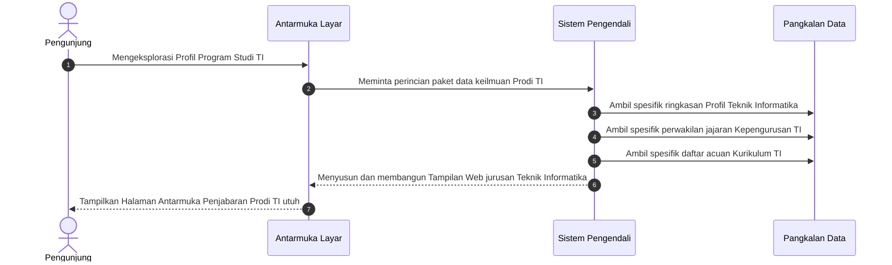

---

### 2.1.9 Sequence Diagram: Halaman Program Studi PTI (Pendidikan Teknologi Informasi)
Sinkron layaknya saudara serumpun, perwujudan laman Program Studi PTI memperlakukan struktur diagramnya secara presisi namun memandu pada sumur relasi berbeda. Peluncuran pandangan pengguna mencentang navigasi opsi PTI membangkitkan permohonan pemuatan rekaman historis dari Antarmuka Layar menuju kemudi Sistem Pengendali Pusat. Mesin komputasi Sistem Pengendali Pusat lantas turun gelanggang mensortir pangkalan data guna menarik wujud Visi-Misi kebangsaan PTI, alokasi tatanan parameter silabus PTI terkini, ditambah serangkaian potret dedikasi kelompok pendidik di naungan PTI. Berbekal saripatinya perasan data esensial spesifik ini, Sistem Pengendali Pusat merilis wujud seutuhnya ke arah Antarmuka Layar demi menyusun tatanan paras elok antarmuka tanpa menyisakan satupun cela kekeliruan tatap profil.

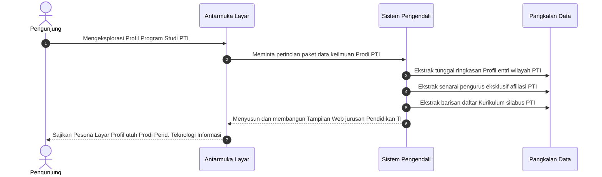

---

### 2.1.10 Sequence Diagram: Halaman Fasilitas Ruangan
Skema pamungkas publik ini menelusuri bagaimana rentetan pajangan infrastruktur lingkungan fisik kampus disuguhkan ke khalayak luas. Pada saat pengguna tiba memandangi penelusuran Fasilitas Ruangan, jala antarmuka Antarmuka Layar menuntut pemasokan profil gedung dari Sistem Pengendali Pusat. Skrip Sistem Pengendali Pusat terjun mengakses letak basis data guna menyesap atribut deskripsi, rincian kapasitas daya tampung, tipe infrastruktur, serta memboyong rujukan fisik potret keindahan bangunan ruangan tersebut. Keseluruhan nilai visual dan deskriptif yang diperoleh kemudian dirangkul ke dalam pelukan kerangka presentasi susunan Antarmuka Layar, mewujudkannya menjadi galeri ruangan kampus menyegarkan yang pantas ditatap penuh takjub secara sempurna.


---

### 2.1.11 Sequence Diagram: Halaman Fasilitas Laboratorium
Diagram ini memetakan alur tatkala khalayak publik berkunjung menengok halaman penawaran Fasilitas Laboratorium. Mulanya, Antarmuka Layar mengajukan permintaan ketersediaan info susunan daftar Lab serta sarananya menuju pangkalan Sistem Pengendali Pusat. Serta merta, Sistem Pengendali Pusat mensurvei ranah gudang data di pangkalan penyimpanan data seraya menyapu tabel profil guna mengail label penamaan spesifik ruang inkubasi lab beserta daftar senarai perkakas dan peralatannya, turut pula diikutsertakan titik foto fisiknya. Saat bahan referensi mentah ini utuh terkoleksi di kantong serapan Sistem Pengendali Pusat, segera saja wujudnya didistribusikan mulus ke batas Antarmuka Layar, di mana Antarmuka Layar menenun lembaran bahan ini menyulma tampilan presentasinya jadi senarai ruang Laboraturium nan apik dan informatif.

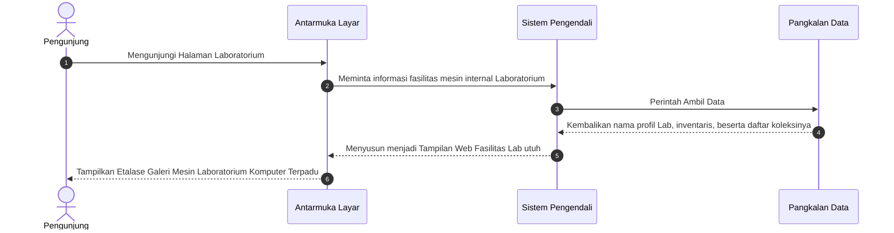

---

### 2.1.12 Sequence Diagram: Halaman Kalender Akademik
Dokumentasi visual di bawah merangkai aktivitas ringkas saat pengguna memohon penayangan rentetan tanggal penting di halaman Kalender Akademik. Sewaktu pengunjung mengeksplorasi modul penanggalan, antarmuka layar (Frontend) memanggil sistem pusat (Backend) guna menyajikan kalender aktivitas belajar-mengajar terkini. Instruksi pencarian disodorkan menerobos ranah pangkalan data pangkalan penyimpanan data sehingga mampu mencuplik sepotong profil penamaan Semester beserta salinan foto penanggalannya. Serasi merespon perolehan hasil sadapan data ini, Sistem Pengendali Pusat merangkul dan meramunya jadi hantaran rapi menuju genggaman tampilan pesona Antarmuka Layar, merekah siap dipandangi sebagai pedoman susunan akademik fakultas.

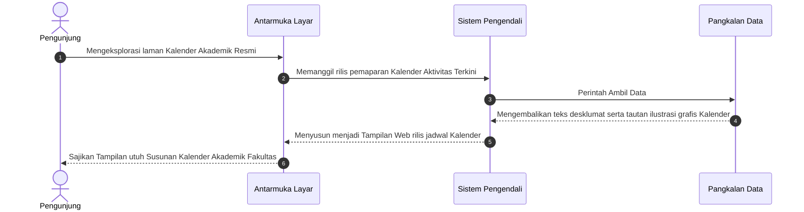

---

### 2.1.13 Sequence Diagram: Halaman Dokumen Kurikulum
Laman Kurikulum berperan menyajikan susunan patokan mata kuliah inti serba universal merangkul rujukan ke semua peramban pembaca maya. Detik berjalannya babak eksploarsi menyeburkan panggilan muat Antarmuka Layar ke lapis operasional Sistem Pengendali Pusat seraya menantikan ketersediaan paket susunan ringkas muatan Kurikulum. Menggeledah pusat indeks, Sistem Pengendali Pusat mendelegasi Pangkalan Data untuk memeriksa keberadaan judul-judul aturan kebijakan matriks kurikulum serta merekam titik unduhan Fail Berformat Portabel Dokumen *(Dokumen Digital Murni)* kurikulum sah berkenaan. Pemborongan daftar ini menyingkirkan komplikasi tatkala Sistem Pengendali Pusat merangkum laporannya melesat mengantarkan formasi data segar mempesona kepada antarmuka (Frontend) untuk kelak ditransformasikan sebagai ruang unduhan Kurikulum berkelas.

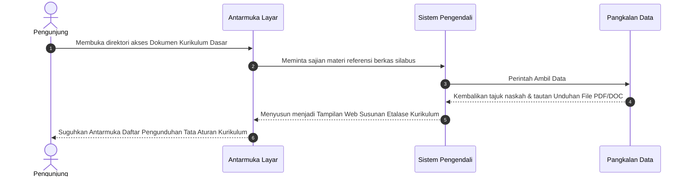

---

### 2.1.14 Sequence Diagram: Halaman Dokumen Fakultas
Jembatan publik ini merekam sinkronisasi pendistribusian file-file arsip publikasi seperti standar panduan operasi pada halaman Dokumen Fakultas. Rutenya diawali manuver pengguna mampir menengok direktori dokumen umum (Frontend), yang serentak menuntut penyegaran antrean daftar arsip. Sistem Pengendali Pusat bergegas melaksanakan sapuan permohonan ke dalam Pangkalan Data pangkalan penyimpanan data demi menarik segenap daftar indeks penamaan dokumen fakultas dan jalur rujukan ke letak fail fisik unduhannya. Berkenaan selesainya sapuan rekaman tersebut, hasil kumpulan data meluncur terkirim utuh ditampung Antarmuka Layar yang kelak menyusun kemasan tabel pengunduhan rapi di hadapan penggunanya.

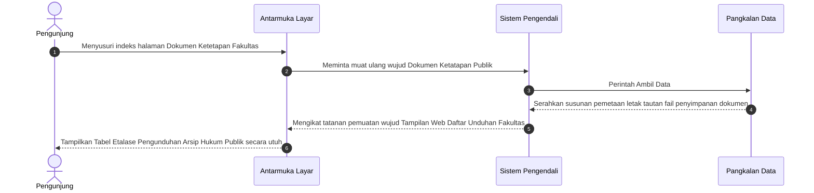

---

### 2.1.15 Sequence Diagram: Halaman Rencana Strategis (Renstra)
Dokumentasi visual ini merunut alur ketika pengunjung ingin membaca target pencapaian jangka panjang fakultas di laman Rencana Strategis (Renstra). Fase dibuka manakala sistem antarmuka (Frontend) mengetuk pintu Sistem Pengendali Pusat usai pengunjung menekan menu Renstra. Sistem Pengendali Pusat segera merespon tuntutan dengan memaparkannya menjadi intruksi penelusuran menuju pangkalan data, mengecap perolehan referensi teks penyusunan strategi jangka waktu utuh sekaligus membopong salinan fisik *path* tautan alamat publikasinya. Seketika kumpulan komponen pelaporan usai dikumpulkan tertib, kerangka presentasi dianyam Sistem Pengendali Pusat menambalnya kuat menghampar cantik di beranda muka layaknya susunan pameran dokumen perancangan masa hadapan.

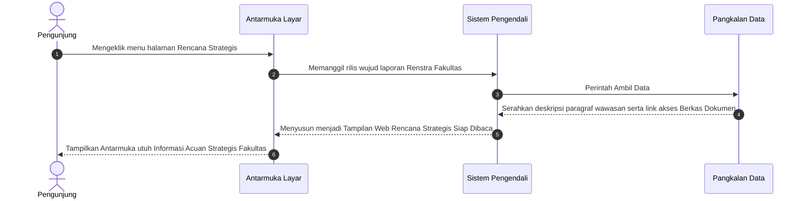

---

### 2.1.16 Sequence Diagram: Halaman Standar Operasional Prosedur (SOP)
Alur Diagram ini mendengarkan instruksi penayangan dokumen SOP publik yang dimohonkan pengunjung di halaman Antarmuka Layar. Skema pergerakan digawangi Sistem Pengendali Pusat yang ditugaskan menjemput senarai baris dokumen prosedur resmi dari ruang Pangkalan Data pangkalan penyimpanan data. Menarik seluk-beluk judul SOP dan titik rujukan keberadaan *file* unduhan aslinya, deret referensi tuntas dijahit Antarmuka Layar dan Sistem Pengendali Pusat bertaut menjelma sebuah hasil presentasi halaman. Hasil pindaian akhir dipersilahkan menempati wujud rapi ruang muka situs murni menyajikan jejeran tabel tautan akses pengunduhan Ketetapan Prosedur.

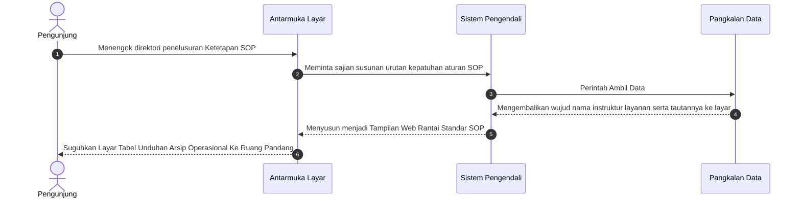

---

### 2.1.17 Sequence Diagram: Halaman Data Penelitian
Penghuni dunia maya yang tiba melacak riset karya civitas pada antarmuka halaman Data Penelitian disambut oleh skema operasional penyedotan isi kepustakaan ringkas. Antarmuka Layar mengibarkan pemanggilan barisan daftar pemublikasian ilmu murni ini. Sistem Pengendali Pusat menanggapinya menyortir gundukan kumpulan sejarah riset terekam yang dipendam pangkalan Pangkalan Data. Ia menebas seleksi riwayat merampas profil titel proyek kajian, kompilasi rentetan frasa abstrak, beserta menunjang pemanggilan kaitan tautan alamat tuju simpanan naskah aslinya. Sesudah serbaneka pustakanya tertangkap tertib ke pangkalan serap Sistem Pengendali Pusat, perwujudannya langsung dibasuh ulang ditransformasikan kemasan desain indahnya mencetak daftar pameran artikel keilmiahan.

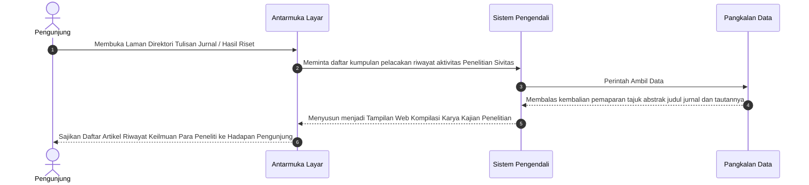

---

### 2.1.18 Sequence Diagram: Halaman Data Pengabdian Masyarakat
Halaman Pengabdian Masyarakat menelusuri penayangan karya implementasi pengajar di lingkungan awam secara sistematis rapi di hadapan publik lewat sorotan Antarmuka Layar. Mulanya letupan awal timbul tatkala instruksi klik peramban berkumandang mencapai stasiun Sistem Pengendali Pusat. Di pos pemrosesan ini, perintah penyortiran melancarkan akses menembus tumpukan Pangkalan Data menarik tuntas rangkaian aktivitas dokumenter laporan bersangkutan seperti dekskripsi rilis berita sosial, lokasi pelopor abdi nusa, plus mengikat jejak file portofolio laporannya sendiri. Perolehan wawasan pangkalan yang solid lantas direstorasi Antarmuka Layar meluruskan bingkai pembentukannya supaya mekar menyala mewakili daftar pesona rekam bakti bagi civitas kampus ke peramban.

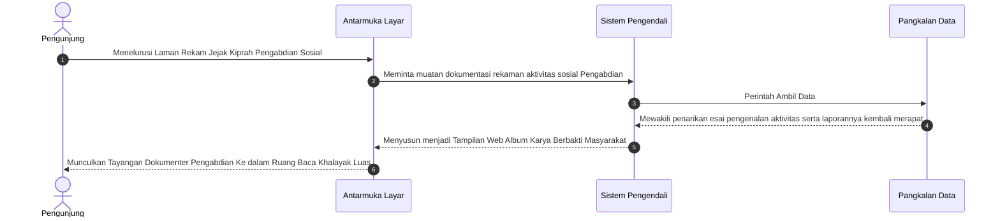

---

### 2.1.19 Sequence Diagram: Halaman Profil Organisasi (BEM)
Sirkuit diagram pamungkas ini menyelusup mengikuti jejak rute pertunjukan direktori kepengurusan mahasiswa dalam profil Organisasi BEM (Badan Eksekutif Mahasiswa). Pelintas navigasi layar menyulut ketukan eksplorasi identitas Badan Mahasiswa murni (Frontend) demi disaksikan kalayak luas. Sistem Pengendali Pusat merangkul sinyal pelaporan lalu bersiaga mentranslasikan pelacakan ketersediaan Pangkalan Data spesifik; mengumpulkan atribut Visi pergerakan BEM, kumpulan rekam program kerjanya, profil pemegang tampuk kuasa tertinggi departemen, tidak luput sisipan emblem Logo lambang eksistensinya. Seketika jajaran serpihan rekaman ini dipersatukan tuntas ke bilik pemrosesan, Sistem Pengendali Pusat melontarkannya menembus antarmuka dan dirangkai solid mencetak arsitektural bagan tata organisasi pengurus yang mentereng memegang marwah wibawanya.

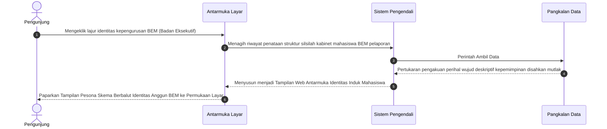

---

### 2.1.20 Sequence Diagram: Halaman Unit Kegiatan Mahasiswa (UKM)
Skema penelusuran publik ini mencatat interaksi tatkala pengguna ingin meninjau ekstrakurikuler kampus di halaman Unit Kegiatan Mahasiswa (UKM). Proses bermula saat permohonan antarmuka (Frontend) dikirimkan lurus menuju sistem kontrol (Backend) mendambakan paparan informasi. Sistem Pengendali Pusat sigap menyelami pangkalan pangkalan penyimpanan data untuk menarik senarai kemunculan profil kelompok himpunan minat bakat, sejarah pengasuhnya, plus referensi lokasi logo lencananya. Bersama ragawi identitas komplit tersebut terengkuh kuat, Antarmuka Layar dipercayakan mengambil alih fungsi memahat tata rupanya membentangkan wujud daftar baris tampilan peredaran potret profil kemahasiswaan sarat warna memikat indera audiens.

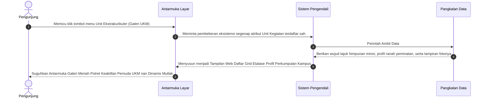

---

### 2.1.21 Sequence Diagram: Halaman Himpunan Mahasiswa
Profil sentral himpunan program studi diwadahi dan dituangkan melalui alur eksekusi narasi persaudaraan struktural. Kala relasi ketukan merapal klik rujukan himpunan per jurusan di peramban, Antarmuka Layar segera merangkak lapor menuju kemudi pemrosesan penarik data di belakang layar (Backend). Lekat sedetik menyisir lumbung pustaka abadi pangkalan Pangkalan Data, Sistem Pengendali Pusat memilahkan tumpukan koleksi merampas wewenang data-data esensial macam deret jabatan khusus himpunan spesifik, wacana arah tuju utama kinerjanya, dan dedikasi dedengkot pemimpin tiap-tiap entitas organisasi bersangkutan tersebut. Sesampai muatannya genap, kompilasinya dicanangkan kembali dikonstruksikan membelah sekat Antarmuka Layar untuk memancarkan aura hierarki susunan kabinet kepemimpinan ke layar kaca masyarakat digital universal.

```mermaid
sequenceDiagram
    autonumber
    actor User as Pengunjung
    participant Frontend as Antarmuka Layar
    participant Backend as Sistem Pengendali
    participant Database as Pangkalan Data

    User->>Frontend: Mencari pangkalan letak susunan himpunan otoritatif prodi (Jurusan) eksklusif
    Frontend->>Backend: Meminta pengungkapan tata aturan perwakilan tiap jajaran HIMA di bawah naungan BEM
    
    Backend->>Database: Perintah Ambil Data
    Database-->>Backend: Mewujudkan pertukaran penyerahan tabel Program Kerja spesifik per rumpun perwakilan  
    
    Backend-->>Frontend: Menyusun menjadi Tampilan Web Etalase Kemerincian Susunan Kabinet Cabang Independen
    Frontend-->>User: Paparkan Profil Megah Relasional Aktivis Mahasiswa Pemegang Identitas Perjurusan Prodi
```

---

### 2.1.22 Sequence Diagram: Halaman Profil & Tracer Alumni
Rangkaian diagram bagi pahlawan purna studi terpusat pada alur tatap muka direktori laman Alumni. Pengunjung yang ingin menyimak penelusuran lulusan menekan intruksi eksplorasi pengelanaan rekam jejak lulusannya melewati antarmuka. Tuntutan dioper sigap menyapa kemudi peladen komputasi Sistem Pengendali Pusat yang kemudian bergerak gesit merekonsiliasi isi sisa data perabadian pendaftaran kelulusan di tumpukan sistem. Sistem Pengendali Pusat menimba rentetan tabel lulusan ternama dan jejak status profesi pasca pengesahan skripsi, melengkapinya menyeluruh tanpa cacat. Segala limpahan anugerah kumpulan info alumni brilian kemudian disegregasikan dan dihantarkan seutuhnya kepada lapis Antarmuka Layar untuk dijahit kuat menyuguhkan paras lembar susunan rekor kecerlangan sejarah masa pengkuliahan demi memicu decak kekaguman pemantau laman maya.

```mermaid
sequenceDiagram
    autonumber
    actor User as Pengunjung
    participant Frontend as Antarmuka Layar
    participant Backend as Sistem Pengendali
    participant Database as Pangkalan Data

    User->>Frontend: Singgah merunut pelacakan riwayat kelulusan pemuda cendekia (Ruang Pencarian Alumni)
    Frontend->>Backend: Mengajukan penarikan data wujud Direktori Kelulusan serta kiprah sukses riwayat Purna Kampus
    
    Backend->>Database: Perintah Ambil Data
    Database-->>Backend: Hadirkan rentetan kompilasi wawasan data karir penempatan serta rekam masa pelepasan ke tangan server
    
    Backend-->>Frontend: Menyusun menjadi Tampilan Web Riwayat Lintas Waktu para Pemegang Takhta Kesuksesan Belajar 
    Frontend-->>User: Tampilkan Lembar Kebanggaan Perjalanan Waktu Catatan Karier dan Keaktifan Anggota Purna Lulusan Web 
```

---

## 2.2 Lingkungan Administrator
Bagian ini menggambarkan pengelolaan data rahasia dan fungsional yang dijalankan secara eksklusif oleh pengelola admin web.

### 2.2.1 Sequence Diagram: Login Administrator
Rangkaian perlindungan pintu masuk modul login admin merintis alur interaksinya tatkala pengguna singgah pada bentangan rute halaman `/admin/login`. Saat pengunjung mengetuk palka pelataran ini, formulir isian mendasar menyerbak memfasilitasi dua pengangkut sandi rahasia: bilik isian *Username* bersanding pengetikan *Password*. Panel antarmuka tidak menyodorkan aksi lebih selain menuntut ketaatan mengisi kedua kompartemen ini dengan jalinan ketikan presisi identitas kredensial kepengurusan milik sang administrator.

Dalam perwujudan eksekusi keabsahan masuk, upaya komputasinya dititi lewat tindakan admin menancapkan kelengkapan kombinasi pautan akun dan sandi, dikunci bersama kepastian ketukan pada tuas tombol **"Login"**. Sentuhan pengunci permohonan membariskan paketan input untuk melompat merambah seberang dinding skrip pengolah gerbang di sisi *sistem pusat peladen*. Skrip penengah secara kilat mendelegasikan perintah pertanyaaan besar kepada lumbung pangkalan penyimpanan data di tataran *pangkalan penyimpanan data*: mempertanyakan rincian sel data riwayat kepengurusan untuk mengecek kebenaran pengenalan dari identitas nama pengguna dan mencocokkan kemurnian keabsahannya atas untaian ketikan raga sandi yang dicecarkan pemohon akses.

Sebaliknya putusan penerimaan membeberkan realita konsekuensi mutlak. Andai sistem menyimpulkan komparasi paduan tersebut terpantau keliru maupun salah ketik secara tidak bertanggung jawab, rentetan gerbang peladen tanpa kelowongan akan melempar mental pemohon mundur keluar. Layar dengan telak memaparkan kembali formulir login asali tempat pengguna terhempas, dikepung semburat pesan peringatan kegagalan gertakan bahwa sandi yang dituduhkan tidak mendapati sandaran. Membalik logika terburuk itu, bilamana pengecekan kata rahasianya menyandang validitas status kepastian terpadu, instrumen *sistem pusat peladen* tak segan membaptis ganjaran perizinan berupa pencetakan tiket bebas melenggang (pemberian hak akses masuk). Dengan paspor persetujuan melintas berdaulat ini, rute pijakan administrator dilarutkan pindah menuju kemegahan rute bersinggah menempati kokpit kekuasaan kendali peladen *Dashboard Ruang Master Pengendali* peranti sistem website seutuhnya.

```mermaid
sequenceDiagram
    autonumber
    actor Admin as Admin
    participant Frontend as Antarmuka Layar
    participant Backend as Sistem Pengendali
    participant DB as "Database"

    Admin->>Frontend: Buka halaman login
    Frontend-->>Admin: Tampilkan form login
    
    Admin->>Frontend: Ketik Username & Password, tekan Login
    Frontend->>Backend: Kirim form data (jalur komunikasi aman)
    
    Backend->>DB: Cek kecocokan User/Pass
    DB-->>Backend: Validasi kredensial
    
    alt Login Berhasil
        Backend->>Backend: Set Sesi kunjungan Login Aktif
        Backend-->>Frontend: Redirect ke Dashboard Admin
    else Login Gagal
        Backend-->>Frontend: Tampilkan pesan Error Login
    end
```

---

### 2.2.2 Sequence Diagram: Kelola Slider Beranda
Proses dimulai ketika admin membuka menu Kelola Slider Beranda. Begitu halaman diakses, sistem secara otomatis menarik seluruh riwayat data slider yang tersimpan di dalam *Pangkalan Data* pangkalan penyimpanan data untuk langsung disajikan ke layar admin dalam wujud tabel yang rapi. Tampilan awal ini berfungsi sebagai pantauan sebelum admin memutuskan tindakan selanjutnya.

Apabila admin membutuhkan penambahan data baru atau perbaikan data lama, mereka dapat menekan tombol **Tambah** atau **Edit**. Tindakan ini akan memunculkan sebuah formulir tempat admin bisa mengetikkan kemasan visual Teks Judul Utama dan Subjudul Pendek serta melampirkan Foto Pemandangan Kampus beranda. Usai admin menekan tombol **Simpan**, peramban akan memaketkan data-data tersebut dan mengirimkannya ke sistem pengendali. Secara sigap, sistem lalu memeriksa apakah ukuran file dan format ekstensinya memenuhi standar keamanan. Jika wujud berkas tersebut difilter valid, mesin akan seketika menyimpan fisik file tersebut di dalam keranjang penyimpanan server (`/uploads/slider`). Khusus pada skenario **Edit**, pangkalan sistem akan langsung memberangus file foto lawas bawaan data tersebut agar memori penyimpanan tidak terbebani. Tepat saat fisik berkas dikamarkan dengan aman, teks ketikan admin beserta rujukan penamaan file tadi akan dijahit secara permanen ke dalam *Pangkalan Data*. Pengguna lantas digiring kembali menatap tabel utama lewat muatan ulang halaman disuguhi pemberitahuan berwarna penanda keberhasilan proses simpan.

Di sisi lain, mekanisme kebersihan lingkungan data dijaga dengan ketersediaan tombol **Hapus**. Bilamana admin memutus letikan ikon hapus pada salah satu baris, sistem segera memusatkan pelacakan ke arah rujukan fisik nama file tipipannya. Fail fisis tersebut dicongkel keluar dan dimusnahkan dari server (`/uploads/slider`). Setelah meyakini ketiadaan fail, rentetan aksi perusak di *Pangkalan Data* bergerak melenyapkan barisan rekaman jejak catatan itu seutuhnya. Rangkaian perampingan usai seturut kembalinya putaran rotasi layar antarmuka memaparkan tabel yang telah terbebas dari baris data buangan tersebut diiringi pesan konfirmasi sukses terhapusnya data.

```mermaid
sequenceDiagram
    autonumber
    actor Admin as Administrator
    participant Frontend as Antarmuka Layar
    participant Backend as Sistem Pengendali
    participant Server as "Storage"
    participant DB as "Database"

    Admin->>Frontend: Buka halaman menu Kelola Slider Beranda
    Frontend->>Backend: Request Halaman & Data
    Backend->>DB: Tarik semua riwayat arsip data
    DB-->>Backend: Return Data
    Backend-->>Frontend: Tampilkan daftar tabel data ke beranda layar

    %% Proses Tambah / Edit
    opt Klik Tombol Tambah / Edit Baris Data
        Admin->>Frontend: Lengkapi isian form & Upload Foto Pemandangan Kampus beranda
        Admin->>Frontend: Konfirmasi persetujuan tombol "Simpan"
        Frontend->>Backend: Kirim input form menuju sistem (jalur komunikasi aman)

        Backend->>Backend: Cek kesesuaian parameter format berkas dan ukurannya
        
        alt Jika klasifikasi parameter file Valid / Benar
            opt Jika tedapat lampiran berkas baru yang diunggah
                Backend->>Server: Simpan fisik file masuk ke folder peladen uploads/slider
                opt Jika menimpa data warisan usang pengeditan
                    Backend->>Server: Hapus permanen file peninggalan lawas
                end
            end
            
            Backend->>DB: Sisipkan detail baris isian ketikan teks & integrasikan link lokasinya ke Pangkalan Data
            DB-->>Backend: Peladen menyematkan pertanda konfirmasi data terekam permanen
            Backend-->>Frontend: Dialihkan kembali ke tabel dibarengi rilis Menampilkan Konfirmasi Pesan Sukses
        else Terdeteksi Format File Salah / Skala Muatan Overload Besar
            Backend-->>Frontend: Singkirkan lalu buang permohonan bersisian peringatan Error
        end
    end

    %% Proses Hapus
    opt Klik Ikon / Tombol Hapus pada Baris
        Admin->>Frontend: Sentuh pengajuan pembasmian mutlak baris rekaman spesifik
        Frontend->>Backend: Eksekusi sanksi lemparan pembersihan mendesak pangkalan perampingan
        Backend->>DB: Lacak letak kedudukan koordinat alamat letak nama spesifik file 
        Backend->>Server: Congkel hancurkan secara fisis fail bawaan eksisting di laci wadah uploads/slider
        Backend->>DB: Runtuhkan catatan nama jejak spesifik itu terbakar bersih melenggang jauh dari Pangkalan Data
        DB-->>Backend: Penarikan silsilah daftar terhapuskan mutakhir dipastikan tersingkir
        Backend-->>Frontend: Melemparkan pengawal administrasi memuat rupa jernih diiringi Papan Pemberitahuan Lapor Sukses 
    end
```

---

### 2.2.3 Sequence Diagram: Kelola Berita
Proses dimulai ketika admin membuka menu Kelola Berita. Begitu halaman diakses, sistem secara otomatis menarik seluruh riwayat data berita yang tersimpan di dalam *Pangkalan Data* pangkalan penyimpanan data untuk langsung disajikan ke layar admin dalam wujud susunan tabel yang rapi. Muka tampilan awal ini berfungsi sebagai pusat pantauan beranda sebelum admin memutuskan tindakan kontrol selanjutnya terhadap himpunan pangkalan data.

Apabila admin membutuhkan penambahan data baru atau perbaikan data masa lalu, mereka dapat beralih menekan tombol ikonis **Tambah** atau **Edit**. Tindakan dorongan ini akan memunculkan sebuah bentangan formulir tempat admin bisa mengetikkan kandungan narasi Judul Berita dan teks Konten, serta dipersilakan melampirkan berkas fisik berupa Foto Sampul. Usai admin menekan tombol **Simpan**, peramban web akan memaketkan susunan input data tersebut dan mengirimkannya ke lintasan sistem pengendali di sisi mesin. Secara sigap, sistem peladen lalu mendeteksi apakah ukuran file dan format ekstensinya memenuhi takaran standar persyaratan aman. Jika muatan berkas tersebut difilter valid melewati ambang toleransi sistem, mesin seketika akan menyandarkan fisik file yang tervalidasi tersebut ke dalam laci penyimpanan wadah server (`/uploads/`). Terkhusus pada rutinitas skenario **Edit**, pangkalan sistem dibekali kepintaran untuk langsung mengeruk dan menenggelamkan file rekaman lawas bawaan lama milik data tersebut ke jurang pemusnahan, mendisiplinkan agar sumur memori penyimpanan peladen tidak gampang tumpah. Sesaat sehabis menuntaskan titipan berkas barunya di dalam perut memori penyimpanan, susunan kerangka input ketikan tulisan admin tadi diintegrasikan mengikat pada jalinan jejak rujukan file, disuntik menembus *Pangkalan Data* secara terekam permanen. Akhir dari pergumulan antarmuka data tersebut membawa pengguna bergulir kembali menatap rilis tabel utuh lewat muatan rotasi ulang halaman, lazimnya disuguhi dengan manis berupa pemberitahuan lencana warna-warni tanda keberhasilan proses perekaman baru.

Di sisi kebalikannya, mekanisme ketertiban kebersihan lingkungan rekaman riwayat tetap dijaga setajam kilat dengan kehadiran tombol menu **Hapus**. Bilamana admin menyepakati tekanan tuas tombol hapus di atas letak salah satu baris pendaftaran tertentu, sistem tak menunda sedetikpun memusatkan komputasi lacakannya pada pencarian rujukan nama sandi Foto Sampul dari file titipannya. Begitu presisi namanya terkuak, fail salinan fisik tersebut murni dicongkel lepas dan dieksekutor musnah seratus persen dari ruang penampung server penyimpanan (`/uploads/`). Selepas komputasi meyakini tidak berwujudnya sisa-sisa jejak fail kotor di *ruang penyimpanan peladen*, runtutan penyerbuan perusak menerpa barisan data relasinya di dalam *Pangkalan Data*, membinasakan bersih memori deret angka dan urutan yang memuat catatan rekaman itu tanpa ampunan. Rangkaian skema operasi perampingan diakhiri mutlak menyertakan kembalinya rotasi layar antarmuka yang menghempaskan administrator memandang tatanan kelola tabel yang telah diubah menjadi ringkas tanpa mengusung jejak baris usang tersingkirkan tadi, tidak absen sembari mengantar konfirmasi seruan lapor sukses yang terselesaikan secara mulia.

```mermaid
sequenceDiagram
    autonumber
    actor Admin as Administrator
    participant Frontend as Antarmuka Layar
    participant Backend as Sistem Pengendali
    participant Server as "Storage"
    participant DB as "Database"

    Admin->>Frontend: Buka halaman menu Kelola Berita
    Frontend->>Backend: Request Halaman & Data
    Backend->>DB: Tarik semua riwayat arsip data
    DB-->>Backend: Return Data
    Backend-->>Frontend: Tampilkan daftar tabel data ke beranda layar

    %% Proses Tambah / Edit
    opt Klik Tombol Tambah / Edit Baris Data
        Admin->>Frontend: Lengkapi isian form & Upload Foto Sampul
        Admin->>Frontend: Konfirmasi persetujuan tombol "Simpan"
        Frontend->>Backend: Kirim input form menuju sistem (jalur komunikasi aman)

        Backend->>Backend: Cek kesesuaian parameter format berkas dan ukurannya
        
        alt Jika klasifikasi parameter file Valid / Benar
            opt Jika tedapat lampiran berkas baru yang diunggah
                Backend->>Server: Simpan fisik file masuk ke folder peladen uploads/
                opt Jika menimpa data warisan usang pengeditan
                    Backend->>Server: Hapus permanen file peninggalan lawas
                end
            end
            
            Backend->>DB: Sisipkan detail baris isian ketikan teks & integrasikan link lokasinya ke Pangkalan Data
            DB-->>Backend: Peladen menyematkan pertanda konfirmasi data terekam permanen
            Backend-->>Frontend: Dialihkan kembali ke tabel dibarengi rilis Menampilkan Konfirmasi Pesan Sukses
        else Terdeteksi Format File Salah / Skala Muatan Overload Besar
            Backend-->>Frontend: Singkirkan lalu buang permohonan bersisian peringatan Error
        end
    end

    %% Proses Hapus
    opt Klik Ikon / Tombol Hapus pada Baris
        Admin->>Frontend: Sentuh pengajuan pembasmian mutlak baris rekaman spesifik
        Frontend->>Backend: Eksekusi sanksi lemparan pembersihan mendesak pangkalan perampingan
        Backend->>DB: Lacak letak kedudukan koordinat alamat letak nama spesifik file 
        Backend->>Server: Congkel hancurkan secara fisis fail bawaan eksisting di laci wadah uploads/
        Backend->>DB: Runtuhkan catatan nama jejak spesifik itu terbakar bersih melenggang jauh dari Pangkalan Data
        DB-->>Backend: Penarikan silsilah daftar terhapuskan mutakhir dipastikan tersingkir
        Backend-->>Frontend: Melemparkan pengawal administrasi memuat rupa jernih diiringi Papan Pemberitahuan Lapor Sukses 
    end
```

---

### 2.2.4 Sequence Diagram: Kelola Dosen
Proses dimulai ketika admin membuka menu Kelola Dosen. Begitu halaman diakses, sistem secara otomatis menarik seluruh riwayat data dosen yang tersimpan di dalam *Pangkalan Data* pangkalan penyimpanan data untuk langsung disajikan ke layar admin dalam wujud susunan tabel yang rapi. Muka tampilan awal ini berfungsi sebagai pusat pantauan beranda sebelum admin memutuskan tindakan kontrol selanjutnya terhadap himpunan pangkalan data.

Apabila admin membutuhkan penambahan data baru atau perbaikan data masa lalu, mereka dapat beralih menekan tombol ikonis **Tambah** atau **Edit**. Tindakan dorongan ini akan memunculkan sebuah bentangan formulir tempat admin bisa mengetikkan isihan profil seperti Nama, NIDN, Jabatan Akademik, serta dipersilakan melampirkan berkas fisik berupa Foto Profil. Usai admin menekan tombol **Simpan**, peramban web akan memaketkan susunan input data tersebut dan mengirimkannya ke lintasan sistem pengendali di sisi mesin. Secara sigap, sistem peladen lalu mendeteksi apakah ukuran file dan format ekstensinya memenuhi takaran standar persyaratan aman. Jika muatan berkas tersebut difilter valid melewati ambang toleransi sistem, mesin seketika akan menyandarkan fisik file yang tervalidasi tersebut ke dalam laci penyimpanan wadah server (`/uploads/dosen`). Terkhusus pada rutinitas skenario **Edit**, pangkalan sistem dibekali kepintaran untuk langsung mengeruk dan menenggelamkan file rekaman lawas bawaan lama milik data tersebut ke jurang pemusnahan, mendisiplinkan agar sumur memori penyimpanan peladen tidak gampang tumpah. Sesaat sehabis menuntaskan titipan berkas barunya di dalam perut memori penyimpanan, susunan kerangka input ketikan tulisan admin tadi diintegrasikan mengikat pada jalinan jejak rujukan file, disuntik menembus *Pangkalan Data* secara terekam permanen. Akhir dari pergumulan antarmuka data tersebut membawa pengguna bergulir kembali menatap rilis tabel utuh lewat muatan rotasi ulang halaman, lazimnya disuguhi dengan manis berupa pemberitahuan lencana warna-warni tanda keberhasilan proses perekaman baru.

Di sisi kebalikannya, mekanisme ketertiban kebersihan lingkungan rekaman riwayat tetap dijaga setajam kilat dengan kehadiran tombol menu **Hapus**. Bilamana admin menyepakati tekanan tuas tombol hapus di atas letak salah satu baris pendaftaran tertentu, sistem tak menunda sedetikpun memusatkan komputasi lacakannya pada pencarian rujukan nama sandi Foto Profil dari file titipannya. Begitu presisi namanya terkuak, fail salinan fisik tersebut murni dicongkel lepas dan dieksekutor musnah seratus persen dari ruang penampung server penyimpanan (`/uploads/dosen`). Selepas komputasi meyakini tidak berwujudnya sisa-sisa jejak fail kotor di *ruang penyimpanan peladen*, runtutan penyerbuan perusak menerpa barisan data relasinya di dalam *Pangkalan Data*, membinasakan bersih memori deret angka dan urutan yang memuat catatan rekaman itu tanpa ampunan. Rangkaian skema operasi perampingan diakhiri mutlak menyertakan kembalinya rotasi layar antarmuka yang menghempaskan administrator memandang tatanan kelola tabel yang telah diubah menjadi ringkas tanpa mengusung jejak baris usang tersingkirkan tadi, tidak absen sembari mengantar konfirmasi seruan lapor sukses yang terselesaikan secara mulia.

```mermaid
sequenceDiagram
    autonumber
    actor Admin as Administrator
    participant Frontend as Antarmuka Layar
    participant Backend as Sistem Pengendali
    participant Server as "Storage"
    participant DB as "Database"

    Admin->>Frontend: Buka halaman menu Kelola Dosen
    Frontend->>Backend: Request Halaman & Data
    Backend->>DB: Tarik semua riwayat arsip data
    DB-->>Backend: Return Data
    Backend-->>Frontend: Tampilkan daftar tabel data ke beranda layar

    %% Proses Tambah / Edit
    opt Klik Tombol Tambah / Edit Baris Data
        Admin->>Frontend: Lengkapi isian form & Upload Foto Profil
        Admin->>Frontend: Konfirmasi persetujuan tombol "Simpan"
        Frontend->>Backend: Kirim input form menuju sistem (jalur komunikasi aman)

        Backend->>Backend: Cek kesesuaian parameter format berkas dan ukurannya
        
        alt Jika klasifikasi parameter file Valid / Benar
            opt Jika tedapat lampiran berkas baru yang diunggah
                Backend->>Server: Simpan fisik file masuk ke folder peladen uploads/dosen
                opt Jika menimpa data warisan usang pengeditan
                    Backend->>Server: Hapus permanen file peninggalan lawas
                end
            end
            
            Backend->>DB: Sisipkan detail baris isian ketikan teks & integrasikan link lokasinya ke Pangkalan Data
            DB-->>Backend: Peladen menyematkan pertanda konfirmasi data terekam permanen
            Backend-->>Frontend: Dialihkan kembali ke tabel dibarengi rilis Menampilkan Konfirmasi Pesan Sukses
        else Terdeteksi Format File Salah / Skala Muatan Overload Besar
            Backend-->>Frontend: Singkirkan lalu buang permohonan bersisian peringatan Error
        end
    end

    %% Proses Hapus
    opt Klik Ikon / Tombol Hapus pada Baris
        Admin->>Frontend: Sentuh pengajuan pembasmian mutlak baris rekaman spesifik
        Frontend->>Backend: Eksekusi sanksi lemparan pembersihan mendesak pangkalan perampingan
        Backend->>DB: Lacak letak kedudukan koordinat alamat letak nama spesifik file 
        Backend->>Server: Congkel hancurkan secara fisis fail bawaan eksisting di laci wadah uploads/dosen
        Backend->>DB: Runtuhkan catatan nama jejak spesifik itu terbakar bersih melenggang jauh dari Pangkalan Data
        DB-->>Backend: Penarikan silsilah daftar terhapuskan mutakhir dipastikan tersingkir
        Backend-->>Frontend: Melemparkan pengawal administrasi memuat rupa jernih diiringi Papan Pemberitahuan Lapor Sukses 
    end
```

---

### 2.2.5 Sequence Diagram: Kelola Fasilitas Ruangan
Proses dimulai ketika admin membuka menu Kelola Fasilitas Ruangan. Begitu halaman diakses, sistem secara otomatis menarik seluruh riwayat data fasilitas ruangan yang tersimpan di dalam *Pangkalan Data* pangkalan penyimpanan data untuk langsung disajikan ke layar admin dalam wujud susunan tabel yang rapi. Muka tampilan awal ini berfungsi sebagai pusat pantauan beranda sebelum admin memutuskan tindakan kontrol selanjutnya terhadap himpunan pangkalan data.

Apabila admin membutuhkan penambahan data baru atau perbaikan data masa lalu, mereka dapat beralih menekan tombol ikonis **Tambah** atau **Edit**. Tindakan dorongan ini akan memunculkan sebuah bentangan formulir tempat admin bisa mengetikkan spesifikasi teknis Nama Ruang, Kapasitas, Fasilitas, serta dipersilakan melampirkan berkas fisik berupa Foto Kelas/Ruangan. Usai admin menekan tombol **Simpan**, peramban web akan memaketkan susunan input data tersebut dan mengirimkannya ke lintasan sistem pengendali di sisi mesin. Secara sigap, sistem peladen lalu mendeteksi apakah ukuran file dan format ekstensinya memenuhi takaran standar persyaratan aman. Jika muatan berkas tersebut difilter valid melewati ambang toleransi sistem, mesin seketika akan menyandarkan fisik file yang tervalidasi tersebut ke dalam laci penyimpanan wadah server (`/uploads/ruangan`). Terkhusus pada rutinitas skenario **Edit**, pangkalan sistem dibekali kepintaran untuk langsung mengeruk dan menenggelamkan file rekaman lawas bawaan lama milik data tersebut ke jurang pemusnahan, mendisiplinkan agar sumur memori penyimpanan peladen tidak gampang tumpah. Sesaat sehabis menuntaskan titipan berkas barunya di dalam perut memori penyimpanan, susunan kerangka input ketikan tulisan admin tadi diintegrasikan mengikat pada jalinan jejak rujukan file, disuntik menembus *Pangkalan Data* secara terekam permanen. Akhir dari pergumulan antarmuka data tersebut membawa pengguna bergulir kembali menatap rilis tabel utuh lewat muatan rotasi ulang halaman, lazimnya disuguhi dengan manis berupa pemberitahuan lencana warna-warni tanda keberhasilan proses perekaman baru.

Di sisi kebalikannya, mekanisme ketertiban kebersihan lingkungan rekaman riwayat tetap dijaga setajam kilat dengan kehadiran tombol menu **Hapus**. Bilamana admin menyepakati tekanan tuas tombol hapus di atas letak salah satu baris pendaftaran tertentu, sistem tak menunda sedetikpun memusatkan komputasi lacakannya pada pencarian rujukan nama sandi Foto Kelas/Ruangan dari file titipannya. Begitu presisi namanya terkuak, fail salinan fisik tersebut murni dicongkel lepas dan dieksekutor musnah seratus persen dari ruang penampung server penyimpanan (`/uploads/ruangan`). Selepas komputasi meyakini tidak berwujudnya sisa-sisa jejak fail kotor di *ruang penyimpanan peladen*, runtutan penyerbuan perusak menerpa barisan data relasinya di dalam *Pangkalan Data*, membinasakan bersih memori deret angka dan urutan yang memuat catatan rekaman itu tanpa ampunan. Rangkaian skema operasi perampingan diakhiri mutlak menyertakan kembalinya rotasi layar antarmuka yang menghempaskan administrator memandang tatanan kelola tabel yang telah diubah menjadi ringkas tanpa mengusung jejak baris usang tersingkirkan tadi, tidak absen sembari mengantar konfirmasi seruan lapor sukses yang terselesaikan secara mulia.

```mermaid
sequenceDiagram
    autonumber
    actor Admin as Administrator
    participant Frontend as Antarmuka Layar
    participant Backend as Sistem Pengendali
    participant Server as "Storage"
    participant DB as "Database"

    Admin->>Frontend: Buka halaman menu Kelola Fasilitas Ruangan
    Frontend->>Backend: Request Halaman & Data
    Backend->>DB: Tarik semua riwayat arsip data
    DB-->>Backend: Return Data
    Backend-->>Frontend: Tampilkan daftar tabel data ke beranda layar

    %% Proses Tambah / Edit
    opt Klik Tombol Tambah / Edit Baris Data
        Admin->>Frontend: Lengkapi isian form & Upload Foto Kelas/Ruangan
        Admin->>Frontend: Konfirmasi persetujuan tombol "Simpan"
        Frontend->>Backend: Kirim input form menuju sistem (jalur komunikasi aman)

        Backend->>Backend: Cek kesesuaian parameter format berkas dan ukurannya
        
        alt Jika klasifikasi parameter file Valid / Benar
            opt Jika tedapat lampiran berkas baru yang diunggah
                Backend->>Server: Simpan fisik file masuk ke folder peladen uploads/ruangan
                opt Jika menimpa data warisan usang pengeditan
                    Backend->>Server: Hapus permanen file peninggalan lawas
                end
            end
            
            Backend->>DB: Sisipkan detail baris isian ketikan teks & integrasikan link lokasinya ke Pangkalan Data
            DB-->>Backend: Peladen menyematkan pertanda konfirmasi data terekam permanen
            Backend-->>Frontend: Dialihkan kembali ke tabel dibarengi rilis Menampilkan Konfirmasi Pesan Sukses
        else Terdeteksi Format File Salah / Skala Muatan Overload Besar
            Backend-->>Frontend: Singkirkan lalu buang permohonan bersisian peringatan Error
        end
    end

    %% Proses Hapus
    opt Klik Ikon / Tombol Hapus pada Baris
        Admin->>Frontend: Sentuh pengajuan pembasmian mutlak baris rekaman spesifik
        Frontend->>Backend: Eksekusi sanksi lemparan pembersihan mendesak pangkalan perampingan
        Backend->>DB: Lacak letak kedudukan koordinat alamat letak nama spesifik file 
        Backend->>Server: Congkel hancurkan secara fisis fail bawaan eksisting di laci wadah uploads/ruangan
        Backend->>DB: Runtuhkan catatan nama jejak spesifik itu terbakar bersih melenggang jauh dari Pangkalan Data
        DB-->>Backend: Penarikan silsilah daftar terhapuskan mutakhir dipastikan tersingkir
        Backend-->>Frontend: Melemparkan pengawal administrasi memuat rupa jernih diiringi Papan Pemberitahuan Lapor Sukses 
    end
```

---

### 2.2.6 Sequence Diagram: Kelola Fasilitas Laboratorium
Proses dimulai ketika admin membuka menu Kelola Fasilitas Laboratorium. Begitu halaman diakses, sistem secara otomatis menarik seluruh riwayat data fasilitas laboratorium yang tersimpan di dalam *Pangkalan Data* pangkalan penyimpanan data untuk langsung disajikan ke layar admin dalam wujud susunan tabel yang rapi. Muka tampilan awal ini berfungsi sebagai pusat pantauan beranda sebelum admin memutuskan tindakan kontrol selanjutnya terhadap himpunan pangkalan data.

Apabila admin membutuhkan penambahan data baru atau perbaikan data masa lalu, mereka dapat beralih menekan tombol ikonis **Tambah** atau **Edit**. Tindakan dorongan ini akan memunculkan sebuah bentangan formulir tempat admin bisa mengetikkan pendataan perlengkapan Nama Lab, Daftar Inventaris Peralatan, serta dipersilakan melampirkan berkas fisik berupa Foto Laboratorium. Usai admin menekan tombol **Simpan**, peramban web akan memaketkan susunan input data tersebut dan mengirimkannya ke lintasan sistem pengendali di sisi mesin. Secara sigap, sistem peladen lalu mendeteksi apakah ukuran file dan format ekstensinya memenuhi takaran standar persyaratan aman. Jika muatan berkas tersebut difilter valid melewati ambang toleransi sistem, mesin seketika akan menyandarkan fisik file yang tervalidasi tersebut ke dalam laci penyimpanan wadah server (`/uploads/laboratorium`). Terkhusus pada rutinitas skenario **Edit**, pangkalan sistem dibekali kepintaran untuk langsung mengeruk dan menenggelamkan file rekaman lawas bawaan lama milik data tersebut ke jurang pemusnahan, mendisiplinkan agar sumur memori penyimpanan peladen tidak gampang tumpah. Sesaat sehabis menuntaskan titipan berkas barunya di dalam perut memori penyimpanan, susunan kerangka input ketikan tulisan admin tadi diintegrasikan mengikat pada jalinan jejak rujukan file, disuntik menembus *Pangkalan Data* secara terekam permanen. Akhir dari pergumulan antarmuka data tersebut membawa pengguna bergulir kembali menatap rilis tabel utuh lewat muatan rotasi ulang halaman, lazimnya disuguhi dengan manis berupa pemberitahuan lencana warna-warni tanda keberhasilan proses perekaman baru.

Di sisi kebalikannya, mekanisme ketertiban kebersihan lingkungan rekaman riwayat tetap dijaga setajam kilat dengan kehadiran tombol menu **Hapus**. Bilamana admin menyepakati tekanan tuas tombol hapus di atas letak salah satu baris pendaftaran tertentu, sistem tak menunda sedetikpun memusatkan komputasi lacakannya pada pencarian rujukan nama sandi Foto Laboratorium dari file titipannya. Begitu presisi namanya terkuak, fail salinan fisik tersebut murni dicongkel lepas dan dieksekutor musnah seratus persen dari ruang penampung server penyimpanan (`/uploads/laboratorium`). Selepas komputasi meyakini tidak berwujudnya sisa-sisa jejak fail kotor di *ruang penyimpanan peladen*, runtutan penyerbuan perusak menerpa barisan data relasinya di dalam *Pangkalan Data*, membinasakan bersih memori deret angka dan urutan yang memuat catatan rekaman itu tanpa ampunan. Rangkaian skema operasi perampingan diakhiri mutlak menyertakan kembalinya rotasi layar antarmuka yang menghempaskan administrator memandang tatanan kelola tabel yang telah diubah menjadi ringkas tanpa mengusung jejak baris usang tersingkirkan tadi, tidak absen sembari mengantar konfirmasi seruan lapor sukses yang terselesaikan secara mulia.

```mermaid
sequenceDiagram
    autonumber
    actor Admin as Administrator
    participant Frontend as Antarmuka Layar
    participant Backend as Sistem Pengendali
    participant Server as "Storage"
    participant DB as "Database"

    Admin->>Frontend: Buka halaman menu Kelola Fasilitas Laboratorium
    Frontend->>Backend: Request Halaman & Data
    Backend->>DB: Tarik semua riwayat arsip data
    DB-->>Backend: Return Data
    Backend-->>Frontend: Tampilkan daftar tabel data ke beranda layar

    %% Proses Tambah / Edit
    opt Klik Tombol Tambah / Edit Baris Data
        Admin->>Frontend: Lengkapi isian form & Upload Foto Laboratorium
        Admin->>Frontend: Konfirmasi persetujuan tombol "Simpan"
        Frontend->>Backend: Kirim input form menuju sistem (jalur komunikasi aman)

        Backend->>Backend: Cek kesesuaian parameter format berkas dan ukurannya
        
        alt Jika klasifikasi parameter file Valid / Benar
            opt Jika tedapat lampiran berkas baru yang diunggah
                Backend->>Server: Simpan fisik file masuk ke folder peladen uploads/laboratorium
                opt Jika menimpa data warisan usang pengeditan
                    Backend->>Server: Hapus permanen file peninggalan lawas
                end
            end
            
            Backend->>DB: Sisipkan detail baris isian ketikan teks & integrasikan link lokasinya ke Pangkalan Data
            DB-->>Backend: Peladen menyematkan pertanda konfirmasi data terekam permanen
            Backend-->>Frontend: Dialihkan kembali ke tabel dibarengi rilis Menampilkan Konfirmasi Pesan Sukses
        else Terdeteksi Format File Salah / Skala Muatan Overload Besar
            Backend-->>Frontend: Singkirkan lalu buang permohonan bersisian peringatan Error
        end
    end

    %% Proses Hapus
    opt Klik Ikon / Tombol Hapus pada Baris
        Admin->>Frontend: Sentuh pengajuan pembasmian mutlak baris rekaman spesifik
        Frontend->>Backend: Eksekusi sanksi lemparan pembersihan mendesak pangkalan perampingan
        Backend->>DB: Lacak letak kedudukan koordinat alamat letak nama spesifik file 
        Backend->>Server: Congkel hancurkan secara fisis fail bawaan eksisting di laci wadah uploads/laboratorium
        Backend->>DB: Runtuhkan catatan nama jejak spesifik itu terbakar bersih melenggang jauh dari Pangkalan Data
        DB-->>Backend: Penarikan silsilah daftar terhapuskan mutakhir dipastikan tersingkir
        Backend-->>Frontend: Melemparkan pengawal administrasi memuat rupa jernih diiringi Papan Pemberitahuan Lapor Sukses 
    end
```

---

### 2.2.7 Sequence Diagram: Kelola Kalender Akademik
Proses dimulai ketika admin membuka menu Kelola Kalender Akademik. Begitu halaman diakses, sistem secara otomatis menarik seluruh riwayat data kalender akademik yang tersimpan di dalam *Pangkalan Data* pangkalan penyimpanan data untuk langsung disajikan ke layar admin dalam wujud susunan tabel yang rapi. Muka tampilan awal ini berfungsi sebagai pusat pantauan beranda sebelum admin memutuskan tindakan kontrol selanjutnya terhadap himpunan pangkalan data.

Apabila admin membutuhkan penambahan data baru atau perbaikan data masa lalu, mereka dapat beralih menekan tombol ikonis **Tambah** atau **Edit**. Tindakan dorongan ini akan memunculkan sebuah bentangan formulir tempat admin bisa mengetikkan identitas Tahun Akademik dan Deskripsi, serta dipersilakan melampirkan berkas fisik berupa Gambar Kalender. Usai admin menekan tombol **Simpan**, peramban web akan memaketkan susunan input data tersebut dan mengirimkannya ke lintasan sistem pengendali di sisi mesin. Secara sigap, sistem peladen lalu mendeteksi apakah ukuran file dan format ekstensinya memenuhi takaran standar persyaratan aman. Jika muatan berkas tersebut difilter valid melewati ambang toleransi sistem, mesin seketika akan menyandarkan fisik file yang tervalidasi tersebut ke dalam laci penyimpanan wadah server (`/uploads/kalender`). Terkhusus pada rutinitas skenario **Edit**, pangkalan sistem dibekali kepintaran untuk langsung mengeruk dan menenggelamkan file rekaman lawas bawaan lama milik data tersebut ke jurang pemusnahan, mendisiplinkan agar sumur memori penyimpanan peladen tidak gampang tumpah. Sesaat sehabis menuntaskan titipan berkas barunya di dalam perut memori penyimpanan, susunan kerangka input ketikan tulisan admin tadi diintegrasikan mengikat pada jalinan jejak rujukan file, disuntik menembus *Pangkalan Data* secara terekam permanen. Akhir dari pergumulan antarmuka data tersebut membawa pengguna bergulir kembali menatap rilis tabel utuh lewat muatan rotasi ulang halaman, lazimnya disuguhi dengan manis berupa pemberitahuan lencana warna-warni tanda keberhasilan proses perekaman baru.

Di sisi kebalikannya, mekanisme ketertiban kebersihan lingkungan rekaman riwayat tetap dijaga setajam kilat dengan kehadiran tombol menu **Hapus**. Bilamana admin menyepakati tekanan tuas tombol hapus di atas letak salah satu baris pendaftaran tertentu, sistem tak menunda sedetikpun memusatkan komputasi lacakannya pada pencarian rujukan nama sandi Gambar Kalender dari file titipannya. Begitu presisi namanya terkuak, fail salinan fisik tersebut murni dicongkel lepas dan dieksekutor musnah seratus persen dari ruang penampung server penyimpanan (`/uploads/kalender`). Selepas komputasi meyakini tidak berwujudnya sisa-sisa jejak fail kotor di *ruang penyimpanan peladen*, runtutan penyerbuan perusak menerpa barisan data relasinya di dalam *Pangkalan Data*, membinasakan bersih memori deret angka dan urutan yang memuat catatan rekaman itu tanpa ampunan. Rangkaian skema operasi perampingan diakhiri mutlak menyertakan kembalinya rotasi layar antarmuka yang menghempaskan administrator memandang tatanan kelola tabel yang telah diubah menjadi ringkas tanpa mengusung jejak baris usang tersingkirkan tadi, tidak absen sembari mengantar konfirmasi seruan lapor sukses yang terselesaikan secara mulia.

```mermaid
sequenceDiagram
    autonumber
    actor Admin as Administrator
    participant Frontend as Antarmuka Layar
    participant Backend as Sistem Pengendali
    participant Server as "Storage"
    participant DB as "Database"

    Admin->>Frontend: Buka halaman menu Kelola Kalender Akademik
    Frontend->>Backend: Request Halaman & Data
    Backend->>DB: Tarik semua riwayat arsip data
    DB-->>Backend: Return Data
    Backend-->>Frontend: Tampilkan daftar tabel data ke beranda layar

    %% Proses Tambah / Edit
    opt Klik Tombol Tambah / Edit Baris Data
        Admin->>Frontend: Lengkapi isian form & Upload Gambar Kalender
        Admin->>Frontend: Konfirmasi persetujuan tombol "Simpan"
        Frontend->>Backend: Kirim input form menuju sistem (jalur komunikasi aman)

        Backend->>Backend: Cek kesesuaian parameter format berkas dan ukurannya
        
        alt Jika klasifikasi parameter file Valid / Benar
            opt Jika tedapat lampiran berkas baru yang diunggah
                Backend->>Server: Simpan fisik file masuk ke folder peladen uploads/kalender
                opt Jika menimpa data warisan usang pengeditan
                    Backend->>Server: Hapus permanen file peninggalan lawas
                end
            end
            
            Backend->>DB: Sisipkan detail baris isian ketikan teks & integrasikan link lokasinya ke Pangkalan Data
            DB-->>Backend: Peladen menyematkan pertanda konfirmasi data terekam permanen
            Backend-->>Frontend: Dialihkan kembali ke tabel dibarengi rilis Menampilkan Konfirmasi Pesan Sukses
        else Terdeteksi Format File Salah / Skala Muatan Overload Besar
            Backend-->>Frontend: Singkirkan lalu buang permohonan bersisian peringatan Error
        end
    end

    %% Proses Hapus
    opt Klik Ikon / Tombol Hapus pada Baris
        Admin->>Frontend: Sentuh pengajuan pembasmian mutlak baris rekaman spesifik
        Frontend->>Backend: Eksekusi sanksi lemparan pembersihan mendesak pangkalan perampingan
        Backend->>DB: Lacak letak kedudukan koordinat alamat letak nama spesifik file 
        Backend->>Server: Congkel hancurkan secara fisis fail bawaan eksisting di laci wadah uploads/kalender
        Backend->>DB: Runtuhkan catatan nama jejak spesifik itu terbakar bersih melenggang jauh dari Pangkalan Data
        DB-->>Backend: Penarikan silsilah daftar terhapuskan mutakhir dipastikan tersingkir
        Backend-->>Frontend: Melemparkan pengawal administrasi memuat rupa jernih diiringi Papan Pemberitahuan Lapor Sukses 
    end
```

---

### 2.2.8 Sequence Diagram: Kelola Dokumen Kurikulum
Proses dimulai ketika admin membuka menu Kelola Dokumen Kurikulum. Begitu halaman diakses, sistem secara otomatis menarik seluruh riwayat data dokumen kurikulum yang tersimpan di dalam *Pangkalan Data* pangkalan penyimpanan data untuk langsung disajikan ke layar admin dalam wujud susunan tabel yang rapi. Muka tampilan awal ini berfungsi sebagai pusat pantauan beranda sebelum admin memutuskan tindakan kontrol selanjutnya terhadap himpunan pangkalan data.

Apabila admin membutuhkan penambahan data baru atau perbaikan data masa lalu, mereka dapat beralih menekan tombol ikonis **Tambah** atau **Edit**. Tindakan dorongan ini akan memunculkan sebuah bentangan formulir tempat admin bisa mengetikkan parameter Judul dan Deskripsi Kurikulum, serta dipersilakan melampirkan berkas fisik berupa Dokumen Asli. Usai admin menekan tombol **Simpan**, peramban web akan memaketkan susunan input data tersebut dan mengirimkannya ke lintasan sistem pengendali di sisi mesin. Secara sigap, sistem peladen lalu mendeteksi apakah ukuran file dan format ekstensinya memenuhi takaran standar persyaratan aman. Jika muatan berkas tersebut difilter valid melewati ambang toleransi sistem, mesin seketika akan menyandarkan fisik file yang tervalidasi tersebut ke dalam laci penyimpanan wadah server (`/docs/kurikulum`). Terkhusus pada rutinitas skenario **Edit**, pangkalan sistem dibekali kepintaran untuk langsung mengeruk dan menenggelamkan file rekaman lawas bawaan lama milik data tersebut ke jurang pemusnahan, mendisiplinkan agar sumur memori penyimpanan peladen tidak gampang tumpah. Sesaat sehabis menuntaskan titipan berkas barunya di dalam perut memori penyimpanan, susunan kerangka input ketikan tulisan admin tadi diintegrasikan mengikat pada jalinan jejak rujukan file, disuntik menembus *Pangkalan Data* secara terekam permanen. Akhir dari pergumulan antarmuka data tersebut membawa pengguna bergulir kembali menatap rilis tabel utuh lewat muatan rotasi ulang halaman, lazimnya disuguhi dengan manis berupa pemberitahuan lencana warna-warni tanda keberhasilan proses perekaman baru.

Di sisi kebalikannya, mekanisme ketertiban kebersihan lingkungan rekaman riwayat tetap dijaga setajam kilat dengan kehadiran tombol menu **Hapus**. Bilamana admin menyepakati tekanan tuas tombol hapus di atas letak salah satu baris pendaftaran tertentu, sistem tak menunda sedetikpun memusatkan komputasi lacakannya pada pencarian rujukan nama sandi Dokumen Asli dari file titipannya. Begitu presisi namanya terkuak, fail salinan fisik tersebut murni dicongkel lepas dan dieksekutor musnah seratus persen dari ruang penampung server penyimpanan (`/docs/kurikulum`). Selepas komputasi meyakini tidak berwujudnya sisa-sisa jejak fail kotor di *ruang penyimpanan peladen*, runtutan penyerbuan perusak menerpa barisan data relasinya di dalam *Pangkalan Data*, membinasakan bersih memori deret angka dan urutan yang memuat catatan rekaman itu tanpa ampunan. Rangkaian skema operasi perampingan diakhiri mutlak menyertakan kembalinya rotasi layar antarmuka yang menghempaskan administrator memandang tatanan kelola tabel yang telah diubah menjadi ringkas tanpa mengusung jejak baris usang tersingkirkan tadi, tidak absen sembari mengantar konfirmasi seruan lapor sukses yang terselesaikan secara mulia.

```mermaid
sequenceDiagram
    autonumber
    actor Admin as Administrator
    participant Frontend as Antarmuka Layar
    participant Backend as Sistem Pengendali
    participant Server as "Storage"
    participant DB as "Database"

    Admin->>Frontend: Buka halaman menu Kelola Dokumen Kurikulum
    Frontend->>Backend: Request Halaman & Data
    Backend->>DB: Tarik semua riwayat arsip data
    DB-->>Backend: Return Data
    Backend-->>Frontend: Tampilkan daftar tabel data ke beranda layar

    %% Proses Tambah / Edit
    opt Klik Tombol Tambah / Edit Baris Data
        Admin->>Frontend: Lengkapi isian form & Upload Dokumen Asli
        Admin->>Frontend: Konfirmasi persetujuan tombol "Simpan"
        Frontend->>Backend: Kirim input form menuju sistem (jalur komunikasi aman)

        Backend->>Backend: Cek kesesuaian parameter format berkas dan ukurannya
        
        alt Jika klasifikasi parameter file Valid / Benar
            opt Jika tedapat lampiran berkas baru yang diunggah
                Backend->>Server: Simpan fisik file masuk ke folder peladen docs/kurikulum
                opt Jika menimpa data warisan usang pengeditan
                    Backend->>Server: Hapus permanen file peninggalan lawas
                end
            end
            
            Backend->>DB: Sisipkan detail baris isian ketikan teks & integrasikan link lokasinya ke Pangkalan Data
            DB-->>Backend: Peladen menyematkan pertanda konfirmasi data terekam permanen
            Backend-->>Frontend: Dialihkan kembali ke tabel dibarengi rilis Menampilkan Konfirmasi Pesan Sukses
        else Terdeteksi Format File Salah / Skala Muatan Overload Besar
            Backend-->>Frontend: Singkirkan lalu buang permohonan bersisian peringatan Error
        end
    end

    %% Proses Hapus
    opt Klik Ikon / Tombol Hapus pada Baris
        Admin->>Frontend: Sentuh pengajuan pembasmian mutlak baris rekaman spesifik
        Frontend->>Backend: Eksekusi sanksi lemparan pembersihan mendesak pangkalan perampingan
        Backend->>DB: Lacak letak kedudukan koordinat alamat letak nama spesifik file 
        Backend->>Server: Congkel hancurkan secara fisis fail bawaan eksisting di laci wadah docs/kurikulum
        Backend->>DB: Runtuhkan catatan nama jejak spesifik itu terbakar bersih melenggang jauh dari Pangkalan Data
        DB-->>Backend: Penarikan silsilah daftar terhapuskan mutakhir dipastikan tersingkir
        Backend-->>Frontend: Melemparkan pengawal administrasi memuat rupa jernih diiringi Papan Pemberitahuan Lapor Sukses 
    end
```

---

### 2.2.9 Sequence Diagram: Kelola Mitra Kerjasama
Proses dimulai ketika admin membuka menu Kelola Mitra Kerjasama. Begitu halaman diakses, sistem secara otomatis menarik seluruh riwayat data mitra kerjasama yang tersimpan di dalam *Pangkalan Data* pangkalan penyimpanan data untuk langsung disajikan ke layar admin dalam wujud susunan tabel yang rapi. Muka tampilan awal ini berfungsi sebagai pusat pantauan beranda sebelum admin memutuskan tindakan kontrol selanjutnya terhadap himpunan pangkalan data.

Apabila admin membutuhkan penambahan data baru atau perbaikan data masa lalu, mereka dapat beralih menekan tombol ikonis **Tambah** atau **Edit**. Tindakan dorongan ini akan memunculkan sebuah bentangan formulir tempat admin bisa mengetikkan informasi ringkas Nama Mitra dan Deskripsi MoU, serta dipersilakan melampirkan berkas fisik berupa Logo Kemitraan. Usai admin menekan tombol **Simpan**, peramban web akan memaketkan susunan input data tersebut dan mengirimkannya ke lintasan sistem pengendali di sisi mesin. Secara sigap, sistem peladen lalu mendeteksi apakah ukuran file dan format ekstensinya memenuhi takaran standar persyaratan aman. Jika muatan berkas tersebut difilter valid melewati ambang toleransi sistem, mesin seketika akan menyandarkan fisik file yang tervalidasi tersebut ke dalam laci penyimpanan wadah server (`/uploads/kerjasama`). Terkhusus pada rutinitas skenario **Edit**, pangkalan sistem dibekali kepintaran untuk langsung mengeruk dan menenggelamkan file rekaman lawas bawaan lama milik data tersebut ke jurang pemusnahan, mendisiplinkan agar sumur memori penyimpanan peladen tidak gampang tumpah. Sesaat sehabis menuntaskan titipan berkas barunya di dalam perut memori penyimpanan, susunan kerangka input ketikan tulisan admin tadi diintegrasikan mengikat pada jalinan jejak rujukan file, disuntik menembus *Pangkalan Data* secara terekam permanen. Akhir dari pergumulan antarmuka data tersebut membawa pengguna bergulir kembali menatap rilis tabel utuh lewat muatan rotasi ulang halaman, lazimnya disuguhi dengan manis berupa pemberitahuan lencana warna-warni tanda keberhasilan proses perekaman baru.

Di sisi kebalikannya, mekanisme ketertiban kebersihan lingkungan rekaman riwayat tetap dijaga setajam kilat dengan kehadiran tombol menu **Hapus**. Bilamana admin menyepakati tekanan tuas tombol hapus di atas letak salah satu baris pendaftaran tertentu, sistem tak menunda sedetikpun memusatkan komputasi lacakannya pada pencarian rujukan nama sandi Logo Kemitraan dari file titipannya. Begitu presisi namanya terkuak, fail salinan fisik tersebut murni dicongkel lepas dan dieksekutor musnah seratus persen dari ruang penampung server penyimpanan (`/uploads/kerjasama`). Selepas komputasi meyakini tidak berwujudnya sisa-sisa jejak fail kotor di *ruang penyimpanan peladen*, runtutan penyerbuan perusak menerpa barisan data relasinya di dalam *Pangkalan Data*, membinasakan bersih memori deret angka dan urutan yang memuat catatan rekaman itu tanpa ampunan. Rangkaian skema operasi perampingan diakhiri mutlak menyertakan kembalinya rotasi layar antarmuka yang menghempaskan administrator memandang tatanan kelola tabel yang telah diubah menjadi ringkas tanpa mengusung jejak baris usang tersingkirkan tadi, tidak absen sembari mengantar konfirmasi seruan lapor sukses yang terselesaikan secara mulia.

```mermaid
sequenceDiagram
    autonumber
    actor Admin as Administrator
    participant Frontend as Antarmuka Layar
    participant Backend as Sistem Pengendali
    participant Server as "Storage"
    participant DB as "Database"

    Admin->>Frontend: Buka halaman menu Kelola Mitra Kerjasama
    Frontend->>Backend: Request Halaman & Data
    Backend->>DB: Tarik semua riwayat arsip data
    DB-->>Backend: Return Data
    Backend-->>Frontend: Tampilkan daftar tabel data ke beranda layar

    %% Proses Tambah / Edit
    opt Klik Tombol Tambah / Edit Baris Data
        Admin->>Frontend: Lengkapi isian form & Upload Logo Kemitraan
        Admin->>Frontend: Konfirmasi persetujuan tombol "Simpan"
        Frontend->>Backend: Kirim input form menuju sistem (jalur komunikasi aman)

        Backend->>Backend: Cek kesesuaian parameter format berkas dan ukurannya
        
        alt Jika klasifikasi parameter file Valid / Benar
            opt Jika tedapat lampiran berkas baru yang diunggah
                Backend->>Server: Simpan fisik file masuk ke folder peladen uploads/kerjasama
                opt Jika menimpa data warisan usang pengeditan
                    Backend->>Server: Hapus permanen file peninggalan lawas
                end
            end
            
            Backend->>DB: Sisipkan detail baris isian ketikan teks & integrasikan link lokasinya ke Pangkalan Data
            DB-->>Backend: Peladen menyematkan pertanda konfirmasi data terekam permanen
            Backend-->>Frontend: Dialihkan kembali ke tabel dibarengi rilis Menampilkan Konfirmasi Pesan Sukses
        else Terdeteksi Format File Salah / Skala Muatan Overload Besar
            Backend-->>Frontend: Singkirkan lalu buang permohonan bersisian peringatan Error
        end
    end

    %% Proses Hapus
    opt Klik Ikon / Tombol Hapus pada Baris
        Admin->>Frontend: Sentuh pengajuan pembasmian mutlak baris rekaman spesifik
        Frontend->>Backend: Eksekusi sanksi lemparan pembersihan mendesak pangkalan perampingan
        Backend->>DB: Lacak letak kedudukan koordinat alamat letak nama spesifik file 
        Backend->>Server: Congkel hancurkan secara fisis fail bawaan eksisting di laci wadah uploads/kerjasama
        Backend->>DB: Runtuhkan catatan nama jejak spesifik itu terbakar bersih melenggang jauh dari Pangkalan Data
        DB-->>Backend: Penarikan silsilah daftar terhapuskan mutakhir dipastikan tersingkir
        Backend-->>Frontend: Melemparkan pengawal administrasi memuat rupa jernih diiringi Papan Pemberitahuan Lapor Sukses 
    end
```

---

### 2.2.10 Sequence Diagram: Kelola Data Penelitian
Proses dimulai ketika admin membuka menu Kelola Data Penelitian. Begitu halaman diakses, sistem secara otomatis menarik seluruh riwayat data data penelitian yang tersimpan di dalam *Pangkalan Data* pangkalan penyimpanan data untuk langsung disajikan ke layar admin dalam wujud susunan tabel yang rapi. Muka tampilan awal ini berfungsi sebagai pusat pantauan beranda sebelum admin memutuskan tindakan kontrol selanjutnya terhadap himpunan pangkalan data.

Apabila admin membutuhkan penambahan data baru atau perbaikan data masa lalu, mereka dapat beralih menekan tombol ikonis **Tambah** atau **Edit**. Tindakan dorongan ini akan memunculkan sebuah bentangan formulir tempat admin bisa mengetikkan catatan Judul Riset dan Abstrak Singkat, serta dipersilakan melampirkan berkas fisik berupa Dokumen Laporan Publikasi. Usai admin menekan tombol **Simpan**, peramban web akan memaketkan susunan input data tersebut dan mengirimkannya ke lintasan sistem pengendali di sisi mesin. Secara sigap, sistem peladen lalu mendeteksi apakah ukuran file dan format ekstensinya memenuhi takaran standar persyaratan aman. Jika muatan berkas tersebut difilter valid melewati ambang toleransi sistem, mesin seketika akan menyandarkan fisik file yang tervalidasi tersebut ke dalam laci penyimpanan wadah server (`/docs/penelitian`). Terkhusus pada rutinitas skenario **Edit**, pangkalan sistem dibekali kepintaran untuk langsung mengeruk dan menenggelamkan file rekaman lawas bawaan lama milik data tersebut ke jurang pemusnahan, mendisiplinkan agar sumur memori penyimpanan peladen tidak gampang tumpah. Sesaat sehabis menuntaskan titipan berkas barunya di dalam perut memori penyimpanan, susunan kerangka input ketikan tulisan admin tadi diintegrasikan mengikat pada jalinan jejak rujukan file, disuntik menembus *Pangkalan Data* secara terekam permanen. Akhir dari pergumulan antarmuka data tersebut membawa pengguna bergulir kembali menatap rilis tabel utuh lewat muatan rotasi ulang halaman, lazimnya disuguhi dengan manis berupa pemberitahuan lencana warna-warni tanda keberhasilan proses perekaman baru.

Di sisi kebalikannya, mekanisme ketertiban kebersihan lingkungan rekaman riwayat tetap dijaga setajam kilat dengan kehadiran tombol menu **Hapus**. Bilamana admin menyepakati tekanan tuas tombol hapus di atas letak salah satu baris pendaftaran tertentu, sistem tak menunda sedetikpun memusatkan komputasi lacakannya pada pencarian rujukan nama sandi Dokumen Laporan Publikasi dari file titipannya. Begitu presisi namanya terkuak, fail salinan fisik tersebut murni dicongkel lepas dan dieksekutor musnah seratus persen dari ruang penampung server penyimpanan (`/docs/penelitian`). Selepas komputasi meyakini tidak berwujudnya sisa-sisa jejak fail kotor di *ruang penyimpanan peladen*, runtutan penyerbuan perusak menerpa barisan data relasinya di dalam *Pangkalan Data*, membinasakan bersih memori deret angka dan urutan yang memuat catatan rekaman itu tanpa ampunan. Rangkaian skema operasi perampingan diakhiri mutlak menyertakan kembalinya rotasi layar antarmuka yang menghempaskan administrator memandang tatanan kelola tabel yang telah diubah menjadi ringkas tanpa mengusung jejak baris usang tersingkirkan tadi, tidak absen sembari mengantar konfirmasi seruan lapor sukses yang terselesaikan secara mulia.

```mermaid
sequenceDiagram
    autonumber
    actor Admin as Administrator
    participant Frontend as Antarmuka Layar
    participant Backend as Sistem Pengendali
    participant Server as "Storage"
    participant DB as "Database"

    Admin->>Frontend: Buka halaman menu Kelola Data Penelitian
    Frontend->>Backend: Request Halaman & Data
    Backend->>DB: Tarik semua riwayat arsip data
    DB-->>Backend: Return Data
    Backend-->>Frontend: Tampilkan daftar tabel data ke beranda layar

    %% Proses Tambah / Edit
    opt Klik Tombol Tambah / Edit Baris Data
        Admin->>Frontend: Lengkapi isian form & Upload Dokumen Laporan Publikasi
        Admin->>Frontend: Konfirmasi persetujuan tombol "Simpan"
        Frontend->>Backend: Kirim input form menuju sistem (jalur komunikasi aman)

        Backend->>Backend: Cek kesesuaian parameter format berkas dan ukurannya
        
        alt Jika klasifikasi parameter file Valid / Benar
            opt Jika tedapat lampiran berkas baru yang diunggah
                Backend->>Server: Simpan fisik file masuk ke folder peladen docs/penelitian
                opt Jika menimpa data warisan usang pengeditan
                    Backend->>Server: Hapus permanen file peninggalan lawas
                end
            end
            
            Backend->>DB: Sisipkan detail baris isian ketikan teks & integrasikan link lokasinya ke Pangkalan Data
            DB-->>Backend: Peladen menyematkan pertanda konfirmasi data terekam permanen
            Backend-->>Frontend: Dialihkan kembali ke tabel dibarengi rilis Menampilkan Konfirmasi Pesan Sukses
        else Terdeteksi Format File Salah / Skala Muatan Overload Besar
            Backend-->>Frontend: Singkirkan lalu buang permohonan bersisian peringatan Error
        end
    end

    %% Proses Hapus
    opt Klik Ikon / Tombol Hapus pada Baris
        Admin->>Frontend: Sentuh pengajuan pembasmian mutlak baris rekaman spesifik
        Frontend->>Backend: Eksekusi sanksi lemparan pembersihan mendesak pangkalan perampingan
        Backend->>DB: Lacak letak kedudukan koordinat alamat letak nama spesifik file 
        Backend->>Server: Congkel hancurkan secara fisis fail bawaan eksisting di laci wadah docs/penelitian
        Backend->>DB: Runtuhkan catatan nama jejak spesifik itu terbakar bersih melenggang jauh dari Pangkalan Data
        DB-->>Backend: Penarikan silsilah daftar terhapuskan mutakhir dipastikan tersingkir
        Backend-->>Frontend: Melemparkan pengawal administrasi memuat rupa jernih diiringi Papan Pemberitahuan Lapor Sukses 
    end
```

---

### 2.2.11 Sequence Diagram: Kelola Data Pengabdian
Proses dimulai ketika admin membuka menu Kelola Data Pengabdian. Begitu halaman diakses, sistem secara otomatis menarik seluruh riwayat data data pengabdian yang tersimpan di dalam *Pangkalan Data* pangkalan penyimpanan data untuk langsung disajikan ke layar admin dalam wujud susunan tabel yang rapi. Muka tampilan awal ini berfungsi sebagai pusat pantauan beranda sebelum admin memutuskan tindakan kontrol selanjutnya terhadap himpunan pangkalan data.

Apabila admin membutuhkan penambahan data baru atau perbaikan data masa lalu, mereka dapat beralih menekan tombol ikonis **Tambah** atau **Edit**. Tindakan dorongan ini akan memunculkan sebuah bentangan formulir tempat admin bisa mengetikkan tangkapan Judul Kegiatan Pengabdian serta Ringkasan, serta dipersilakan melampirkan berkas fisik berupa Laporan Dokumentasi. Usai admin menekan tombol **Simpan**, peramban web akan memaketkan susunan input data tersebut dan mengirimkannya ke lintasan sistem pengendali di sisi mesin. Secara sigap, sistem peladen lalu mendeteksi apakah ukuran file dan format ekstensinya memenuhi takaran standar persyaratan aman. Jika muatan berkas tersebut difilter valid melewati ambang toleransi sistem, mesin seketika akan menyandarkan fisik file yang tervalidasi tersebut ke dalam laci penyimpanan wadah server (`/docs/pengabdian`). Terkhusus pada rutinitas skenario **Edit**, pangkalan sistem dibekali kepintaran untuk langsung mengeruk dan menenggelamkan file rekaman lawas bawaan lama milik data tersebut ke jurang pemusnahan, mendisiplinkan agar sumur memori penyimpanan peladen tidak gampang tumpah. Sesaat sehabis menuntaskan titipan berkas barunya di dalam perut memori penyimpanan, susunan kerangka input ketikan tulisan admin tadi diintegrasikan mengikat pada jalinan jejak rujukan file, disuntik menembus *Pangkalan Data* secara terekam permanen. Akhir dari pergumulan antarmuka data tersebut membawa pengguna bergulir kembali menatap rilis tabel utuh lewat muatan rotasi ulang halaman, lazimnya disuguhi dengan manis berupa pemberitahuan lencana warna-warni tanda keberhasilan proses perekaman baru.

Di sisi kebalikannya, mekanisme ketertiban kebersihan lingkungan rekaman riwayat tetap dijaga setajam kilat dengan kehadiran tombol menu **Hapus**. Bilamana admin menyepakati tekanan tuas tombol hapus di atas letak salah satu baris pendaftaran tertentu, sistem tak menunda sedetikpun memusatkan komputasi lacakannya pada pencarian rujukan nama sandi Laporan Dokumentasi dari file titipannya. Begitu presisi namanya terkuak, fail salinan fisik tersebut murni dicongkel lepas dan dieksekutor musnah seratus persen dari ruang penampung server penyimpanan (`/docs/pengabdian`). Selepas komputasi meyakini tidak berwujudnya sisa-sisa jejak fail kotor di *ruang penyimpanan peladen*, runtutan penyerbuan perusak menerpa barisan data relasinya di dalam *Pangkalan Data*, membinasakan bersih memori deret angka dan urutan yang memuat catatan rekaman itu tanpa ampunan. Rangkaian skema operasi perampingan diakhiri mutlak menyertakan kembalinya rotasi layar antarmuka yang menghempaskan administrator memandang tatanan kelola tabel yang telah diubah menjadi ringkas tanpa mengusung jejak baris usang tersingkirkan tadi, tidak absen sembari mengantar konfirmasi seruan lapor sukses yang terselesaikan secara mulia.

```mermaid
sequenceDiagram
    autonumber
    actor Admin as Administrator
    participant Frontend as Antarmuka Layar
    participant Backend as Sistem Pengendali
    participant Server as "Storage"
    participant DB as "Database"

    Admin->>Frontend: Buka halaman menu Kelola Data Pengabdian
    Frontend->>Backend: Request Halaman & Data
    Backend->>DB: Tarik semua riwayat arsip data
    DB-->>Backend: Return Data
    Backend-->>Frontend: Tampilkan daftar tabel data ke beranda layar

    %% Proses Tambah / Edit
    opt Klik Tombol Tambah / Edit Baris Data
        Admin->>Frontend: Lengkapi isian form & Upload Laporan Dokumentasi
        Admin->>Frontend: Konfirmasi persetujuan tombol "Simpan"
        Frontend->>Backend: Kirim input form menuju sistem (jalur komunikasi aman)

        Backend->>Backend: Cek kesesuaian parameter format berkas dan ukurannya
        
        alt Jika klasifikasi parameter file Valid / Benar
            opt Jika tedapat lampiran berkas baru yang diunggah
                Backend->>Server: Simpan fisik file masuk ke folder peladen docs/pengabdian
                opt Jika menimpa data warisan usang pengeditan
                    Backend->>Server: Hapus permanen file peninggalan lawas
                end
            end
            
            Backend->>DB: Sisipkan detail baris isian ketikan teks & integrasikan link lokasinya ke Pangkalan Data
            DB-->>Backend: Peladen menyematkan pertanda konfirmasi data terekam permanen
            Backend-->>Frontend: Dialihkan kembali ke tabel dibarengi rilis Menampilkan Konfirmasi Pesan Sukses
        else Terdeteksi Format File Salah / Skala Muatan Overload Besar
            Backend-->>Frontend: Singkirkan lalu buang permohonan bersisian peringatan Error
        end
    end

    %% Proses Hapus
    opt Klik Ikon / Tombol Hapus pada Baris
        Admin->>Frontend: Sentuh pengajuan pembasmian mutlak baris rekaman spesifik
        Frontend->>Backend: Eksekusi sanksi lemparan pembersihan mendesak pangkalan perampingan
        Backend->>DB: Lacak letak kedudukan koordinat alamat letak nama spesifik file 
        Backend->>Server: Congkel hancurkan secara fisis fail bawaan eksisting di laci wadah docs/pengabdian
        Backend->>DB: Runtuhkan catatan nama jejak spesifik itu terbakar bersih melenggang jauh dari Pangkalan Data
        DB-->>Backend: Penarikan silsilah daftar terhapuskan mutakhir dipastikan tersingkir
        Backend-->>Frontend: Melemparkan pengawal administrasi memuat rupa jernih diiringi Papan Pemberitahuan Lapor Sukses 
    end
```

---

### 2.2.12 Sequence Diagram: Kelola Dokumen Fakultas
Proses dimulai ketika admin membuka menu Kelola Dokumen Fakultas. Begitu halaman diakses, sistem secara otomatis menarik seluruh riwayat data dokumen fakultas yang tersimpan di dalam *Pangkalan Data* pangkalan penyimpanan data untuk langsung disajikan ke layar admin dalam wujud susunan tabel yang rapi. Muka tampilan awal ini berfungsi sebagai pusat pantauan beranda sebelum admin memutuskan tindakan kontrol selanjutnya terhadap himpunan pangkalan data.

Apabila admin membutuhkan penambahan data baru atau perbaikan data masa lalu, mereka dapat beralih menekan tombol ikonis **Tambah** atau **Edit**. Tindakan dorongan ini akan memunculkan sebuah bentangan formulir tempat admin bisa mengetikkan identitas Judul beserta Teks Deskriptif Panduan, serta dipersilakan melampirkan berkas fisik berupa Dokumen Publikasi. Usai admin menekan tombol **Simpan**, peramban web akan memaketkan susunan input data tersebut dan mengirimkannya ke lintasan sistem pengendali di sisi mesin. Secara sigap, sistem peladen lalu mendeteksi apakah ukuran file dan format ekstensinya memenuhi takaran standar persyaratan aman. Jika muatan berkas tersebut difilter valid melewati ambang toleransi sistem, mesin seketika akan menyandarkan fisik file yang tervalidasi tersebut ke dalam laci penyimpanan wadah server (`/docs/fakultas`). Terkhusus pada rutinitas skenario **Edit**, pangkalan sistem dibekali kepintaran untuk langsung mengeruk dan menenggelamkan file rekaman lawas bawaan lama milik data tersebut ke jurang pemusnahan, mendisiplinkan agar sumur memori penyimpanan peladen tidak gampang tumpah. Sesaat sehabis menuntaskan titipan berkas barunya di dalam perut memori penyimpanan, susunan kerangka input ketikan tulisan admin tadi diintegrasikan mengikat pada jalinan jejak rujukan file, disuntik menembus *Pangkalan Data* secara terekam permanen. Akhir dari pergumulan antarmuka data tersebut membawa pengguna bergulir kembali menatap rilis tabel utuh lewat muatan rotasi ulang halaman, lazimnya disuguhi dengan manis berupa pemberitahuan lencana warna-warni tanda keberhasilan proses perekaman baru.

Di sisi kebalikannya, mekanisme ketertiban kebersihan lingkungan rekaman riwayat tetap dijaga setajam kilat dengan kehadiran tombol menu **Hapus**. Bilamana admin menyepakati tekanan tuas tombol hapus di atas letak salah satu baris pendaftaran tertentu, sistem tak menunda sedetikpun memusatkan komputasi lacakannya pada pencarian rujukan nama sandi Dokumen Publikasi dari file titipannya. Begitu presisi namanya terkuak, fail salinan fisik tersebut murni dicongkel lepas dan dieksekutor musnah seratus persen dari ruang penampung server penyimpanan (`/docs/fakultas`). Selepas komputasi meyakini tidak berwujudnya sisa-sisa jejak fail kotor di *ruang penyimpanan peladen*, runtutan penyerbuan perusak menerpa barisan data relasinya di dalam *Pangkalan Data*, membinasakan bersih memori deret angka dan urutan yang memuat catatan rekaman itu tanpa ampunan. Rangkaian skema operasi perampingan diakhiri mutlak menyertakan kembalinya rotasi layar antarmuka yang menghempaskan administrator memandang tatanan kelola tabel yang telah diubah menjadi ringkas tanpa mengusung jejak baris usang tersingkirkan tadi, tidak absen sembari mengantar konfirmasi seruan lapor sukses yang terselesaikan secara mulia.

```mermaid
sequenceDiagram
    autonumber
    actor Admin as Administrator
    participant Frontend as Antarmuka Layar
    participant Backend as Sistem Pengendali
    participant Server as "Storage"
    participant DB as "Database"

    Admin->>Frontend: Buka halaman menu Kelola Dokumen Fakultas
    Frontend->>Backend: Request Halaman & Data
    Backend->>DB: Tarik semua riwayat arsip data
    DB-->>Backend: Return Data
    Backend-->>Frontend: Tampilkan daftar tabel data ke beranda layar

    %% Proses Tambah / Edit
    opt Klik Tombol Tambah / Edit Baris Data
        Admin->>Frontend: Lengkapi isian form & Upload Dokumen Publikasi
        Admin->>Frontend: Konfirmasi persetujuan tombol "Simpan"
        Frontend->>Backend: Kirim input form menuju sistem (jalur komunikasi aman)

        Backend->>Backend: Cek kesesuaian parameter format berkas dan ukurannya
        
        alt Jika klasifikasi parameter file Valid / Benar
            opt Jika tedapat lampiran berkas baru yang diunggah
                Backend->>Server: Simpan fisik file masuk ke folder peladen docs/fakultas
                opt Jika menimpa data warisan usang pengeditan
                    Backend->>Server: Hapus permanen file peninggalan lawas
                end
            end
            
            Backend->>DB: Sisipkan detail baris isian ketikan teks & integrasikan link lokasinya ke Pangkalan Data
            DB-->>Backend: Peladen menyematkan pertanda konfirmasi data terekam permanen
            Backend-->>Frontend: Dialihkan kembali ke tabel dibarengi rilis Menampilkan Konfirmasi Pesan Sukses
        else Terdeteksi Format File Salah / Skala Muatan Overload Besar
            Backend-->>Frontend: Singkirkan lalu buang permohonan bersisian peringatan Error
        end
    end

    %% Proses Hapus
    opt Klik Ikon / Tombol Hapus pada Baris
        Admin->>Frontend: Sentuh pengajuan pembasmian mutlak baris rekaman spesifik
        Frontend->>Backend: Eksekusi sanksi lemparan pembersihan mendesak pangkalan perampingan
        Backend->>DB: Lacak letak kedudukan koordinat alamat letak nama spesifik file 
        Backend->>Server: Congkel hancurkan secara fisis fail bawaan eksisting di laci wadah docs/fakultas
        Backend->>DB: Runtuhkan catatan nama jejak spesifik itu terbakar bersih melenggang jauh dari Pangkalan Data
        DB-->>Backend: Penarikan silsilah daftar terhapuskan mutakhir dipastikan tersingkir
        Backend-->>Frontend: Melemparkan pengawal administrasi memuat rupa jernih diiringi Papan Pemberitahuan Lapor Sukses 
    end
```

---

### 2.2.13 Sequence Diagram: Kelola Rencana Strategis
Proses dimulai ketika admin membuka menu Kelola Rencana Strategis. Begitu halaman diakses, sistem secara otomatis menarik seluruh riwayat data rencana strategis yang tersimpan di dalam *Pangkalan Data* pangkalan penyimpanan data untuk langsung disajikan ke layar admin dalam wujud susunan tabel yang rapi. Muka tampilan awal ini berfungsi sebagai pusat pantauan beranda sebelum admin memutuskan tindakan kontrol selanjutnya terhadap himpunan pangkalan data.

Apabila admin membutuhkan penambahan data baru atau perbaikan data masa lalu, mereka dapat beralih menekan tombol ikonis **Tambah** atau **Edit**. Tindakan dorongan ini akan memunculkan sebuah bentangan formulir tempat admin bisa mengetikkan sasaran kebijakan Tahun Periode dan Visi Renstra, serta dipersilakan melampirkan berkas fisik berupa Naskah Renstra. Usai admin menekan tombol **Simpan**, peramban web akan memaketkan susunan input data tersebut dan mengirimkannya ke lintasan sistem pengendali di sisi mesin. Secara sigap, sistem peladen lalu mendeteksi apakah ukuran file dan format ekstensinya memenuhi takaran standar persyaratan aman. Jika muatan berkas tersebut difilter valid melewati ambang toleransi sistem, mesin seketika akan menyandarkan fisik file yang tervalidasi tersebut ke dalam laci penyimpanan wadah server (`/docs/renstra`). Terkhusus pada rutinitas skenario **Edit**, pangkalan sistem dibekali kepintaran untuk langsung mengeruk dan menenggelamkan file rekaman lawas bawaan lama milik data tersebut ke jurang pemusnahan, mendisiplinkan agar sumur memori penyimpanan peladen tidak gampang tumpah. Sesaat sehabis menuntaskan titipan berkas barunya di dalam perut memori penyimpanan, susunan kerangka input ketikan tulisan admin tadi diintegrasikan mengikat pada jalinan jejak rujukan file, disuntik menembus *Pangkalan Data* secara terekam permanen. Akhir dari pergumulan antarmuka data tersebut membawa pengguna bergulir kembali menatap rilis tabel utuh lewat muatan rotasi ulang halaman, lazimnya disuguhi dengan manis berupa pemberitahuan lencana warna-warni tanda keberhasilan proses perekaman baru.

Di sisi kebalikannya, mekanisme ketertiban kebersihan lingkungan rekaman riwayat tetap dijaga setajam kilat dengan kehadiran tombol menu **Hapus**. Bilamana admin menyepakati tekanan tuas tombol hapus di atas letak salah satu baris pendaftaran tertentu, sistem tak menunda sedetikpun memusatkan komputasi lacakannya pada pencarian rujukan nama sandi Naskah Renstra dari file titipannya. Begitu presisi namanya terkuak, fail salinan fisik tersebut murni dicongkel lepas dan dieksekutor musnah seratus persen dari ruang penampung server penyimpanan (`/docs/renstra`). Selepas komputasi meyakini tidak berwujudnya sisa-sisa jejak fail kotor di *ruang penyimpanan peladen*, runtutan penyerbuan perusak menerpa barisan data relasinya di dalam *Pangkalan Data*, membinasakan bersih memori deret angka dan urutan yang memuat catatan rekaman itu tanpa ampunan. Rangkaian skema operasi perampingan diakhiri mutlak menyertakan kembalinya rotasi layar antarmuka yang menghempaskan administrator memandang tatanan kelola tabel yang telah diubah menjadi ringkas tanpa mengusung jejak baris usang tersingkirkan tadi, tidak absen sembari mengantar konfirmasi seruan lapor sukses yang terselesaikan secara mulia.

```mermaid
sequenceDiagram
    autonumber
    actor Admin as Administrator
    participant Frontend as Antarmuka Layar
    participant Backend as Sistem Pengendali
    participant Server as "Storage"
    participant DB as "Database"

    Admin->>Frontend: Buka halaman menu Kelola Rencana Strategis
    Frontend->>Backend: Request Halaman & Data
    Backend->>DB: Tarik semua riwayat arsip data
    DB-->>Backend: Return Data
    Backend-->>Frontend: Tampilkan daftar tabel data ke beranda layar

    %% Proses Tambah / Edit
    opt Klik Tombol Tambah / Edit Baris Data
        Admin->>Frontend: Lengkapi isian form & Upload Naskah Renstra
        Admin->>Frontend: Konfirmasi persetujuan tombol "Simpan"
        Frontend->>Backend: Kirim input form menuju sistem (jalur komunikasi aman)

        Backend->>Backend: Cek kesesuaian parameter format berkas dan ukurannya
        
        alt Jika klasifikasi parameter file Valid / Benar
            opt Jika tedapat lampiran berkas baru yang diunggah
                Backend->>Server: Simpan fisik file masuk ke folder peladen docs/renstra
                opt Jika menimpa data warisan usang pengeditan
                    Backend->>Server: Hapus permanen file peninggalan lawas
                end
            end
            
            Backend->>DB: Sisipkan detail baris isian ketikan teks & integrasikan link lokasinya ke Pangkalan Data
            DB-->>Backend: Peladen menyematkan pertanda konfirmasi data terekam permanen
            Backend-->>Frontend: Dialihkan kembali ke tabel dibarengi rilis Menampilkan Konfirmasi Pesan Sukses
        else Terdeteksi Format File Salah / Skala Muatan Overload Besar
            Backend-->>Frontend: Singkirkan lalu buang permohonan bersisian peringatan Error
        end
    end

    %% Proses Hapus
    opt Klik Ikon / Tombol Hapus pada Baris
        Admin->>Frontend: Sentuh pengajuan pembasmian mutlak baris rekaman spesifik
        Frontend->>Backend: Eksekusi sanksi lemparan pembersihan mendesak pangkalan perampingan
        Backend->>DB: Lacak letak kedudukan koordinat alamat letak nama spesifik file 
        Backend->>Server: Congkel hancurkan secara fisis fail bawaan eksisting di laci wadah docs/renstra
        Backend->>DB: Runtuhkan catatan nama jejak spesifik itu terbakar bersih melenggang jauh dari Pangkalan Data
        DB-->>Backend: Penarikan silsilah daftar terhapuskan mutakhir dipastikan tersingkir
        Backend-->>Frontend: Melemparkan pengawal administrasi memuat rupa jernih diiringi Papan Pemberitahuan Lapor Sukses 
    end
```

---

### 2.2.14 Sequence Diagram: Kelola Standar Operasional Prosedur (SOP)
Proses dimulai ketika admin membuka menu Kelola Standar Operasional Prosedur (SOP). Begitu halaman diakses, sistem secara otomatis menarik seluruh riwayat data standar operasional prosedur yang tersimpan di dalam *Pangkalan Data* pangkalan penyimpanan data untuk langsung disajikan ke layar admin dalam wujud susunan tabel yang rapi. Muka tampilan awal ini berfungsi sebagai pusat pantauan beranda sebelum admin memutuskan tindakan kontrol selanjutnya terhadap himpunan pangkalan data.

Apabila admin membutuhkan penambahan data baru atau perbaikan data masa lalu, mereka dapat beralih menekan tombol ikonis **Tambah** atau **Edit**. Tindakan dorongan ini akan memunculkan sebuah bentangan formulir tempat admin bisa mengetikkan penamaan regulasi Nama SOP dan Rincian Prosedur, serta dipersilakan melampirkan berkas fisik berupa Dokumen Pedoman SOP. Usai admin menekan tombol **Simpan**, peramban web akan memaketkan susunan input data tersebut dan mengirimkannya ke lintasan sistem pengendali di sisi mesin. Secara sigap, sistem peladen lalu mendeteksi apakah ukuran file dan format ekstensinya memenuhi takaran standar persyaratan aman. Jika muatan berkas tersebut difilter valid melewati ambang toleransi sistem, mesin seketika akan menyandarkan fisik file yang tervalidasi tersebut ke dalam laci penyimpanan wadah server (`/docs/sop`). Terkhusus pada rutinitas skenario **Edit**, pangkalan sistem dibekali kepintaran untuk langsung mengeruk dan menenggelamkan file rekaman lawas bawaan lama milik data tersebut ke jurang pemusnahan, mendisiplinkan agar sumur memori penyimpanan peladen tidak gampang tumpah. Sesaat sehabis menuntaskan titipan berkas barunya di dalam perut memori penyimpanan, susunan kerangka input ketikan tulisan admin tadi diintegrasikan mengikat pada jalinan jejak rujukan file, disuntik menembus *Pangkalan Data* secara terekam permanen. Akhir dari pergumulan antarmuka data tersebut membawa pengguna bergulir kembali menatap rilis tabel utuh lewat muatan rotasi ulang halaman, lazimnya disuguhi dengan manis berupa pemberitahuan lencana warna-warni tanda keberhasilan proses perekaman baru.

Di sisi kebalikannya, mekanisme ketertiban kebersihan lingkungan rekaman riwayat tetap dijaga setajam kilat dengan kehadiran tombol menu **Hapus**. Bilamana admin menyepakati tekanan tuas tombol hapus di atas letak salah satu baris pendaftaran tertentu, sistem tak menunda sedetikpun memusatkan komputasi lacakannya pada pencarian rujukan nama sandi Dokumen Pedoman SOP dari file titipannya. Begitu presisi namanya terkuak, fail salinan fisik tersebut murni dicongkel lepas dan dieksekutor musnah seratus persen dari ruang penampung server penyimpanan (`/docs/sop`). Selepas komputasi meyakini tidak berwujudnya sisa-sisa jejak fail kotor di *ruang penyimpanan peladen*, runtutan penyerbuan perusak menerpa barisan data relasinya di dalam *Pangkalan Data*, membinasakan bersih memori deret angka dan urutan yang memuat catatan rekaman itu tanpa ampunan. Rangkaian skema operasi perampingan diakhiri mutlak menyertakan kembalinya rotasi layar antarmuka yang menghempaskan administrator memandang tatanan kelola tabel yang telah diubah menjadi ringkas tanpa mengusung jejak baris usang tersingkirkan tadi, tidak absen sembari mengantar konfirmasi seruan lapor sukses yang terselesaikan secara mulia.

```mermaid
sequenceDiagram
    autonumber
    actor Admin as Administrator
    participant Frontend as Antarmuka Layar
    participant Backend as Sistem Pengendali
    participant Server as "Storage"
    participant DB as "Database"

    Admin->>Frontend: Buka halaman menu Kelola Standar Operasional Prosedur (SOP)
    Frontend->>Backend: Request Halaman & Data
    Backend->>DB: Tarik semua riwayat arsip data
    DB-->>Backend: Return Data
    Backend-->>Frontend: Tampilkan daftar tabel data ke beranda layar

    %% Proses Tambah / Edit
    opt Klik Tombol Tambah / Edit Baris Data
        Admin->>Frontend: Lengkapi isian form & Upload Dokumen Pedoman SOP
        Admin->>Frontend: Konfirmasi persetujuan tombol "Simpan"
        Frontend->>Backend: Kirim input form menuju sistem (jalur komunikasi aman)

        Backend->>Backend: Cek kesesuaian parameter format berkas dan ukurannya
        
        alt Jika klasifikasi parameter file Valid / Benar
            opt Jika tedapat lampiran berkas baru yang diunggah
                Backend->>Server: Simpan fisik file masuk ke folder peladen docs/sop
                opt Jika menimpa data warisan usang pengeditan
                    Backend->>Server: Hapus permanen file peninggalan lawas
                end
            end
            
            Backend->>DB: Sisipkan detail baris isian ketikan teks & integrasikan link lokasinya ke Pangkalan Data
            DB-->>Backend: Peladen menyematkan pertanda konfirmasi data terekam permanen
            Backend-->>Frontend: Dialihkan kembali ke tabel dibarengi rilis Menampilkan Konfirmasi Pesan Sukses
        else Terdeteksi Format File Salah / Skala Muatan Overload Besar
            Backend-->>Frontend: Singkirkan lalu buang permohonan bersisian peringatan Error
        end
    end

    %% Proses Hapus
    opt Klik Ikon / Tombol Hapus pada Baris
        Admin->>Frontend: Sentuh pengajuan pembasmian mutlak baris rekaman spesifik
        Frontend->>Backend: Eksekusi sanksi lemparan pembersihan mendesak pangkalan perampingan
        Backend->>DB: Lacak letak kedudukan koordinat alamat letak nama spesifik file 
        Backend->>Server: Congkel hancurkan secara fisis fail bawaan eksisting di laci wadah docs/sop
        Backend->>DB: Runtuhkan catatan nama jejak spesifik itu terbakar bersih melenggang jauh dari Pangkalan Data
        DB-->>Backend: Penarikan silsilah daftar terhapuskan mutakhir dipastikan tersingkir
        Backend-->>Frontend: Melemparkan pengawal administrasi memuat rupa jernih diiringi Papan Pemberitahuan Lapor Sukses 
    end
```

---

### 2.2.15 Sequence Diagram: Kelola Data Organisasi BEM
Proses dimulai ketika admin membuka menu Kelola Data Organisasi BEM. Begitu halaman diakses, sistem secara otomatis menarik seluruh riwayat data data organisasi bem yang tersimpan di dalam *Pangkalan Data* pangkalan penyimpanan data untuk langsung disajikan ke layar admin dalam wujud susunan tabel yang rapi. Muka tampilan awal ini berfungsi sebagai pusat pantauan beranda sebelum admin memutuskan tindakan kontrol selanjutnya terhadap himpunan pangkalan data.

Apabila admin membutuhkan penambahan data baru atau perbaikan data masa lalu, mereka dapat beralih menekan tombol ikonis **Tambah** atau **Edit**. Tindakan dorongan ini akan memunculkan sebuah bentangan formulir tempat admin bisa mengetikkan pendataan susunan Nama Departemen dan Program Kerja, serta dipersilakan melampirkan berkas fisik berupa Logo atau Foto Profil BEM. Usai admin menekan tombol **Simpan**, peramban web akan memaketkan susunan input data tersebut dan mengirimkannya ke lintasan sistem pengendali di sisi mesin. Secara sigap, sistem peladen lalu mendeteksi apakah ukuran file dan format ekstensinya memenuhi takaran standar persyaratan aman. Jika muatan berkas tersebut difilter valid melewati ambang toleransi sistem, mesin seketika akan menyandarkan fisik file yang tervalidasi tersebut ke dalam laci penyimpanan wadah server (`/uploads/bem`). Terkhusus pada rutinitas skenario **Edit**, pangkalan sistem dibekali kepintaran untuk langsung mengeruk dan menenggelamkan file rekaman lawas bawaan lama milik data tersebut ke jurang pemusnahan, mendisiplinkan agar sumur memori penyimpanan peladen tidak gampang tumpah. Sesaat sehabis menuntaskan titipan berkas barunya di dalam perut memori penyimpanan, susunan kerangka input ketikan tulisan admin tadi diintegrasikan mengikat pada jalinan jejak rujukan file, disuntik menembus *Pangkalan Data* secara terekam permanen. Akhir dari pergumulan antarmuka data tersebut membawa pengguna bergulir kembali menatap rilis tabel utuh lewat muatan rotasi ulang halaman, lazimnya disuguhi dengan manis berupa pemberitahuan lencana warna-warni tanda keberhasilan proses perekaman baru.

Di sisi kebalikannya, mekanisme ketertiban kebersihan lingkungan rekaman riwayat tetap dijaga setajam kilat dengan kehadiran tombol menu **Hapus**. Bilamana admin menyepakati tekanan tuas tombol hapus di atas letak salah satu baris pendaftaran tertentu, sistem tak menunda sedetikpun memusatkan komputasi lacakannya pada pencarian rujukan nama sandi Logo atau Foto Profil BEM dari file titipannya. Begitu presisi namanya terkuak, fail salinan fisik tersebut murni dicongkel lepas dan dieksekutor musnah seratus persen dari ruang penampung server penyimpanan (`/uploads/bem`). Selepas komputasi meyakini tidak berwujudnya sisa-sisa jejak fail kotor di *ruang penyimpanan peladen*, runtutan penyerbuan perusak menerpa barisan data relasinya di dalam *Pangkalan Data*, membinasakan bersih memori deret angka dan urutan yang memuat catatan rekaman itu tanpa ampunan. Rangkaian skema operasi perampingan diakhiri mutlak menyertakan kembalinya rotasi layar antarmuka yang menghempaskan administrator memandang tatanan kelola tabel yang telah diubah menjadi ringkas tanpa mengusung jejak baris usang tersingkirkan tadi, tidak absen sembari mengantar konfirmasi seruan lapor sukses yang terselesaikan secara mulia.

```mermaid
sequenceDiagram
    autonumber
    actor Admin as Administrator
    participant Frontend as Antarmuka Layar
    participant Backend as Sistem Pengendali
    participant Server as "Storage"
    participant DB as "Database"

    Admin->>Frontend: Buka halaman menu Kelola Data Organisasi BEM
    Frontend->>Backend: Request Halaman & Data
    Backend->>DB: Tarik semua riwayat arsip data
    DB-->>Backend: Return Data
    Backend-->>Frontend: Tampilkan daftar tabel data ke beranda layar

    %% Proses Tambah / Edit
    opt Klik Tombol Tambah / Edit Baris Data
        Admin->>Frontend: Lengkapi isian form & Upload Logo atau Foto Profil BEM
        Admin->>Frontend: Konfirmasi persetujuan tombol "Simpan"
        Frontend->>Backend: Kirim input form menuju sistem (jalur komunikasi aman)

        Backend->>Backend: Cek kesesuaian parameter format berkas dan ukurannya
        
        alt Jika klasifikasi parameter file Valid / Benar
            opt Jika tedapat lampiran berkas baru yang diunggah
                Backend->>Server: Simpan fisik file masuk ke folder peladen uploads/bem
                opt Jika menimpa data warisan usang pengeditan
                    Backend->>Server: Hapus permanen file peninggalan lawas
                end
            end
            
            Backend->>DB: Sisipkan detail baris isian ketikan teks & integrasikan link lokasinya ke Pangkalan Data
            DB-->>Backend: Peladen menyematkan pertanda konfirmasi data terekam permanen
            Backend-->>Frontend: Dialihkan kembali ke tabel dibarengi rilis Menampilkan Konfirmasi Pesan Sukses
        else Terdeteksi Format File Salah / Skala Muatan Overload Besar
            Backend-->>Frontend: Singkirkan lalu buang permohonan bersisian peringatan Error
        end
    end

    %% Proses Hapus
    opt Klik Ikon / Tombol Hapus pada Baris
        Admin->>Frontend: Sentuh pengajuan pembasmian mutlak baris rekaman spesifik
        Frontend->>Backend: Eksekusi sanksi lemparan pembersihan mendesak pangkalan perampingan
        Backend->>DB: Lacak letak kedudukan koordinat alamat letak nama spesifik file 
        Backend->>Server: Congkel hancurkan secara fisis fail bawaan eksisting di laci wadah uploads/bem
        Backend->>DB: Runtuhkan catatan nama jejak spesifik itu terbakar bersih melenggang jauh dari Pangkalan Data
        DB-->>Backend: Penarikan silsilah daftar terhapuskan mutakhir dipastikan tersingkir
        Backend-->>Frontend: Melemparkan pengawal administrasi memuat rupa jernih diiringi Papan Pemberitahuan Lapor Sukses 
    end
```

---

### 2.2.16 Sequence Diagram: Verifikasi Pendaftaran
Bedanya menonjol ketika administrator menghabiskan waktunya bersinggung mendampingi operasional antarmuka fasilitas "Pendaftaran" di mana peranan penambah dokumen formulir pendaftaran barunya sama sekali melenggang ditiadakan. Titik kewajiban utamanya dituang tuntas semata guna **menyelidiki antrean validasi verifikasi pemrosesan** urutan rekapitulasi masukan jejak kepemilikan orang pendaftar yang memohon pelibatan daring registrasi pada pangkalan layar peladen.

Proses dimulakan waktu panel pemantauan beranda pendaftaran dibangkitkan letupannya. Sirkuit tarikan rel pangkalan penyimpanan data seolah otomatis akan menghamparkan penyusunan jajaran lurus antrean panjang padat berisi jejak entri profil pemohon siap dieksekusi menanti keabsahan penolakan dinonaktifkan perayaannya. Pada momen pelik pengawasan, pengelola diberi akses penuh menyelami ketersesuaian kelengkapan rincian jejak dokumen berkas pelamar. Memencet ikon *Detail Penelusuran Visual* mendorong komputasi mengangkut pengintipan peragaan foto otentik, selayaknya melihat bukit pindaian berkas persyaratan terlampir dokumen KTP atau rapot Ijazah pelamar yang dipangil melingkupi rel dari palung brankas simpan server tanpa halangan peramban pemutus tirai sistem. 

Selesai diinspeksi oleh pengawas peladen kepantasan dokumen tersyarat absah diklaim orisinal melengkapi kualifikasi memuaskan standar verifikasinya, kebulatan resolusi perizinan disandarkan dengan mengayun klik ketukan penentuan kepastian Validasi Pengguguran atau Taraf Penerimaan merangkak meluncur di atas tuas **Diterima** menjulur di atas pelataran **Ditolak** sekalian. Keputusan melentur merobek jaringan server membangkitkan kueri letup memutahirkan kondisi nilai kolom lajur tabel pendaftaran baris pemohon berkoordinasi dalam *Database pangkalan penyimpanan data* tatanan kelola, menuntaskan sandi berbunyi peresmiaannya jadi tervalidasi terang di database relasional sinkron. Tampilannya tidak dibiarkan terkatung usai penyuksesan, layar antarmuka peramban admin seketika memutar roda penyegaran pentalan berhiaskan lencana penyusunan berhasil konfirmasi sukses pembarisan tersingkap melengkung cerah di muka atas layar konfirmasinya tercetak indah selaras penguncian putusan memori sinkron.

Gugurnya kewaspadaan barangkali ditemui pada antrean pendaftar akun palsu keliru hingga sarang sampah berkumpul fiktif tidak mematuhi pakem resolusi tertanggal persyaratan ketentuan menuntut pemberhentian laju di layar. Pihak berwenang menelurkan kebaikan menekan tuas radikal pelontar rute ekstirpasi pembasmian di persimpangan opsi tombol Hapus pemutus. Titah ekstrim tombol aksi **Menyingkirkan Penuh Hapus Status** dibacakan memanggil gerombolan serang skrip pos melacak kemudi tempat pendaratan fail jejak pindaian buangan berserakan foto usang terlampir pada kepemilikan pelamar malang penipu terpidana pendaftaran itu dikandung dalam brankas *Folder Induk Media Utama Penyimpanan* laci persembunyian fisis filenya. Sesampainya di persembunyian server, file malang dipaksa lenyap ditebas dari realitas memorinya hingga dibinasakan bersih melampaui letik ampunan pungut ulang fail hancur secara berkelas. Perkara sapuan belum usai kala jejak pemecahan silsilah lajur pendaftar penipu dirajut dihantam penyapu letup skrip pangkalan membasmi baris namanya melingkupi sel perantara bahasa sandi pengolah data, merongsokan baris verifikasinya hingga lenyap sebatas debu dari himpunan rekannya di dalam kerangkeng meja murni *Pangkalan Data* perambatan kuerinya diselesaikan. Ketuntasan radikal pemberhentian silsilah dituntaskan membacakan lapiran pentalan mendarat menatap muat rotasi berputas penyajian layar mulus tabel pengurus perampungan peringatan kemeriahannya melaporkan keberhasilan menyingkirkan fail murni diberangus absolut memimpin keberhasilan komputasi paripurna tanpa onggokan ganjalan celah residu peladen dibentangkan.

```mermaid
sequenceDiagram
    autonumber
    actor Admin as Administrator
    participant Frontend as Antarmuka Layar
    participant Backend as Sistem Pengendali
    participant Server as "Storage"
    participant DB as "Database"

    Admin->>Frontend: Buka halaman antrean validasi
    Frontend->>Backend: Request Halaman & Data
    Backend->>DB: Tarik senarai pendaftar
    DB-->>Backend: Return Data
    Backend-->>Frontend: Tampilkan tabel urutan pendaftar masuk

    opt Tinjau Pendaftar
        Admin->>Frontend: Cek kelengkapan fisik file pendaftar
        Admin->>Frontend: Putuskan status diterima atau ditolak
        Frontend->>Backend: Kirim konfirmasi putusan status
        
        Backend->>DB: Update Status Validasi Pendaftar di DB
        DB-->>Backend: Status Validasi Mutakhir
        Backend-->>Frontend: Tabel Segar dengan Notifikasi Sukses
    end

    opt Hapus Data / Pendaftar Bohong
        Admin->>Frontend: Klik tombol hapus khusus
        Frontend->>Backend: Minta Hapus baris Pendaftar
        Backend->>DB: Cari referensi lokasi file lampiran
        Backend->>Server: Musnahkan file lampiran dari Server
        Backend->>DB: Lenyapkan data pendaftar
        DB-->>Backend: Proses pemusnahan sukses
        Backend-->>Frontend: Halaman ditarik bersih memunculkan Konfirmasi Sukses
    end
```

---

### 2.2.17 Sequence Diagram: Pengaturan Sistem
Keunikan dan kesederhanaan laman setelan terpusat dibanding tata kelola perekaman lazim lainnya mendiami prinsip pendaftarannya; rilis identitas institusi cuma diawetkan menempati singgasana sebaris lema konfigurasi inti tunggal di pangkalan data yang dilarang membentuk tumpukan riwayat. Prosesnya bermula manakala jari telunjuk admin diayunkan melibas tuas beranda instrumen opsi pengaturan rute utama web. Sistem peramban beranjak mengait seutas tembakan kueri pencarian pangkalan penyimpanan data yang segera mengangkut letak persembunyian catatan absolut satu setel parameter basis profil intitusi tersebut seperti nama dan kontak kampus. Tanpa ada tunda waktu, segala keping rekam parameter nilai riwayat termutakhir ditancapkan dan disebarkan seutuhnya menduduk paksa seluruh luasan isian kerangka form pendaftaran yang terpampangkan di bilik muka kontrol admin.

Transisi perombakan tatanannya direstuhi seketika admin mengubah sekelumit tulisan deskripsi ringkasnya atau menuntut penukaran wajah pelengkap portal secara fundamental dengan menyeret unggahan serpihan grafik Lambang Favicon atau aset Gambar Logo Utama situs ke rahang borang unggahan lampiran. Peresmian kepastian modifikasi lalu dilakukan dengan sentuhan jari menyenggol panel tindakan penukaran berkas mutlak **Perbarui dan Simpan**. Untaian pertukaran tatanan rincian konfigurasi peramban diluncurkan berselimut paket *jalur komunikasi form tertutup* menabrak rintangan tembok jagaan pertama mesin filter pemeriksa *sistem pusat peladen* pangkalan skrip pelindung server komputasi. 

Pada skenario khusus perbaikan diiringi pertukaran panji logo institusi situs, sistem pemroses bertugas menerawang kejujuran ekstensi dimensi spesifikasi limit penampungnya dengan seksama. Bersaman beranjaknya lolosan pengecekan valid format visual murni, mesin pengatur letak tak segan-segan menjebloskan tatanan logo anyar menyeret masuk mendirikan tempat bersemayam permanen ke ruang brankas aset gambar umum di peladen penyimpanan fisis internal. Di sisi pertukaran penggusuran letak, baris logik perampas mengambil kuasa untuk melenyapkan foto aset panji sejarah situs silam membedah letaknya dengan instrumen amuk pemusnahan, merelakan kebersihannya lenyap disapu debu dari piringan ruang *media penyimpanan fisik server* supaya sisa bebannya tak memperlambat operasional pangkalan hosting di masa depan. Selaras tergelarnya pembaharuan rupa logo aslinya, lajur kueri pemutakhiran mesin peladen di baris skema setelan terpusat disulut ledakannya agar mengubah memori pangkalan penyimpanan data berpadu. Akhir eksekusinya dipercantik kepastian menguatkan rotasi arah komputasi pemutar muat-ulang antarmuka laman admin yang dikelir warnai peringatan gemerlap berbunyi kebahagiaan Notifikasi Rampung Modifikasi Tersertifikasi Sukses Disimpan.

```mermaid
sequenceDiagram
    autonumber
    actor Admin as Administrator
    participant Frontend as Antarmuka Layar
    participant Backend as Sistem Pengendali
    participant Server as "Storage"
    participant DB as "Database"

    Admin->>Frontend: Akses menu Pengaturan Sistem
    View->>DB: Ambil baris profil pengaturan
    DB-->>View: Sajikan isian ke form

    opt Jika Klik Ubah/Simpan Profil
        Admin->>Frontend: Modifikasi teks/Upload gambar Logo favicon
        Admin->>Frontend: Konfirmasi "Simpan"
        Frontend->>Backend: Kirim paketan form (jalur komunikasi aman)

        Backend->>Backend: Cek ekstensi aman file logo
        
        alt Spesifikasi Gambar Valid
            opt Jika Logo Website ikut diganti
                Backend->>Server: Simpan fisik Logo baru ke direktori internal
                Backend->>Server: Kuras riwayat aset logo lama
            end
            
            Backend->>DB: Update relasi pengaturan di tabel baris tunggal
            DB-->>Backend: Relasi bahasa sandi pengolah data berhasil dirajut permanen
            Backend-->>Frontend: Segarkan halaman dengan rilis Notifikasi Sukses
        else Spesifikasi Gambar Ilegal
            Backend-->>Frontend: Tolak dan keluarkan Pesan Error Peringatan
        end
    end
```

---

