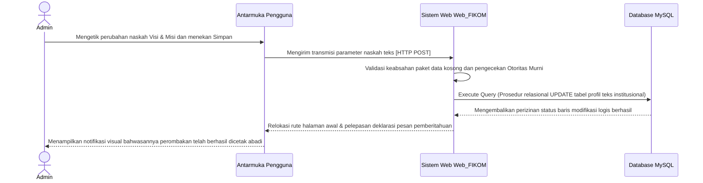
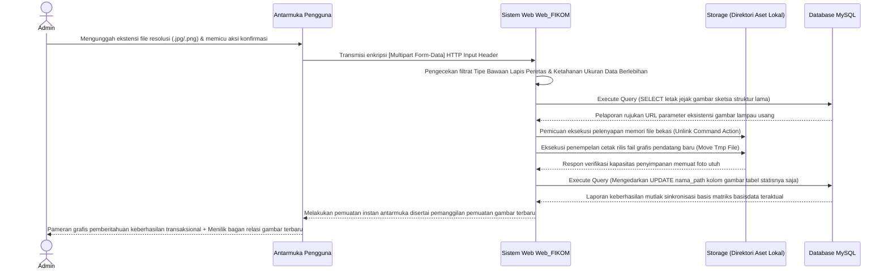
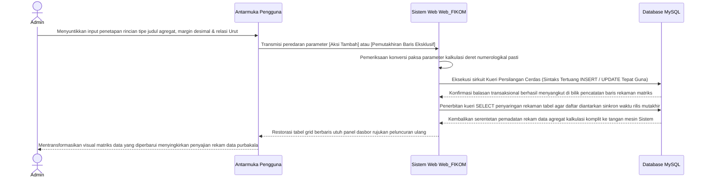
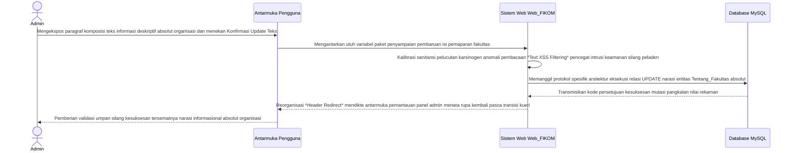

# BAB II — DIAGRAM URUTAN (SEQUENCE DIAGRAMS) LINGKUNGAN ADMINISTRATOR

Bagian ini mendeskripsikan secara teknis dan formal urutan pengiriman pesan (*message passing*) antar-objek atau pilar arsitektur sistem khusus untuk pilar manajemen operasional profil instansi di ranah Administrator. Interaksi ini menggunakan pendekatan kerangka kerja Arsitektur Lapis Tiga (Klien, Peladen, Pangkalan Data/Penyimpanan).

## 2.1 Diagram Sequence Manajemen Visi dan Misi Fakultas
**Deskripsi Alur:**
Administrator memulai sesi dengan mengirim draf pembaruan teks statis visi dan misi instansi lewat halaman panel antarmuka dasbor. Antarmuka meneruskan pemanggilan rute parameter berjenis `HTTP POST` utuh ke arah sistem pengendali (*Web Controller*). Sistem kemudian mengeksekusi pemeriksaan sesi (*Session*) administrator pengakses. Bila mendapat izin autentikasi, sistem langsung mengeksekusi kueri `UPDATE` untuk menimpa barisan tulisan basi di tabel basis data MySQL. Usai relasi pangkalan data mengamankan modifikasi barisnya, status pembaruan sah diumpan balik kepada sistem untuk dicetak menjadi notifikasi pemberitahuan (*Alert Success*) di layar sang Administrator.

## 2.2 Diagram Sequence Manajemen Struktur Organisasi (Upload Direktori Aset)
**Deskripsi Alur:**
Berbeda dengan sirkuit pengelolaan tulisan semata, manajemen sketsa grafis struktur kepemimpinan organisasi mengikutsertakan intervensi pilar `Storage` (Direktori Arsip Penyimpanan Fisik Aset Mesin Eksekutor). Administrator mengunggah formulir lampiran rupa (*File Upload*). Sistem (*Peladen*) mutlak memeriksa validasi keamanan tipe bawaan file (*Mime-Type*) serta pembatasan pemuatan limit margin (*Max-Size*). Setelelahnya disetujui sah, sistem mencabut kueri gambar basi dari basis data untuk memusnahkan (*Unlink Delete*) rekaman wujud foto lama pada direktorat `Storage`. Berlanjut menanam penyalinan injeksi grafis mutakhir *(Move_Uploaded_File)*. Sistem murni mentransmisikan deret rentang direktori (Alamat URL/Path) letak foto untuk diabadikan oleh sang Pangkalan Relasional (MySQL) bukan bentuk wujud fisik foto mentahnya.

## 2.3 Diagram Sequence Manajemen Fakta Sivitas Ekademika (CRUD Angka)
**Deskripsi Alur:**
Rancang bangun antarmuka pengelolaan matriks kalkulasi sivitas mahasiswa maupun jurnal (Fakta Fakultas) dioperasikan memakai prosedur silang baca tulisan Tambah / Modifikasi numerologikal (*Integer Create/Update Schema*). Administrator mendikte penetapan identitas entitas berupa nama wujud judul fakta, penjabaran bilangan jumlah agregat anggota, dan ketertiban tata urutan (*sorting order*). Usai melewati penapisan (*filter*) tipe variabel di tingkat mesin perantara PHP, lalu lintas deklarasi diteruskan lewat injeksi *Statement Parametris* Database MYSQL. Sesampainya perputaran status rekam sempurna terespons, rujukan matriks daftar tampilan tabel antarmuka dideklarasikan secara otomatis.

## 2.4 Diagram Sequence Manajemen Tentang Fakultas 
**Deskripsi Alur:**
Kompleksitas pemeliharaan rangkuman deksriptif narasi murni sejarah instansi bersertakan pemaparan filosofikal bertumpu utuh di perantara *Form Text Editor*. Pengguna otoritatif admin mendedikasikan penuangan gagasan reka pemaparan pada lajur isian tersebut. Eksekusi pengedaran parameter menembus *Middleware* keamanan mesin validasi agar tiada pencemaran tag naskah destruktif, barulah mesin Peladen memohon restu kueri barisan modifikasi *UPDATE* ke persinggahan tunggal pangkalan data peladen untuk dimuat rekam eksklusif selamanya sampai kedatangan waktu revisi masa seberang.

