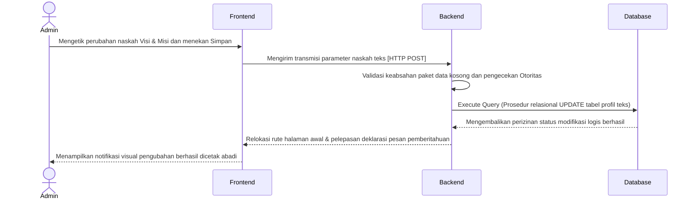
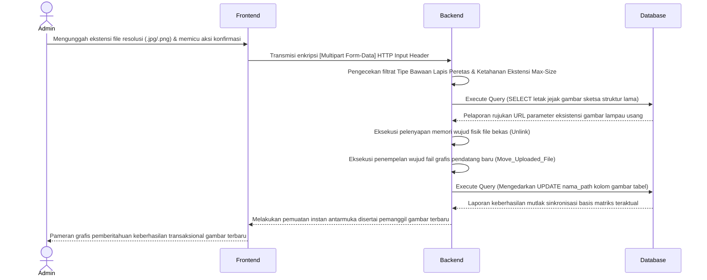
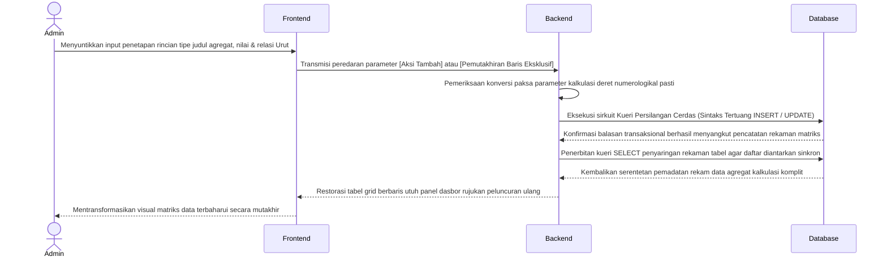
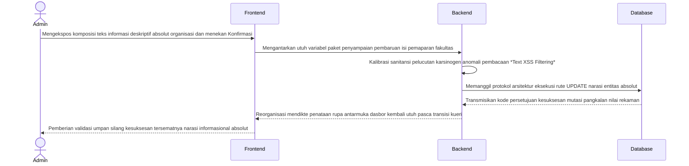

# BAB II — DIAGRAM URUTAN (SEQUENCE DIAGRAMS) LINGKUNGAN ADMINISTRATOR

Bagian ini mendeskripsikan secara teknis dan formal urutan pengiriman pesan (*message passing*) antar-objek atau pilar arsitektur sistem khusus untuk pilar manajemen operasional profil instansi di ranah Administrator. Interaksi ini murni menggunakan pendekatan kerangka kerja Arsitektur Lapis Tiga (Frontend, Backend, Database).

## 2.1 Diagram Sequence Manajemen Visi dan Misi Fakultas
**Deskripsi Alur:**
Administrator memulai sesi dengan mengirim draf pembaruan teks statis visi dan misi instansi lewat halaman panel antarmuka dasbor. Frontend meneruskan pemanggilan rute parameter berjenis `HTTP POST` utuh ke arah Backend. Backend kemudian mengeksekusi pemeriksaan sesi (*Session*) administrator pengakses. Bila mendapat izin autentikasi, Backend langsung mengeksekusi kueri `UPDATE` untuk menimpa barisan tulisan basi di tabel Database. Usai Database mengamankan modifikasi barisnya, status pembaruan sah diumpan balik kepada Backend untuk dicetak menjadi notifikasi pemberitahuan (*Alert Success*) di layar Frontend sang Administrator.

## 2.2 Diagram Sequence Manajemen Struktur Organisasi (Upload Direktori Aset)
**Deskripsi Alur:**
Berbeda dengan sirkuit pengelolaan tulisan semata, manajemen sketsa grafis struktur kepemimpinan organisasi mengikutsertakan pertukaran rekaman fisik. Administrator mengunggah formulir lampiran rupa (*File Upload*). Backend mutlak memeriksa validasi keamanan tipe bawaan file (*Mime-Type*) serta pembatasan pemuatan limit margin (*Max-Size*). Setelelahnya disetujui sah, Backend mencabut kueri gambar basi dari Database untuk mengeksekusi prosedur hapus (*Unlink*) rekaman wujud foto lama pada perantara penyimpanannya secara internal logis. Berlanjut menanam penyalinan injeksi grafis mutakhir *(Move_Uploaded_File)*. Backend mentransmisikan deret rentang direktori alamat URL foto untuk diabadikan oleh sang Database.

## 2.3 Diagram Sequence Manajemen Fakta Sivitas Ekademika (CRUD Angka)
**Deskripsi Alur:**
Rancang bangun antarmuka pengelolaan matriks kalkulasi sivitas mahasiswa maupun jurnal (Fakta Fakultas) dioperasikan memakai prosedur silang baca tulisan Tambah / Modifikasi numerologikal (*Integer Create/Update Schema*). Administrator mendikte penetapan identitas entitas berupa nama wujud judul fakta, penjabaran bilangan jumlah agregat anggota, dan ketertiban tata urutan (*sorting order*). Usai melewati penapisan (*filter*) tipe variabel di tingkat Backend, lalu lintas deklarasi diteruskan lewat injeksi *Statement Parametris* Database MYSQL. Sesampainya perputaran status rekam sempurna terespons, rujukan matriks daftar tampilan tabel Frontend dideklarasikan secara otomatis.

## 2.4 Diagram Sequence Manajemen Tentang Fakultas 
**Deskripsi Alur:**
Kompleksitas pemeliharaan rangkuman deksriptif narasi murni sejarah instansi bersertakan pemaparan filosofikal bertumpu utuh di perantara *Form Text Editor*. Pengguna otoritatif admin mendedikasikan penuangan gagasan reka pemaparan pada lajur isian Frontend. Eksekusi pengedaran parameter menembus Backend validasi agar tiada pencemaran tag naskah destruktif, barulah Backend memohon restu kueri barisan modifikasi *UPDATE* ke Database untuk dimuat rekam eksklusif selamanya sampai kedatangan waktu revisi masa seberang.

