# BAB II — DIAGRAM URUTAN

Bagian ini mendeskripsikan secara teknis dan formal urutan pengiriman pesan antar-objek atau pilar arsitektur sistem. Interaksi diuraikan menggunakan pendekatan kerangka kerja Arsitektur Lapis Tiga (Frontend, Backend, Database) dengan narasi deskriptif berbentuk paragraf baku.

## 2.1 Lingkungan Pengunjung
Bagian ini memvisualisasikan interaksi yang terjadi saat antarmuka publik atau pengunjung berinteraksi dengan sistem peladen.

### 2.1.1 Sequence Diagram: Halaman Utama

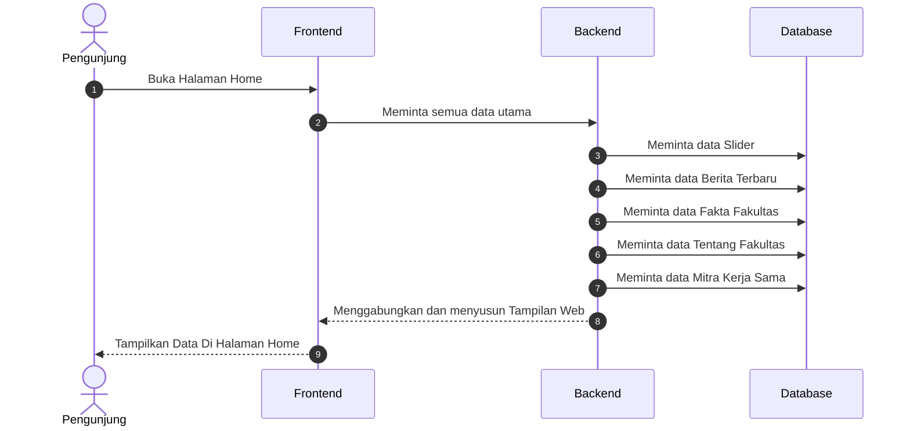

Alur ini memperlihatkan bagaimana halaman beranda mengumpulkan informasi dari berbagai sumber data seperti slider, berita terbaru, dan profil fakultas untuk ditampilkan secara utuh kepada pengunjung dalam satu waktu.

---

### 2.1.2 Sequence Diagram: Halaman Data Civitas Akademika

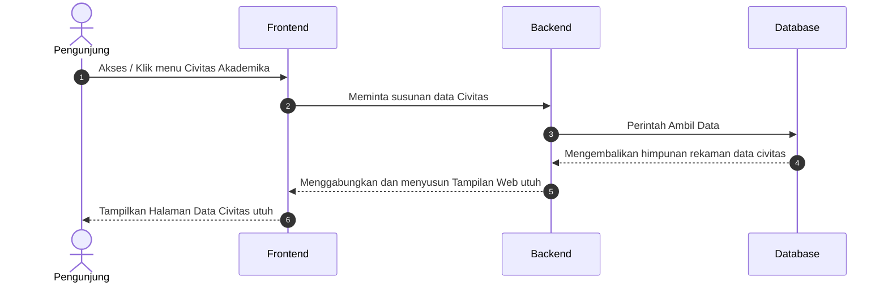

Proses ini menunjukkan permintaan pengunjung terhadap daftar civitas akademika, di mana Backend mengambil seluruh rekaman identitas pengelola fakultas dari Database untuk disajikan kembali di layar.

---

### 2.1.3 Sequence Diagram: Halaman Struktur Organisasi

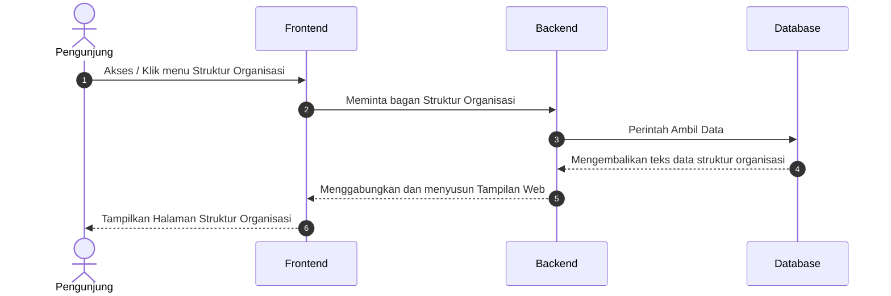

Diagram ini menggambarkan proses pengambilan data bagan organisasi yang tersimpan di sistem, yang kemudian disusun secara visual oleh Frontend agar pengunjung dapat melihat struktur kepemimpinan fakultas.

---

### 2.1.4 Sequence Diagram: Halaman Tentang Fakultas

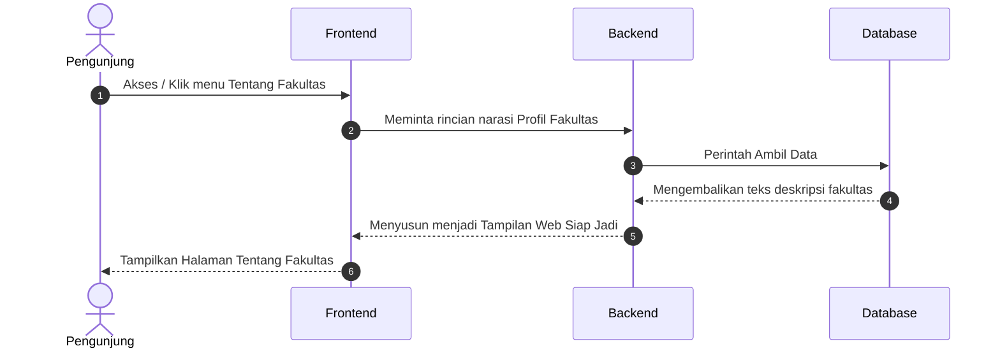

Menyiapkan narasi profil fakultas yang informatif, di mana sistem menarik data deskriptif dari basis data untuk menjelaskan latar belakang lembaga kepada pengunjung secara detail.

---

### 2.1.5 Sequence Diagram: Halaman Visi dan Misi

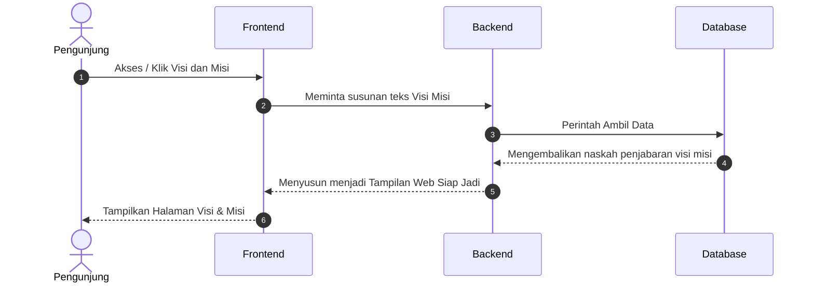

Saat pengunjung ingin mengetahui visi dan misi lembaga, sistem akan memproses permintaan tersebut dengan menarik naskah deklarasi cita-cita fakultas yang ada di Database untuk ditampilkan.

---

### 2.1.6 Sequence Diagram: Halaman Profil Dosen

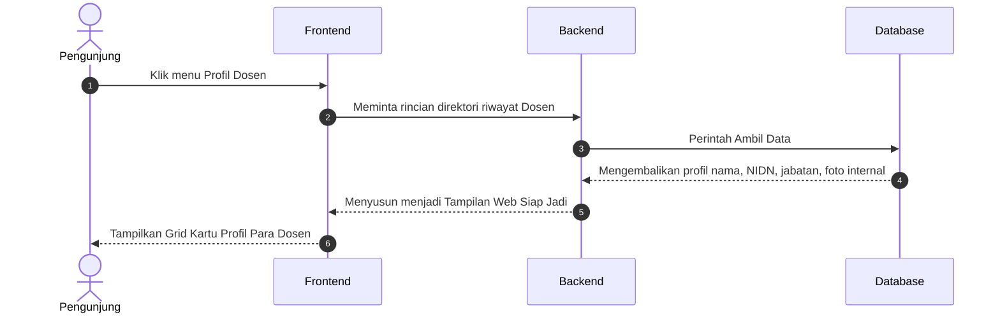

Alur pengambilan informasi riwayat dan profil dosen secara kolektif, yang kemudian dirender oleh sistem dalam bentuk grid kartu profil agar pengunjung dapat mengenal jajaran pengajar dengan mudah.

---

### 2.1.7 Sequence Diagram: Halaman Pendaftaran Mahasiswa Baru

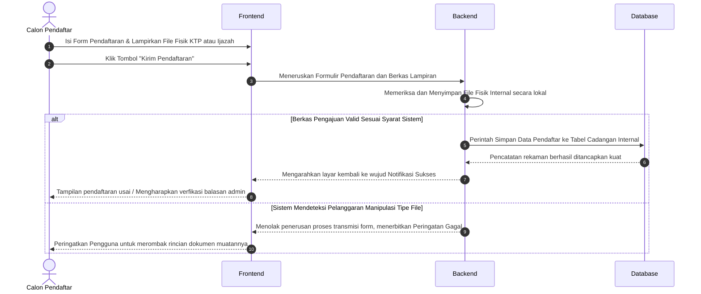

Proses pendaftaran mahasiswa baru yang melibatkan pengunggahan berkas fisik. Sistem akan memvalidasi tipe file sebelum menyimpan data pendaftar ke Database dan memberikan respon keberhasilan.

---

### 2.1.8 Sequence Diagram: Halaman Program Studi TI (Teknik Informatika)

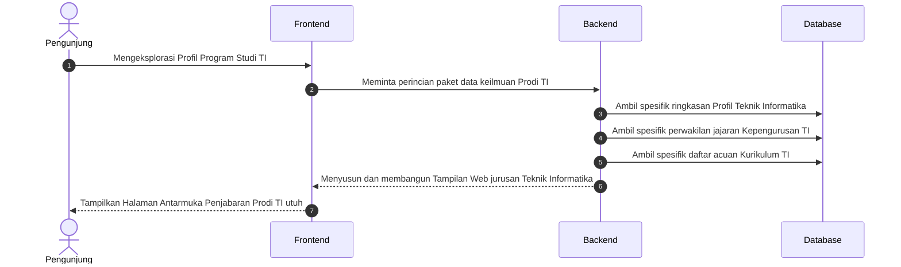

Penggambaran interaksi khusus untuk Prodi Teknik Informatika, yang mencakup pengambilan data profil konsentrasi ilmu, susunan pengurus prodi, dan acuan kurikulum yang berlaku.

---

### 2.1.9 Sequence Diagram: Halaman Program Studi PTI (Pendidikan Teknologi Informasi)

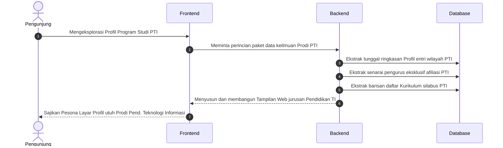

Sama halnya dengan Prodi PTI, sistem secara spesifik menyaring data kurikulum dan kepengurusan yang berafiliasi dengan rumpun Pendidikan Teknologi Informasi untuk disajikan kepada peminat.

---

### 2.1.10 Sequence Diagram: Halaman Fasilitas Ruangan

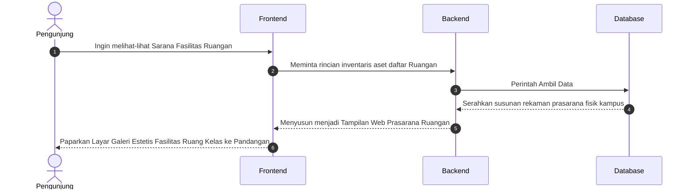

Alur yang menampilkan katalog prasarana fisik kampus, di mana sistem menyajikan rincian inventaris dan foto-foto ruangan yang tersedia untuk mendukung kegiatan perkuliahan.

---

### 2.1.11 Sequence Diagram: Halaman Fasilitas Laboratorium

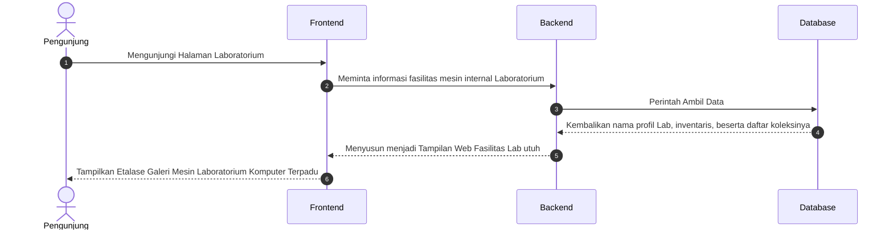

Menunjukkan interaksi pengunjung saat meninjau fasilitas laboratorium komputer, di mana sistem menarik profil lab beserta daftar koleksi mesin atau alat yang tersedia di dalamnya.

---

### 2.1.12 Sequence Diagram: Halaman Kalender Akademik

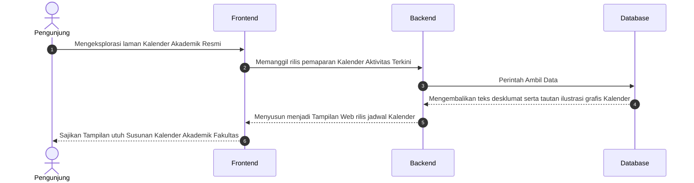

Pengambilan data jadwal aktivitas akademik tahunan, di mana sistem menampilkan naskah penjelasan beserta tautan grafis kalender yang dapat diakses oleh mahasiswa dan dosen.

---

### 2.1.13 Sequence Diagram: Halaman Dokumen Kurikulum

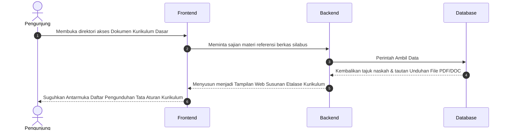

Alur pencarian referensi kurikulum yang memungkinkan pengunjung melihat daftar silabus dan mengunduh berkas PDF yang telah disediakan oleh pihak akademik.

---

### 2.1.14 Sequence Diagram: Halaman Dokumen Fakultas

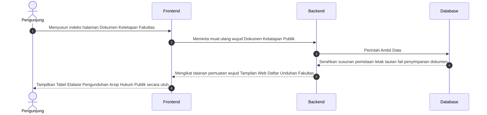

Memperlihatkan proses pengaksesan dokumen-dokumen resmi fakultas, di mana sistem menyediakan tabel daftar unduhan arsip yang tersimpan aman di server bagi khalayak publik.

---

### 2.1.15 Sequence Diagram: Halaman Rencana Strategis (Renstra)

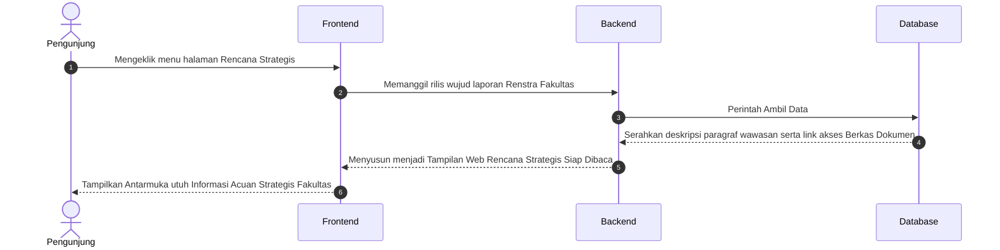

Fokus pada penyajian data rencana strategis jangka panjang fakultas, yang memberikan gambaran mengenai target dan pencapaian lembaga melalui akses terhadap berkas naskah resmi.

---

### 2.1.16 Sequence Diagram: Halaman Standar Operasional Prosedur (SOP)

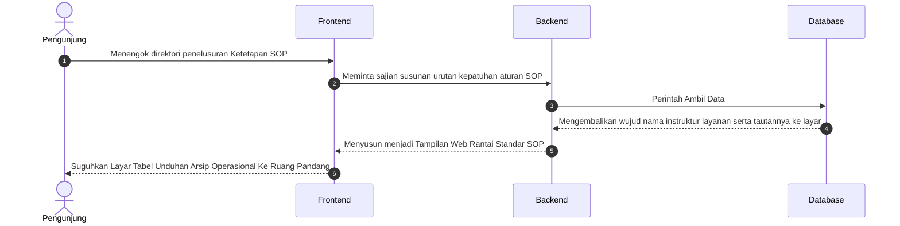

Proses pengambilan pedoman standar operasional (SOP), yang memudahkan pengunjung untuk menemukan dan mengunduh aturan teknis layanan administrasi yang berlaku di lingkungan kampus.

---

### 2.1.17 Sequence Diagram: Halaman Data Penelitian

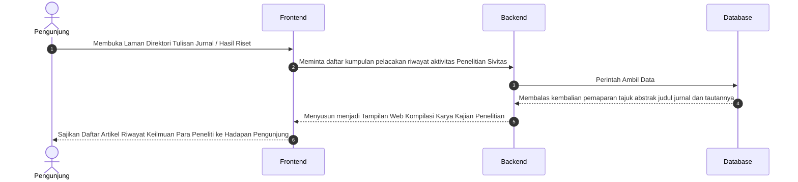

Alur yang menampilkan direktori karya ilmiah, di mana pengunjung dapat melihat judul, abstrak, dan tautan jurnal hasil riset yang dikompilasi oleh sistem dari berbagai sivitas.

---

### 2.1.18 Sequence Diagram: Halaman Data Pengabdian Masyarakat

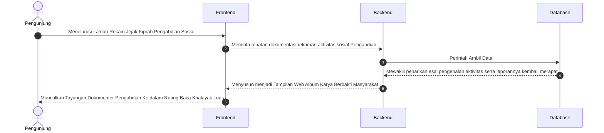

Menggambarkan rekam jejak aktivitas sosial fakultas melalui program pengabdian masyarakat, yang disajikan dalam bentuk narasi dan dokumentasi kegiatan untuk kebutuhan informasi publik.

---

### 2.1.19 Sequence Diagram: Halaman Profil Organisasi (BEM)

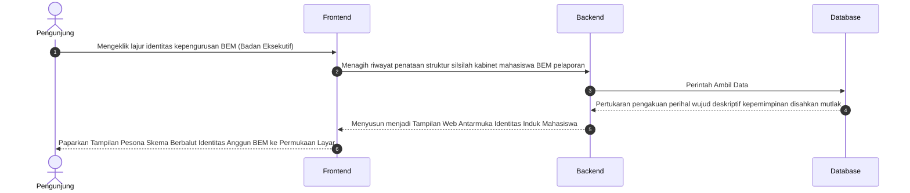

Memperlihatkan profil organisasi Badan Eksekutif Mahasiswa (BEM), yang menampilkan susunan pengurus dan deskripsi peran organisasi sebagai wadah aspirasi di tingkat fakultas.

---

### 2.1.20 Sequence Diagram: Halaman Unit Kegiatan Mahasiswa (UKM)

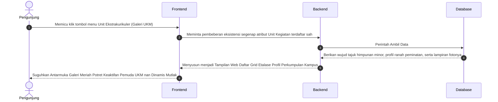

Galeri unit kegiatan mahasiswa yang dinamis, di mana sistem menyajikan profil bidang minat tiap UKM beserta foto keaktifannya untuk memperkenalkan eksistensi komunitas kampus.

---

### 2.1.21 Sequence Diagram: Halaman Himpunan Mahasiswa

```mermaid
sequenceDiagram
    autonumber
    actor User as Pengunjung
    participant Frontend as Frontend
    participant Backend as Backend
    participant Database as Database

    User->>Frontend: Mencari pangkalan letak susunan himpunan otoritatif prodi (Jurusan) eksklusif
    Frontend->>Backend: Meminta pengungkapan tata aturan perwakilan tiap jajaran HIMA di bawah naungan BEM
    
    Backend->>Database: Perintah Ambil Data
    Database-->>Backend: Mewujudkan pertukaran penyerahan tabel Program Kerja spesifik per rumpun perwakilan  
    
    Backend-->>Frontend: Menyusun menjadi Tampilan Web Etalase Kemerincian Susunan Kabinet Cabang Independen
    Frontend-->>User: Paparkan Profil Megah Relasional Aktivis Mahasiswa Pemegang Identitas Perjurusan Prodi
```

Fokus pada identitas himpunan mahasiswa per program studi, yang menampilkan bagan kerja dan spesifikasi perwakilan jurusan yang beroperasi secara mandiri namun tetap terkoordinasi.

---

### 2.1.22 Sequence Diagram: Halaman Profil & Tracer Alumni

```mermaid
sequenceDiagram
    autonumber
    actor User as Pengunjung
    participant Frontend as Frontend
    participant Backend as Backend
    participant Database as Database

    User->>Frontend: Singgah merunut pelacakan riwayat kelulusan pemuda cendekia (Ruang Pencarian Alumni)
    Frontend->>Backend: Mengajukan penarikan data wujud Direktori Kelulusan serta kiprah sukses riwayat Purna Kampus
    
    Backend->>Database: Perintah Ambil Data
    Database-->>Backend: Hadirkan rentetan kompilasi wawasan data karir penempatan serta rekam masa pelepasan ke tangan server
    
    Backend-->>Frontend: Menyusun menjadi Tampilan Web Riwayat Lintas Waktu para Pemegang Takhta Kesuksesan Belajar 
    Frontend-->>User: Tampilkan Lembar Kebanggaan Perjalanan Waktu Catatan Karier dan Keaktifan Anggota Purna Lulusan Web 
```

Alur tracer alumni yang berfungsi untuk memetakan sebaran karir lulusan, di mana sistem menampilkan daftar kompilasi kesuksesan purna kampus bagi para pemangku kepentingan.

### 2.1.23 Sequence Diagram: Halaman Sambutan Dekan

```mermaid
sequenceDiagram
    autonumber
    actor User as Pengunjung
    participant Frontend as Frontend
    participant Backend as Backend
    participant Database as Database

    User->>Frontend: Mengeklik menu Sambutan Dekan
    Frontend->>Backend: Meminta konten narasi dan foto profil Dekan
    
    Backend->>Database: Perintah Ambil Data (Logika Halaman Statis/Profil)
    Database-->>Backend: Mengembalikan teks sambutan dan path foto dekan
    
    Backend-->>Frontend: Menyusun Komponen Halaman Sambutan Utuh
    Frontend-->>User: Tampilkan Halaman Sambutan Dekan yang Informatif
```

Menampilkan pesan penyambutan secara personal dari Dekan FIKOM, yang menggabungkan teks narasi sambutan dengan identitas visual pimpinan fakultas sebagai pembuka profil lembaga.

---

### 2.2.1 Sequence Diagram: Login Administrator
Admin masuk ke sistem melalui form login. Backend akan mencocokkan kredensial dengan pangkalan data, dan jika sesuai, sesi aktif akan dibuat untuk memberikan akses ke dashboard utama.

```mermaid
sequenceDiagram
    autonumber
    actor Admin as Admin
    participant Frontend as Frontend
    participant Backend as Backend
    participant DB as Database

    Admin->>Frontend: Buka halaman login
    Frontend-->>Admin: Tampilkan form login
    
    Admin->>Frontend: Ketik Username & Password, tekan Login
    Frontend->>Backend: Kirim form data (jalur komunikasi aman)
    
    Backend->>DB: Cek kecocokan User/Pass
    DB-->>Backend: Validasi kredensial
    
    alt Login Berhasil
        Backend->>Backend: Set Sesi kunjungan Login Aktif
        Backend-->>Frontend: Redirect ke Dashboard Admin
    else Login Gagal
        Backend-->>Frontend: Tampilkan pesan Error Login
    end
```

---

### 2.2.2 Sequence Diagram: Kelola Slider Beranda
Mengatur konten visual di halaman depan. Admin dapat menambah, mengubah, atau menghapus gambar slider. Sistem secara otomatis mengelola penyimpanan fisik file di server dan pembaruan datanya di database.

```mermaid
sequenceDiagram
    autonumber
    actor Admin as Administrator
    participant Frontend as Frontend
    participant Backend as Backend
    participant Server as "Storage"
    participant DB as Database

    Admin->>Frontend: Buka halaman menu Kelola Slider Beranda
    Frontend->>Backend: Request Halaman & Data
    Backend->>DB: Tarik semua riwayat arsip data
    DB-->>Backend: Return Data
    Backend-->>Frontend: Tampilkan daftar tabel data ke beranda layar

    %% Proses Tambah / Edit
    opt Klik Tombol Tambah / Edit Baris Data
        Admin->>Frontend: Lengkapi isian form & Upload Foto Pemandangan Kampus beranda
        Admin->>Frontend: Konfirmasi persetujuan tombol "Simpan"
        Frontend->>Backend: Kirim input form menuju sistem (jalur komunikasi aman)

        Backend->>Backend: Cek kesesuaian parameter format berkas dan ukurannya
        
        alt Jika klasifikasi parameter file Valid / Benar
            opt Jika tedapat lampiran berkas baru yang diunggah
                Backend->>Server: Simpan fisik file masuk ke folder peladen uploads/slider
                opt Jika menimpa data warisan usang pengeditan
                    Backend->>Server: Hapus permanen file peninggalan lawas
                end
            end
            
            Backend->>DB: Sisipkan detail baris isian ketikan teks & integrasikan link lokasinya ke Database
            DB-->>Backend: Peladen menyematkan pertanda konfirmasi data terekam permanen
            Backend-->>Frontend: Dialihkan kembali ke tabel dibarengi rilis Menampilkan Konfirmasi Pesan Sukses
        else Terdeteksi Format File Salah / Skala Muatan Overload Besar
            Backend-->>Frontend: Singkirkan lalu buang permohonan bersisian peringatan Error
        end
    end

    %% Proses Hapus
    opt Klik Ikon / Tombol Hapus pada Baris
        Admin->>Frontend: Sentuh pengajuan pembasmian mutlak baris rekaman spesifik
        Frontend->>Backend: Eksekusi sanksi lemparan pembersihan mendesak pangkalan perampingan
        Backend->>DB: Lacak letak kedudukan koordinat alamat letak nama spesifik file 
        Backend->>Server: Congkel hancurkan secara fisis fail bawaan eksisting di laci wadah uploads/slider
        Backend->>DB: Runtuhkan catatan nama jejak spesifik itu terbakar bersih melenggang jauh dari Database
        DB-->>Backend: Penarikan silsilah daftar terhapuskan mutakhir dipastikan tersingkir
        Backend-->>Frontend: Melemparkan pengawal administrasi memuat rupa jernih diiringi Papan Pemberitahuan Lapor Sukses 
    end
```

---

### 2.2.3 Sequence Diagram: Kelola Berita
Fasilitas manajemen berita fakultas. Admin dapat mempublikasikan informasi terbaru dengan lampiran foto sampul. Sistem memastikan setiap pembaruan atau penghapusan berita turut menyinkronkan aset gambar terkait.

```mermaid
sequenceDiagram
    autonumber
    actor Admin as Administrator
    participant Frontend as Frontend
    participant Backend as Backend
    participant Server as "Storage"
    participant DB as Database

    Admin->>Frontend: Buka halaman menu Kelola Berita
    Frontend->>Backend: Request Halaman & Data
    Backend->>DB: Tarik semua riwayat arsip data
    DB-->>Backend: Return Data
    Backend-->>Frontend: Tampilkan daftar tabel data ke beranda layar

    %% Proses Tambah / Edit
    opt Klik Tombol Tambah / Edit Baris Data
        Admin->>Frontend: Lengkapi isian form & Upload Foto Sampul
        Admin->>Frontend: Konfirmasi persetujuan tombol "Simpan"
        Frontend->>Backend: Kirim input form menuju sistem (jalur komunikasi aman)

        Backend->>Backend: Cek kesesuaian parameter format berkas dan ukurannya
        
        alt Jika klasifikasi parameter file Valid / Benar
            opt Jika tedapat lampiran berkas baru yang diunggah
                Backend->>Server: Simpan fisik file masuk ke folder peladen uploads/
                opt Jika menimpa data warisan usang pengeditan
                    Backend->>Server: Hapus permanen file peninggalan lawas
                end
            end
            
            Backend->>DB: Sisipkan detail baris isian ketikan teks & integrasikan link lokasinya ke Database
            DB-->>Backend: Peladen menyematkan pertanda konfirmasi data terekam permanen
            Backend-->>Frontend: Dialihkan kembali ke tabel dibarengi rilis Menampilkan Konfirmasi Pesan Sukses
        else Terdeteksi Format File Salah / Skala Muatan Overload Besar
            Backend-->>Frontend: Singkirkan lalu buang permohonan bersisian peringatan Error
        end
    end

    %% Proses Hapus
    opt Klik Ikon / Tombol Hapus pada Baris
        Admin->>Frontend: Sentuh pengajuan pembasmian mutlak baris rekaman spesifik
        Frontend->>Backend: Eksekusi sanksi lemparan pembersihan mendesak pangkalan perampingan
        Backend->>DB: Lacak letak kedudukan koordinat alamat letak nama spesifik file 
        Backend->>Server: Congkel hancurkan secara fisis fail bawaan eksisting di laci wadah uploads/
        Backend->>DB: Runtuhkan catatan nama jejak spesifik itu terbakar bersih melenggang jauh dari Database
        DB-->>Backend: Penarikan silsilah daftar terhapuskan mutakhir dipastikan tersingkir
        Backend-->>Frontend: Melemparkan pengawal administrasi memuat rupa jernih diiringi Papan Pemberitahuan Lapor Sukses 
    end
```

---

### 2.2.4 Sequence Diagram: Kelola Dosen
Pengelolaan data direktori pengajar. Admin bertugas memperbarui profil, jabatan, dan foto dosen. Proses penghapusan data akan membersihkan file foto profil dari penyimpanan server agar tidak membebani memori.

```mermaid
sequenceDiagram
    autonumber
    actor Admin as Administrator
    participant Frontend as Frontend
    participant Backend as Backend
    participant Server as "Storage"
    participant DB as Database

    Admin->>Frontend: Buka halaman menu Kelola Dosen
    Frontend->>Backend: Request Halaman & Data
    Backend->>DB: Tarik semua riwayat arsip data
    DB-->>Backend: Return Data
    Backend-->>Frontend: Tampilkan daftar tabel data ke beranda layar

    %% Proses Tambah / Edit
    opt Klik Tombol Tambah / Edit Baris Data
        Admin->>Frontend: Lengkapi isian form & Upload Foto Profil
        Admin->>Frontend: Konfirmasi persetujuan tombol "Simpan"
        Frontend->>Backend: Kirim input form menuju sistem (jalur komunikasi aman)

        Backend->>Backend: Cek kesesuaian parameter format berkas dan ukurannya
        
        alt Jika klasifikasi parameter file Valid / Benar
            opt Jika tedapat lampiran berkas baru yang diunggah
                Backend->>Server: Simpan fisik file masuk ke folder peladen uploads/dosen
                opt Jika menimpa data warisan usang pengeditan
                    Backend->>Server: Hapus permanen file peninggalan lawas
                end
            end
            
            Backend->>DB: Sisipkan detail baris isian ketikan teks & integrasikan link lokasinya ke Database
            DB-->>Backend: Peladen menyematkan pertanda konfirmasi data terekam permanen
            Backend-->>Frontend: Dialihkan kembali ke tabel dibarengi rilis Menampilkan Konfirmasi Pesan Sukses
        else Terdeteksi Format File Salah / Skala Muatan Overload Besar
            Backend-->>Frontend: Singkirkan lalu buang permohonan bersisian peringatan Error
        end
    end

    %% Proses Hapus
    opt Klik Ikon / Tombol Hapus pada Baris
        Admin->>Frontend: Sentuh pengajuan pembasmian mutlak baris rekaman spesifik
        Frontend->>Backend: Eksekusi sanksi lemparan pembersihan mendesak pangkalan perampingan
        Backend->>DB: Lacak letak kedudukan koordinat alamat letak nama spesifik file 
        Backend->>Server: Congkel hancurkan secara fisis fail bawaan eksisting di laci wadah uploads/dosen
        Backend->>DB: Runtuhkan catatan nama jejak spesifik itu terbakar bersih melenggang jauh dari Database
        DB-->>Backend: Penarikan silsilah daftar terhapuskan mutakhir dipastikan tersingkir
        Backend-->>Frontend: Melemparkan pengawal administrasi memuat rupa jernih diiringi Papan Pemberitahuan Lapor Sukses 
    end
```

---

### 2.2.5 Sequence Diagram: Kelola Fasilitas Ruangan
Manajemen inventaris ruang kelas. Admin mendaftarkan kapasitas dan fasilitas sarana fisik. Unggahan foto ruangan divalidasi oleh sistem sebelum disimpan untuk memastikan estetika tampilan publik terjaga.

```mermaid
sequenceDiagram
    autonumber
    actor Admin as Administrator
    participant Frontend as Frontend
    participant Backend as Backend
    participant Server as "Storage"
    participant DB as Database

    Admin->>Frontend: Buka halaman menu Kelola Fasilitas Ruangan
    Frontend->>Backend: Request Halaman & Data
    Backend->>DB: Tarik semua riwayat arsip data
    DB-->>Backend: Return Data
    Backend-->>Frontend: Tampilkan daftar tabel data ke beranda layar

    %% Proses Tambah / Edit
    opt Klik Tombol Tambah / Edit Baris Data
        Admin->>Frontend: Lengkapi isian form & Upload Foto Kelas/Ruangan
        Admin->>Frontend: Konfirmasi persetujuan tombol "Simpan"
        Frontend->>Backend: Kirim input form menuju sistem (jalur komunikasi aman)

        Backend->>Backend: Cek kesesuaian parameter format berkas dan ukurannya
        
        alt Jika klasifikasi parameter file Valid / Benar
            opt Jika tedapat lampiran berkas baru yang diunggah
                Backend->>Server: Simpan fisik file masuk ke folder peladen uploads/ruangan
                opt Jika menimpa data warisan usang pengeditan
                    Backend->>Server: Hapus permanen file peninggalan lawas
                end
            end
            
            Backend->>DB: Sisipkan detail baris isian ketikan teks & integrasikan link lokasinya ke Database
            DB-->>Backend: Peladen menyematkan pertanda konfirmasi data terekam permanen
            Backend-->>Frontend: Dialihkan kembali ke tabel dibarengi rilis Menampilkan Konfirmasi Pesan Sukses
        else Terdeteksi Format File Salah / Skala Muatan Overload Besar
            Backend-->>Frontend: Singkirkan lalu buang permohonan bersisian peringatan Error
        end
    end

    %% Proses Hapus
    opt Klik Ikon / Tombol Hapus pada Baris
        Admin->>Frontend: Sentuh pengajuan pembasmian mutlak baris rekaman spesifik
        Frontend->>Backend: Eksekusi sanksi lemparan pembersihan mendesak pangkalan perampingan
        Backend->>DB: Lacak letak kedudukan koordinat alamat letak nama spesifik file 
        Backend->>Server: Congkel hancurkan secara fisis fail bawaan eksisting di laci wadah uploads/ruangan
        Backend->>DB: Runtuhkan catatan nama jejak spesifik itu terbakar bersih melenggang jauh dari Database
        DB-->>Backend: Penarikan silsilah daftar terhapuskan mutakhir dipastikan tersingkir
        Backend-->>Frontend: Melemparkan pengawal administrasi memuat rupa jernih diiringi Papan Pemberitahuan Lapor Sukses 
    end
```

---

### 2.2.6 Sequence Diagram: Kelola Fasilitas Laboratorium
Modul khusus untuk mengelola profil laboratorium komputer. Admin dapat memperbarui rincian alat dan foto lab, di mana sistem menangani penggantian aset gambar lama dengan yang baru secara otomatis.

```mermaid
sequenceDiagram
    autonumber
    actor Admin as Administrator
    participant Frontend as Frontend
    participant Backend as Backend
    participant Server as "Storage"
    participant DB as Database

    Admin->>Frontend: Buka halaman menu Kelola Fasilitas Laboratorium
    Frontend->>Backend: Request Halaman & Data
    Backend->>DB: Tarik semua riwayat arsip data
    DB-->>Backend: Return Data
    Backend-->>Frontend: Tampilkan daftar tabel data ke beranda layar

    %% Proses Tambah / Edit
    opt Klik Tombol Tambah / Edit Baris Data
        Admin->>Frontend: Lengkapi isian form & Upload Foto Laboratorium
        Admin->>Frontend: Konfirmasi persetujuan tombol "Simpan"
        Frontend->>Backend: Kirim input form menuju sistem (jalur komunikasi aman)

        Backend->>Backend: Cek kesesuaian parameter format berkas dan ukurannya
        
        alt Jika klasifikasi parameter file Valid / Benar
            opt Jika tedapat lampiran berkas baru yang diunggah
                Backend->>Server: Simpan fisik file masuk ke folder peladen uploads/laboratorium
                opt Jika menimpa data warisan usang pengeditan
                    Backend->>Server: Hapus permanen file peninggalan lawas
                end
            end
            
            Backend->>DB: Sisipkan detail baris isian ketikan teks & integrasikan link lokasinya ke Database
            DB-->>Backend: Peladen menyematkan pertanda konfirmasi data terekam permanen
            Backend-->>Frontend: Dialihkan kembali ke tabel dibarengi rilis Menampilkan Konfirmasi Pesan Sukses
        else Terdeteksi Format File Salah / Skala Muatan Overload Besar
            Backend-->>Frontend: Singkirkan lalu buang permohonan bersisian peringatan Error
        end
    end

    %% Proses Hapus
    opt Klik Ikon / Tombol Hapus pada Baris
        Admin->>Frontend: Sentuh pengajuan pembasmian mutlak baris rekaman spesifik
        Frontend->>Backend: Eksekusi sanksi lemparan pembersihan mendesak pangkalan perampingan
        Backend->>DB: Lacak letak kedudukan koordinat alamat letak nama spesifik file 
        Backend->>Server: Congkel hancurkan secara fisis fail bawaan eksisting di laci wadah uploads/laboratorium
        Backend->>DB: Runtuhkan catatan nama jejak spesifik itu terbakar bersih melenggang jauh dari Database
        DB-->>Backend: Penarikan silsilah daftar terhapuskan mutakhir dipastikan tersingkir
        Backend-->>Frontend: Melemparkan pengawal administrasi memuat rupa jernih diiringi Papan Pemberitahuan Lapor Sukses 
    end
```

---

### 2.2.7 Sequence Diagram: Kelola Kalender Akademik
Pembaruan jadwal rutin fakultas. Admin mengunggah gambar kalender akademik terbaru, dan sistem akan menggantikan file kalender periode sebelumnya dengan versi yang paling mutakhir di server.

```mermaid
sequenceDiagram
    autonumber
    actor Admin as Administrator
    participant Frontend as Frontend
    participant Backend as Backend
    participant Server as "Storage"
    participant DB as Database

    Admin->>Frontend: Buka halaman menu Kelola Kalender Akademik
    Frontend->>Backend: Request Halaman & Data
    Backend->>DB: Tarik semua riwayat arsip data
    DB-->>Backend: Return Data
    Backend-->>Frontend: Tampilkan daftar tabel data ke beranda layar

    %% Proses Tambah / Edit
    opt Klik Tombol Tambah / Edit Baris Data
        Admin->>Frontend: Lengkapi isian form & Upload Gambar Kalender
        Admin->>Frontend: Konfirmasi persetujuan tombol "Simpan"
        Frontend->>Backend: Kirim input form menuju sistem (jalur komunikasi aman)

        Backend->>Backend: Cek kesesuaian parameter format berkas dan ukurannya
        
        alt Jika klasifikasi parameter file Valid / Benar
            opt Jika tedapat lampiran berkas baru yang diunggah
                Backend->>Server: Simpan fisik file masuk ke folder peladen uploads/kalender
                opt Jika menimpa data warisan usang pengeditan
                    Backend->>Server: Hapus permanen file peninggalan lawas
                end
            end
            
            Backend->>DB: Sisipkan detail baris isian ketikan teks & integrasikan link lokasinya ke Database
            DB-->>Backend: Peladen menyematkan pertanda konfirmasi data terekam permanen
            Backend-->>Frontend: Dialihkan kembali ke tabel dibarengi rilis Menampilkan Konfirmasi Pesan Sukses
        else Terdeteksi Format File Salah / Skala Muatan Overload Besar
            Backend-->>Frontend: Singkirkan lalu buang permohonan bersisian peringatan Error
        end
    end

    %% Proses Hapus
    opt Klik Ikon / Tombol Hapus pada Baris
        Admin->>Frontend: Sentuh pengajuan pembasmian mutlak baris rekaman spesifik
        Frontend->>Backend: Eksekusi sanksi lemparan pembersihan mendesak pangkalan perampingan
        Backend->>DB: Lacak letak kedudukan koordinat alamat letak nama spesifik file 
        Backend->>Server: Congkel hancurkan secara fisis fail bawaan eksisting di laci wadah uploads/kalender
        Backend->>DB: Runtuhkan catatan nama jejak spesifik itu terbakar bersih melenggang jauh dari Database
        DB-->>Backend: Penarikan silsilah daftar terhapuskan mutakhir dipastikan tersingkir
        Backend-->>Frontend: Melemparkan pengawal administrasi memuat rupa jernih diiringi Papan Pemberitahuan Lapor Sukses 
    end
```

---

### 2.2.8 Sequence Diagram: Kelola Dokumen Kurikulum
Manajemen dokumen akademik. Admin mengelola berkas silabus dalam format PDF/DOC. Sistem memastikan setiap file yang diunggah memiliki format yang aman sebelum disimpan dalam direktori dokumen khusus.

```mermaid
sequenceDiagram
    autonumber
    actor Admin as Administrator
    participant Frontend as Frontend
    participant Backend as Backend
    participant Server as "Storage"
    participant DB as Database

    Admin->>Frontend: Buka halaman menu Kelola Dokumen Kurikulum
    Frontend->>Backend: Request Halaman & Data
    Backend->>DB: Tarik semua riwayat arsip data
    DB-->>Backend: Return Data
    Backend-->>Frontend: Tampilkan daftar tabel data ke beranda layar

    %% Proses Tambah / Edit
    opt Klik Tombol Tambah / Edit Baris Data
        Admin->>Frontend: Lengkapi isian form & Upload Dokumen Asli
        Admin->>Frontend: Konfirmasi persetujuan tombol "Simpan"
        Frontend->>Backend: Kirim input form menuju sistem (jalur komunikasi aman)

        Backend->>Backend: Cek kesesuaian parameter format berkas dan ukurannya
        
        alt Jika klasifikasi parameter file Valid / Benar
            opt Jika tedapat lampiran berkas baru yang diunggah
                Backend->>Server: Simpan fisik file masuk ke folder peladen docs/kurikulum
                opt Jika menimpa data warisan usang pengeditan
                    Backend->>Server: Hapus permanen file peninggalan lawas
                end
            end
            
            Backend->>DB: Sisipkan detail baris isian ketikan teks & integrasikan link lokasinya ke Database
            DB-->>Backend: Peladen menyematkan pertanda konfirmasi data terekam permanen
            Backend-->>Frontend: Dialihkan kembali ke tabel dibarengi rilis Menampilkan Konfirmasi Pesan Sukses
        else Terdeteksi Format File Salah / Skala Muatan Overload Besar
            Backend-->>Frontend: Singkirkan lalu buang permohonan bersisian peringatan Error
        end
    end

    %% Proses Hapus
    opt Klik Ikon / Tombol Hapus pada Baris
        Admin->>Frontend: Sentuh pengajuan pembasmian mutlak baris rekaman spesifik
        Frontend->>Backend: Eksekusi sanksi lemparan pembersihan mendesak pangkalan perampingan
        Backend->>DB: Lacak letak kedudukan koordinat alamat letak nama spesifik file 
        Backend->>Server: Congkel hancurkan secara fisis fail bawaan eksisting di laci wadah docs/kurikulum
        Backend->>DB: Runtuhkan catatan nama jejak spesifik itu terbakar bersih melenggang jauh dari Database
        DB-->>Backend: Penarikan silsilah daftar terhapuskan mutakhir dipastikan tersingkir
        Backend-->>Frontend: Melemparkan pengawal administrasi memuat rupa jernih diiringi Papan Pemberitahuan Lapor Sukses 
    end
```

---

### 2.2.9 Sequence Diagram: Kelola Mitra Kerjasama
Dokumentasi relasi institusi. Admin mengelola daftar logo dan detail kerjasama dengan pihak eksternal. Sistem memfasilitasi pembaruan profil mitra serta pembersihan aset logo jika kerjasama telah berakhir.

```mermaid
sequenceDiagram
    autonumber
    actor Admin as Administrator
    participant Frontend as Frontend
    participant Backend as Backend
    participant Server as "Storage"
    participant DB as Database

    Admin->>Frontend: Buka halaman menu Kelola Mitra Kerjasama
    Frontend->>Backend: Request Halaman & Data
    Backend->>DB: Tarik semua riwayat arsip data
    DB-->>Backend: Return Data
    Backend-->>Frontend: Tampilkan daftar tabel data ke beranda layar

    %% Proses Tambah / Edit
    opt Klik Tombol Tambah / Edit Baris Data
        Admin->>Frontend: Lengkapi isian form & Upload Logo Kemitraan
        Admin->>Frontend: Konfirmasi persetujuan tombol "Simpan"
        Frontend->>Backend: Kirim input form menuju sistem (jalur komunikasi aman)

        Backend->>Backend: Cek kesesuaian parameter format berkas dan ukurannya
        
        alt Jika klasifikasi parameter file Valid / Benar
            opt Jika tedapat lampiran berkas baru yang diunggah
                Backend->>Server: Simpan fisik file masuk ke folder peladen uploads/kerjasama
                opt Jika menimpa data warisan usang pengeditan
                    Backend->>Server: Hapus permanen file peninggalan lawas
                end
            end
            
            Backend->>DB: Sisipkan detail baris isian ketikan teks & integrasikan link lokasinya ke Database
            DB-->>Backend: Peladen menyematkan pertanda konfirmasi data terekam permanen
            Backend-->>Frontend: Dialihkan kembali ke tabel dibarengi rilis Menampilkan Konfirmasi Pesan Sukses
        else Terdeteksi Format File Salah / Skala Muatan Overload Besar
            Backend-->>Frontend: Singkirkan lalu buang permohonan bersisian peringatan Error
        end
    end

    %% Proses Hapus
    opt Klik Ikon / Tombol Hapus pada Baris
        Admin->>Frontend: Sentuh pengajuan pembasmian mutlak baris rekaman spesifik
        Frontend->>Backend: Eksekusi sanksi lemparan pembersihan mendesak pangkalan perampingan
        Backend->>DB: Lacak letak kedudukan koordinat alamat letak nama spesifik file 
        Backend->>Server: Congkel hancurkan secara fisis fail bawaan eksisting di laci wadah uploads/kerjasama
        Backend->>DB: Runtuhkan catatan nama jejak spesifik itu terbakar bersih melenggang jauh dari Database
        DB-->>Backend: Penarikan silsilah daftar terhapuskan mutakhir dipastikan tersingkir
        Backend-->>Frontend: Melemparkan pengawal administrasi memuat rupa jernih diiringi Papan Pemberitahuan Lapor Sukses 
    end
```

---

### 2.2.10 Sequence Diagram: Kelola Data Penelitian
Mengelola repositori karya ilmiah. Admin menginput abstrak dan berkas laporan hasil riset. Sistem akan menata riwayat penelitian agar dapat diakses oleh publik secara terstruktur melalui link unduhan.

```mermaid
sequenceDiagram
    autonumber
    actor Admin as Administrator
    participant Frontend as Frontend
    participant Backend as Backend
    participant Server as "Storage"
    participant DB as Database

    Admin->>Frontend: Buka halaman menu Kelola Data Penelitian
    Frontend->>Backend: Request Halaman & Data
    Backend->>DB: Tarik semua riwayat arsip data
    DB-->>Backend: Return Data
    Backend-->>Frontend: Tampilkan daftar tabel data ke beranda layar

    %% Proses Tambah / Edit
    opt Klik Tombol Tambah / Edit Baris Data
        Admin->>Frontend: Lengkapi isian form & Upload Dokumen Laporan Publikasi
        Admin->>Frontend: Konfirmasi persetujuan tombol "Simpan"
        Frontend->>Backend: Kirim input form menuju sistem (jalur komunikasi aman)

        Backend->>Backend: Cek kesesuaian parameter format berkas dan ukurannya
        
        alt Jika klasifikasi parameter file Valid / Benar
            opt Jika tedapat lampiran berkas baru yang diunggah
                Backend->>Server: Simpan fisik file masuk ke folder peladen docs/penelitian
                opt Jika menimpa data warisan usang pengeditan
                    Backend->>Server: Hapus permanen file peninggalan lawas
                end
            end
            
            Backend->>DB: Sisipkan detail baris isian ketikan teks & integrasikan link lokasinya ke Database
            DB-->>Backend: Peladen menyematkan pertanda konfirmasi data terekam permanen
            Backend-->>Frontend: Dialihkan kembali ke tabel dibarengi rilis Menampilkan Konfirmasi Pesan Sukses
        else Terdeteksi Format File Salah / Skala Muatan Overload Besar
            Backend-->>Frontend: Singkirkan lalu buang permohonan bersisian peringatan Error
        end
    end

    %% Proses Hapus
    opt Klik Ikon / Tombol Hapus pada Baris
        Admin->>Frontend: Sentuh pengajuan pembasmian mutlak baris rekaman spesifik
        Frontend->>Backend: Eksekusi sanksi lemparan pembersihan mendesak pangkalan perampingan
        Backend->>DB: Lacak letak kedudukan koordinat alamat letak nama spesifik file 
        Backend->>Server: Congkel hancurkan secara fisis fail bawaan eksisting di laci wadah docs/penelitian
        Backend->>DB: Runtuhkan catatan nama jejak spesifik itu terbakar bersih melenggang jauh dari Database
        DB-->>Backend: Penarikan silsilah daftar terhapuskan mutakhir dipastikan tersingkir
        Backend-->>Frontend: Melemparkan pengawal administrasi memuat rupa jernih diiringi Papan Pemberitahuan Lapor Sukses 
    end
```

---

### 2.2.11 Sequence Diagram: Kelola Data Pengabdian
Dokumentasi kegiatan sosial fakultas. Admin mengunggah laporan pengabdian masyarakat. Sistem memastikan naskah naratif dan dokumentasi foto kegiatan tersimpan dengan benar dalam pangkalan data.

```mermaid
sequenceDiagram
    autonumber
    actor Admin as Administrator
    participant Frontend as Frontend
    participant Backend as Backend
    participant Server as "Storage"
    participant DB as Database

    Admin->>Frontend: Buka halaman menu Kelola Data Pengabdian
    Frontend->>Backend: Request Halaman & Data
    Backend->>DB: Tarik semua riwayat arsip data
    DB-->>Backend: Return Data
    Backend-->>Frontend: Tampilkan daftar tabel data ke beranda layar

    %% Proses Tambah / Edit
    opt Klik Tombol Tambah / Edit Baris Data
        Admin->>Frontend: Lengkapi isian form & Upload Laporan Dokumentasi
        Admin->>Frontend: Konfirmasi persetujuan tombol "Simpan"
        Frontend->>Backend: Kirim input form menuju sistem (jalur komunikasi aman)

        Backend->>Backend: Cek kesesuaian parameter format berkas dan ukurannya
        
        alt Jika klasifikasi parameter file Valid / Benar
            opt Jika tedapat lampiran berkas baru yang diunggah
                Backend->>Server: Simpan fisik file masuk ke folder peladen docs/pengabdian
                opt Jika menimpa data warisan usang pengeditan
                    Backend->>Server: Hapus permanen file peninggalan lawas
                end
            end
            
            Backend->>DB: Sisipkan detail baris isian ketikan teks & integrasikan link lokasinya ke Database
            DB-->>Backend: Peladen menyematkan pertanda konfirmasi data terekam permanen
            Backend-->>Frontend: Dialihkan kembali ke tabel dibarengi rilis Menampilkan Konfirmasi Pesan Sukses
        else Terdeteksi Format File Salah / Skala Muatan Overload Besar
            Backend-->>Frontend: Singkirkan lalu buang permohonan bersisian peringatan Error
        end
    end

    %% Proses Hapus
    opt Klik Ikon / Tombol Hapus pada Baris
        Admin->>Frontend: Sentuh pengajuan pembasmian mutlak baris rekaman spesifik
        Frontend->>Backend: Eksekusi sanksi lemparan pembersihan mendesak pangkalan perampingan
        Backend->>DB: Lacak letak kedudukan koordinat alamat letak nama spesifik file 
        Backend->>Server: Congkel hancurkan secara fisis fail bawaan eksisting di laci wadah docs/pengabdian
        Backend->>DB: Runtuhkan catatan nama jejak spesifik itu terbakar bersih melenggang jauh dari Database
        DB-->>Backend: Penarikan silsilah daftar terhapuskan mutakhir dipastikan tersingkir
        Backend-->>Frontend: Melemparkan pengawal administrasi memuat rupa jernih diiringi Papan Pemberitahuan Lapor Sukses 
    end
```

---

### 2.2.12 Sequence Diagram: Kelola Dokumen Fakultas
Manajemen arsip dokumen kompetensi fakultas. Admin mengelola dokumen resmi dalam bentuk digital. Setiap perubahan data dokumen akan diikuti dengan sinkronisasi file fisik di server penyimpanan.

```mermaid
sequenceDiagram
    autonumber
    actor Admin as Administrator
    participant Frontend as Frontend
    participant Backend as Backend
    participant Server as "Storage"
    participant DB as Database

    Admin->>Frontend: Buka halaman menu Kelola Dokumen Fakultas
    Frontend->>Backend: Request Halaman & Data
    Backend->>DB: Tarik semua riwayat arsip data
    DB-->>Backend: Return Data
    Backend-->>Frontend: Tampilkan daftar tabel data ke beranda layar

    %% Proses Tambah / Edit
    opt Klik Tombol Tambah / Edit Baris Data
        Admin->>Frontend: Lengkapi isian form & Upload Dokumen Publikasi
        Admin->>Frontend: Konfirmasi persetujuan tombol "Simpan"
        Frontend->>Backend: Kirim input form menuju sistem (jalur komunikasi aman)

        Backend->>Backend: Cek kesesuaian parameter format berkas dan ukurannya
        
        alt Jika klasifikasi parameter file Valid / Benar
            opt Jika tedapat lampiran berkas baru yang diunggah
                Backend->>Server: Simpan fisik file masuk ke folder peladen docs/fakultas
                opt Jika menimpa data warisan usang pengeditan
                    Backend->>Server: Hapus permanen file peninggalan lawas
                end
            end
            
            Backend->>DB: Sisipkan detail baris isian ketikan teks & integrasikan link lokasinya ke Database
            DB-->>Backend: Peladen menyematkan pertanda konfirmasi data terekam permanen
            Backend-->>Frontend: Dialihkan kembali ke tabel dibarengi rilis Menampilkan Konfirmasi Pesan Sukses
        else Terdeteksi Format File Salah / Skala Muatan Overload Besar
            Backend-->>Frontend: Singkirkan lalu buang permohonan bersisian peringatan Error
        end
    end

    %% Proses Hapus
    opt Klik Ikon / Tombol Hapus pada Baris
        Admin->>Frontend: Sentuh pengajuan pembasmian mutlak baris rekaman spesifik
        Frontend->>Backend: Eksekusi sanksi lemparan pembersihan mendesak pangkalan perampingan
        Backend->>DB: Lacak letak kedudukan koordinat alamat letak nama spesifik file 
        Backend->>Server: Congkel hancurkan secara fisis fail bawaan eksisting di laci wadah docs/fakultas
        Backend->>DB: Runtuhkan catatan nama jejak spesifik itu terbakar bersih melenggang jauh dari Database
        DB-->>Backend: Penarikan silsilah daftar terhapuskan mutakhir dipastikan tersingkir
        Backend-->>Frontend: Melemparkan pengawal administrasi memuat rupa jernih diiringi Papan Pemberitahuan Lapor Sukses 
    end
```

---

### 2.2.13 Sequence Diagram: Kelola Rencana Strategis
Pengelolaan rencana strategis lembaga. Admin memperbarui naskah target jangka panjang fakultas. Sistem menyediakan antarmuka untuk mengganti dokumen Renstra lama dengan versi revisi terbaru secara instan.

```mermaid
sequenceDiagram
    autonumber
    actor Admin as Administrator
    participant Frontend as Frontend
    participant Backend as Backend
    participant Server as "Storage"
    participant DB as Database

    Admin->>Frontend: Buka halaman menu Kelola Rencana Strategis
    Frontend->>Backend: Request Halaman & Data
    Backend->>DB: Tarik semua riwayat arsip data
    DB-->>Backend: Return Data
    Backend-->>Frontend: Tampilkan daftar tabel data ke beranda layar

    %% Proses Tambah / Edit
    opt Klik Tombol Tambah / Edit Baris Data
        Admin->>Frontend: Lengkapi isian form & Upload Naskah Renstra
        Admin->>Frontend: Konfirmasi persetujuan tombol "Simpan"
        Frontend->>Backend: Kirim input form menuju sistem (jalur komunikasi aman)

        Backend->>Backend: Cek kesesuaian parameter format berkas dan ukurannya
        
        alt Jika klasifikasi parameter file Valid / Benar
            opt Jika tedapat lampiran berkas baru yang diunggah
                Backend->>Server: Simpan fisik file masuk ke folder peladen docs/renstra
                opt Jika menimpa data warisan usang pengeditan
                    Backend->>Server: Hapus permanen file peninggalan lawas
                end
            end
            
            Backend->>DB: Sisipkan detail baris isian ketikan teks & integrasikan link lokasinya ke Database
            DB-->>Backend: Peladen menyematkan pertanda konfirmasi data terekam permanen
            Backend-->>Frontend: Dialihkan kembali ke tabel dibarengi rilis Menampilkan Konfirmasi Pesan Sukses
        else Terdeteksi Format File Salah / Skala Muatan Overload Besar
            Backend-->>Frontend: Singkirkan lalu buang permohonan bersisian peringatan Error
        end
    end

    %% Proses Hapus
    opt Klik Ikon / Tombol Hapus pada Baris
        Admin->>Frontend: Sentuh pengajuan pembasmian mutlak baris rekaman spesifik
        Frontend->>Backend: Eksekusi sanksi lemparan pembersihan mendesak pangkalan perampingan
        Backend->>DB: Lacak letak kedudukan koordinat alamat letak nama spesifik file 
        Backend->>Server: Congkel hancurkan secara fisis fail bawaan eksisting di laci wadah docs/renstra
        Backend->>DB: Runtuhkan catatan nama jejak spesifik itu terbakar bersih melenggang jauh dari Database
        DB-->>Backend: Penarikan silsilah daftar terhapuskan mutakhir dipastikan tersingkir
        Backend-->>Frontend: Melemparkan pengawal administrasi memuat rupa jernih diiringi Papan Pemberitahuan Lapor Sukses 
    end
```

---

### 2.2.14 Sequence Diagram: Kelola Standar Operasional Prosedur (SOP)
Modul standarisasi layanan. Admin mengelola dokumen instruksi prosedur (SOP). Sistem mengamankan setiap file pedoman yang diunggah agar tetap integritasnya saat diunduh oleh pengunjung.

```mermaid
sequenceDiagram
    autonumber
    actor Admin as Administrator
    participant Frontend as Frontend
    participant Backend as Backend
    participant Server as "Storage"
    participant DB as Database

    Admin->>Frontend: Buka halaman menu Kelola Standar Operasional Prosedur (SOP)
    Frontend->>Backend: Request Halaman & Data
    Backend->>DB: Tarik semua riwayat arsip data
    DB-->>Backend: Return Data
    Backend-->>Frontend: Tampilkan daftar tabel data ke beranda layar

    %% Proses Tambah / Edit
    opt Klik Tombol Tambah / Edit Baris Data
        Admin->>Frontend: Lengkapi isian form & Upload Dokumen Pedoman SOP
        Admin->>Frontend: Konfirmasi persetujuan tombol "Simpan"
        Frontend->>Backend: Kirim input form menuju sistem (jalur komunikasi aman)

        Backend->>Backend: Cek kesesuaian parameter format berkas dan ukurannya
        
        alt Jika klasifikasi parameter file Valid / Benar
            opt Jika tedapat lampiran berkas baru yang diunggah
                Backend->>Server: Simpan fisik file masuk ke folder peladen docs/sop
                opt Jika menimpa data warisan usang pengeditan
                    Backend->>Server: Hapus permanen file peninggalan lawas
                end
            end
            
            Backend->>DB: Sisipkan detail baris isian ketikan teks & integrasikan link lokasinya ke Database
            DB-->>Backend: Peladen menyematkan pertanda konfirmasi data terekam permanen
            Backend-->>Frontend: Dialihkan kembali ke tabel dibarengi rilis Menampilkan Konfirmasi Pesan Sukses
        else Terdeteksi Format File Salah / Skala Muatan Overload Besar
            Backend-->>Frontend: Singkirkan lalu buang permohonan bersisian peringatan Error
        end
    end

    %% Proses Hapus
    opt Klik Ikon / Tombol Hapus pada Baris
        Admin->>Frontend: Sentuh pengajuan pembasmian mutlak baris rekaman spesifik
        Frontend->>Backend: Eksekusi sanksi lemparan pembersihan mendesak pangkalan perampingan
        Backend->>DB: Lacak letak kedudukan koordinat alamat letak nama spesifik file 
        Backend->>Server: Congkel hancurkan secara fisis fail bawaan eksisting di laci wadah docs/sop
        Backend->>DB: Runtuhkan catatan nama jejak spesifik itu terbakar bersih melenggang jauh dari Database
        DB-->>Backend: Penarikan silsilah daftar terhapuskan mutakhir dipastikan tersingkir
        Backend-->>Frontend: Melemparkan pengawal administrasi memuat rupa jernih diiringi Papan Pemberitahuan Lapor Sukses 
    end
```

---

### 2.2.15 Sequence Diagram: Kelola Data Organisasi BEM
Pengelolaan profil organisasi mahasiswa. Admin mengatur deskripsi departemen dan program kerja BEM. Proses pengeditan memungkinkan admin mengganti logo kabinet secara dinamis melalui panel admin.

```mermaid
sequenceDiagram
    autonumber
    actor Admin as Administrator
    participant Frontend as Frontend
    participant Backend as Backend
    participant Server as "Storage"
    participant DB as Database

    Admin->>Frontend: Buka halaman menu Kelola Data Organisasi BEM
    Frontend->>Backend: Request Halaman & Data
    Backend->>DB: Tarik semua riwayat arsip data
    DB-->>Backend: Return Data
    Backend-->>Frontend: Tampilkan daftar tabel data ke beranda layar

    %% Proses Tambah / Edit
    opt Klik Tombol Tambah / Edit Baris Data
        Admin->>Frontend: Lengkapi isian form & Upload Logo atau Foto Profil BEM
        Admin->>Frontend: Konfirmasi persetujuan tombol "Simpan"
        Frontend->>Backend: Kirim input form menuju sistem (jalur komunikasi aman)

        Backend->>Backend: Cek kesesuaian parameter format berkas dan ukurannya
        
        alt Jika klasifikasi parameter file Valid / Benar
            opt Jika tedapat lampiran berkas baru yang diunggah
                Backend->>Server: Simpan fisik file masuk ke folder peladen uploads/bem
                opt Jika menimpa data warisan usang pengeditan
                    Backend->>Server: Hapus permanen file peninggalan lawas
                end
            end
            
            Backend->>DB: Sisipkan detail baris isian ketikan teks & integrasikan link lokasinya ke Database
            DB-->>Backend: Peladen menyematkan pertanda konfirmasi data terekam permanen
            Backend-->>Frontend: Dialihkan kembali ke tabel dibarengi rilis Menampilkan Konfirmasi Pesan Sukses
        else Terdeteksi Format File Salah / Skala Muatan Overload Besar
            Backend-->>Frontend: Singkirkan lalu buang permohonan bersisian peringatan Error
        end
    end

    %% Proses Hapus
    opt Klik Ikon / Tombol Hapus pada Baris
        Admin->>Frontend: Sentuh pengajuan pembasmian mutlak baris rekaman spesifik
        Frontend->>Backend: Eksekusi sanksi lemparan pembersihan mendesak pangkalan perampingan
        Backend->>DB: Lacak letak kedudukan koordinat alamat letak nama spesifik file 
        Backend->>Server: Congkel hancurkan secara fisis fail bawaan eksisting di laci wadah uploads/bem
        Backend->>DB: Runtuhkan catatan nama jejak spesifik itu terbakar bersih melenggang jauh dari Database
        DB-->>Backend: Penarikan silsilah daftar terhapuskan mutakhir dipastikan tersingkir
        Backend-->>Frontend: Melemparkan pengawal administrasi memuat rupa jernih diiringi Papan Pemberitahuan Lapor Sukses 
    end

---

### 2.2.16 Sequence Diagram: Verifikasi Pendaftaran
Proses validasi akun pendaftar baru. Admin meninjau berkas calon mahasiswa dan memutuskan status kelulusan. Sistem memfasilitasi pembersihan data pendaftar fiktif beserta lampiran dokumennya secara massal.

```mermaid
sequenceDiagram
    autonumber
    actor Admin as Administrator
    participant Frontend as Frontend
    participant Backend as Backend
    participant Server as "Storage"
    participant DB as Database

    Admin->>Frontend: Buka halaman antrean validasi
    Frontend->>Backend: Request Halaman & Data
    Backend->>DB: Tarik senarai pendaftar
    DB-->>Backend: Return Data
    Backend-->>Frontend: Tampilkan tabel urutan pendaftar masuk

    opt Tinjau Pendaftar
        Admin->>Frontend: Cek kelengkapan fisik file pendaftar
        Admin->>Frontend: Putuskan status diterima atau ditolak
        Frontend->>Backend: Kirim konfirmasi putusan status
        
        Backend->>DB: Update Status Validasi Pendaftar di DB
        DB-->>Backend: Status Validasi Mutakhir
        Backend-->>Frontend: Tabel Segar dengan Notifikasi Sukses
    end

    opt Hapus Data / Pendaftar Bohong
        Admin->>Frontend: Klik tombol hapus khusus
        Frontend->>Backend: Minta Hapus baris Pendaftar
        Backend->>DB: Cari referensi lokasi file lampiran
        Backend->>Server: Musnahkan file lampiran dari Server
        Backend->>DB: Lenyapkan data pendaftar
        DB-->>Backend: Proses pemusnahan sukses
        Backend-->>Frontend: Halaman ditarik bersih memunculkan Konfirmasi Sukses
    end
```

---

### 2.2.17 Sequence Diagram: Pengaturan Sistem
Pengaturan parameter inti website. Admin mengelola konfigurasi seperti judul situs, logo, dan favicon. Sistem memastikan setiap perubahan identitas visual segera diterapkan pada seluruh halaman aplikasi.

```mermaid
sequenceDiagram
    autonumber
    actor Admin as Administrator
    participant Frontend as Frontend
    participant Backend as Backend
    participant Server as "Storage"
    participant DB as Database

    Admin->>Frontend: Akses menu Pengaturan Sistem
    Frontend->>DB: Ambil baris profil pengaturan
    DB-->>Frontend: Sajikan isian ke form

    opt Jika Klik Ubah/Simpan Profil
        Admin->>Frontend: Modifikasi teks/Upload gambar Logo favicon
        Admin->>Frontend: Konfirmasi "Simpan"
        Frontend->>Backend: Kirim paketan form (jalur komunikasi aman)

        Backend->>Backend: Cek ekstensi aman file logo
        
        alt Spesifikasi Gambar Valid
            opt Jika Logo Website ikut diganti
                Backend->>Server: Simpan fisik Logo baru ke direktori internal
                Backend->>Server: Kuras riwayat aset logo lama
            end
            
            Backend->>DB: Update relasi pengaturan di tabel baris tunggal
            DB-->>Backend: Relasi bahasa sandi pengolah data berhasil dirajut permanen
            Backend-->>Frontend: Segarkan halaman dengan rilis Notifikasi Sukses
        else Spesifikasi Gambar Ilegal
            Backend-->>Frontend: Tolak dan keluarkan Pesan Error Peringatan
        end
    end
```

---

### 2.2.18 Sequence Diagram: Kelola Informasi Fakultas & Sambutan

```mermaid
sequenceDiagram
    autonumber
    actor Admin as Administrator
    participant Frontend as Frontend
    participant Backend as Backend
    participant Server as "Storage"
    participant Database as Database

    Admin->>Frontend: Membuka menu Kelola Informasi Fakultas / Sambutan
    Frontend->>Backend: Request data Profil & Sambutan saat ini
    Backend->>Database: Ambil rekaman data profil
    Database-->>Backend: Kembalikan data silsilah profil
    Backend-->>Frontend: Tampilkan Form Edit Informasi Fakultas
    
    Admin->>Frontend: Mengubah Judul, Deskripsi, atau Mengunggah Foto Baru
    Admin->>Frontend: Klik "Simpan Perubahan"
    Frontend->>Backend: Kirim data formulir (Multipart/Form-data)
    
    opt Jika ada Unggahan Foto Baru
        Backend->>Server: Simpan file foto baru ke /uploads/tentang/
        Backend->>Server: Bersihkan aset foto lama dari penyimpanan fisis
    end
    
    Backend->>Database: Update rekaman pada tabel tentang_fikom
    Database-->>Backend: Konfirmasi pembaruan record sukses
    Backend-->>Frontend: Refresh halaman dengan rilis Notifikasi Sukses
```

Manajemen konten penyambutan pimpinan. Admin memperbarui naskah sambutan dan foto resmi Dekan. Sistem menangani proses penggantian narasi dan aset gambar agar informasi pimpinan selalu mutakhir.

---

### 2.2.19 Sequence Diagram: Kelola Visi dan Misi

```mermaid
sequenceDiagram
    autonumber
    actor Admin as Administrator
    participant Frontend as Frontend
    participant Backend as Backend
    participant Database as Database

    Admin->>Frontend: Akses menu Kelola Visi & Misi
    Frontend->>Backend: Meminta data Visi, Misi, Tujuan, Sasaran
    Backend->>Database: Query tabel visi_misi per kategori
    Database-->>Backend: Kembalikan kumpulan data narasi
    Backend-->>Frontend: Tampilkan daftar item di layar admin
    
    %% Alur Update Visi
    opt Perbarui Teks Visi Utama
        Admin->>Frontend: Ubah teks Visi & klik "Simpan"
        Frontend->>Backend: Kirim data narasi Visi
        Backend->>Database: Update / Insert record Visi
        Database-->>Backend: Konfirmasi sukses
        Backend-->>Frontend: Notifikasi Berhasil diperbarui
    end

    %% Alur Tambah Item
    opt Tambah Misi / Tujuan / Sasaran Baru
        Admin->>Frontend: Input teks baru & tentukan nomor urut
        Admin->>Frontend: Klik tombol "Tambah"
        Frontend->>Backend: Transmisi data entri baru
        Backend->>Database: Insert record baru ke tabel visi_misi
        Database-->>Backend: Konfirmasi keberhasilan simpan
        Backend-->>Frontend: Refresh tabel & Notifikasi Sukses
    end

    %% Alur Hapus Item
    opt Hapus Salah Satu Item
        Admin->>Frontend: Klik ikon Hapus pada baris data
        Frontend->>Backend: Kirim ID record yang akan dihapus
        Backend->>Database: Perintah Delete record berdasarkan ID
        Database-->>Backend: Konfirmasi penghapusan permanen
        Backend-->>Frontend: Hapus baris dari tampilan & Notifikasi Sukses
    end
```

Pusat kendali deklarasi cita-cita lembaga. Admin dapat mengelola narasi visi utama serta menambah atau menghapus poin-poin misi, tujuan, dan sasaran strategis secara dinamis dalam satu antarmuka terintegrasi.

---

### 2.2.20 Sequence Diagram: Kelola Struktur Organisasi

```mermaid
sequenceDiagram
    autonumber
    actor Admin as Administrator
    participant Frontend as Frontend
    participant Backend as Backend
    participant Server as "Storage"
    participant Database as Database

    Admin->>Frontend: Membuka menu Kelola Struktur Organisasi
    Frontend->>Backend: Meminta visual struktur saat ini
    Backend->>Database: Ambil path gambar (halaman_statis: struktur_organisasi)
    Database-->>Backend: Kembalikan nama file gambar
    Backend-->>Frontend: Tampilkan pratinjau gambar struktur di layar
    
    opt Unggah Bagan Struktur Baru
        Admin->>Frontend: Pilih file gambar bagan (JPG/PNG/SVG)
        Admin->>Frontend: Klik "Update Gambar"
        Frontend->>Backend: Kirim berkas gambar (Binary/Form-data)
        
        Backend->>Backend: Validasi format & ukuran file
        
        alt Berkas Valid
            Backend->>Server: Simpan fisik file baru ke /uploads/profil/
            Backend->>Server: Hapus permanen file bagan lama dari penyimpanan
            Backend->>Database: Update path gambar pada tabel halaman_statis
            Database-->>Backend: Konfirmasi perubahan data berhasil
            Backend-->>Frontend: Refresh Pratinjau & Notifikasi Sukses
        else Berkas Tidak Valid
            Backend-->>Frontend: Kirim Pesan Peringatan Format Salah
        end
    end
```

Manajemen representasi visual hierarki fakultas. Admin mengelola bagan organisasi dengan mengunggah berkas gambar terbaru, di mana sistem secara otomatis menggantikan aset lama untuk menjaga akurasi informasi kepemimpinan.

---

### 2.2.21 Sequence Diagram: Kelola Data Fakta (Statistik Fakultas)

```mermaid
sequenceDiagram
    autonumber
    actor Admin as Administrator
    participant Frontend as Frontend
    participant Backend as Backend
    participant Database as Database

    Admin->>Frontend: Akses menu Kelola Fakta Fakultas
    Frontend->>Backend: Request daftar statistik saat ini
    Backend->>Database: Ambil semua record dari tb_fakta
    Database-->>Backend: Kembalikan data (Judul, Angka, Urutan)
    Backend-->>Frontend: Tampilkan tabel data fakta
    
    %% Alur Tambah / Edit
    opt Tambah atau Edit Data Fakta
        Admin->>Frontend: Input Judul (Misal: Dosen), Angka (Misal: 50), & Urutan
        Admin->>Frontend: Klik "Simpan Data"
        Frontend->>Backend: Kirim paket data (ID opsional untuk edit)
        
        alt Aksi Tambah
            Backend->>Database: Insert record baru ke tb_fakta
        else Aksi Edit
            Backend->>Database: Update record berdasarkan ID
        end
        
        Database-->>Backend: Konfirmasi penyimpanan sukses
        Backend-->>Frontend: Refresh tabel & Notifikasi Sukses
    end
```

Pengelolaan indikator numerik ketercapaian fakultas. Admin mengatur angka-angka fakta (seperti jumlah mahasiswa atau dosen) yang akan ditampilkan dengan efek animasi pada halaman utama untuk menarik perhatian pengunjung.

---

### 2.2.22 Sequence Diagram: Kelola Informasi Tentang Fakultas

```mermaid
sequenceDiagram
    autonumber
    actor Admin as Administrator
    participant Frontend as Frontend
    participant Backend as Backend
    participant Server as "Storage"
    participant Database as Database

    Admin->>Frontend: Membuka menu Kelola Informasi Tentang Fakultas
    Frontend->>Backend: Meminta data narasi & gambar profil saat ini
    Backend->>Database: Query data dari tabel tentang_fikom
    Database-->>Backend: Kembalikan Judul, Deskripsi, & Nama File Gambar
    Backend-->>Frontend: Tampilkan form dengan data eksisting
    
    Admin->>Frontend: Edit Judul, Deskripsi, atau Pilih Gambar Baru
    Admin->>Frontend: Klik "Simpan Perubahan"
    Frontend->>Backend: Kirim data formulir lengkap
    
    opt Jika ada Unggahan Gambar Baru
        Backend->>Server: Simpan fisik gambar baru ke /uploads/tentang/
        Backend->>Database: Update judul, deskripsi, & path gambar baru
    else Tanpa Perubahan Gambar
        Backend->>Database: Update judul & deskripsi saja
    end
    
    Database-->>Backend: Konfirmasi pembaruan record berhasil
    Backend-->>Frontend: Redirect ke halaman & Notifikasi Sukses
```

Manajemen konten naratif profil lembaga. Admin bertugas meredaksi sejarah atau deskripsi umum fakultas serta memperbarui citra visual pendukung agar selaras dengan perkembangan terkini institusi.
