# BAB II — DIAGRAM URUTAN

Bagian ini mendeskripsikan secara teknis dan formal urutan pengiriman pesan antar-objek atau pilar arsitektur sistem. Interaksi diuraikan menggunakan pendekatan kerangka kerja Arsitektur Lapis Tiga (Frontend, Sistem Pengendali Pusat, Database) dengan narasi deskriptif berbentuk paragraf baku.

## 2.1 Lingkungan Pengunjung
Bagian ini memvisualisasikan interaksi yang terjadi saat antarmuka publik atau pengunjung berinteraksi dengan sistem peladen.

### 2.1.1 Sequence Diagram: Halaman Utama

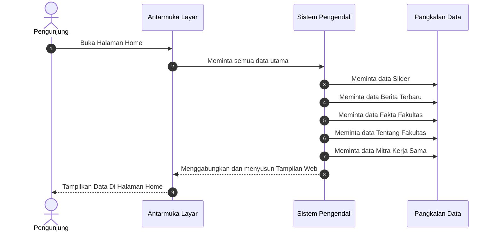

Gambar 2.1.1 di atas menjelaskan alur interaksi saat Pengunjung mengakses Halaman Utama. Sistem melakukan query ke database untuk mendapatkan semua data utama, slider, berita terbaru. Data-data ini kemudian dikirimkan ke tampilan (View) untuk dirender menjadi informasi visual yang informatif bagi Pengunjung.

---

### 2.1.2 Sequence Diagram: Halaman Data Civitas Akademika

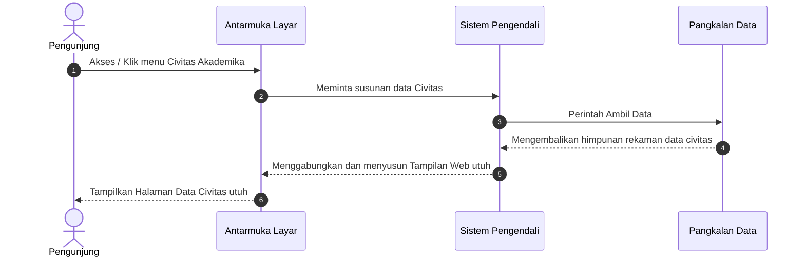

Gambar 2.1.2 di atas menjelaskan alur interaksi saat Pengunjung mengakses Halaman Data Civitas Akademika. Sistem melakukan query ke database untuk mendapatkan data civitas. Data-data ini kemudian dikirimkan ke tampilan (View) untuk dirender menjadi informasi visual yang informatif bagi Pengunjung.

---

### 2.1.3 Sequence Diagram: Halaman Struktur Organisasi

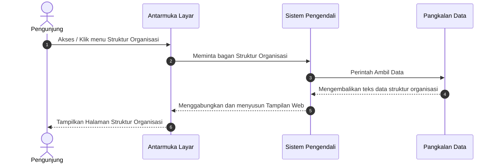

Gambar 2.1.3 di atas menjelaskan alur interaksi saat Pengunjung mengakses Halaman Struktur Organisasi. Sistem melakukan query ke database untuk mendapatkan bagan struktur organisasi. Data-data ini kemudian dikirimkan ke tampilan (View) untuk dirender menjadi informasi visual yang informatif bagi Pengunjung.

---

### 2.1.4 Sequence Diagram: Halaman Tentang Fakultas

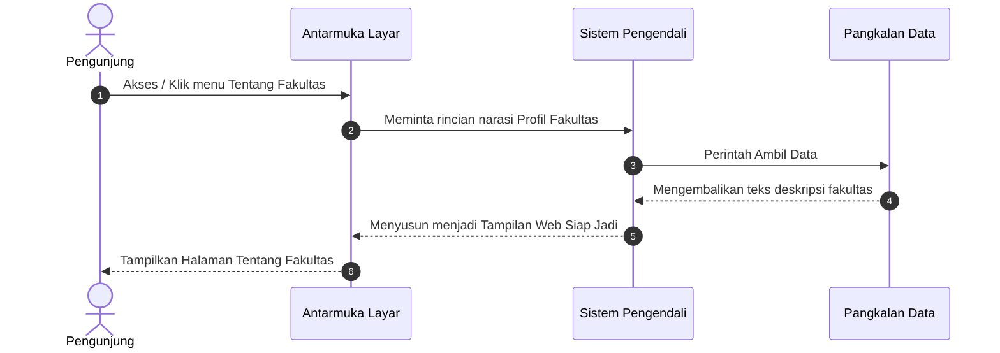

Gambar 2.1.4 di atas menjelaskan alur interaksi saat Pengunjung mengakses Halaman Tentang Fakultas. Sistem melakukan query ke database untuk mendapatkan narasi profil fakultas. Data-data ini kemudian dikirimkan ke tampilan (View) untuk dirender menjadi informasi visual yang informatif bagi Pengunjung.

---

### 2.1.5 Sequence Diagram: Halaman Visi dan Misi

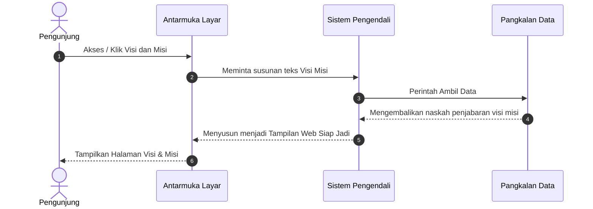

Gambar 2.1.5 di atas menjelaskan alur interaksi saat Pengunjung mengakses Halaman Visi dan Misi. Sistem melakukan query ke database untuk mendapatkan teks visi misi. Data-data ini kemudian dikirimkan ke tampilan (View) untuk dirender menjadi informasi visual yang informatif bagi Pengunjung.

---

### 2.1.6 Sequence Diagram: Halaman Profil Dosen

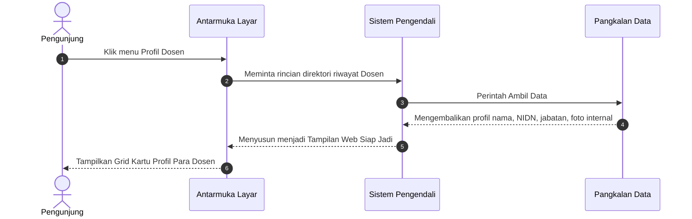

Gambar 2.1.6 di atas menjelaskan alur interaksi saat Pengunjung mengakses Halaman Profil Dosen. Sistem melakukan query ke database untuk mendapatkan direktori riwayat dosen. Data-data ini kemudian dikirimkan ke tampilan (View) untuk dirender menjadi informasi visual yang informatif bagi Pengunjung.

---

### 2.1.7 Sequence Diagram: Halaman Pendaftaran Mahasiswa Baru

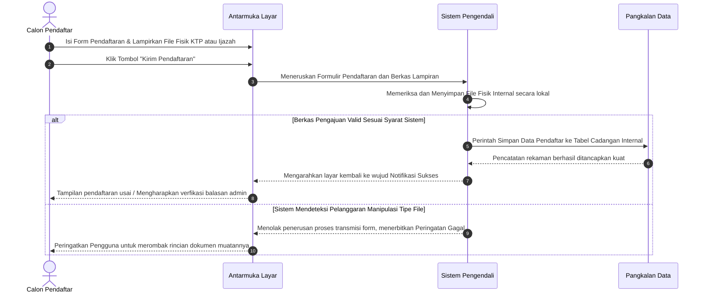

Gambar 2.1.7 di atas menjelaskan alur interaksi saat Calon Pendaftar mendaftar melalui Halaman Pendaftaran Mahasiswa Baru. Sistem memproses formulir pendaftaran dan validasi berkas fisik, menyimpannya secara aman di server, dan mencatat rekamannya ke dalam database. Informasi balasan status kemudian dikirimkan kembali ke tampilan (View) sebagai notifikasi informatif bagi Calon Pendaftar.

---

### 2.1.8 Sequence Diagram: Halaman Program Studi TI (Teknik Informatika)

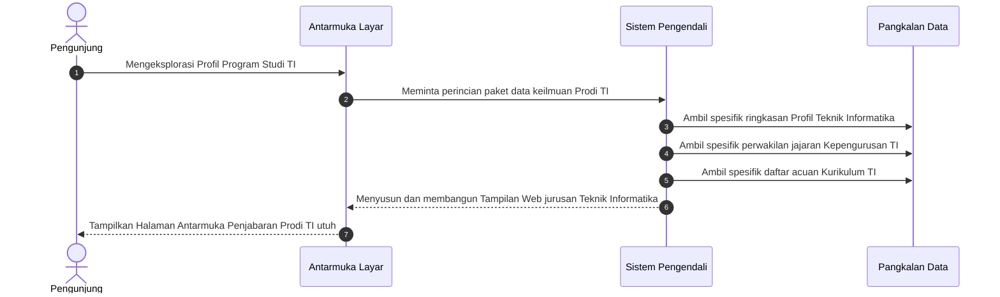

Gambar 2.1.8 di atas menjelaskan alur interaksi saat Pengunjung mengakses Halaman Program Studi TI (Teknik Informatika). Sistem melakukan query ke database untuk mendapatkan perincian paket data keilmuan prodi ti, ringkasan profil teknik informatika, perwakilan jajaran kepengurusan ti. Data-data ini kemudian dikirimkan ke tampilan (View) untuk dirender menjadi informasi visual yang informatif bagi Pengunjung.

---

### 2.1.9 Sequence Diagram: Halaman Program Studi PTI (Pendidikan Teknologi Informasi)

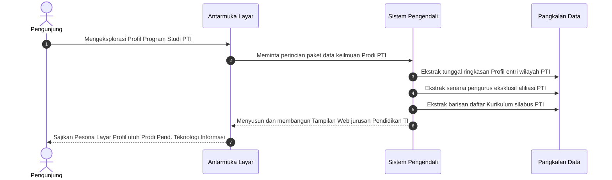

Gambar 2.1.9 di atas menjelaskan alur interaksi saat Pengunjung mengakses Halaman Program Studi PTI (Pendidikan Teknologi Informasi). Sistem melakukan query ke database untuk mendapatkan perincian paket data keilmuan prodi pti, tunggal ringkasan profil entri wilayah pti, senarai pengurus eksklusif afiliasi pti. Data-data ini kemudian dikirimkan ke tampilan (View) untuk dirender menjadi informasi visual yang informatif bagi Pengunjung.

---

### 2.1.10 Sequence Diagram: Halaman Fasilitas Ruangan


Gambar 2.1.10 di atas menjelaskan alur interaksi saat Pengunjung mengakses Halaman Fasilitas Ruangan. Sistem melakukan query ke database untuk mendapatkan inventaris aset daftar ruangan. Data-data ini kemudian dikirimkan ke tampilan (View) untuk dirender menjadi informasi visual yang informatif bagi Pengunjung.

---

### 2.1.11 Sequence Diagram: Halaman Fasilitas Laboratorium

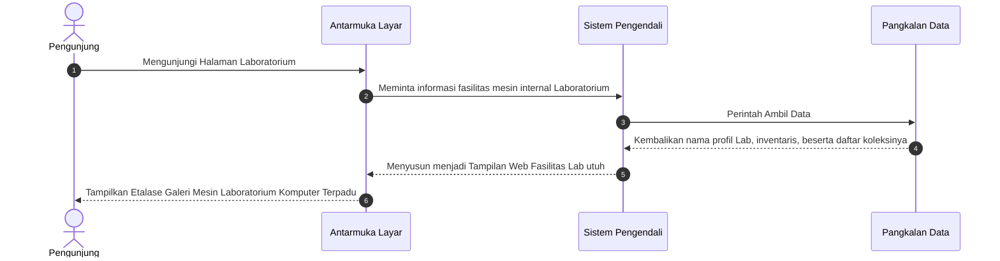

Gambar 2.1.11 di atas menjelaskan alur interaksi saat Pengunjung mengakses Halaman Fasilitas Laboratorium. Sistem melakukan query ke database untuk mendapatkan fasilitas mesin internal laboratorium. Data-data ini kemudian dikirimkan ke tampilan (View) untuk dirender menjadi informasi visual yang informatif bagi Pengunjung.

---

### 2.1.12 Sequence Diagram: Halaman Kalender Akademik

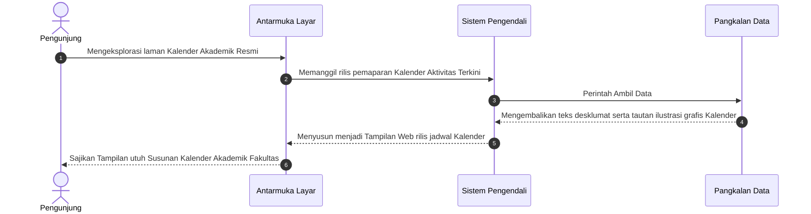

Gambar 2.1.12 di atas menjelaskan alur interaksi saat Pengunjung mengakses Halaman Kalender Akademik. Sistem melakukan query ke database untuk mendapatkan database-->>backend: mengembalikan teks desklumat serta tautan ilustrasi grafis kalender. Data-data ini kemudian dikirimkan ke tampilan (View) untuk dirender menjadi informasi visual yang informatif bagi Pengunjung.

---

### 2.1.13 Sequence Diagram: Halaman Dokumen Kurikulum

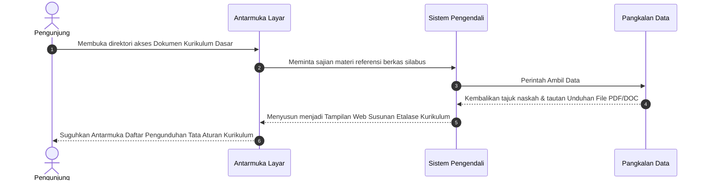

Gambar 2.1.13 di atas menjelaskan alur interaksi saat Pengunjung mengakses Halaman Dokumen Kurikulum. Sistem melakukan query ke database untuk mendapatkan sajian materi referensi berkas silabus. Data-data ini kemudian dikirimkan ke tampilan (View) untuk dirender menjadi informasi visual yang informatif bagi Pengunjung.

---

### 2.1.14 Sequence Diagram: Halaman Dokumen Fakultas

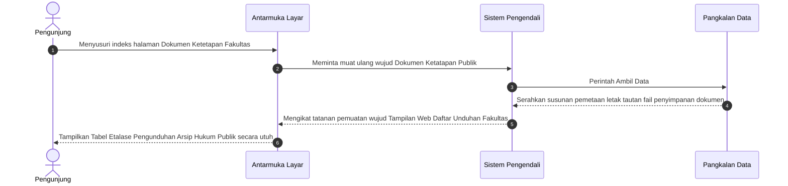

Gambar 2.1.14 di atas menjelaskan alur interaksi saat Pengunjung mengakses Halaman Dokumen Fakultas. Sistem melakukan query ke database untuk mendapatkan muat ulang wujud dokumen ketatapan publik. Data-data ini kemudian dikirimkan ke tampilan (View) untuk dirender menjadi informasi visual yang informatif bagi Pengunjung.

---

### 2.1.15 Sequence Diagram: Halaman Rencana Strategis (Renstra)

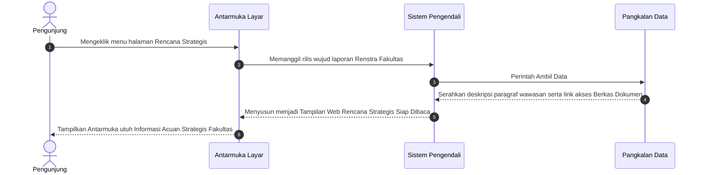

Gambar 2.1.15 di atas menjelaskan alur interaksi saat Pengunjung mengakses Halaman Rencana Strategis (Renstra). Sistem melakukan query ke database untuk mendapatkan database-->>backend: serahkan deskripsi paragraf wawasan serta link akses berkas dokumen. Data-data ini kemudian dikirimkan ke tampilan (View) untuk dirender menjadi informasi visual yang informatif bagi Pengunjung.

---

### 2.1.16 Sequence Diagram: Halaman Standar Operasional Prosedur (SOP)

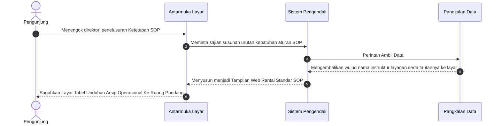

Gambar 2.1.16 di atas menjelaskan alur interaksi saat Pengunjung mengakses Halaman Standar Operasional Prosedur (SOP). Sistem melakukan query ke database untuk mendapatkan sajian susunan urutan kepatuhan aturan sop. Data-data ini kemudian dikirimkan ke tampilan (View) untuk dirender menjadi informasi visual yang informatif bagi Pengunjung.

---

### 2.1.17 Sequence Diagram: Halaman Data Penelitian

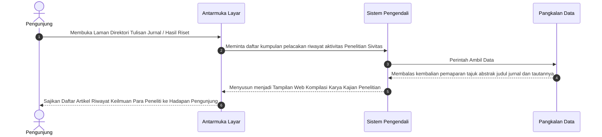

Gambar 2.1.17 di atas menjelaskan alur interaksi saat Pengunjung mengakses Halaman Data Penelitian. Sistem melakukan query ke database untuk mendapatkan daftar kumpulan pelacakan riwayat aktivitas penelitian sivitas. Data-data ini kemudian dikirimkan ke tampilan (View) untuk dirender menjadi informasi visual yang informatif bagi Pengunjung.

---

### 2.1.18 Sequence Diagram: Halaman Data Pengabdian Masyarakat

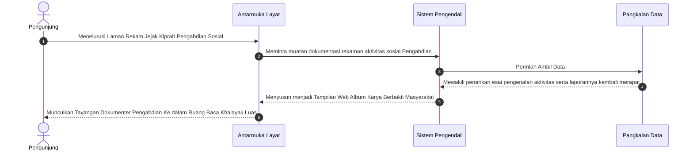

Gambar 2.1.18 di atas menjelaskan alur interaksi saat Pengunjung mengakses Halaman Data Pengabdian Masyarakat. Sistem melakukan query ke database untuk mendapatkan muatan dokumentasi rekaman aktivitas sosial pengabdian. Data-data ini kemudian dikirimkan ke tampilan (View) untuk dirender menjadi informasi visual yang informatif bagi Pengunjung.

---

### 2.1.19 Sequence Diagram: Halaman Profil Organisasi (BEM)

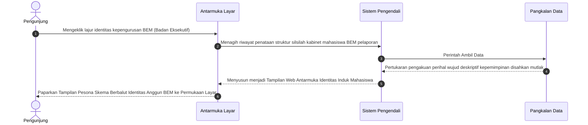

Gambar 2.1.19 di atas menjelaskan alur interaksi saat Pengunjung mengakses Halaman Profil Organisasi (BEM). Sistem melakukan query ke database untuk mendapatkan riwayat penataan struktur silsilah kabinet mahasiswa bem pelaporan. Data-data ini kemudian dikirimkan ke tampilan (View) untuk dirender menjadi informasi visual yang informatif bagi Pengunjung.

---

### 2.1.20 Sequence Diagram: Halaman Unit Kegiatan Mahasiswa (UKM)

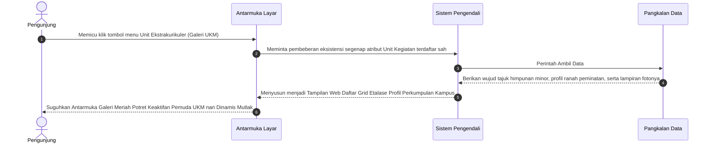

Gambar 2.1.20 di atas menjelaskan alur interaksi saat Pengunjung mengakses Halaman Unit Kegiatan Mahasiswa (UKM). Sistem melakukan query ke database untuk mendapatkan pembeberan eksistensi segenap atribut unit kegiatan terdaftar sah. Data-data ini kemudian dikirimkan ke tampilan (View) untuk dirender menjadi informasi visual yang informatif bagi Pengunjung.

---

### 2.1.21 Sequence Diagram: Halaman Himpunan Mahasiswa

```mermaid
sequenceDiagram
    autonumber
    actor User as Pengunjung
    participant Frontend as Antarmuka Layar
    participant Backend as Sistem Pengendali
    participant Database as Pangkalan Data

    User->>Frontend: Mencari pangkalan letak susunan himpunan otoritatif prodi (Jurusan) eksklusif
    Frontend->>Backend: Meminta pengungkapan tata aturan perwakilan tiap jajaran HIMA di bawah naungan BEM
    
    Backend->>Database: Perintah Ambil Data
    Database-->>Backend: Mewujudkan pertukaran penyerahan tabel Program Kerja spesifik per rumpun perwakilan  
    
    Backend-->>Frontend: Menyusun menjadi Tampilan Web Etalase Kemerincian Susunan Kabinet Cabang Independen
    Frontend-->>User: Paparkan Profil Megah Relasional Aktivis Mahasiswa Pemegang Identitas Perjurusan Prodi
```

Gambar 2.1.21 di atas menjelaskan alur interaksi saat Pengunjung mengakses Halaman Himpunan Mahasiswa. Sistem melakukan query ke database untuk mendapatkan pengungkapan tata aturan perwakilan tiap jajaran hima di bawah naungan bem. Data-data ini kemudian dikirimkan ke tampilan (View) untuk dirender menjadi informasi visual yang informatif bagi Pengunjung.

---

### 2.1.22 Sequence Diagram: Halaman Profil & Tracer Alumni

```mermaid
sequenceDiagram
    autonumber
    actor User as Pengunjung
    participant Frontend as Antarmuka Layar
    participant Backend as Sistem Pengendali
    participant Database as Pangkalan Data

    User->>Frontend: Singgah merunut pelacakan riwayat kelulusan pemuda cendekia (Ruang Pencarian Alumni)
    Frontend->>Backend: Mengajukan penarikan data wujud Direktori Kelulusan serta kiprah sukses riwayat Purna Kampus
    
    Backend->>Database: Perintah Ambil Data
    Database-->>Backend: Hadirkan rentetan kompilasi wawasan data karir penempatan serta rekam masa pelepasan ke tangan server
    
    Backend-->>Frontend: Menyusun menjadi Tampilan Web Riwayat Lintas Waktu para Pemegang Takhta Kesuksesan Belajar 
    Frontend-->>User: Tampilkan Lembar Kebanggaan Perjalanan Waktu Catatan Karier dan Keaktifan Anggota Purna Lulusan Web 
```

Gambar 2.1.22 di atas menjelaskan alur interaksi saat Pengunjung mengakses Halaman Profil & Tracer Alumni. Sistem melakukan query ke database untuk mendapatkan database-->>backend: hadirkan rentetan kompilasi wawasan data karir penempatan serta rekam masa pelepasan ke tangan server. Data-data ini kemudian dikirimkan ke tampilan (View) untuk dirender menjadi informasi visual yang informatif bagi Pengunjung.

---

### 2.2.1 Sequence Diagram: Login Administrator
Admin membuka halaman login, mengisi *Username* dan *Password*, lalu menekan tombol Login. Sistem Pengendali memverifikasi kredensial tersebut ke Pangkalan Data. Jika valid, sistem membuat sesi aktif dan mengarahkan admin ke halaman Dashboard; jika tidak valid, sistem menampilkan pesan kesalahan.

```mermaid
sequenceDiagram
    autonumber
    actor Admin as Admin
    participant Frontend as Antarmuka Layar
    participant Backend as Sistem Pengendali
    participant DB as "Database"

    Admin->>Frontend: Buka halaman login
    Frontend-->>Admin: Tampilkan form login
    
    Admin->>Frontend: Ketik Username & Password, tekan Login
    Frontend->>Backend: Kirim form data (jalur komunikasi aman)
    
    Backend->>DB: Cek kecocokan User/Pass
    DB-->>Backend: Validasi kredensial
    
    alt Login Berhasil
        Backend->>Backend: Set Sesi kunjungan Login Aktif
        Backend-->>Frontend: Redirect ke Dashboard Admin
    else Login Gagal
        Backend-->>Frontend: Tampilkan pesan Error Login
    end
```

---

### 2.2.2 Sequence Diagram: Kelola Slider Beranda
Admin membuka halaman ini dan sistem menampilkan seluruh data slider dalam tabel. Untuk **Tambah/Edit**, admin mengisi formulir (Judul, Subjudul, Foto Slider); sistem memvalidasi berkas, menyimpan foto ke `/uploads/slider` (menghapus foto lama jika Edit), lalu menyimpan data ke Pangkalan Data. Untuk **Hapus**, sistem menghapus file fisik dari server dan rekaman dari Pangkalan Data, kemudian memuat ulang halaman dengan notifikasi sukses.

```mermaid
sequenceDiagram
    autonumber
    actor Admin as Administrator
    participant Frontend as Antarmuka Layar
    participant Backend as Sistem Pengendali
    participant Server as "Storage"
    participant DB as "Database"

    Admin->>Frontend: Buka halaman menu Kelola Slider Beranda
    Frontend->>Backend: Request Halaman & Data
    Backend->>DB: Tarik semua riwayat arsip data
    DB-->>Backend: Return Data
    Backend-->>Frontend: Tampilkan daftar tabel data ke beranda layar

    %% Proses Tambah / Edit
    opt Klik Tombol Tambah / Edit Baris Data
        Admin->>Frontend: Lengkapi isian form & Upload Foto Pemandangan Kampus beranda
        Admin->>Frontend: Konfirmasi persetujuan tombol "Simpan"
        Frontend->>Backend: Kirim input form menuju sistem (jalur komunikasi aman)

        Backend->>Backend: Cek kesesuaian parameter format berkas dan ukurannya
        
        alt Jika klasifikasi parameter file Valid / Benar
            opt Jika tedapat lampiran berkas baru yang diunggah
                Backend->>Server: Simpan fisik file masuk ke folder peladen uploads/slider
                opt Jika menimpa data warisan usang pengeditan
                    Backend->>Server: Hapus permanen file peninggalan lawas
                end
            end
            
            Backend->>DB: Sisipkan detail baris isian ketikan teks & integrasikan link lokasinya ke Pangkalan Data
            DB-->>Backend: Peladen menyematkan pertanda konfirmasi data terekam permanen
            Backend-->>Frontend: Dialihkan kembali ke tabel dibarengi rilis Menampilkan Konfirmasi Pesan Sukses
        else Terdeteksi Format File Salah / Skala Muatan Overload Besar
            Backend-->>Frontend: Singkirkan lalu buang permohonan bersisian peringatan Error
        end
    end

    %% Proses Hapus
    opt Klik Ikon / Tombol Hapus pada Baris
        Admin->>Frontend: Sentuh pengajuan pembasmian mutlak baris rekaman spesifik
        Frontend->>Backend: Eksekusi sanksi lemparan pembersihan mendesak pangkalan perampingan
        Backend->>DB: Lacak letak kedudukan koordinat alamat letak nama spesifik file 
        Backend->>Server: Congkel hancurkan secara fisis fail bawaan eksisting di laci wadah uploads/slider
        Backend->>DB: Runtuhkan catatan nama jejak spesifik itu terbakar bersih melenggang jauh dari Pangkalan Data
        DB-->>Backend: Penarikan silsilah daftar terhapuskan mutakhir dipastikan tersingkir
        Backend-->>Frontend: Melemparkan pengawal administrasi memuat rupa jernih diiringi Papan Pemberitahuan Lapor Sukses 
    end
```

---

### 2.2.3 Sequence Diagram: Kelola Berita
Admin membuka halaman ini dan sistem menampilkan seluruh data berita dalam tabel. Untuk **Tambah/Edit**, admin mengisi formulir (Judul, Konten, Foto Sampul); sistem memvalidasi berkas, menyimpan foto ke `/uploads/` (menghapus foto lama jika Edit), lalu menyimpan data ke Pangkalan Data. Untuk **Hapus**, sistem menghapus file foto dari server dan rekaman dari Pangkalan Data, kemudian memuat ulang halaman dengan notifikasi sukses.

```mermaid
sequenceDiagram
    autonumber
    actor Admin as Administrator
    participant Frontend as Antarmuka Layar
    participant Backend as Sistem Pengendali
    participant Server as "Storage"
    participant DB as "Database"

    Admin->>Frontend: Buka halaman menu Kelola Berita
    Frontend->>Backend: Request Halaman & Data
    Backend->>DB: Tarik semua riwayat arsip data
    DB-->>Backend: Return Data
    Backend-->>Frontend: Tampilkan daftar tabel data ke beranda layar

    %% Proses Tambah / Edit
    opt Klik Tombol Tambah / Edit Baris Data
        Admin->>Frontend: Lengkapi isian form & Upload Foto Sampul
        Admin->>Frontend: Konfirmasi persetujuan tombol "Simpan"
        Frontend->>Backend: Kirim input form menuju sistem (jalur komunikasi aman)

        Backend->>Backend: Cek kesesuaian parameter format berkas dan ukurannya
        
        alt Jika klasifikasi parameter file Valid / Benar
            opt Jika tedapat lampiran berkas baru yang diunggah
                Backend->>Server: Simpan fisik file masuk ke folder peladen uploads/
                opt Jika menimpa data warisan usang pengeditan
                    Backend->>Server: Hapus permanen file peninggalan lawas
                end
            end
            
            Backend->>DB: Sisipkan detail baris isian ketikan teks & integrasikan link lokasinya ke Pangkalan Data
            DB-->>Backend: Peladen menyematkan pertanda konfirmasi data terekam permanen
            Backend-->>Frontend: Dialihkan kembali ke tabel dibarengi rilis Menampilkan Konfirmasi Pesan Sukses
        else Terdeteksi Format File Salah / Skala Muatan Overload Besar
            Backend-->>Frontend: Singkirkan lalu buang permohonan bersisian peringatan Error
        end
    end

    %% Proses Hapus
    opt Klik Ikon / Tombol Hapus pada Baris
        Admin->>Frontend: Sentuh pengajuan pembasmian mutlak baris rekaman spesifik
        Frontend->>Backend: Eksekusi sanksi lemparan pembersihan mendesak pangkalan perampingan
        Backend->>DB: Lacak letak kedudukan koordinat alamat letak nama spesifik file 
        Backend->>Server: Congkel hancurkan secara fisis fail bawaan eksisting di laci wadah uploads/
        Backend->>DB: Runtuhkan catatan nama jejak spesifik itu terbakar bersih melenggang jauh dari Pangkalan Data
        DB-->>Backend: Penarikan silsilah daftar terhapuskan mutakhir dipastikan tersingkir
        Backend-->>Frontend: Melemparkan pengawal administrasi memuat rupa jernih diiringi Papan Pemberitahuan Lapor Sukses 
    end
```

---

### 2.2.4 Sequence Diagram: Kelola Dosen
Admin membuka halaman ini dan sistem menampilkan seluruh data dosen dalam tabel. Untuk **Tambah/Edit**, admin mengisi formulir (Nama, NIDN, Jabatan, Foto Profil); sistem memvalidasi berkas, menyimpan foto ke `/uploads/dosen` (menghapus foto lama jika Edit), lalu menyimpan data ke Pangkalan Data. Untuk **Hapus**, sistem menghapus file foto dari server dan rekaman dari Pangkalan Data, kemudian memuat ulang halaman dengan notifikasi sukses.

```mermaid
sequenceDiagram
    autonumber
    actor Admin as Administrator
    participant Frontend as Antarmuka Layar
    participant Backend as Sistem Pengendali
    participant Server as "Storage"
    participant DB as "Database"

    Admin->>Frontend: Buka halaman menu Kelola Dosen
    Frontend->>Backend: Request Halaman & Data
    Backend->>DB: Tarik semua riwayat arsip data
    DB-->>Backend: Return Data
    Backend-->>Frontend: Tampilkan daftar tabel data ke beranda layar

    %% Proses Tambah / Edit
    opt Klik Tombol Tambah / Edit Baris Data
        Admin->>Frontend: Lengkapi isian form & Upload Foto Profil
        Admin->>Frontend: Konfirmasi persetujuan tombol "Simpan"
        Frontend->>Backend: Kirim input form menuju sistem (jalur komunikasi aman)

        Backend->>Backend: Cek kesesuaian parameter format berkas dan ukurannya
        
        alt Jika klasifikasi parameter file Valid / Benar
            opt Jika tedapat lampiran berkas baru yang diunggah
                Backend->>Server: Simpan fisik file masuk ke folder peladen uploads/dosen
                opt Jika menimpa data warisan usang pengeditan
                    Backend->>Server: Hapus permanen file peninggalan lawas
                end
            end
            
            Backend->>DB: Sisipkan detail baris isian ketikan teks & integrasikan link lokasinya ke Pangkalan Data
            DB-->>Backend: Peladen menyematkan pertanda konfirmasi data terekam permanen
            Backend-->>Frontend: Dialihkan kembali ke tabel dibarengi rilis Menampilkan Konfirmasi Pesan Sukses
        else Terdeteksi Format File Salah / Skala Muatan Overload Besar
            Backend-->>Frontend: Singkirkan lalu buang permohonan bersisian peringatan Error
        end
    end

    %% Proses Hapus
    opt Klik Ikon / Tombol Hapus pada Baris
        Admin->>Frontend: Sentuh pengajuan pembasmian mutlak baris rekaman spesifik
        Frontend->>Backend: Eksekusi sanksi lemparan pembersihan mendesak pangkalan perampingan
        Backend->>DB: Lacak letak kedudukan koordinat alamat letak nama spesifik file 
        Backend->>Server: Congkel hancurkan secara fisis fail bawaan eksisting di laci wadah uploads/dosen
        Backend->>DB: Runtuhkan catatan nama jejak spesifik itu terbakar bersih melenggang jauh dari Pangkalan Data
        DB-->>Backend: Penarikan silsilah daftar terhapuskan mutakhir dipastikan tersingkir
        Backend-->>Frontend: Melemparkan pengawal administrasi memuat rupa jernih diiringi Papan Pemberitahuan Lapor Sukses 
    end
```

---

### 2.2.5 Sequence Diagram: Kelola Fasilitas Ruangan
Admin membuka halaman ini dan sistem menampilkan seluruh data ruangan dalam tabel. Untuk **Tambah/Edit**, admin mengisi formulir (Nama Ruang, Kapasitas, Fasilitas, Foto Kelas); sistem memvalidasi berkas, menyimpan foto ke `/uploads/ruangan` (menghapus foto lama jika Edit), lalu menyimpan data ke Pangkalan Data. Untuk **Hapus**, sistem menghapus file foto dari server dan rekaman dari Pangkalan Data, kemudian memuat ulang halaman dengan notifikasi sukses.

```mermaid
sequenceDiagram
    autonumber
    actor Admin as Administrator
    participant Frontend as Antarmuka Layar
    participant Backend as Sistem Pengendali
    participant Server as "Storage"
    participant DB as "Database"

    Admin->>Frontend: Buka halaman menu Kelola Fasilitas Ruangan
    Frontend->>Backend: Request Halaman & Data
    Backend->>DB: Tarik semua riwayat arsip data
    DB-->>Backend: Return Data
    Backend-->>Frontend: Tampilkan daftar tabel data ke beranda layar

    %% Proses Tambah / Edit
    opt Klik Tombol Tambah / Edit Baris Data
        Admin->>Frontend: Lengkapi isian form & Upload Foto Kelas/Ruangan
        Admin->>Frontend: Konfirmasi persetujuan tombol "Simpan"
        Frontend->>Backend: Kirim input form menuju sistem (jalur komunikasi aman)

        Backend->>Backend: Cek kesesuaian parameter format berkas dan ukurannya
        
        alt Jika klasifikasi parameter file Valid / Benar
            opt Jika tedapat lampiran berkas baru yang diunggah
                Backend->>Server: Simpan fisik file masuk ke folder peladen uploads/ruangan
                opt Jika menimpa data warisan usang pengeditan
                    Backend->>Server: Hapus permanen file peninggalan lawas
                end
            end
            
            Backend->>DB: Sisipkan detail baris isian ketikan teks & integrasikan link lokasinya ke Pangkalan Data
            DB-->>Backend: Peladen menyematkan pertanda konfirmasi data terekam permanen
            Backend-->>Frontend: Dialihkan kembali ke tabel dibarengi rilis Menampilkan Konfirmasi Pesan Sukses
        else Terdeteksi Format File Salah / Skala Muatan Overload Besar
            Backend-->>Frontend: Singkirkan lalu buang permohonan bersisian peringatan Error
        end
    end

    %% Proses Hapus
    opt Klik Ikon / Tombol Hapus pada Baris
        Admin->>Frontend: Sentuh pengajuan pembasmian mutlak baris rekaman spesifik
        Frontend->>Backend: Eksekusi sanksi lemparan pembersihan mendesak pangkalan perampingan
        Backend->>DB: Lacak letak kedudukan koordinat alamat letak nama spesifik file 
        Backend->>Server: Congkel hancurkan secara fisis fail bawaan eksisting di laci wadah uploads/ruangan
        Backend->>DB: Runtuhkan catatan nama jejak spesifik itu terbakar bersih melenggang jauh dari Pangkalan Data
        DB-->>Backend: Penarikan silsilah daftar terhapuskan mutakhir dipastikan tersingkir
        Backend-->>Frontend: Melemparkan pengawal administrasi memuat rupa jernih diiringi Papan Pemberitahuan Lapor Sukses 
    end
```

---

### 2.2.6 Sequence Diagram: Kelola Fasilitas Laboratorium
Admin membuka halaman ini dan sistem menampilkan seluruh data laboratorium dalam tabel. Untuk **Tambah/Edit**, admin mengisi formulir (Nama Lab, Inventaris, Foto Lab); sistem memvalidasi berkas, menyimpan foto ke `/uploads/laboratorium` (menghapus foto lama jika Edit), lalu menyimpan data ke Pangkalan Data. Untuk **Hapus**, sistem menghapus file foto dari server dan rekaman dari Pangkalan Data, kemudian memuat ulang halaman dengan notifikasi sukses.

```mermaid
sequenceDiagram
    autonumber
    actor Admin as Administrator
    participant Frontend as Antarmuka Layar
    participant Backend as Sistem Pengendali
    participant Server as "Storage"
    participant DB as "Database"

    Admin->>Frontend: Buka halaman menu Kelola Fasilitas Laboratorium
    Frontend->>Backend: Request Halaman & Data
    Backend->>DB: Tarik semua riwayat arsip data
    DB-->>Backend: Return Data
    Backend-->>Frontend: Tampilkan daftar tabel data ke beranda layar

    %% Proses Tambah / Edit
    opt Klik Tombol Tambah / Edit Baris Data
        Admin->>Frontend: Lengkapi isian form & Upload Foto Laboratorium
        Admin->>Frontend: Konfirmasi persetujuan tombol "Simpan"
        Frontend->>Backend: Kirim input form menuju sistem (jalur komunikasi aman)

        Backend->>Backend: Cek kesesuaian parameter format berkas dan ukurannya
        
        alt Jika klasifikasi parameter file Valid / Benar
            opt Jika tedapat lampiran berkas baru yang diunggah
                Backend->>Server: Simpan fisik file masuk ke folder peladen uploads/laboratorium
                opt Jika menimpa data warisan usang pengeditan
                    Backend->>Server: Hapus permanen file peninggalan lawas
                end
            end
            
            Backend->>DB: Sisipkan detail baris isian ketikan teks & integrasikan link lokasinya ke Pangkalan Data
            DB-->>Backend: Peladen menyematkan pertanda konfirmasi data terekam permanen
            Backend-->>Frontend: Dialihkan kembali ke tabel dibarengi rilis Menampilkan Konfirmasi Pesan Sukses
        else Terdeteksi Format File Salah / Skala Muatan Overload Besar
            Backend-->>Frontend: Singkirkan lalu buang permohonan bersisian peringatan Error
        end
    end

    %% Proses Hapus
    opt Klik Ikon / Tombol Hapus pada Baris
        Admin->>Frontend: Sentuh pengajuan pembasmian mutlak baris rekaman spesifik
        Frontend->>Backend: Eksekusi sanksi lemparan pembersihan mendesak pangkalan perampingan
        Backend->>DB: Lacak letak kedudukan koordinat alamat letak nama spesifik file 
        Backend->>Server: Congkel hancurkan secara fisis fail bawaan eksisting di laci wadah uploads/laboratorium
        Backend->>DB: Runtuhkan catatan nama jejak spesifik itu terbakar bersih melenggang jauh dari Pangkalan Data
        DB-->>Backend: Penarikan silsilah daftar terhapuskan mutakhir dipastikan tersingkir
        Backend-->>Frontend: Melemparkan pengawal administrasi memuat rupa jernih diiringi Papan Pemberitahuan Lapor Sukses 
    end
```

---

### 2.2.7 Sequence Diagram: Kelola Kalender Akademik
Admin membuka halaman ini dan sistem menampilkan seluruh data kalender dalam tabel. Untuk **Tambah/Edit**, admin mengisi formulir (Tahun Akademik, Deskripsi, Gambar Kalender); sistem memvalidasi berkas, menyimpan gambar ke `/uploads/kalender` (menghapus gambar lama jika Edit), lalu menyimpan data ke Pangkalan Data. Untuk **Hapus**, sistem menghapus file gambar dari server dan rekaman dari Pangkalan Data, kemudian memuat ulang halaman dengan notifikasi sukses.

```mermaid
sequenceDiagram
    autonumber
    actor Admin as Administrator
    participant Frontend as Antarmuka Layar
    participant Backend as Sistem Pengendali
    participant Server as "Storage"
    participant DB as "Database"

    Admin->>Frontend: Buka halaman menu Kelola Kalender Akademik
    Frontend->>Backend: Request Halaman & Data
    Backend->>DB: Tarik semua riwayat arsip data
    DB-->>Backend: Return Data
    Backend-->>Frontend: Tampilkan daftar tabel data ke beranda layar

    %% Proses Tambah / Edit
    opt Klik Tombol Tambah / Edit Baris Data
        Admin->>Frontend: Lengkapi isian form & Upload Gambar Kalender
        Admin->>Frontend: Konfirmasi persetujuan tombol "Simpan"
        Frontend->>Backend: Kirim input form menuju sistem (jalur komunikasi aman)

        Backend->>Backend: Cek kesesuaian parameter format berkas dan ukurannya
        
        alt Jika klasifikasi parameter file Valid / Benar
            opt Jika tedapat lampiran berkas baru yang diunggah
                Backend->>Server: Simpan fisik file masuk ke folder peladen uploads/kalender
                opt Jika menimpa data warisan usang pengeditan
                    Backend->>Server: Hapus permanen file peninggalan lawas
                end
            end
            
            Backend->>DB: Sisipkan detail baris isian ketikan teks & integrasikan link lokasinya ke Pangkalan Data
            DB-->>Backend: Peladen menyematkan pertanda konfirmasi data terekam permanen
            Backend-->>Frontend: Dialihkan kembali ke tabel dibarengi rilis Menampilkan Konfirmasi Pesan Sukses
        else Terdeteksi Format File Salah / Skala Muatan Overload Besar
            Backend-->>Frontend: Singkirkan lalu buang permohonan bersisian peringatan Error
        end
    end

    %% Proses Hapus
    opt Klik Ikon / Tombol Hapus pada Baris
        Admin->>Frontend: Sentuh pengajuan pembasmian mutlak baris rekaman spesifik
        Frontend->>Backend: Eksekusi sanksi lemparan pembersihan mendesak pangkalan perampingan
        Backend->>DB: Lacak letak kedudukan koordinat alamat letak nama spesifik file 
        Backend->>Server: Congkel hancurkan secara fisis fail bawaan eksisting di laci wadah uploads/kalender
        Backend->>DB: Runtuhkan catatan nama jejak spesifik itu terbakar bersih melenggang jauh dari Pangkalan Data
        DB-->>Backend: Penarikan silsilah daftar terhapuskan mutakhir dipastikan tersingkir
        Backend-->>Frontend: Melemparkan pengawal administrasi memuat rupa jernih diiringi Papan Pemberitahuan Lapor Sukses 
    end
```

---

### 2.2.8 Sequence Diagram: Kelola Dokumen Kurikulum
Admin membuka halaman ini dan sistem menampilkan seluruh data kurikulum dalam tabel. Untuk **Tambah/Edit**, admin mengisi formulir (Judul, Deskripsi, Dokumen PDF); sistem memvalidasi berkas, menyimpan dokumen ke `/docs/kurikulum` (menghapus file lama jika Edit), lalu menyimpan data ke Pangkalan Data. Untuk **Hapus**, sistem menghapus file dokumen dari server dan rekaman dari Pangkalan Data, kemudian memuat ulang halaman dengan notifikasi sukses.

```mermaid
sequenceDiagram
    autonumber
    actor Admin as Administrator
    participant Frontend as Antarmuka Layar
    participant Backend as Sistem Pengendali
    participant Server as "Storage"
    participant DB as "Database"

    Admin->>Frontend: Buka halaman menu Kelola Dokumen Kurikulum
    Frontend->>Backend: Request Halaman & Data
    Backend->>DB: Tarik semua riwayat arsip data
    DB-->>Backend: Return Data
    Backend-->>Frontend: Tampilkan daftar tabel data ke beranda layar

    %% Proses Tambah / Edit
    opt Klik Tombol Tambah / Edit Baris Data
        Admin->>Frontend: Lengkapi isian form & Upload Dokumen Asli
        Admin->>Frontend: Konfirmasi persetujuan tombol "Simpan"
        Frontend->>Backend: Kirim input form menuju sistem (jalur komunikasi aman)

        Backend->>Backend: Cek kesesuaian parameter format berkas dan ukurannya
        
        alt Jika klasifikasi parameter file Valid / Benar
            opt Jika tedapat lampiran berkas baru yang diunggah
                Backend->>Server: Simpan fisik file masuk ke folder peladen docs/kurikulum
                opt Jika menimpa data warisan usang pengeditan
                    Backend->>Server: Hapus permanen file peninggalan lawas
                end
            end
            
            Backend->>DB: Sisipkan detail baris isian ketikan teks & integrasikan link lokasinya ke Pangkalan Data
            DB-->>Backend: Peladen menyematkan pertanda konfirmasi data terekam permanen
            Backend-->>Frontend: Dialihkan kembali ke tabel dibarengi rilis Menampilkan Konfirmasi Pesan Sukses
        else Terdeteksi Format File Salah / Skala Muatan Overload Besar
            Backend-->>Frontend: Singkirkan lalu buang permohonan bersisian peringatan Error
        end
    end

    %% Proses Hapus
    opt Klik Ikon / Tombol Hapus pada Baris
        Admin->>Frontend: Sentuh pengajuan pembasmian mutlak baris rekaman spesifik
        Frontend->>Backend: Eksekusi sanksi lemparan pembersihan mendesak pangkalan perampingan
        Backend->>DB: Lacak letak kedudukan koordinat alamat letak nama spesifik file 
        Backend->>Server: Congkel hancurkan secara fisis fail bawaan eksisting di laci wadah docs/kurikulum
        Backend->>DB: Runtuhkan catatan nama jejak spesifik itu terbakar bersih melenggang jauh dari Pangkalan Data
        DB-->>Backend: Penarikan silsilah daftar terhapuskan mutakhir dipastikan tersingkir
        Backend-->>Frontend: Melemparkan pengawal administrasi memuat rupa jernih diiringi Papan Pemberitahuan Lapor Sukses 
    end
```

---

### 2.2.9 Sequence Diagram: Kelola Mitra Kerjasama
Admin membuka halaman ini dan sistem menampilkan seluruh data mitra dalam tabel. Untuk **Tambah/Edit**, admin mengisi formulir (Nama Mitra, Deskripsi MoU, Logo); sistem memvalidasi berkas, menyimpan logo ke `/uploads/kerjasama` (menghapus file lama jika Edit), lalu menyimpan data ke Pangkalan Data. Untuk **Hapus**, sistem menghapus file logo dari server dan rekaman dari Pangkalan Data, kemudian memuat ulang halaman dengan notifikasi sukses.

```mermaid
sequenceDiagram
    autonumber
    actor Admin as Administrator
    participant Frontend as Antarmuka Layar
    participant Backend as Sistem Pengendali
    participant Server as "Storage"
    participant DB as "Database"

    Admin->>Frontend: Buka halaman menu Kelola Mitra Kerjasama
    Frontend->>Backend: Request Halaman & Data
    Backend->>DB: Tarik semua riwayat arsip data
    DB-->>Backend: Return Data
    Backend-->>Frontend: Tampilkan daftar tabel data ke beranda layar

    %% Proses Tambah / Edit
    opt Klik Tombol Tambah / Edit Baris Data
        Admin->>Frontend: Lengkapi isian form & Upload Logo Kemitraan
        Admin->>Frontend: Konfirmasi persetujuan tombol "Simpan"
        Frontend->>Backend: Kirim input form menuju sistem (jalur komunikasi aman)

        Backend->>Backend: Cek kesesuaian parameter format berkas dan ukurannya
        
        alt Jika klasifikasi parameter file Valid / Benar
            opt Jika tedapat lampiran berkas baru yang diunggah
                Backend->>Server: Simpan fisik file masuk ke folder peladen uploads/kerjasama
                opt Jika menimpa data warisan usang pengeditan
                    Backend->>Server: Hapus permanen file peninggalan lawas
                end
            end
            
            Backend->>DB: Sisipkan detail baris isian ketikan teks & integrasikan link lokasinya ke Pangkalan Data
            DB-->>Backend: Peladen menyematkan pertanda konfirmasi data terekam permanen
            Backend-->>Frontend: Dialihkan kembali ke tabel dibarengi rilis Menampilkan Konfirmasi Pesan Sukses
        else Terdeteksi Format File Salah / Skala Muatan Overload Besar
            Backend-->>Frontend: Singkirkan lalu buang permohonan bersisian peringatan Error
        end
    end

    %% Proses Hapus
    opt Klik Ikon / Tombol Hapus pada Baris
        Admin->>Frontend: Sentuh pengajuan pembasmian mutlak baris rekaman spesifik
        Frontend->>Backend: Eksekusi sanksi lemparan pembersihan mendesak pangkalan perampingan
        Backend->>DB: Lacak letak kedudukan koordinat alamat letak nama spesifik file 
        Backend->>Server: Congkel hancurkan secara fisis fail bawaan eksisting di laci wadah uploads/kerjasama
        Backend->>DB: Runtuhkan catatan nama jejak spesifik itu terbakar bersih melenggang jauh dari Pangkalan Data
        DB-->>Backend: Penarikan silsilah daftar terhapuskan mutakhir dipastikan tersingkir
        Backend-->>Frontend: Melemparkan pengawal administrasi memuat rupa jernih diiringi Papan Pemberitahuan Lapor Sukses 
    end
```

---

### 2.2.10 Sequence Diagram: Kelola Data Penelitian
Admin membuka halaman ini dan sistem menampilkan seluruh data penelitian dalam tabel. Untuk **Tambah/Edit**, admin mengisi formulir (Judul Riset, Abstrak, Dokumen Publikasi); sistem memvalidasi berkas, menyimpan dokumen ke `/docs/penelitian` (menghapus file lama jika Edit), lalu menyimpan data ke Pangkalan Data. Untuk **Hapus**, sistem menghapus file dokumen dari server dan rekaman dari Pangkalan Data, kemudian memuat ulang halaman dengan notifikasi sukses.

```mermaid
sequenceDiagram
    autonumber
    actor Admin as Administrator
    participant Frontend as Antarmuka Layar
    participant Backend as Sistem Pengendali
    participant Server as "Storage"
    participant DB as "Database"

    Admin->>Frontend: Buka halaman menu Kelola Data Penelitian
    Frontend->>Backend: Request Halaman & Data
    Backend->>DB: Tarik semua riwayat arsip data
    DB-->>Backend: Return Data
    Backend-->>Frontend: Tampilkan daftar tabel data ke beranda layar

    %% Proses Tambah / Edit
    opt Klik Tombol Tambah / Edit Baris Data
        Admin->>Frontend: Lengkapi isian form & Upload Dokumen Laporan Publikasi
        Admin->>Frontend: Konfirmasi persetujuan tombol "Simpan"
        Frontend->>Backend: Kirim input form menuju sistem (jalur komunikasi aman)

        Backend->>Backend: Cek kesesuaian parameter format berkas dan ukurannya
        
        alt Jika klasifikasi parameter file Valid / Benar
            opt Jika tedapat lampiran berkas baru yang diunggah
                Backend->>Server: Simpan fisik file masuk ke folder peladen docs/penelitian
                opt Jika menimpa data warisan usang pengeditan
                    Backend->>Server: Hapus permanen file peninggalan lawas
                end
            end
            
            Backend->>DB: Sisipkan detail baris isian ketikan teks & integrasikan link lokasinya ke Pangkalan Data
            DB-->>Backend: Peladen menyematkan pertanda konfirmasi data terekam permanen
            Backend-->>Frontend: Dialihkan kembali ke tabel dibarengi rilis Menampilkan Konfirmasi Pesan Sukses
        else Terdeteksi Format File Salah / Skala Muatan Overload Besar
            Backend-->>Frontend: Singkirkan lalu buang permohonan bersisian peringatan Error
        end
    end

    %% Proses Hapus
    opt Klik Ikon / Tombol Hapus pada Baris
        Admin->>Frontend: Sentuh pengajuan pembasmian mutlak baris rekaman spesifik
        Frontend->>Backend: Eksekusi sanksi lemparan pembersihan mendesak pangkalan perampingan
        Backend->>DB: Lacak letak kedudukan koordinat alamat letak nama spesifik file 
        Backend->>Server: Congkel hancurkan secara fisis fail bawaan eksisting di laci wadah docs/penelitian
        Backend->>DB: Runtuhkan catatan nama jejak spesifik itu terbakar bersih melenggang jauh dari Pangkalan Data
        DB-->>Backend: Penarikan silsilah daftar terhapuskan mutakhir dipastikan tersingkir
        Backend-->>Frontend: Melemparkan pengawal administrasi memuat rupa jernih diiringi Papan Pemberitahuan Lapor Sukses 
    end
```

---

### 2.2.11 Sequence Diagram: Kelola Data Pengabdian
Admin membuka halaman ini dan sistem menampilkan seluruh data pengabdian dalam tabel. Untuk **Tambah/Edit**, admin mengisi formulir (Judul Kegiatan, Ringkasan, Laporan Dokumentasi); sistem memvalidasi berkas, menyimpan file ke `/docs/pengabdian` (menghapus file lama jika Edit), lalu menyimpan data ke Pangkalan Data. Untuk **Hapus**, sistem menghapus file laporan dari server dan rekaman dari Pangkalan Data, kemudian memuat ulang halaman dengan notifikasi sukses.

```mermaid
sequenceDiagram
    autonumber
    actor Admin as Administrator
    participant Frontend as Antarmuka Layar
    participant Backend as Sistem Pengendali
    participant Server as "Storage"
    participant DB as "Database"

    Admin->>Frontend: Buka halaman menu Kelola Data Pengabdian
    Frontend->>Backend: Request Halaman & Data
    Backend->>DB: Tarik semua riwayat arsip data
    DB-->>Backend: Return Data
    Backend-->>Frontend: Tampilkan daftar tabel data ke beranda layar

    %% Proses Tambah / Edit
    opt Klik Tombol Tambah / Edit Baris Data
        Admin->>Frontend: Lengkapi isian form & Upload Laporan Dokumentasi
        Admin->>Frontend: Konfirmasi persetujuan tombol "Simpan"
        Frontend->>Backend: Kirim input form menuju sistem (jalur komunikasi aman)

        Backend->>Backend: Cek kesesuaian parameter format berkas dan ukurannya
        
        alt Jika klasifikasi parameter file Valid / Benar
            opt Jika tedapat lampiran berkas baru yang diunggah
                Backend->>Server: Simpan fisik file masuk ke folder peladen docs/pengabdian
                opt Jika menimpa data warisan usang pengeditan
                    Backend->>Server: Hapus permanen file peninggalan lawas
                end
            end
            
            Backend->>DB: Sisipkan detail baris isian ketikan teks & integrasikan link lokasinya ke Pangkalan Data
            DB-->>Backend: Peladen menyematkan pertanda konfirmasi data terekam permanen
            Backend-->>Frontend: Dialihkan kembali ke tabel dibarengi rilis Menampilkan Konfirmasi Pesan Sukses
        else Terdeteksi Format File Salah / Skala Muatan Overload Besar
            Backend-->>Frontend: Singkirkan lalu buang permohonan bersisian peringatan Error
        end
    end

    %% Proses Hapus
    opt Klik Ikon / Tombol Hapus pada Baris
        Admin->>Frontend: Sentuh pengajuan pembasmian mutlak baris rekaman spesifik
        Frontend->>Backend: Eksekusi sanksi lemparan pembersihan mendesak pangkalan perampingan
        Backend->>DB: Lacak letak kedudukan koordinat alamat letak nama spesifik file 
        Backend->>Server: Congkel hancurkan secara fisis fail bawaan eksisting di laci wadah docs/pengabdian
        Backend->>DB: Runtuhkan catatan nama jejak spesifik itu terbakar bersih melenggang jauh dari Pangkalan Data
        DB-->>Backend: Penarikan silsilah daftar terhapuskan mutakhir dipastikan tersingkir
        Backend-->>Frontend: Melemparkan pengawal administrasi memuat rupa jernih diiringi Papan Pemberitahuan Lapor Sukses 
    end
```

---

### 2.2.12 Sequence Diagram: Kelola Dokumen Fakultas
Admin membuka halaman ini dan sistem menampilkan seluruh data dokumen dalam tabel. Untuk **Tambah/Edit**, admin mengisi formulir (Judul, Deskripsi, Dokumen Publikasi); sistem memvalidasi berkas, menyimpan file ke `/docs/fakultas` (menghapus file lama jika Edit), lalu menyimpan data ke Pangkalan Data. Untuk **Hapus**, sistem menghapus file dari server dan rekaman dari Pangkalan Data, kemudian memuat ulang halaman dengan notifikasi sukses.

```mermaid
sequenceDiagram
    autonumber
    actor Admin as Administrator
    participant Frontend as Antarmuka Layar
    participant Backend as Sistem Pengendali
    participant Server as "Storage"
    participant DB as "Database"

    Admin->>Frontend: Buka halaman menu Kelola Dokumen Fakultas
    Frontend->>Backend: Request Halaman & Data
    Backend->>DB: Tarik semua riwayat arsip data
    DB-->>Backend: Return Data
    Backend-->>Frontend: Tampilkan daftar tabel data ke beranda layar

    %% Proses Tambah / Edit
    opt Klik Tombol Tambah / Edit Baris Data
        Admin->>Frontend: Lengkapi isian form & Upload Dokumen Publikasi
        Admin->>Frontend: Konfirmasi persetujuan tombol "Simpan"
        Frontend->>Backend: Kirim input form menuju sistem (jalur komunikasi aman)

        Backend->>Backend: Cek kesesuaian parameter format berkas dan ukurannya
        
        alt Jika klasifikasi parameter file Valid / Benar
            opt Jika tedapat lampiran berkas baru yang diunggah
                Backend->>Server: Simpan fisik file masuk ke folder peladen docs/fakultas
                opt Jika menimpa data warisan usang pengeditan
                    Backend->>Server: Hapus permanen file peninggalan lawas
                end
            end
            
            Backend->>DB: Sisipkan detail baris isian ketikan teks & integrasikan link lokasinya ke Pangkalan Data
            DB-->>Backend: Peladen menyematkan pertanda konfirmasi data terekam permanen
            Backend-->>Frontend: Dialihkan kembali ke tabel dibarengi rilis Menampilkan Konfirmasi Pesan Sukses
        else Terdeteksi Format File Salah / Skala Muatan Overload Besar
            Backend-->>Frontend: Singkirkan lalu buang permohonan bersisian peringatan Error
        end
    end

    %% Proses Hapus
    opt Klik Ikon / Tombol Hapus pada Baris
        Admin->>Frontend: Sentuh pengajuan pembasmian mutlak baris rekaman spesifik
        Frontend->>Backend: Eksekusi sanksi lemparan pembersihan mendesak pangkalan perampingan
        Backend->>DB: Lacak letak kedudukan koordinat alamat letak nama spesifik file 
        Backend->>Server: Congkel hancurkan secara fisis fail bawaan eksisting di laci wadah docs/fakultas
        Backend->>DB: Runtuhkan catatan nama jejak spesifik itu terbakar bersih melenggang jauh dari Pangkalan Data
        DB-->>Backend: Penarikan silsilah daftar terhapuskan mutakhir dipastikan tersingkir
        Backend-->>Frontend: Melemparkan pengawal administrasi memuat rupa jernih diiringi Papan Pemberitahuan Lapor Sukses 
    end
```

---

### 2.2.13 Sequence Diagram: Kelola Rencana Strategis
Admin membuka halaman ini dan sistem menampilkan seluruh data Renstra dalam tabel. Untuk **Tambah/Edit**, admin mengisi formulir (Tahun Periode, Visi Renstra, Naskah PDF); sistem memvalidasi berkas, menyimpan file ke `/docs/renstra` (menghapus file lama jika Edit), lalu menyimpan data ke Pangkalan Data. Untuk **Hapus**, sistem menghapus file dari server dan rekaman dari Pangkalan Data, kemudian memuat ulang halaman dengan notifikasi sukses.

```mermaid
sequenceDiagram
    autonumber
    actor Admin as Administrator
    participant Frontend as Antarmuka Layar
    participant Backend as Sistem Pengendali
    participant Server as "Storage"
    participant DB as "Database"

    Admin->>Frontend: Buka halaman menu Kelola Rencana Strategis
    Frontend->>Backend: Request Halaman & Data
    Backend->>DB: Tarik semua riwayat arsip data
    DB-->>Backend: Return Data
    Backend-->>Frontend: Tampilkan daftar tabel data ke beranda layar

    %% Proses Tambah / Edit
    opt Klik Tombol Tambah / Edit Baris Data
        Admin->>Frontend: Lengkapi isian form & Upload Naskah Renstra
        Admin->>Frontend: Konfirmasi persetujuan tombol "Simpan"
        Frontend->>Backend: Kirim input form menuju sistem (jalur komunikasi aman)

        Backend->>Backend: Cek kesesuaian parameter format berkas dan ukurannya
        
        alt Jika klasifikasi parameter file Valid / Benar
            opt Jika tedapat lampiran berkas baru yang diunggah
                Backend->>Server: Simpan fisik file masuk ke folder peladen docs/renstra
                opt Jika menimpa data warisan usang pengeditan
                    Backend->>Server: Hapus permanen file peninggalan lawas
                end
            end
            
            Backend->>DB: Sisipkan detail baris isian ketikan teks & integrasikan link lokasinya ke Pangkalan Data
            DB-->>Backend: Peladen menyematkan pertanda konfirmasi data terekam permanen
            Backend-->>Frontend: Dialihkan kembali ke tabel dibarengi rilis Menampilkan Konfirmasi Pesan Sukses
        else Terdeteksi Format File Salah / Skala Muatan Overload Besar
            Backend-->>Frontend: Singkirkan lalu buang permohonan bersisian peringatan Error
        end
    end

    %% Proses Hapus
    opt Klik Ikon / Tombol Hapus pada Baris
        Admin->>Frontend: Sentuh pengajuan pembasmian mutlak baris rekaman spesifik
        Frontend->>Backend: Eksekusi sanksi lemparan pembersihan mendesak pangkalan perampingan
        Backend->>DB: Lacak letak kedudukan koordinat alamat letak nama spesifik file 
        Backend->>Server: Congkel hancurkan secara fisis fail bawaan eksisting di laci wadah docs/renstra
        Backend->>DB: Runtuhkan catatan nama jejak spesifik itu terbakar bersih melenggang jauh dari Pangkalan Data
        DB-->>Backend: Penarikan silsilah daftar terhapuskan mutakhir dipastikan tersingkir
        Backend-->>Frontend: Melemparkan pengawal administrasi memuat rupa jernih diiringi Papan Pemberitahuan Lapor Sukses 
    end
```

---

### 2.2.14 Sequence Diagram: Kelola Standar Operasional Prosedur (SOP)
Admin membuka halaman ini dan sistem menampilkan seluruh data SOP dalam tabel. Untuk **Tambah/Edit**, admin mengisi formulir (Nama SOP, Rincian Prosedur, Dokumen SOP); sistem memvalidasi berkas, menyimpan file ke `/docs/sop` (menghapus file lama jika Edit), lalu menyimpan data ke Pangkalan Data. Untuk **Hapus**, sistem menghapus file dari server dan rekaman dari Pangkalan Data, kemudian memuat ulang halaman dengan notifikasi sukses.

```mermaid
sequenceDiagram
    autonumber
    actor Admin as Administrator
    participant Frontend as Antarmuka Layar
    participant Backend as Sistem Pengendali
    participant Server as "Storage"
    participant DB as "Database"

    Admin->>Frontend: Buka halaman menu Kelola Standar Operasional Prosedur (SOP)
    Frontend->>Backend: Request Halaman & Data
    Backend->>DB: Tarik semua riwayat arsip data
    DB-->>Backend: Return Data
    Backend-->>Frontend: Tampilkan daftar tabel data ke beranda layar

    %% Proses Tambah / Edit
    opt Klik Tombol Tambah / Edit Baris Data
        Admin->>Frontend: Lengkapi isian form & Upload Dokumen Pedoman SOP
        Admin->>Frontend: Konfirmasi persetujuan tombol "Simpan"
        Frontend->>Backend: Kirim input form menuju sistem (jalur komunikasi aman)

        Backend->>Backend: Cek kesesuaian parameter format berkas dan ukurannya
        
        alt Jika klasifikasi parameter file Valid / Benar
            opt Jika tedapat lampiran berkas baru yang diunggah
                Backend->>Server: Simpan fisik file masuk ke folder peladen docs/sop
                opt Jika menimpa data warisan usang pengeditan
                    Backend->>Server: Hapus permanen file peninggalan lawas
                end
            end
            
            Backend->>DB: Sisipkan detail baris isian ketikan teks & integrasikan link lokasinya ke Pangkalan Data
            DB-->>Backend: Peladen menyematkan pertanda konfirmasi data terekam permanen
            Backend-->>Frontend: Dialihkan kembali ke tabel dibarengi rilis Menampilkan Konfirmasi Pesan Sukses
        else Terdeteksi Format File Salah / Skala Muatan Overload Besar
            Backend-->>Frontend: Singkirkan lalu buang permohonan bersisian peringatan Error
        end
    end

    %% Proses Hapus
    opt Klik Ikon / Tombol Hapus pada Baris
        Admin->>Frontend: Sentuh pengajuan pembasmian mutlak baris rekaman spesifik
        Frontend->>Backend: Eksekusi sanksi lemparan pembersihan mendesak pangkalan perampingan
        Backend->>DB: Lacak letak kedudukan koordinat alamat letak nama spesifik file 
        Backend->>Server: Congkel hancurkan secara fisis fail bawaan eksisting di laci wadah docs/sop
        Backend->>DB: Runtuhkan catatan nama jejak spesifik itu terbakar bersih melenggang jauh dari Pangkalan Data
        DB-->>Backend: Penarikan silsilah daftar terhapuskan mutakhir dipastikan tersingkir
        Backend-->>Frontend: Melemparkan pengawal administrasi memuat rupa jernih diiringi Papan Pemberitahuan Lapor Sukses 
    end
```

---

### 2.2.15 Sequence Diagram: Kelola Data Organisasi BEM
Admin membuka halaman ini dan sistem menampilkan seluruh data BEM dalam tabel. Untuk **Tambah/Edit**, admin mengisi formulir (Nama Departemen, Program Kerja, Logo/Foto); sistem memvalidasi berkas, menyimpan file ke `/uploads/bem` (menghapus file lama jika Edit), lalu menyimpan data ke Pangkalan Data. Untuk **Hapus**, sistem menghapus file dari server dan rekaman dari Pangkalan Data, kemudian memuat ulang halaman dengan notifikasi sukses.

```mermaid
sequenceDiagram
    autonumber
    actor Admin as Administrator
    participant Frontend as Antarmuka Layar
    participant Backend as Sistem Pengendali
    participant Server as "Storage"
    participant DB as "Database"

    Admin->>Frontend: Buka halaman menu Kelola Data Organisasi BEM
    Frontend->>Backend: Request Halaman & Data
    Backend->>DB: Tarik semua riwayat arsip data
    DB-->>Backend: Return Data
    Backend-->>Frontend: Tampilkan daftar tabel data ke beranda layar

    %% Proses Tambah / Edit
    opt Klik Tombol Tambah / Edit Baris Data
        Admin->>Frontend: Lengkapi isian form & Upload Logo atau Foto Profil BEM
        Admin->>Frontend: Konfirmasi persetujuan tombol "Simpan"
        Frontend->>Backend: Kirim input form menuju sistem (jalur komunikasi aman)

        Backend->>Backend: Cek kesesuaian parameter format berkas dan ukurannya
        
        alt Jika klasifikasi parameter file Valid / Benar
            opt Jika tedapat lampiran berkas baru yang diunggah
                Backend->>Server: Simpan fisik file masuk ke folder peladen uploads/bem
                opt Jika menimpa data warisan usang pengeditan
                    Backend->>Server: Hapus permanen file peninggalan lawas
                end
            end
            
            Backend->>DB: Sisipkan detail baris isian ketikan teks & integrasikan link lokasinya ke Pangkalan Data
            DB-->>Backend: Peladen menyematkan pertanda konfirmasi data terekam permanen
            Backend-->>Frontend: Dialihkan kembali ke tabel dibarengi rilis Menampilkan Konfirmasi Pesan Sukses
        else Terdeteksi Format File Salah / Skala Muatan Overload Besar
            Backend-->>Frontend: Singkirkan lalu buang permohonan bersisian peringatan Error
        end
    end

    %% Proses Hapus
    opt Klik Ikon / Tombol Hapus pada Baris
        Admin->>Frontend: Sentuh pengajuan pembasmian mutlak baris rekaman spesifik
        Frontend->>Backend: Eksekusi sanksi lemparan pembersihan mendesak pangkalan perampingan
        Backend->>DB: Lacak letak kedudukan koordinat alamat letak nama spesifik file 
        Backend->>Server: Congkel hancurkan secara fisis fail bawaan eksisting di laci wadah uploads/bem
        Backend->>DB: Runtuhkan catatan nama jejak spesifik itu terbakar bersih melenggang jauh dari Pangkalan Data
        DB-->>Backend: Penarikan silsilah daftar terhapuskan mutakhir dipastikan tersingkir
        Backend-->>Frontend: Melemparkan pengawal administrasi memuat rupa jernih diiringi Papan Pemberitahuan Lapor Sukses 
    end
```

---

### 2.2.16 Sequence Diagram: Verifikasi Pendaftaran
Admin membuka halaman antrean validasi dan sistem menampilkan daftar semua pendaftar dari Pangkalan Data. Admin meninjau kelengkapan berkas tiap pendaftar, lalu menetapkan status **Diterima** atau **Ditolak** yang akan diperbarui di Pangkalan Data. Jika ada data pendaftar yang terbukti tidak valid, admin menekan tombol **Hapus** dan sistem menghapus file lampiran dari server serta menghapus rekaman dari Pangkalan Data.

```mermaid
sequenceDiagram
    autonumber
    actor Admin as Administrator
    participant Frontend as Antarmuka Layar
    participant Backend as Sistem Pengendali
    participant Server as "Storage"
    participant DB as "Database"

    Admin->>Frontend: Buka halaman antrean validasi
    Frontend->>Backend: Request Halaman & Data
    Backend->>DB: Tarik senarai pendaftar
    DB-->>Backend: Return Data
    Backend-->>Frontend: Tampilkan tabel urutan pendaftar masuk

    opt Tinjau Pendaftar
        Admin->>Frontend: Cek kelengkapan fisik file pendaftar
        Admin->>Frontend: Putuskan status diterima atau ditolak
        Frontend->>Backend: Kirim konfirmasi putusan status
        
        Backend->>DB: Update Status Validasi Pendaftar di DB
        DB-->>Backend: Status Validasi Mutakhir
        Backend-->>Frontend: Tabel Segar dengan Notifikasi Sukses
    end

    opt Hapus Data / Pendaftar Bohong
        Admin->>Frontend: Klik tombol hapus khusus
        Frontend->>Backend: Minta Hapus baris Pendaftar
        Backend->>DB: Cari referensi lokasi file lampiran
        Backend->>Server: Musnahkan file lampiran dari Server
        Backend->>DB: Lenyapkan data pendaftar
        DB-->>Backend: Proses pemusnahan sukses
        Backend-->>Frontend: Halaman ditarik bersih memunculkan Konfirmasi Sukses
    end
```

---

### 2.2.17 Sequence Diagram: Pengaturan Sistem
Admin mengakses menu ini dan sistem lang mengambil data profil konfigurasi dari Pangkalan Data lalu mengisi formulir secara otomatis. Admin mengubah nilai yang diperlukan atau mengunggah Logo/Favicon baru, lalu menekan **Simpan**. Jika berkas gambar valid, sistem menyimpan logo baru ke server, menghapus logo lama, dan memperbarui baris konfigurasi di Pangkalan Data. Jika tidak valid, sistem menampilkan pesan kesalahan.

```mermaid
sequenceDiagram
    autonumber
    actor Admin as Administrator
    participant Frontend as Antarmuka Layar
    participant Backend as Sistem Pengendali
    participant Server as "Storage"
    participant DB as "Database"

    Admin->>Frontend: Akses menu Pengaturan Sistem
    View->>DB: Ambil baris profil pengaturan
    DB-->>View: Sajikan isian ke form

    opt Jika Klik Ubah/Simpan Profil
        Admin->>Frontend: Modifikasi teks/Upload gambar Logo favicon
        Admin->>Frontend: Konfirmasi "Simpan"
        Frontend->>Backend: Kirim paketan form (jalur komunikasi aman)

        Backend->>Backend: Cek ekstensi aman file logo
        
        alt Spesifikasi Gambar Valid
            opt Jika Logo Website ikut diganti
                Backend->>Server: Simpan fisik Logo baru ke direktori internal
                Backend->>Server: Kuras riwayat aset logo lama
            end
            
            Backend->>DB: Update relasi pengaturan di tabel baris tunggal
            DB-->>Backend: Relasi bahasa sandi pengolah data berhasil dirajut permanen
            Backend-->>Frontend: Segarkan halaman dengan rilis Notifikasi Sukses
        else Spesifikasi Gambar Ilegal
            Backend-->>Frontend: Tolak dan keluarkan Pesan Error Peringatan
        end
    end
```
