# BAB II — DIAGRAM URUTAN

Bagian ini mendeskripsikan secara teknis dan formal urutan pengiriman pesan antar-objek atau pilar arsitektur sistem. Interaksi diuraikan menggunakan pendekatan kerangka kerja Arsitektur Lapis Tiga (Frontend, Backend, Database) dengan narasi deskriptif berbentuk paragraf baku.

## 2.1 Lingkungan Pengunjung
Bagian ini memvisualisasikan interaksi yang terjadi saat antarmuka publik atau pengunjung berinteraksi dengan sistem peladen.

### 2.1.1 Sequence Diagram: Halaman Utama

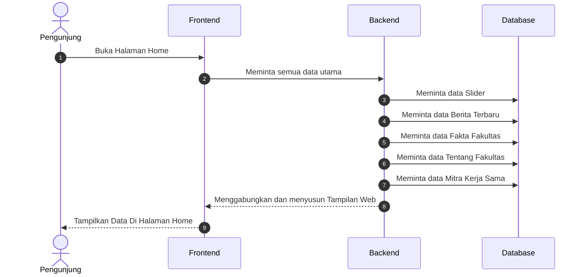

Halaman Utama berperan sebagai gerbang informasi terpadu yang menyajikan konten dari berbagai pilar fakultas. Saat Pengunjung membuka halaman ini, Frontend mengirimkan permintaan data kolektif kepada Backend. Selanjutnya, Backend melakukan serangkaian kueri ke Database untuk menarik data slider, berita terbaru, statistik fakta, narasi pengantar, serta daftar mitra. Hasil penggabungan seluruh data tersebut kemudian dikirimkan kembali ke antarmuka pengguna, memastikan penyajian informasi yang komprehensif dan aktual dalam satu siklus interaksi.

---

### 2.1.2 Sequence Diagram: Halaman Data Civitas Akademika

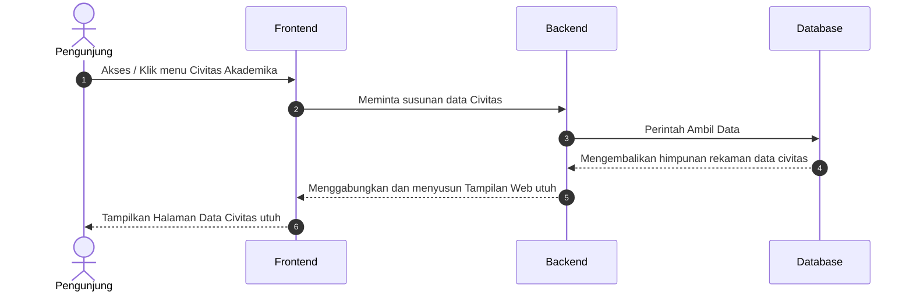

Proses visualisasi data Civitas Akademika menggambarkan mekanisme penarikan daftar profil sumber daya manusia di lingkungan fakultas. Pengunjung yang mengakses menu ini akan memicu permintaan data oleh Frontend kepada sistem peladen. Backend merespons dengan mengeksekusi perintah pengambilan rekaman data dari Database, yang kemudian ditransmisikan kembali untuk dirender menjadi daftar identitas pengelola yang terstruktur. Alur ini menjamin akurasi dan kemudahan akses informasi mengenai komposisi staf akademik bagi publik.

---

### 2.1.3 Sequence Diagram: Halaman Struktur Organisasi

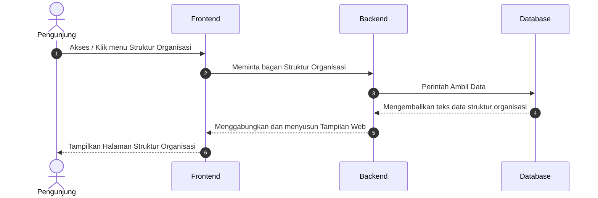

Representasi alur pengaksesan Bagan Struktur Organisasi menunjukkan proses penyajian hierarki kepemimpinan fakultas secara visual. Permintaan yang masuk dari antarmuka pengguna diproses oleh Backend melalui kueri spesifik pada tabel halaman statis untuk menarik path gambar atau teks deskripsi struktur. Setelah data diterima dari Database, Frontend mengolah informasi tersebut menjadi tampilan bagan yang informatif bagi pengunjung. Mekanisme ini memastikan transparansi tata kelola organisasi di tingkat fakultas dapat dipahami dengan baik oleh khalayak luas.

---

### 2.1.4 Sequence Diagram: Halaman Tentang Fakultas

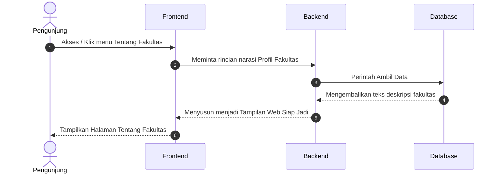

Interaksi pada Halaman Tentang Fakultas menitikberatkan pada penyajian narasi historis dan profil lembaga secara detail. Saat pengunjung memilih menu profil, sistem akan menginisiasi penarikan data deskriptif dari pangkalan data melalui Backend. Informasi yang dikembalikan oleh Database kemudian diformat oleh Frontend menjadi tayangan artikel profil yang komprehensif. Proses ini bertujuan untuk memberikan pemahaman mendalam mengenai latar belakang, identitas, dan peran strategis fakultas dalam penyelenggaraan pendidikan tinggi.

---

### 2.1.5 Sequence Diagram: Halaman Visi dan Misi

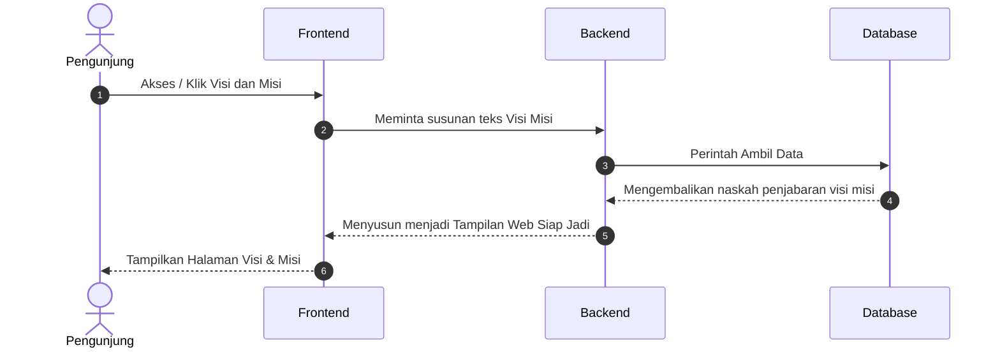

Alur penyajian Visi dan Misi fakultas memberikan wawasan mengenai landasan filosofis dan cita-cita strategis lembaga. Pengunjung yang mengakses halaman ini memicu sistem untuk menarik naskah deklarasi visi, misi, tujuan, dan sasaran dari Database. Backend bertanggung jawab untuk melakukan pemetaan data per kategori sebelum menyajikannya kembali ke Frontend. Hasil akhir dari proses ini adalah paparan teks yang terstruktur, memungkinkan pengunjung untuk memahami arah pengembangan dan komitmen kualitas yang dijunjung tinggi oleh fakultas.

---

### 2.1.6 Sequence Diagram: Halaman Profil Dosen

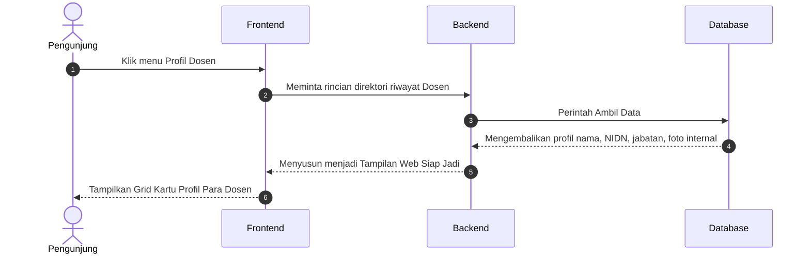

Proses pemuatan Direktori Profil Dosen menggambarkan mekanisme penyajian tenaga pendidik secara kolektif dengan data yang terperinci. Sistem merespons permintaan pengunjung dengan menarik beragam atribut data dari Database, mulai dari nama lengkap, NIDN, jabatan fungsional, hingga pas foto terbaru. Backend menyatukan seluruh atribut tersebut dan mengirimkannya ke Frontend untuk disusun menjadi grid kartu profil yang intuitif. Antarmuka ini dirancang untuk memudahkan pengunjung dalam mengenali keahlian dan kualifikasi akademik jajaran dosen di setiap program studi.

---

### 2.1.7 Sequence Diagram: Halaman Pendaftaran Mahasiswa Baru

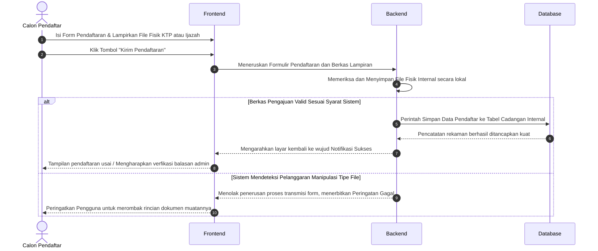

Siklus pendaftaran mahasiswa baru mencakup proses transmisi data calon pendaftar beserta berkas autentikasi fisiknya. Calon pendaftar mengirimkan formulir isian dan unggahan dokumen (seperti KTP atau Ijazah) melalui Frontend untuk divalidasi oleh Backend. Jika file memenuhi kriteria format sistem, data akan disimpan secara permanen ke Database dan notifikasi keberhasilan akan diterbitkan. Namun, apabila sistem mendeteksi ketidaksesuaian tipe file atau manipulasi data, proses akan ditangguhkan dengan pemberian umpan balik berupa peringatan kegagal bagi pengguna.

---

### 2.1.8 Sequence Diagram: Halaman Program Studi TI (Teknik Informatika)

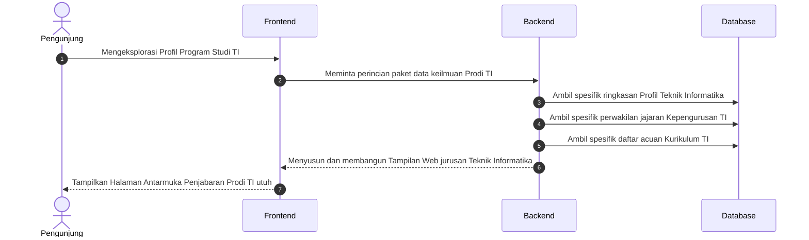

Visualisasi alur informasi Program Studi Teknik Informatika menunjukkan integrasi data keilmuan yang spesifik bagi calon mahasiswa atau peneliti. Saat pengunjung mengeksplorasi prodi ini, sistem akan menarik data gabungan yang terdiri dari narasi profil konsentrasi, daftar pengelola prodi, hingga dokumen acuan kurikulum dari pangkalan data. Backend mengatur agar seluruh segmen informasi tersebut tersaji secara sinkron di halaman antarmuka TI, memberikan gambaran utuh mengenai atmosfer akademik dan standar kompetensi pada bidang informatika.

---

### 2.1.9 Sequence Diagram: Halaman Program Studi PTI (Pendidikan Teknologi Informasi)

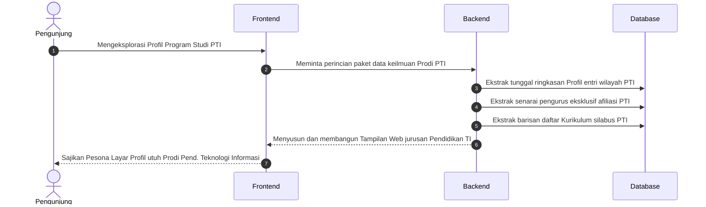

Manajemen informasi pada Program Studi Pendidikan Teknologi Informasi mengikuti pola penarikan data tematik yang menyesuaikan dengan profil kependidikan dan teknologi. Backend mengekstraksi riwayat profil prodi, senarai pengurus afiliasi, serta silabus kurikulum PTI dari Database untuk kemudian diproses oleh Frontend. Melalui alur ini, pengunjung dapat mengakses informasi yang relevan mengenai kesiapan prodi dalam mencetak tenaga pendidik profesional di bidang TI yang memiliki kualifikasi pedagogik dan teknis yang seimbang.

---

### 2.1.10 Sequence Diagram: Halaman Fasilitas Ruangan

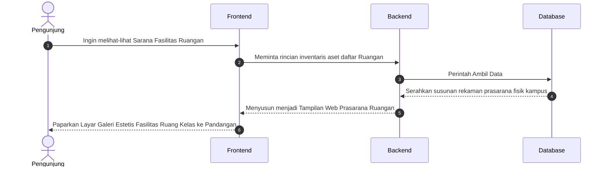

Proses penyajian Galeri Fasilitas Ruangan menggambarkan transparansi sarana prasarana fisik yang mendukung aktivitas perkuliahan. Sistem memproses permintaan pengunjung dengan menarik inventaris aset ruangan beserta dokumentasi fotonya dari pangkalan data. Data yang diperoleh kemudian disusun oleh Frontend menjadi etalase visual yang menampilkan kapasitas dan kelengkapan fasilitas di setiap ruang kelas. Mekanisme ini memberikan kepastian informasi bagi civitas akademika mengenai ketersediaan dan standar kelayakan sarana fisik yang ada di lingkungan kampus.

---

### 2.1.11 Sequence Diagram: Halaman Fasilitas Laboratorium

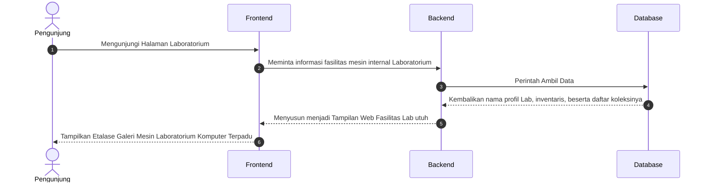

Siklus pemuatan informasi Fasilitas Laboratorium menyoroti ketersediaan sarana teknologi pendukung riset dan praktikum. Saat pengunjung mengakses laman ini, sistem akan mengidentifikasi profil setiap laboratorium melalui Backend. Data yang ditarik dari Database mencakup daftar inventaris mesin, perangkat keras, serta dokumentasi visual ruangan. Frontend kemudian mengolah paket data tersebut menjadi galeri etalase terpadu, memberikan gambaran mendalam bagi civitas akademika mengenai spesifikasi teknis dan keandalan fasilitas laboratorium komputer yang tersedia.

---

### 2.1.12 Sequence Diagram: Halaman Kalender Akademik

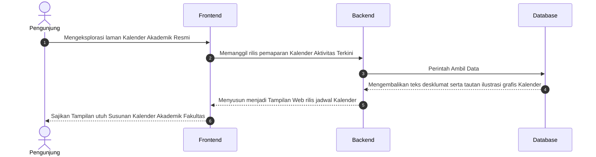

Representasi alur Kalender Akademik Resmi menjelaskan mekanisme penyampaian jadwal aktivitas tahunan bagi seluruh sivitas. Sistem merespons permintaan akses laman dengan menarik naskah deskripsi jadwal serta tautan ilustrasi grafis kalender dari pangkalan data. Backend memastikan sinkronisasi antara periode akademik saat ini dengan konten yang disajikan. Melalui Frontend, pengunjung dapat melihat susunan agenda akademik mulai dari masa perkuliahan hingga jadwal ujian secara sistematis, yang berfungsi sebagai acuan utama dalam perencanaan studi.

---

### 2.1.13 Sequence Diagram: Halaman Dokumen Kurikulum

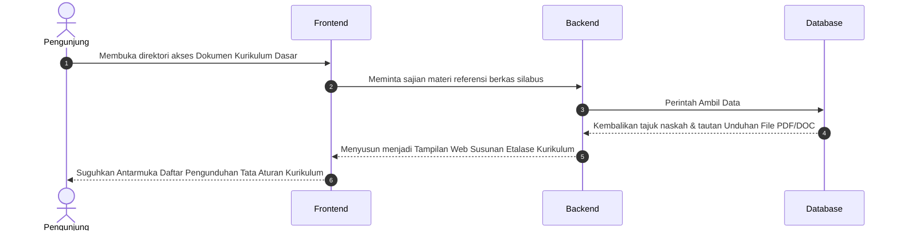

Proses penyajian Dokumen Kurikulum Dasar memberikan akses terbuka bagi pengunjung untuk menelaah struktur pendidikan di setiap program studi. Saat menu ini diakses, sistem akan menyajikan daftar materi referensi silabus dan kerangka mata kuliah. Backend menarik data tajuk naskah beserta path unduhan berkas PDF dari Database untuk diserahkan ke antarmuka pengguna. Alur ini memfasilitasi kebutuhan informasi mengenai standar kompetensi lulusan dan beban studi yang harus ditempuh oleh setiap mahasiswa.

---

### 2.1.14 Sequence Diagram: Halaman Dokumen Fakultas

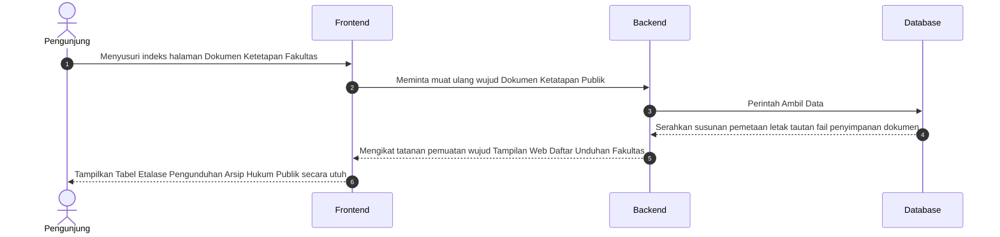

Mekanisme pengaksesan Dokumen Ketetapan Fakultas menggambarkan transparansi regulasi dan kebijakan resmi lembaga bagi publik. Sistem memproses permintaan pengunjung dengan melakukan pemetaan lokasi penyimpanan dokumen legal dan administratif pada server melalui kueri Database. Hasilnya disajikan oleh Frontend dalam bentuk tabel indeks yang memungkinkan pengguna untuk mengunduh arsip hukum atau formulir resmi secara mandiri. Proses ini menjamin kemudahan akses terhadap dokumen-dokumen penting yang bersifat publik dan otoritatif.

---

### 2.1.15 Sequence Diagram: Halaman Rencana Strategis (Renstra)

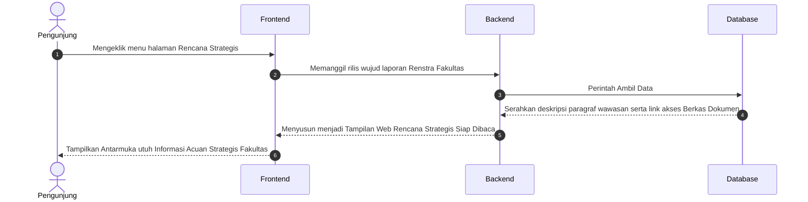

Visualisasi penyajian Rencana Strategis (Renstra) memberikan gambaran mengenai peta jalan pengembangan fakultas dalam jangka panjang. Pengunjung yang mengakses menu ini akan menerima paparan wawasan strategis dan indikator kinerja lembaga. Sistem menarik narasi deskriptif beserta tautan profil rencana dari Database untuk diproses oleh Frontend. Melalui dokumen ini, pemangku kepentingan dapat memahami arah kebijakan, target pencapaian, serta prioritas pengembangan yang ditetapkan oleh kepemimpinan fakultas.

---

### 2.1.16 Sequence Diagram: Halaman Standar Operasional Prosedur (SOP)

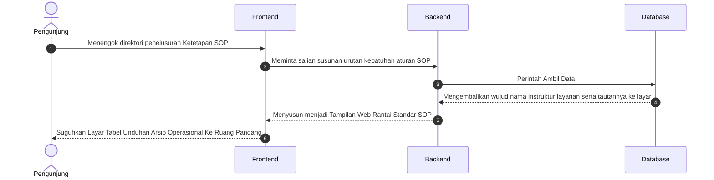

Proses penelusuran Standar Operasional Prosedur (SOP) menjelaskan alur kepatuhan aturan dalam setiap layanan administrasi dan akademik. Sistem menyajikan susunan hierarki prosedur pengerjaan tugas melalui penarikan data instruktur layanan dari pangkalan data. Backend memastikan setiap dokumen SOP yang ditampilkan adalah versi terbaru yang telah disahkan. Penyajian data dalam bentuk tabel unduhan oleh Frontend bertujuan untuk memberikan kepastian hukum dan efisiensi birokrasi bagi seluruh civitas akademika yang memerlukan panduan teknis.

---

### 2.1.17 Sequence Diagram: Halaman Data Penelitian

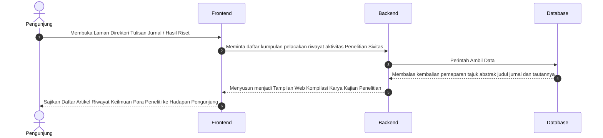

Interaksi pada Direktori Hasil Riset dan Jurnal menggambarkan pusat informasi keilmuan yang dihasilkan oleh jajaran sivitas fakultas. Saat pengunjung menyusuri laman ini, sistem akan mengumpulkan data kompilasi jurnal dan artikel ilmiah dari Database. Setiap entri data yang dikomunikasikan oleh Backend mencakup tajuk, abstrak, dan tautan publikasi jurnal eksternal. Frontend mengolah informasi tersebut menjadi katalog riset yang terstruktur, memfasilitasi referensi ilmiah bagi peneliti lain serta mempromosikan rekam jejak akademik lembaga.

---

### 2.1.18 Sequence Diagram: Halaman Data Pengabdian Masyarakat

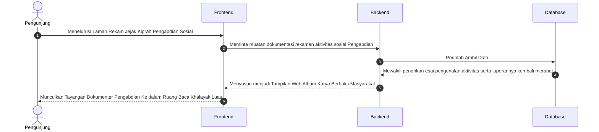

Alur penyajian Rekam Jejak Pengabdian Masyarakat mendokumentasikan kontribusi nyata fakultas terhadap permasalahan sosial di lingkungan sekitar. Sistem memproses permintaan data dengan menarik esai naratif dan laporan aktivitas sosial dari Database. Backend bertanggung jawab untuk menyajikan rangkaian dokumentasi kegiatan yang telah dilaksanakan oleh dosen dan mahasiswa. Melalui antarmuka galeri pengabdian, publik dapat melihat efektivitas program kemitraan dan dampak positif yang dihasilkan oleh institusi dalam skala komunitas luas.

---

### 2.1.19 Sequence Diagram: Halaman Profil Organisasi (BEM)

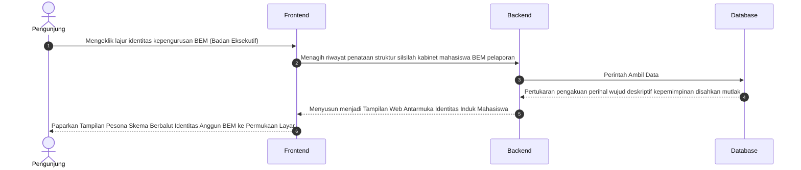

Representasi profil organisasi Badan Eksekutif Mahasiswa (BEM) menjelaskan struktur kepengurusan dan peran strategis lembaga kemahasiswaan tertinggi di tingkat fakultas. Saat diakses, sistem akan menarik riwayat kabinet dan visi kepemimpinan mahasiswa dari pangkalan data. Backend menyajikan data identitas silsilah kepengurusan yang kemudian divisualisasikan oleh Frontend. Alur ini bertujuan untuk memperkenalkan jajaran punggawa BEM sebagai representasi aspirasi dan penggerak kegiatan mahasiswa dalam satu periode jabatan.

---

### 2.1.20 Sequence Diagram: Halaman Unit Kegiatan Mahasiswa (UKM)

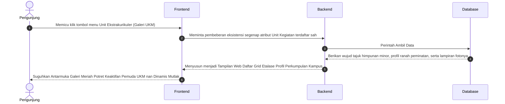

Visualisasi Galeri Unit Kegiatan Mahasiswa (UKM) menampilkan keberagaman minat dan bakat pemuda di bidang ekstrakurikuler. Sistem merespons interaksi pengunjung dengan mengekstraksi profil unit kegiatan, ranah peminatan, serta dokumentasi foto keaktifan dari Database. Frontend menyusun data tersebut ke dalam grid etalase yang dinamis, memberikan informasi komprehensif mengenai komunitas-komunitas mahasiswa yang tersedia sebagai wadah pengembangan diri di luar jam akademik rutin.

---

### 2.1.21 Sequence Diagram: Halaman Himpunan Mahasiswa

```mermaid
sequenceDiagram
    autonumber
    actor User as Pengunjung
    participant Frontend as Frontend
    participant Backend as Backend
    participant Database as Database

    User->>Frontend: Mencari pangkalan letak susunan himpunan otoritatif prodi (Jurusan) eksklusif
    Frontend->>Backend: Meminta pengungkapan tata aturan perwakilan tiap jajaran HIMA di bawah naungan BEM
    
    Backend->>Database: Perintah Ambil Data
    Database-->>Backend: Mewujudkan pertukaran penyerahan tabel Program Kerja spesifik per rumpun perwakilan  
    
    Backend-->>Frontend: Menyusun menjadi Tampilan Web Etalase Kemerincian Susunan Kabinet Cabang Independen
    Frontend-->>User: Paparkan Profil Megah Relasional Aktivis Mahasiswa Pemegang Identitas Perjurusan Prodi
```

Proses penyajian profil Himpunan Mahasiswa Jurusan (HIMA) menggambarkan struktur koordinasi kemahasiswaan yang bersifat spesifik per program studi. Sistem menarik data susunan kabinet perwakilan independen dan fokus program kerja tahunan dari Database. Backend memastikan hubungan relasional antara HIMA dan rumpun keilmuannya tersaji dengan jelas. Melalui antarmuka identitas perjurusan, calon mahasiswa dapat mengenal platform organisasi yang menaungi minat profesional mereka di tingkat departemen.

---

### 2.1.22 Sequence Diagram: Halaman Profil & Tracer Alumni

```mermaid
sequenceDiagram
    autonumber
    actor User as Pengunjung
    participant Frontend as Frontend
    participant Backend as Backend
    participant Database as Database

    User->>Frontend: Singgah merunut pelacakan riwayat kelulusan pemuda cendekia (Ruang Pencarian Alumni)
    Frontend->>Backend: Mengajukan penarikan data wujud Direktori Kelulusan serta kiprah sukses riwayat Purna Kampus
    
    Backend->>Database: Perintah Ambil Data
    Database-->>Backend: Hadirkan rentetan kompilasi wawasan data karir penempatan serta rekam masa pelepasan ke tangan server
    
    Backend-->>Frontend: Menyusun menjadi Tampilan Web Riwayat Lintas Waktu para Pemegang Takhta Kesuksesan Belajar 
    Frontend-->>User: Tampilkan Lembar Kebanggaan Perjalanan Waktu Catatan Karier dan Keaktifan Anggota Purna Lulusan Web 
```

Mekanisme pelacakan pada Direktori Alumni dan Tracer Study berfungsi sebagai jembatan informasi antara lulusan dan institusi. Sistem memproses permintaan pengunjung dengan menarik rentetan data karir, penempatan kerja, serta rekam jejak lulusan dari pangkalan data. Backend menyusun wawasan statistik kelulusan yang kemudian disajikan oleh Frontend. Alur ini memberikan bukti nyata mengenai kualitas luaran pendidikan fakultas sekaligus memfasilitasi jejaring profesional di antara para lulusan lintas generasi.

### 2.1.23 Sequence Diagram: Halaman Sambutan Dekan

```mermaid
sequenceDiagram
    autonumber
    actor User as Pengunjung
    participant Frontend as Frontend
    participant Backend as Backend
    participant Database as Database

    User->>Frontend: Mengeklik menu Sambutan Dekan
    Frontend->>Backend: Meminta konten narasi dan foto profil Dekan
    
    Backend->>Database: Perintah Ambil Data (Logika Halaman Statis/Profil)
    Database-->>Backend: Mengembalikan teks sambutan dan path foto dekan
    
    Backend-->>Frontend: Menyusun Komponen Halaman Sambutan Utuh
    Frontend-->>User: Tampilkan Halaman Sambutan Dekan yang Informatif
```

Penyajian narasi Sambutan Dekan menandai perkenalan resmi kepemimpinan fakultas kepada pengunjung website. Saat menu ini diakses, Frontend akan meminta konten naratif sambutan beserta atribut visual foto pimpinan dari pangkalan data. Backend melakukan penarikan rekaman data statis dari tabel terkait untuk kemudian disusun menjadi komponen halaman sambutan yang informatif. Proses ini bertujuan untuk membangun kedekatan komunikasi dan menyampaikan pesan strategis pimpinan mengenai visi pengembangan lembaga.

---

### 2.2.1 Sequence Diagram: Login Administrator
Siklus autentikasi Administrator merupakan gerbang keamanan utama untuk mengakses panel kendali sistem. Admin memasukkan kredensial berupa nama pengguna dan kata sandi melalui formulir login yang disediakan oleh Frontend. Backend kemudian melakukan verifikasi kecocokan data tersebut dengan rekaman yang tersimpan di Database. Jika kredensial dinyatakan valid, sistem akan menginisiasi sesi aktif dan mengarahkan Admin ke dashboard utama, namun jika terjadi ketidaksesuaian, sistem akan menolak akses dan menerbitkan pesan peringatan kesalahan.

```mermaid
sequenceDiagram
    autonumber
    actor Admin as Admin
    participant Frontend as Frontend
    participant Backend as Backend
    participant DB as Database

    Admin->>Frontend: Buka halaman login
    Frontend-->>Admin: Tampilkan form login
    
    Admin->>Frontend: Ketik Username & Password, tekan Login
    Frontend->>Backend: Kirim form data (jalur komunikasi aman)
    
    Backend->>DB: Cek kecocokan User/Pass
    DB-->>Backend: Validasi kredensial
    
    alt Login Berhasil
        Backend->>Backend: Set Sesi kunjungan Login Aktif
        Backend-->>Frontend: Redirect ke Dashboard Admin
    else Login Gagal
        Backend-->>Frontend: Tampilkan pesan Error Login
    end
```

---

### 2.2.2 Sequence Diagram: Kelola Slider Beranda
Manajemen Slider Beranda memfasilitasi Administrator dalam mengatur konten visual utama pada halaman depan website. Alur ini mencakup proses pengambilan riwayat arsip data slider untuk ditampilkan dalam tabel manajerial. Admin dapat menambahkan gambar baru dengan ketentuan format dan ukuran tertentu, di mana Backend secara otomatis mengelola penyimpanan fisik file pada server serta memperbarui tautan lokasinya di Database. Dalam kasus pengeditan atau penghapusan, sistem memastikan aset gambar lama dibersihkan secara permanen untuk mengoptimalkan efisiensi ruang penyimpanan.

```mermaid
sequenceDiagram
    autonumber
    actor Admin as Administrator
    participant Frontend as Frontend
    participant Backend as Backend
    participant Server as "Storage"
    participant DB as Database

    Admin->>Frontend: Buka halaman menu Kelola Slider Beranda
    Frontend->>Backend: Request Halaman & Data
    Backend->>DB: Tarik semua riwayat arsip data
    DB-->>Backend: Return Data
    Backend-->>Frontend: Tampilkan daftar tabel data ke beranda layar

    %% Proses Tambah / Edit
    opt Klik Tombol Tambah / Edit Baris Data
        Admin->>Frontend: Lengkapi isian form & Upload Foto Pemandangan Kampus beranda
        Admin->>Frontend: Konfirmasi persetujuan tombol "Simpan"
        Frontend->>Backend: Kirim input form menuju sistem (jalur komunikasi aman)

        Backend->>Backend: Cek kesesuaian parameter format berkas dan ukurannya
        
        alt Jika klasifikasi parameter file Valid / Benar
            opt Jika tedapat lampiran berkas baru yang diunggah
                Backend->>Server: Simpan fisik file masuk ke folder peladen uploads/slider
                opt Jika menimpa data warisan usang pengeditan
                    Backend->>Server: Hapus permanen file peninggalan lawas
                end
            end
            
            Backend->>DB: Sisipkan detail baris isian ketikan teks & integrasikan link lokasinya ke Database
            DB-->>Backend: Peladen menyematkan pertanda konfirmasi data terekam permanen
            Backend-->>Frontend: Dialihkan kembali ke tabel dibarengi rilis Menampilkan Konfirmasi Pesan Sukses
        else Terdeteksi Format File Salah / Skala Muatan Overload Besar
            Backend-->>Frontend: Singkirkan lalu buang permohonan bersisian peringatan Error
        end
    end

    %% Proses Hapus
    opt Klik Ikon / Tombol Hapus pada Baris
        Admin->>Frontend: Sentuh pengajuan pembasmian mutlak baris rekaman spesifik
        Frontend->>Backend: Eksekusi sanksi lemparan pembersihan mendesak pangkalan perampingan
        Backend->>DB: Lacak letak kedudukan koordinat alamat letak nama spesifik file 
        Backend->>Server: Congkel hancurkan secara fisis fail bawaan eksisting di laci wadah uploads/slider
        Backend->>DB: Runtuhkan catatan nama jejak spesifik itu terbakar bersih melenggang jauh dari Database
        DB-->>Backend: Penarikan silsilah daftar terhapuskan mutakhir dipastikan tersingkir
        Backend-->>Frontend: Melemparkan pengawal administrasi memuat rupa jernih diiringi Papan Pemberitahuan Lapor Sukses 
    end
```

---

### 2.2.3 Sequence Diagram: Kelola Berita
Modul Kelola Berita dirancang untuk mempermudah Administrator dalam menyebarluaskan rilis informasi dan agenda terkini fakultas. Proses ini melibatkan pengisian formulir rincian berita beserta lampiran foto sampul yang representatif. Backend bertanggung jawab untuk memvalidasi setiap unggahan sebelum menyimpan rekaman narasi ke Database dan menaruh file gambar ke direktori penyimpanan khusus. Sistem juga menjamin sinkronisasi data yang ketat, di mana penghapusan satu item berita akan diikuti dengan penghapusan aset gambar terkait secara otomatis dari sistem peladen.

```mermaid
sequenceDiagram
    autonumber
    actor Admin as Administrator
    participant Frontend as Frontend
    participant Backend as Backend
    participant Server as "Storage"
    participant DB as Database

    Admin->>Frontend: Buka halaman menu Kelola Berita
    Frontend->>Backend: Request Halaman & Data
    Backend->>DB: Tarik semua riwayat arsip data
    DB-->>Backend: Return Data
    Backend-->>Frontend: Tampilkan daftar tabel data ke beranda layar

    %% Proses Tambah / Edit
    opt Klik Tombol Tambah / Edit Baris Data
        Admin->>Frontend: Lengkapi isian form & Upload Foto Sampul
        Admin->>Frontend: Konfirmasi persetujuan tombol "Simpan"
        Frontend->>Backend: Kirim input form menuju sistem (jalur komunikasi aman)

        Backend->>Backend: Cek kesesuaian parameter format berkas dan ukurannya
        
        alt Jika klasifikasi parameter file Valid / Benar
            opt Jika tedapat lampiran berkas baru yang diunggah
                Backend->>Server: Simpan fisik file masuk ke folder peladen uploads/
                opt Jika menimpa data warisan usang pengeditan
                    Backend->>Server: Hapus permanen file peninggalan lawas
                end
            end
            
            Backend->>DB: Sisipkan detail baris isian ketikan teks & integrasikan link lokasinya ke Database
            DB-->>Backend: Peladen menyematkan pertanda konfirmasi data terekam permanen
            Backend-->>Frontend: Dialihkan kembali ke tabel dibarengi rilis Menampilkan Konfirmasi Pesan Sukses
        else Terdeteksi Format File Salah / Skala Muatan Overload Besar
            Backend-->>Frontend: Singkirkan lalu buang permohonan bersisian peringatan Error
        end
    end

    %% Proses Hapus
    opt Klik Ikon / Tombol Hapus pada Baris
        Admin->>Frontend: Sentuh pengajuan pembasmian mutlak baris rekaman spesifik
        Frontend->>Backend: Eksekusi sanksi lemparan pembersihan mendesak pangkalan perampingan
        Backend->>DB: Lacak letak kedudukan koordinat alamat letak nama spesifik file 
        Backend->>Server: Congkel hancurkan secara fisis fail bawaan eksisting di laci wadah uploads/
        Backend->>DB: Runtuhkan catatan nama jejak spesifik itu terbakar bersih melenggang jauh dari Database
        DB-->>Backend: Penarikan silsilah daftar terhapuskan mutakhir dipastikan tersingkir
        Backend-->>Frontend: Melemparkan pengawal administrasi memuat rupa jernih diiringi Papan Pemberitahuan Lapor Sukses 
    end
```

---

### 2.2.4 Sequence Diagram: Kelola Dosen
Pengelolaan direktori tenaga pendidik memungkinkan Administrator untuk memperbarui profil akademik dan jabatan fungsional dosen secara berkala. Saat Admin melakukan penambahan atau perubahan data, Backend akan memproses input teks beserta atribut foto profil dosen ke dalam pangkalan data. Sistem keamanan pada backend akan memastikan hanya file gambar dengan spesifikasi yang diizinkan yang dapat tersimpan. Alur pembersihan data juga diintegrasikan untuk memastikan bahwa setiap rekaman dosen yang dihapus tidak meninggalkan jejak file gambar yang usang di server penyimpanan.

```mermaid
sequenceDiagram
    autonumber
    actor Admin as Administrator
    participant Frontend as Frontend
    participant Backend as Backend
    participant Server as "Storage"
    participant DB as Database

    Admin->>Frontend: Buka halaman menu Kelola Dosen
    Frontend->>Backend: Request Halaman & Data
    Backend->>DB: Tarik semua riwayat arsip data
    DB-->>Backend: Return Data
    Backend-->>Frontend: Tampilkan daftar tabel data ke beranda layar

    %% Proses Tambah / Edit
    opt Klik Tombol Tambah / Edit Baris Data
        Admin->>Frontend: Lengkapi isian form & Upload Foto Profil
        Admin->>Frontend: Konfirmasi persetujuan tombol "Simpan"
        Frontend->>Backend: Kirim input form menuju sistem (jalur komunikasi aman)

        Backend->>Backend: Cek kesesuaian parameter format berkas dan ukurannya
        
        alt Jika klasifikasi parameter file Valid / Benar
            opt Jika tedapat lampiran berkas baru yang diunggah
                Backend->>Server: Simpan fisik file masuk ke folder peladen uploads/dosen
                opt Jika menimpa data warisan usang pengeditan
                    Backend->>Server: Hapus permanen file peninggalan lawas
                end
            end
            
            Backend->>DB: Sisipkan detail baris isian ketikan teks & integrasikan link lokasinya ke Database
            DB-->>Backend: Peladen menyematkan pertanda konfirmasi data terekam permanen
            Backend-->>Frontend: Dialihkan kembali ke tabel dibarengi rilis Menampilkan Konfirmasi Pesan Sukses
        else Terdeteksi Format File Salah / Skala Muatan Overload Besar
            Backend-->>Frontend: Singkirkan lalu buang permohonan bersisian peringatan Error
        end
    end

    %% Proses Hapus
    opt Klik Ikon / Tombol Hapus pada Baris
        Admin->>Frontend: Sentuh pengajuan pembasmian mutlak baris rekaman spesifik
        Frontend->>Backend: Eksekusi sanksi lemparan pembersihan mendesak pangkalan perampingan
        Backend->>DB: Lacak letak kedudukan koordinat alamat letak nama spesifik file 
        Backend->>Server: Congkel hancurkan secara fisis fail bawaan eksisting di laci wadah uploads/dosen
        Backend->>DB: Runtuhkan catatan nama jejak spesifik itu terbakar bersih melenggang jauh dari Database
        DB-->>Backend: Penarikan silsilah daftar terhapuskan mutakhir dipastikan tersingkir
        Backend-->>Frontend: Melemparkan pengawal administrasi memuat rupa jernih diiringi Papan Pemberitahuan Lapor Sukses 
    end
```

---

### 2.2.5 Sequence Diagram: Kelola Fasilitas Ruangan
Manajemen inventaris sarana fisik melalui modul Kelola Fasilitas Ruangan bertujuan untuk menjaga akurasi profil prasarana kampus. Administrator bertugas mendaftarkan detail fasilitas, kapasitas, serta dokumentasi visual setiap ruang kelas atau auditorium. Backend memproses permintaan simpan data dengan melakukan sinkronisasi antara isian formulir dan file gambar yang diunggah ke storage ruangan. Mekanisme ini memastikan bahwa setiap perubahan data prasarana segera terverifikasi dan siap disajikan secara estetis kepada pengunjung melalui antarmuka publik.

```mermaid
sequenceDiagram
    autonumber
    actor Admin as Administrator
    participant Frontend as Frontend
    participant Backend as Backend
    participant Server as "Storage"
    participant DB as Database

    Admin->>Frontend: Buka halaman menu Kelola Fasilitas Ruangan
    Frontend->>Backend: Request Halaman & Data
    Backend->>DB: Tarik semua riwayat arsip data
    DB-->>Backend: Return Data
    Backend-->>Frontend: Tampilkan daftar tabel data ke beranda layar

    %% Proses Tambah / Edit
    opt Klik Tombol Tambah / Edit Baris Data
        Admin->>Frontend: Lengkapi isian form & Upload Foto Kelas/Ruangan
        Admin->>Frontend: Konfirmasi persetujuan tombol "Simpan"
        Frontend->>Backend: Kirim input form menuju sistem (jalur komunikasi aman)

        Backend->>Backend: Cek kesesuaian parameter format berkas dan ukurannya
        
        alt Jika klasifikasi parameter file Valid / Benar
            opt Jika tedapat lampiran berkas baru yang diunggah
                Backend->>Server: Simpan fisik file masuk ke folder peladen uploads/ruangan
                opt Jika menimpa data warisan usang pengeditan
                    Backend->>Server: Hapus permanen file peninggalan lawas
                end
            end
            
            Backend->>DB: Sisipkan detail baris isian ketikan teks & integrasikan link lokasinya ke Database
            DB-->>Backend: Peladen menyematkan pertanda konfirmasi data terekam permanen
            Backend-->>Frontend: Dialihkan kembali ke tabel dibarengi rilis Menampilkan Konfirmasi Pesan Sukses
        else Terdeteksi Format File Salah / Skala Muatan Overload Besar
            Backend-->>Frontend: Singkirkan lalu buang permohonan bersisian peringatan Error
        end
    end

    %% Proses Hapus
    opt Klik Ikon / Tombol Hapus pada Baris
        Admin->>Frontend: Sentuh pengajuan pembasmian mutlak baris rekaman spesifik
        Frontend->>Backend: Eksekusi sanksi lemparan pembersihan mendesak pangkalan perampingan
        Backend->>DB: Lacak letak kedudukan koordinat alamat letak nama spesifik file 
        Backend->>Server: Congkel hancurkan secara fisis fail bawaan eksisting di laci wadah uploads/ruangan
        Backend->>DB: Runtuhkan catatan nama jejak spesifik itu terbakar bersih melenggang jauh dari Database
        DB-->>Backend: Penarikan silsilah daftar terhapuskan mutakhir dipastikan tersingkir
        Backend-->>Frontend: Melemparkan pengawal administrasi memuat rupa jernih diiringi Papan Pemberitahuan Lapor Sukses 
    end
```

---

### 2.2.6 Sequence Diagram: Kelola Fasilitas Laboratorium
Modul khusus manajemen Laboratorium Komputer memberikan wewenang kepada Administrator untuk mengatur profil teknis dan inventaris perangkat laboratorium. Alur kerjanya meliputi pengambilan data eksisting untuk disunting kembali, termasuk pembaruan foto fasilitas lab yang lebih aktual. Backend mengelola transmisi data biner gambar ke folder penyimpanan khusus lab di server dan memperbarui referensi path gambarnya di Database. Proses penghapusan record juga dirancang secara aman untuk membasmi file lampiran fisis dari server pangkalan demi menjaga kerapian struktur direktori.

```mermaid
sequenceDiagram
    autonumber
    actor Admin as Administrator
    participant Frontend as Frontend
    participant Backend as Backend
    participant Server as "Storage"
    participant DB as Database

    Admin->>Frontend: Buka halaman menu Kelola Fasilitas Laboratorium
    Frontend->>Backend: Request Halaman & Data
    Backend->>DB: Tarik semua riwayat arsip data
    DB-->>Backend: Return Data
    Backend-->>Frontend: Tampilkan daftar tabel data ke beranda layar

    %% Proses Tambah / Edit
    opt Klik Tombol Tambah / Edit Baris Data
        Admin->>Frontend: Lengkapi isian form & Upload Foto Laboratorium
        Admin->>Frontend: Konfirmasi persetujuan tombol "Simpan"
        Frontend->>Backend: Kirim input form menuju sistem (jalur komunikasi aman)

        Backend->>Backend: Cek kesesuaian parameter format berkas dan ukurannya
        
        alt Jika klasifikasi parameter file Valid / Benar
            opt Jika tedapat lampiran berkas baru yang diunggah
                Backend->>Server: Simpan fisik file masuk ke folder peladen uploads/laboratorium
                opt Jika menimpa data warisan usang pengeditan
                    Backend->>Server: Hapus permanen file peninggalan lawas
                end
            end
            
            Backend->>DB: Sisipkan detail baris isian ketikan teks & integrasikan link lokasinya ke Database
            DB-->>Backend: Peladen menyematkan pertanda konfirmasi data terekam permanen
            Backend-->>Frontend: Dialihkan kembali ke tabel dibarengi rilis Menampilkan Konfirmasi Pesan Sukses
        else Terdeteksi Format File Salah / Skala Muatan Overload Besar
            Backend-->>Frontend: Singkirkan lalu buang permohonan bersisian peringatan Error
        end
    end

    %% Proses Hapus
    opt Klik Ikon / Tombol Hapus pada Baris
        Admin->>Frontend: Sentuh pengajuan pembasmian mutlak baris rekaman spesifik
        Frontend->>Backend: Eksekusi sanksi lemparan pembersihan mendesak pangkalan perampingan
        Backend->>DB: Lacak letak kedudukan koordinat alamat letak nama spesifik file 
        Backend->>Server: Congkel hancurkan secara fisis fail bawaan eksisting di laci wadah uploads/laboratorium
        Backend->>DB: Runtuhkan catatan nama jejak spesifik itu terbakar bersih melenggang jauh dari Database
        DB-->>Backend: Penarikan silsilah daftar terhapuskan mutakhir dipastikan tersingkir
        Backend-->>Frontend: Melemparkan pengawal administrasi memuat rupa jernih diiringi Papan Pemberitahuan Lapor Sukses 
    end
```

---

### 2.2.7 Sequence Diagram: Kelola Kalender Akademik
Pembaruan Kalender Akademik Resmi oleh Administrator memastikan seluruh sivitas mendapatkan informasi jadwal yang mutakhir. Admin mengunggah berkas grafis kalender semester terbaru melalui panel kontrol, yang kemudian divalidasi oleh sistem backend. Jika file dinyatakan valid, Backend akan mengganti aset gambar kalender periode sebelumnya dengan file yang baru di server dan memperbarui catatan kronologisnya di Database. Alur delegasi data ini menjamin bahwa pengunjung selalu mendapatkan rujukan waktu akademik yang sesuai dengan kebijakan terbaru fakultas.

```mermaid
sequenceDiagram
    autonumber
    actor Admin as Administrator
    participant Frontend as Frontend
    participant Backend as Backend
    participant Server as "Storage"
    participant DB as Database

    Admin->>Frontend: Buka halaman menu Kelola Kalender Akademik
    Frontend->>Backend: Request Halaman & Data
    Backend->>DB: Tarik semua riwayat arsip data
    DB-->>Backend: Return Data
    Backend-->>Frontend: Tampilkan daftar tabel data ke beranda layar

    %% Proses Tambah / Edit
    opt Klik Tombol Tambah / Edit Baris Data
        Admin->>Frontend: Lengkapi isian form & Upload Gambar Kalender
        Admin->>Frontend: Konfirmasi persetujuan tombol "Simpan"
        Frontend->>Backend: Kirim input form menuju sistem (jalur komunikasi aman)

        Backend->>Backend: Cek kesesuaian parameter format berkas dan ukurannya
        
        alt Jika klasifikasi parameter file Valid / Benar
            opt Jika tedapat lampiran berkas baru yang diunggah
                Backend->>Server: Simpan fisik file masuk ke folder peladen uploads/kalender
                opt Jika menimpa data warisan usang pengeditan
                    Backend->>Server: Hapus permanen file peninggalan lawas
                end
            end
            
            Backend->>DB: Sisipkan detail baris isian ketikan teks & integrasikan link lokasinya ke Database
            DB-->>Backend: Peladen menyematkan pertanda konfirmasi data terekam permanen
            Backend-->>Frontend: Dialihkan kembali ke tabel dibarengi rilis Menampilkan Konfirmasi Pesan Sukses
        else Terdeteksi Format File Salah / Skala Muatan Overload Besar
            Backend-->>Frontend: Singkirkan lalu buang permohonan bersisian peringatan Error
        end
    end

    %% Proses Hapus
    opt Klik Ikon / Tombol Hapus pada Baris
        Admin->>Frontend: Sentuh pengajuan pembasmian mutlak baris rekaman spesifik
        Frontend->>Backend: Eksekusi sanksi lemparan pembersihan mendesak pangkalan perampingan
        Backend->>DB: Lacak letak kedudukan koordinat alamat letak nama spesifik file 
        Backend->>Server: Congkel hancurkan secara fisis fail bawaan eksisting di laci wadah uploads/kalender
        Backend->>DB: Runtuhkan catatan nama jejak spesifik itu terbakar bersih melenggang jauh dari Database
        DB-->>Backend: Penarikan silsilah daftar terhapuskan mutakhir dipastikan tersingkir
        Backend-->>Frontend: Melemparkan pengawal administrasi memuat rupa jernih diiringi Papan Pemberitahuan Lapor Sukses 
    end
```

---

### 2.2.8 Sequence Diagram: Kelola Dokumen Kurikulum
Pusat pengelolaan dokumen akademik melalui modul Kelola Dokumen Kurikulum memfasilitasi distribusi silabus dan pedoman studi dalam format digital. Administrator mengelola unggahan berkas (seperti PDF atau DOC) yang dikomunikasikan secara aman ke Backend untuk disimpan dalam direktori dokumen khusus. Sistem secara otomatis mencatat tajuk dokumen dan tautan unduhannya ke dalam Database. Dalam setiap operasi modifikasi, sistem akan menimpa berkas lama dengan versi revisi terbaru, memastikan integritas materi referensi kurikulum bagi mahasiswa tetap terjaga.

```mermaid
sequenceDiagram
    autonumber
    actor Admin as Administrator
    participant Frontend as Frontend
    participant Backend as Backend
    participant Server as "Storage"
    participant DB as Database

    Admin->>Frontend: Buka halaman menu Kelola Dokumen Kurikulum
    Frontend->>Backend: Request Halaman & Data
    Backend->>DB: Tarik semua riwayat arsip data
    DB-->>Backend: Return Data
    Backend-->>Frontend: Tampilkan daftar tabel data ke beranda layar

    %% Proses Tambah / Edit
    opt Klik Tombol Tambah / Edit Baris Data
        Admin->>Frontend: Lengkapi isian form & Upload Dokumen Asli
        Admin->>Frontend: Konfirmasi persetujuan tombol "Simpan"
        Frontend->>Backend: Kirim input form menuju sistem (jalur komunikasi aman)

        Backend->>Backend: Cek kesesuaian parameter format berkas dan ukurannya
        
        alt Jika klasifikasi parameter file Valid / Benar
            opt Jika tedapat lampiran berkas baru yang diunggah
                Backend->>Server: Simpan fisik file masuk ke folder peladen docs/kurikulum
                opt Jika menimpa data warisan usang pengeditan
                    Backend->>Server: Hapus permanen file peninggalan lawas
                end
            end
            
            Backend->>DB: Sisipkan detail baris isian ketikan teks & integrasikan link lokasinya ke Database
            DB-->>Backend: Peladen menyematkan pertanda konfirmasi data terekam permanen
            Backend-->>Frontend: Dialihkan kembali ke tabel dibarengi rilis Menampilkan Konfirmasi Pesan Sukses
        else Terdeteksi Format File Salah / Skala Muatan Overload Besar
            Backend-->>Frontend: Singkirkan lalu buang permohonan bersisian peringatan Error
        end
    end

    %% Proses Hapus
    opt Klik Ikon / Tombol Hapus pada Baris
        Admin->>Frontend: Sentuh pengajuan pembasmian mutlak baris rekaman spesifik
        Frontend->>Backend: Eksekusi sanksi lemparan pembersihan mendesak pangkalan perampingan
        Backend->>DB: Lacak letak kedudukan koordinat alamat letak nama spesifik file 
        Backend->>Server: Congkel hancurkan secara fisis fail bawaan eksisting di laci wadah docs/kurikulum
        Backend->>DB: Runtuhkan catatan nama jejak spesifik itu terbakar bersih melenggang jauh dari Database
        DB-->>Backend: Penarikan silsilah daftar terhapuskan mutakhir dipastikan tersingkir
        Backend-->>Frontend: Melemparkan pengawal administrasi memuat rupa jernih diiringi Papan Pemberitahuan Lapor Sukses 
    end
```

---

### 2.2.9 Sequence Diagram: Kelola Mitra Kerjasama
Manajemen kemitraan institusi memungkinkan Administrator untuk mendokumentasikan kerjasama strategis dengan pihak eksternal. Admin mengelola profil instansi mitra beserta logo perusahaan melalui panel administrasi. Backend menangani proses penyimpanan logis data mitra ke Database dan penyimpanan fisis logo ke folder kemitraan di server. Alur ini juga mencakup mekanisme penghapusan record yang komprehensif, di mana sistem akan membersihkan logo mitra dari penyimpanan jika durasi kerjasama telah berakhir, guna menjaga relevansi data publikasi fakultas.

```mermaid
sequenceDiagram
    autonumber
    actor Admin as Administrator
    participant Frontend as Frontend
    participant Backend as Backend
    participant Server as "Storage"
    participant DB as Database

    Admin->>Frontend: Buka halaman menu Kelola Mitra Kerjasama
    Frontend->>Backend: Request Halaman & Data
    Backend->>DB: Tarik semua riwayat arsip data
    DB-->>Backend: Return Data
    Backend-->>Frontend: Tampilkan daftar tabel data ke beranda layar

    %% Proses Tambah / Edit
    opt Klik Tombol Tambah / Edit Baris Data
        Admin->>Frontend: Lengkapi isian form & Upload Logo Kemitraan
        Admin->>Frontend: Konfirmasi persetujuan tombol "Simpan"
        Frontend->>Backend: Kirim input form menuju sistem (jalur komunikasi aman)

        Backend->>Backend: Cek kesesuaian parameter format berkas dan ukurannya
        
        alt Jika klasifikasi parameter file Valid / Benar
            opt Jika tedapat lampiran berkas baru yang diunggah
                Backend->>Server: Simpan fisik file masuk ke folder peladen uploads/kerjasama
                opt Jika menimpa data warisan usang pengeditan
                    Backend->>Server: Hapus permanen file peninggalan lawas
                end
            end
            
            Backend->>DB: Sisipkan detail baris isian ketikan teks & integrasikan link lokasinya ke Database
            DB-->>Backend: Peladen menyematkan pertanda konfirmasi data terekam permanen
            Backend-->>Frontend: Dialihkan kembali ke tabel dibarengi rilis Menampilkan Konfirmasi Pesan Sukses
        else Terdeteksi Format File Salah / Skala Muatan Overload Besar
            Backend-->>Frontend: Singkirkan lalu buang permohonan bersisian peringatan Error
        end
    end

    %% Proses Hapus
    opt Klik Ikon / Tombol Hapus pada Baris
        Admin->>Frontend: Sentuh pengajuan pembasmian mutlak baris rekaman spesifik
        Frontend->>Backend: Eksekusi sanksi lemparan pembersihan mendesak pangkalan perampingan
        Backend->>DB: Lacak letak kedudukan koordinat alamat letak nama spesifik file 
        Backend->>Server: Congkel hancurkan secara fisis fail bawaan eksisting di laci wadah uploads/kerjasama
        Backend->>DB: Runtuhkan catatan nama jejak spesifik itu terbakar bersih melenggang jauh dari Database
        DB-->>Backend: Penarikan silsilah daftar terhapuskan mutakhir dipastikan tersingkir
        Backend-->>Frontend: Melemparkan pengawal administrasi memuat rupa jernih diiringi Papan Pemberitahuan Lapor Sukses 
    end
```

---

### 2.2.10 Sequence Diagram: Kelola Data Penelitian
Modul repositori hasil riset dirancang agar Administrator dapat mengelola pangkalan data karya ilmiah sivitas akademika secara terstruktur. Admin menginput rincian abstrak, judul jurnal, serta mengunggah berkas laporan penelitian yang valid. Backend memproses data tersebut ke dalam tabel penelitian di Database dan menaruh file dokumen ke direktori publikasi di server. Sistem memastikan setiap entri riset memiliki tautan unduhan yang dapat diakses oleh khalayak, sehingga mempermudah diseminasi pengetahuan dan pemetaan rekam jejak akademik institusi.

```mermaid
sequenceDiagram
    autonumber
    actor Admin as Administrator
    participant Frontend as Frontend
    participant Backend as Backend
    participant Server as "Storage"
    participant DB as Database

    Admin->>Frontend: Buka halaman menu Kelola Data Penelitian
    Frontend->>Backend: Request Halaman & Data
    Backend->>DB: Tarik semua riwayat arsip data
    DB-->>Backend: Return Data
    Backend-->>Frontend: Tampilkan daftar tabel data ke beranda layar

    %% Proses Tambah / Edit
    opt Klik Tombol Tambah / Edit Baris Data
        Admin->>Frontend: Lengkapi isian form & Upload Dokumen Laporan Publikasi
        Admin->>Frontend: Konfirmasi persetujuan tombol "Simpan"
        Frontend->>Backend: Kirim input form menuju sistem (jalur komunikasi aman)

        Backend->>Backend: Cek kesesuaian parameter format berkas dan ukurannya
        
        alt Jika klasifikasi parameter file Valid / Benar
            opt Jika tedapat lampiran berkas baru yang diunggah
                Backend->>Server: Simpan fisik file masuk ke folder peladen docs/penelitian
                opt Jika menimpa data warisan usang pengeditan
                    Backend->>Server: Hapus permanen file peninggalan lawas
                end
            end
            
            Backend->>DB: Sisipkan detail baris isian ketikan teks & integrasikan link lokasinya ke Database
            DB-->>Backend: Peladen menyematkan pertanda konfirmasi data terekam permanen
            Backend-->>Frontend: Dialihkan kembali ke tabel dibarengi rilis Menampilkan Konfirmasi Pesan Sukses
        else Terdeteksi Format File Salah / Skala Muatan Overload Besar
            Backend-->>Frontend: Singkirkan lalu buang permohonan bersisian peringatan Error
        end
    end

    %% Proses Hapus
    opt Klik Ikon / Tombol Hapus pada Baris
        Admin->>Frontend: Sentuh pengajuan pembasmian mutlak baris rekaman spesifik
        Frontend->>Backend: Eksekusi sanksi lemparan pembersihan mendesak pangkalan perampingan
        Backend->>DB: Lacak letak kedudukan koordinat alamat letak nama spesifik file 
        Backend->>Server: Congkel hancurkan secara fisis fail bawaan eksisting di laci wadah docs/penelitian
        Backend->>DB: Runtuhkan catatan nama jejak spesifik itu terbakar bersih melenggang jauh dari Database
        DB-->>Backend: Penarikan silsilah daftar terhapuskan mutakhir dipastikan tersingkir
        Backend-->>Frontend: Melemparkan pengawal administrasi memuat rupa jernih diiringi Papan Pemberitahuan Lapor Sukses 
    end
```

---

### 2.2.11 Sequence Diagram: Kelola Data Pengabdian
Dokumentasi aktivitas pengabdian masyarakat oleh Administrator menggambarkan peran aktif institusi dalam pemberdayaan sosial. Proses administrasi ini mencakup pengelolaan narasi kegiatan dan unggahan laporan dokumentasi ke direktori penyimpanan fisis di server. Backend memastikan setiap rekaman pengabdian tersinkronisasi dengan Database untuk kebutuhan pelaporan kinerja fakultas. Mekanisme ini dirancang secara modular agar setiap item pengabdian dapat diperbarui atau dihapus dengan penanganan aset visual yang tetap terjaga keutuhannya di sistem peladen.

```mermaid
sequenceDiagram
    autonumber
    actor Admin as Administrator
    participant Frontend as Frontend
    participant Backend as Backend
    participant Server as "Storage"
    participant DB as Database

    Admin->>Frontend: Buka halaman menu Kelola Data Pengabdian
    Frontend->>Backend: Request Halaman & Data
    Backend->>DB: Tarik semua riwayat arsip data
    DB-->>Backend: Return Data
    Backend-->>Frontend: Tampilkan daftar tabel data ke beranda layar

    %% Proses Tambah / Edit
    opt Klik Tombol Tambah / Edit Baris Data
        Admin->>Frontend: Lengkapi isian form & Upload Laporan Dokumentasi
        Admin->>Frontend: Konfirmasi persetujuan tombol "Simpan"
        Frontend->>Backend: Kirim input form menuju sistem (jalur komunikasi aman)

        Backend->>Backend: Cek kesesuaian parameter format berkas dan ukurannya
        
        alt Jika klasifikasi parameter file Valid / Benar
            opt Jika tedapat lampiran berkas baru yang diunggah
                Backend->>Server: Simpan fisik file masuk ke folder peladen docs/pengabdian
                opt Jika menimpa data warisan usang pengeditan
                    Backend->>Server: Hapus permanen file peninggalan lawas
                end
            end
            
            Backend->>DB: Sisipkan detail baris isian ketikan teks & integrasikan link lokasinya ke Database
            DB-->>Backend: Peladen menyematkan pertanda konfirmasi data terekam permanen
            Backend-->>Frontend: Dialihkan kembali ke tabel dibarengi rilis Menampilkan Konfirmasi Pesan Sukses
        else Terdeteksi Format File Salah / Skala Muatan Overload Besar
            Backend-->>Frontend: Singkirkan lalu buang permohonan bersisian peringatan Error
        end
    end

    %% Proses Hapus
    opt Klik Ikon / Tombol Hapus pada Baris
        Admin->>Frontend: Sentuh pengajuan pembasmian mutlak baris rekaman spesifik
        Frontend->>Backend: Eksekusi sanksi lemparan pembersihan mendesak pangkalan perampingan
        Backend->>DB: Lacak letak kedudukan koordinat alamat letak nama spesifik file 
        Backend->>Server: Congkel hancurkan secara fisis fail bawaan eksisting di laci wadah docs/pengabdian
        Backend->>DB: Runtuhkan catatan nama jejak spesifik itu terbakar bersih melenggang jauh dari Database
        DB-->>Backend: Penarikan silsilah daftar terhapuskan mutakhir dipastikan tersingkir
        Backend-->>Frontend: Melemparkan pengawal administrasi memuat rupa jernih diiringi Papan Pemberitahuan Lapor Sukses 
    end
```

---

### 2.2.12 Sequence Diagram: Kelola Dokumen Fakultas
Manajemen dokumen administratif fakultas memungkinkan Administrator untuk mengarsip dan mempublikasikan surat keputusan atau kebijakan resmi secara digital. Admin mengelola metadata dokumen dan mengunggah berkas asli melalui saluran komunikasi aman ke Backend. Sistem secara otomatis melakukan pemetaan lokasi file pada folder dokumen fakultas dan memperbarui referensi indeksnya di Database. Alur ini mempermudah pencarian dan pengunduhan arsip hukum bagi civitas akademika, sekaligus menjamin keteraturan tata kelola dokumen di lingkungan kantor dekanat.

```mermaid
sequenceDiagram
    autonumber
    actor Admin as Administrator
    participant Frontend as Frontend
    participant Backend as Backend
    participant Server as "Storage"
    participant DB as Database

    Admin->>Frontend: Buka halaman menu Kelola Dokumen Fakultas
    Frontend->>Backend: Request Halaman & Data
    Backend->>DB: Tarik semua riwayat arsip data
    DB-->>Backend: Return Data
    Backend-->>Frontend: Tampilkan daftar tabel data ke beranda layar

    %% Proses Tambah / Edit
    opt Klik Tombol Tambah / Edit Baris Data
        Admin->>Frontend: Lengkapi isian form & Upload Dokumen Publikasi
        Admin->>Frontend: Konfirmasi persetujuan tombol "Simpan"
        Frontend->>Backend: Kirim input form menuju sistem (jalur komunikasi aman)

        Backend->>Backend: Cek kesesuaian parameter format berkas dan ukurannya
        
        alt Jika klasifikasi parameter file Valid / Benar
            opt Jika tedapat lampiran berkas baru yang diunggah
                Backend->>Server: Simpan fisik file masuk ke folder peladen docs/fakultas
                opt Jika menimpa data warisan usang pengeditan
                    Backend->>Server: Hapus permanen file peninggalan lawas
                end
            end
            
            Backend->>DB: Sisipkan detail baris isian ketikan teks & integrasikan link lokasinya ke Database
            DB-->>Backend: Peladen menyematkan pertanda konfirmasi data terekam permanen
            Backend-->>Frontend: Dialihkan kembali ke tabel dibarengi rilis Menampilkan Konfirmasi Pesan Sukses
        else Terdeteksi Format File Salah / Skala Muatan Overload Besar
            Backend-->>Frontend: Singkirkan lalu buang permohonan bersisian peringatan Error
        end
    end

    %% Proses Hapus
    opt Klik Ikon / Tombol Hapus pada Baris
        Admin->>Frontend: Sentuh pengajuan pembasmian mutlak baris rekaman spesifik
        Frontend->>Backend: Eksekusi sanksi lemparan pembersihan mendesak pangkalan perampingan
        Backend->>DB: Lacak letak kedudukan koordinat alamat letak nama spesifik file 
        Backend->>Server: Congkel hancurkan secara fisis fail bawaan eksisting di laci wadah docs/fakultas
        Backend->>DB: Runtuhkan catatan nama jejak spesifik itu terbakar bersih melenggang jauh dari Database
        DB-->>Backend: Penarikan silsilah daftar terhapuskan mutakhir dipastikan tersingkir
        Backend-->>Frontend: Melemparkan pengawal administrasi memuat rupa jernih diiringi Papan Pemberitahuan Lapor Sukses 
    end
```

---

### 2.2.13 Sequence Diagram: Kelola Rencana Strategis
Pembaruan Rencana Strategis (Renstra) oleh Administrator merupakan langkah krusial dalam menyampaikan peta jalan institusi kepada pihak internal dan eksternal. Admin mengunggah naskah dokumen renstra terbaru yang menggantikan versi sebelumnya di server penyimpanan. Backend melakukan sinkronisasi data deskriptif dengan berkas fisik dokumen agar informasi yang disajikan di website selalu selaras dengan kebijakan pimpinan saat ini. Proses penggantian data dirancang untuk meminimalisir redundansi file fisis, memastikan efisiensi memori server tetap optimal.

```mermaid
sequenceDiagram
    autonumber
    actor Admin as Administrator
    participant Frontend as Frontend
    participant Backend as Backend
    participant Server as "Storage"
    participant DB as Database

    Admin->>Frontend: Buka halaman menu Kelola Rencana Strategis
    Frontend->>Backend: Request Halaman & Data
    Backend->>DB: Tarik semua riwayat arsip data
    DB-->>Backend: Return Data
    Backend-->>Frontend: Tampilkan daftar tabel data ke beranda layar

    %% Proses Tambah / Edit
    opt Klik Tombol Tambah / Edit Baris Data
        Admin->>Frontend: Lengkapi isian form & Upload Naskah Renstra
        Admin->>Frontend: Konfirmasi persetujuan tombol "Simpan"
        Frontend->>Backend: Kirim input form menuju sistem (jalur komunikasi aman)

        Backend->>Backend: Cek kesesuaian parameter format berkas dan ukurannya
        
        alt Jika klasifikasi parameter file Valid / Benar
            opt Jika tedapat lampiran berkas baru yang diunggah
                Backend->>Server: Simpan fisik file masuk ke folder peladen docs/renstra
                opt Jika menimpa data warisan usang pengeditan
                    Backend->>Server: Hapus permanen file peninggalan lawas
                end
            end
            
            Backend->>DB: Sisipkan detail baris isian ketikan teks & integrasikan link lokasinya ke Database
            DB-->>Backend: Peladen menyematkan pertanda konfirmasi data terekam permanen
            Backend-->>Frontend: Dialihkan kembali ke tabel dibarengi rilis Menampilkan Konfirmasi Pesan Sukses
        else Terdeteksi Format File Salah / Skala Muatan Overload Besar
            Backend-->>Frontend: Singkirkan lalu buang permohonan bersisian peringatan Error
        end
    end

    %% Proses Hapus
    opt Klik Ikon / Tombol Hapus pada Baris
        Admin->>Frontend: Sentuh pengajuan pembasmian mutlak baris rekaman spesifik
        Frontend->>Backend: Eksekusi sanksi lemparan pembersihan mendesak pangkalan perampingan
        Backend->>DB: Lacak letak kedudukan koordinat alamat letak nama spesifik file 
        Backend->>Server: Congkel hancurkan secara fisis fail bawaan eksisting di laci wadah docs/renstra
        Backend->>DB: Runtuhkan catatan nama jejak spesifik itu terbakar bersih melenggang jauh dari Database
        DB-->>Backend: Penarikan silsilah daftar terhapuskan mutakhir dipastikan tersingkir
        Backend-->>Frontend: Melemparkan pengawal administrasi memuat rupa jernih diiringi Papan Pemberitahuan Lapor Sukses 
    end
```

---

### 2.2.14 Sequence Diagram: Kelola Standar Operasional Prosedur (SOP)
Modul pengelolaan Standar Operasional Prosedur (SOP) memberikan kendali penuh kepada Administrator dalam mempublikasikan panduan teknis layanan fakultas. Admin mengelola direktori berkas SOP dengan mengunggah pedoman operasional terbaru ke pangkalan data digital. Backend memvalidasi ekstensi berkas sebelum menempatkannya pada folder instruksi di server. Siklus manajerial ini memastikan bahwa setiap civitas akademika yang mengakses bagian SOP akan selalu menerima prosedur kerja yang paling mutakhir dan tervalidasi oleh sistem.

```mermaid
sequenceDiagram
    autonumber
    actor Admin as Administrator
    participant Frontend as Frontend
    participant Backend as Backend
    participant Server as "Storage"
    participant DB as Database

    Admin->>Frontend: Buka halaman menu Kelola Standar Operasional Prosedur (SOP)
    Frontend->>Backend: Request Halaman & Data
    Backend->>DB: Tarik semua riwayat arsip data
    DB-->>Backend: Return Data
    Backend-->>Frontend: Tampilkan daftar tabel data ke beranda layar

    %% Proses Tambah / Edit
    opt Klik Tombol Tambah / Edit Baris Data
        Admin->>Frontend: Lengkapi isian form & Upload Dokumen Pedoman SOP
        Admin->>Frontend: Konfirmasi persetujuan tombol "Simpan"
        Frontend->>Backend: Kirim input form menuju sistem (jalur komunikasi aman)

        Backend->>Backend: Cek kesesuaian parameter format berkas dan ukurannya
        
        alt Jika klasifikasi parameter file Valid / Benar
            opt Jika tedapat lampiran berkas baru yang diunggah
                Backend->>Server: Simpan fisik file masuk ke folder peladen docs/sop
                opt Jika menimpa data warisan usang pengeditan
                    Backend->>Server: Hapus permanen file peninggalan lawas
                end
            end
            
            Backend->>DB: Sisipkan detail baris isian ketikan teks & integrasikan link lokasinya ke Database
            DB-->>Backend: Peladen menyematkan pertanda konfirmasi data terekam permanen
            Backend-->>Frontend: Dialihkan kembali ke tabel dibarengi rilis Menampilkan Konfirmasi Pesan Sukses
        else Terdeteksi Format File Salah / Skala Muatan Overload Besar
            Backend-->>Frontend: Singkirkan lalu buang permohonan bersisian peringatan Error
        end
    end

    %% Proses Hapus
    opt Klik Ikon / Tombol Hapus pada Baris
        Admin->>Frontend: Sentuh pengajuan pembasmian mutlak baris rekaman spesifik
        Frontend->>Backend: Eksekusi sanksi lemparan pembersihan mendesak pangkalan perampingan
        Backend->>DB: Lacak letak kedudukan koordinat alamat letak nama spesifik file 
        Backend->>Server: Congkel hancurkan secara fisis fail bawaan eksisting di laci wadah docs/sop
        Backend->>DB: Runtuhkan catatan nama jejak spesifik itu terbakar bersih melenggang jauh dari Database
        DB-->>Backend: Penarikan silsilah daftar terhapuskan mutakhir dipastikan tersingkir
        Backend-->>Frontend: Melemparkan pengawal administrasi memuat rupa jernih diiringi Papan Pemberitahuan Lapor Sukses 
    end
```

---

### 2.2.15 Sequence Diagram: Kelola Data Organisasi BEM
Pengelolaan data organisasi Badan Eksekutif Mahasiswa (BEM) mendukung Administrator dalam memelihara profil kemahasiswaan yang representatif. Admin dapat menyunting narasi departemen dan mengunggah logo kabinet terbaru untuk menjaga citra visual organisasi mahasiswa tetap aktual. Backend mengelola pertukaran data antara form administrasi dengan tabel organisasi di Database, serta menangani proses penghapusan aset logo lama yang sudah tidak relevan. Alur ini menjamin bahwa informasi mengenai wadah aspirasi mahasiswa selalu tersaji secara profesional di antarmuka publik.

```mermaid
sequenceDiagram
    autonumber
    actor Admin as Administrator
    participant Frontend as Frontend
    participant Backend as Backend
    participant Server as "Storage"
    participant DB as Database

    Admin->>Frontend: Buka halaman menu Kelola Data Organisasi BEM
    Frontend->>Backend: Request Halaman & Data
    Backend->>DB: Tarik semua riwayat arsip data
    DB-->>Backend: Return Data
    Backend-->>Frontend: Tampilkan daftar tabel data ke beranda layar

    %% Proses Tambah / Edit
    opt Klik Tombol Tambah / Edit Baris Data
        Admin->>Frontend: Lengkapi isian form & Upload Logo atau Foto Profil BEM
        Admin->>Frontend: Konfirmasi persetujuan tombol "Simpan"
        Frontend->>Backend: Kirim input form menuju sistem (jalur komunikasi aman)

        Backend->>Backend: Cek kesesuaian parameter format berkas dan ukurannya
        
        alt Jika klasifikasi parameter file Valid / Benar
            opt Jika tedapat lampiran berkas baru yang diunggah
                Backend->>Server: Simpan fisik file masuk ke folder peladen uploads/bem
                opt Jika menimpa data warisan usang pengeditan
                    Backend->>Server: Hapus permanen file peninggalan lawas
                end
            end
            
            Backend->>DB: Sisipkan detail baris isian ketikan teks & integrasikan link lokasinya ke Database
            DB-->>Backend: Peladen menyematkan pertanda konfirmasi data terekam permanen
            Backend-->>Frontend: Dialihkan kembali ke tabel dibarengi rilis Menampilkan Konfirmasi Pesan Sukses
        else Terdeteksi Format File Salah / Skala Muatan Overload Besar
            Backend-->>Frontend: Singkirkan lalu buang permohonan bersisian peringatan Error
        end
    end

    %% Proses Hapus
    opt Klik Ikon / Tombol Hapus pada Baris
        Admin->>Frontend: Sentuh pengajuan pembasmian mutlak baris rekaman spesifik
        Frontend->>Backend: Eksekusi sanksi lemparan pembersihan mendesak pangkalan perampingan
        Backend->>DB: Lacak letak kedudukan koordinat alamat letak nama spesifik file 
        Backend->>Server: Congkel hancurkan secara fisis fail bawaan eksisting di laci wadah uploads/bem
        Backend->>DB: Runtuhkan catatan nama jejak spesifik itu terbakar bersih melenggang jauh dari Database
        DB-->>Backend: Penarikan silsilah daftar terhapuskan mutakhir dipastikan tersingkir
        Backend-->>Frontend: Melemparkan pengawal administrasi memuat rupa jernih diiringi Papan Pemberitahuan Lapor Sukses 
    end
```

---

### 2.2.16 Sequence Diagram: Verifikasi Pendaftaran
Siklus verifikasi pendaftaran mahasiswa baru merupakan proses manajerial kritis bagi Administrator dalam menyeleksi calon pendaftar. Admin melakukan peninjauan terhadap berkas persyaratan yang masuk dan memutuskan status validasi sesuai kriteria institusi. Backend memproses putusan tersebut dengan memperbarui status record pada Database. Selain itu, sistem juga menyediakan fungsi pembersihan data untuk memusnahkan pendaftaran fiktif beserta lampiran dokumennya dari sistem peladen, guna menjaga integritas pangkalan data pendaftar mahasiswa baru.

```mermaid
sequenceDiagram
    autonumber
    actor Admin as Administrator
    participant Frontend as Frontend
    participant Backend as Backend
    participant Server as "Storage"
    participant DB as Database

    Admin->>Frontend: Buka halaman antrean validasi
    Frontend->>Backend: Request Halaman & Data
    Backend->>DB: Tarik senarai pendaftar
    DB-->>Backend: Return Data
    Backend-->>Frontend: Tampilkan tabel urutan pendaftar masuk

    opt Tinjau Pendaftar
        Admin->>Frontend: Cek kelengkapan fisik file pendaftar
        Admin->>Frontend: Putuskan status diterima atau ditolak
        Frontend->>Backend: Kirim konfirmasi putusan status
        
        Backend->>DB: Update Status Validasi Pendaftar di DB
        DB-->>Backend: Status Validasi Mutakhir
        Backend-->>Frontend: Tabel Segar dengan Notifikasi Sukses
    end

    opt Hapus Data / Pendaftar Bohong
        Admin->>Frontend: Klik tombol hapus khusus
        Frontend->>Backend: Minta Hapus baris Pendaftar
        Backend->>DB: Cari referensi lokasi file lampiran
        Backend->>Server: Musnahkan file lampiran dari Server
        Backend->>DB: Lenyapkan data pendaftar
        DB-->>Backend: Proses pemusnahan sukses
        Backend-->>Frontend: Halaman ditarik bersih memunculkan Konfirmasi Sukses
    end
```

---

### 2.2.17 Sequence Diagram: Pengaturan Sistem
Modul Pengaturan Sistem memberikan wewenang kepada Administrator untuk mengonfigurasi identitas visual dan parameter operasional website. Admin dapat memperbarui judul situs, logo, hingga favicon melalui panel pengaturan terpadu. Backend memvalidasi spesifikasi teknis gambar sebelum melakukan sinkronisasi dengan kueri Database pada tabel pengaturan tunggal. Alur ini memastikan bahwa setiap perubahan konfigurasi sistem dapat diterapkan secara instan ke seluruh komponen aplikasi, menjaga konsistensi identitas merek fakultas di mata publik.

```mermaid
sequenceDiagram
    autonumber
    actor Admin as Administrator
    participant Frontend as Frontend
    participant Backend as Backend
    participant Server as "Storage"
    participant DB as Database

    Admin->>Frontend: Akses menu Pengaturan Sistem
    Frontend->>DB: Ambil baris profil pengaturan
    DB-->>Frontend: Sajikan isian ke form

    opt Jika Klik Ubah/Simpan Profil
        Admin->>Frontend: Modifikasi teks/Upload gambar Logo favicon
        Admin->>Frontend: Konfirmasi "Simpan"
        Frontend->>Backend: Kirim paketan form (jalur komunikasi aman)

        Backend->>Backend: Cek ekstensi aman file logo
        
        alt Spesifikasi Gambar Valid
            opt Jika Logo Website ikut diganti
                Backend->>Server: Simpan fisik Logo baru ke direktori internal
                Backend->>Server: Kuras riwayat aset logo lama
            end
            
            Backend->>DB: Update relasi pengaturan di tabel baris tunggal
            DB-->>Backend: Relasi bahasa sandi pengolah data berhasil dirajut permanen
            Backend-->>Frontend: Segarkan halaman dengan rilis Notifikasi Sukses
        else Spesifikasi Gambar Ilegal
            Backend-->>Frontend: Tolak dan keluarkan Pesan Error Peringatan
        end
    end
```

---

### 2.2.18 Sequence Diagram: Kelola Informasi Fakultas & Sambutan

```mermaid
sequenceDiagram
    autonumber
    actor Admin as Administrator
    participant Frontend as Frontend
    participant Backend as Backend
    participant Server as "Storage"
    participant Database as Database

    Admin->>Frontend: Membuka menu Kelola Informasi Fakultas / Sambutan
    Frontend->>Backend: Request data Profil & Sambutan saat ini
    Backend->>Database: Ambil rekaman data profil
    Database-->>Backend: Kembalikan data silsilah profil
    Backend-->>Frontend: Tampilkan Form Edit Informasi Fakultas
    
    Admin->>Frontend: Mengubah Judul, Deskripsi, atau Mengunggah Foto Baru
    Admin->>Frontend: Klik "Simpan Perubahan"
    Frontend->>Backend: Kirim data formulir (Multipart/Form-data)
    
    opt Jika ada Unggahan Foto Baru
        Backend->>Server: Simpan file foto baru ke /uploads/tentang/
        Backend->>Server: Bersihkan aset foto lama dari penyimpanan fisis
    end
    
    Backend->>Database: Update rekaman pada tabel tentang_fikom
    Database-->>Backend: Konfirmasi pembaruan record sukses
    Backend-->>Frontend: Refresh halaman dengan rilis Notifikasi Sukses
```

Manajemen Informasi Fakultas dan Sambutan pimpinan memungkinkan Administrator untuk mengelola konten naratif pengantar lembaga. Admin bertugas memperbarui tajuk informasi dan naskah sambutan resmi, serta mengganti foto profil pendukung jika diperlukan. Backend melakukan sinkronisasi data narasi pada tabel terkait dan mengelola pembaruan aset visual di direktori penyimpanan fakultas. Proses ini memastikan bahwa setiap pengunjung yang mengakses halaman profil mendapatkan sapaan dan informasi latar belakang institusi yang hangat serta relevan.

---

### 2.2.19 Sequence Diagram: Kelola Visi dan Misi

```mermaid
sequenceDiagram
    autonumber
    actor Admin as Administrator
    participant Frontend as Frontend
    participant Backend as Backend
    participant Database as Database

    Admin->>Frontend: Akses menu Kelola Visi & Misi
    Frontend->>Backend: Meminta data Visi, Misi, Tujuan, Sasaran
    Backend->>Database: Query tabel visi_misi per kategori
    Database-->>Backend: Kembalikan kumpulan data narasi
    Backend-->>Frontend: Tampilkan daftar item di layar admin
    
    %% Alur Update Visi
    opt Perbarui Teks Visi Utama
        Admin->>Frontend: Ubah teks Visi & klik "Simpan"
        Frontend->>Backend: Kirim data narasi Visi
        Backend->>Database: Update / Insert record Visi
        Database-->>Backend: Konfirmasi sukses
        Backend-->>Frontend: Notifikasi Berhasil diperbarui
    end

    %% Alur Tambah Item
    opt Tambah Misi / Tujuan / Sasaran Baru
        Admin->>Frontend: Input teks baru & tentukan nomor urut
        Admin->>Frontend: Klik tombol "Tambah"
        Frontend->>Backend: Transmisi data entri baru
        Backend->>Database: Insert record baru ke tabel visi_misi
        Database-->>Backend: Konfirmasi keberhasilan simpan
        Backend-->>Frontend: Refresh tabel & Notifikasi Sukses
    end

    %% Alur Hapus Item
    opt Hapus Salah Satu Item
        Admin->>Frontend: Klik ikon Hapus pada baris data
        Frontend->>Backend: Kirim ID record yang akan dihapus
        Backend->>Database: Perintah Delete record berdasarkan ID
        Database-->>Backend: Konfirmasi penghapusan permanen
        Backend-->>Frontend: Hapus baris dari tampilan & Notifikasi Sukses
    end
```

Pengelolaan Visi dan Misi secara administratif memfasilitasi penyesuaian arah kebijakan strategis fakultas dalam ranah digital. Administrator memiliki kendali penuh untuk menyunting narasi visi utama serta melakukan operasi penambahan atau penghapusan item pada kategori misi, tujuan, dan sasaran. Sistem backend mengatur agar urutan penyajian data tetap konsisten sesuai dengan prioritas yang ditetapkan. Alur ini memastikan bahwa landasan filosofis lembaga yang dipublikasikan secara online selalu selaras dengan dokumen cetak resmi dan visi jangka panjang fakultas.

---

### 2.2.20 Sequence Diagram: Kelola Struktur Organisasi

```mermaid
sequenceDiagram
    autonumber
    actor Admin as Administrator
    participant Frontend as Frontend
    participant Backend as Backend
    participant Server as "Storage"
    participant Database as Database

    Admin->>Frontend: Membuka menu Kelola Struktur Organisasi
    Frontend->>Backend: Meminta visual struktur saat ini
    Backend->>Database: Ambil path gambar (halaman_statis: struktur_organisasi)
    Database-->>Backend: Kembalikan nama file gambar
    Backend-->>Frontend: Tampilkan pratinjau gambar struktur di layar
    
    opt Unggah Bagan Struktur Baru
        Admin->>Frontend: Pilih file gambar bagan (JPG/PNG/SVG)
        Admin->>Frontend: Klik "Update Gambar"
        Frontend->>Backend: Kirim berkas gambar (Binary/Form-data)
        
        Backend->>Backend: Validasi format & ukuran file
        
        alt Berkas Valid
            Backend->>Server: Simpan fisik file baru ke /uploads/profil/
            Backend->>Server: Hapus permanen file bagan lama dari penyimpanan
            Backend->>Database: Update path gambar pada tabel halaman_statis
            Database-->>Backend: Konfirmasi perubahan data berhasil
            Backend-->>Frontend: Refresh Pratinjau & Notifikasi Sukses
        else Berkas Tidak Valid
            Backend-->>Frontend: Kirim Pesan Peringatan Format Salah
        end
    end
```

Modul pembaruan Struktur Organisasi dirancang khusus bagi Administrator untuk mengelola representasi visual kepemimpinan fakultas. Admin mengunggah berkas gambar bagan organisasi terbaru yang secara otomatis menimpa aset lama di direktori profil server. Backend memverifikasi otentikasi berkas sebelum mencatatkan path lokasi gambar baru ke dalam Database. Mekanisme ini menjamin bahwa diagram hierarki jabatan yang ditampilkan kepada pengunjung selalu akurat dan mencerminkan susunan pengelola fakultas yang paling terkini.

---

### 2.2.21 Sequence Diagram: Kelola Data Fakta (Statistik Fakultas)

```mermaid
sequenceDiagram
    autonumber
    actor Admin as Administrator
    participant Frontend as Frontend
    participant Backend as Backend
    participant Database as Database

    Admin->>Frontend: Akses menu Kelola Fakta Fakultas
    Frontend->>Backend: Request daftar statistik saat ini
    Backend->>Database: Ambil semua record dari tb_fakta
    Database-->>Backend: Kembalikan data (Judul, Angka, Urutan)
    Backend-->>Frontend: Tampilkan tabel data fakta
    
    %% Alur Tambah / Edit
    opt Tambah atau Edit Data Fakta
        Admin->>Frontend: Input Judul (Misal: Dosen), Angka (Misal: 50), & Urutan
        Admin->>Frontend: Klik "Simpan Data"
        Frontend->>Backend: Kirim paket data (ID opsional untuk edit)
        
        alt Aksi Tambah
            Backend->>Database: Insert record baru ke tb_fakta
        else Aksi Edit
            Backend->>Database: Update record berdasarkan ID
        end
        
        Database-->>Backend: Konfirmasi penyimpanan sukses
        Backend-->>Frontend: Refresh tabel & Notifikasi Sukses
    end
```

Manajemen Data Fakta Fakultas memberikan fleksibilitas bagi Administrator dalam memperbarui indikator pencapaian numerik lembaga. Admin dapat mengatur judul fakta, nilai angka statistik, serta urutan penayangannya melalui panel kontrol dinamis. Backend memproses input tersebut ke dalam tabel fakta di Database, yang nantinya akan ditarik oleh sistem di halaman beranda untuk menggerakkan elemen animasi penghitung statistik. Alur manajerial ini memastikan bahwa profil numerik fakultas yang disajikan kepada publik selalu mencerminkan pertumbuhan nyata institusi.

---

### 2.2.22 Sequence Diagram: Kelola Informasi Tentang Fakultas

```mermaid
sequenceDiagram
    autonumber
    actor Admin as Administrator
    participant Frontend as Frontend
    participant Backend as Backend
    participant Server as "Storage"
    participant Database as Database

    Admin->>Frontend: Membuka menu Kelola Informasi Tentang Fakultas
    Frontend->>Backend: Meminta data narasi & gambar profil saat ini
    Backend->>Database: Query data dari tabel tentang_fikom
    Database-->>Backend: Kembalikan Judul, Deskripsi, & Nama File Gambar
    Backend-->>Frontend: Tampilkan form dengan data eksisting
    
    Admin->>Frontend: Edit Judul, Deskripsi, atau Pilih Gambar Baru
    Admin->>Frontend: Klik "Simpan Perubahan"
    Frontend->>Backend: Kirim data formulir lengkap
    
    alt Jika ada Unggahan Gambar Baru
        Backend->>Server: Simpan fisik gambar baru ke /uploads/tentang/
        Backend->>Database: Update judul, deskripsi, dan path gambar baru
    else Tanpa Perubahan Gambar
        Backend->>Database: Update judul dan deskripsi saja
    end
    
    Database-->>Backend: Konfirmasi pembaruan record berhasil
    Backend-->>Frontend: Redirect ke halaman & Notifikasi Sukses
```

Pusat penyuntingan naratif Profil Tentang Fakultas memungkinkan Administrator untuk meredaksi sejarah dan deskripsi umum lembaga secara berkala. Admin dapat memperbarui teks narasi serta mengganti elemen citra visual pendukung profil melalui form aspiratif. Backend menangani integrasi antara deskripsi teks with file gambar yang disimpan pada direktori profil fakultas. Proses ini bertujuan untuk menjaga agar informasi latar belakang institusi yang disajikan kepada pengunjung tetap inspiratif, faktual, and selaras dengan perkembangan terkini fakultas.
