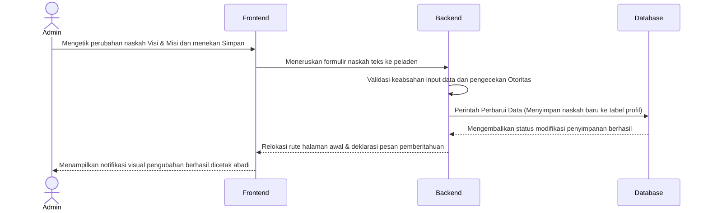
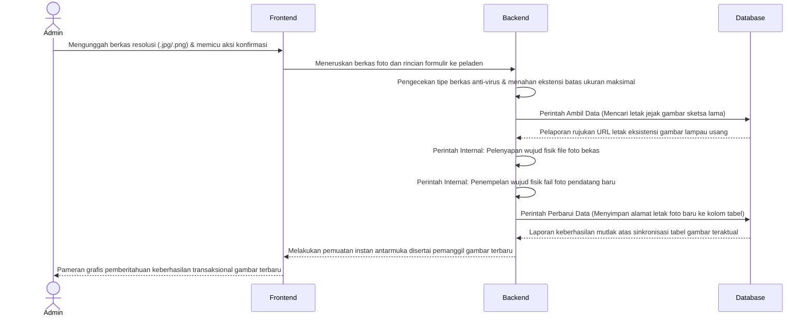
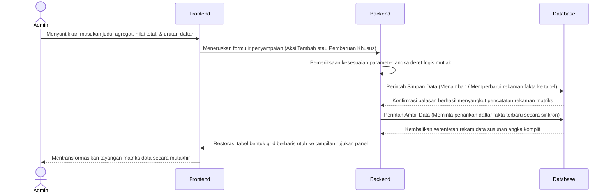
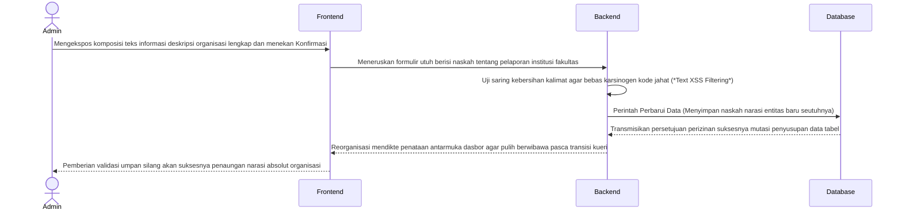

# BAB II — DIAGRAM URUTAN (SEQUENCE DIAGRAMS) LINGKUNGAN ADMINISTRATOR

Bagian ini mendeskripsikan secara teknis dan formal urutan pengiriman pesan (*message passing*) antar-objek atau pilar arsitektur sistem khusus untuk pilar manajemen operasional profil instansi di ranah Administrator. Interaksi ini murni menggunakan pendekatan kerangka kerja Arsitektur Lapis Tiga (Frontend, Backend, Database).

## 2.1 Diagram Sequence Manajemen Visi dan Misi Fakultas
**Deskripsi Alur:**
Administrator memulai sesi dengan mengirim draf pembaruan teks statis visi dan misi instansi lewat halaman panel antarmuka dasbor. Frontend meneruskan formulir data yang telah diisi utuh ke arah Backend. Backend kemudian mengeksekusi pemeriksaan sesi (*Session*) administrator pengakses. Bila mendapat izin autentikasi, Backend langsung menjalankan perintah pembaruan data untuk menimpa barisan tulisan basi di tabel Database. Usai Database mengamankan modifikasi barisnya, status pembaruan sah diumpan balik kepada Backend untuk dicetak menjadi notifikasi pemberitahuan (*Alert Success*) di layar Frontend sang Administrator.

## 2.2 Diagram Sequence Manajemen Struktur Organisasi (Upload Direktori Aset)
**Deskripsi Alur:**
Berbeda dengan sirkuit pengelolaan tulisan semata, manajemen sketsa grafis struktur kepemimpinan organisasi mengikutsertakan pertukaran rekaman fisik. Administrator mengunggah berkas foto (*File Upload*). Backend mutlak memeriksa validasi keamanan tipe bawaan file serta membatasi ukuran maksimalnya. Setelelahnya disetujui sah, Backend mengambil data gambar basi dari Database untuk menjalankan perintah hapus (*Unlink*) rekaman foto lama pada perantara penyimpanannya secara internal logis. Berlanjut menjalankan penyalinan grafis mutakhir *(Move_Uploaded_File)*. Backend mentransmisikan alamat letak direktori foto baru untuk diabadikan oleh sang Database.

## 2.3 Diagram Sequence Manajemen Fakta Sivitas Ekademika (CRUD Angka)
**Deskripsi Alur:**
Rancang bangun antarmuka pengelolaan matriks kalkulasi sivitas mahasiswa maupun jurnal (Fakta Fakultas) dioperasikan memakai prosedur silang baca tulisan Tambah / Modifikasi angka. Administrator mendikte penetapan identitas entitas berupa nama judul fakta, jumlah angka anggota, dan ketertiban tata urutan (*sorting order*). Usai melewati penapisan pelindung dari nilai keliru di Backend, data diteruskan lewat perintah penyimpanan spesifik Database MYSQL. Sesampainya perputaran status rekam sempurna terespons, rujukan matriks daftar tampilan tabel Frontend dideklarasikan secara otomatis.

## 2.4 Diagram Sequence Manajemen Tentang Fakultas 
**Deskripsi Alur:**
Kompleksitas pemeliharaan rangkuman deskriptif narasi murni sejarah instansi bertumpu utuh di perantara *Form Text Editor*. Pengguna otoritatif admin mendedikasikan penuangan gagasan reka pemaparan pada lajur isian Frontend. Eksekusi pengiriman isian menembus Backend validasi agar tiada pencemaran huruf berbahaya, barulah Backend memohon restu perintah pembaruan naratif ke Database untuk disimpan dan dibaca secara eksklusif berulang-ulang sampai masa revisi dicanangkan kelak.

