# Diagram Urutan (Sequence Diagram) — Website Fakultas Ilmu Komputer UNISAN

## Pengertian Sequence Diagram

*Sequence Diagram* adalah salah satu jenis diagram dalam UML (*Unified Modeling Language*) yang digunakan untuk menggambarkan urutan interaksi antar komponen sistem secara kronologis. Diagram ini memperlihatkan bagaimana objek atau komponen saling bertukar pesan dari atas ke bawah sesuai urutan waktu. Dalam sistem Web FIKOM, tiga komponen utama yang saling berinteraksi adalah **Frontend** (Browser pengguna/admin), **Backend** (Server PHP), dan **Database** (MySQL `db_web_fikom`).

---

## 2.1 Sequence Diagram — Login Administrator

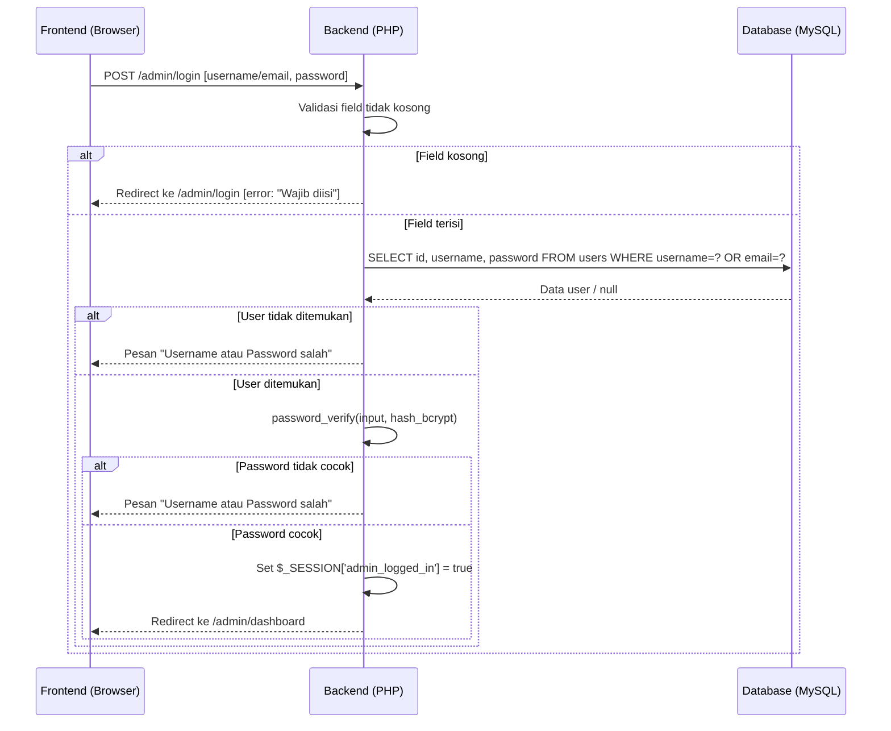

***Gambar 2.1** Login Administrator*

&nbsp;&nbsp;&nbsp;&nbsp;Gambar 2.1 di atas menjelaskan alur interaksi saat administrator melakukan login ke sistem. Admin mengisi form username/email dan password, lalu sistem memvalidasi data tersebut ke database menggunakan *Prepared Statement*. Jika data cocok, sistem membuat sesi login dan mengarahkan admin ke halaman dashboard. Jika tidak cocok, sistem menampilkan pesan kesalahan tanpa memberi tahu detail mana yang salah demi keamanan.

---

## 2.2 Sequence Diagram — Tambah Data Berita

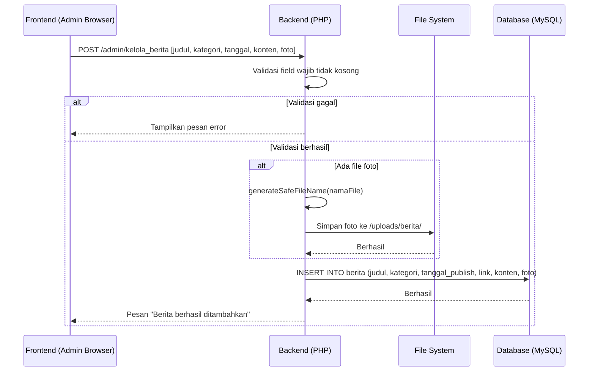

***Gambar 2.2** Tambah Data Berita*

&nbsp;&nbsp;&nbsp;&nbsp;Gambar 2.2 di atas menjelaskan alur interaksi saat admin menambahkan data berita baru. Admin mengisi form berita beserta foto opsional, kemudian sistem memvalidasi kelengkapan data. Jika ada foto yang diunggah, sistem membuat nama file unik secara otomatis sebelum menyimpannya ke server. Setelah semua proses selesai, data berita disimpan ke database dan admin mendapat konfirmasi keberhasilan.

---

## 2.3 Sequence Diagram — Edit Data Berita

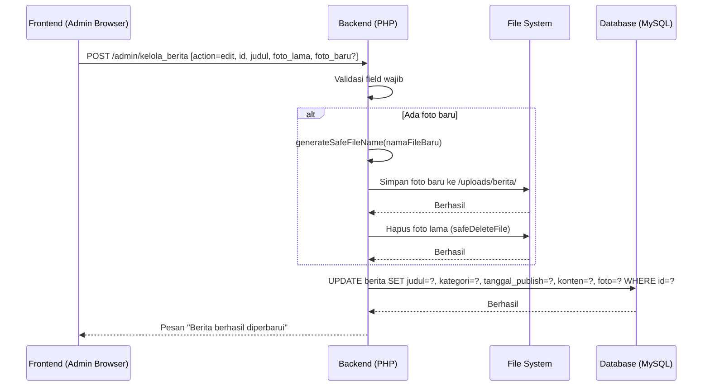

***Gambar 2.3** Edit Data Berita*

&nbsp;&nbsp;&nbsp;&nbsp;Gambar 2.3 di atas menjelaskan alur interaksi saat admin mengubah data berita yang sudah ada. Jika admin mengganti foto, sistem terlebih dahulu menyimpan foto baru ke server, kemudian menghapus foto lama. Urutan ini sengaja dirancang demikian agar foto lama tidak terhapus sebelum foto baru benar-benar tersimpan dengan aman. Setelah itu, data berita diperbarui di database.

---

## 2.4 Sequence Diagram — Hapus Data Berita

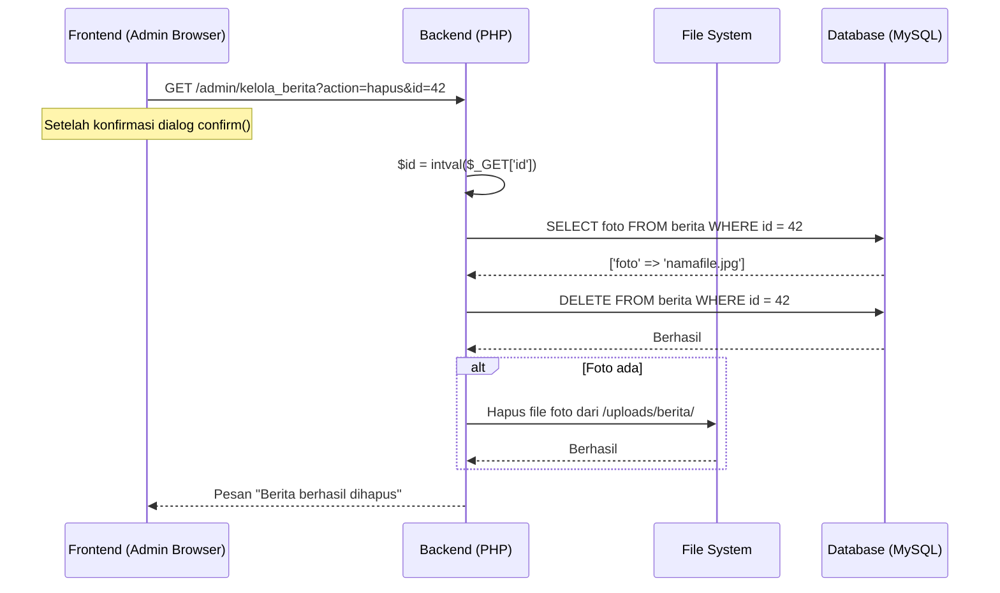

***Gambar 2.4** Hapus Data Berita*

&nbsp;&nbsp;&nbsp;&nbsp;Gambar 2.4 di atas menjelaskan alur interaksi saat admin menghapus data berita. Sebelum menghapus, sistem terlebih dahulu mengambil nama file foto yang terkait agar bisa dihapus dari server setelah data di database berhasil dihapus. Pendekatan ini memastikan tidak ada data yang tertinggal secara tidak konsisten, baik di database maupun di penyimpanan file server.

---

## 2.5 Sequence Diagram — Tambah dan Edit Data Dosen

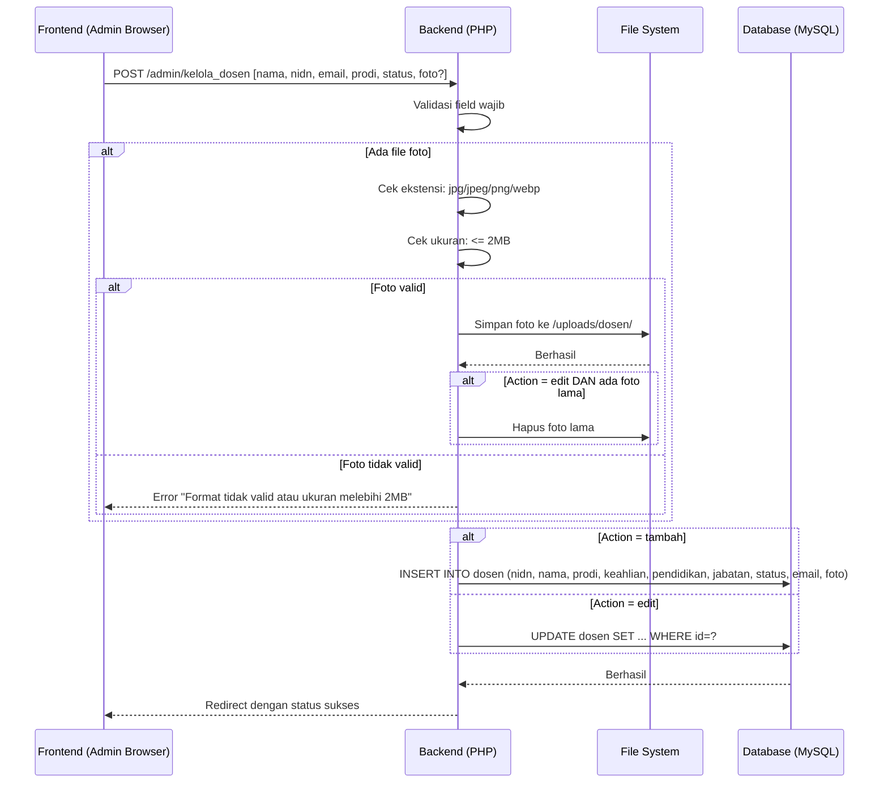

***Gambar 2.5** Tambah dan Edit Data Dosen*

&nbsp;&nbsp;&nbsp;&nbsp;Gambar 2.5 di atas menjelaskan alur interaksi saat admin mengelola data dosen, baik menambah maupun mengubah. Sistem memvalidasi foto yang diunggah dengan memeriksa jenis file dan ukurannya (maksimal 2MB). Setelah semua validasi lolos, data disimpan atau diperbarui di database dan sistem mengarahkan kembali ke halaman daftar dosen dengan pesan konfirmasi keberhasilan.

---

## 2.6 Sequence Diagram — Kelola Penelitian

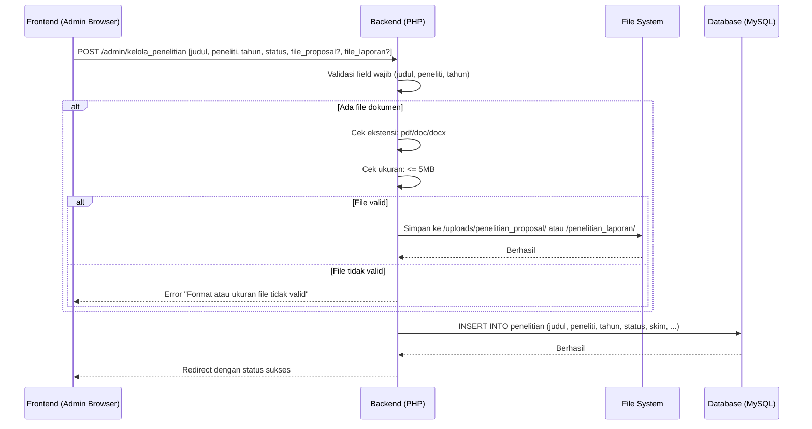

***Gambar 2.6** Kelola Penelitian*

&nbsp;&nbsp;&nbsp;&nbsp;Gambar 2.6 di atas menjelaskan alur interaksi saat admin menambahkan data penelitian dosen. Admin dapat mengunggah dua file sekaligus yaitu file proposal dan file laporan akhir ke folder yang berbeda di server. Sistem memvalidasi setiap file yang diunggah sebelum menyimpannya. Setelah semua data tersimpan, admin diarahkan kembali ke halaman daftar penelitian dengan notifikasi sukses.

---

## 2.7 Sequence Diagram — Kelola Pengabdian

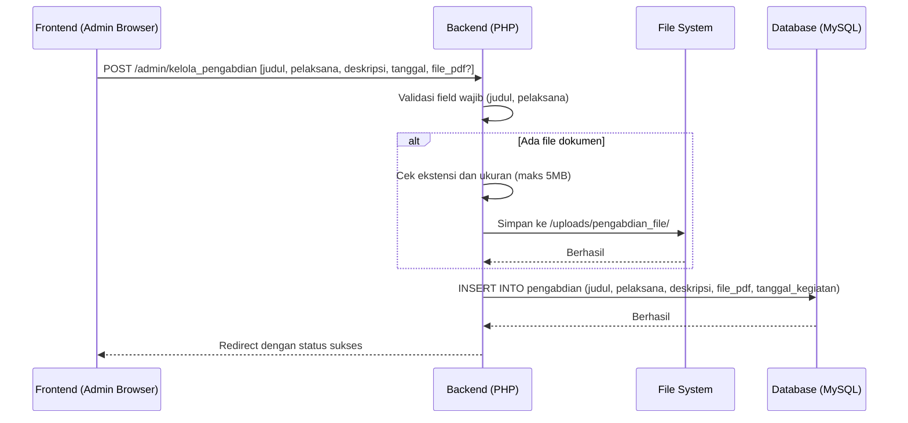

***Gambar 2.7** Kelola Pengabdian*

&nbsp;&nbsp;&nbsp;&nbsp;Gambar 2.7 di atas menjelaskan alur interaksi saat admin mencatat kegiatan pengabdian kepada masyarakat. Data yang wajib diisi adalah judul dan nama pelaksana, sedangkan file laporan bersifat opsional. Jika ada file yang diunggah, sistem memvalidasinya terlebih dahulu sebelum menyimpan ke server. Seluruh data kemudian disimpan ke tabel pengabdian di database.

---

## 2.8 Sequence Diagram — Akses Halaman Publik Frontend

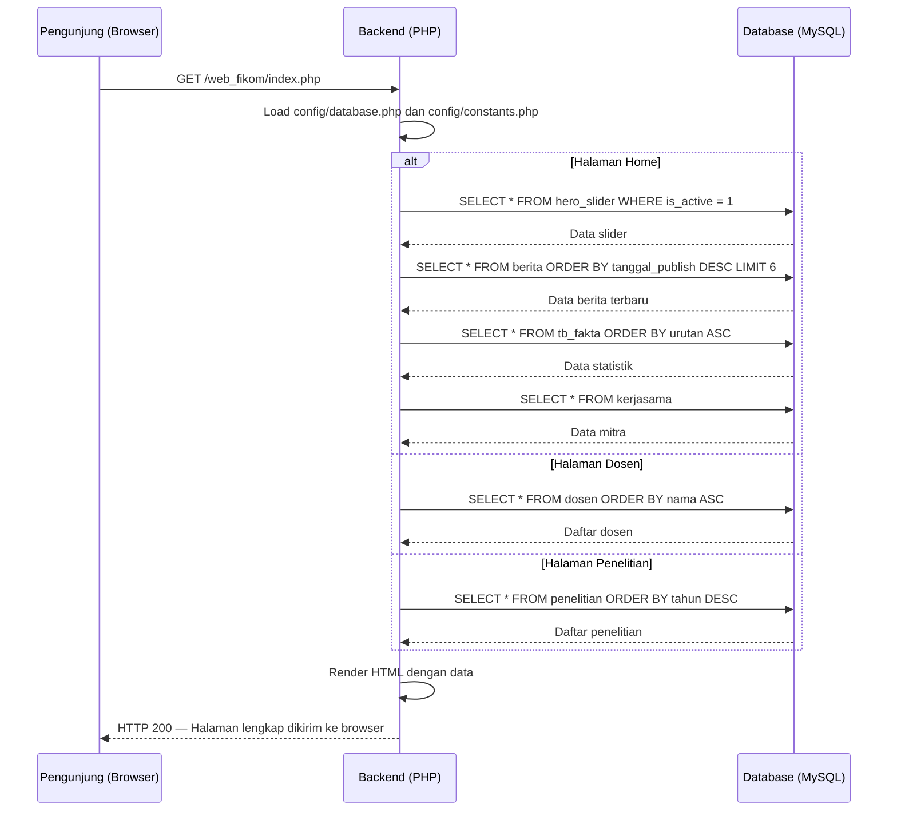

***Gambar 2.8** Akses Halaman Publik Frontend*

&nbsp;&nbsp;&nbsp;&nbsp;Gambar 2.8 di atas menjelaskan alur interaksi saat pengunjung membuka halaman website. Sistem secara otomatis mengambil data dari database sesuai halaman yang dibuka, kemudian merender seluruh konten menjadi halaman HTML lengkap sebelum dikirimkan ke browser pengunjung. Proses ini terjadi sepenuhnya di sisi server (*Server-Side Rendering*) sehingga pengunjung langsung menerima halaman yang sudah berisi data terbaru tanpa memerlukan proses tambahan di sisi browser.

---

## 2.9 Sequence Diagram — Validasi Sesi Admin

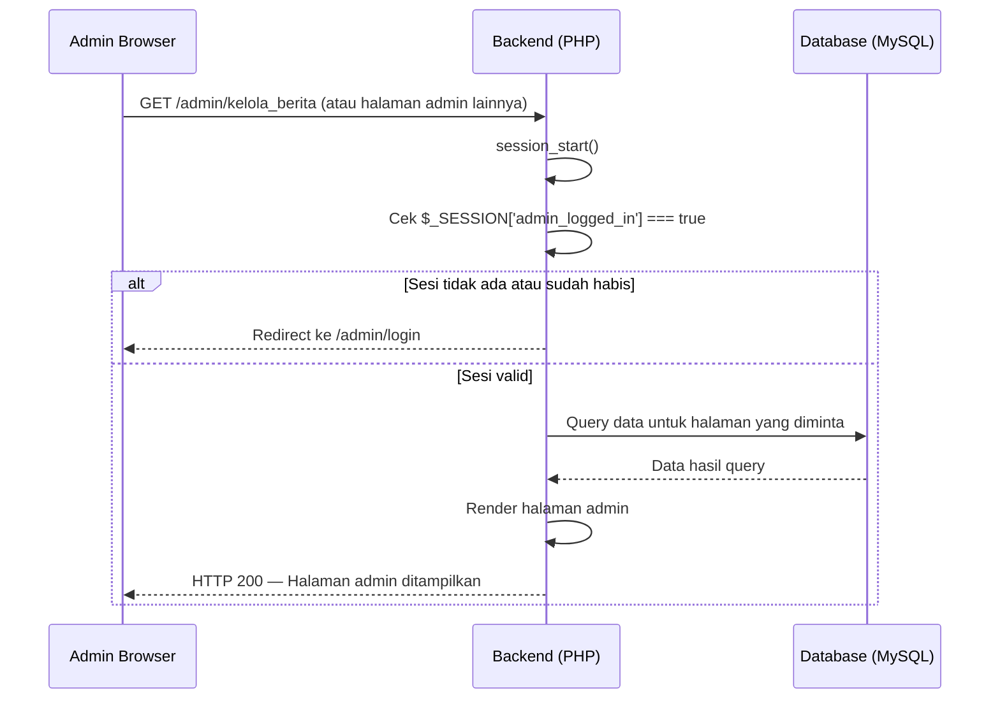

***Gambar 2.9** Validasi Sesi Admin*

&nbsp;&nbsp;&nbsp;&nbsp;Gambar 2.9 di atas menjelaskan alur interaksi saat admin mengakses halaman panel admin. Setiap halaman admin selalu memeriksa sesi login terlebih dahulu sebelum menampilkan apapun. Jika sesi tidak ditemukan atau sudah habis masa berlakunya, sistem langsung mengarahkan pengguna ke halaman login. Mekanisme ini memastikan seluruh halaman admin tidak dapat diakses oleh siapapun yang belum terautentikasi.

---

## 2.10 Sequence Diagram — Pendaftaran Mahasiswa Baru

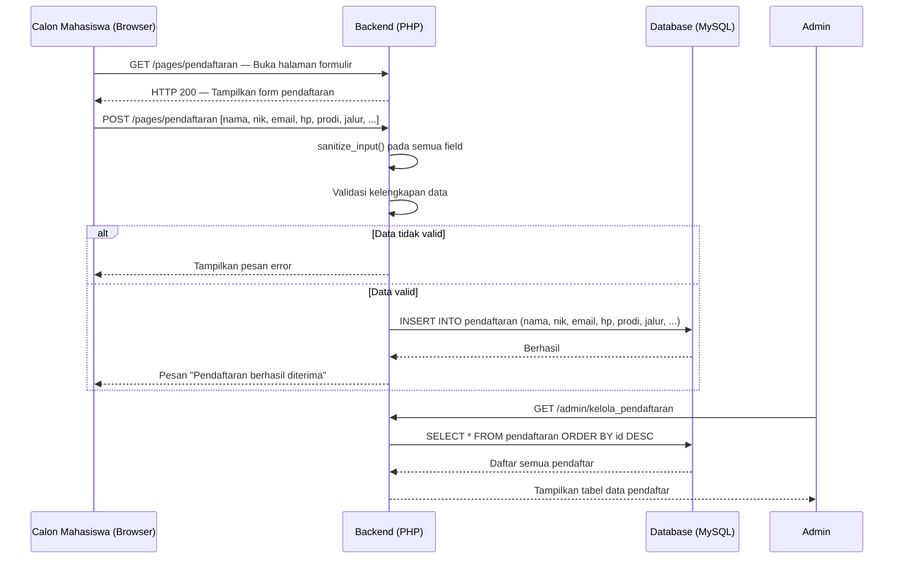

***Gambar 2.10** Pendaftaran Mahasiswa Baru*

&nbsp;&nbsp;&nbsp;&nbsp;Gambar 2.10 di atas menjelaskan alur interaksi antara calon mahasiswa yang mendaftar secara online dan administrator yang memverifikasi data. Calon mahasiswa mengisi formulir di halaman publik, lalu sistem membersihkan dan memvalidasi data sebelum menyimpannya ke database. Setelah pendaftaran berhasil, administrator dapat melihat seluruh data pendaftar melalui panel admin dan menindaklanjutinya sesuai prosedur penerimaan mahasiswa baru.

---

## 2.11 Sequence Diagram — Dashboard Statistik Admin

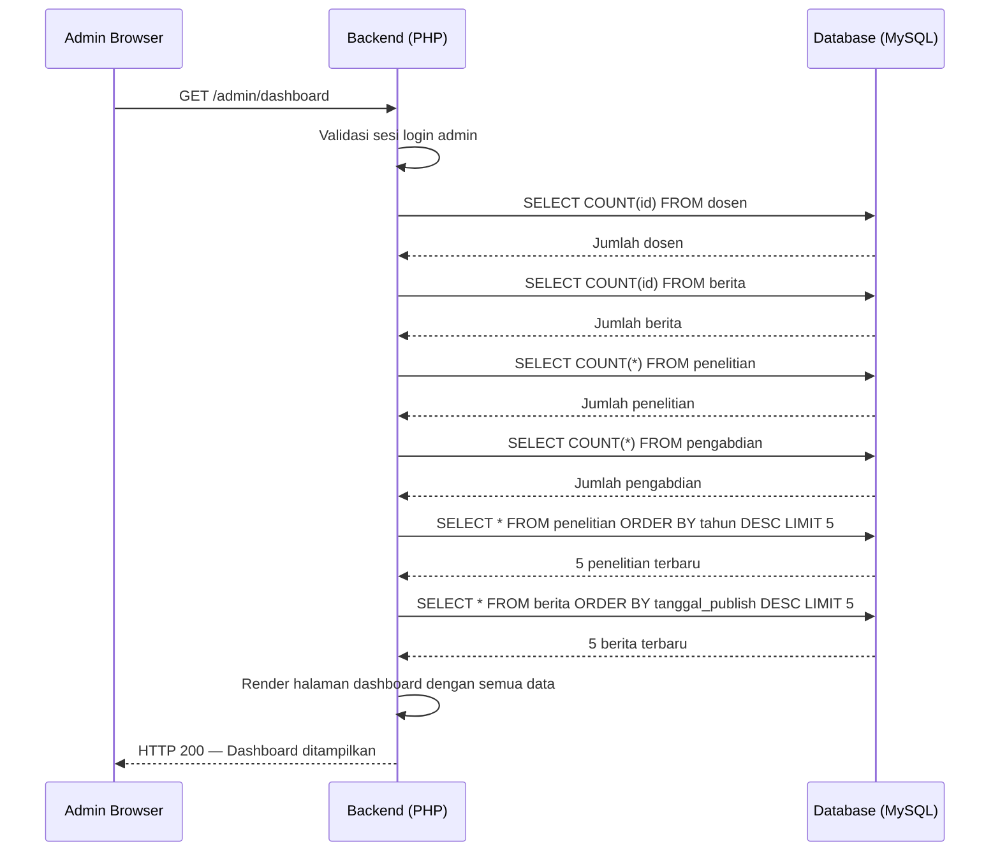

***Gambar 2.11** Dashboard Statistik Admin*

&nbsp;&nbsp;&nbsp;&nbsp;Gambar 2.11 di atas menjelaskan alur interaksi saat admin membuka halaman dashboard. Sistem secara berurutan melakukan beberapa query ke database untuk mendapatkan data statistik jumlah dosen, berita, penelitian, dan pengabdian. Selain angka statistik, dashboard juga menampilkan daftar penelitian dan berita terbaru sebagai ringkasan aktivitas sistem. Semua data ini kemudian dikirimkan ke tampilan (*View*) untuk dirender menjadi informasi visual berupa kartu statistik dan tabel yang informatif bagi admin.

---

*Dokumen Sequence Diagram ini merupakan bagian dari dokumentasi teknis skripsi Website Fakultas Ilmu Komputer Universitas Muhammadiyah Sidenreng Rappang (UNISAN).*
