# Diagram Urutan (Sequence Diagram) — Website Fakultas Ilmu Komputer UNISAN

## Pengertian Sequence Diagram

*Sequence Diagram* merupakan salah satu jenis diagram interaksi dalam *Unified Modeling Language* (UML) yang secara khusus bertujuan untuk merepresentasikan urutan pertukaran pesan (*message exchange*) antar objek atau komponen dalam suatu sistem secara kronologis. Diagram ini membaca alur interaksi dari atas ke bawah sesuai urutan waktu terjadinya, sehingga sangat efektif untuk memvisualisasikan skenario penggunaan (*use case*) tertentu beserta respons yang dihasilkan sistem pada setiap tahap. Penggunaan *Sequence Diagram* dalam dokumentasi teknis akademik bertujuan untuk menjelaskan protokol komunikasi antar lapisan arsitektur sistem secara rinci dan terstruktur.

Dalam sistem Web FIKOM, tiga komponen utama yang berinteraksi adalah: **Frontend** (Browser pengunjung/admin), **Backend** (Server PHP), dan **Database** (MySQL `db_web_fikom`).

---

## 2.1 Sequence Diagram — Autentikasi Login Administrator

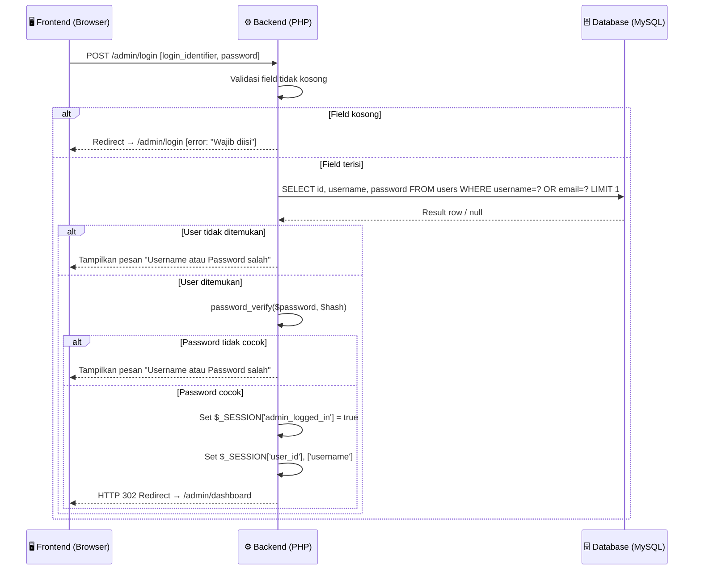

***Gambar 2.1** Sequence Diagram Autentikasi Login Administrator*

Diagram ini mengilustrasikan protokol autentikasi administrator sistem Web FIKOM. Proses dimulai dengan pengiriman data formulir menggunakan metode `POST` ke `admin/login.php` yang memuat `login_identifier` (dapat berupa *username* atau *email*) dan *password*. *Backend* PHP memvalidasi kelengkapan *field* terlebih dahulu sebelum mengeksekusi *query* `SELECT` ke tabel `users` menggunakan *Prepared Statement* untuk mencegah injeksi SQL. **Verifikasi kata sandi** dilakukan melalui fungsi `password_verify()` yang membandingkan input pengguna dengan nilai *hash* bcrypt yang tersimpan di basis data. Apabila seluruh tahap validasi berhasil, sesi PHP diregistrasi dan sistem mengembalikan respons HTTP 302 *redirect* ke halaman *dashboard*; pada setiap skenario kegagalan, sistem menampilkan pesan kesalahan generik yang tidak mengungkapkan detail kegagalan untuk alasan keamanan.

---

## 2.2 Sequence Diagram — Tambah Data Berita (Create)

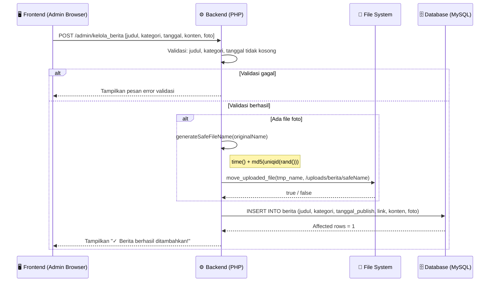

***Gambar 2.2** Sequence Diagram Tambah Data Berita*

Diagram ini merepresentasikan alur penambahan data berita baru ke sistem. *Backend* PHP menerima data formulir multipart yang berisi teks berita dan opsional file foto. Validasi dilakukan pada tiga *field* wajib: judul, kategori, dan tanggal publikasi. **Apabila foto diunggah**, sistem mengeksekusi fungsi `generateSafeFileName()` yang menghasilkan nama file unik berbasis gabungan `time()` dan `md5(uniqid(rand(), true))` untuk mencegah konflik penggantian nama file (*filename collision*). File kemudian dipindahkan ke direktori `uploads/berita/` menggunakan `move_uploaded_file()`. Data berita kemudian disimpan ke tabel `berita` melalui *query* `INSERT` dengan *Prepared Statement* yang mengikat enam parameter bertipe string secara berurutan.

---

## 2.3 Sequence Diagram — Edit Data Berita (Update)

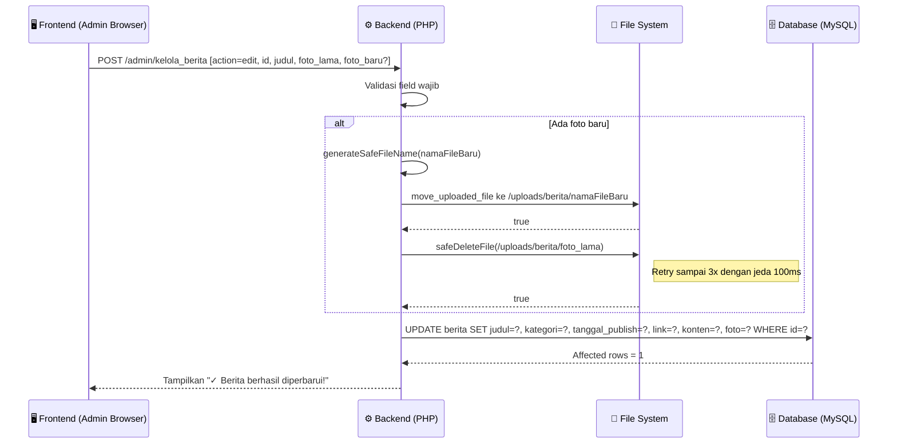

***Gambar 2.3** Sequence Diagram Edit Data Berita*

Diagram ini menggambarkan alur pembaruan data berita yang sudah ada. Formulir mengirimkan referensi foto lama (`foto_lama`) sebagai *hidden input* untuk memungkinkan sistem mengambil keputusan penghapusan. **Mekanisme penggantian foto** mengimplementasikan strategi *replace-then-delete*: file baru lebih dahulu dipindahkan ke direktori tujuan, kemudian file lama dihapus menggunakan fungsi `safeDeleteFile()` yang mencoba penghapusan hingga tiga iterasi dengan jeda `usleep(100000)` (100ms) antar percobaan untuk menangani kemungkinan *file lock* pada sistem operasi Windows/*XAMPP*. Operasi `UPDATE` ke tabel `berita` menggunakan *Prepared Statement* dengan tujuh parameter untuk memastikan keamanan data.

---

## 2.4 Sequence Diagram — Upload Foto dan Hapus File Lama (Dosen)

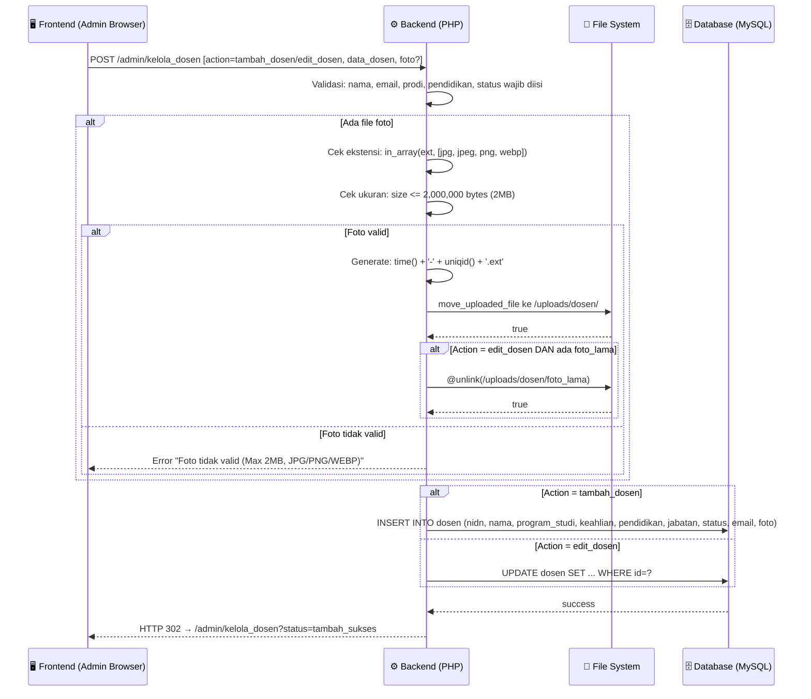

***Gambar 2.4** Sequence Diagram Upload Foto dan Manajemen File Dosen*

Diagram ini merepresentasikan mekanisme pengelolaan file foto pada modul data dosen yang mengimplementasikan validasi berlapis. Sistem memvalidasi dua aspek file secara berurutan: pertama memeriksa ekstensi file menggunakan `in_array()` terhadap array tipe yang diizinkan, kemudian memeriksa ukuran file tidak melebihi batas 2MB (2.000.000 *bytes*). **Nama file baru** dibangkitkan menggunakan gabungan `time()` dan `uniqid()` untuk menghasilkan nama yang unik secara kriptografis. Setelah operasi database berhasil, sistem tidak merender respons di halaman yang sama melainkan mengeksekusi *header redirect* dengan parameter status untuk mencegah pengiriman formulir berulang (*duplicate submission*) apabila pengguna me-*refresh* halaman.

---

## 2.5 Sequence Diagram — Hapus Data (Delete dengan File Cleanup)

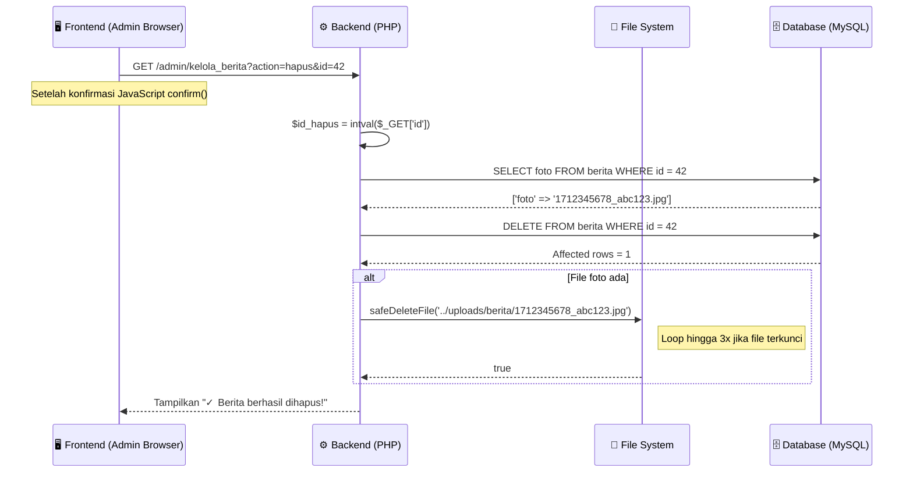

***Gambar 2.5** Sequence Diagram Hapus Data dengan File Cleanup*

Diagram ini mengilustrasikan prosedur penghapusan data yang memperhatikan integritas konsistensi antara basis data dan sistem berkas. Sebelum mengeksekusi perintah `DELETE`, sistem terlebih dahulu mengeksekusi `SELECT foto` untuk mendapatkan referensi nama file yang terkait dengan rekaman tersebut. **Urutan operasi dipilih secara hati-hati**: database dihapus terlebih dahulu, baru kemudian file fisik dihapus dari sistem berkas; strategi ini dipilih karena kehilangan referensi database dianggap lebih kritis daripada meninggalkan *orphaned file* yang sewaktu-waktu masih bisa dibersihkan secara manual. Parameter `id` yang diterima melalui `GET` dikonversi menggunakan fungsi `intval()` untuk mencegah injeksi SQL pada operasi `DELETE`.

---

## 2.6 Sequence Diagram — Akses Halaman Publik Frontend

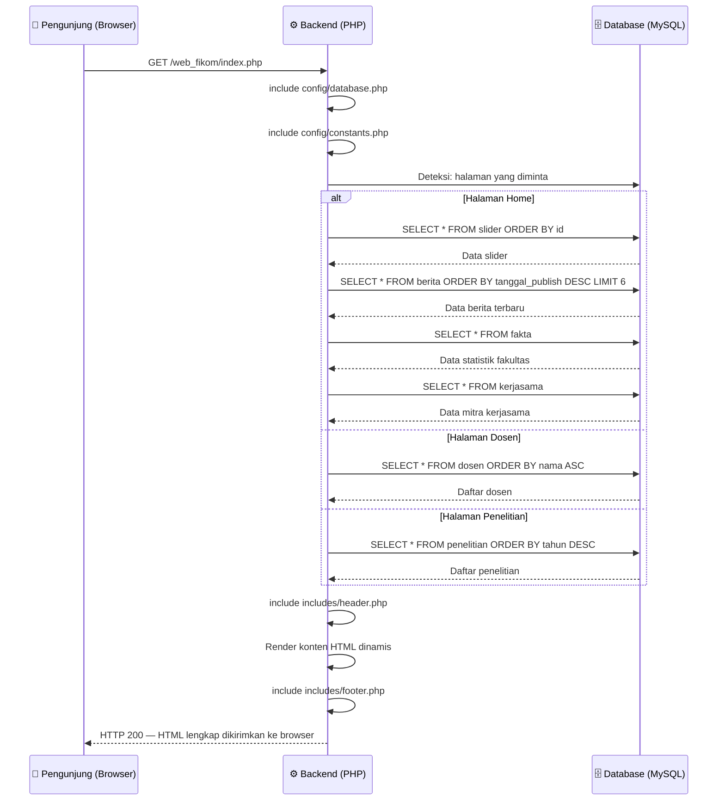

***Gambar 2.6** Sequence Diagram Akses Halaman Publik Frontend*

Diagram ini merepresentasikan arsitektur *Server-Side Rendering* (SSR) yang digunakan pada seluruh halaman publik website. Setiap permintaan `GET` dari browser pengunjung ditangani oleh PHP yang mengeksekusi satu atau lebih *query* ke basis data `db_web_fikom` sesuai halaman yang diminta. File konfigurasi `config/database.php` menginstansiasi objek `$conn` (koneksi `mysqli`) dan `config/constants.php` mendefinisikan konstanta jalur dan URL dinamis. **Komponen *header* dan *footer*** disertakan (*include*) secara berulang dari file `includes/header.php` dan `includes/footer.php` untuk menjaga konsistensi navigasi dan tampilan di seluruh halaman. Sistem mengembalikan respons HTTP 200 dengan dokumen HTML lengkap yang telah dirender dengan data terbaru dari basis data.

---

## 2.7 Sequence Diagram — Validasi Sesi (Session Guard)

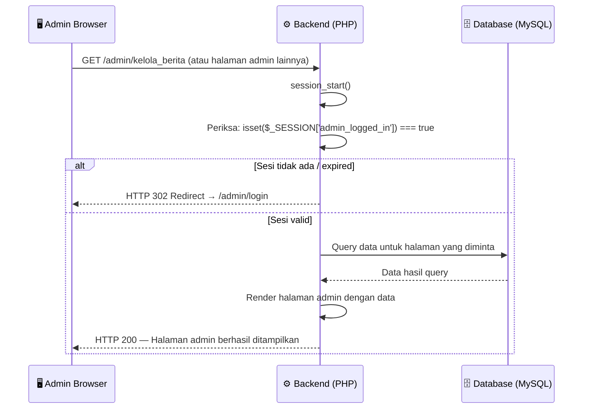

***Gambar 2.7** Sequence Diagram Validasi Sesi (Session Guard)*

Diagram ini menggambarkan mekanisme *session guard* yang melindungi seluruh halaman panel administrator dari akses tidak sah. Setiap kali halaman admin dimuat, sistem memanggil `session_start()` dan memverifikasi keberadaan variabel sesi `$_SESSION['admin_logged_in']` yang harus bernilai `true`. **Apabila sesi tidak ditemukan** atau sudah kedaluwarsa (setelah `SESSION_LIFETIME` = 3600 detik sebagaimana didefinisikan di `config/constants.php`), sistem segera mengembalikan respons HTTP 302 dan mengarahkan ke halaman login tanpa mengeksekusi baris kode berikutnya. Mekanisme validasi sesi ini diimplementasikan pada seluruh halaman admin baik melalui pengecekan `$_SESSION['admin_logged_in']` secara langsung maupun melalui pemanggilan fungsi bantuan `is_logged_in()` yang didefinisikan di `includes/functions.php`.

---

## 2.8 Sequence Diagram — Kelola Pendaftaran Mahasiswa Baru

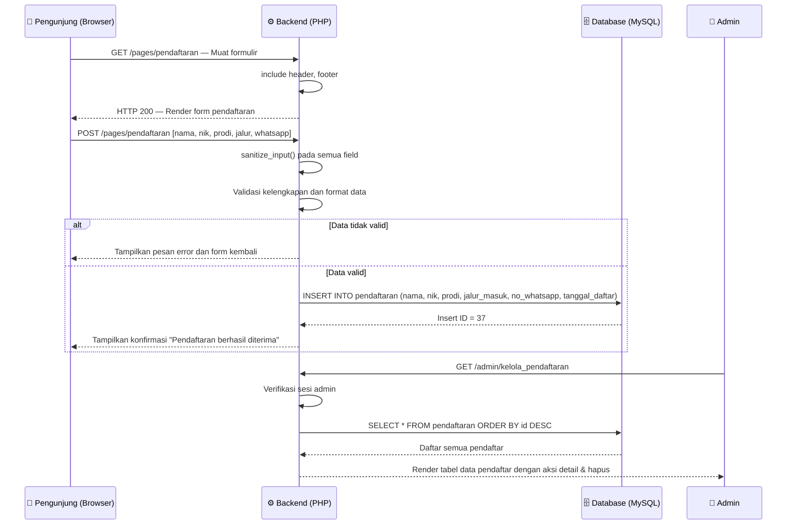

***Gambar 2.8** Sequence Diagram Kelola Pendaftaran Mahasiswa Baru*

Diagram ini merepresentasikan dua perspektif interaksi yang terintegrasi: pengisian formulir oleh calon mahasiswa di *frontend* dan pengelolaan data oleh administrator di *backend*. Seluruh input dari formulir publik diproses melalui fungsi `sanitize_input()` yang mengeksekusi tiga operasi pembersihan secara berantai: `trim()` untuk menghapus spasi berlebih, `stripslashes()` untuk menghilangkan karakter *escape*, dan `htmlspecialchars()` dengan *flag* `ENT_QUOTES` untuk mengonversi karakter HTML spesial. **Data bersih kemudian disimpan** ke tabel `pendaftaran` menggunakan *Prepared Statement*. Dari sisi administrator, data pendaftar ditampilkan dalam tabel responsif dilengkapi tautan WhatsApp *click-to-chat* yang menggunakan nomor yang tersimpan di basis data, memfasilitasi komunikasi langsung antara panitia PMB dan calon mahasiswa.

---

## 2.9 Sequence Diagram — Kelola Penelitian dan Pengabdian

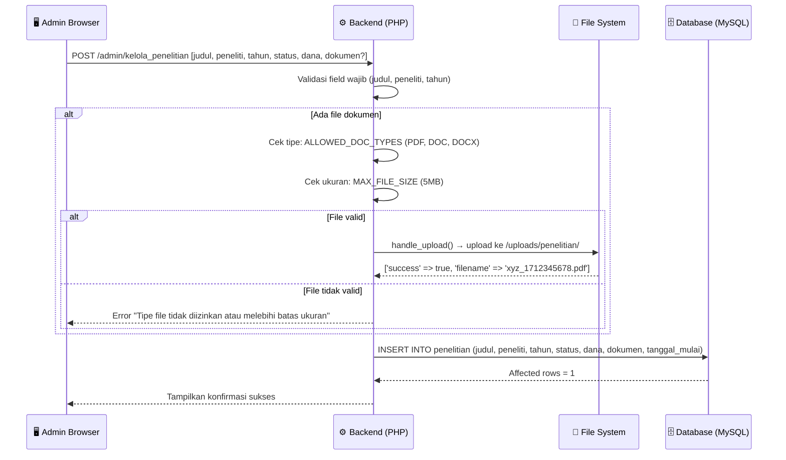

***Gambar 2.9** Sequence Diagram Kelola Penelitian*

Diagram ini mengilustrasikan alur penyimpanan data kegiatan penelitian dosen yang mendukung unggahan dokumen pendukung. Validasi file dokumen menggunakan konstanta `ALLOWED_DOC_TYPES` dan `MAX_FILE_SIZE` yang didefinisikan terpusat di `config/constants.php` untuk kemudahan pemeliharaan. Fungsi `handle_upload()` dari `includes/functions.php` mengabstraksi logika pengunggahan file yang mencakup pengecekan tipe MIME, validasi ukuran, pembuatan direktori otomatis menggunakan `mkdir()` jika belum ada, dan pemindahan file dengan nama unik berbasis `uniqid() + time()`. **Data penelitian** yang tersimpan kemudian dapat diakses oleh pengunjung publik melalui halaman `pages/penelitian.php` sebagai portofolio riset fakultas.

---

## 2.10 Sequence Diagram — Dashboard Statistik Admin

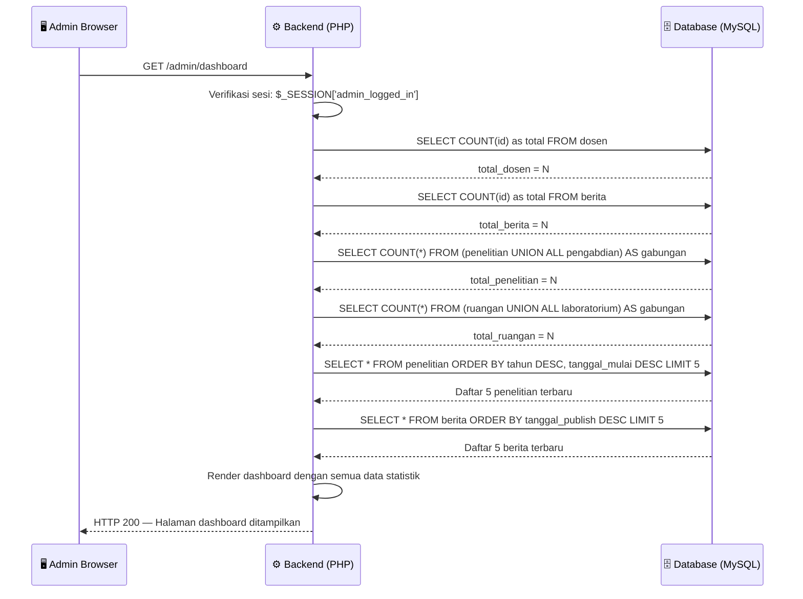

***Gambar 2.10** Sequence Diagram Dashboard Statistik Admin*

Diagram ini merepresentasikan alur pengambilan data agregat pada halaman *dashboard* administrator. Empat kartu statistik utama memerlukan empat *query* `COUNT` terpisah ke tabel `dosen`, `berita`, serta gabungan `penelitian UNION ALL pengabdian`, dan `ruangan UNION ALL laboratorium`. **Pendekatan `UNION ALL`** digunakan untuk menggabungkan hasil hitung dari dua tabel berbeda ke dalam satu nilai total tanpa overhead *subquery* yang kompleks. Selain statistik agregat, *dashboard* juga menampilkan dua tabel aktivitas terbaru (lima penelitian dan lima berita terbaru) yang diurutkan berdasarkan tanggal terbaru. Seluruh *query* dieksekusi secara sekuensial dalam satu siklus permintaan-respons HTTP sebelum halaman dirender.

---

## 2.11 Sequence Diagram — Pencarian Data Dosen dengan Filter Prodi

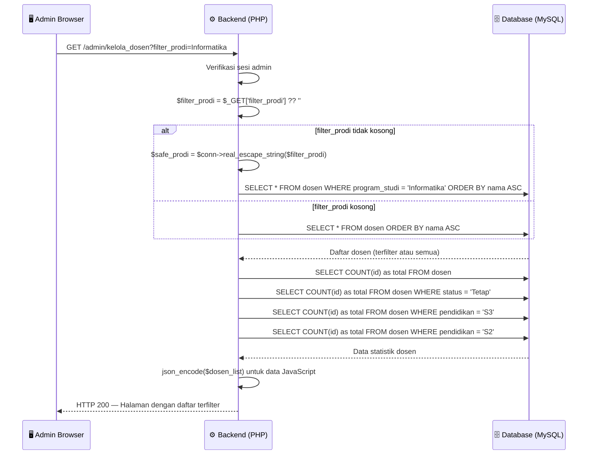

***Gambar 2.11** Sequence Diagram Filter Data Dosen*

Diagram ini menggambarkan mekanisme pemfilteran data dosen berdasarkan Program Studi melalui parameter `GET`. Nilai filter yang diterima dari *query string* diproses menggunakan `$conn->real_escape_string()` sebagai lapisan perlindungan tambahan terhadap injeksi SQL, meskipun sistem secara umum mengandalkan *Prepared Statement*. **Selain data daftar yang terfilter**, sistem juga mengeksekusi empat *query* statistik tambahan untuk kartu ringkasan (total dosen, dosen tetap, doktor S3, magister S2) yang ditampilkan di atas tabel. Data dosen secara keseluruhan juga diencode ke format JSON menggunakan `json_encode()` dan disisipkan ke atribut `data-dosen` di elemen HTML tersembunyi sebagai sumber data untuk manipulasi *modal popup* melalui JavaScript di sisi klien.

---

*Dokumen Sequence Diagram ini merupakan bagian dari dokumentasi teknis skripsi Website Fakultas Ilmu Komputer Universitas Muhammadiyah Sidenreng Rappang (UNISAN).*
