# BAB II — Diagram Urutan (Sequence Diagram)

## 2.1 Pengertian Sequence Diagram

*Sequence Diagram* merupakan salah satu jenis diagram dalam notasi UML (*Unified Modeling Language*) yang digunakan untuk menggambarkan urutan interaksi antar komponen sistem secara kronologis berdasarkan alur waktu. Diagram ini memperlihatkan bagaimana objek atau komponen saling bertukar pesan dari atas ke bawah mengikuti dimensi waktu. Dalam sistem Web FIKOM, tiga komponen utama yang terlibat dalam setiap interaksi adalah **Frontend** (peramban pengguna atau administrator), **Backend** (peladen PHP), dan **Database** (MySQL `db_web_fikom`).

---

## 2.2 Sequence Diagram Login Administrator

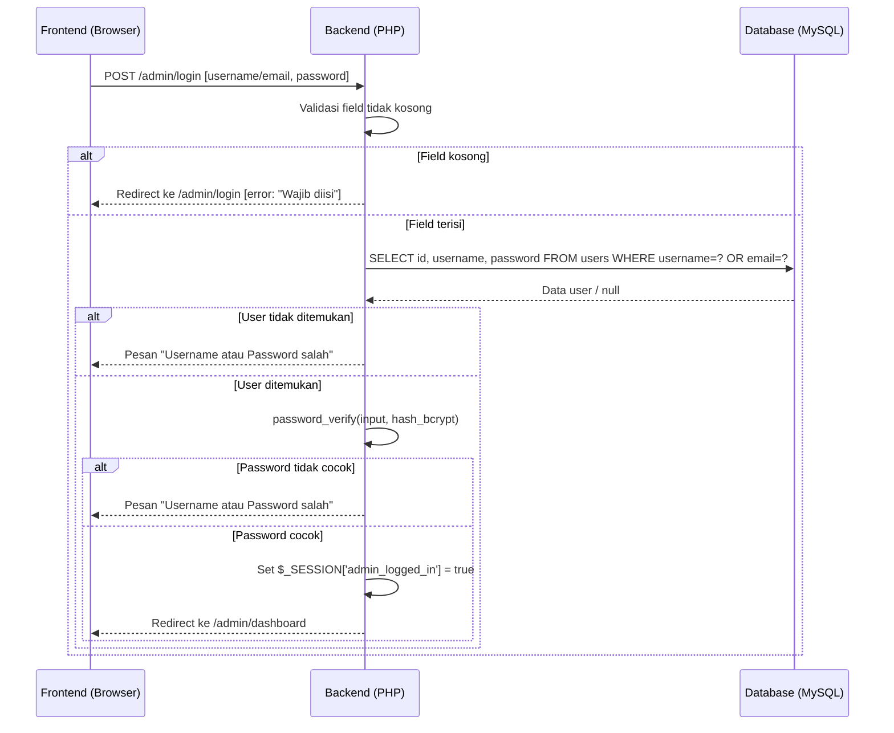

***Gambar 2.1** Sequence Diagram Login Administrator*

&nbsp;&nbsp;&nbsp;&nbsp;Gambar 2.1 di atas menggambarkan alur interaksi yang terjadi pada proses autentikasi administrator ke dalam sistem. Administrator menginputkan kredensial berupa *username* atau alamat surel beserta kata sandi melalui antarmuka formulir login. Selanjutnya, lapisan *backend* melaksanakan validasi kelengkapan data masukan sebelum mengirimkan kueri ke basis data menggunakan mekanisme *Prepared Statement* guna mencegah injeksi SQL. Apabila data yang dimasukkan tidak sesuai dengan rekaman dalam basis data, sistem akan mengembalikan pesan kesalahan yang bersifat umum tanpa mengungkapkan detail kegagalan secara spesifik, sebagai bagian dari mekanisme perlindungan informasi sensitif. Sebaliknya, apabila verifikasi kata sandi menggunakan fungsi `password_verify()` berhasil, sistem akan membuat variabel sesi `$_SESSION['admin_logged_in']` dan mengarahkan pengguna ke halaman dasbor administrasi.

---

## 2.3 Sequence Diagram Tambah Data Berita

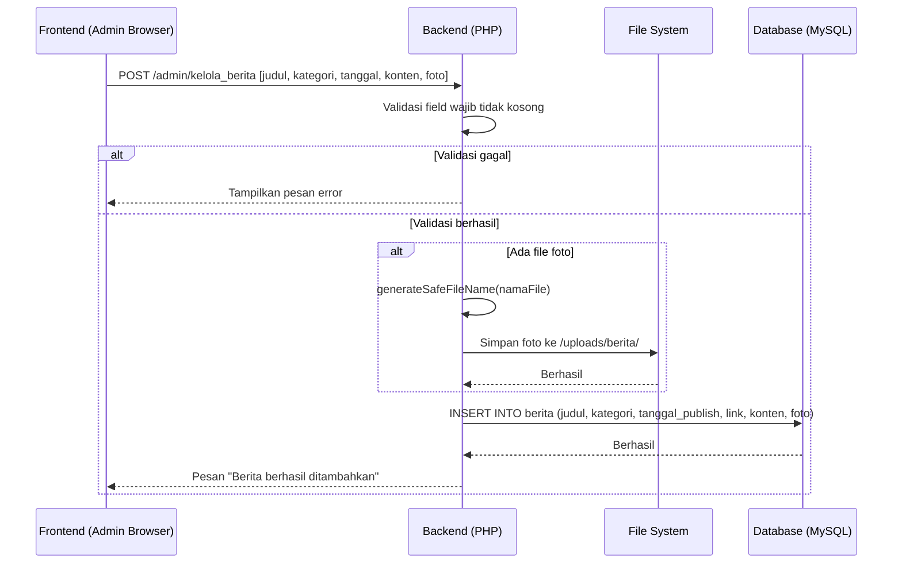

***Gambar 2.2** Sequence Diagram Tambah Data Berita*

&nbsp;&nbsp;&nbsp;&nbsp;Gambar 2.2 di atas menggambarkan alur interaksi yang terjadi pada proses penambahan data berita oleh administrator. Administrator mengisi formulir data berita yang mencakup judul, kategori, tanggal publikasi, dan konten artikel, disertai berkas foto yang bersifat opsional. Sistem kemudian melaksanakan validasi terhadap kelengkapan *field* wajib sebelum memproses berkas foto. Apabila terdapat berkas foto yang diunggah, sistem secara otomatis membangkitkan nama berkas yang unik melalui fungsi `generateSafeFileName()` untuk mencegah konflik penamaan berkas, lalu menyimpannya ke direktori `uploads/berita/` di server. Setelah seluruh proses penyimpanan berkas selesai, data berita disimpan ke dalam tabel `berita` pada basis data menggunakan *Prepared Statement*, dan sistem menampilkan konfirmasi keberhasilan kepada administrator.

---

## 2.4 Sequence Diagram Edit Data Berita

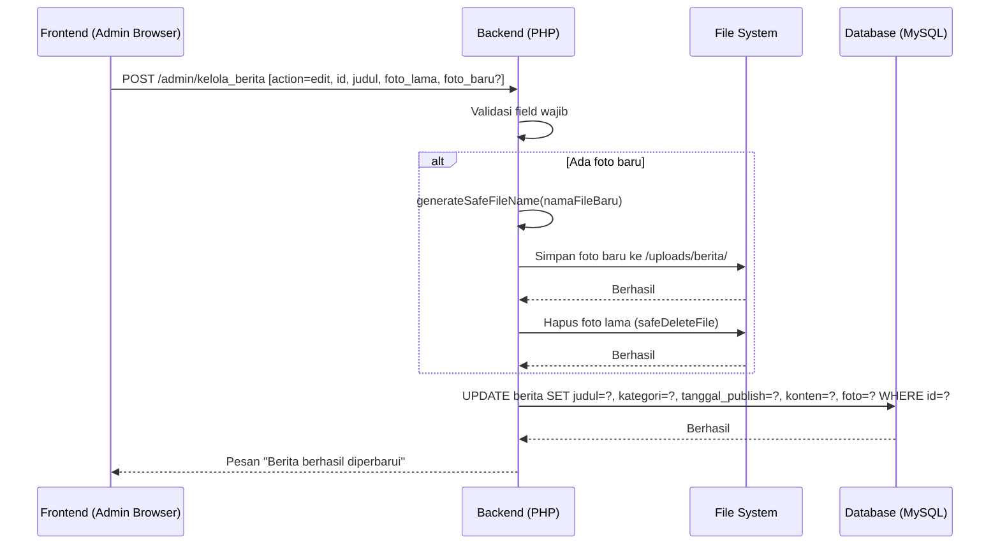

***Gambar 2.3** Sequence Diagram Edit Data Berita*

&nbsp;&nbsp;&nbsp;&nbsp;Gambar 2.3 di atas menggambarkan alur interaksi yang terjadi pada proses pembaruan data berita yang telah tersimpan dalam basis data. Administrator mengirimkan permintaan pembaruan beserta data terbaru melalui formulir yang sama dengan formulir penambahan. Apabila administrator mengganti berkas foto, sistem terlebih dahulu menyimpan berkas foto baru ke server dan membangkitkan nama berkas yang unik, baru kemudian menghapus berkas foto lama melalui fungsi `safeDeleteFile()`. Urutan operasi ini dirancang secara sengaja untuk memastikan konsistensi data, yakni berkas foto lama tidak akan dihapus sebelum berkas foto baru terkonfirmasi tersimpan dengan sempurna di server. Setelah penanganan berkas foto selesai, sistem memperbarui rekaman berita pada basis data menggunakan perintah `UPDATE` dengan *Prepared Statement* berdasarkan parameter identifikasi unik (`id`).

---

## 2.5 Sequence Diagram Hapus Data Berita

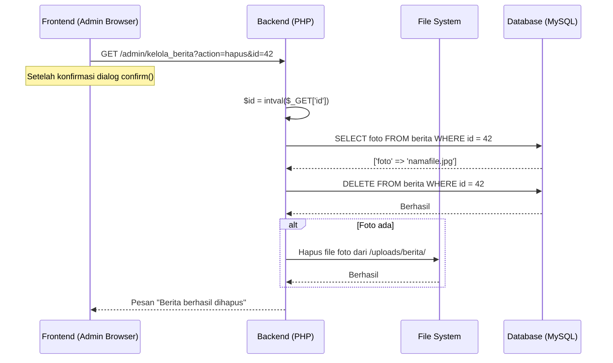

***Gambar 2.4** Sequence Diagram Hapus Data Berita*

&nbsp;&nbsp;&nbsp;&nbsp;Gambar 2.4 di atas menggambarkan alur interaksi yang terjadi pada proses penghapusan data berita oleh administrator. Sebelum mengeksekusi perintah penghapusan, sistem terlebih dahulu mengambil nama berkas foto yang terkait dengan rekaman berita yang akan dihapus melalui kueri `SELECT`. Langkah ini merupakan bagian dari mekanisme pembersihan data yang dirancang untuk menjaga konsistensi antara basis data dan sistem berkas (*file system*) server. Setelah rekaman berhasil dihapus dari tabel `berita`, sistem secara otomatis menghapus berkas foto fisik dari direktori `uploads/berita/`. Pendekatan dua tahap ini memastikan tidak terdapat berkas yang tertinggal (*orphan files*) di server yang dapat menyebabkan pemborosan kapasitas penyimpanan.

---

## 2.6 Sequence Diagram Tambah dan Edit Data Dosen

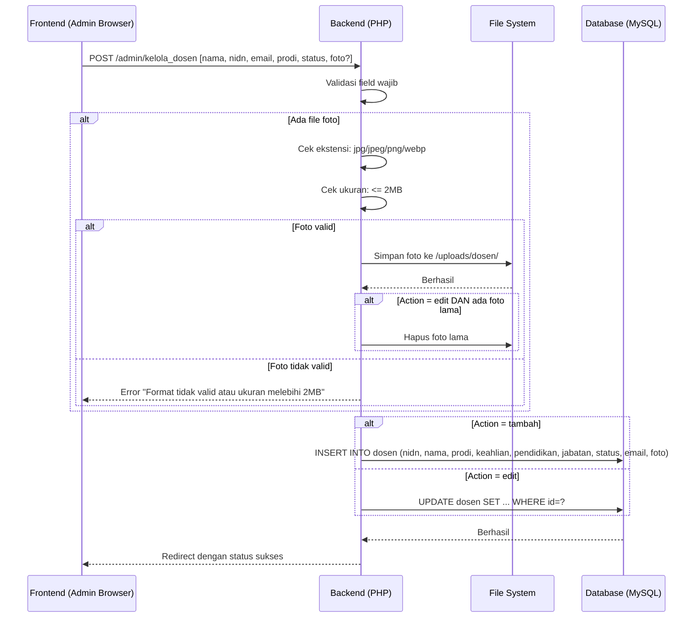

***Gambar 2.5** Sequence Diagram Tambah dan Edit Data Dosen*

&nbsp;&nbsp;&nbsp;&nbsp;Gambar 2.5 di atas menggambarkan alur interaksi yang terjadi pada proses pengelolaan data dosen, baik dalam operasi penambahan maupun pembaruan data. Administrator mengirimkan data dosen melalui formulir yang mencakup atribut-atribut seperti nama lengkap, NIDN, program studi, keahlian, jenjang pendidikan, jabatan fungsional, status kepegawaian, serta alamat surel. Apabila terdapat berkas foto dosen yang diunggah, sistem melaksanakan dua tahap validasi secara berurutan, yakni verifikasi ekstensi berkas yang hanya mengizinkan format JPG, JPEG, PNG, dan WebP, serta verifikasi ukuran berkas yang dibatasi maksimal 2 MB. Apabila berkas foto tidak memenuhi ketentuan tersebut, sistem mengembalikan pesan kesalahan kepada administrator. Setelah seluruh proses validasi berhasil dilalui, sistem mengeksekusi perintah `INSERT` atau `UPDATE` pada tabel `dosen` sesuai dengan mode operasi yang dipilih, kemudian mengarahkan administrator kembali ke halaman daftar dosen disertai notifikasi keberhasilan.

---

## 2.7 Sequence Diagram Kelola Penelitian

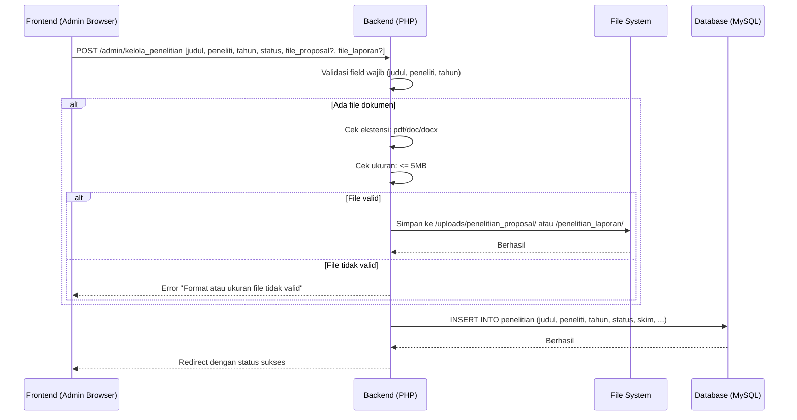

***Gambar 2.6** Sequence Diagram Kelola Penelitian*

&nbsp;&nbsp;&nbsp;&nbsp;Gambar 2.6 di atas menggambarkan alur interaksi yang terjadi pada proses pencatatan data penelitian dosen oleh administrator. Administrator menginputkan data penelitian yang mencakup judul, nama peneliti, tahun pelaksanaan, status, skim penelitian, dan berbagai atribut pelengkap lainnya. Sistem mendukung pengunggahan dua dokumen secara bersamaan, yaitu berkas proposal penelitian dan berkas laporan akhir penelitian, yang masing-masing disimpan pada direktori terpisah, yakni `uploads/penelitian_proposal/` dan `uploads/penelitian_laporan/`. Terhadap setiap berkas yang diunggah, sistem melaksanakan validasi ekstensi berkas yang hanya mengizinkan format PDF, DOC, dan DOCX, serta validasi ukuran berkas yang dibatasi maksimal 5 MB. Apabila seluruh validasi berhasil dilalui, data penelitian disimpan ke dalam tabel `penelitian` menggunakan *Prepared Statement*, dan administrator diarahkan kembali ke halaman daftar penelitian disertai notifikasi keberhasilan.

---

## 2.8 Sequence Diagram Kelola Pengabdian

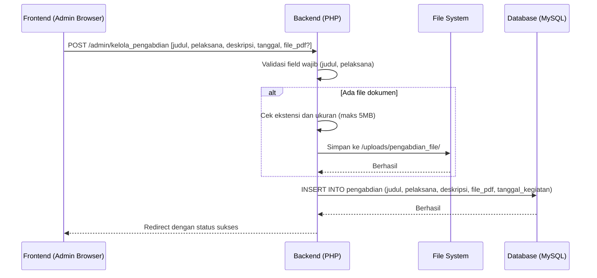

***Gambar 2.7** Sequence Diagram Kelola Pengabdian*

&nbsp;&nbsp;&nbsp;&nbsp;Gambar 2.7 di atas menggambarkan alur interaksi yang terjadi pada proses pencatatan kegiatan pengabdian kepada masyarakat oleh administrator. Data yang diwajibkan untuk diisi mencakup judul kegiatan dan nama pelaksana, sementara atribut-atribut lainnya seperti deskripsi, tanggal kegiatan, dan berkas dokumen bersifat opsional. Apabila administrator mengunggah berkas dokumen laporan kegiatan, sistem melaksanakan validasi terhadap ekstensi berkas (PDF, DOC, DOCX) dan ukuran berkas yang dibatasi maksimal 5 MB sebelum menyimpannya ke direktori `uploads/pengabdian_file/` di server. Setelah seluruh proses selesai, data kegiatan pengabdian disimpan ke dalam tabel `pengabdian` pada basis data dan administrator memperoleh konfirmasi keberhasilan operasi.

---

## 2.9 Sequence Diagram Akses Halaman Publik Frontend

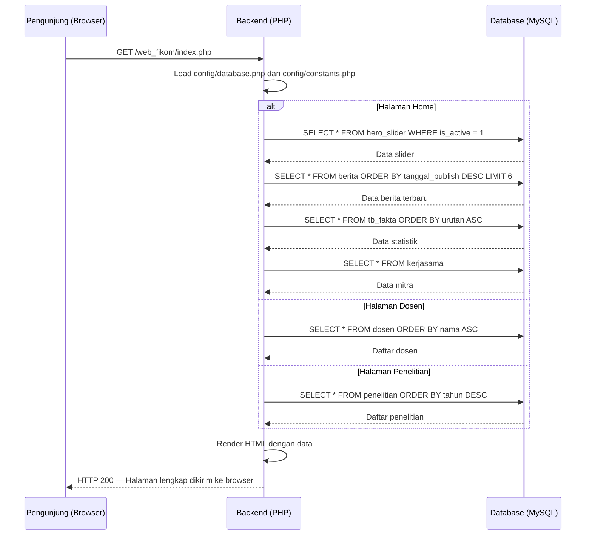

***Gambar 2.8** Sequence Diagram Akses Halaman Publik Frontend*

&nbsp;&nbsp;&nbsp;&nbsp;Gambar 2.8 di atas menggambarkan alur interaksi yang terjadi pada proses akses halaman publik oleh pengunjung website. Ketika pengunjung melakukan permintaan terhadap suatu halaman, sistem *backend* secara otomatis memuat konfigurasi koneksi basis data dan konstanta sistem, kemudian mengeksekusi kueri-kueri yang relevan sesuai halaman yang diminta. Pada halaman beranda, sistem mengambil data slider aktif, artikel berita terbaru, data statistik angka pencapaian, serta data mitra kerjasama secara berurutan dari basis data. Seluruh data hasil kueri tersebut selanjutnya diproses oleh *template* PHP untuk dirender menjadi dokumen HTML yang lengkap dan utuh di sisi server (*Server-Side Rendering*). Dokumen HTML yang telah selesai dirender kemudian dikirimkan kepada *browser* pengunjung sebagai respons HTTP 200, sehingga pengunjung menerima halaman yang sudah memuat data terkini tanpa memerlukan pemrosesan tambahan di sisi klien.

---

## 2.10 Sequence Diagram Validasi Sesi Admin

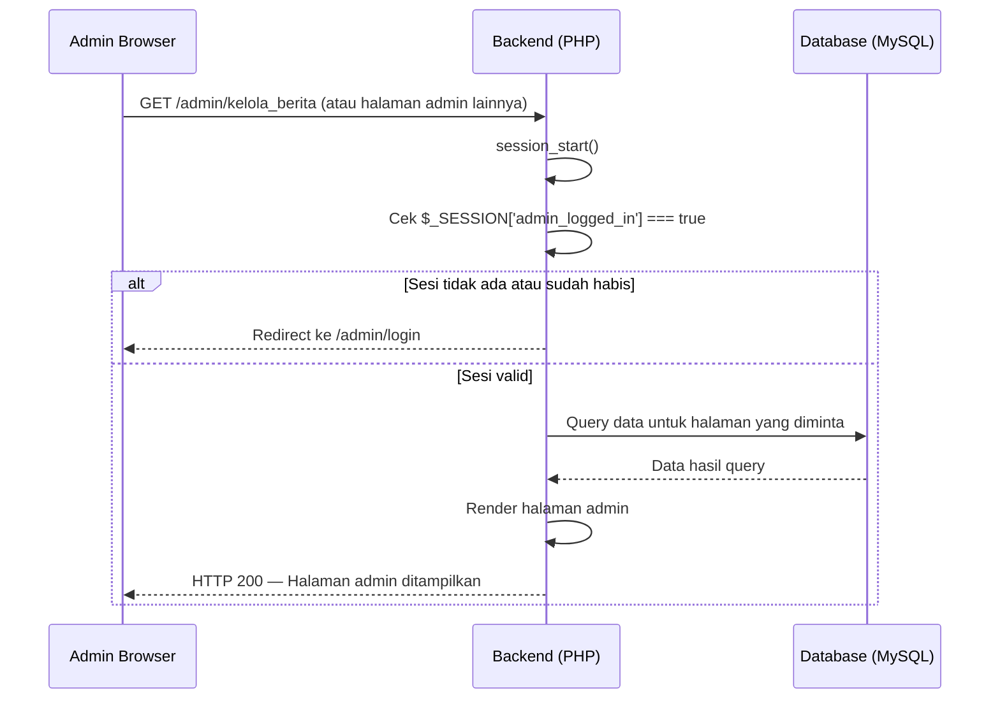

***Gambar 2.9** Sequence Diagram Validasi Sesi Admin*

&nbsp;&nbsp;&nbsp;&nbsp;Gambar 2.9 di atas menggambarkan alur interaksi yang terjadi pada proses validasi sesi administrator dalam mengakses halaman panel administrasi. Setiap permintaan akses terhadap halaman-halaman yang berada di bawah direktori `/admin/` akan diproses melalui mekanisme pemeriksaan sesi secara mandiri dan konsisten. Sistem melaksanakan inisialisasi sesi menggunakan fungsi `session_start()`, kemudian memverifikasi keberadaan dan kebenaran nilai variabel `$_SESSION['admin_logged_in']`. Apabila variabel sesi tersebut tidak ditemukan atau sudah kedaluwarsa, sistem segera mengeksekusi pengalihan (*redirect*) ke halaman login tanpa memproses permintaan halaman yang dituju. Mekanisme proteksi sesi ini merupakan lapisan keamanan pertama yang diterapkan pada seluruh halaman administrasi, guna memastikan bahwa sumber daya sistem tidak dapat diakses oleh pihak yang tidak terautentikasi.

---

## 2.11 Sequence Diagram Pendaftaran Mahasiswa Baru

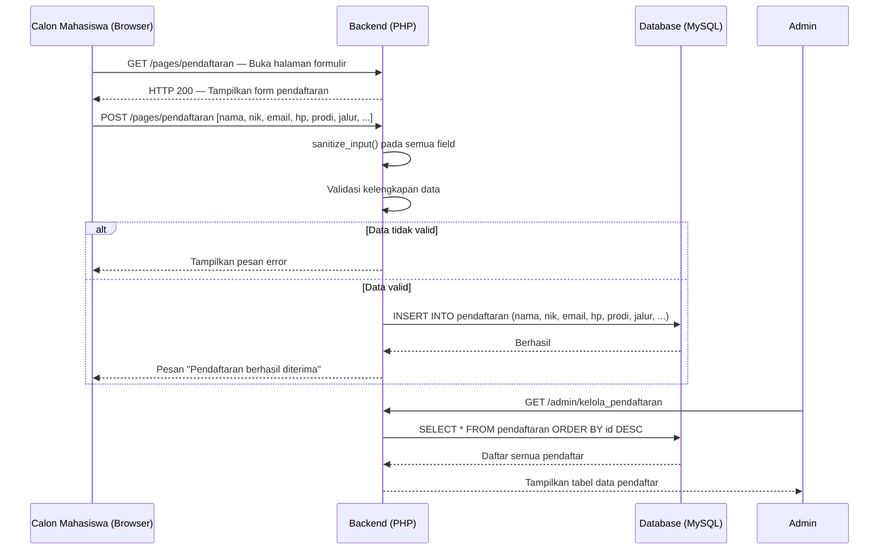

***Gambar 2.10** Sequence Diagram Pendaftaran Mahasiswa Baru*

&nbsp;&nbsp;&nbsp;&nbsp;Gambar 2.10 di atas menggambarkan alur interaksi yang terjadi pada proses penerimaan mahasiswa baru yang melibatkan dua aktor, yaitu calon mahasiswa sebagai pengguna publik dan administrator sebagai pihak yang berwenang memverifikasi data. Calon mahasiswa mengisi formulir pendaftaran daring yang tersedia di halaman publik dengan data diri yang mencakup nama lengkap, NIK, alamat surel, nomor telepon, pilihan program studi, jalur masuk, dan informasi pendukung lainnya. Sebelum data disimpan, sistem melaksanakan proses sanitasi masukan menggunakan fungsi `sanitize_input()` guna mencegah potensi serangan *Cross-Site Scripting* (XSS), dilanjutkan dengan validasi kelengkapan *field* wajib. Data yang telah tervalidasi selanjutnya disimpan ke dalam tabel `pendaftaran` pada basis data. Di sisi administrator, seluruh rekaman data pendaftar dapat diakses melalui panel administrasi untuk diverifikasi dan ditindaklanjuti sesuai dengan prosedur penerimaan mahasiswa baru yang berlaku.

---

## 2.12 Sequence Diagram Dashboard Statistik Admin

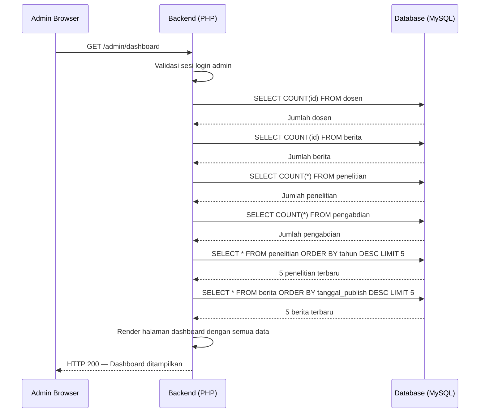

***Gambar 2.11** Sequence Diagram Dashboard Statistik Admin*

&nbsp;&nbsp;&nbsp;&nbsp;Gambar 2.11 di atas menggambarkan alur interaksi yang terjadi pada proses pemuatan halaman dasbor administrasi. Setelah validasi sesi berhasil dilaksanakan, sistem secara berurutan mengeksekusi serangkaian kueri agregasi ke basis data untuk menghimpun data statistik. Kueri-kueri tersebut mencakup perhitungan jumlah rekaman pada tabel `dosen`, `berita`, `penelitian`, dan `pengabdian` menggunakan fungsi `COUNT()`. Selain data statistik numerik, sistem juga mengambil lima rekaman termutakhir dari tabel `penelitian` dan `berita` berdasarkan urutan waktu untuk ditampilkan sebagai data aktivitas terkini. Seluruh data hasil kueri tersebut kemudian dikirimkan ke lapisan tampilan (*View*) untuk dirender menjadi informasi visual yang komprehensif, meliputi kartu-kartu statistik, grafik perkembangan, dan tabel ringkasan aktivitas yang informatif bagi administrator dalam memantau kondisi dan perkembangan sistem secara keseluruhan.

---

*Dokumen Diagram Urutan ini merupakan bagian dari dokumentasi teknis skripsi Website Fakultas Ilmu Komputer Universitas Muhammadiyah Sidenreng Rappang (UNISAN).*
