# Diagram Aktivitas & Sequence Diagram — Berdasarkan Tampilan Sistem

Dokumen ini memuat diagram aktivitas (*Activity Diagram*) dan diagram urutan (*Sequence Diagram*) yang dibuat berdasarkan tampilan antarmuka nyata sistem Web FIKOM. Setiap diagram mencerminkan alur interaksi aktual antara administrator dan sistem.

---

## 1. Login Administrator

### 1.1 Activity Diagram — Login

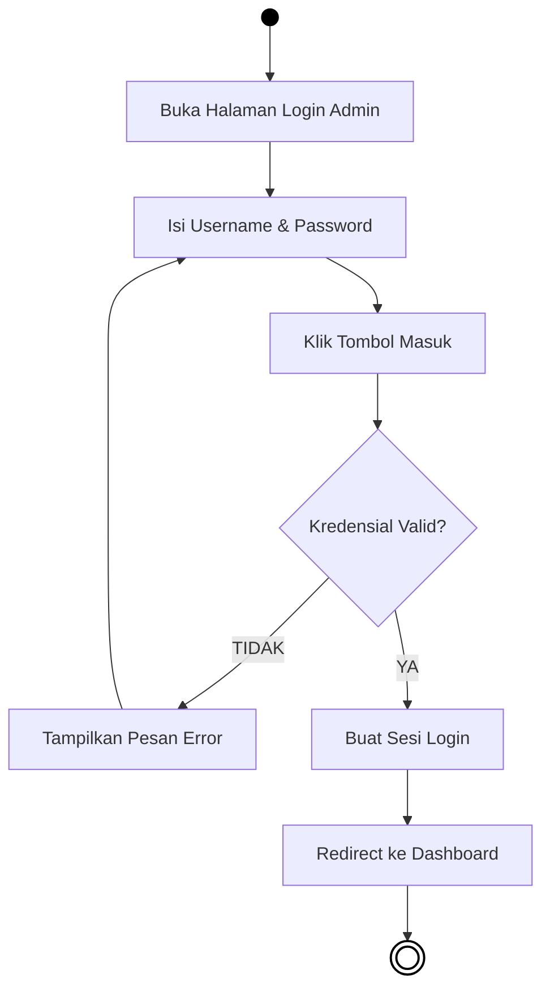
```mermaid
flowchart TD
    Start(( )) --> A[Buka Halaman Login Admin]
    A --> B[Isi Username & Password]
    B --> C[Klik Tombol Masuk]
    C --> D{Kredensial Valid?}
    D -- TIDAK --> E[Tampilkan Pesan Error]
    E --> B
    D -- YA --> F[Buat Sesi Login]
    F --> G[Redirect ke Dashboard]
    G --> End((( )))

    style Start fill:#000,stroke:#000,color:#000
    style End fill:#fff,stroke:#000,stroke-width:2px
```

**Penjelasan:**
Admin mengisi Username dan Password pada form login, kemudian menekan tombol **Masuk**. Sistem memverifikasi kredensial ke database. Jika salah, muncul pesan error dan admin harus mengisi ulang. Jika benar, sistem membuat sesi aktif dan mengarahkan admin ke halaman Dashboard.

---

### 1.2 Sequence Diagram — Login

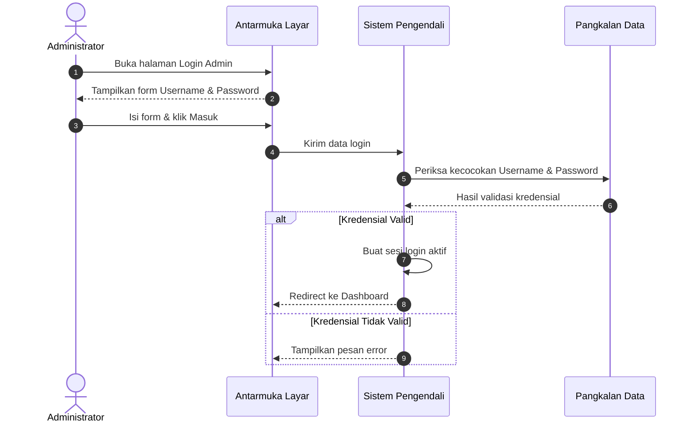
```mermaid
sequenceDiagram
    autonumber
    actor Admin as Administrator
    participant Frontend as Antarmuka Layar
    participant Backend as Sistem Pengendali
    participant DB as Pangkalan Data

    Admin->>Frontend: Buka halaman Login Admin
    Frontend-->>Admin: Tampilkan form Username & Password

    Admin->>Frontend: Isi form & klik Masuk
    Frontend->>Backend: Kirim data login

    Backend->>DB: Periksa kecocokan Username & Password
    DB-->>Backend: Hasil validasi kredensial

    alt Kredensial Valid
        Backend->>Backend: Buat sesi login aktif
        Backend-->>Frontend: Redirect ke Dashboard
    else Kredensial Tidak Valid
        Backend-->>Frontend: Tampilkan pesan error
    end
```

**Penjelasan:**
Admin mengirim data login ke Sistem Pengendali yang memverifikasi ke Pangkalan Data. Jika valid, sesi dibuat dan admin diarahkan ke Dashboard. Jika tidak valid, sistem menampilkan pesan kesalahan.

---

## 2. Pengaturan Profil Admin

### 2.1 Activity Diagram — Pengaturan Profil

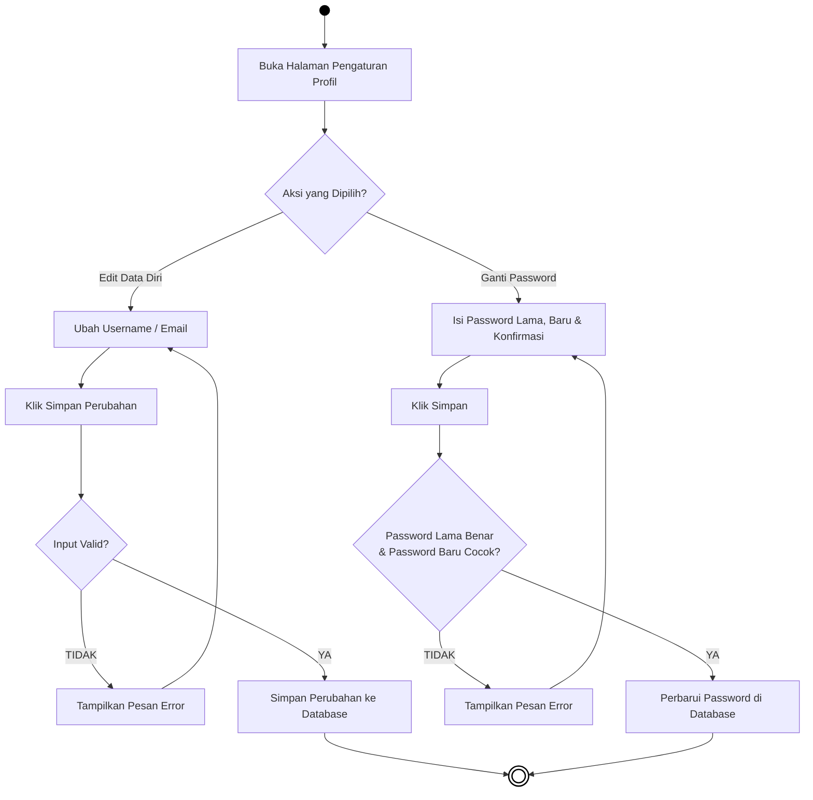
```mermaid
flowchart TD
    Start(( )) --> A[Buka Halaman Pengaturan Profil]
    A --> B{Aksi yang Dipilih?}

    B -- Edit Data Diri --> C[Ubah Username / Email]
    C --> D[Klik Simpan Perubahan]
    D --> E{Input Valid?}
    E -- TIDAK --> F[Tampilkan Pesan Error]
    F --> C
    E -- YA --> G[Simpan Perubahan ke Database]
    G --> End((( )))

    B -- Ganti Password --> H[Isi Password Lama, Baru & Konfirmasi]
    H --> I[Klik Simpan]
    I --> J{Password Lama Benar\n& Password Baru Cocok?}
    J -- TIDAK --> K[Tampilkan Pesan Error]
    K --> H
    J -- YA --> L[Perbarui Password di Database]
    L --> End

    style Start fill:#000,stroke:#000,color:#000
    style End fill:#fff,stroke:#000,stroke-width:2px
```

**Penjelasan:**
Halaman ini memiliki dua fungsi. Pertama, **Edit Data Diri**: admin mengubah Username atau Email lalu menyimpannya; sistem memvalidasi input dan menyimpan ke database. Kedua, **Ganti Password**: admin mengisi password lama, password baru, dan konfirmasi; sistem memverifikasi kecocokan sebelum menyimpan password baru.

---

### 2.2 Sequence Diagram — Pengaturan Profil

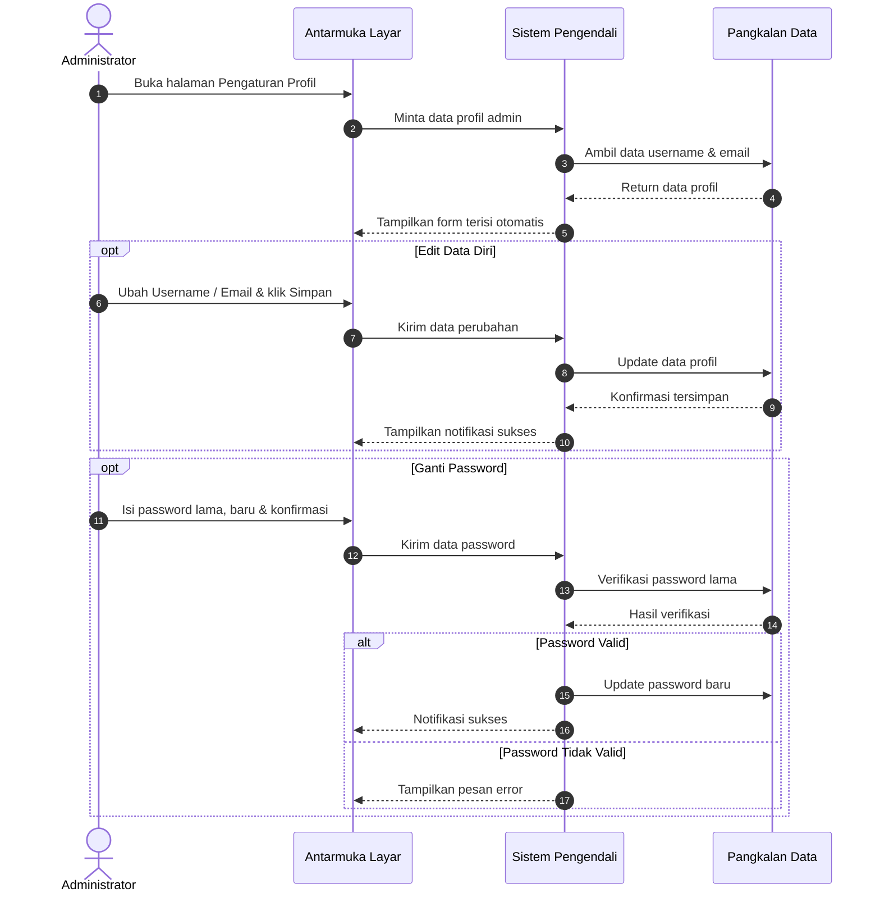
```mermaid
sequenceDiagram
    autonumber
    actor Admin as Administrator
    participant Frontend as Antarmuka Layar
    participant Backend as Sistem Pengendali
    participant DB as Pangkalan Data

    Admin->>Frontend: Buka halaman Pengaturan Profil
    Frontend->>Backend: Minta data profil admin
    Backend->>DB: Ambil data username & email
    DB-->>Backend: Return data profil
    Backend-->>Frontend: Tampilkan form terisi otomatis

    opt Edit Data Diri
        Admin->>Frontend: Ubah Username / Email & klik Simpan
        Frontend->>Backend: Kirim data perubahan
        Backend->>DB: Update data profil
        DB-->>Backend: Konfirmasi tersimpan
        Backend-->>Frontend: Tampilkan notifikasi sukses
    end

    opt Ganti Password
        Admin->>Frontend: Isi password lama, baru & konfirmasi
        Frontend->>Backend: Kirim data password
        Backend->>DB: Verifikasi password lama
        DB-->>Backend: Hasil verifikasi
        alt Password Valid
            Backend->>DB: Update password baru
            Backend-->>Frontend: Notifikasi sukses
        else Password Tidak Valid
            Backend-->>Frontend: Tampilkan pesan error
        end
    end
```

**Penjelasan:**
Sistem memuat data profil admin dari Pangkalan Data secara otomatis. Untuk Edit Data Diri, perubahan dikirim dan diperbarui langsung. Untuk Ganti Password, sistem memverifikasi password lama terlebih dahulu sebelum menyimpan password baru.

---

## 3. Dashboard Admin

### 3.1 Activity Diagram — Dashboard

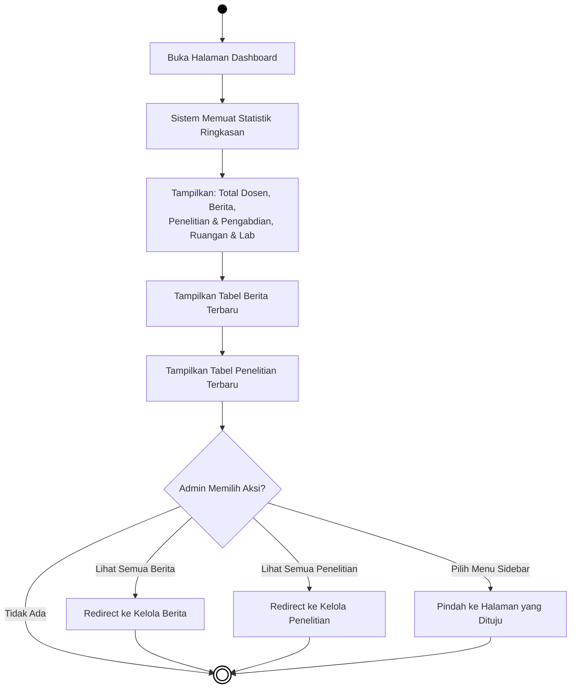
```mermaid
flowchart TD
    Start(( )) --> A[Buka Halaman Dashboard]
    A --> B[Sistem Memuat Statistik Ringkasan]
    B --> C[Tampilkan: Total Dosen, Berita,\nPenelitian & Pengabdian, Ruangan & Lab]
    C --> D[Tampilkan Tabel Berita Terbaru]
    D --> E[Tampilkan Tabel Penelitian Terbaru]

    E --> F{Admin Memilih Aksi?}
    F -- Lihat Semua Berita --> G[Redirect ke Kelola Berita]
    F -- Lihat Semua Penelitian --> H[Redirect ke Kelola Penelitian]
    F -- Pilih Menu Sidebar --> I[Pindah ke Halaman yang Dituju]
    F -- Tidak Ada --> End((( )))

    G --> End
    H --> End
    I --> End

    style Start fill:#000,stroke:#000,color:#000
    style End fill:#fff,stroke:#000,stroke-width:2px
```

**Penjelasan:**
Saat Dashboard dibuka, sistem secara otomatis memuat statistik ringkasan (Total Dosen, Total Berita, Penelitian & Pengabdian, Ruangan & Lab) serta menampilkan tabel Berita Terbaru dan Penelitian Terbaru. Admin dapat langsung berpindah ke halaman pengelolaan melalui tombol "Lihat Semua" atau menu sidebar.

---

### 3.2 Sequence Diagram — Dashboard

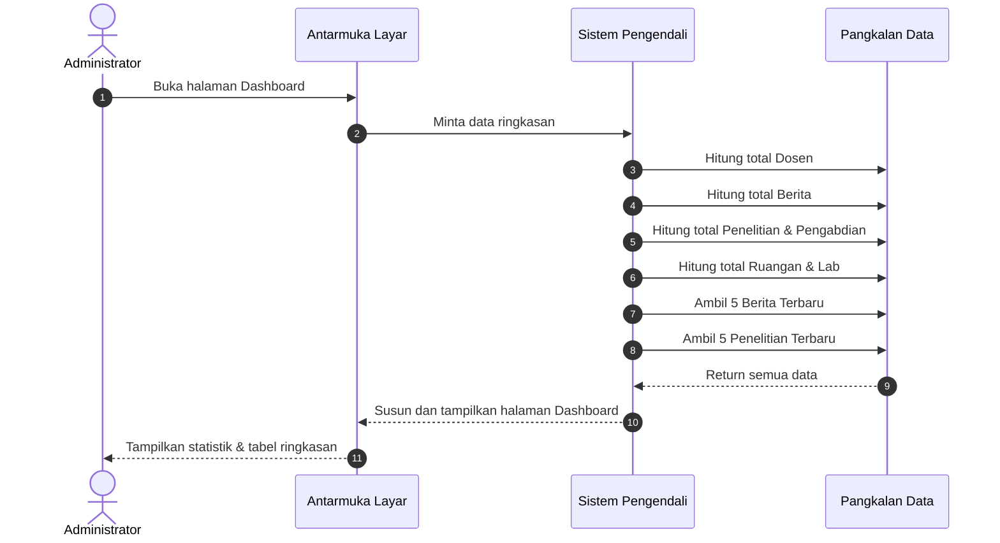
```mermaid
sequenceDiagram
    autonumber
    actor Admin as Administrator
    participant Frontend as Antarmuka Layar
    participant Backend as Sistem Pengendali
    participant DB as Pangkalan Data

    Admin->>Frontend: Buka halaman Dashboard
    Frontend->>Backend: Minta data ringkasan

    Backend->>DB: Hitung total Dosen
    Backend->>DB: Hitung total Berita
    Backend->>DB: Hitung total Penelitian & Pengabdian
    Backend->>DB: Hitung total Ruangan & Lab
    Backend->>DB: Ambil 5 Berita Terbaru
    Backend->>DB: Ambil 5 Penelitian Terbaru

    DB-->>Backend: Return semua data
    Backend-->>Frontend: Susun dan tampilkan halaman Dashboard
    Frontend-->>Admin: Tampilkan statistik & tabel ringkasan
```

**Penjelasan:**
Sistem Pengendali mengirim beberapa permintaan data sekaligus ke Pangkalan Data, yaitu statistik jumlah konten dan daftar terbaru berita serta penelitian. Semua data digabung dan ditampilkan dalam satu halaman Dashboard yang informatif.

---

## 4. Kelola Slider Homepage

### 4.1 Activity Diagram — Kelola Slider

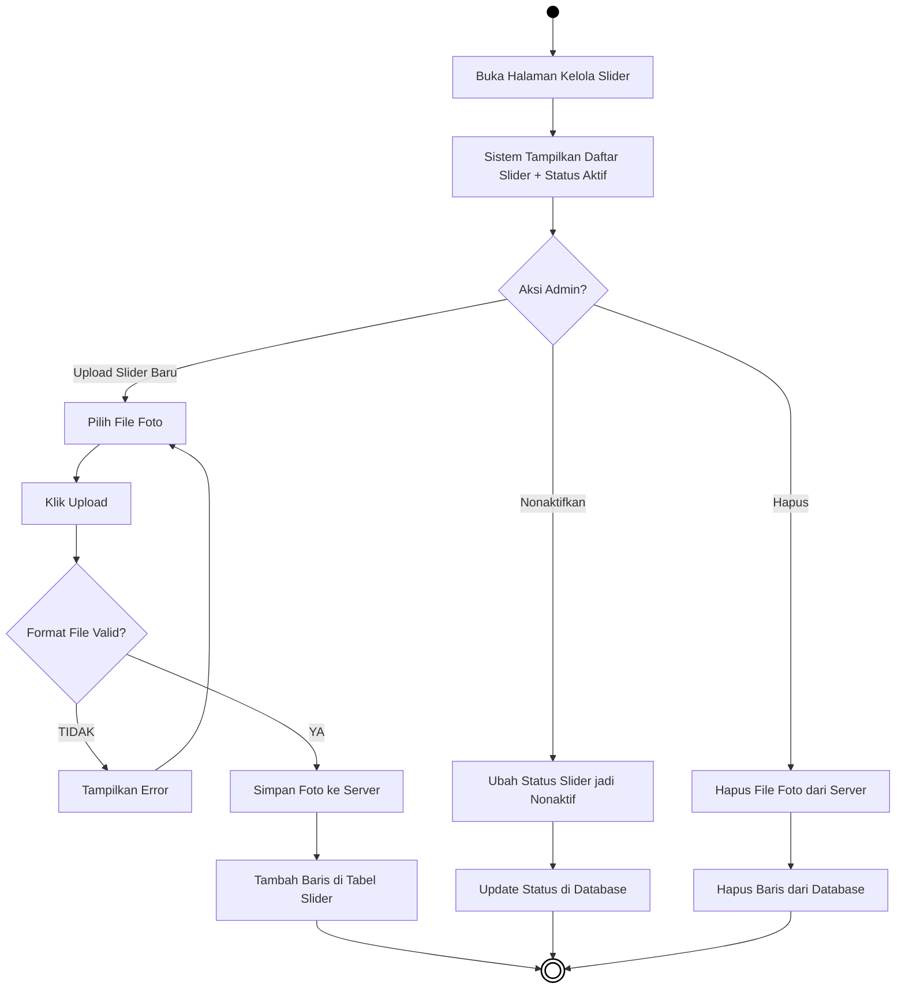
```mermaid
flowchart TD
    Start(( )) --> A[Buka Halaman Kelola Slider]
    A --> B[Sistem Tampilkan Daftar Slider + Status Aktif]

    B --> C{Aksi Admin?}

    C -- Upload Slider Baru --> D[Pilih File Foto]
    D --> E[Klik Upload]
    E --> F{Format File Valid?}
    F -- TIDAK --> G[Tampilkan Error]
    G --> D
    F -- YA --> H[Simpan Foto ke Server]
    H --> I[Tambah Baris di Tabel Slider]
    I --> End((( )))

    C -- Nonaktifkan --> J[Ubah Status Slider jadi Nonaktif]
    J --> K[Update Status di Database]
    K --> End

    C -- Hapus --> L[Hapus File Foto dari Server]
    L --> M[Hapus Baris dari Database]
    M --> End

    style Start fill:#000,stroke:#000,color:#000
    style End fill:#fff,stroke:#000,stroke-width:2px
```

**Penjelasan:**
Halaman ini memiliki tiga fungsi utama sesuai tampilan. **Upload**: admin memilih foto lalu mengklik Upload; sistem memvalidasi format dan menyimpan foto ke server. **Nonaktifkan**: admin dapat mengubah status slider tanpa menghapusnya. **Hapus**: sistem menghapus file foto dari server dan baris data dari database.

---

### 4.2 Sequence Diagram — Kelola Slider

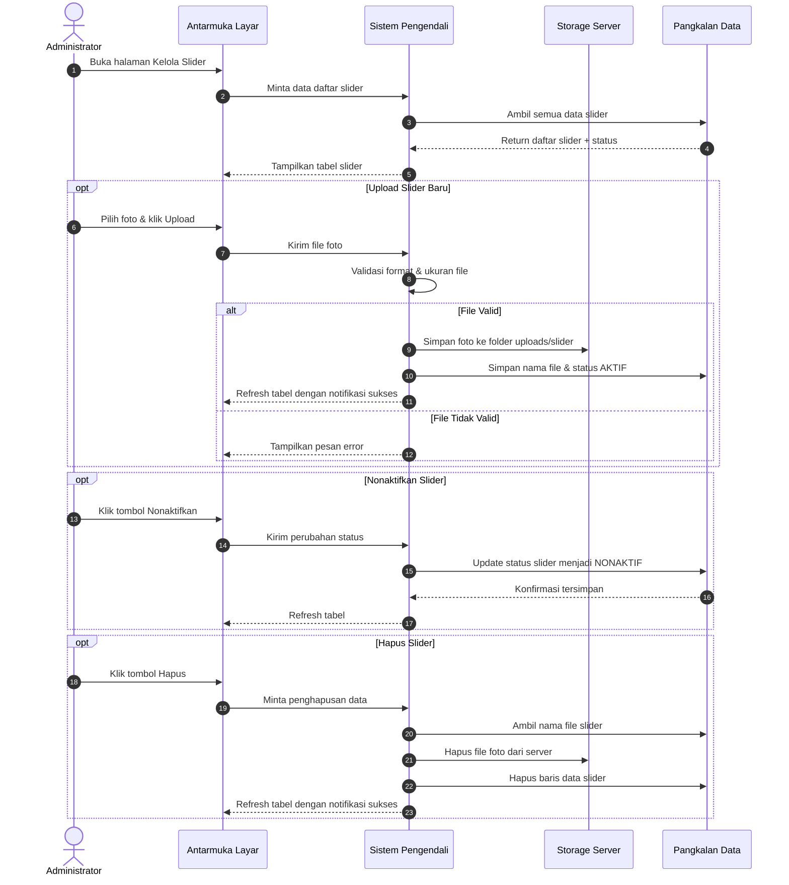
```mermaid
sequenceDiagram
    autonumber
    actor Admin as Administrator
    participant Frontend as Antarmuka Layar
    participant Backend as Sistem Pengendali
    participant Server as Storage Server
    participant DB as Pangkalan Data

    Admin->>Frontend: Buka halaman Kelola Slider
    Frontend->>Backend: Minta data daftar slider
    Backend->>DB: Ambil semua data slider
    DB-->>Backend: Return daftar slider + status
    Backend-->>Frontend: Tampilkan tabel slider

    opt Upload Slider Baru
        Admin->>Frontend: Pilih foto & klik Upload
        Frontend->>Backend: Kirim file foto
        Backend->>Backend: Validasi format & ukuran file
        alt File Valid
            Backend->>Server: Simpan foto ke folder uploads/slider
            Backend->>DB: Simpan nama file & status AKTIF
            Backend-->>Frontend: Refresh tabel dengan notifikasi sukses
        else File Tidak Valid
            Backend-->>Frontend: Tampilkan pesan error
        end
    end

    opt Nonaktifkan Slider
        Admin->>Frontend: Klik tombol Nonaktifkan
        Frontend->>Backend: Kirim perubahan status
        Backend->>DB: Update status slider menjadi NONAKTIF
        DB-->>Backend: Konfirmasi tersimpan
        Backend-->>Frontend: Refresh tabel
    end

    opt Hapus Slider
        Admin->>Frontend: Klik tombol Hapus
        Frontend->>Backend: Minta penghapusan data
        Backend->>DB: Ambil nama file slider
        Backend->>Server: Hapus file foto dari server
        Backend->>DB: Hapus baris data slider
        Backend-->>Frontend: Refresh tabel dengan notifikasi sukses
    end
```

**Penjelasan:**
Sistem menampilkan tabel daftar slider beserta preview foto dan status aktif/nonaktif. Admin dapat mengunggah slider baru (sistem memvalidasi file), mengubah status slider, atau menghapus slider (sistem menghapus file fisik dari server dan data dari Pangkalan Data).

---

## 5. Kelola Berita

### 5.1 Activity Diagram — Kelola Berita

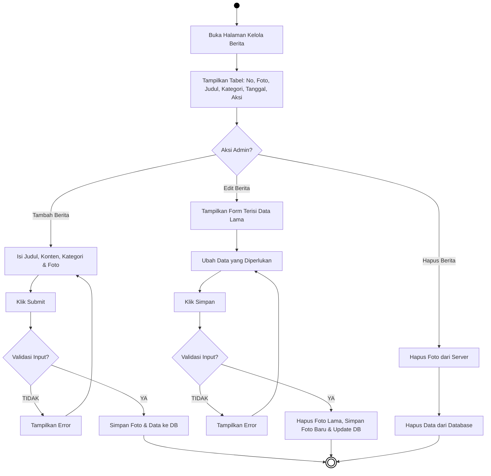
```mermaid
flowchart TD
    Start(( )) --> A[Buka Halaman Kelola Berita]
    A --> B[Tampilkan Tabel: No, Foto, Judul, Kategori, Tanggal, Aksi]

    B --> C{Aksi Admin?}

    C -- Tambah Berita --> D[Isi Judul, Konten, Kategori & Foto]
    D --> E[Klik Submit]
    E --> F{Validasi Input?}
    F -- TIDAK --> G[Tampilkan Error]
    G --> D
    F -- YA --> H[Simpan Foto & Data ke DB]
    H --> End((( )))

    C -- Edit Berita --> I[Tampilkan Form Terisi Data Lama]
    I --> J[Ubah Data yang Diperlukan]
    J --> K[Klik Simpan]
    K --> L{Validasi Input?}
    L -- TIDAK --> M[Tampilkan Error]
    M --> J
    L -- YA --> N[Hapus Foto Lama, Simpan Foto Baru & Update DB]
    N --> End

    C -- Hapus Berita --> O[Hapus Foto dari Server]
    O --> P[Hapus Data dari Database]
    P --> End

    style Start fill:#000,stroke:#000,color:#000
    style End fill:#fff,stroke:#000,stroke-width:2px
```

**Penjelasan:**
Halaman Berita menampilkan tabel dengan kolom No, Foto, Judul, Kategori, Tanggal, dan tombol Aksi (Edit kuning, Hapus merah). Untuk **Tambah/Edit**, admin mengisi judul, konten, kategori, dan foto; sistem memvalidasi sebelum menyimpan. Untuk **Hapus**, foto lama dihapus dari server dan data dihapus dari database.

---

### 5.2 Sequence Diagram — Kelola Berita

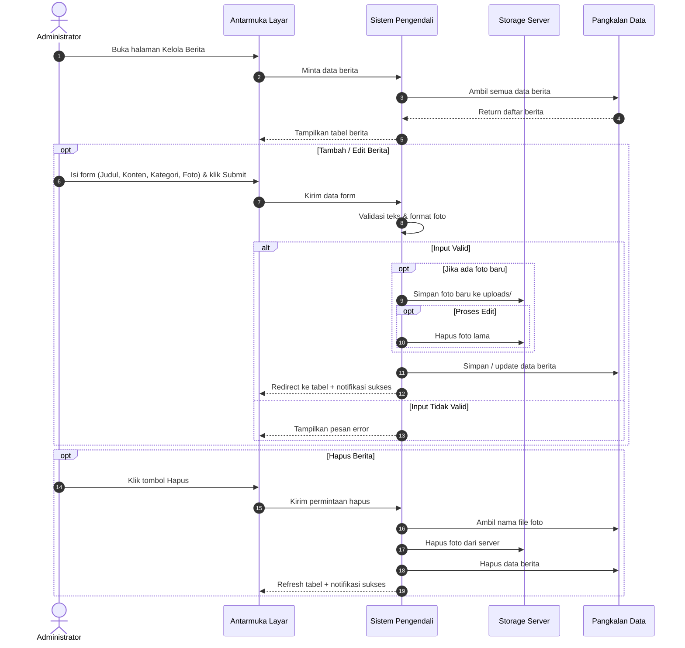
```mermaid
sequenceDiagram
    autonumber
    actor Admin as Administrator
    participant Frontend as Antarmuka Layar
    participant Backend as Sistem Pengendali
    participant Server as Storage Server
    participant DB as Pangkalan Data

    Admin->>Frontend: Buka halaman Kelola Berita
    Frontend->>Backend: Minta data berita
    Backend->>DB: Ambil semua data berita
    DB-->>Backend: Return daftar berita
    Backend-->>Frontend: Tampilkan tabel berita

    opt Tambah / Edit Berita
        Admin->>Frontend: Isi form (Judul, Konten, Kategori, Foto) & klik Submit
        Frontend->>Backend: Kirim data form
        Backend->>Backend: Validasi teks & format foto
        alt Input Valid
            opt Jika ada foto baru
                Backend->>Server: Simpan foto baru ke uploads/
                opt Proses Edit
                    Backend->>Server: Hapus foto lama
                end
            end
            Backend->>DB: Simpan / update data berita
            Backend-->>Frontend: Redirect ke tabel + notifikasi sukses
        else Input Tidak Valid
            Backend-->>Frontend: Tampilkan pesan error
        end
    end

    opt Hapus Berita
        Admin->>Frontend: Klik tombol Hapus
        Frontend->>Backend: Kirim permintaan hapus
        Backend->>DB: Ambil nama file foto
        Backend->>Server: Hapus foto dari server
        Backend->>DB: Hapus data berita
        Backend-->>Frontend: Refresh tabel + notifikasi sukses
    end
```

**Penjelasan:**
Sistem memuat daftar berita dengan foto thumbnail. Untuk Tambah/Edit, sistem memvalidasi teks dan format foto sebelum menyimpan (foto lama dihapus saat Edit). Untuk Hapus, sistem menghapus foto dari server dan data dari Pangkalan Data secara berurutan.

---

## 6. Kelola Data Dosen

### 6.1 Activity Diagram — Kelola Dosen

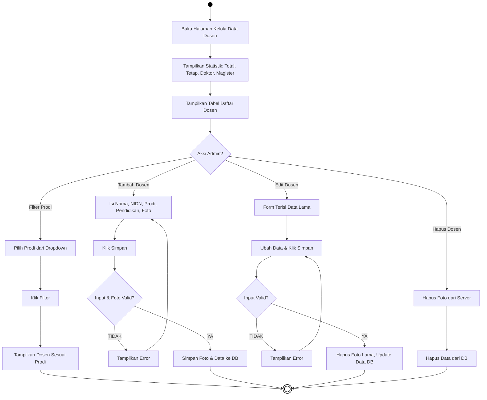
```mermaid
flowchart TD
    Start(( )) --> A[Buka Halaman Kelola Data Dosen]
    A --> B[Tampilkan Statistik: Total, Tetap, Doktor, Magister]
    B --> C[Tampilkan Tabel Daftar Dosen]

    C --> D{Aksi Admin?}

    D -- Filter Prodi --> E[Pilih Prodi dari Dropdown]
    E --> F[Klik Filter]
    F --> G[Tampilkan Dosen Sesuai Prodi]
    G --> End((( )))

    D -- Tambah Dosen --> H[Isi Nama, NIDN, Prodi, Pendidikan, Foto]
    H --> I[Klik Simpan]
    I --> J{Input & Foto Valid?}
    J -- TIDAK --> K[Tampilkan Error]
    K --> H
    J -- YA --> L[Simpan Foto & Data ke DB]
    L --> End

    D -- Edit Dosen --> M[Form Terisi Data Lama]
    M --> N[Ubah Data & Klik Simpan]
    N --> O{Input Valid?}
    O -- TIDAK --> P[Tampilkan Error]
    P --> N
    O -- YA --> Q[Hapus Foto Lama, Update Data DB]
    Q --> End

    D -- Hapus Dosen --> R[Hapus Foto dari Server]
    R --> S[Hapus Data dari DB]
    S --> End

    style Start fill:#000,stroke:#000,color:#000
    style End fill:#fff,stroke:#000,stroke-width:2px
```

**Penjelasan:**
Halaman ini menampilkan statistik dosen (Total, Tetap, Doktor S3, Magister S2) di bagian atas, diikuti tabel dengan kolom Foto, Nama/NIDN, Prodi, Pendidikan, Status, dan Aksi. Admin dapat memfilter dosen berdasarkan Prodi, serta melakukan Tambah, Edit, dan Hapus data dosen.

---

### 6.2 Sequence Diagram — Kelola Dosen

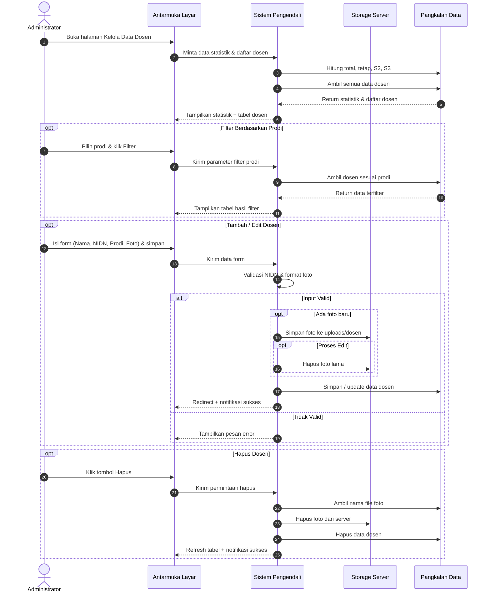
```mermaid
sequenceDiagram
    autonumber
    actor Admin as Administrator
    participant Frontend as Antarmuka Layar
    participant Backend as Sistem Pengendali
    participant Server as Storage Server
    participant DB as Pangkalan Data

    Admin->>Frontend: Buka halaman Kelola Data Dosen
    Frontend->>Backend: Minta data statistik & daftar dosen
    Backend->>DB: Hitung total, tetap, S2, S3
    Backend->>DB: Ambil semua data dosen
    DB-->>Backend: Return statistik & daftar dosen
    Backend-->>Frontend: Tampilkan statistik + tabel dosen

    opt Filter Berdasarkan Prodi
        Admin->>Frontend: Pilih prodi & klik Filter
        Frontend->>Backend: Kirim parameter filter prodi
        Backend->>DB: Ambil dosen sesuai prodi
        DB-->>Backend: Return data terfilter
        Backend-->>Frontend: Tampilkan tabel hasil filter
    end

    opt Tambah / Edit Dosen
        Admin->>Frontend: Isi form (Nama, NIDN, Prodi, Foto) & simpan
        Frontend->>Backend: Kirim data form
        Backend->>Backend: Validasi NIDN & format foto
        alt Input Valid
            opt Ada foto baru
                Backend->>Server: Simpan foto ke uploads/dosen
                opt Proses Edit
                    Backend->>Server: Hapus foto lama
                end
            end
            Backend->>DB: Simpan / update data dosen
            Backend-->>Frontend: Redirect + notifikasi sukses
        else Tidak Valid
            Backend-->>Frontend: Tampilkan pesan error
        end
    end

    opt Hapus Dosen
        Admin->>Frontend: Klik tombol Hapus
        Frontend->>Backend: Kirim permintaan hapus
        Backend->>DB: Ambil nama file foto
        Backend->>Server: Hapus foto dari server
        Backend->>DB: Hapus data dosen
        Backend-->>Frontend: Refresh tabel + notifikasi sukses
    end
```

**Penjelasan:**
Sistem memuat statistik dan tabel dosen sekaligus. Fitur filter memungkinkan admin menyaring dosen berdasarkan Program Studi. Untuk Tambah/Edit, sistem memvalidasi format foto dan NIDN. Untuk Hapus, foto dihapus dari server dan data dosen dihapus dari Pangkalan Data.

---

## 7. Kelola Data Civitas (Fakta Fakultas)

### 7.1 Activity Diagram — Fakta Fakultas

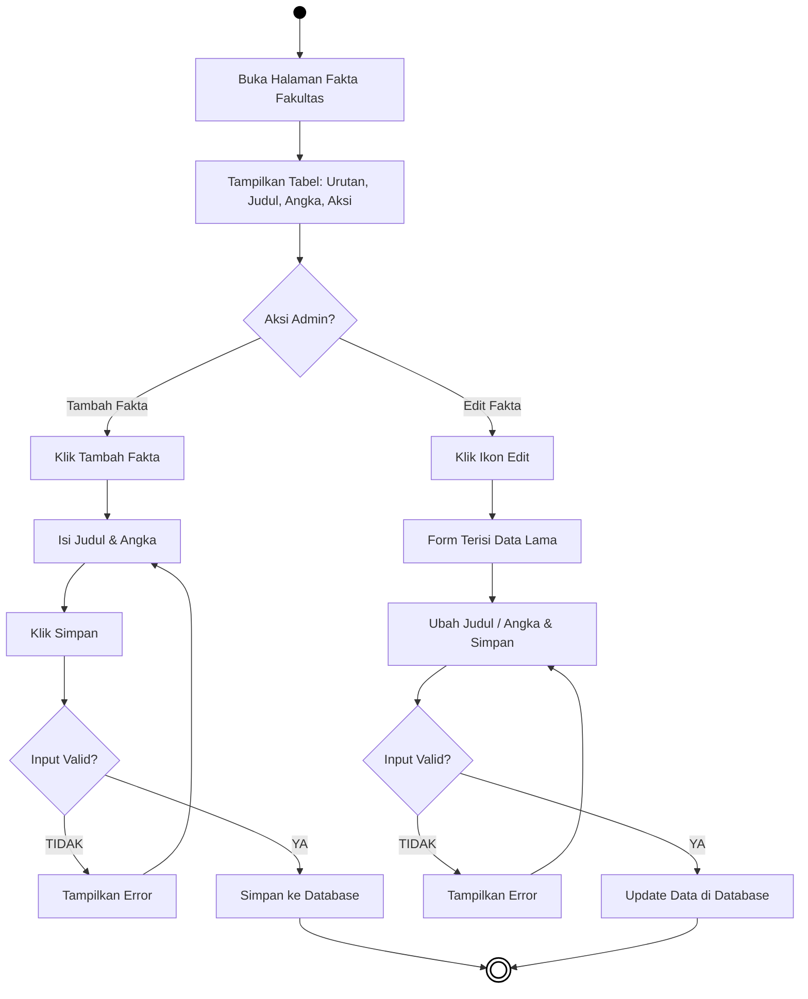
```mermaid
flowchart TD
    Start(( )) --> A[Buka Halaman Fakta Fakultas]
    A --> B[Tampilkan Tabel: Urutan, Judul, Angka, Aksi]

    B --> C{Aksi Admin?}

    C -- Tambah Fakta --> D[Klik Tambah Fakta]
    D --> E[Isi Judul & Angka]
    E --> F[Klik Simpan]
    F --> G{Input Valid?}
    G -- TIDAK --> H[Tampilkan Error]
    H --> E
    G -- YA --> I[Simpan ke Database]
    I --> End((( )))

    C -- Edit Fakta --> J[Klik Ikon Edit]
    J --> K[Form Terisi Data Lama]
    K --> L[Ubah Judul / Angka & Simpan]
    L --> M{Input Valid?}
    M -- TIDAK --> N[Tampilkan Error]
    N --> L
    M -- YA --> O[Update Data di Database]
    O --> End

    style Start fill:#000,stroke:#000,color:#000
    style End fill:#fff,stroke:#000,stroke-width:2px
```

**Penjelasan:**
Halaman Fakta Fakultas menampilkan tabel dengan data statistik seperti jumlah Dosen, Mahasiswa, dan Alumni beserta angkanya. Admin dapat menambah data fakta baru atau mengedit fakta yang sudah ada. Tidak ada fitur hapus — hanya Tambah dan Edit.

---

### 7.2 Sequence Diagram — Fakta Fakultas

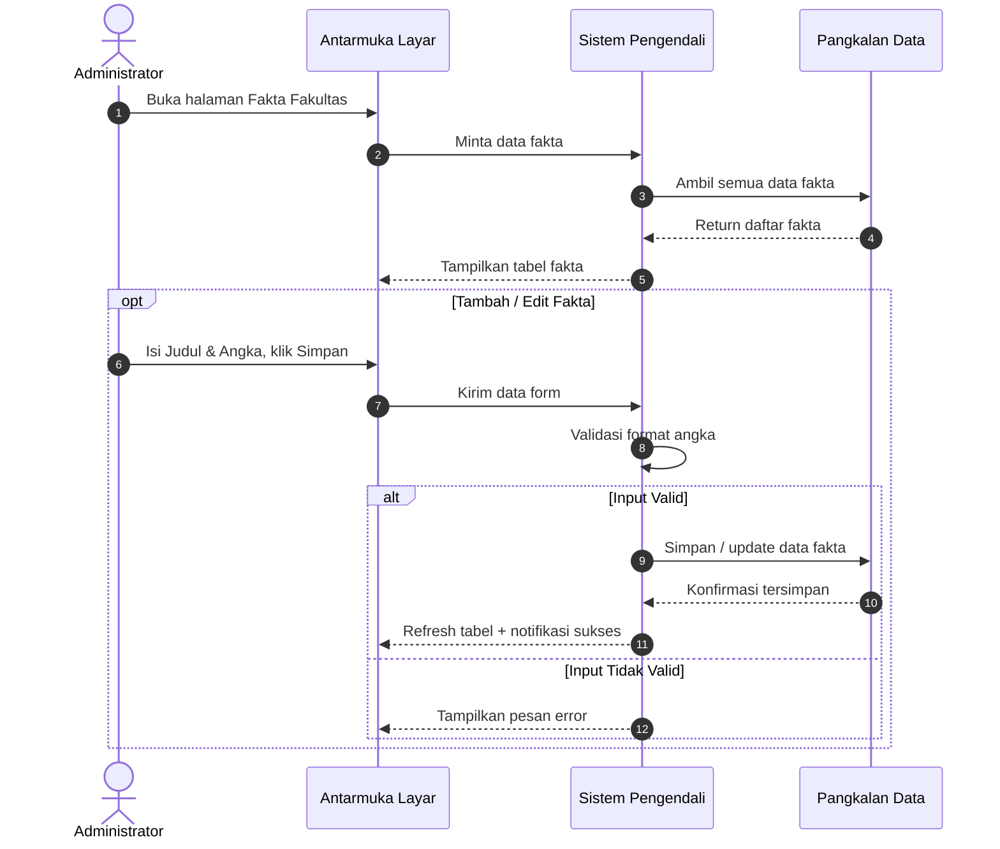
```mermaid
sequenceDiagram
    autonumber
    actor Admin as Administrator
    participant Frontend as Antarmuka Layar
    participant Backend as Sistem Pengendali
    participant DB as Pangkalan Data

    Admin->>Frontend: Buka halaman Fakta Fakultas
    Frontend->>Backend: Minta data fakta
    Backend->>DB: Ambil semua data fakta
    DB-->>Backend: Return daftar fakta
    Backend-->>Frontend: Tampilkan tabel fakta

    opt Tambah / Edit Fakta
        Admin->>Frontend: Isi Judul & Angka, klik Simpan
        Frontend->>Backend: Kirim data form
        Backend->>Backend: Validasi format angka
        alt Input Valid
            Backend->>DB: Simpan / update data fakta
            DB-->>Backend: Konfirmasi tersimpan
            Backend-->>Frontend: Refresh tabel + notifikasi sukses
        else Input Tidak Valid
            Backend-->>Frontend: Tampilkan pesan error
        end
    end
```

**Penjelasan:**
Sistem memuat tabel fakta dari Pangkalan Data. Untuk Tambah/Edit, sistem memvalidasi bahwa kolom Angka berisi bilangan numerik yang valid sebelum menyimpan atau memperbarui data.

---

## 8. Data Pendaftaran Mahasiswa

### 8.1 Activity Diagram — Data Pendaftaran

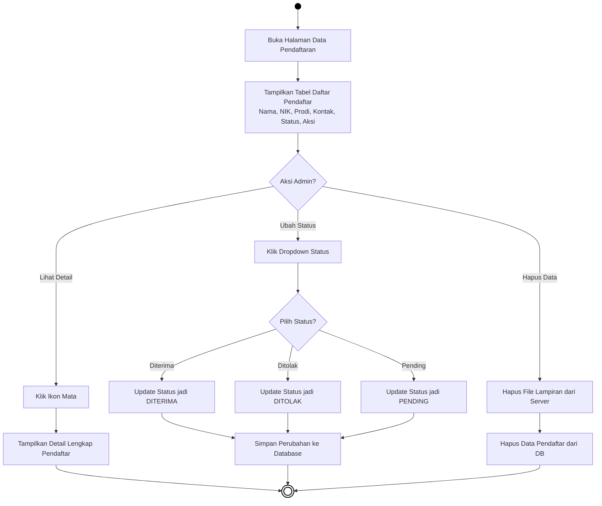
```mermaid
flowchart TD
    Start(( )) --> A[Buka Halaman Data Pendaftaran]
    A --> B[Tampilkan Tabel Daftar Pendaftar\nNama, NIK, Prodi, Kontak, Status, Aksi]

    B --> C{Aksi Admin?}

    C -- Lihat Detail --> D[Klik Ikon Mata]
    D --> E[Tampilkan Detail Lengkap Pendaftar]
    E --> End((( )))

    C -- Ubah Status --> F[Klik Dropdown Status]
    F --> G{Pilih Status?}
    G -- Diterima --> H[Update Status jadi DITERIMA]
    G -- Ditolak --> I[Update Status jadi DITOLAK]
    G -- Pending --> J[Update Status jadi PENDING]
    H --> K[Simpan Perubahan ke Database]
    I --> K
    J --> K
    K --> End

    C -- Hapus Data --> L[Hapus File Lampiran dari Server]
    L --> M[Hapus Data Pendaftar dari DB]
    M --> End

    style Start fill:#000,stroke:#000,color:#000
    style End fill:#fff,stroke:#000,stroke-width:2px
```

**Penjelasan:**
Halaman ini menampilkan tabel daftar pendaftar mahasiswa dengan kolom Nama Lengkap/NIK, Prodi & Jalur, Kontak, Status (dropdown), dan Aksi. Admin dapat melihat detail pendaftar, mengubah status (Diterima/Ditolak/Pending) langsung dari dropdown, atau menghapus data pendaftar yang tidak valid.

---

### 8.2 Sequence Diagram — Data Pendaftaran

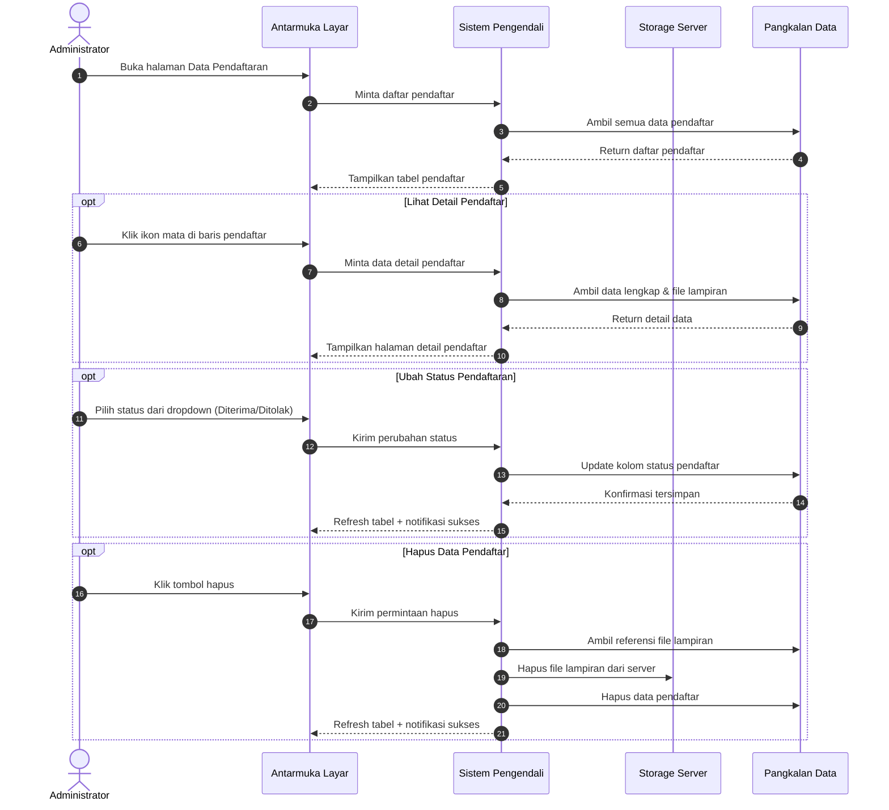
```mermaid
sequenceDiagram
    autonumber
    actor Admin as Administrator
    participant Frontend as Antarmuka Layar
    participant Backend as Sistem Pengendali
    participant Server as Storage Server
    participant DB as Pangkalan Data

    Admin->>Frontend: Buka halaman Data Pendaftaran
    Frontend->>Backend: Minta daftar pendaftar
    Backend->>DB: Ambil semua data pendaftar
    DB-->>Backend: Return daftar pendaftar
    Backend-->>Frontend: Tampilkan tabel pendaftar

    opt Lihat Detail Pendaftar
        Admin->>Frontend: Klik ikon mata di baris pendaftar
        Frontend->>Backend: Minta data detail pendaftar
        Backend->>DB: Ambil data lengkap & file lampiran
        DB-->>Backend: Return detail data
        Backend-->>Frontend: Tampilkan halaman detail pendaftar
    end

    opt Ubah Status Pendaftaran
        Admin->>Frontend: Pilih status dari dropdown (Diterima/Ditolak)
        Frontend->>Backend: Kirim perubahan status
        Backend->>DB: Update kolom status pendaftar
        DB-->>Backend: Konfirmasi tersimpan
        Backend-->>Frontend: Refresh tabel + notifikasi sukses
    end

    opt Hapus Data Pendaftar
        Admin->>Frontend: Klik tombol hapus
        Frontend->>Backend: Kirim permintaan hapus
        Backend->>DB: Ambil referensi file lampiran
        Backend->>Server: Hapus file lampiran dari server
        Backend->>DB: Hapus data pendaftar
        Backend-->>Frontend: Refresh tabel + notifikasi sukses
    end
```

**Penjelasan:**
Sistem menampilkan tabel semua pendaftar. Admin dapat melihat detail lengkap setiap pendaftar, mengubah status kelulusan langsung via dropdown (perubahan langsung tersimpan ke database), atau menghapus data pendaftar beserta file lampirannya dari server.
