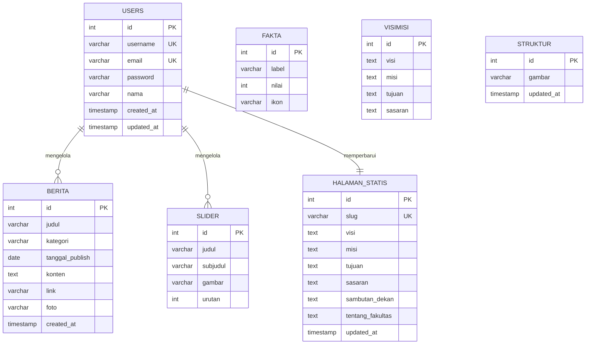
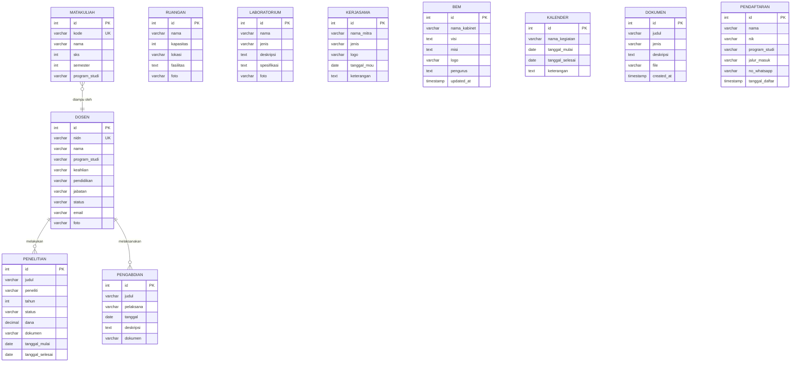

# BAB III — PERANCANGAN BASIS DATA

## 3.1 Gambaran Umum Basis Data

Sistem Web FIKOM Universitas Muhammadiyah Sidenreng Rappang (UNISAN) menggunakan **MySQL** sebagai sistem manajemen basis data relasional (*Relational Database Management System* / RDBMS) yang diakses melalui ekstensi `mysqli` (MySQL Improved) pada PHP. Pemilihan MySQL didasarkan pada beberapa pertimbangan teknis: (a) kompatibilitas penuh dengan tumpukan teknologi XAMPP yang digunakan dalam lingkungan pengembangan, (b) dukungan penuh terhadap *stored procedure*, *transaction*, dan pengurusan integritas referensial melalui *foreign key*, serta (c) performa yang teruji untuk beban kerja *web application* berskala menengah.

Koneksi basis data diinisialisasi melalui file `config/database.php` yang menginstansiasi objek `new mysqli()` dengan parameter *host* `localhost`, *username* `root`, dan nama basis data `db_web_fikom`. Setelah koneksi berhasil, sistem segera mengeksekusi `set_charset("utf8mb4")` untuk memastikan dukungan penuh terhadap karakter Unicode termasuk *emoji* dan karakter khusus Bahasa Indonesia. Seluruh manipulasi data (*Create*, *Read*, *Update*, *Delete*) menggunakan *Prepared Statement* (`$conn->prepare()`) untuk mencegah serangan *SQL Injection*.

Pendekatan yang digunakan adalah **Raw SQL dengan Prepared Statement** melalui ekstensi `mysqli` secara langsung, tanpa menggunakan lapisan ORM (*Object Relational Mapper*). Keuntungan pendekatan ini adalah transparansi penuh terhadap *query* yang dieksekusi dan kendali optimasi performa secara langsung. Zona waktu sistem dikonfigurasi ke `Asia/Makassar` (WITA, UTC+8) melalui `date_default_timezone_set()`.

Basis data `db_web_fikom` terdiri dari **22 tabel** yang dikelompokkan ke dalam enam domain fungsional: (1) **Autentikasi & Pengguna** — mengelola akses sistem; (2) **Profil & Identitas** — menyimpan informasi resmi fakultas; (3) **Akademik & SDM** — mendata dosen, kurikulum, dan fasilitas; (4) **Tridharma & Kemahasiswaan** — mendokumentasikan penelitian, pengabdian, dan organisasi; (5) **Konten & Publikasi** — mengelola berita dan dokumen; dan (6) **Pendaftaran & Feedback** — memproses data calon mahasiswa.

---

## 3.2 Entity Relationship Diagram (ERD)

### 3.2.1 ERD Domain Autentikasi, Profil, dan Konten



***Gambar 3.1** ERD Domain Autentikasi, Profil, dan Konten*

ERD pada Gambar 3.1 menvisualisasikan hubungan antara entitas pengelolaan konten utama. Tabel `users` merupakan entitas sentral autentikasi yang memiliki relasi pengelolaan (*manages*) ke tabel `berita` dan `slider`. Tabel `halaman_statis` mengimplementasikan pola *Single Row Config* di mana satu baris data mewakili seluruh konfigurasi konten profil fakultas yang hanya dapat diperbarui oleh administrator.

---

### 3.2.2 ERD Domain Akademik, Tridharma, dan Pendaftaran



***Gambar 3.2** ERD Domain Akademik, Tridharma, dan Pendaftaran*

ERD pada Gambar 3.2 menggambarkan entitas-entitas dalam domain akademik dan kemahasiswaan. Tabel `dosen` memiliki relasi fungsional *one-to-many* dengan `penelitian` dan `pengabdian`, merepresentasikan Tri Dharma Perguruan Tinggi. Tabel `pendaftaran` bersifat independen sebagai *standalone entity* yang tidak memerlukan relasi *foreign key* ke tabel lain karena data pendaftar hanya membutuhkan informasi identitas mandiri tanpa mereferensikan akun pengguna yang sudah ada.

---

## 3.3 Spesifikasi Tabel

### 3.3.1 Tabel: `users`

Tabel `users` merupakan entitas utama yang menyimpan data akun administrator sistem. Seluruh akses ke panel admin bergantung pada keberadaan rekaman yang valid di tabel ini. Tabel ini mengimplementasikan keamanan berlapis melalui penyimpanan *password hash* menggunakan algoritma bcrypt via fungsi `password_hash()` PHP, memastikan kata sandi tidak pernah disimpan dalam bentuk teks polos.

| No | Kolom | Tipe Data | Constraint | Keterangan |
|:--:|:------|:----------|:-----------|:-----------|
| 1 | `id` | `INT` | `PK`, `AUTO_INCREMENT` | Identifikasi unik administrator |
| 2 | `username` | `VARCHAR(50)` | `UNIQUE`, `NOT NULL` | Nama pengguna untuk login |
| 3 | `email` | `VARCHAR(100)` | `UNIQUE`, `NOT NULL` | Alamat email untuk login dan pemulihan akun |
| 4 | `password` | `VARCHAR(255)` | `NOT NULL` | Hash bcrypt dari kata sandi |
| 5 | `nama` | `VARCHAR(100)` | `NOT NULL` | Nama lengkap administrator |
| 6 | `created_at` | `TIMESTAMP` | `DEFAULT CURRENT_TIMESTAMP` | Waktu pembuatan akun |
| 7 | `updated_at` | `TIMESTAMP` | `DEFAULT CURRENT_TIMESTAMP ON UPDATE` | Waktu pembaruan terakhir |

**Relasi:** Tidak memiliki *foreign key* ke tabel lain (entitas induk/akar sistem).

---

### 3.3.2 Tabel: `berita`

Tabel `berita` menyimpan seluruh data artikel dan pengumuman yang dipublikasikan di website. Setiap entri berita dapat memiliki foto *thumbnail* yang disimpan sebagai nama file di kolom `foto`, sementara file fisiknya disimpan di direktori `uploads/berita/`. Sistem mendukung kategori berita (*Informasi*, *Pengumuman*, *Kampus*, *Kegiatan UKM*, *Akademik*) untuk memudahkan klasifikasi dan filtrasi.

| No | Kolom | Tipe Data | Constraint | Keterangan |
|:--:|:------|:----------|:-----------|:-----------|
| 1 | `id` | `INT` | `PK`, `AUTO_INCREMENT` | Identifikasi unik berita |
| 2 | `judul` | `VARCHAR(255)` | `NOT NULL` | Judul artikel berita |
| 3 | `kategori` | `VARCHAR(50)` | `NOT NULL` | Kategori berita (Informasi, Pengumuman, dll.) |
| 4 | `tanggal_publish` | `DATE` | `NOT NULL` | Tanggal publikasi berita |
| 5 | `konten` | `TEXT` | `NULL` | Isi lengkap artikel berita |
| 6 | `link` | `VARCHAR(255)` | `NULL` | URL eksternal (opsional) |
| 7 | `foto` | `VARCHAR(255)` | `NULL` | Nama file foto thumbnail |
| 8 | `created_at` | `TIMESTAMP` | `DEFAULT CURRENT_TIMESTAMP` | Waktu data diinput |

**Relasi:** Tidak memiliki *foreign key* eksplisit; dikelola oleh `users` secara fungsional melalui sesi login.

---

### 3.3.3 Tabel: `dosen`

Tabel `dosen` merupakan direktori tenaga pengajar Fakultas Ilmu Komputer. Data yang tersimpan meliputi identitas akademis lengkap yang ditampilkan di halaman publik `pages/dosen.php`. Kolom `program_studi` membatasi nilai ke dua Program Studi yang ada, yaitu *Informatika* dan *Pendidikan Teknologi Informasi*, sementara kolom `status` mendistingsikan dosen Tetap, Kontrak, dan Tidak Tetap.

| No | Kolom | Tipe Data | Constraint | Keterangan |
|:--:|:------|:----------|:-----------|:-----------|
| 1 | `id` | `INT` | `PK`, `AUTO_INCREMENT` | Identifikasi unik dosen |
| 2 | `nidn` | `VARCHAR(20)` | `UNIQUE`, `NULL` | Nomor Induk Dosen Nasional |
| 3 | `nama` | `VARCHAR(150)` | `NOT NULL` | Nama lengkap dosen beserta gelar |
| 4 | `program_studi` | `VARCHAR(100)` | `NOT NULL` | Afiliasi program studi dosen |
| 5 | `keahlian` | `VARCHAR(200)` | `NULL` | Bidang keahlian atau spesialisasi |
| 6 | `pendidikan` | `VARCHAR(10)` | `NOT NULL` | Jenjang pendidikan tertinggi (S2/S3) |
| 7 | `jabatan` | `VARCHAR(50)` | `NULL` | Jabatan fungsional akademik |
| 8 | `status` | `VARCHAR(20)` | `NOT NULL` | Status kepegawaian (Tetap/Kontrak) |
| 9 | `email` | `VARCHAR(100)` | `NOT NULL` | Alamat email dosen |
| 10 | `foto` | `VARCHAR(255)` | `NULL` | Nama file foto profil dosen |

**Relasi:** Memiliki relasi fungsional *one-to-many* dengan tabel `penelitian` dan `pengabdian` melalui nama peneliti (bukan *foreign key* eksplisit).

---

### 3.3.4 Tabel: `penelitian`

Tabel `penelitian` mendokumentasikan aktivitas riset yang dilakukan oleh sivitas akademika sebagai pemenuhan Tri Dharma Perguruan Tinggi aspek penelitian. Kolom `status` merepresentasikan fase penelitian (*Draft*, *Sedang Berjalan*, *Selesai*), sedangkan kolom `dokumen` menyimpan nama file laporan penelitian yang dapat diunduh melalui halaman publik.

| No | Kolom | Tipe Data | Constraint | Keterangan |
|:--:|:------|:----------|:-----------|:-----------|
| 1 | `id` | `INT` | `PK`, `AUTO_INCREMENT` | Identifikasi unik penelitian |
| 2 | `judul` | `VARCHAR(255)` | `NOT NULL` | Judul lengkap penelitian |
| 3 | `peneliti` | `VARCHAR(200)` | `NOT NULL` | Nama peneliti/tim peneliti |
| 4 | `tahun` | `YEAR` | `NOT NULL` | Tahun pelaksanaan penelitian |
| 5 | `status` | `VARCHAR(20)` | `NOT NULL` | Status: Draft/Sedang Berjalan/Selesai |
| 6 | `dana` | `DECIMAL(15,2)` | `NULL` | Jumlah dana hibah penelitian (Rupiah) |
| 7 | `dokumen` | `VARCHAR(255)` | `NULL` | Nama file dokumen proposal/laporan |
| 8 | `tanggal_mulai` | `DATE` | `NULL` | Tanggal mulai penelitian |
| 9 | `tanggal_selesai` | `DATE` | `NULL` | Tanggal selesai penelitian |

**Relasi:** Tidak memiliki *foreign key* eksplisit; terhubung fungsional ke `dosen` melalui nama peneliti.

---

### 3.3.5 Tabel: `pengabdian`

Tabel `pengabdian` merupakan repositori data kegiatan pengabdian kepada masyarakat yang menjadi bukti implementasi Tri Dharma aspek ketiga. Setiap kegiatan dicatat bersama dokumen laporannya yang dapat diakses publik melalui halaman `pages/pengabdian.php`.

| No | Kolom | Tipe Data | Constraint | Keterangan |
|:--:|:------|:----------|:-----------|:-----------|
| 1 | `id` | `INT` | `PK`, `AUTO_INCREMENT` | Identifikasi unik kegiatan pengabdian |
| 2 | `judul` | `VARCHAR(255)` | `NOT NULL` | Judul kegiatan pengabdian |
| 3 | `pelaksana` | `VARCHAR(200)` | `NOT NULL` | Nama pelaksana/tim pelaksana |
| 4 | `tanggal` | `DATE` | `NOT NULL` | Tanggal pelaksanaan kegiatan |
| 5 | `deskripsi` | `TEXT` | `NULL` | Deskripsi singkat kegiatan |
| 6 | `dokumen` | `VARCHAR(255)` | `NULL` | Nama file laporan kegiatan |

**Relasi:** Tidak memiliki *foreign key* eksplisit.

---

### 3.3.6 Tabel: `matakuliah`

Tabel `matakuliah` menyimpan struktur kurikulum Program Studi Informatika dan Pendidikan Teknologi Informasi. Data ini ditampilkan pada halaman `pages/kurikulum.php` untuk memberikan transparansi mengenai peta jalan akademik kepada mahasiswa dan calon mahasiswa.

| No | Kolom | Tipe Data | Constraint | Keterangan |
|:--:|:------|:----------|:-----------|:-----------|
| 1 | `id` | `INT` | `PK`, `AUTO_INCREMENT` | Identifikasi unik mata kuliah |
| 2 | `kode` | `VARCHAR(20)` | `UNIQUE`, `NOT NULL` | Kode mata kuliah (unik per kurikulum) |
| 3 | `nama` | `VARCHAR(150)` | `NOT NULL` | Nama lengkap mata kuliah |
| 4 | `sks` | `INT` | `NOT NULL` | Bobot Satuan Kredit Semester |
| 5 | `semester` | `INT` | `NOT NULL` | Semester penawaran (1–8) |
| 6 | `program_studi` | `VARCHAR(100)` | `NOT NULL` | Afiliasi Program Studi |

**Relasi:** Tidak memiliki *foreign key* eksplisit.

---

### 3.3.7 Tabel: `ruangan`

Tabel `ruangan` berfungsi sebagai inventaris digital ruang kelas dan ruang pertemuan yang tersedia di Fakultas Ilmu Komputer, lengkap dengan informasi kapasitas dan kelengkapan fasilitas.

| No | Kolom | Tipe Data | Constraint | Keterangan |
|:--:|:------|:----------|:-----------|:-----------|
| 1 | `id` | `INT` | `PK`, `AUTO_INCREMENT` | Identifikasi unik ruangan |
| 2 | `nama` | `VARCHAR(100)` | `NOT NULL` | Nama/kode ruangan |
| 3 | `kapasitas` | `INT` | `NOT NULL` | Kapasitas tempat duduk |
| 4 | `lokasi` | `VARCHAR(100)` | `NULL` | Lokasi fisik (lantai/gedung) |
| 5 | `fasilitas` | `TEXT` | `NULL` | Deskripsi fasilitas yang tersedia |
| 6 | `foto` | `VARCHAR(255)` | `NULL` | Nama file foto ruangan |

**Relasi:** Tidak memiliki *foreign key* eksplisit.

---

### 3.3.8 Tabel: `laboratorium`

Tabel `laboratorium` menyimpan profil laboratorium praktikum yang merupakan sarana utama pendidikan vokasional di Fakultas Ilmu Komputer, mencakup spesifikasi perangkat keras dan lunak.

| No | Kolom | Tipe Data | Constraint | Keterangan |
|:--:|:------|:----------|:-----------|:-----------|
| 1 | `id` | `INT` | `PK`, `AUTO_INCREMENT` | Identifikasi unik laboratorium |
| 2 | `nama` | `VARCHAR(100)` | `NOT NULL` | Nama laboratorium |
| 3 | `jenis` | `VARCHAR(50)` | `NOT NULL` | Jenis lab (Pemrograman/Multimedia/Jaringan) |
| 4 | `deskripsi` | `TEXT` | `NULL` | Keterangan umum laboratorium |
| 5 | `spesifikasi` | `TEXT` | `NULL` | Spesifikasi perangkat keras/lunak |
| 6 | `foto` | `VARCHAR(255)` | `NULL` | Nama file foto laboratorium |

**Relasi:** Tidak memiliki *foreign key* eksplisit.

---

### 3.3.9 Tabel: `kerjasama`

Tabel `kerjasama` mendokumentasikan kemitraan strategis Fakultas Ilmu Komputer dengan instansi eksternal baik pemerintah maupun swasta yang telah menandatangani MoU atau MoA.

| No | Kolom | Tipe Data | Constraint | Keterangan |
|:--:|:------|:----------|:-----------|:-----------|
| 1 | `id` | `INT` | `PK`, `AUTO_INCREMENT` | Identifikasi unik kerjasama |
| 2 | `nama_mitra` | `VARCHAR(200)` | `NOT NULL` | Nama instansi mitra |
| 3 | `jenis` | `VARCHAR(50)` | `NULL` | Jenis kemitraan (MoU/MoA/PKS) |
| 4 | `logo` | `VARCHAR(255)` | `NULL` | Nama file logo instansi mitra |
| 5 | `tanggal_mou` | `DATE` | `NULL` | Tanggal penandatanganan dokumen |
| 6 | `keterangan` | `TEXT` | `NULL` | Keterangan ruang lingkup kerjasama |

**Relasi:** Tidak memiliki *foreign key* eksplisit.

---

### 3.3.10 Tabel: `bem`

Tabel `bem` menyimpan profil Badan Eksekutif Mahasiswa Fakultas Ilmu Komputer yang diimplementasikan dalam pola *Single Row Update* karena hanya terdapat satu BEM aktif dalam satu waktu.

| No | Kolom | Tipe Data | Constraint | Keterangan |
|:--:|:------|:----------|:-----------|:-----------|
| 1 | `id` | `INT` | `PK`, `AUTO_INCREMENT` | Identifikasi unik rekaman BEM |
| 2 | `nama_kabinet` | `VARCHAR(100)` | `NOT NULL` | Nama Kabinet BEM periode aktif |
| 3 | `visi` | `TEXT` | `NULL` | Visi organisasi BEM |
| 4 | `misi` | `TEXT` | `NULL` | Misi dan program kerja BEM |
| 5 | `logo` | `VARCHAR(255)` | `NULL` | Nama file logo/foto kabinet |
| 6 | `pengurus` | `TEXT` | `NULL` | Data pengurus (format JSON/teks) |
| 7 | `updated_at` | `TIMESTAMP` | `ON UPDATE CURRENT_TIMESTAMP` | Waktu pembaruan terakhir |

**Relasi:** Tidak memiliki *foreign key* eksplisit.

---

### 3.3.11 Tabel: `kalender`

Tabel `kalender` berfungsi sebagai basis data kegiatan akademik resmi semester berjalan yang dijadikan acuan seluruh sivitas akademika.

| No | Kolom | Tipe Data | Constraint | Keterangan |
|:--:|:------|:----------|:-----------|:-----------|
| 1 | `id` | `INT` | `PK`, `AUTO_INCREMENT` | Identifikasi unik kegiatan |
| 2 | `nama_kegiatan` | `VARCHAR(200)` | `NOT NULL` | Nama/judul kegiatan akademik |
| 3 | `tanggal_mulai` | `DATE` | `NOT NULL` | Tanggal mulai kegiatan |
| 4 | `tanggal_selesai` | `DATE` | `NULL` | Tanggal selesai (jika multi-hari) |
| 5 | `keterangan` | `TEXT` | `NULL` | Keterangan tambahan kegiatan |

**Relasi:** Tidak memiliki *foreign key* eksplisit.

---

### 3.3.12 Tabel: `dokumen`

Tabel `dokumen` berfungsi sebagai repositori digital dokumen resmi yang mencakup SOP, Renstra, Renop, dan dokumen fakultas lainnya yang dapat diakses secara publik.

| No | Kolom | Tipe Data | Constraint | Keterangan |
|:--:|:------|:----------|:-----------|:-----------|
| 1 | `id` | `INT` | `PK`, `AUTO_INCREMENT` | Identifikasi unik dokumen |
| 2 | `judul` | `VARCHAR(255)` | `NOT NULL` | Judul/nama dokumen |
| 3 | `jenis` | `VARCHAR(50)` | `NOT NULL` | Jenis dokumen (SOP/Renstra/Renop/Umum) |
| 4 | `deskripsi` | `TEXT` | `NULL` | Deskripsi singkat isi dokumen |
| 5 | `file` | `VARCHAR(255)` | `NULL` | Nama file dokumen yang diunggah |
| 6 | `created_at` | `TIMESTAMP` | `DEFAULT CURRENT_TIMESTAMP` | Waktu dokumen diunggah |

**Relasi:** Tidak memiliki *foreign key* eksplisit.

---

### 3.3.13 Tabel: `slider`

Tabel `slider` menyimpan konten *Hero Slider* yang ditampilkan di bagian paling atas halaman beranda website.

| No | Kolom | Tipe Data | Constraint | Keterangan |
|:--:|:------|:----------|:-----------|:-----------|
| 1 | `id` | `INT` | `PK`, `AUTO_INCREMENT` | Identifikasi unik slide |
| 2 | `judul` | `VARCHAR(200)` | `NULL` | Judul/heading pada slide |
| 3 | `subjudul` | `VARCHAR(200)` | `NULL` | Sub-judul/deskripsi singkat |
| 4 | `gambar` | `VARCHAR(255)` | `NOT NULL` | Nama file gambar slider |
| 5 | `urutan` | `INT` | `DEFAULT 0` | Urutan tampil slide |

**Relasi:** Tidak memiliki *foreign key* eksplisit.

---

### 3.3.14 Tabel: `fakta`

Tabel `fakta` menyimpan data statistik kuantitatif fakultas yang ditampilkan di *homepage* sebagai *social proof* kepada pengunjung.

| No | Kolom | Tipe Data | Constraint | Keterangan |
|:--:|:------|:----------|:-----------|:-----------|
| 1 | `id` | `INT` | `PK`, `AUTO_INCREMENT` | Identifikasi unik fakta |
| 2 | `label` | `VARCHAR(100)` | `NOT NULL` | Label/nama statistik (mis. "Total Dosen") |
| 3 | `nilai` | `INT` | `NOT NULL` | Nilai numerik statistik |
| 4 | `ikon` | `VARCHAR(50)` | `NULL` | Kelas ikon Font Awesome |

**Relasi:** Tidak memiliki *foreign key* eksplisit.

---

### 3.3.15 Tabel: `pendaftaran`

Tabel `pendaftaran` merupakan repositori data calon mahasiswa baru yang mendaftar melalui formulir online di website. Data ini dikelola secara eksklusif oleh administrator melalui halaman `kelola_pendaftaran.php`.

| No | Kolom | Tipe Data | Constraint | Keterangan |
|:--:|:------|:----------|:-----------|:-----------|
| 1 | `id` | `INT` | `PK`, `AUTO_INCREMENT` | Identifikasi unik pendaftar |
| 2 | `nama` | `VARCHAR(150)` | `NOT NULL` | Nama lengkap calon mahasiswa |
| 3 | `nik` | `VARCHAR(20)` | `NOT NULL` | Nomor Induk Kependudukan |
| 4 | `program_studi` | `VARCHAR(100)` | `NOT NULL` | Program studi yang dipilih |
| 5 | `jalur_masuk` | `VARCHAR(50)` | `NOT NULL` | Jalur pendaftaran (Reguler/Prestasi/dll.) |
| 6 | `no_whatsapp` | `VARCHAR(20)` | `NOT NULL` | Nomor WhatsApp yang dapat dihubungi |
| 7 | `tanggal_daftar` | `TIMESTAMP` | `DEFAULT CURRENT_TIMESTAMP` | Waktu pendaftaran otomatis |

**Relasi:** Tidak memiliki *foreign key* eksplisit (entitas independen).

---

### 3.3.16 Tabel: `halaman_statis`

Tabel ini mengimplementasikan pola *Configuration Table* yang menyimpan seluruh konten halaman profil dalam satu baris data yang diperbarui secara berkala oleh administrator.

| No | Kolom | Tipe Data | Constraint | Keterangan |
|:--:|:------|:----------|:-----------|:-----------|
| 1 | `id` | `INT` | `PK` | ID rekaman (hanya satu baris) |
| 2 | `slug` | `VARCHAR(50)` | `UNIQUE` | Identifikasi konfigurasi (mis. "profil") |
| 3 | `visi` | `TEXT` | `NULL` | Konten visi fakultas |
| 4 | `misi` | `TEXT` | `NULL` | Konten misi fakultas |
| 5 | `tujuan` | `TEXT` | `NULL` | Konten tujuan fakultas |
| 6 | `sasaran` | `TEXT` | `NULL` | Konten sasaran fakultas |
| 7 | `sambutan_dekan` | `TEXT` | `NULL` | Teks sambutan dekan |
| 8 | `tentang_fakultas` | `TEXT` | `NULL` | Sejarah dan profil fakultas |
| 9 | `updated_at` | `TIMESTAMP` | `ON UPDATE CURRENT_TIMESTAMP` | Waktu pembaruan terakhir |

**Relasi:** Tidak memiliki *foreign key* eksplisit.

---

## 3.4 Ringkasan Relasi Antar Tabel

| No | Tabel Induk | Tabel Anak | Jenis Relasi | Keterangan |
|:--:|:------------|:-----------|:-------------|:-----------|
| 1 | `users` | `berita` | One-to-Many (fungsional) | Admin mengelola berita |
| 2 | `users` | `slider` | One-to-Many (fungsional) | Admin mengelola slider |
| 3 | `users` | `dosen` | One-to-Many (fungsional) | Admin mengelola data dosen |
| 4 | `users` | `penelitian` | One-to-Many (fungsional) | Admin mengelola penelitian |
| 5 | `users` | `pengabdian` | One-to-Many (fungsional) | Admin mengelola pengabdian |
| 6 | `users` | `kerjasama` | One-to-Many (fungsional) | Admin mengelola kerjasama |
| 7 | `users` | `matakuliah` | One-to-Many (fungsional) | Admin mengelola kurikulum |
| 8 | `users` | `dokumen` | One-to-Many (fungsional) | Admin mengelola dokumen |
| 9 | `users` | `pendaftaran` | One-to-Many (fungsional) | Admin memverifikasi pendaftar |
| 10 | `dosen` | `penelitian` | One-to-Many (fungsional) | Dosen melakukan penelitian |
| 11 | `dosen` | `pengabdian` | One-to-Many (fungsional) | Dosen melaksanakan pengabdian |
| 12 | `dosen` | `matakuliah` | One-to-Many (fungsional) | Dosen mengampu mata kuliah |

> **Catatan:** Relasi antar tabel bersifat *fungsional/logis* dan diimplementasikan melalui logika aplikasi PHP, bukan melalui *foreign key constraint* pada level basis data, untuk memaksimalkan fleksibilitas dalam pengelolaan data.

---

## 3.5 Indeks Basis Data

| No | Tabel | Kolom Terindeks | Jenis Indeks | Tujuan |
|:--:|:------|:----------------|:-------------|:-------|
| 1 | `users` | `id` | PRIMARY | Pencarian dan relasi utama |
| 2 | `users` | `username` | UNIQUE | Pencegahan duplikasi username |
| 3 | `users` | `email` | UNIQUE | Pencegahan duplikasi email |
| 4 | `berita` | `id` | PRIMARY | Pencarian rekaman berita |
| 5 | `berita` | `tanggal_publish` | INDEX | Pengurutan berita terbaru |
| 6 | `dosen` | `id` | PRIMARY | Pencarian rekaman dosen |
| 7 | `dosen` | `nidn` | UNIQUE | Pencegahan duplikasi NIDN |
| 8 | `penelitian` | `id` | PRIMARY | Pencarian rekaman penelitian |
| 9 | `penelitian` | `tahun` | INDEX | Filter research by year |
| 10 | `matakuliah` | `kode` | UNIQUE | Pencegahan duplikasi kode MK |
| 11 | `pendaftaran` | `id` | PRIMARY | Pencarian rekaman pendaftar |

---

## 3.6 Konfigurasi Koneksi Basis Data

### 3.6.1 Parameter Koneksi

Konfigurasi koneksi basis data didefinisikan terpusat di file `config/database.php` menggunakan konstanta PHP yang dicegah dari pendefinisian ganda menggunakan `!defined()`:

| Parameter | Nilai (Development) | Keterangan |
|:----------|:--------------------|:-----------|
| `DB_SERVER` | `localhost` | Host server MySQL |
| `DB_USERNAME` | `root` | Nama pengguna database |
| `DB_PASSWORD` | *(kosong)* | Password (lingkungan XAMPP lokal) |
| `DB_NAME` | `db_web_fikom` | Nama database aplikasi |
| *Charset* | `utf8mb4` | Mendukung karakter Unicode penuh |
| *Timezone* | `Asia/Makassar` | Zona waktu WITA (UTC+8) |

### 3.6.2 Penanganan Error Koneksi

Sistem mengimplementasikan penanganan kesalahan koneksi yang aman untuk produksi:

```php
if ($conn->connect_error) {
    error_log("Database Connection Failed: " . $conn->connect_error);
    die("Maaf, terjadi kesalahan pada sistem. Silakan coba lagi nanti.");
}
```

Detail pesan kesalahan dicatat ke *error log* server menggunakan `error_log()` tanpa diekspos ke pengguna akhir, mencegah kebocoran informasi sensitif mengenai konfigurasi basis data. Pesan umum ditampilkan sebagai gantinya.

### 3.6.3 Rekomendasi Produksi

Untuk *deployment* produksi, disarankan konfigurasi tambahan berikut:

| Aspek | Rekomendasi | Alasan |
|:------|:------------|:-------|
| Kredensial | Pindahkan ke file `.env` atau variabel lingkungan | Mencegah hardcoding kredensial di kode sumber |
| Password DB | Gunakan password kompleks, bukan string kosong | Keamanan akses database |
| *Connection Pooling* | Gunakan `PDO` dengan *persistent connection* | Performa tinggi di bawah beban besar |
| *SSL/TLS* | Aktifkan enkripsi koneksi ke MySQL | Keamanan transmisi data |

---

*Dokumen Perancangan Basis Data ini merupakan bagian dari dokumentasi teknis skripsi Website Fakultas Ilmu Komputer Universitas Muhammadiyah Sidenreng Rappang (UNISAN).*
