# BAB III — Perancangan Basis Data

## 3.1 Gambaran Umum Basis Data

Sistem Web FIKOM Universitas Muhammadiyah Sidenreng Rappang (UNISAN) menggunakan **MySQL (MariaDB 10.4.32)** sebagai sistem manajemen basis data relasional yang diakses melalui ekstensi `mysqli` pada PHP. Koneksi basis data diinisialisasi melalui file `config/database.php` dengan parameter host `localhost`, username `root`, dan nama basis data `db_web_fikom`. Setelah koneksi berhasil, sistem mengeksekusi `set_charset("utf8mb4")` untuk mendukung seluruh karakter Unicode termasuk karakter khusus Bahasa Indonesia.

Seluruh manipulasi data (*Create*, *Read*, *Update*, *Delete*) menggunakan **Prepared Statement** (`$conn->prepare()`) untuk mencegah serangan *SQL Injection*.

Basis data `db_web_fikom` terdiri dari **22 tabel** yang dikelompokkan ke dalam enam domain fungsional:

| Domain | Tabel | Keterangan |
|:-------|:------|:-----------|
| **Autentikasi & Pengguna** | `users`, `mahasiswa` | Akses sistem & data mahasiswa |
| **Profil & Identitas** | `tentang_fikom`, `halaman_statis`, `visi_misi`, `hero_slider`, `tb_fakta` | Konten profil fakultas |
| **Akademik & SDM** | `dosen`, `tabel_dosen`, `kurikulum`, `ruangan`, `laboratorium` | Data civitas akademika & fasilitas |
| **Tridharma** | `penelitian`, `pengabdian`, `kerjasama` | Tri Dharma Perguruan Tinggi |
| **Konten & Dokumen** | `berita`, `sop`, `rencana_strategis`, `rencana_operasional` | Publikasi & dokumen resmi |
| **Kemahasiswaan & Lainnya** | `bem_struktur`, `kalender_akademik`, `pendaftaran` | Kemahasiswaan & PMB |

---

## 3.2 Entity Relationship Diagram (ERD)

Diagram ERD berikut menggambarkan seluruh **22 tabel** yang terdapat dalam basis data `db_web_fikom` secara terpadu dalam satu diagram relasi. Tabel `users` berperan sebagai entitas pusat autentikasi yang memiliki hubungan pengelolaan (*manages*) ke seluruh tabel konten melalui sesi administrator. Tabel `dosen` menjadi entitas inti domain akademik yang terhubung dengan tabel Tri Dharma (penelitian dan pengabdian).

```mermaid
erDiagram
    USERS {
        int id PK
        varchar username UK
        varchar email UK
        varchar password
    }

    BERITA {
        int id PK
        varchar judul
        varchar kategori
        date tanggal_publish
        text konten
        varchar link
        varchar foto
        timestamp created_at
    }

    HERO_SLIDER {
        int id PK
        varchar gambar
        tinyint is_active
    }

    TB_FAKTA {
        int id PK
        varchar judul
        int angka
        int urutan
    }

    TENTANG_FIKOM {
        int id PK
        varchar judul
        text deskripsi
        varchar gambar
    }

    VISI_MISI {
        int id PK
        varchar kategori
        text konten
        int urutan
    }

    HALAMAN_STATIS {
        int id PK
        varchar nama_halaman UK
        varchar gambar_path
        text konten
        timestamp updated_at
    }

    DOSEN {
        int id PK
        varchar nidn UK
        varchar nama
        varchar program_studi
        varchar keahlian
        varchar pendidikan
        varchar jabatan
        varchar status
        varchar email
        varchar foto
    }

    TABEL_DOSEN {
        int id PK
        varchar nama
        varchar nidn
        varchar prodi
    }

    KURIKULUM {
        int id PK
        varchar nama_kurikulum
        text deskripsi
        varchar file_pdf
    }

    RUANGAN {
        int id PK
        varchar nama_ruangan
        text deskripsi
        varchar foto
    }

    LABORATORIUM {
        int id PK
        varchar nama_lab
        text deskripsi
        varchar foto
    }

    MAHASISWA {
        int id PK
        varchar nim UK
        varchar nama
        varchar program_studi
        int angkatan
        varchar status
    }

    PENELITIAN {
        int id PK
        varchar judul
        varchar peneliti
        int tahun
        varchar status
        varchar skim_penelitian
        varchar kelompok_bidang
        varchar nomor_sk
        varchar lama_kegiatan
        varchar sumber_dana
        int jumlah_dana
        date tanggal_mulai
        date tanggal_selesai
        varchar lokasi_penelitian
        varchar afiliasi
        varchar file_proposal
        varchar file_laporan
        varchar link_publikasi
    }

    PENGABDIAN {
        int id PK
        varchar judul
        varchar pelaksana
        text deskripsi
        varchar file_pdf
        date tanggal_kegiatan
    }

    KERJASAMA {
        int id PK
        varchar nama_instansi
        varchar logo
        varchar link_website
        varchar bulan
        int tahun
    }

    BEM_STRUKTUR {
        int id PK
        varchar nama
        varchar jabatan
        varchar prodi
        varchar kategori
        int urutan
        varchar foto
    }

    KALENDER_AKADEMIK {
        int id PK
        varchar nama_kalender
        text deskripsi
        varchar gambar
        varchar tahun_akademik
    }

    PENDAFTARAN {
        int id PK
        varchar nama
        varchar nik
        varchar email
        varchar hp
        varchar tempat_lahir
        date tanggal_lahir
        varchar jk
        varchar asal_sekolah
        varchar prodi
        varchar jalur
        text alamat
        varchar file_ktp
        varchar file_ijazah
        varchar catatan
        timestamp created_at
    }

    SOP {
        int id PK
        varchar nama_sop
        text deskripsi
        varchar file_pdf
    }

    RENCANA_STRATEGIS {
        int id PK
        varchar nama_dokumen
        text deskripsi
        varchar file_pdf
    }

    RENCANA_OPERASIONAL {
        int id PK
        varchar nama_dokumen
        text deskripsi
        varchar file_pdf
    }

    %% === RELASI USERS (Pusat Autentikasi & Pengelolaan) ===
    USERS ||--o{ BERITA : "mengelola"
    USERS ||--o{ HERO_SLIDER : "mengelola"
    USERS ||--|| TENTANG_FIKOM : "memperbarui"
    USERS ||--o{ VISI_MISI : "mengelola"
    USERS ||--o{ TB_FAKTA : "mengelola"
    USERS ||--|| HALAMAN_STATIS : "memperbarui"
    USERS ||--o{ KERJASAMA : "mengelola"
    USERS ||--o{ SOP : "mengunggah"
    USERS ||--o{ RENCANA_STRATEGIS : "mengunggah"
    USERS ||--o{ RENCANA_OPERASIONAL : "mengunggah"
    USERS ||--o{ KALENDER_AKADEMIK : "mengelola"
    USERS ||--o{ PENDAFTARAN : "memverifikasi"
    USERS ||--o{ BEM_STRUKTUR : "mengelola"

    %% === RELASI DOSEN (Pusat Domain Akademik) ===
    USERS ||--o{ DOSEN : "mengelola"
    DOSEN ||--o{ PENELITIAN : "melakukan"
    DOSEN ||--o{ PENGABDIAN : "melaksanakan"
    DOSEN ||--o{ TABEL_DOSEN : "direferensikan"
    DOSEN ||--o{ KURIKULUM : "mengampu"
    DOSEN ||--o{ RUANGAN : "menggunakan"
    DOSEN ||--o{ LABORATORIUM : "menggunakan"

    %% === RELASI MAHASISWA ===
    MAHASISWA ||--o{ PENDAFTARAN : "berasal dari"
```



***Gambar 3.1** ERD Terpadu Seluruh Tabel Basis Data `db_web_fikom` (22 Tabel)*

**Keterangan Notasi Relasi:**

| Notasi | Makna | Contoh |
|:------:|:------|:-------|
| `\|\|--o{` | Satu ke Banyak (*One-to-Many*) | Satu `users` mengelola banyak `berita` |
| `\|\|--\|\|` | Satu ke Satu (*One-to-One*) | Satu `users` memperbarui satu `tentang_fikom` |
| `o{--\|\|` | Banyak ke Satu (*Many-to-One*) | Banyak `penelitian` dilakukan oleh satu `dosen` |

### 3.2.1 Penjelasan Relasi Antar Tabel

Berdasarkan diagram ERD di atas, tabel `users` berperan sebagai pusat sistem yang mengontrol seluruh data di website. Satu akun administrator dapat mengelola banyak data sekaligus, seperti menambah atau menghapus berita, mengatur gambar slider di halaman utama, memperbarui konten visi misi, mengunggah dokumen SOP dan Renstra, serta mengelola data kerjasama, kalender akademik, dan struktur BEM. Khusus untuk tabel `tentang_fikom` dan `halaman_statis`, satu administrator hanya mengelola satu data saja karena kedua halaman tersebut bersifat tunggal dalam sistem.

Tabel `dosen` berfungsi sebagai pusat data akademik. Satu dosen bisa memiliki banyak data penelitian dan pengabdian yang tercatat di sistem, mencerminkan kegiatan Tri Dharma Perguruan Tinggi yang menjadi kewajiban setiap dosen. Selain itu, dosen juga terhubung dengan data kurikulum, ruangan, dan laboratorium yang digunakan dalam proses pembelajaran. Sementara itu, tabel `pendaftaran` menyimpan data calon mahasiswa yang mendaftar secara online, dan setelah diterima, datanya akan tercatat sebagai mahasiswa aktif di tabel `mahasiswa`.

---

## 3.3 Spesifikasi Tabel

### 3.3.1 Tabel: `users`

Tabel `users` menyimpan data akun administrator sistem. Kata sandi disimpan dalam bentuk *hash* bcrypt melalui fungsi `password_hash()`.

| No | Kolom | Tipe Data | Constraint | Keterangan |
|:--:|:------|:----------|:-----------|:-----------|
| 1 | `id` | `INT` | `PK`, `AUTO_INCREMENT` | Identifikasi unik administrator |
| 2 | `username` | `VARCHAR(50)` | `UNIQUE`, `NOT NULL` | Nama pengguna untuk login |
| 3 | `email` | `VARCHAR(100)` | `UNIQUE`, `NOT NULL` | Alamat email untuk login |
| 4 | `password` | `VARCHAR(255)` | `NOT NULL` | Hash bcrypt dari kata sandi |

---

### 3.3.2 Tabel: `berita`

Tabel `berita` menyimpan seluruh data artikel dan pengumuman yang dipublikasikan di website. File foto disimpan di direktori `uploads/berita/`.

| No | Kolom | Tipe Data | Constraint | Keterangan |
|:--:|:------|:----------|:-----------|:-----------|
| 1 | `id` | `INT` | `PK`, `AUTO_INCREMENT` | Identifikasi unik berita |
| 2 | `judul` | `VARCHAR(255)` | `NOT NULL` | Judul artikel berita |
| 3 | `kategori` | `VARCHAR(50)` | `NOT NULL` | Kategori (Informasi, Pengumuman, Kampus, dll.) |
| 4 | `tanggal_publish` | `DATE` | `NOT NULL` | Tanggal publikasi |
| 5 | `konten` | `TEXT` | `NULL` | Isi lengkap artikel |
| 6 | `link` | `VARCHAR(255)` | `NULL` | URL eksternal (opsional) |
| 7 | `foto` | `VARCHAR(255)` | `NULL` | Nama file foto thumbnail |
| 8 | `created_at` | `TIMESTAMP` | `DEFAULT CURRENT_TIMESTAMP` | Waktu data diinput |

---

### 3.3.3 Tabel: `dosen`

Tabel `dosen` merupakan direktori tenaga pengajar Fakultas Ilmu Komputer yang ditampilkan di halaman publik. File foto disimpan di direktori `uploads/dosen/`.

| No | Kolom | Tipe Data | Constraint | Keterangan |
|:--:|:------|:----------|:-----------|:-----------|
| 1 | `id` | `INT` | `PK`, `AUTO_INCREMENT` | Identifikasi unik dosen |
| 2 | `nidn` | `VARCHAR(20)` | `UNIQUE`, `NULL` | Nomor Induk Dosen Nasional |
| 3 | `nama` | `VARCHAR(150)` | `NOT NULL` | Nama lengkap dosen beserta gelar |
| 4 | `program_studi` | `VARCHAR(100)` | `NOT NULL` | Afiliasi program studi |
| 5 | `keahlian` | `VARCHAR(200)` | `NULL` | Bidang keahlian atau spesialisasi |
| 6 | `pendidikan` | `VARCHAR(10)` | `NOT NULL` | Jenjang pendidikan tertinggi (S2/S3) |
| 7 | `jabatan` | `VARCHAR(50)` | `NULL` | Jabatan fungsional akademik |
| 8 | `status` | `VARCHAR(20)` | `NOT NULL` | Status kepegawaian (Tetap/Kontrak/Tidak Tetap) |
| 9 | `email` | `VARCHAR(100)` | `NOT NULL` | Alamat email dosen |
| 10 | `foto` | `VARCHAR(255)` | `NULL` | Nama file foto profil (maks 2MB, JPG/PNG/WebP) |

---

### 3.3.4 Tabel: `penelitian`

Tabel `penelitian` mendokumentasikan aktivitas riset sivitas akademika. Mendukung upload dua file terpisah (proposal dan laporan) ke direktori `uploads/penelitian_proposal/` dan `uploads/penelitian_laporan/`.

| No | Kolom | Tipe Data | Constraint | Keterangan |
|:--:|:------|:----------|:-----------|:-----------|
| 1 | `id` | `INT` | `PK`, `AUTO_INCREMENT` | Identifikasi unik penelitian |
| 2 | `judul` | `VARCHAR(255)` | `NOT NULL` | Judul lengkap penelitian |
| 3 | `peneliti` | `VARCHAR(200)` | `NOT NULL` | Nama peneliti/tim peneliti |
| 4 | `tahun` | `INT` | `NOT NULL` | Tahun pelaksanaan penelitian |
| 5 | `status` | `VARCHAR(20)` | `NOT NULL` | Status: Draft / Sedang Berjalan / Selesai |
| 6 | `skim_penelitian` | `VARCHAR(100)` | `NULL` | Skim/skema penelitian yang diikuti |
| 7 | `kelompok_bidang` | `VARCHAR(100)` | `NULL` | Kelompok bidang riset |
| 8 | `nomor_sk` | `VARCHAR(100)` | `NULL` | Nomor Surat Keputusan penelitian |
| 9 | `lama_kegiatan` | `VARCHAR(50)` | `NULL` | Durasi kegiatan (mis. "6 Bulan") |
| 10 | `sumber_dana` | `VARCHAR(50)` | `NULL` | Sumber dana (Internal/Eksternal/Mandiri/Lainnya) |
| 11 | `jumlah_dana` | `INT` | `NULL` | Jumlah dana dalam Rupiah |
| 12 | `tanggal_mulai` | `DATE` | `NULL` | Tanggal mulai penelitian |
| 13 | `tanggal_selesai` | `DATE` | `NULL` | Tanggal selesai penelitian |
| 14 | `lokasi_penelitian` | `VARCHAR(200)` | `NULL` | Lokasi/tempat pelaksanaan |
| 15 | `afiliasi` | `VARCHAR(200)` | `NULL` | Afiliasi institusi peneliti |
| 16 | `file_proposal` | `VARCHAR(255)` | `NULL` | Nama file proposal (PDF/DOC/DOCX) |
| 17 | `file_laporan` | `VARCHAR(255)` | `NULL` | Nama file laporan akhir (PDF/DOC/DOCX) |
| 18 | `link_publikasi` | `VARCHAR(255)` | `NULL` | URL publikasi/jurnal online |

---

### 3.3.5 Tabel: `pengabdian`

Tabel `pengabdian` mendokumentasikan kegiatan pengabdian kepada masyarakat. File dokumen disimpan di direktori `uploads/pengabdian_file/`.

| No | Kolom | Tipe Data | Constraint | Keterangan |
|:--:|:------|:----------|:-----------|:-----------|
| 1 | `id` | `INT` | `PK`, `AUTO_INCREMENT` | Identifikasi unik kegiatan pengabdian |
| 2 | `judul` | `VARCHAR(255)` | `NOT NULL` | Judul kegiatan pengabdian |
| 3 | `pelaksana` | `VARCHAR(200)` | `NOT NULL` | Nama pelaksana/tim pelaksana |
| 4 | `deskripsi` | `TEXT` | `NULL` | Deskripsi singkat kegiatan |
| 5 | `file_pdf` | `VARCHAR(255)` | `NULL` | Nama file laporan (PDF/DOC/DOCX, maks 5MB) |
| 6 | `tanggal_kegiatan` | `DATE` | `NULL` | Tanggal pelaksanaan kegiatan |

---

### 3.3.6 Tabel: `kerjasama`

Tabel `kerjasama` mendokumentasikan kemitraan strategis dengan instansi eksternal. File logo disimpan di direktori `uploads/kerjasama/`.

| No | Kolom | Tipe Data | Constraint | Keterangan |
|:--:|:------|:----------|:-----------|:-----------|
| 1 | `id` | `INT` | `PK`, `AUTO_INCREMENT` | Identifikasi unik kerjasama |
| 2 | `nama_instansi` | `VARCHAR(200)` | `NOT NULL` | Nama instansi mitra |
| 3 | `logo` | `VARCHAR(255)` | `NULL` | Nama file logo instansi mitra |
| 4 | `link_website` | `VARCHAR(255)` | `NULL` | URL website resmi mitra |
| 5 | `bulan` | `VARCHAR(20)` | `NULL` | Bulan penandatanganan MoU |
| 6 | `tahun` | `INT` | `NULL` | Tahun penandatanganan MoU |

---

### 3.3.7 Tabel: `bem_struktur`

Tabel `bem_struktur` menyimpan data per-anggota struktur organisasi BEM dengan kategorisasi hierarki (*inti*, *sekben*, *departemen*). File foto disimpan di direktori `uploads/bem/`.

| No | Kolom | Tipe Data | Constraint | Keterangan |
|:--:|:------|:----------|:-----------|:-----------|
| 1 | `id` | `INT` | `PK`, `AUTO_INCREMENT` | Identifikasi unik anggota BEM |
| 2 | `nama` | `VARCHAR(100)` | `NOT NULL` | Nama lengkap anggota |
| 3 | `jabatan` | `VARCHAR(100)` | `NOT NULL` | Jabatan dalam BEM |
| 4 | `prodi` | `VARCHAR(100)` | `NULL` | Program studi dan angkatan |
| 5 | `kategori` | `VARCHAR(20)` | `NOT NULL` | Hierarki: `inti` / `sekben` / `departemen` |
| 6 | `urutan` | `INT` | `DEFAULT 1` | Urutan tampil dalam hierarki |
| 7 | `foto` | `VARCHAR(255)` | `NOT NULL` | Nama file foto anggota (JPG/PNG, wajib) |

---

### 3.3.8 Tabel: `kalender_akademik`

Tabel `kalender_akademik` menyimpan jadwal dan kegiatan akademik resmi per tahun akademik. File gambar/poster disimpan di direktori `uploads/kalender/`.

| No | Kolom | Tipe Data | Constraint | Keterangan |
|:--:|:------|:----------|:-----------|:-----------|
| 1 | `id` | `INT` | `PK`, `AUTO_INCREMENT` | Identifikasi unik kegiatan |
| 2 | `nama_kalender` | `VARCHAR(200)` | `NOT NULL` | Nama/judul kegiatan akademik |
| 3 | `deskripsi` | `TEXT` | `NULL` | Keterangan kegiatan |
| 4 | `gambar` | `VARCHAR(255)` | `NULL` | Nama file gambar/poster kalender |
| 5 | `tahun_akademik` | `VARCHAR(20)` | `NOT NULL` | Tahun akademik (mis. "2024/2025") |

---

### 3.3.9 Tabel: `pendaftaran`

Tabel `pendaftaran` merupakan repositori data calon mahasiswa baru yang mendaftar melalui formulir online di website. Mendukung upload dua dokumen (KTP dan Ijazah) ke direktori `uploads/pendaftaran/`.

| No | Kolom | Tipe Data | Constraint | Keterangan |
|:--:|:------|:----------|:-----------|:-----------|
| 1 | `id` | `INT` | `PK`, `AUTO_INCREMENT` | Identifikasi unik pendaftar |
| 2 | `nama` | `VARCHAR(150)` | `NOT NULL` | Nama lengkap calon mahasiswa |
| 3 | `nik` | `VARCHAR(20)` | `NOT NULL` | Nomor Induk Kependudukan |
| 4 | `email` | `VARCHAR(100)` | `NOT NULL` | Alamat email pendaftar |
| 5 | `hp` | `VARCHAR(20)` | `NOT NULL` | Nomor handphone/WhatsApp |
| 6 | `tempat_lahir` | `VARCHAR(100)` | `NULL` | Kota tempat lahir |
| 7 | `tanggal_lahir` | `DATE` | `NULL` | Tanggal lahir |
| 8 | `jk` | `VARCHAR(10)` | `NULL` | Jenis kelamin (Laki-laki/Perempuan) |
| 9 | `asal_sekolah` | `VARCHAR(200)` | `NULL` | Nama sekolah/madrasah asal |
| 10 | `prodi` | `VARCHAR(100)` | `NOT NULL` | Program studi pilihan |
| 11 | `jalur` | `VARCHAR(50)` | `NOT NULL` | Jalur pendaftaran (Reguler/Prestasi/dll.) |
| 12 | `alamat` | `TEXT` | `NULL` | Alamat lengkap pendaftar |
| 13 | `file_ktp` | `VARCHAR(255)` | `NULL` | Nama file scan KTP |
| 14 | `file_ijazah` | `VARCHAR(255)` | `NULL` | Nama file scan Ijazah/SKHUN |
| 15 | `catatan` | `VARCHAR(255)` | `NULL` | Catatan tambahan pendaftar |
| 16 | `created_at` | `TIMESTAMP` | `DEFAULT CURRENT_TIMESTAMP` | Waktu pendaftaran otomatis |

---

### 3.3.10 Tabel: `kurikulum`

Tabel `kurikulum` menyimpan dokumen kurikulum resmi Program Studi. File PDF disimpan di direktori `uploads/kurikulum/`.

| No | Kolom | Tipe Data | Constraint | Keterangan |
|:--:|:------|:----------|:-----------|:-----------|
| 1 | `id` | `INT` | `PK`, `AUTO_INCREMENT` | Identifikasi unik kurikulum |
| 2 | `nama_kurikulum` | `VARCHAR(200)` | `NOT NULL` | Nama/judul dokumen kurikulum |
| 3 | `deskripsi` | `TEXT` | `NULL` | Deskripsi kurikulum |
| 4 | `file_pdf` | `VARCHAR(255)` | `NULL` | Nama file PDF kurikulum |

---

### 3.3.11 Tabel: `ruangan`

Tabel `ruangan` merupakan inventaris digital ruang kelas dan ruang pertemuan. File foto disimpan di direktori `uploads/ruangan/`.

| No | Kolom | Tipe Data | Constraint | Keterangan |
|:--:|:------|:----------|:-----------|:-----------|
| 1 | `id` | `INT` | `PK`, `AUTO_INCREMENT` | Identifikasi unik ruangan |
| 2 | `nama_ruangan` | `VARCHAR(100)` | `NOT NULL` | Nama/kode ruangan |
| 3 | `deskripsi` | `TEXT` | `NULL` | Deskripsi dan fasilitas ruangan |
| 4 | `foto` | `VARCHAR(255)` | `NULL` | Nama file foto ruangan |

---

### 3.3.12 Tabel: `laboratorium`

Tabel `laboratorium` menyimpan profil laboratorium praktikum Fakultas Ilmu Komputer. File foto disimpan di direktori `uploads/laboratorium/`.

| No | Kolom | Tipe Data | Constraint | Keterangan |
|:--:|:------|:----------|:-----------|:-----------|
| 1 | `id` | `INT` | `PK`, `AUTO_INCREMENT` | Identifikasi unik laboratorium |
| 2 | `nama_lab` | `VARCHAR(100)` | `NOT NULL` | Nama laboratorium |
| 3 | `deskripsi` | `TEXT` | `NULL` | Deskripsi dan spesifikasi laboratorium |
| 4 | `foto` | `VARCHAR(255)` | `NULL` | Nama file foto laboratorium |

---

### 3.3.13 Tabel: `sop`

Tabel `sop` merupakan repositori digital Standar Operasional Prosedur (SOP) resmi fakultas. File PDF disimpan di direktori `uploads/sop/`.

| No | Kolom | Tipe Data | Constraint | Keterangan |
|:--:|:------|:----------|:-----------|:-----------|
| 1 | `id` | `INT` | `PK`, `AUTO_INCREMENT` | Identifikasi unik SOP |
| 2 | `nama_sop` | `VARCHAR(255)` | `NOT NULL` | Nama/judul dokumen SOP |
| 3 | `deskripsi` | `TEXT` | `NULL` | Deskripsi singkat isi SOP |
| 4 | `file_pdf` | `VARCHAR(255)` | `NULL` | Nama file PDF SOP |

---

### 3.3.14 Tabel: `rencana_strategis`

Tabel `rencana_strategis` menyimpan dokumen Renstra (Rencana Strategis) fakultas. File PDF disimpan di direktori `uploads/renstra/`.

| No | Kolom | Tipe Data | Constraint | Keterangan |
|:--:|:------|:----------|:-----------|:-----------|
| 1 | `id` | `INT` | `PK`, `AUTO_INCREMENT` | Identifikasi unik dokumen |
| 2 | `nama_dokumen` | `VARCHAR(255)` | `NOT NULL` | Nama/judul dokumen Renstra |
| 3 | `deskripsi` | `TEXT` | `NULL` | Deskripsi dokumen |
| 4 | `file_pdf` | `VARCHAR(255)` | `NULL` | Nama file PDF Renstra |

---

### 3.3.15 Tabel: `rencana_operasional`

Tabel `rencana_operasional` menyimpan dokumen Renop (Rencana Operasional) fakultas. File PDF disimpan di direktori `uploads/renop/`.

| No | Kolom | Tipe Data | Constraint | Keterangan |
|:--:|:------|:----------|:-----------|:-----------|
| 1 | `id` | `INT` | `PK`, `AUTO_INCREMENT` | Identifikasi unik dokumen |
| 2 | `nama_dokumen` | `VARCHAR(255)` | `NOT NULL` | Nama/judul dokumen Renop |
| 3 | `deskripsi` | `TEXT` | `NULL` | Deskripsi dokumen |
| 4 | `file_pdf` | `VARCHAR(255)` | `NULL` | Nama file PDF Renop |

---

### 3.3.16 Tabel: `hero_slider`

Tabel `hero_slider` menyimpan konten *Hero Slider* yang ditampilkan di bagian paling atas halaman beranda website. File gambar disimpan di direktori `uploads/slider/`.

| No | Kolom | Tipe Data | Constraint | Keterangan |
|:--:|:------|:----------|:-----------|:-----------|
| 1 | `id` | `INT` | `PK`, `AUTO_INCREMENT` | Identifikasi unik slide |
| 2 | `gambar` | `VARCHAR(255)` | `NOT NULL` | Nama file gambar slider |
| 3 | `is_active` | `TINYINT(1)` | `DEFAULT 1` | Status aktif slider (1=aktif, 0=nonaktif) |

---

### 3.3.17 Tabel: `tb_fakta`

Tabel `tb_fakta` menyimpan data statistik kuantitatif fakultas yang ditampilkan di *homepage* sebagai angka pencapaian.

| No | Kolom | Tipe Data | Constraint | Keterangan |
|:--:|:------|:----------|:-----------|:-----------|
| 1 | `id` | `INT` | `PK`, `AUTO_INCREMENT` | Identifikasi unik fakta |
| 2 | `judul` | `VARCHAR(100)` | `NOT NULL` | Label statistik (mis. "Total Dosen") |
| 3 | `angka` | `INT` | `NOT NULL` | Nilai numerik statistik |
| 4 | `urutan` | `INT` | `DEFAULT 0` | Urutan tampil di homepage |

---

### 3.3.18 Tabel: `tentang_fikom`

Tabel `tentang_fikom` mengimplementasikan pola *Single Row Config* yang menyimpan profil dan deskripsi umum Fakultas Ilmu Komputer. File gambar disimpan di direktori `uploads/tentang/`.

| No | Kolom | Tipe Data | Constraint | Keterangan |
|:--:|:------|:----------|:-----------|:-----------|
| 1 | `id` | `INT` | `PK` | ID rekaman (hanya 1 baris, id=1) |
| 2 | `judul` | `VARCHAR(200)` | `NOT NULL` | Judul/heading halaman tentang |
| 3 | `deskripsi` | `TEXT` | `NULL` | Deskripsi/sejarah fakultas |
| 4 | `gambar` | `VARCHAR(255)` | `NULL` | Nama file gambar gedung/ilustrasi |

---

### 3.3.19 Tabel: `visi_misi`

Tabel `visi_misi` menggunakan pola *Multi-Row Category* di mana satu tabel menyimpan semua jenis konten (Visi, Misi, Tujuan, Sasaran) yang dibedakan dengan kolom `kategori`.

| No | Kolom | Tipe Data | Constraint | Keterangan |
|:--:|:------|:----------|:-----------|:-----------|
| 1 | `id` | `INT` | `PK`, `AUTO_INCREMENT` | Identifikasi unik item |
| 2 | `kategori` | `VARCHAR(20)` | `NOT NULL` | Jenis konten: `Visi` / `Misi` / `Tujuan` / `Sasaran` |
| 3 | `konten` | `TEXT` | `NOT NULL` | Isi teks konten |
| 4 | `urutan` | `INT` | `DEFAULT 0` | Nomor urut tampil |

---

### 3.3.20 Tabel: `halaman_statis`

Tabel `halaman_statis` menyimpan konten halaman-halaman statis yang dikelola via upload gambar, termasuk gambar struktur organisasi. Setiap baris merepresentasikan satu halaman dengan slug unik.

| No | Kolom | Tipe Data | Constraint | Keterangan |
|:--:|:------|:----------|:-----------|:-----------|
| 1 | `id` | `INT` | `PK`, `AUTO_INCREMENT` | Identifikasi unik halaman |
| 2 | `nama_halaman` | `VARCHAR(100)` | `UNIQUE`, `NOT NULL` | Slug identitas halaman (mis. `struktur_organisasi`) |
| 3 | `gambar_path` | `VARCHAR(255)` | `NULL` | Nama file gambar halaman |
| 4 | `konten` | `TEXT` | `NULL` | Konten teks tambahan (opsional) |
| 5 | `updated_at` | `TIMESTAMP` | `ON UPDATE CURRENT_TIMESTAMP` | Waktu pembaruan terakhir |

---

### 3.3.21 Tabel: `mahasiswa`

Tabel `mahasiswa` menyimpan data mahasiswa aktif yang terdaftar di sistem, berbeda dari tabel `pendaftaran` yang merekam proses PMB.

| No | Kolom | Tipe Data | Constraint | Keterangan |
|:--:|:------|:----------|:-----------|:-----------|
| 1 | `id` | `INT` | `PK`, `AUTO_INCREMENT` | Identifikasi unik mahasiswa |
| 2 | `nim` | `VARCHAR(20)` | `UNIQUE`, `NOT NULL` | Nomor Induk Mahasiswa |
| 3 | `nama` | `VARCHAR(150)` | `NOT NULL` | Nama lengkap mahasiswa |
| 4 | `program_studi` | `VARCHAR(100)` | `NOT NULL` | Program studi |
| 5 | `angkatan` | `INT` | `NOT NULL` | Tahun angkatan masuk |
| 6 | `status` | `VARCHAR(20)` | `DEFAULT 'Aktif'` | Status akademik (Aktif/Cuti/Lulus) |

---

### 3.3.22 Tabel: `tabel_dosen`

Tabel `tabel_dosen` merupakan tabel tambahan yang digunakan sebagai referensi cepat data nama dosen untuk keperluan *dropdown* dan autofill pada form-form admin.

| No | Kolom | Tipe Data | Constraint | Keterangan |
|:--:|:------|:----------|:-----------|:-----------|
| 1 | `id` | `INT` | `PK`, `AUTO_INCREMENT` | Identifikasi unik |
| 2 | `nama` | `VARCHAR(150)` | `NOT NULL` | Nama lengkap dosen |
| 3 | `nidn` | `VARCHAR(20)` | `NULL` | NIDN (referensi ke tabel `dosen`) |
| 4 | `prodi` | `VARCHAR(100)` | `NULL` | Program studi |

---

## 3.4 Ringkasan Seluruh Tabel Database

| No | Nama Tabel | Jumlah Kolom | Domain | Keterangan |
|:--:|:-----------|:------------:|:-------|:-----------|
| 1 | `users` | 4 | Autentikasi | Akun administrator sistem |
| 2 | `berita` | 8 | Konten | Artikel dan pengumuman |
| 3 | `dosen` | 10 | Akademik | Profil tenaga pengajar |
| 4 | `penelitian` | 18 | Tridharma | Data riset dan penelitian |
| 5 | `pengabdian` | 6 | Tridharma | Kegiatan pengabdian masyarakat |
| 6 | `kerjasama` | 6 | Tridharma | Data mitra kerjasama |
| 7 | `bem_struktur` | 7 | Kemahasiswaan | Struktur organisasi BEM |
| 8 | `kalender_akademik` | 5 | Kemahasiswaan | Kalender kegiatan akademik |
| 9 | `pendaftaran` | 16 | PMB | Data calon mahasiswa baru |
| 10 | `kurikulum` | 4 | Akademik | Dokumen kurikulum Program Studi |
| 11 | `ruangan` | 4 | Fasilitas | Inventaris ruang kelas |
| 12 | `laboratorium` | 4 | Fasilitas | Profil laboratorium |
| 13 | `sop` | 4 | Dokumen | Standar Operasional Prosedur |
| 14 | `rencana_strategis` | 4 | Dokumen | Dokumen Renstra |
| 15 | `rencana_operasional` | 4 | Dokumen | Dokumen Renop |
| 16 | `hero_slider` | 3 | Konten | Gambar hero slider homepage |
| 17 | `tb_fakta` | 4 | Konten | Statistik angka pencapaian |
| 18 | `tentang_fikom` | 4 | Profil | Deskripsi umum fakultas |
| 19 | `visi_misi` | 4 | Profil | Visi, Misi, Tujuan, Sasaran |
| 20 | `halaman_statis` | 5 | Profil | Gambar halaman statis |
| 21 | `mahasiswa` | 6 | Akademik | Data mahasiswa aktif |
| 22 | `tabel_dosen` | 4 | Akademik | Referensi cepat nama dosen |

---

## 3.5 Konfigurasi Koneksi Basis Data

### 3.5.1 Parameter Koneksi

| Parameter | Nilai (Development) | Keterangan |
|:----------|:--------------------|:-----------|
| `DB_SERVER` | `localhost` | Host server MySQL |
| `DB_USERNAME` | `root` | Nama pengguna database |
| `DB_PASSWORD` | *(kosong)* | Password (lingkungan XAMPP lokal) |
| `DB_NAME` | `db_web_fikom` | Nama database aplikasi |
| *Engine* | `InnoDB` | Storage engine (mendukung transaction & FK) |
| *Charset* | `utf8mb4` | Mendukung karakter Unicode penuh |
| *Timezone* | `Asia/Makassar` | Zona waktu WITA (UTC+8) |
| *RDBMS Version* | `MariaDB 10.4.32` | Versi server database |

### 3.5.2 Penanganan Error Koneksi

Sistem mengimplementasikan penanganan kesalahan koneksi yang aman:

```php
// config/database.php
$conn = new mysqli(DB_SERVER, DB_USERNAME, DB_PASSWORD, DB_NAME);
if ($conn->connect_error) {
    error_log("Database Connection Failed: " . $conn->connect_error);
    die("Maaf, terjadi kesalahan pada sistem. Silakan coba lagi nanti.");
}
$conn->set_charset("utf8mb4");
```

Detail pesan kesalahan dicatat ke *error log* server menggunakan `error_log()` tanpa diekspos ke pengguna akhir, mencegah kebocoran informasi konfigurasi basis data.

---

*Dokumen Perancangan Basis Data ini merupakan bagian dari dokumentasi teknis skripsi Website Fakultas Ilmu Komputer Universitas Muhammadiyah Sidenreng Rappang (UNISAN).*
