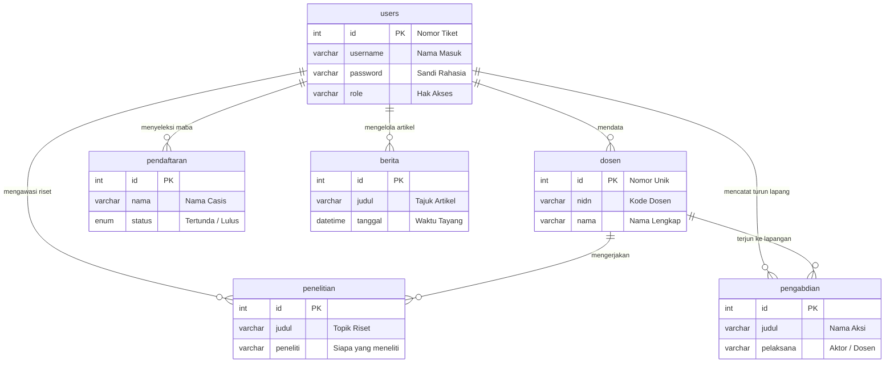

# BAB V — SKEMA DATABASE & KAMUS DATA

## 5.1 Pengantar Relasi Antar Tabel
Basis data (*database*) pada proyek **Web FIKOM** menggunakan MySQL dan dirancang agar longgar namun mandiri (*loose-coupling*). Artinya, hubungan rantai antar datanya tidak dikunci secara kaku oleh mesin database, melainkan diatur sendiri oleh kecerdasan *codingan* PHP. Pendekatan ini membuat website berjalan gesit dan mencegah macet total akibat ketidaksengajaan menghapus satu berkas.

Berikut ini adalah gambaran diagram pertemanan (*Entity Relationship Diagram*) yang menjabarkan secara logis bagaimana tabel utama administrator memegang kendali atas tabel konten-konten lainnya:

---

## 5.2 Rincian Fungsi Tiap Tabel (Kamus Data)

Di bawah ini adalah rincian *"Kamus Data"* atau susunan rapi untuk ke-18 gudang data (tabel) yang dipakai untuk menghidupkan dan merekam seluruh data dari setiap sudut halaman website fakultas:

### 1. Kelompok Pengelola / Administrator
**Tabel `users`**  
Menyimpan data-data pemegang kunci (*Admin*). Akun yang bernaung di sini bisa masuk ke bilik belakang (Dashboard) untuk merekayasa atau mengisi konten baru.

| Nama Kolom | Jenis Data | Fungsi / Penjelasan Sederhana |
|---|---|---|
| `id` | int(11) | Nomor urut absen akun (Otomatis) |
| `username` | varchar(50) | Nama samaran untuk digunakan sewaktu login |
| `password` | varchar(255) | Sandi rahasia bersandi (*Enkripsi*) |
| `email` | varchar(100) | Alamat persuratan surel |
| `role` | varchar(50) | Pangkat kuasa akun (Admin/Biasa) |
| `foto` | varchar(255) | Nama file foto wajah pengelola |

### 2. Kelompok Manusia / Sivitas Akademika
**Tabel `dosen`**  
Merekam jati diri dan latar belakang pendidikan profil para pengajar.
*(Catatan: Terdapat juga `tabel_dosen` yang bertindak sebagai versi lebih ringkas hanya dari rangkuman nama & keahlian untuk tayangan ringan grid UI).*

| Nama Kolom | Jenis Data | Fungsi / Penjelasan Sederhana |
|---|---|---|
| `nidn` | varchar(20) | Nomor identitas pengajar nasional (Tidak boleh sama) |
| `nama` | varchar(150) | Nama komplit berikut gelar |
| `program_studi` | varchar(100) | Posisi dosen bertugas (S1 IT / PTI) |
| `keahlian` | varchar(255) | Fokus cabang rumpun ilmunya |
| `pendidikan` | varchar(20) | Riwayat tamatan (*Magister/Doktor*) |
| `status` | varchar(50) | Pijakan pengajar (*Tetap/Luar Biasa*) |
| `foto` | varchar(255) | Arsip rupa wajah (*File Image*) |

**Tabel `mahasiswa`**  
Merekam daftar murid/aktivis perguruan murni.
| Nama Kolom | Jenis Data | Fungsi / Penjelasan Sederhana |
|---|---|---|
| `nim` | varchar(20) | Nomor induk (Tidak boleh sama) |
| `nama` | varchar(150) | Nama sah pemuda |
| `angkatan` | int(4) | Tahun kedatangan mahasiswa |

### 3. Kelompok Kinerja (Tridharma)
**Tabel `penelitian`**  
Gudang pencatatan rekam jejak riset temuan dosen dari proposal pendanaan hingga sumber berkas laporannya. Kolom `peneliti`-nya secara logika bergantung pada sosok di tabel `dosen`.

| Nama Kolom | Jenis Data | Fungsi / Penjelasan Sederhana |
|---|---|---|
| `judul` | varchar(255) | Judul topik temuan riset |
| `peneliti` | varchar(200) | Nama si pemerakarsa riset (Relasi logis dosen) |
| `tahun` | int(4) | Periode pencetakan jurnal |
| `sumber_dana` | varchar(100) | Sponsor yang mengguyur keuangan riset |
| `status` | varchar(50) | Nasib kelulusan proposal (*Draft/Diterima*) |
| `link_publikasi` | varchar(255) | Jalan (*URL*) menuju artikel jurnal daring |

**Tabel `pengabdian`**  
Identik dengan penelitian, bedanya tabel ini mencatat kerja bakti lapangan tanpa kerumitan status pendanaan yang njelimet.
*(Memuat kolom: judul, pelaksana, deskripsi aksi, file dokumen, & waktu kegiatan).*

### 4. Kelompok Mesin Pencetak Visual Halaman Publik
Ini merupakan lumbung tempat persediaan corak muka pembacanya berkumpul (*Frontend Data*).
*   **`berita`** : Menampung ketikan jurnal majalah portal kampus. Punya kolom `kategori` untuk pemisahan, kolom `konten` yang sangat luas (*text*), dan otomatis menandai cap `tanggal_publish` saat tersimpan.
*   **`hero_slider`** : Menyimpan perabot gambar pemandangan ukuran raksasa (*Banner*) di halaman utama (*Home*). Ada kolom centang saklar `is_active` (1=tampil, 0=sembunyi).
*   **`tb_fakta`** : Merupakan lumbung *game* statistik ringkas kampus. Menampung deretan nominal (kolom `angka`) untuk mengerakkan animasi mesin penghitung otomatis di Beranda.
*   **`kerjasama`** : Tempat stempel pajangan industri rekanan (Telkom, Dinas, dll) yang bersirkulasi berputar tanpa henti sedetikpun di dasar laman web. Semua harus punya ikatan gambar `logo`.
*   **`visi_misi` & `tentang_fikom`** : Wadah tulisan filosofis cita-cita institusi yang murni teks utuh. Disiram kolom `urutan` agar paragrafnya tidak berceceran.

### 5. Kelompok Fasilitas & Struktur Penjabat
*   **`bem_struktur`** : Pohon akar pejabat mahasiswa. Dilengkapi lajur `kategori` penyesuaian kelas yang tegas (Pilih: *inti*, *sekben*, atau *departemen*) supaya *codingan* tak kesulitan menempatkan mereka ke dalam kotak wewenangnya.
*   **`laboratorium` & `ruangan`** : Memetakan wujud fisik bangunan lewat penamaan ruangan, diskripsi muatannya, dibalur bumbu wujud visual (*kolom foto*).

### 6. Kelompok Dokumentasi Formal File (*Unduhan PDF*)
Secara fisik, keenam tabel berikut memegang tanggungjawab ganda: merekam nama peraturannya sekalian menyimpan cantelan jalur lokasinya di dalam gawai *server*. 
Isinya meliptui tabel: **`kurikulum`**, **`kalender_akademik`**, **`rencana_operasional`**, **`rencana_strategis`**, serta **`sop`**. 
Seluruh komponen di sini setara rancang bangunnya, yakni mendewakan kehadiran entitas wajib kolom **`file_pdf` / `gambar`** guna menopang fungsi *"Download"* publiknya.

### 7. Kelompok Modul Transaksi Antrian Administrasi
**Tabel `pendaftaran`**  
Menyalurkan permohonan niat ketertarikan siswa mendaftar masuk web sistem. Menampung barisan kolom paling berjubel karena menyedot biodata rinci perorangan (*KTP, email, asal usul sekolah, hingga pilihan jalur*). Keajaibannya diletakkan di dalam kolom `status`. Nilai bawaannya semenjak dimasukkan memikul status `'Pending'`. Nasib kelulusannya digantung hingga dewan admin merevisi tabelnya lewat kendali rahasia (*Dashboard*).

---
*Dokumen ini merupakan intisari struktur kerangka penyusun sistem yang dicerna melalui kacamata tata kelola awam tanpa mengurangi fungsi asli ilmu arsitekturnya.*
