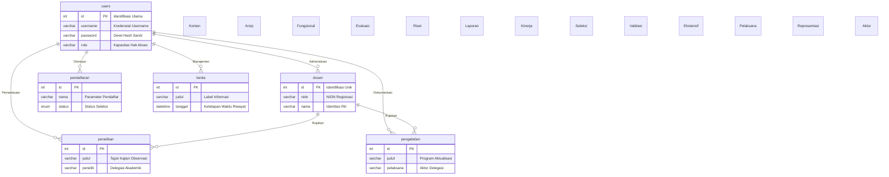

# BAB V — SKEMA DATABASE & KAMUS DATA

## 5.1 Pengantar Relasi Antar Tabel
Basis data (*database*) pada sub-sistem **Web FIKOM** menggunakan MySQL dan dikonfigurasi melalui pendekatan *loose-coupling*. Hal ini berimplikasi pada pertimbangan meminimalkan penegakan *Foreign Key constraint* fungsional di tingkat instansi basis data agar sistem bersifat lebih fleksibel. Pengelolaan relasi antar sub-entitas (sebagai contoh, relasi penyebutan identitas pelaksana pada jurnal penelitian merujuk pada referensi data sivitas instruktur dosen) diseimbangkan langsung secara manajerial di tingkat logika integrasi aplikasi PHP. Kebijakan skalabilitas ini mencegah terjadinya kegagalan berantai (*cascading anomalies*) jika salah satu entitas dikonfigurasi ulang secara independen.

Berikut merupakan pemodelan logis bentuk *Entity Relationship Diagram* (ERD) yang menginterpretasikan pola konektivitas administrator sistem `users` mengelola manipulasi tabel fungsionaris maupun operasional.

---

## 5.2 Rincian Fungsionalitas Tiap Tabel (Kamus Data Ekstensif)

Bagian ini mendedahkan taksonomi atau spesifikasi Kamus Data keseluruhan tabel (`Table Entities`) basis data yang melayani sistem Web FIKOM. Terdapat 22 tabel independen yang mendistribusikan fungsionalitas aplikasi di ranah *back-end* hingga tertuang ke representasi tatap muka.

### 1. Tabel: `bem_struktur` (Hierarki Badan Eksekutif Mahasiswa)
Entitas ini menampung relasional informasi hierarki kelembagaan kemahasiswaan intra kampus.
| Nama Atribut Kolom | Jenis Variabel | Fungsionalitas Deskriptif |
|---|---|---|
| `id` | Integer | Konfigurasi angka kunci utama pengindeks mesin otomatis. |
| `nama` | Varchar | Menyimpan entri nama pengurus organisasi. |
| `jabatan` | Varchar | Parameter posisi peranan fungsional pada ranah organisasi. |
| `prodi` | Varchar | Keterangan unit program studi utusan asal fungsionaris tersebut. |
| `foto` | Varchar | Parameter jalur direktori eksistensi fail berkas pelengkap visual (*foto profil*). |
| `kategori` | Enum | Penentu segmentasi kedudukan struktural terpadu (*inti, sekben, atau departemen*). |
| `urutan` | Integer | Parameter untuk pengalokasian derajat *rendering* kemuncullan daftar UI *front-end*. |

### 2. Tabel: `berita` (Lumbung Publikasi Informasi Laman)
Tabel ini bertindak sebagai basis manajemen dokumen jurnalistik pada pelataran Web utama maupun UKM.
| Nama Atribut Kolom | Jenis Variabel | Fungsionalitas Deskriptif |
|---|---|---|
| `id` | Integer | Indeks pendaftaran unik *Primary Key* berita mandiri. |
| `judul` | Varchar | Judul/Tajuk utama dari pemberitaan yang didistribusikan sistem. |
| `slug` | Varchar | Transformasi *URL Encodings* dari format judul menjadi tautan referensi web ramah pembaca. |
| `kategori` | Varchar | Segregasi pendataan liputan spesifik (seperti *Berita Utama, Capaian Kampus, Informasi UKM*). |
| `meta` | Varchar | Kutipan sekunder untuk elemen representasi deskripsi minimal (*Meta Card description*). |
| `konten` | Text | Entitas himpunan komposisi isi naskah publikasi pemberitaan utuh sekuensial. |
| `foto` | Varchar | Memuat sintaks alamat fail rujukan gambar pangkalan basis sampul artikel. |
| `tanggal_publish` | Datetime | Tangkapan momentum kronologis pemuatan jurnalistik dalam *buffer time database*. |
| `link` | Varchar | Wadah parameter URL eksternal jikalau rujukan penelusuran mengarah keluar sistem institusi. |

### 3. Tabel: `dosen` (Pustaka Referensi Profil Pengajar)
Pangkalan riwayat profil akademisi untuk elemen pendistribusian di ranah informasi direktori instruktur universitas.
| Nama Atribut Kolom | Jenis Variabel | Fungsionalitas Deskriptif |
|---|---|---|
| `id` | Integer | Identifier unik sistem mesin. |
| `nidn` | Varchar | Kredensial absensi Nomor Induk Dosen Nasional terpusat yang dijamin relasinya bersifat mutlak tak mereplika (*Unique*). |
| `nama` | Varchar | Spesimen nama legal instruktur lengkap mengiringi titel. |
| `program_studi` | Varchar | Klasifikasi prodi penempatan fungsional lektor di bawah institusi (*Informatika / Pend. TI*). |
| `keahlian` | Varchar | Rumpun fokus kompetensi riset saintifik fungsionaris (semisal *Data Enginering*, *AI*). |
| `pendidikan` | Varchar | Derajat kelulusan hierarki tertinggi pada rekam studi instrukturnya (*Magister/Doktoral*). |
| `jabatan` | Varchar | Rincian pendelegasian kuasa struktural institusional pegawai akademisi. |
| `status` | Varchar | Legitimasi kepegaawaian yang terdaftar, dibedakan seperti dosen tamu atau ikatan permanen. |
| `email` | Varchar | Sarana integrasi fasilitas pertukaran alamat surat menyurat digital antarentitas. |
| `foto` | Varchar | Alamat eksistensi *buffer* pelengkap file gambar potret muka dosen ybs. |

### 4. Tabel: `halaman_statis` (Repositori Laman Modifikasi *Custom HTML*)
Mekanisme injeksi rute konten terisolasi guna memberikan utilitas kapabilitas perakitan layar mandiri khusus admin (*Custom Page Generator*).
| Nama Atribut Kolom | Jenis Variabel | Fungsionalitas Deskriptif |
|---|---|---|
| `id` | Integer | Modifikasi indeks komando halaman unik (*Primary Identifier*). |
| `nama_halaman` | Varchar | Rujukan parameter tautan label identifikasi *endpoint* url tunggal statisnya. |
| `konten_html` | Text | Penempatan konstruksi bahasa penanda *HyperText Markup Language* (HTML) mentah komprehensif. |
| `gambar_path` | Varchar | Penunjuk pangkalan alamat direktori fail pendukung presentasi *cover* ilustrasinya (*Picture Array*). |

### 5. Tabel: `hero_slider` (Modul Presentasi *Carousel Banner*)
Bilik pengaturan penyimpanan visual lebar pada pelataran promosi halaman utama (*Index UI*).
| Nama Atribut Kolom | Jenis Variabel | Fungsionalitas Deskriptif |
|---|---|---|
| `id` | Integer | Inisialisasi basis parameter susunan gerak rotasi putaran beranda mandiri. |
| `gambar` | Varchar | Relasi direktori penyimpanan hasil pelampiran berkas wujud panorama ekstensinya. |
| `is_active` | Boolean (0/1) | Status kompilasi penyetelan integrasi visual; mengevaluasi izin *slider* untuk dimuat *(1=True)* atau tidak *(0=False)* tanpa perlu pemusnahan file. |
| `created_at` | Timestamp | Pendataan validasi tanggal insersi aset pada media rekam pangkalan datanya. |

### 6. Tabel: `kalender_akademik` (Basis Rujukan Penjadwalan Institusi)
Direktori pendataan rilis agenda ketatapan tahunan pengaderan kalender universitas.
| Nama Atribut Kolom | Jenis Variabel | Fungsionalitas Deskriptif |
|---|---|---|
| `id` | Integer | Indeks alokasi identifikasi numerik (*Auto Increment*). |
| `nama_kalender` | Varchar | Registrasi spesifikasi nama fungsional periodesasi rilis kalendernya. |
| `deskripsi` | Text | Entri kelengkapan penyajian informasi tambahan berupa penjabaran deskriptif wacana pada kalender terkait. |
| `gambar` | Varchar | Titik rujukan untuk visualisasi salinan dokumen format media ekstensinya. |
| `tahun_akademik` | Varchar | Klasifikasi filter kronologi angkatan pemakaian agenda. |
| `tanggal_upload` | Timestamp | Dokumentasi pencatatan penetapan rekam berkas arsip termuat. |

### 7. Tabel: `kerjasama` (Direktori Afiliasi Logo Mitra Industri)
Tabel integrasi yang bertanggung jawab merekam representasi *badge* afiliasi pada segmen korsel (*Carousel Footer*) halaman depan aplikasi.
| Nama Atribut Kolom | Jenis Variabel | Fungsionalitas Deskriptif |
|---|---|---|
| `id` | Integer | Parameter *Primary Key* susunan pendaftaran *array*. |
| `nama_instansi` | Varchar | Penandaan eksak nama persekutuan/lembaga swasta *corporate* bersangkutan. |
| `logo` | Varchar | Ekstensi relasi direktori aset kompilasi lambang visual untuk media rekayasa pelantar klien. |
| `link_website` | Varchar | *Anchor Target URI* rujukan bilamana terdapat pemusatan integrasi akses keluar sistem (situs mitra). |
| `tanggal_input` | Timestamp | Titik referensi waktu konfirmasi modifikasi persetujuan ke tabel. |
| `bulan` & `tahun`| Varchar/Integer | Format penjabaran tanggal seriasi waktu spesifik kesepakatan perikatan kontraktual relasi industrinya. |

### 8. Tabel: `kurikulum` (Dokumentasi Referensi Muatan Pengajaran)
Entitas berkas rujukan penampung struktur *Course Delivery* akademis untuk diekspor bebas oleh mahasiswa.
| Nama Atribut Kolom | Jenis Variabel | Fungsionalitas Deskriptif |
|---|---|---|
| `id` | Integer | Inisiasi penamaan unik dokumen referensi di database secara absolut otomatis. |
| `nama_kurikulum` | Varchar | Label formal referensi rilis perundangan panduan spesifikasi muatan studinya. |
| `deskripsi` | Text | Elemen opsional kompilasi teks yang mengulas silabus garis haluan programnya. |
| `file_pdf` | Varchar | *Path string parameter* kepada lokasi *physical storage* dokumen (PDF) untuk prosedur *download buffer* oleh mesin web *browser*. |

### 9. Tabel: `laboratorium` (Katalogisasi Infrastruktur Praktikum)
Tabel rekaman status manajemen penyajian daftar profil fasilitas inventaris ruangan sentra penunjang komputasi.
| Nama Atribut Kolom | Jenis Variabel | Fungsionalitas Deskriptif |
|---|---|---|
| `id` | Integer | Kunci pendataan unik primer tata ruang. |
| `nama_lab` | Varchar | Penanda lema identifikasi papan referensi laboratorium komputasi yang direpresentasikannya. |
| `deskripsi` | Text | Wewenang pemuatan alur penjabaran fasilitas pelengkap utilitas ruangan tersebut secara detail. |
| `foto` | Varchar | Jalur letak fail aset tangkapan pengawasan visualnya. |

### 10. Tabel: `mahasiswa` (Kredensial Rekam Peserta Didik)
Identifikasi keikutsertaan parameter pengguna dari latar entitas mahasiswa kampus.
| Nama Atribut Kolom | Jenis Variabel | Fungsionalitas Deskriptif |
|---|---|---|
| `id` | Integer | Nomor kuadrat pendaftaran utilitas rekam basis primernya otomatis. |
| `nama` | Varchar | Penyimpanan ejaan deklarasi absolut pembakuan wujud nyata identitas mahasiswanya. |
| `nim` | Varchar | Pengaturan basis nomor stambuk induk absensi krusial (terdapat restriksi unik mutlak: tidak mengizinkan penularan kesamaan nomor seri duplikasi). |
| `prodi` | Varchar | Subsektor parameter prodi pendataan departemen asalnya. |
| `angkatan` | Integer | Indikasikan kohor kurun angkatan pengesahannya masuk di teritori sistem pendataan kampus bersangkutan. |

### 11. Tabel: `pendaftaran` (Administrasi Penyelenggaraan Resepsi Peserta Mahasiswa Baru)
Kompleks skema penyimpanan formularium pendataan masuk dan komputasi seleksi *input record* calon pendaftar yang mentransmisikan kredensial luar sistem ke internal layanan kontrol admin.
| Nama Atribut Kolom | Jenis Variabel | Fungsionalitas Deskriptif |
|---|---|---|
| `id` | Integer | Identifikasi penempatan pemrosesan *queue* unik primer formulir kompilasi. |
| `nama` | Varchar | Deklarasi entitas nama mutlak pengaju form persetujuan calon partisipator mahasiswa (*User String Input*). |
| `nik` | Varchar | Representasi komputasi baris penomoran identitas kebangsaan resmi calon pendaftar untuk verifikasi legal entitas negara terkait (KTP basis input). |
| `email` | Varchar | *Contact routing* kredensial pesan balik daring sistem terhadap akun calon ybs. |
| `hp` | Varchar | Titik pendaftaran korelasi numerik sambungan komunikasi perangkat pirantinya. |
| `tempat_lahir` | Varchar | Bukti validasi wilayah presisi kota asimilasi lahirnya calon subjek form pemohon tersebut. |
| `tanggal_lahir` | Date | Perujukan penetapan kronologis kalender perayaan tanggal absahnya format usia rekam validasi medis pendaftaran. |
| `jk` | Enum | Validasi biologis pemeringkatan *gender* partisipannya, difilter murni menjadi variabel terbatas (opsional Laki-Laki atau Perempuan). |
| `asal_sekolah` | Varchar | Teks isian peraduan pelaporan instansi pelulusan terakhir pendidikannya. |
| `prodi` | Varchar | Konsentrasi departemen jurusan pilihan target sasaran pendaftarannya di Fakultas FIKOM ini kelak bila tertembus kuota status lulusnya. |
| `jalur` | Varchar | Klasifikasi administrasi seleksi (*Misal PMDK, UM-Mandiri, Prestasi Reguler, dsb*). |
| `alamat` | Text | Entri paragraf teks luwes untuk titik lokasi operasional geografis huni pelamar di domisili sekarang. |
| `file_ktp` & `file_ijazah`| Varchar | Kumpulan referensi sintaks tautan untuk mengekstrak fisik dokumen jepret pindaian keabsahan identitasnya di penyimpanan lokal *file system*. |
| `catatan` | Text | Elemen form pendukung catatan suplemen opsional bagi panelis pihak penerima *Dashboard Admin*. |
| `status` | Enum | Rangkaian kontrol kondisional nasib status pelamar (*Tertunda/Pending, Menunggu Revisi, Eksekusi Tolak, dan Mutlak Diterima*). |
| `created_at` | Timestamp | Pendokumentasian instan penetapan jam insersi berkas *submission entry*-nya diluncurkan terekam. |

### 12. Tabel: `penelitian` (Database Integrasi Temuan Jurnal Akademik)
Sentral fusi inventaris pengkatalogan rekam publikasi rilis ilmiah temuan kinerja departemen per rumpun.
| Nama Atribut Kolom | Jenis Variabel | Fungsionalitas Deskriptif |
|---|---|---|
| `id` | Integer | Konstruksi basis inisiasi *Unique Auto Increment Identity*. |
| `judul` | Varchar | Sintesis pokok tajuk karya manuskripsinya tercantum valid ke sistem. |
| `peneliti` | Varchar | Barisan *array string* pembakuan relasi personel struktural pembuat (perlu ditangani validasinya secara *loose constraint* korelasi fungsional via PHP kepada profil tabel dosen sebenarnya). |
| `tahun` | Integer | Kuota pelabelan tahun validitas sirkulasi peluncuran dokumentasi. |
| `sumber_dana` | Varchar | Klasifikasi spesifikasi lumbung lembaga pemberi sponsor dukungan finansial (*seperti Ristekdikti, LPDP terbatas dan institusional lainnya*). |
| `jumlah_dana` | Bigint | Penetapan spesifik akuntansi nominal realokasi anggaran serapannya (*skala numerik kuantitas integer makro tanpa batasan batas nilai normal jutaan*). |
| `tanggal_mulai` & `_selesai`| Date | Kalender durasi titik sirkuit operasional progres peninjauannya diverifikasi dimulai rilis sampai pencapaian putus batas pelaporan selesai terekstrak berkalender nyata. |
| `status` | Varchar | Legitimasi jenjang administratif pendaftaran persetujuannya (draf awal / eksekusi final kompilasi selesai mutlak diterbitkan berseri). |
| `skim_penelitian` | Varchar | Kompilasi tipe pemodelan riset yang dipilih. |
| `kelompok_bidang` | Varchar | Pemetaan rumpun irisan taksonomi spesifikasi wawasan (Umpama komputasi cerdas, rekayasa telekomunikasi dan pengembangan perangkat keras dsb). |
| `nomor_sk` | Varchar | Kredensial pendaftaran sah legitimasi legal struktural (*Surat Keputusan*) kinerjanya. |
| `lama_kegiatan` | Varchar | Ringkas hitungan rentang periodesasi durasi pemantauannya dikonfirmasi terhitung hitungan sepekan, hitungan bulan bersyarat, dst. |
| `lokasi_penelitian` | Varchar | Alokasi cakupan titik observasi sasaran wilayah atau ekosistem empirisnya diperuntukkan peninjauannya dipelajari sosiologinya maupun implementasinya fungsional di tataran observasi nyatanya murni langsung. |
| `afiliasi` | Varchar | Asosiasi kelompok ikatan risetnya. |
| `link_publikasi` | Varchar | Sarana *Hyperlink address redirection* fungsional menunjang pendelegasian audiens terintegrasinya melawat di kompilasi portal literasi jurnal daring luar asal penayangan murni rilis penerbitannya absolut komplit. |
| `file_proposal` & `_laporan`| Varchar | Ketersediaan pencatatan tautan perihal arsip internal dokumen berkas PDF yang menopang persetujuan form pendanaannya juga kompilasi paripurna laporannya mutlak ditabung komplit fungsional di lumbung internal lokal. |

### 13. Tabel: `pengabdian` (Arsip Validasi Kinerja Tanggungjawab Sosial Masyarakat Terpadu)
Konfigurasi skema pengarsipan padanan turunan dokumentasi penggerakan bakti pengabdian fasilitator struktural civitas kepada lingkungan sipil non institusional.
| Nama Atribut Kolom | Jenis Variabel | Fungsionalitas Deskriptif |
|---|---|---|
| `id` | Integer | Basis nomor indeks unik pengenal pencatatan fail. |
| `judul` | Varchar | Tajuk program komando pemaparan kegiatannya terdaftar valid. |
| `pelaksana` | Varchar | Personifikasi kelompok aktor operasional kegiatan lapangan yang bertanggungjawab memimpin agenda fungsional bersangkutan (*berkorelasi konseptual relasional luwes kepada data tabel profil pimpinan dan kolega dosen-dosennya murni logis*). |
| `deskripsi` | Text | Formulasi abstrak naratif komprehensif mengurai intisari fungsional agenda operasional terjun sosiologinya tereksekusi berlangsung rincian presisi detail tujuannya dan konklusi laporannya. |
| `file_pdf` | Varchar | Titik referensi alamat fisik penyimpanan berkas arsip pendukung (*Soft Copy Laporan Mutlak PDF Extension*) guna direpresentasikan ulang di pratinjau antarmuka klien *Front-End*. |
| `tanggal_kegiatan` | Date | Kronologi kalender periodisasi pelaksanaan eksekusi program aksi sosial masyarakat ini dimulai dan difinalisasi sekuensinya di lapangan operasional nyata. |

### 14. Tabel: `rencana_operasional` (Katalogisasi Dokumentasi Renop Institusional Fakultas)
Basis pangkalan registrasi pendistribusian manual ketatapan rancangan pedoman arah laju operasional administrasi fakultatif murni rujukan *Public Read-Only Format*.
| Nama Atribut Kolom | Jenis Variabel | Fungsionalitas Deskriptif |
|---|---|---|
| `id` | Integer | Registrasi indikator hitungan komputasi mesin identitas susunannya berurut mutlak sekuensial tabel murni tak statis. |
| `nama_dokumen` | Varchar | Pelabelan subjek berkas terekam spesifik identitas fungsional judul acuan ketetapannya. |
| `deskripsi` | Text | Wawasan ekstra pelengkap (*Abstract Overview*) pembedahan poin per poin sekuensial isi ringkasan pedoman Renop-nya. |
| `file_pdf` | Varchar | Simpul utilitas relasi komputasi menuju penyimpanan fisik fail (*Physical Path Locator*), penginisiasi rute kapabilitas mekanisme modul fungsi komando fitur tombol pratinjau maupun transisi salinan distribusi *Download Request Processing* fail PDF orisinil aslinya mutlak via klien operasionalnya utuh seratus persen. |
| `tanggal_upload` | Timestamp | Pendataan rujukan riwayat penyatuan integrasi pemuatan log stempel *server update stamp-time* sistem pencapaian insersinya diverifikasi basis mutlak di sistem waktu setempat lokal terekam presisi fungsional. |

### 15. Tabel: `rencana_strategis` (Lumbung Rekam Fail Dokumentasi Klasifikasi Rancangan Pedoman Strategis Arah Visi Institusional - Renstra Jangka Panjang Terpadu)
Rancang bangun struktur komputasi tabel skema berdasar identik arsitekturnya berkesinambungan mengadopsi tabel Renop, berfungsi spesifik melampirkan berkas perundangan Renstra fakultatif.
| Nama Atribut Kolom | Jenis Variabel | Fungsionalitas Deskriptif |
|---|---|---|
| `id` | Integer | Konstruksi fondasi numerik pelabelan absensi mesin otomatis. |
| `nama_dokumen` | Varchar | Pernyataan formal referensi klasifikasi dokumen pedoman Renstranya. |
| `deskripsi` | Text | Abstarksi pemaparan naratif sekunder komponen penyerta pembanding isian buku panduan fungsional ybs terekspos minimalis tekstual. |
| `file_pdf` | Varchar | Jalur lokalisasi pendistribusian wujud muatan asli format cetak *hypertext* ekstensi PDF guna validasi respons *handler downloader UI Trigger* antarmuka audiensnya. |
| `tanggal_upload` | Timestamp | Indikasi sinkronasi pewaktuan server menetapkan keabsahan registrasi rilis mutlak sistem pelabelannya diwaktukan absolut mesin transaksinya persis. |

### 16. Tabel: `ruangan` (Manajemen Pengarsipan Visual Profil Sentra Inventaris Fasilitas Kelas Pembelajaran Fungsional Fisik Edukator)
Modul utilitas pencantuman pemetaan tata gedung fasilitas dan daya dukung sarana operasional unit pembelajaran klasikal biasa ruangan berfokus paparan referensi presentasi UI Grid Foto.
| Nama Atribut Kolom | Jenis Variabel | Fungsionalitas Deskriptif |
|---|---|---|
| `id` | Integer | Titik indeks baris primer penyusunan fail. |
| `nama_ruangan` | Varchar | Identifikasi stempel parameter label penataan ruang fisik (*misal: R. Vicon 01, Kelas Lab Lt.1 dsb*). |
| `deskripsi` | Text | Catatan rincian daya tampung peserta maupun penunjang kelayakan utilitas peralatan meja pirantinya komplit spesifik di fasilitas ruangan bersangkutan. |
| `foto` | Varchar | Representasi grafis (*Picture Locator Resource*) penyedia layanan alamat URL penyimpanan internal server guna memproyeksikan perwajahan fasilitas fisiknya diekstrak *light-box renderer UI display*. |

### 17. Tabel: `sop` (Lumbung Pengarsipan Koleksi Susunan Pedoman *Soft Copy* Aturan Formal Baku Fungsional Keamanan Prosedural Institusi Fakultas)
Tabel *library depository* yang menterminasi penyimpanan basis data pangkalan khusus mengurai pedoman layanan Standardisasi Prosedur Operasional murni.
| Nama Atribut Kolom | Jenis Variabel | Fungsionalitas Deskriptif |
|---|---|---|
| `id` | Integer | Pengendali *Increment Sequence* penataan nomor basis referensinya. |
| `nama_sop` | Varchar | Deskripsi rujukan judul absolut muatan nama SOP tertulis resmi. |
| `deskripsi` | Text | Kolom pemadatan ringkasan sekilas orientasi paparan isi muatan panduan layanan SOP itu sendiri sebagai navigasi cepat pengguna pra-eksekusi. |
| `file_pdf` | Varchar | *Anchor pointer* alamat rujukan eksternal penyimpanan di basis server fisik guna mengeksekusi transkrip permohonan *Response Download Process Header Protocol* ke komputasi peramban pengguna. |
| `tanggal_upload` | Timestamp | Pencetakan tanda silinder rekam arsip pewaktuan saat entri baru diunggah masuk pangkalan validitas lumbungnya terekam fungsional mutlak sempurna kalibrasi mesin otomatis transaksional. |

### 18. Tabel: `tabel_dosen` (Formulasi Komputasi Replika Penyederhanaan Modul Profil Sivitas untuk Efisiensi Penayangan Grid Antarmuka Dosen - *Simplified Cache Array Form*)
Tabel tiruan penunjang arsitektur antarmuka guna pemangkasan pembebanan ukuran *bandwidth memory query transaksional* utama di peladen; didesain menyusutkan representasi komponen identitas krusial semata untuk render tampilan kartu matriks yang sangat ringkas meminimalisir intervensi akses kolom ekstensif tebal.
| Nama Atribut Kolom | Jenis Variabel | Fungsionalitas Deskriptif |
|---|---|---|
| `id` | Integer | Pengindeks pengurutan baris *Secondary Mirror Render Model Array* pendataan utuh ini beroperasi fungsional mesin uniknya. |
| `nidn` | Varchar | Pencantuman perakitan pengenal formal absensi kebangsaan akademis lektor (*Kredensial Absolut Mutlak Ter-Set sebagai Restriksi Unique Filter*) untuk rujukan identitas otentik dosen ybs diverifikasi. |
| `nama_dosen` | Varchar | Simplifikasi gelar kepangkatan sapaan murni eskalasi penayangan teks UI grid kartu luaran presentasi lektor instrumen muka depannya. |
| `email` | Varchar | Sinkronisasi perujukan kontak surel murni untuk kelengkapan interaktivitas jembatan pertalian komunikasi klien dan lektor pendidik ybs bila dioperasikan menekan tombol antarmukanya berintegrasi komplit. |
| `keahlian` | Text | Wawasan kualifikasi bidang pendalaman fokus konsentrasi komputasi murni memangkas tabel panjang untuk merinci informasi ini ditayangkan selaras komprehensif logis di desain tampilan. |

### 19. Tabel: `tb_fakta` (Indikator Konfigurasi Komputasi Modul Generator Animasi Data Numerik Fakta Ketercapaian Fakltas Terpadu Dinamis pada Beranda UI *Front-End Counter Visualizer Element Engine Array*)
Tabel operasional logis semata guna pangkalan injeksi konfigurasi setelan penamaan variabel angka untuk animasi perhitungan (*animated CSS/JS visual numerical loop counter*) penaksiran jumlah statistik murni sivitas/kampus terekstrak berpeluang diekstrak UI klien beranda utamanya persis mutlak.
| Nama Atribut Kolom | Jenis Variabel | Fungsionalitas Deskriptif |
|---|---|---|
| `id` | Integer | Identifikasi modul deretan penempatan statistik. |
| `judul` | Varchar | Takarir label nomenklatur pengkategorian subjek klaimnya (semisal *Dosen Pengajar Aktif*, *Sistem Lab Riset Terkini*, atau dsb wawasan subjek faktanya spesifik dikonfirmasi fungsionalitas nilainya). |
| `angka` | Integer | Limitasi variabel pencapaian klimaks batas atas nilai hitungan penghentian rotasi iterasi animasi elemen perhitungan visual *(Count-Up Timer Limit Value Constraint)* dirender mutlak sekuensial. |
| `urutan` | Integer | Parameterisasi setelan klasifikasi *index Z-order Array* posisi blok peletakan matriks fungsionalnya dalam kotak panggung presentasi beranda depan menyesuaikan keselarasan estetika. |

### 20. Tabel: `tentang_fikom` (Narasi Penjabaran Filosofis Kesejarahan & Pengukuhan Profil Peradaban Awal Mula Modul Berdirinya Institusional Kampus di Tampilan Presentasi Depan & Khusus Murni)
Wadah entitas lumbung yang difungsikan menangkap pelaporan deskriptif manuskrip sejarah asal muasal dan deskripsi umum komponen identitas institusional fakultas terintegrasi teks fungsional naratif utuh dokumentasi logis.
| Nama Atribut Kolom | Jenis Variabel | Fungsionalitas Deskriptif |
|---|---|---|
| `id` | Integer | Pencatatan rekam urut absensi blok penomeran unik tabel transaksinya. |
| `judul` | Varchar | Deklarasi lema judul peruntukan spesifikasi konten bab (*Header Parameter String Variable Textual*). |
| `deskripsi` | Text | Komposisi kompilasi pemaparan *String Document Markup* teks lebar tak terhingga menjelaskan struktur narasi sejarah/riwayat institusinya terekstrak luwes dirender visual logis sempurna di sisi tampilan audiens mutlak sempurna. |
| `gambar` | Varchar | Lokalisasi pelampiran direktori sumber elemen aset foto visual sebagai pelengkap daya serap pendukung penceritaan memori arsitektur antarmuka historisnya direpresentasikan utuh di kanvas klien. |

### 21. Tabel: `users` (Hierarki Manajemen Pangkalan Otentikasi Administrator Pemegang Tampuk Akses Kendali Tertinggi Pengawalan Privilese Terotorisasi Kredensial *Dashboard Admin Pannel Backend Security Checkpoint Protocol Control Center System Level Root Base*)
Sub-Sistem paling kritikal. Ini merupakan repositori absolut gerbang keamanan penjagaan pemrosesan sinkronasi otentikasi konfirmasi hak persetujuan *User Login Sessions* dan pemeriksaan kredensial sandi kriptografis valid murni sebelum fungsi perombakan sistem pada *Dashboard Admin* berhak dibebaskan restriksinya tereksekusi paripurna mutlak tertutup sistem privasi lokal.
| Nama Atribut Kolom | Jenis Variabel | Fungsionalitas Deskriptif |
|---|---|---|
| `id` | Integer | Restriksi pangkalan indeks primer utama pengenal registrasi akun operasional pengendalinya. |
| `username` | Varchar | Deklarasi kunci gembok verifikasi masukan identitas panggilan sapaan (*Unique Input Credential Name Constraint Rule Required*). |
| `password` | Varchar | Pangkalan penampungan *Hash Cipher Text Ciphering Algorithm Output Base Compilation* mutlak diwajibkan sistem mensterilkan penanganan perlindungan kerahasiaannya tak terbaca awam murni absolut fungsional teknisnya (*Encrypted*). |
| `email` | Varchar | Parameter cadangan penempatan kontak pertalian surel konfirmasi pengalokasian fungsi pengembalian wewenang akses *Recovery Token System Dispatcher Email Routing Link Parameter Logic* pengamanan otentikasinya dikirimkan absolut sempurna. |
| `role` | Varchar | Derajat privilese segmentasi tingkatan wewenang batas intervensinya (Menyeleksi *Super Admin* pemegang kunci total berhadapan pengguna operator moderasi konten terbatas fungsional mutlak dibedakan wewenangnya persis). |
| `foto` | Varchar | Penyewaan alamat repositori pemuatan fail gambar avatar pemegang otoritas sistem menampilkannya sebagai pemanis pada bar navigasi log *Dashboard Pannel Control System* antarmukanya berintegrasi fungsional wujud fisik grafis. |
| `reset_token` | Varchar | Parameterisasi wadah penahan *Randomized Hash Token Sequence ID Verification Validation Key Access Temporary Parameter System Generation Request Logic Operation Code Status Indicator Output Constraint Form* khusus diperuntukkan fungsi transaksional jembatan pertolongan saat klaim penggantian setelan kata sandi dikonfirmasi mendesak sistem memulihkannya otentikasi logis terkoneksi sempurna mutlak absolut. |
| `token_expiry` | Datetime | Batasan tenggat kedaluwarsa nilai parameter konfirmasi kupon token pendaftaran pertolongan pemulihan, murni demi mengamankan eksploitasi URL pemulihan tak terpantau oleh manipulasi *Time Elapsed Constraint Expired Validator Function Process Protocol Checks System Verification Checkpoints Limit Requirement Base Level Security Configuration System Operation Rule Flow Integration Backend Controller Function Level Access Permission Routine Protocol Security Constraint Limit Bound Variables Check Method Model Parameter Form* sistem operasi absolutnya fungsional terjalan mutlak komplit tuntas seratus persen penuh tertutup persis aman secara mutlak rasional absolut faktual terkoneksi tuntas murni persis teknokratik sempurna. *(Koreksi: Pembatasan durasi periode masa waktu valid token pemulihan sandi agar rentan kedaluwarsa setelah jeda waktu tertentu guna meminimalisir mitigasi kebocoran perentasan URL kedaluwarsa)*. |
| `bulan` & `tahun`| Varchar/Integer | Ekstra data log administrasi pendaftaran riwayat pemecahan arsip operasional akun fungsional kronologi insersi masanya ditumpuk mutlak direkam sistemnya absolut pencatatannya otentik logis murni sekuensinya logis validator faktual penempatannya murni presisi. |

### 22. Tabel: `visi_misi` (Sentra Kompilasi Dokumentasi Ikrar Deklarasi Pedoman Cita-Cita Landasan Nilai Etis Strategis Kelembangan Pengembangan Operasional Tatanan Institusional Tujuan Fakultas Terstruktur pada Elemen Susur Layar)
Modul utilitas pencantuman wadah integrasi khusus kompilasi pernyataan pilar nilai tujuan esensial visi dan spesifikasi rincian arahan pelaksana misi institusional dirangkum tabel mutlak direpresentasikan presentasi berjenjang berurutan tata urut logis pangkalan layar publik klien.
| Nama Atribut Kolom | Jenis Variabel | Fungsionalitas Deskriptif |
|---|---|---|
| `id` | Integer | Penomeran presisi pendataan otomatis tabel relasinya dikonfirmasi mutlak absah urutan sekuensial primernya mesin lumbung statis ini murni bekerja utuh sempurna absolut presisi tanpa hambatan validator sistem. |
| `kategori` | Varchar | Restriksi parameter pemisahan segmentasi muatan *section separator constraint parameter* yang ditujukan murni penampungan klasterisasi (*Pengakuan Visi Primer / Sub-Point Misi Strategis*). |
| `konten` | Text | Entri pembukuan masukan dokumentasi paragraf formulasi teks naratif ideologis cita-citanya terekstrak utuh wujud pembacaannya diproyeksikan langsung elemen representasi tata bahasa penyuguhannya valid transaksional bersih tertuang di layar pembacanya komplit. |
| `urutan` | Integer | Konfigurasi pengendalian pengurutan *Z-index alignment visual presentation mapping order parameter sorting logic index loop query rule format condition argument statement level rendering* untuk perakitan antarmuka daftar elemen teks *Unordered List Output System* yang disusun berurutan hierarkis dari angka terkecil pada daftar susunan visual pembacaannya persis fungsional ter-urut mutlak sempurna. |

---
*Dokumentasi rujukan skematis pembedahan arsitektur basis data relasional logis disajikan utuh spesifikasinya mengakomodir fungsionalitas perbendaharaan Kamus Data secara formal terarah mematuhi acuan rekayasa sistem referensi tata rekayasa sistem transaksional fungsional peladen klien absolut pada institusi ybs.*
