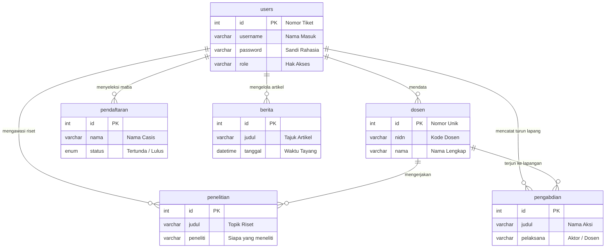

# BAB V — SKEMA DATABASE & KAMUS DATA

## 5.1 Pengantar Relasi Antar Tabel
Basis data (*database*) pada proyek **Web FIKOM** menggunakan MySQL dan dirancang agar longgar namun mandiri (*loose-coupling*). Artinya, hubungan rantai antar datanya tidak dikunci secara kaku oleh mesin database, melainkan diatur sendiri oleh kecerdasan *codingan* PHP. Pendekatan ini membuat website berjalan gesit dan mencegah macet total akibat ketidaksengajaan menghapus satu berkas.

Berikut ini adalah gambaran diagram pertemanan (*Entity Relationship Diagram*) yang menjabarkan secara logis rute kendali utamanya:

---

## 5.2 Rincian Fungsi Tiap Tabel (Kamus Data Lengkap)

Di bawah ini adalah rincian *"Kamus Data"* berwujud kolom-kolom persis dari urat nadi database `db_web_fikom`. Seluruh **22 tabel** telah dijabarkan dengan bahasa yang sangat sederhana agar mudah dipahami fungsinya.

### 1. Tabel: `bem_struktur` (Struktur Organisasi Mahasiswa)
Merekam pohon akar susunan kabinet Badan Eksekutif Mahasiswa (BEM).
| Nama Kolom | Jenis Data | Fungsi / Penjelasan Sederhana |
|---|---|---|
| `id` | Angka | Nomor urut otomatis |
| `nama` | Teks Pendek | Nama lengkap pengurus BEM |
| `jabatan` | Teks Pendek | Posisi kemudi di organisasi |
| `prodi` | Teks Pendek | Program studi asal pengurus |
| `foto` | Teks Link | Nama file foto wajah asli |
| `kategori` | Pilihan Tetap | Penentu tingkatan (*inti, sekben, departemen*) |
| `urutan` | Angka | Mengatur peletakan visual atas-bawah |

### 2. Tabel: `berita` (Publikasi Informasi)
Menyimpan semua pilar pengumuman, koran berita, maupun info UKM.
| Nama Kolom | Jenis Data | Fungsi / Penjelasan Sederhana |
|---|---|---|
| `id` | Angka | Nomor kartu berita otomatis |
| `judul` | Teks Panjang | Judul utama dari kabar yang ditayangkan |
| `slug` | Teks Panjang | Tautan unik (link ramah pembaca) |
| `kategori` | Teks Pendek | Kelas korannya (Akademik / Kegiatan UKM / dll) |
| `meta` | Teks Pendek | Secarik potong kalimat pemancing bacaan |
| `konten` | Teks Sangat Panjang| Isi paragraf laporannya seratus persen utuh |
| `foto` | Teks Link | Nama arsip gambar sampul berita |
| `tanggal_publish` | Waktu presisi | Titik waktu artikel itu disiarkan ke publik |
| `link` | Teks Panjang | Sambungan khusus jika berita merujuk web luar |

### 3. Tabel: `dosen` (Pustaka Tenaga Pengajar)
Menyimpan jejak profil detail guru besar dan dosen pengajar kampus.
| Nama Kolom | Jenis Data | Fungsi / Penjelasan Sederhana |
|---|---|---|
| `id` | Angka | Nomor absen mesin otomatis |
| `nidn` | Teks Pendek | Nomor identitas dosen nasional (Tidak Boleh Sama) |
| `nama` | Teks Panjang | Nama lengkap bersanding gelarnya |
| `program_studi` | Teks Pendek | Ruangan berlabuh mengajarnya |
| `keahlian` | Teks Panjang | Cabang keilmuan yang paling dikuasai |
| `pendidikan` | Teks Pendek | Ijazah teratas (*Magister / Doktor*) |
| `jabatan` | Teks Pendek | Pangkat kedinasan pengajar |
| `status` | Teks Pendek | Latar kedudukan (Dosen Tetap / Kontrak) |
| `email` | Teks Pendek | Kotak sumbangan pesan digital |
| `foto` | Teks Link | Penyimpanan jejak roman muka sang dosen |

### 4. Tabel: `halaman_statis` (Halaman Modifikasi)
Pengatur laman ekstra yang teks dan rangkanya bisa diciptakan mandiri admin.
| Nama Kolom | Jenis Data | Fungsi / Penjelasan Sederhana |
|---|---|---|
| `id` | Angka | Indeks otomatis halaman |
| `nama_halaman` | Teks Pendek | Judul kustom halamannya (*unik*) |
| `konten_html` | Teks Sangat Panjang| Jerohan desain kode untuk dibaca komputer |
| `gambar_path` | Teks Link | Ilustrasi sampulnya |

### 5. Tabel: `hero_slider` (Gambar Sampul Raksasa Atas)
Menyimpan pajangan *Banner* pemandangan luas yang bisa diputar bergilir di Beranda.
| Nama Kolom | Jenis Data | Fungsi / Penjelasan Sederhana |
|---|---|---|
| `id` | Angka | Penanda urutan putaran otomatis |
| `gambar` | Teks Link | Tangkapan layar yang digantung sebagai *slider* |
| `is_active` | Saklar (0/1) | Rem tangan, menyalakan atau membekukan gambarnya |
| `created_at` | Waktu presisi | Jejak saat gambar diapload murni |

### 6. Tabel: `kalender_akademik` (Jadwal Kampus)
Rekaman kalender aktivitas tahunan penuh.
| Nama Kolom | Jenis Data | Fungsi / Penjelasan Sederhana |
|---|---|---|
| `id` | Angka | Indeks mesin otomatis |
| `nama_kalender` | Teks Panjang | Label peruntukan tahun akademiknya |
| `deskripsi` | Teks Lebar | Ulasan jadwal-jadwal sakral sejenak |
| `gambar` | Teks Link | Arsip poster selebaran murni |
| `tahun_akademik` | Teks Pendek | Satuan angka tahun kalendernya (Contoh: 2024/2025) |
| `tanggal_upload` | Waktu presisi | Catatan detik penyisipan ke sistem |

### 7. Tabel: `kerjasama` (Pameran Logo Sponsor/Mitra)
Panggung sirkulasi foto-foto instansi luar kampus untuk diarak di dasar situs.
| Nama Kolom | Jenis Data | Fungsi / Penjelasan Sederhana |
|---|---|---|
| `id` | Angka | Nomor antri otomatis |
| `nama_instansi` | Teks Panjang | Nama perusahaan bersangkutan (Telkom / dsb) |
| `logo` | Teks Link | Arsip file gambar stempelnya |
| `link_website` | Teks Panjang | Lorong menuju situs perusahaan bila diklik |
| `tanggal_input` | Waktu presisi | Detik penyimpanan stempelnya |
| `bulan` | Teks Pendek | Bulan dimulainya kesepakatan berjabat tangan |
| `tahun` | Angka | Tahun kontrak tertanda tangani |

### 8. Tabel: `kurikulum` (Buku Menu Perkuliahan)
Memuat deretan mata kuliah per rombongan program keilmuan.
| Nama Kolom | Jenis Data | Fungsi / Penjelasan Sederhana |
|---|---|---|
| `id` | Angka | Penamaan pengetuk urutan file |
| `nama_kurikulum` | Teks Panjang | Nama sebutan program ilmunya |
| `deskripsi` | Teks Lebar | Cuplikan isi kurikulum tersebut |
| `file_pdf` | Teks Link | Penyimpanan *file* PDF untuk disedot pembaca |

### 9. Tabel: `laboratorium` (Katalog Ruang Praktik)
Memampangkan profil bilik-bilik komputer/lab dengan potret di dalamnya.
| Nama Kolom | Jenis Data | Fungsi / Penjelasan Sederhana |
|---|---|---|
| `id` | Angka | Penomor fasilitas |
| `nama_lab` | Teks Pendek | Plafon depan nama pintunya |
| `deskripsi` | Teks Lebar | Cerita muatan fasilitas mesin di dalamnya |
| `foto` | Teks Link | Cermin tangkapan kamera pelengkap |

### 10. Tabel: `mahasiswa` (Warga Belajar Inti)
Memasok buku identitas mahasiswa ke dalam mesin.
| Nama Kolom | Jenis Data | Fungsi / Penjelasan Sederhana |
|---|---|---|
| `id` | Angka | Nomor presensi unik |
| `nama` | Teks Panjang | Terang panggilannya seutuhnya |
| `nim` | Teks Pendek | Kunci nomor induk akademis primer |
| `prodi` | Teks Pendek | Golongan pemusatan studi |
| `angkatan` | Angka (Tahun)| Masa generasi pijakan pelantikan |

### 11. Tabel: `pendaftaran` (Wadah Registrasi Warga Baru)
Lemari penampungan rekrutmen penerimaan calon pendaftar via internet.
| Nama Kolom | Jenis Data | Fungsi / Penjelasan Sederhana |
|---|---|---|
| `id` | Angka | Kode masuk gerbang pendaftar |
| `nama` | Teks Pendek | Nama calon pelajar |
| `nik` | Teks Pendek | Nomor kewarganegaraan negara |
| `email` | Teks Pendek | Jembatan balasan surat mesin |
| `hp` | Teks Pendek | Tali telekomunikasi ponsel |
| `tempat_lahir` | Teks Pendek | Asal tapak dilahirkan |
| `tanggal_lahir` | Waktu Kalender | Hari perayaan kelahirannya |
| `jk` | Pilihan Tetap | Rincian jenis kelelainnya (Laki / Perempuan) |
| `asal_sekolah` | Teks Pendek | Tamatan peraduan ilmunya sebelumnya |
| `prodi` | Teks Pendek | Sasaran sasaran penjurusan studinya di FIKOM |
| `jalur` | Teks Pendek | Gerbang tol pendafaran (Prestasi / Reguler) |
| `alamat` | Teks Lebar | Baris bermukim sekarang |
| `file_ktp` | Teks Link | Lembar simpanan KTP elektronik yang dimasukkan |
| `file_ijazah` | Teks Link | Serahan jepret ijazah lulusan yang tersimpan |
| `catatan` | Teks Lebar | Keluh kesah isian sekunder |
| `status` | Pilihan Tetap | Bandul nasib: Ditangguhkan (*Pending*) / Tembus (*Diterima*) |
| `created_at` | Waktu presisi | Pukul pencetakan riwayat berkas ini |

### 12. Tabel: `penelitian` (Karya Jurnal Riset)
Menyatukan jerih payah inovasi pemikiran jurnal ke lautan internet kampus.
| Nama Kolom | Jenis Data | Fungsi / Penjelasan Sederhana |
|---|---|---|
| `id` | Angka | Nilai cetak urut karya otomatis |
| `judul` | Teks Panjang | Tema terapan kajian penelitian |
| `peneliti` | Teks Panjang | Susunan penemu *(Berkaitan logika dengan Dosen)* |
| `tahun` | Angka (Tahun)| Kurun pencetakan dokumennya |
| `sumber_dana` | Teks Pendek | Donatur pencucur rezeki kerjanya (Dikti, internal, dll) |
| `jumlah_dana` | Angka Besar | Takaran nilai rupiah yang dihimpun |
| `tanggal_mulai` | Waktu Kalender | Garis pemisah awal pemburuan riset |
| `tanggal_selesai` | Waktu Kalender | Waktu eksekusi kelar meneliti |
| `status` | Teks Pendek | Derajat verifikasi usul risetnya |
| `skim_penelitian` | Teks Panjang | Bingkai jenis pembiayaan penelitian |
| `kelompok_bidang` | Teks Panjang | Jurang pemusatan riset (*Software / AI*) |
| `nomor_sk` | Teks Pendek | Papan pengumuman administrasi legal surat sakti |
| `lama_kegiatan` | Teks Pendek | Ketahanan laju kerja berbulan ke bulan |
| `lokasi_penelitian` | Teks Panjang | Medan latar letak sasarannya |
| `afiliasi` | Teks Panjang | Induk ikatan jalinan kerjanya |
| `link_publikasi` | Teks Link | Rel perlintasan menuju web jurnal utamanya |
| `file_proposal` | Teks Link | Tambatan kertas rencana usulan berbentuk PDF |
| `file_laporan` | Teks Link | Kertas konfirmasi penyelesaian penuh hasil akhirnya |

### 13. Tabel: `pengabdian` (Bukti Aksi Kemanusiaan)
Sebelas dua belas kinerjanya dengan penelitian, namun ditekankan untuk pembinaan ke warga sipil.
| Nama Kolom | Jenis Data | Fungsi / Penjelasan Sederhana |
|---|---|---|
| `id` | Angka | Nomor register mesin |
| `judul` | Teks Panjang | Tema terobosan kerjanya |
| `pelaksana` | Teks Panjang | Pungawa instruktur yang memegang komando |
| `deskripsi` | Teks Lebar | Paparan ringkas kejadian kerjanya |
| `file_pdf` | Teks Link | Juru bayang serahan laporan PDF pengabdian murni |
| `tanggal_kegiatan` | Waktu Kalender | Hari digelarnya aksi di tempat warga tersebut |

### 14. Tabel: `rencana_operasional` (Arah Kerja Panduan Renop)
Menancapkan rambu-rambu SOP administratif dari rektorat ke sistem.
| Nama Kolom | Jenis Data | Fungsi / Penjelasan Sederhana |
|---|---|---|
| `id` | Angka | Nomor katalog fail |
| `nama_dokumen` | Teks Panjang | Label pedoman rencananya |
| `deskripsi` | Teks Lebar | Rangkuman intisari perintah kerjanya |
| `file_pdf` | Teks Link | Kantong pengangkut PDF agar tersedot gawai penonton |
| `tanggal_upload` | Waktu presisi | Laporan waktu sandar berkasnya |

### 15. Tabel: `rencana_strategis` (Arah Kerja Panduan Renstra)
Sedikit mirip fungsinya dengan pungkasan Renop, memikul berkas acuan cita-cita jangka panjang fakultas.
| Nama Kolom | Jenis Data | Fungsi / Penjelasan Sederhana |
|---|---|---|
| `id` | Angka | Pematok angka deret otomatis |
| `nama_dokumen` | Teks Panjang | Tanda tajuk pedoman arah tersebut |
| `deskripsi` | Teks Lebar | Penjabaran sekilas inti buku Renstranya |
| `file_pdf` | Teks Link | Dokumen salinan pemicu perintah simpan bagi pelihat situs |
| `tanggal_upload` | Waktu presisi | Pukul kedatangan arsip ke server penyimpanan |

### 16. Tabel: `ruangan` (Katalog Ruang Kelas Biasa)
Memaparkan etalase tempat mahasiswa mengenyam materi yang dipaparkan dengan ulasan estetik.
| Nama Kolom | Jenis Data | Fungsi / Penjelasan Sederhana |
|---|---|---|
| `id` | Angka | Penomor tata letak |
| `nama_ruangan` | Teks Pendek | Plang label pintunya |
| `deskripsi` | Teks Lebar | Gambaran daya muat atau kursi perlengkapan di dalam ruangan |
| `foto` | Teks Link | Cerminan wujud ruang fisik yang disiram potret pandang |

### 17. Tabel: `sop` (Buku Tata Cara Standar Kampus)
Etalase simpanan fail ketentuan layanan standar buat ditarik keluar sistem bebas.
| Nama Kolom | Jenis Data | Fungsi / Penjelasan Sederhana |
|---|---|---|
| `id` | Angka | Nomor urutan SOP |
| `nama_sop` | Teks Panjang | Sebutan manual pelaksanaannya |
| `deskripsi` | Teks Lebar | Cerita kilas ringkasan SOP tersebut |
| `file_pdf` | Teks Link | File utuh yang dijamin meluncur masuk ke memori pengunjung ketika dipijat |
| `tanggal_upload` | Waktu presisi | Tenggat jam diselipkannya fail dalam server |

### 18. Tabel: `tabel_dosen` (Versi Ramping Pelukis Muka)
Ini turunan ringkas *(Simplified Model)* dari tabel profil Dosen utama. Digunakan untuk keperluan melukis etalase foto secara tidak berat ke sistem memori, semacam jembatan *Cache* UI.
| Nama Kolom | Jenis Data | Fungsi / Penjelasan Sederhana |
|---|---|---|
| `id` | Angka | Tanda absen mesin |
| `nidn` | Teks Pendek | Pin pengenal instrukturnya |
| `nama_dosen` | Teks Pendek | Sapaannya yang tidak mengada-ada |
| `email` | Teks Pendek | Alamat layang pesannya |
| `keahlian` | Teks Lebar | Penjaring wawasan utamanya |

### 19. Tabel: `tb_fakta` (Mesin Penghitung Angka Sihir)
Dapur pemutar nilai tak kasat mata saat penonton pertama singgah pada halaman depan, ia membikin animasi angka melompat (Misal: 100+ Dosen Terekam).
| Nama Kolom | Jenis Data | Fungsi / Penjelasan Sederhana |
|---|---|---|
| `id` | Angka | Titik pangkal hitung otomatis |
| `judul` | Teks Panjang | Cap stempel pencapaian kampusnya |
| `angka` | Angka Murni | Daya pelompatan takar nominal visual grafis *(Misal: "75")* |
| `urutan` | Angka | Menyetir tata posisi giring angkanya seiring layar merambah ke beranda |

### 20. Tabel: `tentang_fikom` (Narasi Legenda Institut)
Wadah menampung narasi sastra sejarah awal berdirinya bangunan fakultas ini.
| Nama Kolom | Jenis Data | Fungsi / Penjelasan Sederhana |
|---|---|---|
| `id` | Angka | Penomor sejarah otomatis |
| `judul` | Teks Panjang | Payung utama tajuk halamannya |
| `deskripsi` | Teks Lebar | Naskah ketikan panjang melukiskan sepak terjang perjalanannya |
| `gambar` | Teks Link | Tempelan foto hias riwayat hidup institusi |

### 21. Tabel: `users` (Pemegang Kuningan Sandi)
Inilah bilik paling genting. Akar pohon administrator penjaga segala lumbung. Apapun yang diracik di situs akan melalui pintu pengecekan permohonan data (*Session check*) menuju tabel ini.
| Nama Kolom | Jenis Data | Fungsi / Penjelasan Sederhana |
|---|---|---|
| `id` | Angka | Indeks absen penguasa |
| `username` | Teks Pendek | Kedok panggilannya berbalut ID ketik rahasia |
| `password` | Teks Panjang | Deretan kunci disembunyikan sandi rumit pengaman masuk |
| `email` | Teks Pendek | Layang kontak penyetelan ulang sandi |
| `role` | Teks Pendek | Sabuk pengikat hak terobos (*Super Admin* vs biasa) |
| `foto` | Teks Link | Paras pemilik akun untuk ditampilkan ke muka dasbor kemudi |
| `reset_token` | Teks Panjang | Gembok pemulih kalau tiba-tiba si pemuda lupa kuncinya |
| `token_expiry` | Waktu presisi | Masa kedaluwarsa kupon gembok pemulih *(Umumnya 24 Jam)* |
| `bulan` & `tahun`| Konfigurasi Log| Jejak rekam laporan beroperasinya |

### 22. Tabel: `visi_misi` (Ikrar Perguruan)
Bilik pengawetan tujuan suci dan tekad pelayaran peradaban kampus mahasiswa.
| Nama Kolom | Jenis Data | Fungsi / Penjelasan Sederhana |
|---|---|---|
| `id` | Angka | Baris hitung otomatis urutannya |
| `kategori` | Teks Pendek | Pemisah identitasnya *(Visi murni atau anak pelaksana misinya?)* |
| `konten` | Teks Lebar | Penjabaran paragraf komplit janji luhur ikrarnya |
| `urutan` | Angka | Pengatur tata letak agar tulisan paragraf pelapor bersusun manis tegak turun |

---
*Dokumen ini merupakan intisari struktur kerangka penyusun sistem yang dicerna melalui kacamata tata kelola awam tanpa mengurangi fungsi asli ilmu arsitekturnya.*
