# BAB V — SKEMA DATABASE & KAMUS DATA

## 5.1 Pengantar Relasi Antar Tabel
Basis data (*database*) pada sub-sistem **Web FIKOM** menggunakan MySQL dan dikonfigurasi melalui pendekatan *loose-coupling*. Hal ini berimplikasi pada pertimbangan meminimalkan penegakan *Foreign Key constraint* fungsional di tingkat instansi basis data agar sistem bersifat lebih fleksibel. Pengelolaan relasi antar sub-entitas (sebagai contoh, relasi penyebutan identitas pelaksana pada jurnal penelitian merujuk pada referensi data sivitas instruktur dosen) diseimbangkan langsung secara manajerial di tingkat logika integrasi aplikasi PHP. Kebijakan skalabilitas ini mencegah terjadinya kegagalan berantai (*cascading anomalies*) jika salah satu entitas dikonfigurasi ulang secara independen.

Berikut merupakan pemodelan logis bentuk *Entity Relationship Diagram* (ERD) yang memetakan pola struktur relasional. Menyesuaikan dengan standar desain sistem, peran administrator (tabel `users`) memegang kendali atas manajemen operasional tabel pendukung lainnya.

```mermaid
erDiagram
    users {
        int id PK
        varchar username
        varchar password
        varchar role
    }
    dosen {
        int id PK
        varchar nidn
        varchar nama
        varchar program_studi
    }
    penelitian {
        int id PK
        varchar judul
        varchar peneliti FK
        int tahun
    }
    pengabdian {
        int id PK
        varchar judul
        varchar pelaksana FK
        date tanggal_kegiatan
    }
    pendaftaran {
        int id PK
        varchar nik
        varchar nama
        varchar prodi
        enum status
    }
    berita {
        int id PK
        varchar judul
        varchar kategori
        datetime tanggal_publish
    }
    bem_struktur {
        int id PK
        varchar nama FK
        varchar jabatan
        enum kategori
    }
    halaman_statis {
        int id PK
        varchar nama_halaman
        varchar gambar_path
    }
    hero_slider {
        int id PK
        varchar gambar
        tinyint is_active
    }
    kalender_akademik {
        int id PK
        varchar nama_kalender
        varchar tahun_akademik
    }
    kerjasama {
        int id PK
        varchar nama_instansi
        varchar link_website
    }
    kurikulum {
        int id PK
        varchar nama_kurikulum
        varchar file_pdf
    }
    laboratorium {
        int id PK
        varchar nama_lab
        varchar foto
    }
    rencana_operasional {
        int id PK
        varchar nama_dokumen
        varchar file_pdf
    }
    rencana_strategis {
        int id PK
        varchar nama_dokumen
        varchar file_pdf
    }
    ruangan {
        int id PK
        varchar nama_ruangan
        varchar foto
    }
    sop {
        int id PK
        varchar nama_sop
        varchar file_pdf
    }
    tabel_dosen {
        int id PK
        varchar nidn
        varchar nama_dosen
    }
    tb_fakta {
        int id PK
        varchar judul
        int angka
    }
    tentang_fikom {
        int id PK
        varchar judul
        varchar gambar
    }
    visi_misi {
        int id PK
        varchar kategori
        text konten
    }

    %% Relasi Logis Berpusat (Admin-Centric Connectivity)
    users ||--o{ berita : "mengelola"
    users ||--o{ dosen : "mengelola"
    users ||--o{ pendaftaran : "memverifikasi"
    users ||--o{ penelitian : "memantau"
    users ||--o{ pengabdian : "mendata"
    users ||--o{ halaman_statis : "mengelola"
    users ||--o{ hero_slider : "mengatur"
    users ||--o{ kalender_akademik : "mengelola"
    users ||--o{ kerjasama : "mengelola"
    users ||--o{ kurikulum : "mengelola"
    users ||--o{ laboratorium : "mengelola"
    users ||--o{ rencana_operasional : "mengelola"
    users ||--o{ rencana_strategis : "mengelola"
    users ||--o{ ruangan : "mengelola"
    users ||--o{ sop : "mengelola"
    users ||--o{ tabel_dosen : "sinkronisasi"
    users ||--o{ tb_fakta : "mengelola"
    users ||--o{ tentang_fikom : "mengelola"
    users ||--o{ visi_misi : "mengelola"
    users ||--o{ bem_struktur : "mengelola"

    %% Relasi Antar Sub-Entitas
    dosen ||--o{ penelitian : "melaksanakan"
    dosen ||--o{ pengabdian : "melaksanakan"
    dosen ||--o| tabel_dosen : "replikasi_data"
    ruangan ||--o| laboratorium : "dikategorikan_sbg"
```

---

## 5.2 Rincian Fungsionalitas Tiap Tabel (Kamus Data Ekstensif)

Bagian ini mendedahkan taksonomi atau spesifikasi Kamus Data keseluruhan tabel (`Table Entities`) basis data yang melayani sistem Web FIKOM. Terdapat 22 tabel independen yang mendistribusikan fungsionalitas aplikasi di ranah *back-end* hingga tertuang ke representasi tatap muka.

### 1. Tabel: `bem_struktur` (Hierarki Badan Eksekutif Mahasiswa)
Entitas ini menampung relasional informasi hierarki kelembagaan kemahasiswaan intra kampus.
| No | Nama Field | Tipe Data | Keterangan |
|---|---|---|---|
| 1 | `id` | INT | Primary Key, Auto Increment |
| 2 | `nama` | VARCHAR(255) | Nama lengkap pengguna / entitas |
| 3 | `jabatan` | VARCHAR(255) | Posisi jabatan yang sedang diemban |
| 4 | `prodi` | VARCHAR(255) | Nama program studi terkait |
| 5 | `foto` | VARCHAR(255) | Nama file foto profil / ilustrasi |
| 6 | `kategori` | ENUM | Kategori spesifik pengelompokan |
| 7 | `urutan` | INT | Nomor pengaturan urutan penayangan visual |

### 2. Tabel: `berita` (Lumbung Publikasi Informasi Laman)
Tabel ini bertindak sebagai basis manajemen dokumen jurnalistik pada pelataran Web utama maupun UKM.
| No | Nama Field | Tipe Data | Keterangan |
|---|---|---|---|
| 1 | `id` | INT | Primary Key, Auto Increment |
| 2 | `judul` | VARCHAR(255) | Judul utama atau topik informasi |
| 3 | `slug` | VARCHAR(255) | URL Slug ramah pencarian |
| 4 | `kategori` | VARCHAR(255) | Kategori spesifik pengelompokan |
| 5 | `meta` | VARCHAR(255) | Meta deskripsi pencarian singkat |
| 6 | `konten` | TEXT | Isi konten / artikel / HTML penuh |
| 7 | `foto` | VARCHAR(255) | Nama file foto profil / ilustrasi |
| 8 | `tanggal_publish` | DATETIME | Tanggal penetapan publish |
| 9 | `link` | VARCHAR(255) | Informasi link terkait |

### 3. Tabel: `dosen` (Pustaka Referensi Profil Pengajar)
Pangkalan riwayat profil akademisi untuk elemen pendistribusian di ranah informasi direktori instruktur universitas.
| No | Nama Field | Tipe Data | Keterangan |
|---|---|---|---|
| 1 | `id` | INT | Primary Key, Auto Increment |
| 2 | `nidn` | VARCHAR(255) | Nomor Induk NIDN unik pengguna |
| 3 | `nama` | VARCHAR(255) | Nama lengkap pengguna / entitas |
| 4 | `program_studi` | VARCHAR(255) | Nama program studi terkait |
| 5 | `keahlian` | VARCHAR(255) | Latar belakang kemampuan atau akademis spesifik dosen |
| 6 | `pendidikan` | VARCHAR(255) | Latar belakang kemampuan atau akademis spesifik dosen |
| 7 | `jabatan` | VARCHAR(255) | Posisi jabatan yang sedang diemban |
| 8 | `status` | VARCHAR(255) | Status validasi / persetujuan / keaktifan |
| 9 | `email` | VARCHAR(255) | Alamat email aktif pengguna |
| 10 | `foto` | VARCHAR(255) | Nama file foto profil / ilustrasi |

### 4. Tabel: `halaman_statis` (Repositori Laman Modifikasi *Custom HTML*)
Mekanisme injeksi rute konten terisolasi guna memberikan utilitas kapabilitas perakitan layar mandiri khusus admin (*Custom Page Generator*).
| No | Nama Field | Tipe Data | Keterangan |
|---|---|---|---|
| 1 | `id` | INT | Primary Key, Auto Increment |
| 2 | `nama_halaman` | VARCHAR(255) | Nama entitas halaman terkait |
| 3 | `konten_html` | TEXT | Isi konten / artikel / HTML penuh |
| 4 | `gambar_path` | VARCHAR(255) | Informasi gambar_path terkait |

### 5. Tabel: `hero_slider` (Modul Presentasi *Carousel Banner*)
Bilik pengaturan penyimpanan visual lebar pada pelataran promosi halaman utama (*Index UI*).
| No | Nama Field | Tipe Data | Keterangan |
|---|---|---|---|
| 1 | `id` | INT | Primary Key, Auto Increment |
| 2 | `gambar` | VARCHAR(255) | Nama file gambar profil / ilustrasi |
| 3 | `is_active` | BOOLEAN | Status aktif atau disembunyikan (0/1) |
| 4 | `created_at` | TIMESTAMP | Waktu perekaman / upload data |

### 6. Tabel: `kalender_akademik` (Basis Rujukan Penjadwalan Institusi)
Direktori pendataan rilis agenda ketatapan tahunan pengaderan kalender universitas.
| No | Nama Field | Tipe Data | Keterangan |
|---|---|---|---|
| 1 | `id` | INT | Primary Key, Auto Increment |
| 2 | `nama_kalender` | VARCHAR(255) | Nama entitas kalender terkait |
| 3 | `deskripsi` | TEXT | Teks penjelasan ringkas |
| 4 | `gambar` | VARCHAR(255) | Nama file gambar profil / ilustrasi |
| 5 | `tahun_akademik` | VARCHAR(255) | Parameter penetapan waktu / penanggalan |
| 6 | `tanggal_upload` | TIMESTAMP | Waktu perekaman / upload data |

### 7. Tabel: `kerjasama` (Direktori Afiliasi Logo Mitra Industri)
Tabel integrasi yang bertanggung jawab merekam representasi *badge* afiliasi pada segmen korsel (*Carousel Footer*) halaman depan aplikasi.
| No | Nama Field | Tipe Data | Keterangan |
|---|---|---|---|
| 1 | `id` | INT | Primary Key, Auto Increment |
| 2 | `nama_instansi` | VARCHAR(255) | Nama entitas instansi terkait |
| 3 | `logo` | VARCHAR(255) | Nama file logo profil / ilustrasi |
| 4 | `link_website` | VARCHAR(255) | Tautan (URL) halaman / sumber asalnya |
| 5 | `tanggal_input` | TIMESTAMP | Waktu perekaman / upload data |
| 6 | `bulan` & `tahun` | INT | Parameter penetapan waktu / penanggalan |

### 8. Tabel: `kurikulum` (Dokumentasi Referensi Muatan Pengajaran)
Entitas berkas rujukan penampung struktur *Course Delivery* akademis untuk diekspor bebas oleh mahasiswa.
| No | Nama Field | Tipe Data | Keterangan |
|---|---|---|---|
| 1 | `id` | INT | Primary Key, Auto Increment |
| 2 | `nama_kurikulum` | VARCHAR(255) | Nama entitas kurikulum terkait |
| 3 | `deskripsi` | TEXT | Teks penjelasan ringkas |
| 4 | `file_pdf` | VARCHAR(255) | Dokumen kelengkapan pdf |

### 9. Tabel: `laboratorium` (Katalogisasi Infrastruktur Praktikum)
Tabel rekaman status manajemen penyajian daftar profil fasilitas inventaris ruangan sentra penunjang komputasi.
| No | Nama Field | Tipe Data | Keterangan |
|---|---|---|---|
| 1 | `id` | INT | Primary Key, Auto Increment |
| 2 | `nama_lab` | VARCHAR(255) | Nama entitas lab terkait |
| 3 | `deskripsi` | TEXT | Teks penjelasan ringkas |
| 4 | `foto` | VARCHAR(255) | Nama file foto profil / ilustrasi |

### 10. Tabel: `mahasiswa` (Kredensial Rekam Peserta Didik)
Identifikasi keikutsertaan parameter pengguna dari latar entitas mahasiswa kampus.
| No | Nama Field | Tipe Data | Keterangan |
|---|---|---|---|
| 1 | `id` | INT | Primary Key, Auto Increment |
| 2 | `nama` | VARCHAR(255) | Nama lengkap pengguna / entitas |
| 3 | `nim` | VARCHAR(255) | Nomor Induk NIM unik pengguna |
| 4 | `prodi` | VARCHAR(255) | Nama program studi terkait |
| 5 | `angkatan` | INT | Informasi angkatan terkait |

### 11. Tabel: `pendaftaran` (Administrasi Penyelenggaraan Resepsi Peserta Mahasiswa Baru)
Kompleks skema penyimpanan formularium pendataan masuk dan komputasi seleksi *input record* calon pendaftar yang mentransmisikan kredensial luar sistem ke internal layanan kontrol admin.
| No | Nama Field | Tipe Data | Keterangan |
|---|---|---|---|
| 1 | `id` | INT | Primary Key, Auto Increment |
| 2 | `nama` | VARCHAR(255) | Nama lengkap pengguna / entitas |
| 3 | `nik` | VARCHAR(255) | Nomor Induk NIK unik pengguna |
| 4 | `email` | VARCHAR(255) | Alamat email aktif pengguna |
| 5 | `hp` | VARCHAR(255) | Nomor handphone / kontak operasional aktif |
| 6 | `tempat_lahir` | VARCHAR(255) | Data pendukung kependudukan / riwayat pendidikan asal |
| 7 | `tanggal_lahir` | DATE | Tanggal penetapan lahir |
| 8 | `jk` | ENUM | Pilihan filter Jenis Kelamin Laki/Perempuan |
| 9 | `asal_sekolah` | VARCHAR(255) | Data pendukung kependudukan / riwayat pendidikan asal |
| 10 | `prodi` | VARCHAR(255) | Nama program studi terkait |
| 11 | `jalur` | VARCHAR(255) | Kategori jalur seleksi registrasi penerimaan |
| 12 | `alamat` | TEXT | Data pendukung kependudukan / riwayat pendidikan asal |
| 13 | `file_ktp` & `file_ijazah` | VARCHAR(255) | Dokumen kelengkapan ktp |
| 14 | `catatan` | TEXT | Teks catatan ekstra opsional untuk form registrasi |
| 15 | `status` | ENUM | Status validasi / persetujuan / keaktifan |
| 16 | `created_at` | TIMESTAMP | Waktu perekaman / upload data |

### 12. Tabel: `penelitian` (Database Integrasi Temuan Jurnal Akademik)
Sentral fusi inventaris pengkatalogan rekam publikasi rilis ilmiah temuan kinerja departemen per rumpun.
| No | Nama Field | Tipe Data | Keterangan |
|---|---|---|---|
| 1 | `id` | INT | Primary Key, Auto Increment |
| 2 | `judul` | VARCHAR(255) | Judul utama atau topik informasi |
| 3 | `peneliti` | VARCHAR(255) | Pihak struktural yang memimpin agenda operasional |
| 4 | `tahun` | INT | Parameter penetapan waktu / penanggalan |
| 5 | `sumber_dana` | VARCHAR(255) | Data pendukung operasional riset penelitian |
| 6 | `jumlah_dana` | INT | Data pendukung operasional riset penelitian |
| 7 | `tanggal_mulai` & `_selesai` | DATE | Tanggal penetapan mulai |
| 8 | `status` | VARCHAR(255) | Status validasi / persetujuan / keaktifan |
| 9 | `skim_penelitian` | VARCHAR(255) | Jenis model penelitian operasional yang didanai |
| 10 | `kelompok_bidang` | VARCHAR(255) | Data pendukung operasional riset penelitian |
| 11 | `nomor_sk` | VARCHAR(255) | Rincian data informasi lokasi atau persetujuan proposal |
| 12 | `lama_kegiatan` | VARCHAR(255) | Rincian data informasi lokasi atau persetujuan proposal |
| 13 | `lokasi_penelitian` | VARCHAR(255) | Rincian data informasi lokasi atau persetujuan proposal |
| 14 | `afiliasi` | VARCHAR(255) | Lembaga yang menjadi referensi afiliasi risetnya |
| 15 | `link_publikasi` | VARCHAR(255) | Tautan (URL) halaman / sumber asalnya |
| 16 | `file_proposal` & `_laporan` | VARCHAR(255) | Dokumen kelengkapan proposal |

### 13. Tabel: `pengabdian` (Arsip Validasi Kinerja Tanggungjawab Sosial Masyarakat Terpadu)
Konfigurasi skema pengarsipan padanan turunan dokumentasi penggerakan bakti pengabdian fasilitator struktural civitas kepada lingkungan sipil non institusional.
| No | Nama Field | Tipe Data | Keterangan |
|---|---|---|---|
| 1 | `id` | INT | Primary Key, Auto Increment |
| 2 | `judul` | VARCHAR(255) | Judul utama atau topik informasi |
| 3 | `pelaksana` | VARCHAR(255) | Pihak struktural yang memimpin agenda operasional |
| 4 | `deskripsi` | TEXT | Teks penjelasan ringkas |
| 5 | `file_pdf` | VARCHAR(255) | Dokumen kelengkapan pdf |
| 6 | `tanggal_kegiatan` | DATE | Tanggal penetapan kegiatan |

### 14. Tabel: `rencana_operasional` (Katalogisasi Dokumentasi Renop Institusional Fakultas)
Basis pangkalan registrasi pendistribusian manual ketatapan rancangan pedoman arah laju operasional administrasi fakultatif murni rujukan *Public Read-Only Format*.
| No | Nama Field | Tipe Data | Keterangan |
|---|---|---|---|
| 1 | `id` | INT | Primary Key, Auto Increment |
| 2 | `nama_dokumen` | VARCHAR(255) | Nama entitas dokumen terkait |
| 3 | `deskripsi` | TEXT | Teks penjelasan ringkas |
| 4 | `file_pdf` | VARCHAR(255) | Dokumen kelengkapan pdf |
| 5 | `tanggal_upload` | TIMESTAMP | Waktu perekaman / upload data |

### 15. Tabel: `rencana_strategis` (Lumbung Rekam Fail Dokumentasi Klasifikasi Rancangan Pedoman Strategis Arah Visi Institusional - Renstra Jangka Panjang Terpadu)
Rancang bangun struktur komputasi tabel skema berdasar identik arsitekturnya berkesinambungan mengadopsi tabel Renop, berfungsi spesifik melampirkan berkas perundangan Renstra fakultatif.
| No | Nama Field | Tipe Data | Keterangan |
|---|---|---|---|
| 1 | `id` | INT | Primary Key, Auto Increment |
| 2 | `nama_dokumen` | VARCHAR(255) | Nama entitas dokumen terkait |
| 3 | `deskripsi` | TEXT | Teks penjelasan ringkas |
| 4 | `file_pdf` | VARCHAR(255) | Dokumen kelengkapan pdf |
| 5 | `tanggal_upload` | TIMESTAMP | Waktu perekaman / upload data |

### 16. Tabel: `ruangan` (Manajemen Pengarsipan Visual Profil Sentra Inventaris Fasilitas Kelas Pembelajaran Fungsional Fisik Edukator)
Modul utilitas pencantuman pemetaan tata gedung fasilitas dan daya dukung sarana operasional unit pembelajaran klasikal biasa ruangan berfokus paparan referensi presentasi UI Grid Foto.
| No | Nama Field | Tipe Data | Keterangan |
|---|---|---|---|
| 1 | `id` | INT | Primary Key, Auto Increment |
| 2 | `nama_ruangan` | VARCHAR(255) | Nama entitas ruangan terkait |
| 3 | `deskripsi` | TEXT | Teks penjelasan ringkas |
| 4 | `foto` | VARCHAR(255) | Nama file foto profil / ilustrasi |

### 17. Tabel: `sop` (Lumbung Pengarsipan Koleksi Susunan Pedoman *Soft Copy* Aturan Formal Baku Fungsional Keamanan Prosedural Institusi Fakultas)
Tabel *library depository* yang menterminasi penyimpanan basis data pangkalan khusus mengurai pedoman layanan Standardisasi Prosedur Operasional murni.
| No | Nama Field | Tipe Data | Keterangan |
|---|---|---|---|
| 1 | `id` | INT | Primary Key, Auto Increment |
| 2 | `nama_sop` | VARCHAR(255) | Nama entitas sop terkait |
| 3 | `deskripsi` | TEXT | Teks penjelasan ringkas |
| 4 | `file_pdf` | VARCHAR(255) | Dokumen kelengkapan pdf |
| 5 | `tanggal_upload` | TIMESTAMP | Waktu perekaman / upload data |

### 18. Tabel: `tabel_dosen` (Formulasi Komputasi Replika Penyederhanaan Modul Profil Sivitas untuk Efisiensi Penayangan Grid Antarmuka Dosen - *Simplified Cache Array Form*)
Tabel tiruan penunjang arsitektur antarmuka guna pemangkasan pembebanan ukuran *bandwidth memory query transaksional* utama di peladen; didesain menyusutkan representasi komponen identitas krusial semata untuk render tampilan kartu matriks yang sangat ringkas meminimalisir intervensi akses kolom ekstensif tebal.
| No | Nama Field | Tipe Data | Keterangan |
|---|---|---|---|
| 1 | `id` | INT | Primary Key, Auto Increment |
| 2 | `nidn` | VARCHAR(255) | Nomor Induk NIDN unik pengguna |
| 3 | `nama_dosen` | VARCHAR(255) | Nama entitas dosen terkait |
| 4 | `email` | VARCHAR(255) | Alamat email aktif pengguna |
| 5 | `keahlian` | TEXT | Latar belakang kemampuan atau akademis spesifik dosen |

### 19. Tabel: `tb_fakta` (Indikator Konfigurasi Komputasi Modul Generator Animasi Data Numerik Fakta Ketercapaian Fakltas Terpadu Dinamis pada Beranda UI *Front-End Counter Visualizer Element Engine Array*)
Tabel operasional logis semata guna pangkalan injeksi konfigurasi setelan penamaan variabel angka untuk animasi perhitungan (*animated CSS/JS visual numerical loop counter*) penaksiran jumlah statistik murni sivitas/kampus terekstrak berpeluang diekstrak UI klien beranda utamanya persis mutlak.
| No | Nama Field | Tipe Data | Keterangan |
|---|---|---|---|
| 1 | `id` | INT | Primary Key, Auto Increment |
| 2 | `judul` | VARCHAR(255) | Judul utama atau topik informasi |
| 3 | `angka` | INT | Nilai numerik untuk target fakta statistik |
| 4 | `urutan` | INT | Nomor pengaturan urutan penayangan visual |

### 20. Tabel: `tentang_fikom` (Narasi Penjabaran Filosofis Kesejarahan & Pengukuhan Profil Peradaban Awal Mula Modul Berdirinya Institusional Kampus di Tampilan Presentasi Depan & Khusus Murni)
Wadah entitas lumbung yang difungsikan menangkap pelaporan deskriptif manuskrip sejarah asal muasal dan deskripsi umum komponen identitas institusional fakultas terintegrasi teks fungsional naratif utuh dokumentasi logis.
| No | Nama Field | Tipe Data | Keterangan |
|---|---|---|---|
| 1 | `id` | INT | Primary Key, Auto Increment |
| 2 | `judul` | VARCHAR(255) | Judul utama atau topik informasi |
| 3 | `deskripsi` | TEXT | Teks penjelasan ringkas |
| 4 | `gambar` | VARCHAR(255) | Nama file gambar profil / ilustrasi |

### 21. Tabel: `users` (Hierarki Manajemen Pangkalan Otentikasi Administrator Pemegang Tampuk Akses Kendali Tertinggi Pengawalan Privilese Terotorisasi Kredensial *Dashboard Admin Pannel Backend Security Checkpoint Protocol Control Center System Level Root Base*)
Sub-Sistem paling kritikal. Ini merupakan repositori absolut gerbang keamanan penjagaan pemrosesan sinkronasi otentikasi konfirmasi hak persetujuan *User Login Sessions* dan pemeriksaan kredensial sandi kriptografis valid murni sebelum fungsi perombakan sistem pada *Dashboard Admin* berhak dibebaskan restriksinya tereksekusi paripurna mutlak tertutup sistem privasi lokal.
| No | Nama Field | Tipe Data | Keterangan |
|---|---|---|---|
| 1 | `id` | INT | Primary Key, Auto Increment |
| 2 | `username` | VARCHAR(255) | Username unik untuk login |
| 3 | `password` | VARCHAR(255) | Password terenkripsi (bcrypt) |
| 4 | `email` | VARCHAR(255) | Alamat email aktif pengguna |
| 5 | `role` | VARCHAR(255) | Peran pengguna (hak akses) |
| 6 | `foto` | VARCHAR(255) | Nama file foto profil / ilustrasi |
| 7 | `reset_token` | VARCHAR(255) | Kode token acak persetujuan rilis ganti password |
| 8 | `token_expiry` | DATETIME | Batas tenggat waktu (timer expire limit) link token tersebut |
| 9 | `bulan` & `tahun` | INT | Parameter penetapan waktu / penanggalan |

### 22. Tabel: `visi_misi` (Sentra Kompilasi Dokumentasi Ikrar Deklarasi Pedoman Cita-Cita Landasan Nilai Etis Strategis Kelembangan Pengembangan Operasional Tatanan Institusional Tujuan Fakultas Terstruktur pada Elemen Susur Layar)
Modul utilitas pencantuman wadah integrasi khusus kompilasi pernyataan pilar nilai tujuan esensial visi dan spesifikasi rincian arahan pelaksana misi institusional dirangkum tabel mutlak direpresentasikan presentasi berjenjang berurutan tata urut logis pangkalan layar publik klien.
| No | Nama Field | Tipe Data | Keterangan |
|---|---|---|---|
| 1 | `id` | INT | Primary Key, Auto Increment |
| 2 | `kategori` | VARCHAR(255) | Kategori spesifik pengelompokan |
| 3 | `konten` | TEXT | Isi konten / artikel / HTML penuh |
| 4 | `urutan` | INT | Nomor pengaturan urutan penayangan visual |

---
*Dokumentasi rujukan skematis pembedahan arsitektur basis data relasional logis disajikan utuh spesifikasinya mengakomodir fungsionalitas perbendaharaan Kamus Data secara formal terarah mematuhi acuan rekayasa sistem referensi tata rekayasa sistem transaksional fungsional peladen klien absolut pada institusi ybs.*
