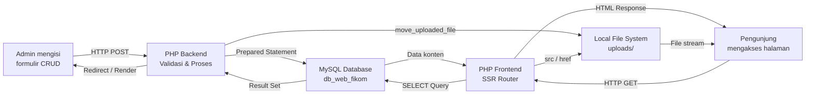

# Desain Arsitektur Sistem — Website Fakultas Ilmu Komputer UNISAN

## 4.1 Diagram Arsitektur Sistem

```mermaid
graph TB
    subgraph CLIENT["🖥️ CLIENT LAYER"]
        B[Browser Pengunjung\nChrome / Firefox / Safari]
        BADM[Browser Administrator\nPanel Admin]
    end

    subgraph FRONTEND["🌐 FRONTEND LAYER (PHP — Server-Side Rendering)"]
        IDX[index.php\nRouter Utama]
        PUB[pages/*.php\nHalaman Publik]
        HDR[includes/header.php\nNavigasi Global]
        FTR[includes/footer.php\nFooter Global]
        FN[includes/functions.php\nHelper Functions]
    end

    subgraph BACKEND["⚙️ BACKEND LAYER (PHP — Admin Panel)"]
        ADM[admin/login.php\nAutentikasi]
        DASH[admin/dashboard.php\nStatistik Utama]
        CRUD[admin/kelola_*.php\nManajemen Konten CRUD]
        CFG[config/database.php\nKoneksi MySQL]
        CONST[config/constants.php\nKonstanta Sistem]
    end

    subgraph STORAGE["📁 FILE STORAGE"]
        UP[uploads/\nberita | dosen | slider\npenelitian | kerjasama | bem\nlaboratorium | dokumen]
        ASSETS[assets/\ncss | js | img | fonts]
    end

    subgraph DATABASE["🗄️ DATABASE LAYER"]
        MYSQL[(MySQL\ndb_web_fikom\n22 Tabel)]
    end

    B -->|HTTP GET Request| IDX
    IDX -->|include| PUB
    PUB -->|include| HDR
    PUB -->|include| FTR
    PUB -->|call| FN
    PUB -->|require| CFG

    BADM -->|HTTP POST/GET| ADM
    ADM -->|Session Auth| DASH
    ADM -->|Session Auth| CRUD
    CRUD -->|require| CFG
    CFG -->|new mysqli| MYSQL
    CRUD -->|Prepared Statement| MYSQL
    PUB -->|Prepared Statement| MYSQL
    MYSQL -->|Result Set| CRUD
    MYSQL -->|Result Set| PUB

    CRUD -->|move_uploaded_file| UP
    PUB -->|src / href| UP
    B -->|GET| ASSETS
    BADM -->|GET| ASSETS

    style CLIENT fill:#e8f4fd,stroke:#2980b9
    style FRONTEND fill:#e8f8e8,stroke:#27ae60
    style BACKEND fill:#fff3e0,stroke:#f39c12
    style STORAGE fill:#f3e5f5,stroke:#8e44ad
    style DATABASE fill:#fce4ec,stroke:#c0392b
```

***Gambar 4.1** Diagram Arsitektur Sistem Website Fakultas Ilmu Komputer UNISAN*

---

## 4.2 Penjelasan Setiap Lapisan Arsitektur

### 4.2.1 Client Layer (Lapisan Klien)

Lapisan klien merepresentasikan semua jenis perangkat dan browser yang digunakan untuk mengakses website. Tidak ada persyaratan khusus di sisi klien karena website menggunakan arsitektur *Server-Side Rendering* murni yang merender seluruh HTML di server sebelum dikirimkan ke browser.

| Aspek | Detail |
|:------|:-------|
| **Tipe Klien** | Browser web modern (Chrome, Firefox, Safari, Edge) |
| **Protokol** | HTTP (development) / HTTPS (produksi) |
| **Rendering** | Server-Side Rendering — browser hanya menerima HTML final |
| **JavaScript** | Digunakan minimal untuk interaksi UI (modal popup, toggle password) |
| **CSS Framework** | Custom CSS dengan variabel CSS (`var(--primary-600)`, dll.) |

---

### 4.2.2 Frontend Layer (Lapisan Antarmuka Publik)

Lapisan *frontend* bertanggung jawab untuk menampilkan konten website kepada pengunjung publik. Arsitektur yang digunakan adalah **PHP Template dengan Include System** di mana setiap halaman merupakan file PHP tersendiri yang menyertakan komponen bersama melalui `include` dan `require_once`.

| Komponen | File | Fungsi |
|:---------|:-----|:-------|
| **Router** | `index.php` | Titik masuk utama, redirect ke `pages/home.php` |
| **Halaman Publik** | `pages/*.php` (24 file) | Setiap halaman menu website |
| **Header Global** | `includes/header.php` | Navigasi, CSS link, meta tags |
| **Footer Global** | `includes/footer.php` | Footer, script JS, link sosial media |
| **Helper Functions** | `includes/functions.php` | `sanitize_input()`, `format_date_indo()`, `handle_upload()`, dll. |
| **Komponen Parsial** | `includes/part_*.php` | Komponen yang digunakan berulang (kartu dosen, modal PDF) |

**Strategi Rendering:** *Server-Side Rendering* (SSR) — PHP mengeksekusi *query* ke MySQL, mengisi variabel PHP, lalu menginterpolasikan data ke template HTML sebelum respons dikirim ke browser.

**Konfigurasi URL Dinamis:** Sistem mendukung subdirektori melalui deteksi otomatis di `config/constants.php` menggunakan `$_SERVER['SCRIPT_NAME']` dan `$_SERVER['HTTP_HOST']`, memastikan URL bekerja baik di *root domain* maupun subdirektori `/web_fikom/`.

---

### 4.2.3 Backend Layer (Lapisan Panel Administrator)

Lapisan *backend* terdiri dari panel administrasi yang hanya dapat diakses oleh administrator terautentikasi. Sistem menggunakan **PHP Session** sebagai mekanisme autentikasi dengan variabel sesi `$_SESSION['admin_logged_in']` sebagai penjaga akses.

| Komponen | File | Fungsi |
|:---------|:-----|:-------|
| **Autentikasi** | `admin/login.php` | Form login dengan `password_verify()` |
| **Dashboard** | `admin/dashboard.php` | Statistik dan ringkasan data |
| **Manajemen Berita** | `admin/kelola_berita.php` | CRUD artikel dan pengumuman |
| **Manajemen Dosen** | `admin/kelola_dosen.php` | CRUD profil tenaga pengajar |
| **Manajemen Penelitian** | `admin/kelola_penelitian.php` | CRUD data riset dosen |
| **Manajemen Pengabdian** | `admin/kelola_pengabdian.php` | CRUD kegiatan pengabdian |
| **Manajemen Fasilitas** | `admin/kelola_ruangan.php`, `kelola_lab.php` | CRUD data sarana prasarana |
| **Manajemen Dokumen** | `admin/kelola_sop.php`, `kelola_renstra.php`, `kelola_renop.php` | CRUD repositori dokumen |
| **Manajemen Konten** | `admin/kelola_visimisi.php`, `kelola_slider.php`, dll. | CRUD konten profil |
| **Manajemen BEM** | `admin/kelola_bem.php` | Update profil BEM |
| **Manajemen Kerjasama** | `admin/kelola_kerjasama.php` | CRUD data mitra |
| **Pendaftaran** | `admin/kelola_pendaftaran.php` | Verifikasi data calon mahasiswa |
| **Profil** | `admin/profile.php` | Update profil dan ganti password |
| **Pemulihan Akses** | `admin/forgot_password.php`, `reset_password.php` | Alur lupa password |

**Pola Arsitektur:** Sistem menggunakan pola arsitektur **MVC-Lite** di mana setiap file `kelola_*.php` berfungsi sekaligus sebagai *Controller* (memproses logika bisnis) dan *View* (merender tampilan HTML) tanpa pemisahan layer yang ketat. Pendekatan ini lazim digunakan pada aplikasi PHP monolitik skala kecil hingga menengah.

---

### 4.2.4 Database Layer (Lapisan Basis Data)

Lapisan basis data adalah inti penyimpanan seluruh konten dan data website yang diakses secara eksklusif melalui lapisan backend PHP menggunakan protokol koneksi MySQL standar.

| Aspek | Detail |
|:------|:-------|
| **RDBMS** | MySQL (bundel XAMPP) |
| **Nama Database** | `db_web_fikom` |
| **Jumlah Tabel** | 22 tabel |
| **Driver PHP** | `mysqli` (MySQL Improved Extension) |
| **Metode Query** | Prepared Statement (`$conn->prepare()`) |
| **Charset** | `utf8mb4` |
| **Collation** | `utf8mb4_unicode_ci` (dukungan emoji & karakter Indonesia) |
| **Host** | `localhost` (database dan web server di mesin yang sama) |

---

### 4.2.5 File Storage (Penyimpanan File)

Sistem mengelola file media dan dokumen menggunakan penyimpanan lokal (*local file system*) di server web. File diunggah dan disimpan dalam struktur direktori terorganisir di dalam root proyek.

| Direktori | Tipe File | Konten |
|:----------|:----------|:-------|
| `uploads/berita/` | Gambar (JPG, PNG, WebP, GIF) | Foto thumbnail artikel berita |
| `uploads/dosen/` | Gambar (JPG, PNG, WebP) | Foto profil dosen |
| `uploads/slider/` | Gambar (JPG, PNG, WebP, GIF) | Gambar hero slider homepage |
| `uploads/penelitian/` | Dokumen (PDF, DOC, DOCX) | Laporan dan proposal penelitian |
| `uploads/pengabdian/` | Dokumen (PDF, DOC, DOCX) | Laporan kegiatan pengabdian |
| `uploads/kerjasama/` | Gambar (JPG, PNG) | Logo instansi mitra kerjasama |
| `uploads/bem/` | Gambar (JPG, PNG) | Logo dan foto kabinet BEM |
| `uploads/laboratorium/` | Gambar (JPG, PNG) | Foto fasilitas laboratorium |
| `uploads/dokumen/` | Dokumen (PDF, DOC, DOCX) | SOP, Renstra, Renop, dan dokumen resmi |
| `assets/css/` | CSS | Stylesheet tampilan website |
| `assets/js/` | JavaScript | Skrip interaksi antarmuka |
| `assets/img/` | Gambar | Aset gambar statis (logo, ikon) |

**Konfigurasi Keamanan Upload:**
- Batas ukuran file: **5MB** (`MAX_FILE_SIZE = 5 * 1024 * 1024`)
- Format gambar yang diizinkan: `image/jpeg`, `image/jpg`, `image/png`, `image/gif`, `image/webp`
- Format dokumen yang diizinkan: `application/pdf`, `application/msword`, `application/vnd.openxmlformats-officedocument.wordprocessingml.document`
- Nama file diencode menggunakan `uniqid() + time()` atau `md5(uniqid(rand(), true))` untuk mencegah konflik nama dan eksploitasi nama file berbahaya.

---

## 4.3 Alur Data Sistem



***Gambar 4.2** Diagram Alur Data Sistem*

---

*Dokumen Arsitektur Sistem ini merupakan bagian dari dokumentasi teknis skripsi Website Fakultas Ilmu Komputer Universitas Muhammadiyah Sidenreng Rappang (UNISAN).*
