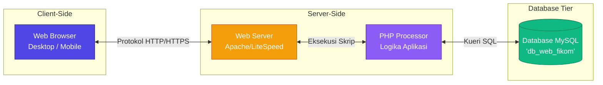
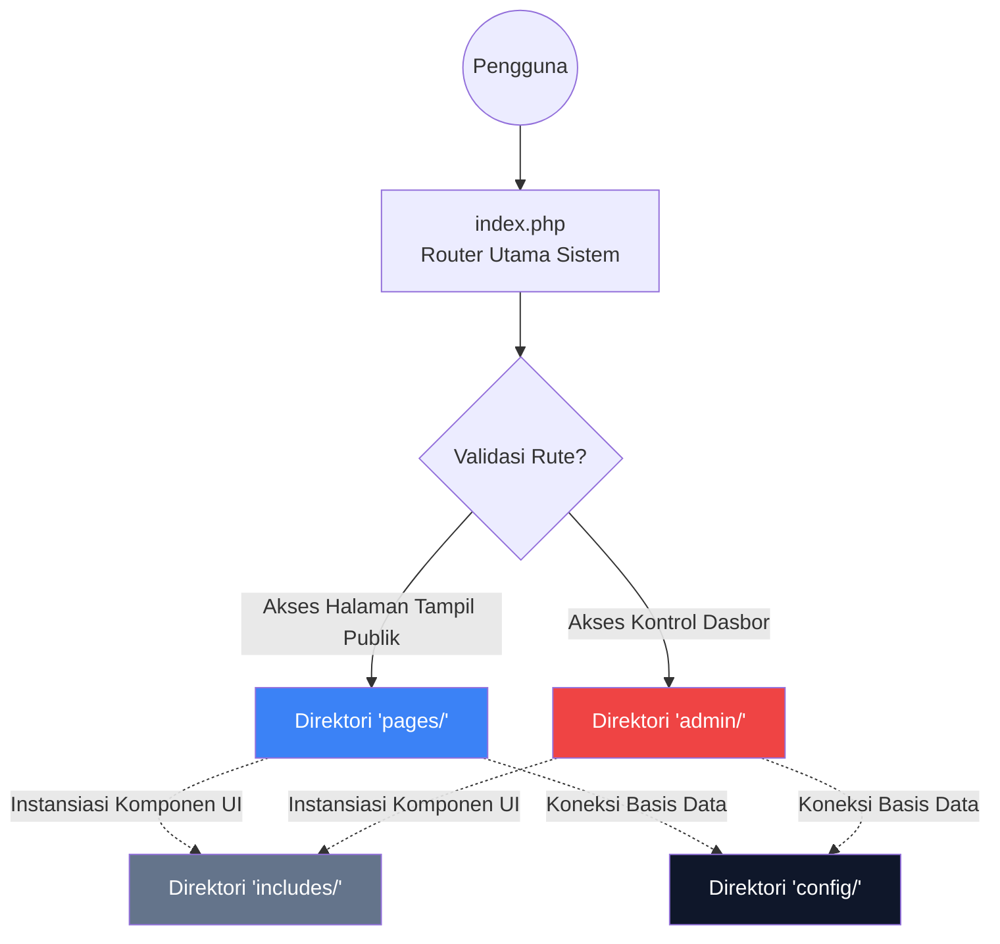

# BAB VI — DESAIN ARSITEKTUR SISTEM

## 6.1 Pengantar Arsitektur
Sistem Informasi Website Fakultas Ilmu Komputer (**Web FIKOM**) dirancang mengadopsi standar **Arsitektur 3 Tingkat (*Three-Tier Architecture*)**. Pendekatan arsitektur ini memisahkan subsistem menjadi tiga lapisan independen untuk memudahkan pengelolaan dan keamanan aplikasi, yaitu:
1. **Presentation Tier (Lapisan Antarmuka):** Merupakan lapisan yang langsung berinteraksi dengan pengguna melalui peramban (*web browser*), yang dikembangkan menggunakan fondasi HTML, CSS, dan JavaScript.
2. **Application Tier (Lapisan Logika):** Merupakan lapisan pemroses data dan pengatur logika sistem. Lapisan ini beroperasi pada lingkungan peladen (*Web Server*) dengan menggunakan bahasa pemrograman PHP.
3. **Data Tier (Lapisan Basis Data):** Lapisan terbawah yang bertugas mengelola dan menyimpan seluruh data terstruktur dari sistem informasi, menggunakan sistem manajemen basis data relasional MySQL.

---

## 6.2 Diagram Infrastruktur Jaringan (Client-Server)
Berikut merupakan diagram alur arsitektur logis antara sisi klien (*Client*) dan sisi peladen (*Server*):

**Penjelasan Alur Jaringan:**  
Saat pengguna memuat halaman web FIKOM melalui peramban, permintaan tersebut dikirimkan via protokol HTTP/HTTPS menuju *Web Server* (Apache) pada mesin *server*. Apache kemudian meneruskan skrip terkait ke pemroses logika (PHP) untuk diterjemahkan menjadi kode operasional. Mengacu pada kebutuhan pengisian data luaran (*dynamic content*), pemroses PHP merespons permintaan dengan membangkitkan kueri SQL kepada sistem manajemen basis data MySQL (Data Tier), mengolah hasil tabel kuerinya ke dalam wujud susunan antarmuka (DOM HTML), dan merepresentasikan keluarannya secara utuh kepada layar *browser* klien.

---

## 6.3 Pola Logika Tata Letak Berkas (Design Pattern)
Dalam pengembangannya, kerangka aplikasi antarmuka ini mengadopsi metode perutean terpusat (**Centralized Router**) berbasis bahasa PHP Murni (*Native*), alih-alih menggunakan *Framework* monolitik eksternal guna memelihara stabilitas pemuatan sistem operasi yang ringan dan ringkas. Komponen `index.php` berfungsionalitas sebagai gerbang parameter utama bagi seluruh panggilan halaman di antarmuka pengunjung.

**Penjelasan Modul Fungsional Direktori:**
- **Berkas `index.php`**: Berkas titik mula (*entry file*) komando utama yang mendelegasikan penterjemahan panggilan URL sistem menuju pemanggilan spesifik komponen modul berkas yang selaras.
- **Direktori `config/`**: Area konfigurasi statis penyimpan inisialisasi awal aplikasi semacam pengaturan kunci relasi pertalian koneksi manajemen basis data.
- **Direktori `includes/`**: Modul pendukung penyusunan kerangka desain antarmuka secara dinamis (temat komponen *Header* gubahan *Footer* visual) guna mencapai efisiensi integrasi taktis berulang modul modularitas.
- **Direktori `pages/`**: Wadah pemilahan koleksi kumpulan interaksi laman publik yang berisi seluruh operasional pelaporan bacaan informatif pengunjung antarmuka depan.
- **Direktori `admin/`**: Area isolasi kepengurusan administrasi operasional terpadu tingkat tertutup dengan mewajibkan identitas kendali lapis pengaman terotorisasi (*login session*).

---

## 6.4 Struktur Perangkat Lunak (Tech Stack)
Daftar penunjang pondasi teknologi pengembangan pada kerangka kerja terimplementasi sistem disajikan sebagaimana berikut:
1. **Presentasi Elemen Dasar (HTML5 & CSS3 Vanilla)**: Diaplikasikan murni untuk membangkitkan entitas markah struktural hingga pendefinisian aturan skema antarmuka tata letaknya tanpa menggunakan modul gubahan antarmuka *framework* kelas berat.
2. **Kendali Rekayasa Interaktif (JavaScript & jQuery)**: Diterapkan menstimulasi pergerakan objek tata letak asinkron reaktif seperti membongkar tayangan layar pop-up parsial serta fungsi elemen enumerasi otomatis untuk mereduksi angka keharusan fungsi memuat ulang siklus halaman klien (*re-load rendering*).
3. **Kendali Operasional Sentral (PHP Native 8.x)**: Instruksi bahasa *scripting* sisi-peladen (*server-side protocol*) perantara perihal pengesahan integrasi variabel transmisi muatan kueri manipulasi formulir ke sistem.
4. **Medium Lingkungan Pengembangan (XAMPP Server)**: Mendistribusikan konfigurasi utilitas wadah layanan berbasis fungsionalitas HTTP, kompilasi mesin penerjemah pemrosesan serta jaminan pelabuhan server sistem.
