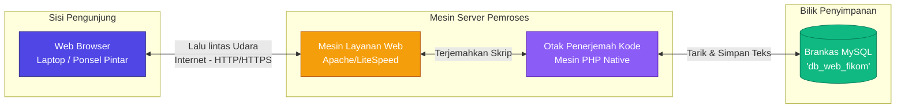
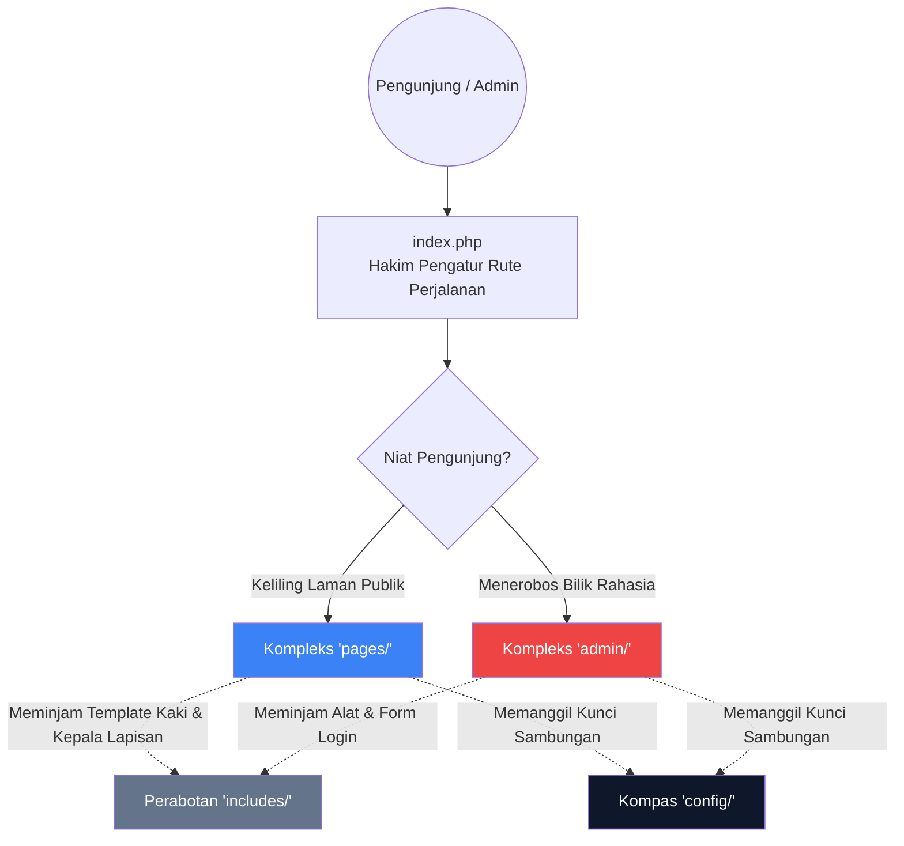

# BAB VI — DESAIN ARSITEKTUR SISTEM

## 6.1 Pengantar Arsitektur
Sistem Informasi Website Fakultas Ilmu Komputer (**Web FIKOM**) dirancang mengadopsi standar **Arsitektur 3 Tingkat (*Three-Tier Architecture*)**. Sesuai dengan bahasa keteknikan yang difilter menjadi sesederhana mungkin, arsitektur ini memecah beban kerja besar menjadi tiga bagian mandiri agar sebuah kerusakan halaman tidak menjalar menghancurkan ruang rahasia atau sebaliknya secara telak.

Ketiga lapisan tingkatan tersebut adalah:
1. **Lapis Muka (*Presentation Tier*):** Perihal wujud tampilan yang nampak oleh mata telanjang atau yang disentuh jari pengunjung (menggunakan pilar perakit antarmuka HTML, CSS, JavaScript).
2. **Lapis Otak (*Application Tier*):** Serangkaian permesinan tidak kasat mata yang terus berputar mengatur lalulintas permintaan atau perhitungan (menggunakan mesin Web Server HTTP dan logika dari pengkodean PHP murni).
3. **Lapis Gudang (*Data Tier*):** Brankas besi tempat di mana tulisan disimpan dan dicari secara instan (mengandalkan lumbung SQL).

---

## 6.2 Diagram Infrastruktur Jaringan (Client-Server)
Berikut merupakan rute sirkulasi udara dari awal ketikan papan tik pengguna hingga dikembalikan ke layar mereka:

**Alur Bercerita:**  
Ketika warga sipil mengetikkan situs fakultas dari perambannya *(Browser)*, permintaan tersebut dilempar menembus gelombang internet menemui komandan garda depan di mesin server *(Apache)*. Apache mendelegasikan mandatnya kepada penerjemah kode *(PHP)*. Barulah PHP berlari ke pintu brankas *(MySQL)* guna menjemput tulisan konten yang ada, merakitnya lantas dibungkus kembali menuju layar si peminta.

---

## 6.3 Pola Logika Tata Letak Berkas (Design Pattern)
Secara arsitektur folder, kerangka ini menolak gagasan pemakaian *Framework* berat (seperti Laravel/CodeIgniter) guna menjaga situs melesat sesecepat mungkin *(Ultra-Lightweight)*. Sebagai gantinya, sistem merajut arsitektur **Hakim Jalur Tunggal (*Centralized Router*)**. Segala interaksi masuk harus berpapasan dengan satu titik hakim utama `index.php`.

**Pembagian Zona Bilik Kerja:**
- **Berkas `index.php`**: Panglima depan. Memotong tautan *(URL)* dan menembakkannya langsung agar pemakai tidak pernah tahu letak sesungguhnya lorong folder rahasianya.
- **Berkas `config`**: Bilik saklar utama *(Master Switch)* tempat sandi pertalian brankas MySQL ditanam.
- **Berkas `includes`**: Dapur tempelan perabotan repetitif. Bagian *Header* (Kepala Laman) dan *Footer* (Ekor Laman) diracik di tempat ini lantas dipinjamkan ke seluruh penjuru agar tukang program tak mengulang gubahan yang sama.
- **Berkas `pages`**: Pabrik-pabrik lembaran koran Publik *(Beranda, Berita, Info Dosen)*.
- **Berkas `admin`**: Benteng dasbor terlarang. Dijaga super ketat oleh jimat *Login Session*.

---

## 6.4 Struktur Logistik (Tech Stack)
Bumbu pendorong utama fondasi web yang menjadikanya berdiri gagah:
1. **Bahasa Struktur Dasar (*HTML5 & CSS3 Vanilla*)**  
   Penggunaan model lukisan riil dan polos tanpa menggunakan pabrik rakitan *Tailwind* maupun *Bootstrap* agar sang pengukir benar-benar leluasa meracik sudut lekuk halaman tanpa dibebani memori berat.
2. **Kecerdasan Halaman (*JavaScript*)**  
   Meniupkan nyawa pada objek web. Memanggil pertunjukan jendela sembulan (*Popup Layer*) jurnal dan interaksi pergerakan angka otomatis pada kalender serta gambar galeri tanpa memicu kedipan (*Refresh*) pe-muat-an ulang halaman utama.
3. **Senjata Operasional (*PHP Asli/Native*)**  
   Semen tangguh penghubung gerigi yang menghidupkan lalu lintas pengantaran (*Submit Form Pendaftaran*) dan rekayasa silaturahmidata.
4. **Rumah Persewaan Udara (*Deployment Server*)**  
   Ketika rampung dari bengkel uji internal komputer (*Local XAMPP / Laragon*), arsip diangkat *(Deploy)* menemui panel awan *(cPanel Shared Hosting* atau *Linux VPS)*.
