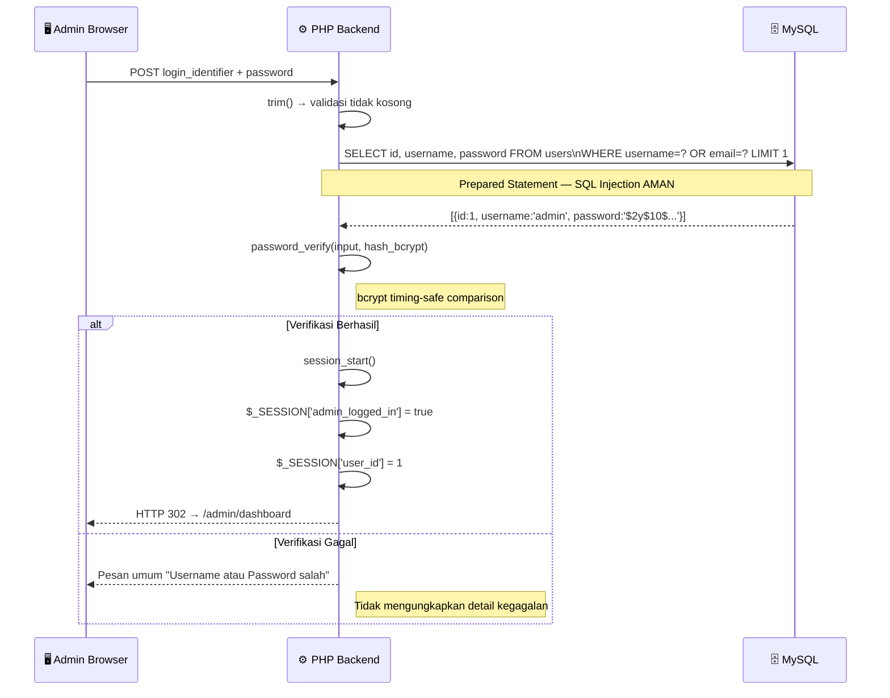

# 🛡️ Sistem Keamanan — Website Fakultas Ilmu Komputer UNISAN

## 5.1 Diagram Arsitektur Keamanan

```mermaid
graph TD
    A[👤 User Request\nBrowser] -->|HTTP Request| B

    subgraph NETWORK["🌐 Network Layer"]
        B[URL Routing\n.htaccess]
        B -->|Validasi metode & ekstensi| C
    end

    subgraph FRONTEND_PROT["🔒 Frontend Protection"]
        C[PHP Input Handler]
        C --> D[sanitize_input\nhtmlspecialchars + stripslashes]
        D --> E[Validasi Format\nData & Tipe File]
    end

    subgraph BACKEND_PROT["⚙️ Backend Protection"]
        E --> F{Autentikasi\nSesi?}
        F -- Admin Area --> G[Session Guard\n$_SESSION validation]
        G --> H[Prepared Statement\nQuery Builder]
        F -- Public Area --> H
        H --> I[password_verify\nbcrypt hash comparison]
    end

    subgraph DB_LAYER["🗄️ Database Layer"]
        H -->|Parameterized Query| J[(MySQL\ndb_web_fikom)]
        J -->|Result Set| H
    end

    subgraph FILE_LAYER["📁 File Protection"]
        E --> K[Validasi MIME Type\n& Ukuran File]
        K --> L[Encode Nama File\ntime + md5 + uniqid]
        L --> M[/uploads/ directory\n.htaccess protected]
    end

    style NETWORK fill:#e3f2fd,stroke:#1565c0
    style FRONTEND_PROT fill:#e8f5e9,stroke:#2e7d32
    style BACKEND_PROT fill:#fff8e1,stroke:#f57f17
    style DB_LAYER fill:#fce4ec,stroke:#c62828
    style FILE_LAYER fill:#f3e5f5,stroke:#6a1b9a
```

***Gambar 5.1** Diagram Arsitektur Keamanan Sistem*

---

## 5.2 Autentikasi dan Otorisasi

### 5.2.1 Mekanisme Autentikasi

Sistem mengimplementasikan autentikasi berbasis **PHP Session** dengan mekanisme verifikasi *password hash* menggunakan algoritma bcrypt melalui fungsi bawaan PHP `password_verify()` dan `password_hash()`.

| Komponen | Implementasi | Detail |
|:---------|:-------------|:-------|
| **Password Hashing** | `password_hash($pass, PASSWORD_DEFAULT)` | Menggunakan bcrypt dengan *cost factor* default (10) |
| **Password Verification** | `password_verify($input, $stored_hash)` | Perbandingan secara *timing-safe* untuk mencegah *timing attack* |
| **Session Management** | `$_SESSION['admin_logged_in'] = true` | Variabel sesi boolean sebagai penanda autentikasi |
| **Session Lifetime** | `SESSION_LIFETIME = 3600` detik | Sesi kedaluwarsa setelah 1 jam tidak aktif |
| **Login Identifier** | Username ATAU Email | Fleksibilitas login via dua jenis identitas |

### 5.2.2 Sequence Diagram Alur Login Aman



***Gambar 5.2** Sequence Diagram Alur Autentikasi Aman*

### 5.2.3 Session Guard pada Halaman Admin

Setiap halaman dalam direktori `admin/` memverifikasi sesi di awal eksekusi sebelum kode apapun dijalankan:

```php
// Pola cek sesi di setiap halaman admin
if (!isset($_SESSION['admin_logged_in']) || $_SESSION['admin_logged_in'] !== true) {
    header("Location: login");
    exit;
}
```

Atau melalui fungsi helper terpusat di `includes/functions.php`:

```php
function is_logged_in() {
    return isset($_SESSION['admin_logged_in']) && $_SESSION['admin_logged_in'] === true;
}
```

---

## 5.3 Perlindungan Terhadap SQL Injection

### 5.3.1 Prepared Statement (Parameterized Query)

Seluruh operasi query yang melibatkan input pengguna menggunakan *Prepared Statement* melalui ekstensi `mysqli`:

```php
// Contoh implementasi pada admin/login.php
$stmt = $conn->prepare(
    "SELECT id, username, password FROM users WHERE username = ? OR email = ? LIMIT 1"
);
$stmt->bind_param("ss", $login_identifier, $login_identifier);
$stmt->execute();
$result = $stmt->get_result();
```

**Mekanisme Perlindungan:** Parameter query (`?`) divalidasi dan diencode oleh driver MySQL sebelum dieksekusi, memastikan nilai input pengguna diperlakukan sebagai data murni bukan sebagai bagian dari sintaks SQL. Pemisahan antara kode SQL dan data ini secara fundamental mencegah serangan *SQL Injection*.

| Operasi | Metode Keamanan | File Contoh |
|:--------|:----------------|:------------|
| `SELECT login` | `prepare()` + `bind_param("ss", ...)` | `admin/login.php` |
| `INSERT berita` | `prepare()` + `bind_param("ssssss", ...)` | `admin/kelola_berita.php` |
| `UPDATE dosen` | `prepare()` + `bind_param("sssssssssi", ...)` | `admin/kelola_dosen.php` |
| `DELETE pendaftaran` | `prepare()` + `bind_param("i", $id)` | `admin/kelola_pendaftaran.php` |
| `SELECT penelitian` | `prepare()` + `bind_param("i", $id)` | `admin/kelola_penelitian.php` |

### 5.3.2 intval() untuk Parameter ID

Parameter ID yang diterima melalui URL (`$_GET['id']`) selalu dikonversi ke integer menggunakan `intval()`:

```php
$id_hapus = intval($_GET['id']);  // Mengkonversi ke integer, mencegah string berbahaya
```

---

## 5.4 Perlindungan Terhadap XSS (Cross-Site Scripting)

### 5.4.1 Input Sanitization

Fungsi `sanitize_input()` di `includes/functions.php` mengimplementasikan tiga lapisan pembersihan input:

```php
function sanitize_input($data) {
    if (is_array($data)) {
        return array_map('sanitize_input', $data);
    }
    $data = trim($data);          // Layer 1: Hapus whitespace
    $data = stripslashes($data);   // Layer 2: Hapus karakter escape
    $data = htmlspecialchars($data, ENT_QUOTES, 'UTF-8');  // Layer 3: Encode HTML
    return $data;
}
```

Fungsi ini mendukung input array secara rekursif melalui `array_map()`, memastikan seluruh elemen terproses meskipun input berbentuk array.

### 5.4.2 Output Encoding

Seluruh output data dari basis data ke HTML menggunakan `htmlspecialchars()`:

```php
// Contoh pada kelola_dosen.php dan halaman publik
echo htmlspecialchars($dosen['nama']);
echo htmlspecialchars($b['judul']);
```

---

## 5.5 Keamanan Upload File

### 5.5.1 Validasi Tipe File

```php
// Validasi untuk foto dosen (kelola_dosen.php)
$fileExt = strtolower(pathinfo($_FILES['foto']['name'], PATHINFO_EXTENSION));
if (in_array($fileExt, ['jpg', 'jpeg', 'png', 'webp']) && $_FILES['foto']['size'] <= 2000000) {
    // Proses upload
}

// Validasi dengan konstanta terpusat (includes/functions.php)
if ($allowed_types && !in_array($file['type'], $allowed_types)) {
    return ['success' => false, 'message' => 'File type not allowed'];
}
```

### 5.5.2 Encoding Nama File

```php
// Metode 1: kelola_berita.php — kriptografi lebih kuat
function generateSafeFileName($originalFileName) {
    $ext  = pathinfo($originalFileName, PATHINFO_EXTENSION);
    $name = pathinfo($originalFileName, PATHINFO_FILENAME);
    $name = preg_replace('/[^A-Za-z0-9_-]/', '_', $name);
    return time() . '_' . md5(uniqid(rand(), true)) . '.' . $ext;
}

// Metode 2: kelola_dosen.php — berdasarkan timestamp
$newFileName = time() . '-' . uniqid() . '.' . $fileExt;
```

### 5.5.3 Tabel Konfigurasi Keamanan Upload

| Parameter | Nilai | Keterangan |
|:----------|:------|:-----------|
| `MAX_FILE_SIZE` | 5MB (`5 * 1024 * 1024`) | Batas ukuran file semua tipe |
| Foto Dosen MAX | 2MB (`2,000,000 bytes`) | Batas khusus foto profil dosen |
| Format Gambar | JPEG, JPG, PNG, GIF, WebP | Tipe MIME yang diizinkan untuk gambar |
| Format Dokumen | PDF, DOC, DOCX | Tipe MIME yang diizinkan untuk dokumen |
| Nama File | `time() + md5(uniqid())` | Encoding untuk mencegah konflik dan eksploitasi |
| Direktori | `uploads/[kategori]/` | Direktori target terpisah per jenis konten |

---

## 5.6 Keamanan Rute URL

### 5.6.1 Konfigurasi `.htaccess`

File `.htaccess` pada level root mengkonfigurasi penanganan URL dan keamanan akses:

```apache
# Contoh konfigurasi keamanan umum
Options -Indexes          # Menonaktifkan directory listing
DirectoryIndex index.php  # Mengarahkan root ke index.php
```

### 5.6.2 Perlindungan Direktori Config

File `config/constants.php` mengimplementasikan pencegahan akses langsung:

```php
// config/constants.php
if (!defined('DB_CONFIG')) {
    die('Direct access not permitted');
}
```

File `config/database.php` menetapkan konstanta penanda:

```php
defined('DB_CONFIG') or define('DB_CONFIG', true);
```

### 5.6.3 Perlindungan Direktori Admin

File `.htaccess` pada direktori `admin/` mencegah akses langsung ke file:

```apache
# admin/.htaccess
Options -Indexes
```

---

## 5.7 Tabel Security Headers yang Direkomendasikan

| No | Header | Nilai | Fungsi |
|:--:|:-------|:------|:-------|
| 1 | `X-Frame-Options` | `SAMEORIGIN` | Mencegah *Clickjacking* melalui iframe |
| 2 | `X-Content-Type-Options` | `nosniff` | Mencegah MIME-type sniffing |
| 3 | `X-XSS-Protection` | `1; mode=block` | Mengaktifkan filter XSS browser |
| 4 | `Referrer-Policy` | `strict-origin-when-cross-origin` | Membatasi informasi referrer |
| 5 | `Content-Security-Policy` | `default-src 'self'` | Membatasi sumber konten |

---

## 5.8 Matriks Keamanan Sistem

| No | Ancaman | Implementasi Perlindungan | Status |
|:--:|:--------|:--------------------------|:------:|
| 1 | SQL Injection | Prepared Statement + `intval()` | ✅ Terlindungi |
| 2 | XSS (Stored) | `sanitize_input()` + `htmlspecialchars()` | ✅ Terlindungi |
| 3 | Unauthorized Access | Session Guard di semua halaman admin | ✅ Terlindungi |
| 4 | Brute Force Login | [Perlu Rate Limiting tambahan] | ⚠️ Perlu Perbaikan |
| 5 | File Upload Exploit | Validasi MIME + nama file encoding | ✅ Terlindungi |
| 6 | Password Plaintext | bcrypt via `password_hash()` | ✅ Terlindungi |
| 7 | Credential Exposure | `error_log()` bukan `echo` untuk error DB | ✅ Terlindungi |
| 8 | Directory Listing | `.htaccess Options -Indexes` | ✅ Terlindungi |
| 9 | CSRF Attack | [Perlu CSRF Token tambahan] | ⚠️ Perlu Perbaikan |
| 10 | Direct File Access | Konstanta `DB_CONFIG` guard | ✅ Terlindungi |

---

## 5.9 Rekomendasi Keamanan untuk Deployment Produksi

Berikut adalah rekomendasi implementasi keamanan tambahan yang disarankan sebelum sistem dideploy ke lingkungan produksi:

| No | Rekomendasi | Prioritas | Implementasi |
|:--:|:------------|:---------:|:-------------|
| 1 | **Rate Limiting Login** — Batasi max 5 percobaan login per menit per IP | 🔴 Tinggi | Middleware PHP + IP tracking di database |
| 2 | **CSRF Token** — Tambahkan token acak tersembunyi di setiap form | 🔴 Tinggi | `hash_hmac(sha256)` pada setiap form POST |
| 3 | **HTTPS Enforcement** — Paksa koneksi SSL/TLS | 🔴 Tinggi | `.htaccess RewriteRule` + sertifikat SSL |
| 4 | **Environment Variables** — Pindahkan kredensial DB ke `.env` | 🟡 Sedang | `putenv()` atau library `vlucas/phpdotenv` |
| 5 | **Session Hardening** — `session_regenerate_id(true)` setelah login | 🟡 Sedang | Panggil setelah login berhasil |
| 6 | **2FA Admin** — Autentikasi dua faktor untuk akun admin | 🟡 Sedang | OTP via email atau Google Authenticator |
| 7 | **Upload Virus Scan** — Validasi file yang diunggah dari malware | 🟢 Rendah | Integrasi ClamAV atau similar |
| 8 | **Audit Log** — Catat semua aktivitas admin ke tabel log | 🟢 Rendah | Tabel `activity_log` di database |

---

*Dokumen Sistem Keamanan ini merupakan bagian dari dokumentasi teknis skripsi Website Fakultas Ilmu Komputer Universitas Muhammadiyah Sidenreng Rappang (UNISAN).*
