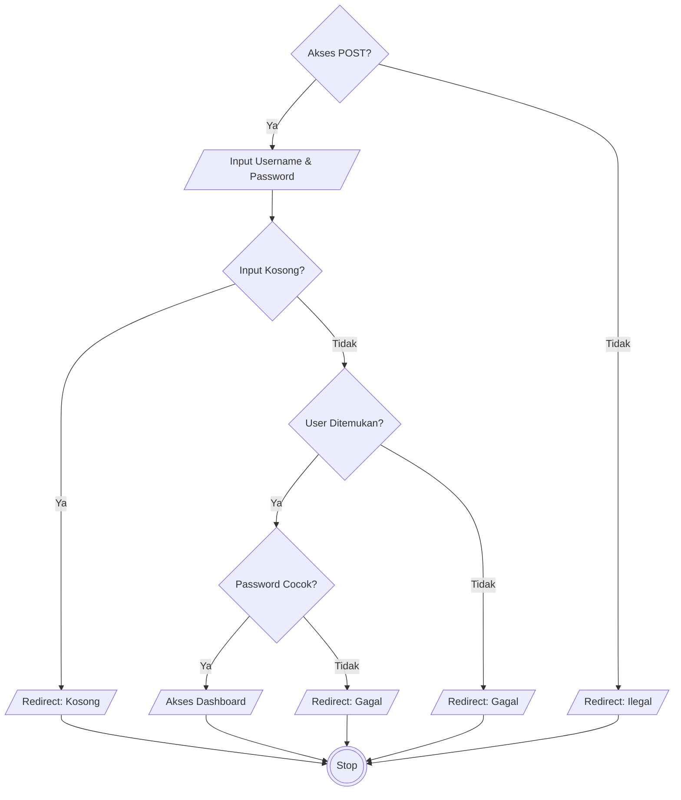
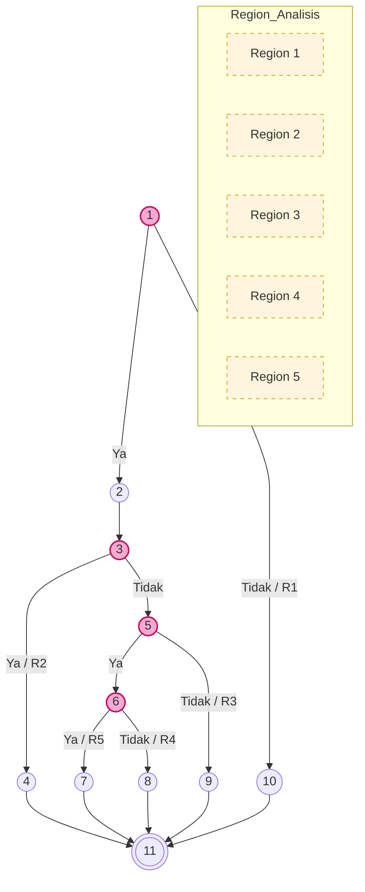
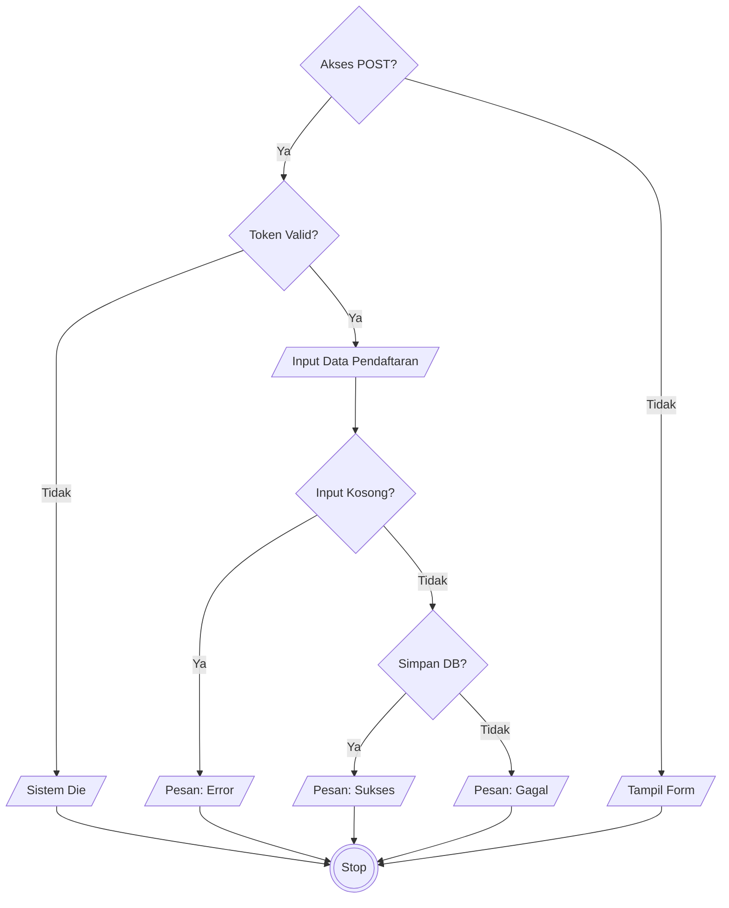
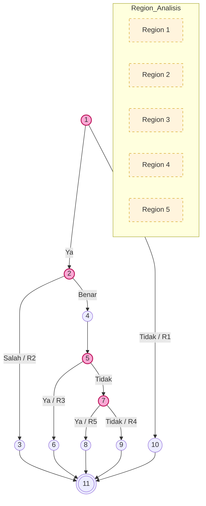
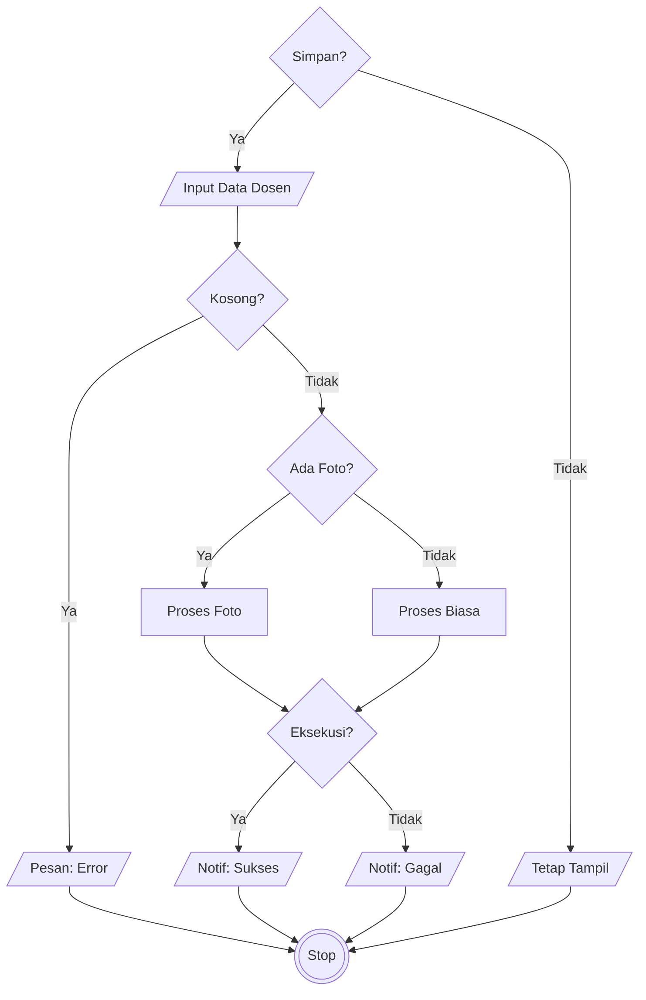
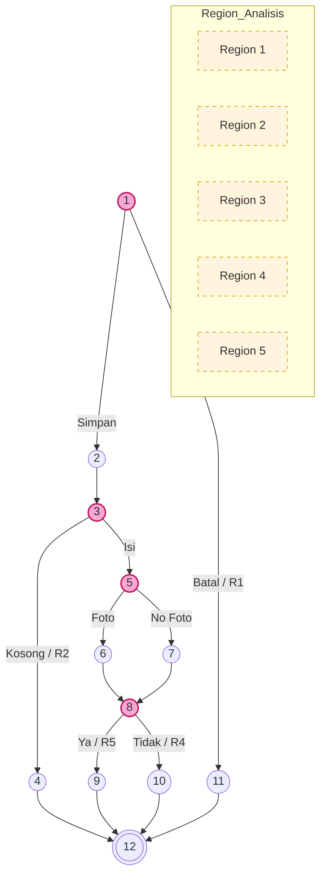

# LAPORAN PENGUJIAN WHITE BOX (WHITE BOX TESTING)

## 01. PENGANTAR PENGUJIAN

Pengujian *White Box* (*Glass Box Testing*) adalah metode pengujian perangkat lunak yang fokus pada verifikasi struktur internal, desain algoritma, dan alur kerja kode program. Tujuan utamanya adalah untuk memastikan bahwa seluruh jalur logika telah dieksekusi setidaknya satu kali, serta mendeteksi adanya kesalahan penulisan maupun celah logika pada percabangan.

Dalam laporan ini, tingkat kompleksitas logika diukur menggunakan metode **Cyclomatic Complexity (V(G))**. Nilai ukuran matematika ini menentukan jumlah jalur independen minimum yang harus diuji untuk menjamin cakupan kode yang lengkap.

---

## 02. UNIT PENGUJIAN 1: MENU LOGIN ADMINISTRATOR (`proses_login.php`)

### 1. Pemetaan Statement dan Node
| Potongan Kode PHP (Statement Code) | Simpul (Node) |
|:---|:---:|
| `if ($_SERVER["REQUEST_METHOD"] == "POST") {` | **1** |
| `$username = $_POST['username']; $password = $_POST['password'];` | **2** |
| `if (empty($username) \|\| empty($password)) {` | **3** |
| `header("location: login?status=kosong"); exit;` | **4** |
| `$sql = "SELECT * FROM users WHERE username = ?"; ... if ($result->num_rows === 1) {` | **5** |
| `if (password_verify($password, $data['password'])) {` | **6** |
| `$_SESSION['login'] = true; header("location: dashboard");` | **7** |
| `header("location: login?status=gagal");` (Password Salah) | **8** |
| `header("location: login?status=gagal");` (User Tidak Ditemukan) | **9** |
| `exit;` (Bukan akses POST / Direct URL) | **10** |
| **End of Script / Logika Usai** | **11** |

### 2. Flowchart

### 3. Flowgraph

Dari flowgraph tersebut didapatkan:

**Diketahui:**
* Region (R) = 5
* Node (N) = 11
* Edge (E) = 14
* Predicate Node (P) = 4

#### 4. Perhitungan Cyclomatic Complexity dari Edge dan Node
**Diketahui:**
* Edge (E) = 14
* Node (N) = 11

**Rumus:**
$$V(G) = E - N + 2$$

**Perhitungan:**
$$V(G) = 14 - 11 + 2 = \mathbf{5}$$

Jadi, nilai Cyclomatic Complexity dari flowgraph tersebut adalah **5**.

#### 5. Perhitungan Cyclomatic Complexity dari Predicate Node (P)
**Diketahui:**
* Predicate Node (P) = 4 (yaitu Node 1, Node 3, Node 5, dan Node 6)

**Rumus:**
$$V(G) = P + 1$$

**Perhitungan:**
$$V(G) = 4 + 1 = \mathbf{5}$$

#### 6. Independent Path (5 Jalur Independen)
Karena nilai V(G) = 5, maka terdapat 5 Independent Path, yaitu:

**Tabel 4.10 Independent Path Autentikasi Login**

| Region | Independent Path |
|:---:|:---|
| **R1** | Start → 1 → 10 → 11 → End |
| **R2** | Start → 1 → 2 → 3 → 4 → 11 → End |
| **R3** | Start → 1 → 2 → 3 → 5 → 9 → 11 → End |
| **R4** | Start → 1 → 2 → 3 → 5 → 6 → 8 → 11 → End |
| **R5** | Start → 1 → 2 → 3 → 5 → 6 → 7 → 11 → End |

Berdasarkan hasil perhitungan Cyclomatic Complexity dan pengujian terhadap lima jalur independen yang ada, dapat disimpulkan bahwa seluruh alur logika dalam modul login telah berjalan dengan benar dan tidak ditemukan kesalahan pada struktur kontrolnya. Dengan demikian, pengujian white-box terhadap modul ini dinyatakan **berhasil**.

---

## 03. UNIT PENGUJIAN 2: MENU PENDAFTARAN MAHASISWA (`proses_pendaftaran.php`)

### 1. Pemetaan Statement dan Node
| Potongan Kode PHP (Statement Code) | Simpul (Node) |
|:---|:---:|
| `if ($_SERVER["REQUEST_METHOD"] == "POST") {` | **1** |
| `if (CSRF_TOKEN_INVALID) {` | **2** |
| `die("Invalid Token");` | **3** |
| `$nama = $_POST['nama']; $nik = $_POST['nik']; dll` | **4** |
| `if (empty($nama) \|\| empty($nik)) {` | **5** |
| `$msg = "Lengkapi data wajib!";` | **6** |
| `if ($query_execute) {` | **7** |
| `$msg = "Berhasil";` | **8** |
| `$msg = "Gagal Query";` | **9** |
| `exit;` (Akses GET) | **10** |
| **Selesai** | **11** |

### 2. Flowchart

### 3. Flowgraph

Dari flowgraph tersebut didapatkan:

**Diketahui:**
* Region (R) = 5
* Node (N) = 11
* Edge (E) = 14
* Predicate Node (P) = 4

#### 4. Perhitungan Cyclomatic Complexity dari Edge dan Node
**Diketahui:**
* Edge (E) = 14
* Node (N) = 11

**Rumus:**
$$V(G) = E - N + 2$$

**Perhitungan:**
$$V(G) = 14 - 11 + 2 = \mathbf{5}$$

Jadi, nilai Cyclomatic Complexity dari flowgraph tersebut adalah **5**.

#### 5. Perhitungan Cyclomatic Complexity dari Predicate Node (P)
**Diketahui:**
* Predicate Node (P) = 4 (yaitu Node 1, Node 2, Node 5, dan Node 7)

**Rumus:**
$$V(G) = P + 1$$

**Perhitungan:**
$$V(G) = 4 + 1 = \mathbf{5}$$

#### 6. Independent Path (5 Jalur Independen)
Karena nilai V(G) = 5, maka terdapat 5 Independent Path, yaitu:

**Tabel 4.11 Independent Path Pendaftaran Mahasiswa**

| Region | Independent Path |
|:---:|:---|
| **R1** | Start → 1 → 10 → 11 → End |
| **R2** | Start → 1 → 2 → 3 → 11 → End |
| **R3** | Start → 1 → 2 → 4 → 5 → 6 → 11 → End |
| **R4** | Start → 1 → 2 → 4 → 5 → 7 → 9 → 11 → End |
| **R5** | Start → 1 → 2 → 4 → 5 → 7 → 8 → 11 → End |

Berdasarkan hasil pengujian terhadap lima jalur independen di atas, disimpulkan bahwa alur logika modul pendaftaran telah berjalan sesuai rancangan sistem. Pengamanan token dan validasi data berhasil menangani setiap kondisi input dengan benar. Dengan demikian, pengujian white-box dinyatakan **berhasil**.

---

## 04. UNIT PENGUJIAN 3: MENU KELOLA DATA DOSEN (`kelola_dosen.php`)

### 1. Pemetaan Statement dan Node
| Potongan Kode PHP (Statement Code) | Simpul (Node) |
|:---|:---:|
| `if (isset($_POST['simpan'])) {` | **1** |
| `$nidn = $_POST['nidn']; $nama = $_POST['nama']; dll` | **2** |
| `if (empty($nidn) \|\| empty($nama)) {` | **3** |
| `Error: Input Kosong` | **4** |
| `if (ADA_FOTO)` | **5** |
| `Upload Foto + SQL` | **6** |
| `SQL Tanpa Foto` | **7** |
| `if ($execute)` | **8** |
| `Success Message` | **9** |
| `Error Message` | **10** |
| `No POST Action` | **11** |
| **End** | **12** |

### 2. Flowchart

### 3. Flowgraph

Dari flowgraph tersebut didapatkan:

**Diketahui:**
* Region (R) = 5
* Node (N) = 12
* Edge (E) = 15
* Predicate Node (P) = 4

#### 4. Perhitungan Cyclomatic Complexity dari Edge dan Node
**Diketahui:**
* Edge (E) = 15
* Node (N) = 12

**Rumus:**
$$V(G) = E - N + 2$$

**Perhitungan:**
$$V(G) = 15 - 12 + 2 = \mathbf{5}$$

Jadi, nilai Cyclomatic Complexity dari flowgraph tersebut adalah **5**.

#### 5. Perhitungan Cyclomatic Complexity dari Predicate Node (P)
**Diketahui:**
* Predicate Node (P) = 4 (yaitu Node 1, Node 3, Node 5, dan Node 8)

**Rumus:**
$$V(G) = P + 1$$

**Perhitungan:**
$$V(G) = 4 + 1 = \mathbf{5}$$

#### 6. Independent Path (5 Jalur Independen)
Karena nilai V(G) = 5, maka terdapat 5 Independent Path, yaitu:

**Tabel 4.12 Independent Path Kelola Data Dosen**

| Region | Independent Path |
|:---:|:---|
| **R1** | Start → 1 → 11 → 12 → End |
| **R2** | Start → 1 → 2 → 3 → 4 → 12 → End |
| **R3** | Start → 1 → 2 → 3 → 5 → [6/7] → 8 → 10 → 12 → End |
| **R4** | Start → 1 → 2 → 3 → 5 → 7 → 8 → 9 → 12 → End |
| **R5** | Start → 1 → 2 → 3 → 5 → 6 → 8 → 9 → 12 → End |

Berdasarkan analisis terhadap modul kelola data dosen, seluruh jalur eksekusi kritis telah diuji dan menunjukkan hasil yang konsisten. Penanganan file upload dan integrasi database berjalan optimal sesuai dengan jalur independen yang ditetapkan. Pengujian white-box dinyatakan **berhasil**.

---

## 05. KESIMPULAN AKHIR

| Modul Pengujian | Skor V(G) | Jalur Independen | Status |
|:---|:---:|:---:|:---:|
| **Menu Login Administrator** | 5 | 5 Jalur | **Sukses** |
| **Menu Pendaftaran Mahasiswa** | 5 | 5 Jalur | **Sukses** |
| **Menu Kelola Data Dosen** | 5 | 5 Jalur | **Sukses** |

**Kesimpulan:** Seluruh alur logika program dinyatakan **VALID** dan **BERHASIL**. Sistem telah terbebas dari kesalahan struktur kontrol dan sanggup menangani setiap kondisi input pengguna secara akurat.
