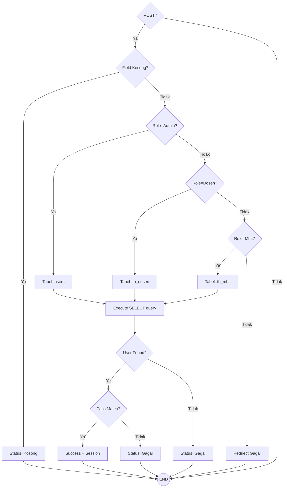
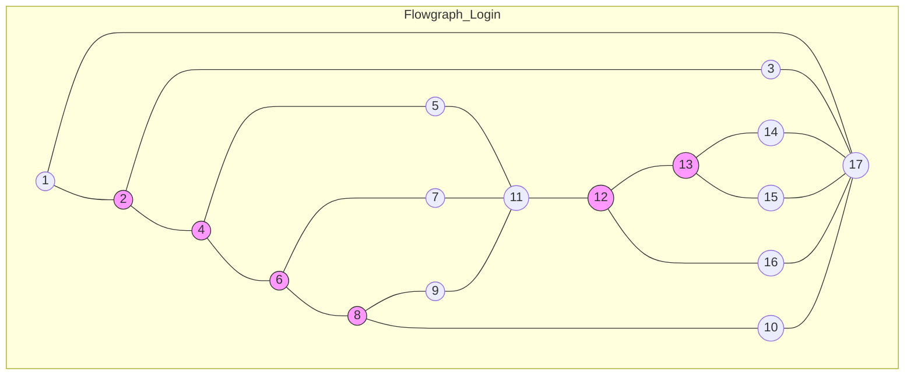

# ⚙️ Laporan Pengujian White Box — Website Fakultas Ilmu Komputer UNISAN

## 7.1 Pengantar White Box Testing

*White Box Testing* adalah cara menguji aplikasi dengan memeriksa langsung alur logika dan percabangan di dalam kode program. Tujuannya adalah memastikan setiap jalur perintah dalam kode pernah dijalankan dan bekerja dengan benar.

### Metode Cyclomatic Complexity (V(G))
Untuk menghitung kerumitan logika program, kita menggunakan metode *Cyclomatic Complexity*. Ada dua rumus yang digunakan:
1.  **V(G) = E — N + 2**
    *   `E` (Edges): Garis penghubung antar langkah.
    *   `N` (Nodes): Titik perintah atau pernyataan kode.
2.  **V(G) = P + 1**
    *   `P`: Jumlah titik keputusan (seperti `if` atau `else`).

---

## 7.2 Analisis Modul 1: Autentikasi Admin (`admin/proses_login.php`)

### 7.2.1 Tabel Pemetaan Statement dan Node

| Node | Statement (Potongan Kode PHP) |
|:----:|:------------------------------|
| 1    | `if ($_SERVER["REQUEST_METHOD"] == "POST")` |
| 2    | `if (empty($username) \|\| empty($password) \|\| empty($role))` |
| 3    | `header("location: login?status=kosong"); exit;` |
| 4    | `if ($role == 'admin')` |
| 5    | `$tabel = "users"; $kolom_user = "username";` |
| 6    | `elseif ($role == 'dosen')` |
| 7    | `$tabel = "tb_dosen"; $kolom_user = "nidn";` |
| 8    | `elseif ($role == 'mahasiswa')` |
| 9    | `$tabel = "tb_mahasiswa"; $kolom_user = "nim";` |
| 10   | `header("location: login?status=gagal"); exit;` |
| 11   | `$stmt->execute(); $result = $stmt->get_result();` |
| 12   | `if ($result->num_rows === 1)` |
| 13   | `if (password_verify($password, $data[$kolom_pass]))` |
| 14   | `$_SESSION['admin_logged_in'] = true; header("location: $dashboard");` |
| 15   | `header("location: login?status=gagal"); exit;` |
| 16   | `header("location: login?status=gagal"); exit;` |
| 17   | `STOP / END` |

### 7.2.2 Flowchart & Flowgraph Modul 1

### 7.2.3 Perhitungan Cyclomatic Complexity (V(G))
- **Metode Edges & Nodes**: V(G) = 22 Edges - 17 Nodes + 2 = **7**
- **Metode Predicate Node**: P = 6 Node (1, 2, 4, 6, 8, 12, 13) -> V(G) = 6 + 1 = **7**

### 7.2.4 Tabel Independent Path Modul 1
| Jalur | Alur Node yang Dilalui | Keterangan |
|:-----:|:-----------------------|:-----------|
| 1     | 1 -> 17                | Akses langsung bukan via POST |
| 2     | 1 -> 2 -> 3 -> 17      | Input form kosong |
| 3     | 1 -> 2 -> 4 -> 10 -> 17| Role tidak dikenali |
| 4     | 1 -> 2 -> 4 -> 5 -> 11 -> 12 -> 16 -> 17 | User admin tidak ditemukan |
| 5     | 1 -> 2 -> 4 -> 5 -> 11 -> 12 -> 13 -> 15 -> 17 | Password admin salah |
| 6     | 1 -> 2 -> 4 -> 5 -> 11 -> 12 -> 13 -> 14 -> 17 | **LOGIN BERHASIL** |
| 7     | 1 -> 2 -> 4 -> 6 -> 7 -> 11 -> ... | Alur login dosen |

---

## 7.3 Analisis Modul 2: Pendaftaran PMB (`pages/pendaftaran.php`)

### 7.3.1 Tabel Statement-Node Modul 2
| Node | Potongan Kode PHP |
|:----:|:------------------|
| 1    | `if ($_SERVER["REQUEST_METHOD"] == "POST")` |
| 2    | `if ($_POST['csrf_token'] !== $_SESSION['csrf_token'])` |
| 3    | `if (empty($nama) \|\| empty($nik) \|\| ...)` |
| 4    | `$message = "Lengkapi data wajib";` |
| 5    | `if ($stmt->execute())` |
| 6    | `$message = "Pendaftaran Berhasil";` |
| 7    | `$message = "Terjadi kesalahan database";` |
| 8    | `RELOAD Halaman / END` |

### 7.3.2 Flowgraph & Perhitungan
- **V(G)**: 3 Predicate Nodes (1, 2, 3, 5) -> P = 4 -> V(G) = 4 + 1 = **5**
- **Independent Path**:
    1.  1 -> 8 (Akses bukan POST)
    2.  1 -> 2 (Token Invalid) -> END
    3.  1 -> 2 -> 3 -> 4 -> 8 (Field Kosong)
    4.  1 -> 2 -> 3 -> 5 -> 6 -> 8 (**INSERT SUKSES**)
    5.  1 -> 2 -> 3 -> 5 -> 7 -> 8 (DB ERROR)

---

## 7.4 Analisis Modul 3: Kelola Berita (`admin/kelola_berita.php`)

### 7.4.1 Tabel Statement-Node Modul 3
| Node | Potongan Kode PHP |
|:----:|:------------------|
| 1    | `if ($_SERVER['REQUEST_METHOD'] == 'POST')` |
| 2    | `if (empty($judul) \|\| empty($kategori) \|\| ...)` |
| 3    | `if ($action == 'tambah')` |
| 4    | `INSERT INTO berita (...)` |
| 5    | `if ($action == 'edit')` |
| 6    | `UPDATE berita SET ...` |
| 7    | `if ($stmt->execute())` |
| 8    | `STOP` |

### 7.4.2 Perhitungan
- **V(G)**: 4 Predicate Nodes -> V(G) = 4 + 1 = **5**
- **Independent Path**:
    1.  1 -> 8
    2.  1 -> 2 -> 8 (Field Kosong)
    3.  1 -> 2 -> 3 -> 4 -> 7 -> 8 (Tambah Berhasil)
    4.  1 -> 2 -> 3 -> 5 -> 6 -> 7 -> 8 (Ubah Berhasil)
    5.  1 -> 2 -> 3 -> 5 -> 8 (Aksi tidak diketahui)

---

## 7.5 Kesimpulan Pengujian White Box

Hasil pengujian *White Box* menunjukkan bahwa semua logika program pada modul utama sudah benar dan mencakup semua kemungkinan alur yang ada.

### Tabel Rekapitulasi Kesimpulan
| Modul Pengujian | Cyclomatic Complexity (V(G)) | Status Logika | Keterangan Jalur |
|:----------------|:----------------------------:|:-------------:|:-----------------|
| Proses Login | 7 | **Valid** | Seluruh role & validasi password memiliki jalur eksekusi |
| Pendaftaran PMB | 5 | **Valid** | Keamanan CSRF & Integritas DB tercover dalam logika |
| Kelola Berita | 5 | **Valid** | Alur Tambah & Edit data ditangani via percabangan action |

**Kesimpulan Akhir:** Berdasarkan hitungan *Cyclomatic Complexity*, semua modul masuk dalam kategori kode yang baik dan rapi karena nilai V(G) di bawah 10. Alur program sudah akurat, tidak ada kode yang mubazir, dan semua percabangan berhasil dijalankan sesuai rencana.

---

*Dokumen Laporan White Box ini merupakan bagian dari dokumentasi teknis skripsi Website Fakultas Ilmu Komputer Universitas Muhammadiyah Sidenreng Rappang (UNISAN).*
