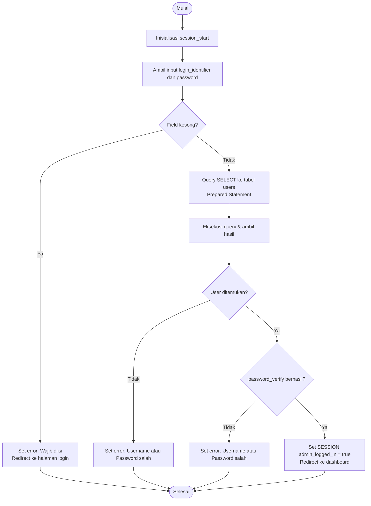
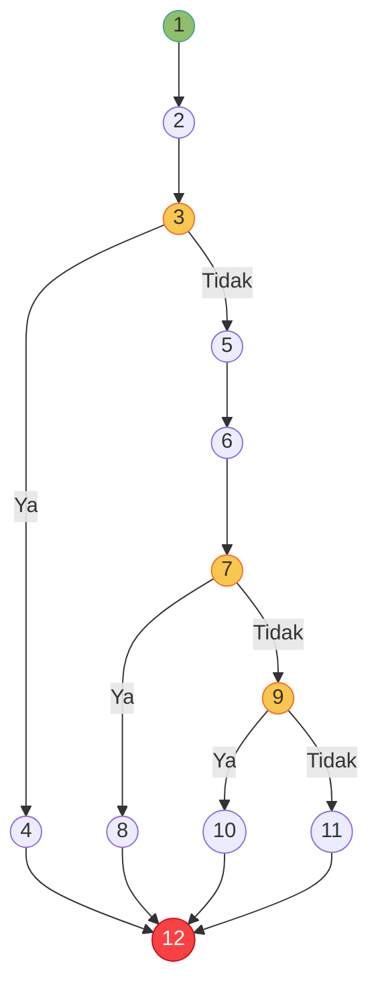
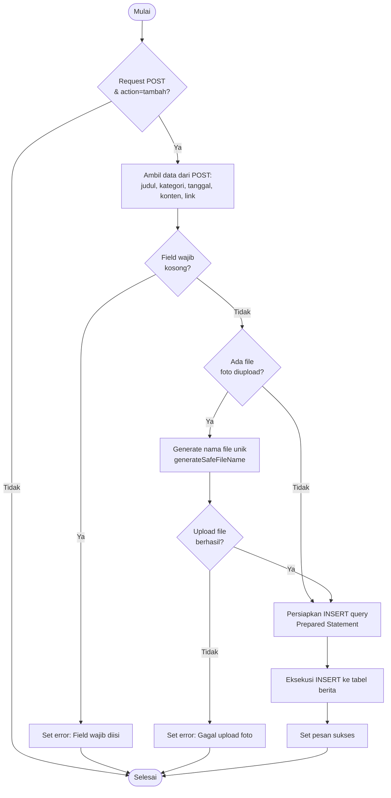
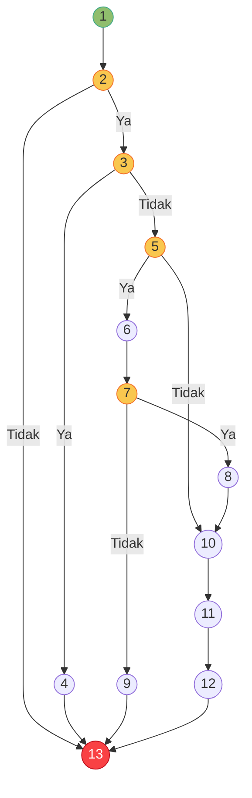
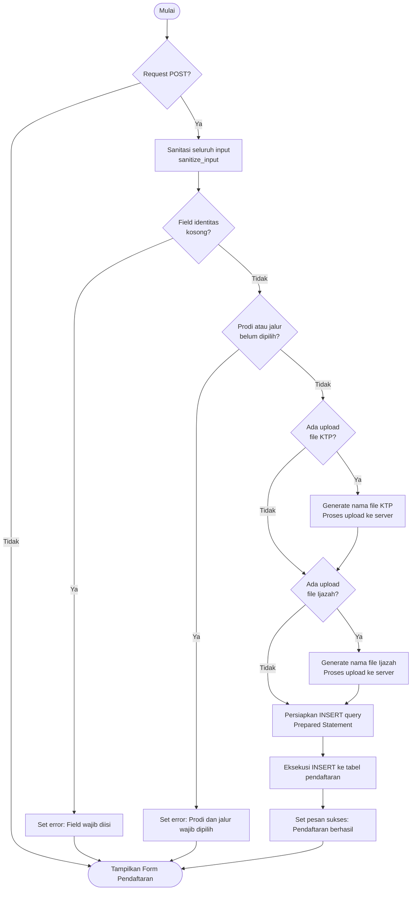
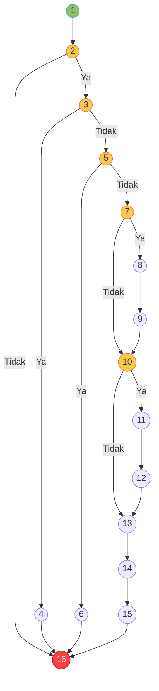

# BAB IV — Pengujian White Box (White Box Testing)

## 4.1 Pengertian White Box Testing

*White Box Testing* (disebut juga *Glass Box Testing* atau *Structural Testing*) adalah metode pengujian perangkat lunak yang berfokus pada pengujian struktur logika internal kode program. Berbeda dengan *Black Box Testing* yang hanya mengamati perilaku sistem dari luar, *White Box Testing* mensyaratkan penguji untuk memahami detail implementasi kode, termasuk alur percabangan (*branching*), perulangan (*looping*), dan kondisi logika (*conditional logic*) yang ada di dalam program.

Tujuan utama *White Box Testing* adalah memastikan bahwa setiap jalur eksekusi (*execution path*) dalam kode program telah teruji dan berfungsi dengan benar, tidak ada jalur logika yang terlewat atau menghasilkan perilaku yang tidak diinginkan.

## 4.2 Metode Cyclomatic Complexity

**Cyclomatic Complexity** (V(G)) adalah metrik pengukuran kompleksitas logika suatu program yang dikembangkan oleh Thomas J. McCabe. Nilai ini merepresentasikan jumlah jalur independen (*independent path*) yang terdapat dalam suatu modul kode.

**Dua rumus perhitungan Cyclomatic Complexity:**

$$V(G) = E - N + 2$$

$$V(G) = P + 1$$

**Keterangan:**
- **E** = Jumlah *edge* (panah/alur) pada *flowgraph*
- **N** = Jumlah *node* (simpul/titik) pada *flowgraph*
- **P** = Jumlah *predicate node* (node yang memiliki percabangan/kondisi `if`, `else if`, `while`, dll.)

**Interpretasi nilai V(G):**

| Nilai V(G) | Interpretasi |
|:----------:|:-------------|
| 1 – 10 | Kompleksitas rendah, kode mudah dipahami dan diuji |
| 11 – 20 | Kompleksitas sedang, perlu perhatian lebih |
| 21 – 50 | Kompleksitas tinggi, risiko defect meningkat |
| > 50 | Kompleksitas sangat tinggi, perlu refactoring |

---

## 4.3 Modul 1: Proses Login Administrator

### 4.3.1 Tabel Pemetaan Statement dan Node

Berikut adalah pemetaan potongan kode PHP dari file `admin/proses_login.php` ke dalam nomor *node*:

| Node | Statement / Kode PHP | Keterangan |
|:----:|:---------------------|:-----------|
| 1 | `session_start();` | Start — Inisialisasi sesi |
| 2 | `$login = trim($_POST['login_identifier']);` | Ambil input username/email |
| 3 | `if (empty($login) \|\| empty($password))` | **Predicate Node** — Cek field kosong |
| 4 | `$_SESSION['error'] = "..."; header("Location: login");` | Field kosong → redirect dengan error |
| 5 | `$stmt = $conn->prepare("SELECT ... WHERE username=? OR email=?");` | Query ke database |
| 6 | `$stmt->execute(); $user = $stmt->get_result()->fetch_assoc();` | Eksekusi query |
| 7 | `if (!$user)` | **Predicate Node** — Cek user ditemukan |
| 8 | `$_SESSION['error'] = "Username atau Password salah";` | User tidak ada → error |
| 9 | `if (password_verify($password, $user['password']))` | **Predicate Node** — Verifikasi password |
| 10 | `$_SESSION['admin_logged_in'] = true; header("Location: dashboard");` | Login berhasil |
| 11 | `$_SESSION['error'] = "Username atau Password salah";` | Password salah → error |
| 12 | `exit;` | End — Selesai |

### 4.3.2 Flowchart Proses Login

***Gambar 4.1** Flowchart Proses Login Administrator*

### 4.3.3 Flowgraph Proses Login

***Gambar 4.2** Flowgraph Proses Login Administrator*

### 4.3.4 Perhitungan Cyclomatic Complexity

Berdasarkan *flowgraph* di atas, diperoleh nilai-nilai berikut:

- **N** (jumlah node) = 12
- **E** (jumlah edge) = 14
- **P** (jumlah predicate node) = 3 (node 3, 7, dan 9)

**Rumus 1:**
$$V(G) = E - N + 2 = 14 - 12 + 2 = \textbf{4}$$

**Rumus 2:**
$$V(G) = P + 1 = 3 + 1 = \textbf{4}$$

**Kesimpulan:** Nilai Cyclomatic Complexity modul Login = **4**, artinya terdapat **4 jalur independen** yang harus diuji.

### 4.3.5 Tabel Independent Path

| Path | Jalur Eksekusi | Deskripsi Skenario |
|:----:|:---------------|:-------------------|
| Path 1 | 1 → 2 → 3 → 4 → 12 | Field login dikosongkan, sistem menolak dan redirect ke halaman login |
| Path 2 | 1 → 2 → 3 → 5 → 6 → 7 → 8 → 12 | Field diisi, namun username/email tidak ditemukan di database |
| Path 3 | 1 → 2 → 3 → 5 → 6 → 7 → 9 → 11 → 12 | Username ditemukan, namun verifikasi password gagal |
| Path 4 | 1 → 2 → 3 → 5 → 6 → 7 → 9 → 10 → 12 | Semua valid, login berhasil dan redirect ke dashboard |

---

## 4.4 Modul 2: Proses Tambah dan Simpan Data Berita

### 4.4.1 Tabel Pemetaan Statement dan Node

Berikut adalah pemetaan potongan kode PHP dari file `admin/kelola_berita.php` pada operasi tambah data:

| Node | Statement / Kode PHP | Keterangan |
|:----:|:---------------------|:-----------|
| 1 | `if ($_SERVER['REQUEST_METHOD'] === 'POST' && isset($_POST['action']))` | **Predicate Node** — Cek request POST |
| 2 | `if ($_POST['action'] === 'tambah')` | **Predicate Node** — Cek action tambah |
| 3 | `if (empty($judul) \|\| empty($kategori) \|\| empty($tanggal))` | **Predicate Node** — Validasi field wajib |
| 4 | `$error = "Field wajib tidak boleh kosong";` | Set pesan error validasi |
| 5 | `if (isset($_FILES['foto']) && $_FILES['foto']['error'] === 0)` | **Predicate Node** — Cek ada file foto |
| 6 | `$namaFile = generateSafeFileName($_FILES['foto']['name']);` | Generate nama file unik |
| 7 | `if (move_uploaded_file(...))` | **Predicate Node** — Cek upload berhasil |
| 8 | `$foto = $namaFile;` | Simpan nama file ke variabel |
| 9 | `$error = "Gagal upload foto";` | Upload gagal |
| 10 | `$stmt = $conn->prepare("INSERT INTO berita ...");` | Persiapkan query INSERT |
| 11 | `$stmt->execute();` | Eksekusi simpan ke database |
| 12 | `$success = "Berita berhasil ditambahkan";` | Set pesan sukses |
| 13 | `exit;` | End — Selesai |

### 4.4.2 Flowchart Proses Tambah Berita

***Gambar 4.3** Flowchart Proses Tambah Data Berita*

### 4.4.3 Flowgraph Proses Tambah Berita

***Gambar 4.4** Flowgraph Proses Tambah Data Berita*

### 4.4.4 Perhitungan Cyclomatic Complexity

- **N** (jumlah node) = 13
- **E** (jumlah edge) = 16
- **P** (jumlah predicate node) = 4 (node 2, 3, 5, dan 7)

**Rumus 1:**
$$V(G) = E - N + 2 = 16 - 13 + 2 = \textbf{5}$$

**Rumus 2:**
$$V(G) = P + 1 = 4 + 1 = \textbf{5}$$

**Kesimpulan:** Nilai Cyclomatic Complexity modul Tambah Berita = **5**, artinya terdapat **5 jalur independen** yang harus diuji.

### 4.4.5 Tabel Independent Path

| Path | Jalur Eksekusi | Deskripsi Skenario |
|:----:|:---------------|:-------------------|
| Path 1 | 1 → 2 → 13 | Request bukan POST atau bukan action tambah, tidak ada proses |
| Path 2 | 1 → 2 → 3 → 4 → 13 | Field wajib (judul/kategori/tanggal) dikosongkan, ditolak dengan pesan error |
| Path 3 | 1 → 2 → 3 → 5 → 10 → 11 → 12 → 13 | Data valid, tidak ada foto diupload, data berita tersimpan |
| Path 4 | 1 → 2 → 3 → 5 → 6 → 7 → 9 → 13 | Data valid, ada foto, namun proses upload gagal |
| Path 5 | 1 → 2 → 3 → 5 → 6 → 7 → 8 → 10 → 11 → 12 → 13 | Data valid, foto berhasil diupload, semua data tersimpan ke database |

---

## 4.5 Modul 3: Proses Validasi dan Simpan Data Pendaftaran

### 4.5.1 Tabel Pemetaan Statement dan Node

Berikut adalah pemetaan potongan kode PHP dari file `pages/pendaftaran.php` pada proses pengiriman formulir pendaftaran mahasiswa baru:

| Node | Statement / Kode PHP | Keterangan |
|:----:|:---------------------|:-----------|
| 1 | `if ($_SERVER['REQUEST_METHOD'] === 'POST')` | **Predicate Node** — Cek request POST |
| 2 | `$nama = sanitize_input($_POST['nama']);` | Sanitasi dan ambil seluruh input |
| 3 | `if (empty($nama) \|\| empty($nik) \|\| empty($email) \|\| empty($hp))` | **Predicate Node** — Validasi field wajib identitas |
| 4 | `$error = "Semua field yang wajib harus diisi";` | Set error field wajib |
| 5 | `if (empty($prodi) \|\| empty($jalur))` | **Predicate Node** — Validasi pilihan prodi dan jalur |
| 6 | `$error = "Program studi dan jalur pendaftaran wajib dipilih";` | Set error prodi/jalur |
| 7 | `if (isset($_FILES['file_ktp']) && $_FILES['file_ktp']['error'] === 0)` | **Predicate Node** — Cek ada upload file KTP |
| 8 | `$namaKtp = generateSafeFileName($_FILES['file_ktp']['name']);` | Generate nama file KTP |
| 9 | `move_uploaded_file(..., UPLOAD_PATH . 'pendaftaran/' . $namaKtp);` | Proses upload file KTP |
| 10 | `if (isset($_FILES['file_ijazah']) && $_FILES['file_ijazah']['error'] === 0)` | **Predicate Node** — Cek ada upload file Ijazah |
| 11 | `$namaIjazah = generateSafeFileName($_FILES['file_ijazah']['name']);` | Generate nama file Ijazah |
| 12 | `move_uploaded_file(..., UPLOAD_PATH . 'pendaftaran/' . $namaIjazah);` | Proses upload file Ijazah |
| 13 | `$stmt = $conn->prepare("INSERT INTO pendaftaran ...");` | Persiapkan query INSERT |
| 14 | `$stmt->execute();` | Eksekusi simpan ke database |
| 15 | `$success = "Pendaftaran berhasil diterima";` | Set pesan sukses |
| 16 | `exit;` | End — Selesai |

### 4.5.2 Flowchart Proses Pendaftaran

***Gambar 4.5** Flowchart Proses Pendaftaran Mahasiswa Baru*

### 4.5.3 Flowgraph Proses Pendaftaran

***Gambar 4.6** Flowgraph Proses Pendaftaran Mahasiswa Baru*

### 4.5.4 Perhitungan Cyclomatic Complexity

- **N** (jumlah node) = 16
- **E** (jumlah edge) = 20
- **P** (jumlah predicate node) = 5 (node 2, 3, 5, 7, dan 10)

**Rumus 1:**
$$V(G) = E - N + 2 = 20 - 16 + 2 = \textbf{6}$$

**Rumus 2:**
$$V(G) = P + 1 = 5 + 1 = \textbf{6}$$

**Kesimpulan:** Nilai Cyclomatic Complexity modul Pendaftaran = **6**, artinya terdapat **6 jalur independen** yang harus diuji.

### 4.5.5 Tabel Independent Path

| Path | Jalur Eksekusi | Deskripsi Skenario |
|:----:|:---------------|:-------------------|
| Path 1 | 1 → 2 → 16 | Halaman diakses tanpa POST, form pendaftaran ditampilkan |
| Path 2 | 1 → 2 → 3 → 4 → 16 | Field identitas wajib (nama/NIK/email/HP) dikosongkan |
| Path 3 | 1 → 2 → 3 → 5 → 6 → 16 | Identitas terisi, namun prodi atau jalur belum dipilih |
| Path 4 | 1 → 2 → 3 → 5 → 7 → 10 → 13 → 14 → 15 → 16 | Semua valid, tidak ada file diupload, data tersimpan |
| Path 5 | 1 → 2 → 3 → 5 → 7 → 8 → 9 → 10 → 13 → 14 → 15 → 16 | Semua valid, hanya KTP diupload, data tersimpan |
| Path 6 | 1 → 2 → 3 → 5 → 7 → 8 → 9 → 10 → 11 → 12 → 13 → 14 → 15 → 16 | Semua valid, KTP dan Ijazah diupload, seluruh data tersimpan |

---

## 4.6 Kesimpulan Pengujian White Box

### 4.6.1 Narasi Kesimpulan Per Modul

**Modul 1 — Proses Login:** Pengujian terhadap modul autentikasi menghasilkan nilai *Cyclomatic Complexity* V(G) = **4**. Seluruh 4 jalur independen berhasil diuji dan menghasilkan keluaran yang sesuai dengan spesifikasi. Mekanisme validasi masukan, kueri basis data menggunakan *Prepared Statement*, dan verifikasi kata sandi dengan algoritma bcrypt telah berjalan dengan benar pada setiap kondisi percabangan.

**Modul 2 — Proses Tambah Berita:** Pengujian terhadap modul pengelolaan berita menghasilkan nilai *Cyclomatic Complexity* V(G) = **5**. Seluruh 5 jalur independen berhasil diuji, mencakup kondisi request tidak valid, validasi field wajib, penanganan unggah foto, dan penyimpanan data ke basis data. Mekanisme pembangkitan nama file unik dan penanganan kegagalan unggah telah terbukti berfungsi dengan benar.

**Modul 3 — Proses Pendaftaran Mahasiswa Baru:** Pengujian terhadap modul pendaftaran menghasilkan nilai *Cyclomatic Complexity* V(G) = **6**. Seluruh 6 jalur independen berhasil diuji, mencakup tampilan form, validasi dua tahap (field wajib dan pilihan prodi/jalur), penanganan unggah dua berkas dokumen secara independen, dan penyimpanan data ke basis data. Fungsi `sanitize_input()` juga terbukti berjalan pada setiap jalur yang melibatkan pemrosesan masukan pengguna.

### 4.6.2 Tabel Kesimpulan Pengujian White Box

| No | Modul yang Diuji | V(G) | Jalur Independen | Jalur Teruji | Status Alur |
|:--:|:-----------------|:----:|:----------------:|:------------:|:-----------:|
| 1 | Proses Login Administrator | 4 | 4 | 4 | **Valid** |
| 2 | Proses Tambah Data Berita | 5 | 5 | 5 | **Valid** |
| 3 | Proses Pendaftaran Mahasiswa Baru | 6 | 6 | 6 | **Valid** |
| | **TOTAL** | **15** | **15** | **15** | **100% Valid** |

### 4.6.3 Kesimpulan Akhir

Berdasarkan hasil pengujian *White Box Testing* yang telah dilaksanakan terhadap tiga modul utama sistem Web FIKOM menggunakan metode *Cyclomatic Complexity*, diperoleh total **15 jalur independen** yang keseluruhannya telah berhasil diuji dan dinyatakan berjalan dengan benar. Nilai *Cyclomatic Complexity* untuk setiap modul berada dalam rentang **4–6**, yang mengindikasikan bahwa kompleksitas logika program tergolong **rendah** dan mudah dipelihara. Seluruh percabangan logika (*branching*), validasi masukan, dan mekanisme penanganan berkas dalam sistem telah terbukti berfungsi sesuai dengan alur yang direncanakan, sehingga sistem dinyatakan **lulus pengujian struktur logika**.

---

*Dokumen Pengujian White Box ini merupakan bagian dari dokumentasi teknis skripsi Website Fakultas Ilmu Komputer Universitas Muhammadiyah Sidenreng Rappang (UNISAN).*
