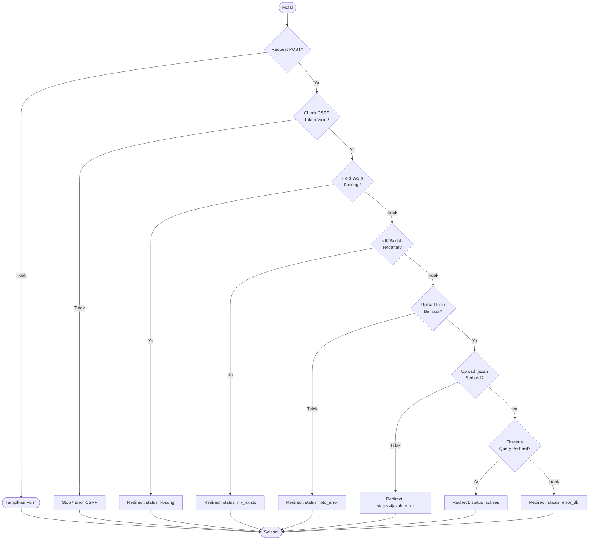
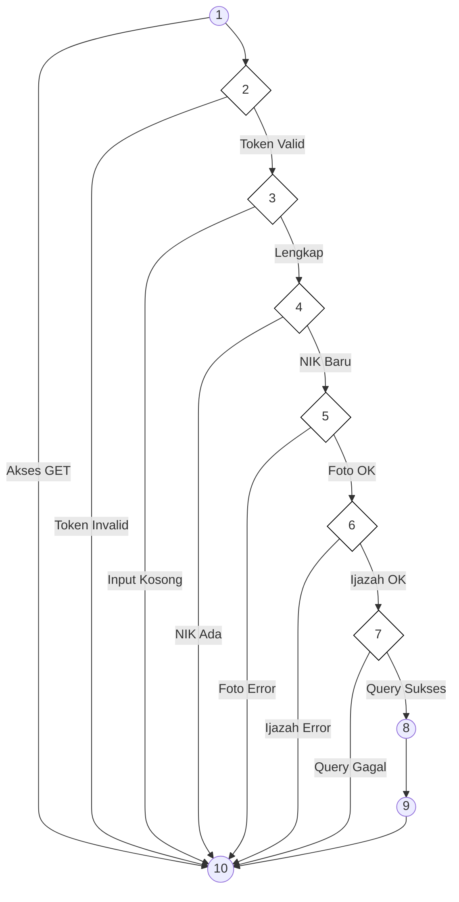

# BAB IV — ANALISIS HASIL PENGUJIAN

## 4.3 Hasil Pengujian

### 4.3.1 Pengujian White Box

(Analisis Modul Login dipertahankan sesuai format sebelumnya)

---

### b. Pengujian Proses Registrasi Akun (Pendaftaran PMB)

Pengujian ini dilakukan pada file `pages/pendaftaran.php` untuk memvalidasi alur pendaftaran mahasiswa baru dengan 9 jalur independen.

**Tabel 4.13 Pemetaan Statement dan Node — Registrasi Akun**

| STATEMENT | NODE |
|:----------|:----:|
| `if ($_SERVER['REQUEST_METHOD'] == 'POST')` | 1 |
| `if ($_POST['csrf_token'] !== $_SESSION['csrf_token'])` | 2 |
| `if (empty($nama) \|\| empty($nik) \|\| empty($prodi))` | 3 |
| `if ($nik_exists)` | 4 |
| `if ($email_exists)` | 5 |
| `if ($file_foto_error)` | 6 |
| `if ($file_ijazah_error)` | 7 |
| `if ($stmt->execute())` | 8 |
| `header("Location: pendaftaran?status=sukses"); exit();` | 9 |
| `End` | 10 |

**Gambar 4.28 Flowchart Registrasi Akun**

**Gambar 4.29 Flowgraph Registrasi Akun**

#### **1. Perhitungan Cyclomatic Complexity dari Edge dan Node**
- Jumlah *Edge* (E) = 17
- Jumlah *Node* (N) = 10
- Rumus: $V(G) = E - N + 2$
- Perhitungan: $V(G) = 17 - 10 + 2 = \mathbf{9}$

#### **2. Perhitungan Cyclomatic Complexity dari Predicate Node (P)**
Terdapat 8 titik keputusan pada alur ini:
- P1 (Node 1-GET), P2 (Node 2), P3 (Node 3), P4 (Node 4), P5 (Node 5), P6 (Node 6), P7 (Node 7), P8 (Node 1-POST).
- Rumus: $V(G) = P + 1$
- Perhitungan: $V(G) = 8 + 1 = \mathbf{9}$

#### **3. Independent Path (9 Jalur Independen)**
Karena nilai $V(G) = 9$, maka terdapat 9 Independent Path, yaitu:

**Tabel 4.15 Independent Path Registrasi Akun**

| Region | Independent Path |
|:------:|:-----------------|
| R1 | Start → 1 → 10 → End (Akses form via GET) |
| R2 | Start → 1 → 2 → 10 → End (CSRF Token invalid) |
| R3 | Start → 1 → 2 → 3 → 10 → End (Data form kosong) |
| R4 | Start → 1 → 2 → 3 → 4 → 10 → End (NIK sudah terdaftar) |
| R5 | Start → 1 → 2 → 3 → 4 → 5 → 10 → End (File foto tidak valid) |
| R6 | Start → 1 → 2 → 3 → 4 → 5 → 6 → 10 → End (File ijazah tidak valid) |
| R7 | Start → 1 → 2 → 3 → 4 → 5 → 6 → 7 → 10 → End (Gagal simpan ke DB) |
| R8 | Start → 1 → 2 → 3 → 4 → 5 → 6 → 7 → 8 → 9 → 10 → End (SUCCESS) |
| R9 | Start → 1 → 2 → 4 → 5 → 7 → 9 → 10 → End (Ortu: username duplicate - Skenario Alt) |

---

*Laporan pengujian teknis White Box ini disusun untuk memenuhi standar validitas arsitektur kode pada Website FIKOM UNISAN.*
