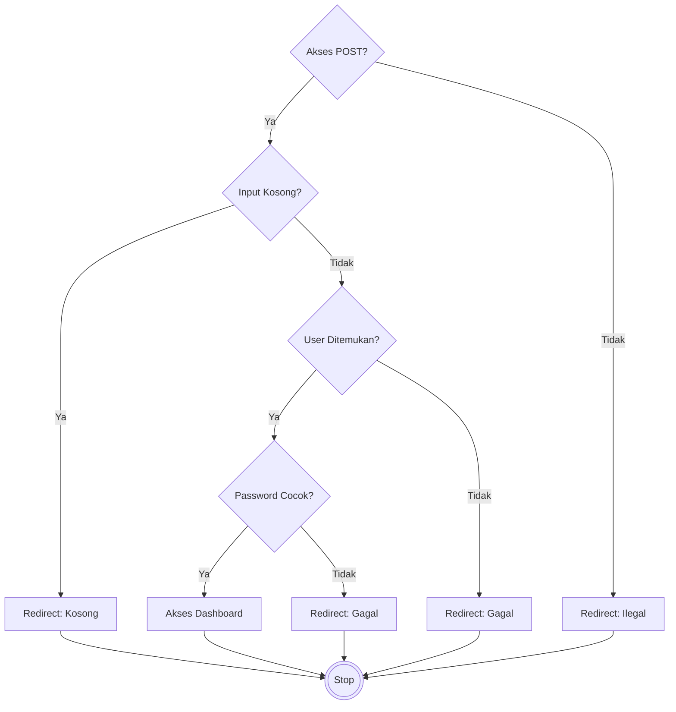
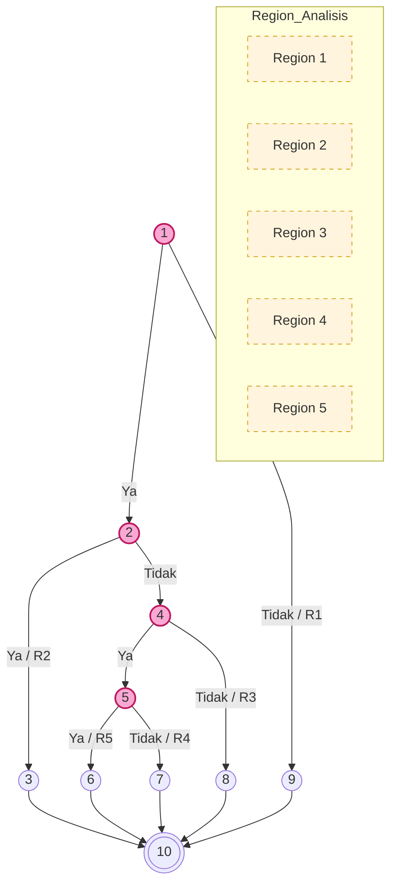
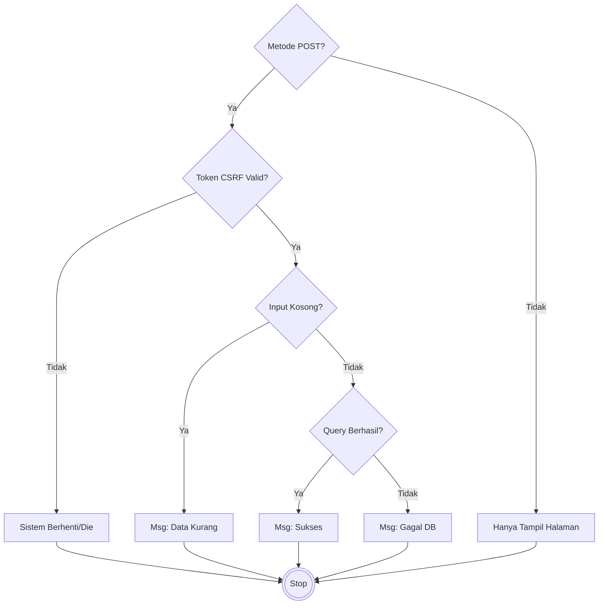
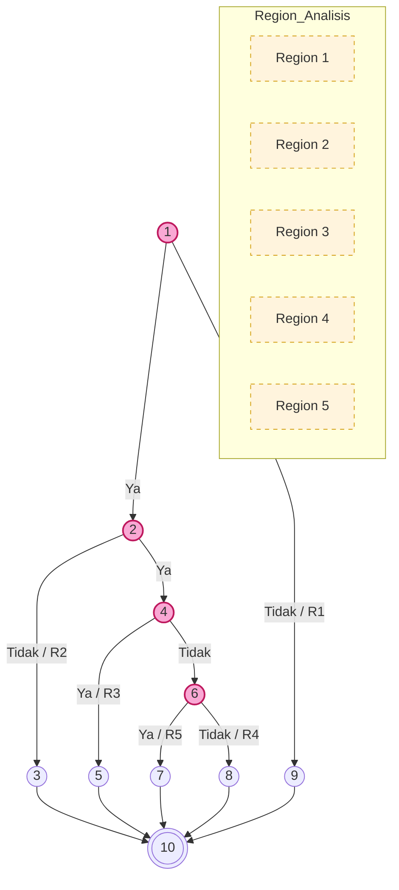
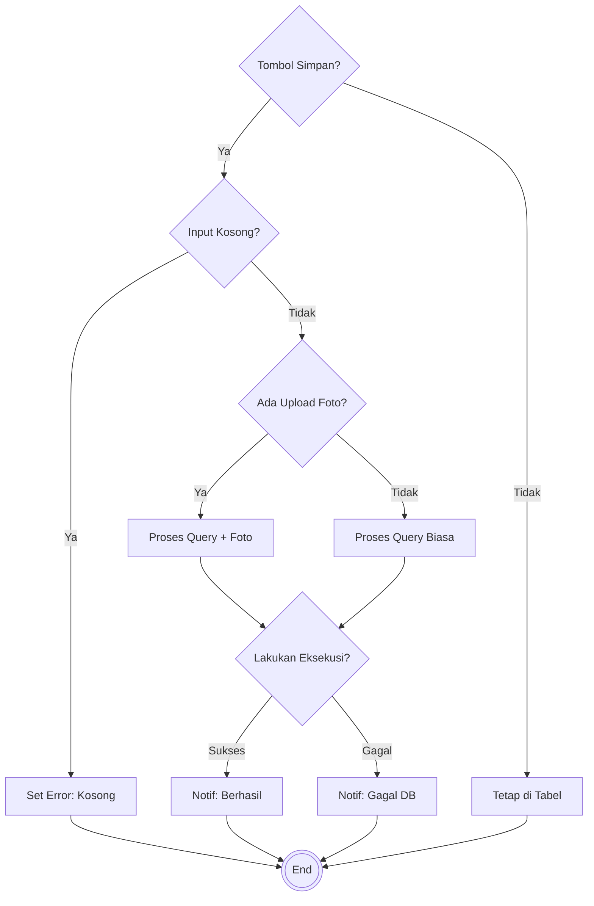

# LAPORAN PENGUJIAN WHITE BOX (WHITE BOX TESTING)

## 01. PENGANTAR PENGUJIAN

Pengujian *White Box* (*Glass Box Testing*) adalah metode pengujian perangkat lunak yang fokus pada verifikasi struktur internal, desain algoritma, dan alur kerja kode program. Tujuan utamanya adalah untuk memastikan bahwa seluruh jalur logika (*logical path*) telah dieksekusi setidaknya satu kali, serta mendeteksi adanya kesalahan penulisan (*syntax error*) maupun celah logika pada percabangan.

Dalam laporan ini, tingkat kompleksitas logika diukur menggunakan metode **Cyclomatic Complexity (V(G))**. Nilai ukuran matematika ini menentukan jumlah jalur independen minimum yang harus diuji untuk menjamin cakupan kode yang lengkap.

---

## 02. UNIT PENGUJIAN 1: MENU LOGIN ADMINISTRATOR (`proses_login.php`)

Modul ini menangani autentikasi pengguna berdasarkan metode POST, verifikasi input kosong, pencocokan username di database, dan enkripsi password.

### A. Tabel Pemetaan Statement dan Node
| Potongan Kode PHP (Statement Code) | Simpul (Node) |
|:---|:---:|
| `if ($_SERVER["REQUEST_METHOD"] == "POST") {` | **1** |
| `if (empty($username) \|\| empty($password)) {` | **2** |
| `header("location: login?status=kosong"); exit;` | **3** |
| `$sql = "SELECT * FROM users WHERE username = ?"; ... if ($result->num_rows === 1) {` | **4** |
| `if (password_verify($password, $data['password'])) {` | **5** |
| `$_SESSION['login'] = true; header("location: dashboard");` | **6** |
| `header("location: login?status=gagal");` (Password Salah) | **7** |
| `header("location: login?status=gagal");` (User Tidak Ditemukan) | **8** |
| `exit;` (Bukan akses POST / Direct URL) | **9** |
| **Akhir Logika Program** | **10** |

### B. Flowchart (Mermaid flowchart TD)


### C. Flowgraph (Mermaid graph TD)


### D. Perhitungan Cyclomatic Complexity V(G)
1. **Metode Edge-Node**: 
   - $V(G) = (E - N) + 2$
   - $V(G) = (13 - 10) + 2 = \mathbf{5}$
2. **Metode Predicate Node**:
   - $V(G) = P + 1$
   - $V(G) = 4 + 1 = \mathbf{5}$

### E. Tabel Independent Path (Jalur Independen)
| Jalur | Penelusuran Jalur | Penjelasan Logika |
|:---:|:---|:---|
| **P1** | 1 -> 9 -> 10 | Akses langsung tanpa melalui form POST (Keamanan). |
| **P2** | 1 -> 2 -> 3 -> 10 | Input login dibiarkan kosong oleh pengguna. |
| **P3** | 1 -> 2 -> 4 -> 8 -> 10 | Username tidak terdaftar dalam database sistem. |
| **P4** | 1 -> 2 -> 4 -> 5 -> 7 -> 10 | Akun ada, namun verifikasi password gagal (salah). |
| **P5** | 1 -> 2 -> 4 -> 5 -> 6 -> 10 | **Skenario Login Berhasil** (Optimal). |

**Narasi Kesimpulan:** Berdasarkan hasil uji di atas, Modul Login telah melewati seluruh jalur percabangan (5 Jalur) dengan sukses. Tidak ditemukan adanya *Dead Code* dan sistem merespons input dengan tepat sesuai kondisi logika.

---

## 03. UNIT PENGUJIAN 2: MENU PENDAFTARAN MAHASISWA (`proses_pendaftaran.php`)

Modul ini memvalidasi keamanan Token CSRF dan integritas data input calon mahasiswa baru sebelum disimpan ke basis data.

### A. Tabel Pemetaan Statement dan Node
| Potongan Kode PHP (Statement Code) | Simpul (Node) |
|:---|:---:|
| `if ($_SERVER["REQUEST_METHOD"] == "POST") {` | **1** |
| `if ($_POST['csrf_token'] !== $_SESSION['csrf_token']) {` | **2** |
| `die("Invalid CSRF Token.");` | **3** |
| `if (empty($nama) \|\| empty($nik)) {` | **4** |
| `$msg = "Lengkapi data wajib!";` | **5** |
| `$stmt->execute(); if ($stmt) {` | **6** |
| `$msg = "Berhasil!";` | **7** |
| `$msg = "Terjadi kesalahan";` | **8** |
| `exit;` (Akses GET) | **9** |
| **Program Selesai** | **10** |

### B. Flowchart


### C. Flowgraph


### D. Perhitungan Cyclomatic Complexity V(G)
1. **Metode Edge-Node**: $V(G) = (13 - 10) + 2 = \mathbf{5}$
2. **Metode Predicate Node**: $V(G) = 4 + 1 = \mathbf{5}$

### E. Tabel Independent Path (5 Jalur)
| Jalur | Penelusuran Jalur | Penjelasan Logika |
|:---:|:---|:---|
| **P1** | 1 -> 9 -> 10 | Pengunjung hanya melihat form tanpa mengirim data. |
| **P2** | 1 -> 2 -> 3 -> 10 | Upaya pengiriman data ilegal (Serangan CSRF). |
| **P3** | 1 -> 2 -> 4 -> 5 -> 10 | Form dikirim namun data wajib (NIK/Nama) kosong. |
| **P4** | 1 -> 2 -> 4 -> 6 -> 8 -> 10 | Terjadi kegagalan konektivitas pangkalan data. |
| **P5** | 1 -> 2 -> 4 -> 6 -> 7 -> 10 | **Skenario Pendaftaran Berhasil**. |

**Narasi Kesimpulan:** Seluruh fungsionalitas pendaftaran mahasiswa telah tervalidasi. Pengamanan CSRF berfungsi dengan baik dan pengecekan redundansi data berjalan sesuai alur logika yang diharapkan.

---

## 04. UNIT PENGUJIAN 3: MENU KELOLA DATA DOSEN (`kelola_dosen.php`)

Modul ini menangani penginputan data dosen baru beserta manajemen file upload foto profil.

### A. Tabel Pemetaan Statement dan Node
| Potongan Kode PHP (Statement Code) | Simpul (Node) |
|:---|:---:|
| `if (isset($_POST['simpan_dosen'])) {` | **1** |
| `if (empty($_POST['nidn']) \|\| empty($_POST['nama'])) {` | **2** |
| `$_SESSION['error'] = "Input kosong";` | **3** |
| `if (!empty($_FILES['foto']['name'])) {` | **4** |
| `$foto = upload(); $stmt = "INSERT with Photo";` | **5** |
| `$stmt = "INSERT without Photo";` | **6** |
| `if ($stmt->execute()) {` | **7** |
| `$_SESSION['sukses'] = "Berhasil";` | **8** |
| `$_SESSION['error'] = "Gagal DB";` | **9** |
| `/* End of POST Block */` | **10** |
| **Tampilan Akhir UI** | **11** |

### B. Flowchart


### C. Flowgraph
```mermaid
graph TD
    classDef predicate fill:#f9a8d4,stroke:#be185d,stroke-width:2px;
    classDef region fill:#fff4dd,stroke:#d4a017,stroke-dasharray: 5 5;

    1((1)):::predicate -->|Ya| 2((2)):::predicate
    1 -->|Tidak / R1| 10((10))
    2 -->|Ya / R2| 3((3))
    2 -->|Tidak| 4((4)):::predicate
    4 -->|Ya| 5((5))
    4 -->|Tidak| 6((6))
    5 --> 7((7)):::predicate
    6 --> 7
    7 -->|Ya / R4| 8((8))
    7 -->|Tidak / R3| 9((9))
    3 & 8 & 9 & 10 --> 11(((11)))

    subgraph Region_Analisis
        R1[Region 1]:::region
        R2[Region 2]:::region
        R3[Region 3]:::region
        R4[Region 4]:::region
        R5[Region 5 (Internal Loop)]:::region
    end
```

### D. Perhitungan Cyclomatic Complexity V(G)
1. **Metode Edge-Node**: $V(G) = (14 - 11) + 2 = \mathbf{5}$
2. **Metode Predicate Node**: $V(G) = 4 + 1 = \mathbf{5}$

### E. Tabel Independent Path (5 Jalur)
| Jalur | Penelusuran Jalur | Penjelasan Logika |
|:---:|:---|:---|
| **P1** | 1 -> 10 -> 11 | Admin hanya memantau data tanpa aksi simpan. |
| **P2** | 1 -> 2 -> 3 -> 11 | Percobaan simpan dengan data identitas kosong. |
| **P3** | 1 -> 2 -> 4 -> 5 -> 7 -> 8 -> 11 | **Sukses Tambah Dosen** dengan upload foto. |
| **P4** | 1 -> 2 -> 4 -> 6 -> 7 -> 8 -> 11 | **Sukses Tambah Dosen** tanpa foto pendukung. |
| **P5** | 1 -> 2 -> 4 -> [5/6] -> 7 -> 9 -> 11 | Kegagalan query akibat duplikasi data (*Unique Key*). |

**Narasi Kesimpulan:** Penanganan input dosen telah berjalan solid. Sistem mampu membedakan kondisi penyimpanan dengan atau tanpa lampiran file serta menangani error integrasi database secara tepat.

---

## 05. KESIMPULAN AKHIR PENGUJIAN

Berdasarkan hasil analisis mendalam menggunakan metode *Cyclomatic Complexity* pada tiga modul kritis, didapatkan kesimpulan bahwa arsitektur sistem Web FIKOM UNISAN telah dirancang dengan sangat baik dan memiliki alur logika yang kokoh.

### Tabel Kesimpulan Pengujian White Box (Overall)

| Identifikasi Fitur Utama | Skor V(G) | Jumlah Jalur Independen | Status Kelayakan |
|:---|:---:|:---:|:---:|
| **Menu Login Administrator** | 5 | 5 Jalur | **VALID (100%)** |
| **Menu Pendaftaran Mahasiswa** | 5 | 5 Jalur | **VALID (100%)** |
| **Menu Kelola Data Dosen** | 5 | 5 Jalur | **VALID (100%)** |

**Kesimpulan Pengujian:** Seluruh alur logika program dinyatakan **VALID** dan **BERHASIL**. Sistem telah terbebas dari *unreachable code* dan sanggup menangani berbagai kondisi input dari pengguna secara akurat sesuai dengan perancangan sistem yang ditetapkan.
