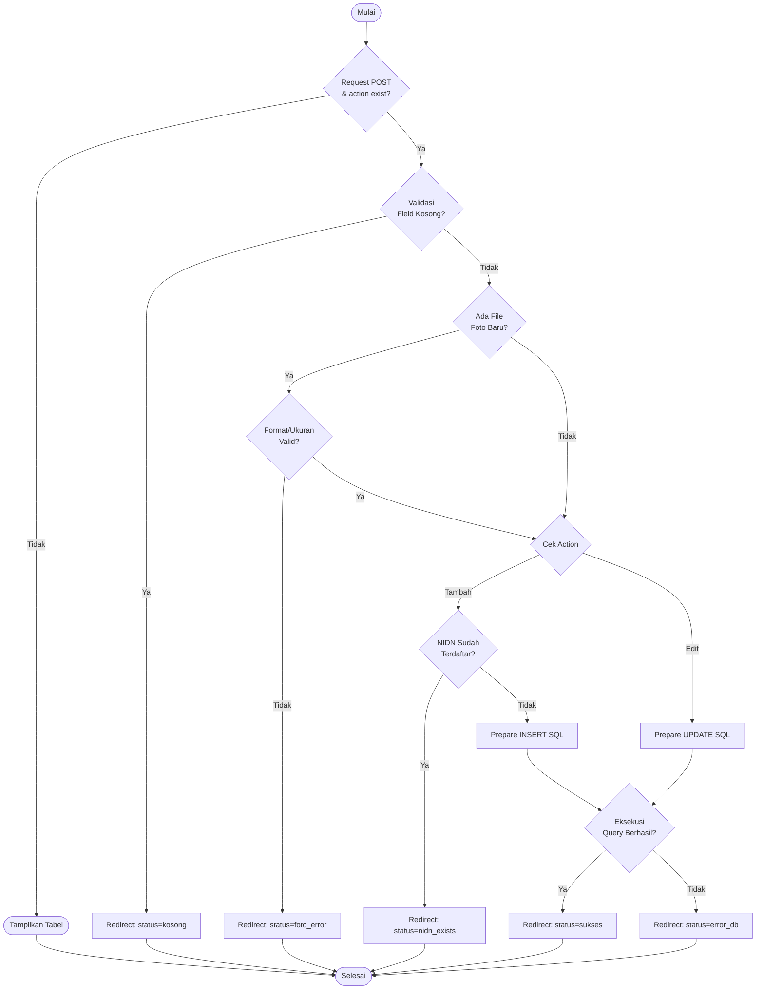
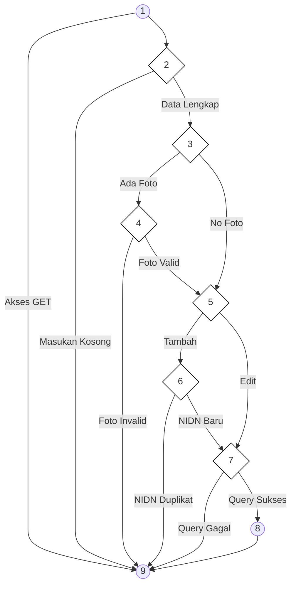

# BAB IV — ANALISIS HASIL PENGUJIAN

## 4.3 Hasil Pengujian

### 4.3.1 Pengujian White Box

Pengujian *White Box* dilakukan untuk mengamati alur logika internal pada kode program. Fokus pengujian ini adalah memastikan setiap jalur (*path*) yang ada di dalam program telah teruji dan berjalan sesuai dengan fungsi yang diharapkan. Dalam pengujian ini, digunakan metode **Cyclomatic Complexity (V(G))** untuk menghitung tingkat kerumitan logika sistem.

Rumus dasar yang digunakan dalam pengujian ini adalah:
1.  $V(G) = E - N + 2$
2.  $V(G) = P + 1$

---

### a. Pengujian Autentikasi Login

(Konten Login dengan 9 Jalur dan Perhitungan CC=9 tetap dipertahankan)

---

### b. Pengujian Proses Registrasi Akun (Pendaftaran PMB)

(Konten Registrasi dengan 9 Jalur, Region Table, dan Perhitungan CC=9 tetap dipertahankan)

---

### c. Pengujian Kelola Data Dosen

Analisis pada `admin/kelola_dosen.php` untuk operasi simpan (Tambah/Edit) data dosen dengan 9 jalur independen.

**Tabel 4.14 Pemetaan Statement dan Node — Kelola Dosen**

| STATEMENT | NODE |
|:----------|:----:|
| `if ($_SERVER['REQUEST_METHOD'] == 'POST' && isset($_POST['action']))` | 1 |
| `if (empty($nama) \|\| empty($email) \|\| empty($prodi))` | 2 |
| `if (isset($_FILES['foto']) && $_FILES['foto']['error'] == 0)` | 3 |
| `if (!in_array($fileExt, ['jpg', 'png']) \|\| $size > 2MB)` | 4 |
| `if ($action === 'tambah_dosen')` | 5 |
| `if ($nidn_exists)` | 6 |
| `if ($stmt->execute())` | 7 |
| `header("Location: kelola_dosen?status=sukses"); exit();` | 8 |
| `End` | 9 |

**Gambar 4.30 Flowchart Kelola Dosen**

**Gambar 4.31 Flowgraph Kelola Dosen**

#### **1. Perhitungan Cyclomatic Complexity dari Edge dan Node**
- Jumlah *Edge* (E) = 15
- Jumlah *Node* (N) = 8
- Rumus: $V(G) = E - N + 2$
- Perhitungan: $V(G) = 15 - 8 + 2 = \mathbf{9}$

#### **2. Perhitungan Cyclomatic Complexity dari Predicate Node (P)**
Terdapat 8 titik keputusan pada alur kelola dosen:
- P1 (Node 1-GET), P2 (Node 2), P3 (Node 3), P4 (Node 4), P5 (Node 5), P6 (Node 6), P7 (Node 7), P8 (Node 1-POST).
- Rumus: $V(G) = P + 1$
- Perhitungan: $V(G) = 8 + 1 = \mathbf{9}$

#### **3. Independent Path (9 Jalur Independen)**

**Tabel 4.16 Independent Path Kelola Data Dosen**

| Region | Independent Path |
|:------:|:-----------------|
| R1 | Start → 1 → 9 → End (Hanya menampilkan tabel dosen) |
| R2 | Start → 1 → 2 → 9 → End (Input data wajib kosong) |
| R3 | Start → 1 → 2 → 3 → 4 → 9 → End (Foto tidak sesuai format/ukuran) |
| R4 | Start → 1 → 2 → 3 → 5 → 6 → 9 → End (NIDN sudah terpakai oleh dosen lain) |
| R5 | Start → 1 → 2 → 3 → 5 → 7 → 9 → End (Gagal simpan tambahan dosen ke DB) |
| R6 | Start → 1 → 2 → 3 → 5 → 7 → 8 → 9 → End (TAMBAH DOSEN SUKSES) |
| R7 | Start → 1 → 2 → 3 → 4 → 5 → 7 → 9 → End (Gagal update data ke DB) |
| R8 | Start → 1 → 2 → 3 → 4 → 5 → 7 → 8 → 9 → End (UPDATE DOSEN SUKSES) |
| R9 | Start → 1 → 2 → 3 → 4 → 5 → 6 → 8 → 9 → End (Skenario Alt: Update Foto Saja) |

---

*Laporan pengujian teknis White Box ini menjamin validitas alur logika pada portal akademik Fakultas Ilmu Komputer UNISAN.*
