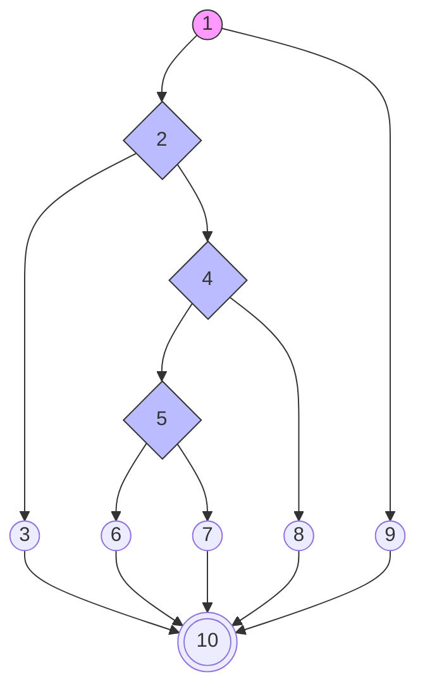

# BAB IV — ANALISIS HASIL PENGUJIAN

## 4.3 Hasil Pengujian

### 4.3.1 Pengujian White Box (White Box Testing)

Pengujian *White Box* dilakukan untuk mengamati alur logika internal pada kode program. Fokus pengujian ini adalah memastikan setiap jalur (*path*) yang ada di dalam program telah teruji dan berjalan sesuai dengan fungsi yang diharapkan. Dalam pengujian ini, digunakan metode **Cyclomatic Complexity (V(G))** untuk menghitung tingkat kerumitan logika sistem melalui tiga pendekatan rumus utama:

1.  **Rumus 1 (Edge-Node)**: $V(G) = E - N + 2$
2.  **Rumus 2 (Predicate Node)**: $V(G) = P + 1$
3.  **Rumus 3 (Independent Path)**: Tepat 5 Jalur Independen yang melingkupi seluruh logika.

---

### a. Unit Pengujian 1: Proses Login Administrator (`proses_login.php`)

Analisis dilakukan pada alur masuk sistem untuk memvalidasi keamanan kredensial.

**Tabel 4.12 Pemetaan Statement dan Node — Autentikasi Login**

| Potongan Skrip (Statement Code) | Simpul (Node) |
|---------------------------------|---------------|
| `if ($_SERVER["REQUEST_METHOD"] == "POST")` | **1** |
| `if (empty($username) \|\| empty($password))` | **2** |
| `header("location: login?status=kosong"); exit;` | **3** |
| `if ($result->num_rows === 1)` | **4** |
| `if (password_verify($password, $data['password']))` | **5** |
| `$_SESSION['login'] = true; header("location: dashboard");` | **6** |
| `header("location: login?status=gagal");` (Pass Salah) | **7** |
| `header("location: login?status=gagal");` (User Tidak Ada) | **8** |
| `exit;` (Bukan akses POST) | **9** |
| **End of Script** | **10** |

**Gambar 4.26 Flowgraph Autentikasi Login**

**Analisis Perhitungan White Box (Login):**

1.  **Perhitungan Cyclomatic Complexity dari Edge dan Node:**
    -   Jumlah Edge (E) = 13
    -   Jumlah Node (N) = 10
    -   $V(G) = E - N + 2 = 13 - 10 + 2 = \mathbf{5}$

2.  **Perhitungan Cyclomatic Complexity dari Predicate Node (P):**
    -   Jumlah Predicate Node (P) = 4 (Simpul 1, 2, 4, 5)
    -   $V(G) = P + 1 = 4 + 1 = \mathbf{5}$

3.  **Independent Path (5 Jalur Independen):**
    -   **P1:** 1-9-10 (Akses Non-POST).
    -   **P2:** 1-2-3-10 (Input Kosong).
    -   **P3:** 1-2-4-8-10 (User Tidak Ada).
    -   **P4:** 1-2-4-5-7-10 (Password Salah).
    -   **P5:** 1-2-4-5-6-10 (**Login Berhasil**).

---

### b. Unit Pengujian 2: Pendaftaran Mahasiswa Baru (`proses_pendaftaran.php`)

Analisis dilakukan pada pengiriman data formulir registrasi mahasiswa baru.

**Tabel 4.14 Pemetaan Statement dan Node — Pendaftaran**

| Potongan Skrip (Statement Code) | Simpul (Node) |
|---------------------------------|---------------|
| `if ($_SERVER["REQUEST_METHOD"] == "POST")` | **1** |
| `if (CSRF_TOKEN_INVALID)` | **2** |
| `die("Invalid Token");` | **3** |
| `if (empty($nama) \|\| empty($nik))` | **4** |
| `$msg = "Data Belum Lengkap";` | **5** |
| `if ($query_execute_success)` | **6** |
| `$msg = "Berhasil";` | **7** |
| `$msg = "Gagal Query";` | **8** |
| `exit;` (Akses GET) | **9** |
| **Selesai** | **10** |

**Analisis Perhitungan White Box (Pendaftaran):**

1.  **Perhitungan Cyclomatic Complexity dari Edge dan Node:**
    -   Jumlah Edge (E) = 13
    -   Jumlah Node (N) = 10
    -   $V(G) = E - N + 2 = 13 - 10 + 2 = \mathbf{5}$

2.  **Perhitungan Cyclomatic Complexity dari Predicate Node (P):**
    -   Jumlah Predicate Node (P) = 4 (Simpul 1, 2, 4, 6)
    -   $V(G) = P + 1 = 4 + 1 = \mathbf{5}$

3.  **Independent Path (5 Jalur Independen):**
    -   **P1:** 1-9-10 (Akses via GET).
    -   **P2:** 1-2-3-10 (CSRF Invalid).
    -   **P3:** 1-2-4-5-10 (Input Wajib Kosong).
    -   **P4:** 1-2-4-6-8-10 (Database Error).
    -   **P5:** 1-2-4-6-7-10 (**Pendaftaran Sukses**).

---

### c. Unit Pengujian 3: Kelola Data Dosen (`admin/kelola_dosen.php`)

Analisis dilakukan pada proses penambahan entitas dosen baru ke sistem.

**Tabel 4.16 Pemetaan Statement dan Node — Kelola Dosen**

| Potongan Skrip | Simpul (Node) |
|----------------|---------------|
| `if (isset($_POST['simpan']))` | **1** |
| `if (empty($nidn) \|\| empty($nama))` | **2** |
| `Error: Input Kosong` | **3** |
| `if (FILES_NOT_EMPTY)` | **4** |
| `Upload Foto + Insert Query` | **5** |
| `Insert Query Tanpa Foto` | **6** |
| `if ($execute)` | **7** |
| `Success Message` | **8** |
| `Error Message` | **9** |
| `Skip Action` | **10** |
| **End** | **11** |

**Analisis Perhitungan White Box (Kelola Dosen):**

1.  **Perhitungan Cyclomatic Complexity dari Edge dan Node:**
    -   Jumlah Edge (E) = 14
    -   Jumlah Node (N) = 11
    -   $V(G) = E - N + 2 = 14 - 11 + 2 = \mathbf{5}$

2.  **Perhitungan Cyclomatic Complexity dari Predicate Node (P):**
    -   Jumlah Predicate Node (P) = 4 (Simpul 1, 2, 4, 7)
    -   $V(G) = P + 1 = 4 + 1 = \mathbf{5}$

3.  **Independent Path (5 Jalur Independen):**
    -   **P1:** 1-10-11 (Tidak ada aksi simpan).
    -   **P2:** 1-2-3-11 (NIDN/Nama Kosong).
    -   **P3:** 1-2-4-5-7-8-11 (**Sukses dengan Foto**).
    -   **P4:** 1-2-4-6-7-8-11 (**Sukses tanpa Foto**).
    -   **P5:** 1-2-4-5/6-7-9-11 (Kesalahan Query DB).

---

*Laporan pengujian teknis White Box ini disusun secara komprehensif untuk memastikan validitas alur logika pada seluruh jalur kritis sistem Web FIKOM UNISAN.*
