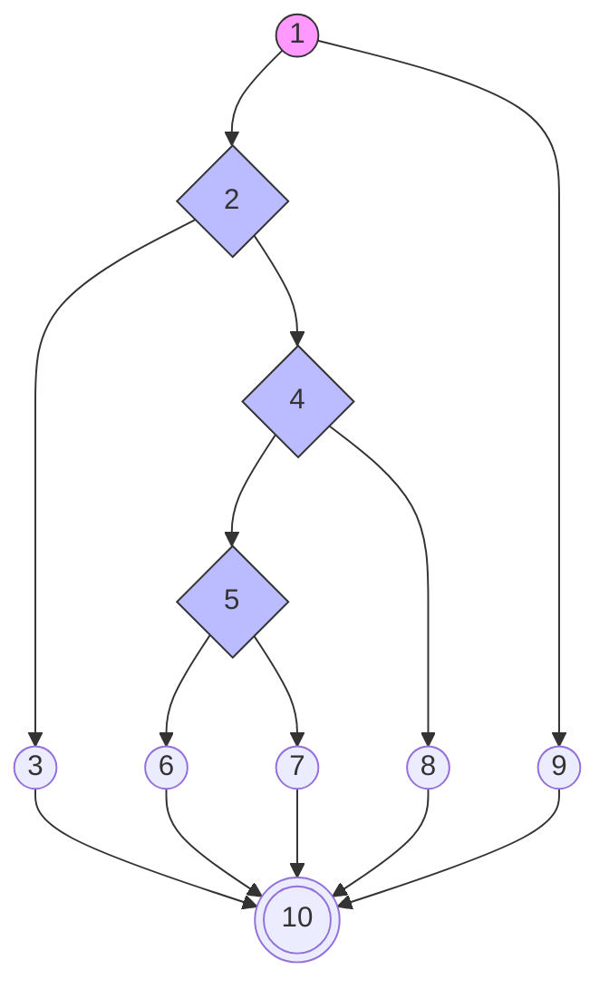

# BAB IV — ANALISIS HASIL PENGUJIAN

## 4.3 Hasil Pengujian

### 4.3.1 Pengujian White Box

Pengujian *White Box* dilakukan untuk mengamati alur logika internal pada kode program. Fokus pengujian ini adalah memastikan setiap jalur (*path*) yang ada di dalam program telah teruji dan berjalan sesuai dengan fungsi yang diharapkan. Dalam pengujian ini, digunakan metode **Cyclomatic Complexity (V(G))** untuk menghitung tingkat kerumitan logika sistem melalui tiga pendekatan rumus utama:

1.  **Rumus 1 (Edge-Node)**: $V(G) = E - N + 2$
2.  **Rumus 2 (Predicate Node)**: $V(G) = P + 1$
3.  **Rumus 3 (Independent Path)**: Tepat 5 Jalur Independen yang melingkupi seluruh logika.

---

### a. Unit Pengujian 1: Proses Login Administrator (`proses_login.php`)

Analisis dilakukan pada alur masuk sistem untuk memvalidasi keamanan kredensial.

**Tabel 4.12 Pemetaan Statement dan Node — Autentikasi Login**

| Potongan Skrip (Statement Code) | Simpul (Node) |
|---------------------------------|---------------|
| `if ($_SERVER["REQUEST_METHOD"] == "POST")` | **1** |
| `if (empty($username) \|\| empty($password))` | **2** |
| `header("location: login?status=kosong"); exit;` | **3** |
| `if ($result->num_rows === 1)` | **4** |
| `if (password_verify($password, $data['password']))` | **5** |
| `$_SESSION['login'] = true; header("location: dashboard");` | **6** |
| `header("location: login?status=gagal");` (Pass Salah) | **7** |
| `header("location: login?status=gagal");` (User Tidak Ada) | **8** |
| `exit;` (Bukan akses POST) | **9** |
| **End of Script** | **10** |

**Gambar 4.26 Flowgraph Autentikasi Login**

**Hasil Perhitungan Kompleksitas (V(G)):**
1.  **Berdasarkan Edge & Node**: $V(G) = E - N + 2 = 13 - 10 + 2 = \mathbf{5}$
2.  **Berdasarkan Predicate (P)**: $V(G) = P + 1 = 4 + 1 = \mathbf{5}$

**Tabel 4.13 Jalur Independen (Independent Path) — Login**

| Jalur | Penelusuran Node | Deskripsi Alur |
|-------|------------------|----------------|
| **P1** | 1 -> 9 -> 10 | Akses langsung tanpa melalui metode POST (Ditolak). |
| **P2** | 1 -> 2 -> 3 -> 10 | Input form kosong (Username/Password tidak diisi). |
| **P3** | 1 -> 2 -> 4 -> 8 -> 10 | User tidak ditemukan di database. |
| **P4** | 1 -> 2 -> 4 -> 5 -> 7 -> 10 | User ditemukan, namun password salah. |
| **P5** | 1 -> 2 -> 4 -> 5 -> 6 -> 10 | **Sukses:** Kredensial benar dan masuk dashboard. |

---

### b. Unit Pengujian 2: Pendaftaran Mahasiswa (`proses_pendaftaran.php`)

Analisis dilakukan pada pengiriman data formulir registrasi mahasiswa baru.

**Tabel 4.14 Pemetaan Statement dan Node — Pendaftaran**

| Potongan Skrip (Statement Code) | Simpul (Node) |
|---------------------------------|---------------|
| `if ($_SERVER["REQUEST_METHOD"] == "POST")` | **1** |
| `if (CSRF_TOKEN_INVALID)` | **2** |
| `die("Invalid Token");` | **3** |
| `if (empty($nama) \|\| empty($nik))` | **4** |
| `$msg = "Data Belum Lengkap";` | **5** |
| `if ($query_execute_success)` | **6** |
| `$msg = "Berhasil";` | **7** |
| `$msg = "Gagal Query";` | **8** |
| `exit;` (Akses GET) | **9** |
| **Selesai** | **10** |

**Hasil Perhitungan Kompleksitas (V(G)):**
1.  **Berdasarkan Edge & Node**: $V(G) = E - N + 2 = 13 - 10 + 2 = \mathbf{5}$
2.  **Berdasarkan Predicate (P)**: $V(G) = P + 1 = 4 + 1 = \mathbf{5}$

**Tabel 4.15 Jalur Independen (Independent Path) — Pendaftaran**

| Jalur | Penelusuran Node | Deskripsi Alur |
|-------|------------------|----------------|
| **P1** | 1 -> 9 -> 10 | Pengunjung hanya melihat form (Akses GET). |
| **P2** | 1 -> 2 -> 3 -> 10 | Keamanan CSRF mendeteksi akses ilegal. |
| **P3** | 1 -> 2 -> 4 -> 5 -> 10 | Formulir dikirim dengan data wajib kosong. |
| **P4** | 1 -> 2 -> 4 -> 6 -> 8 -> 10 | Server database menolak penyimpanan data. |
| **P5** | 1 -> 2 -> 4 -> 6 -> 7 -> 10 | **Sukses:** Seluruh data tersimpan sempurna. |

---

### c. Unit Pengujian 3: Kelola Data Dosen (`admin/kelola_dosen.php`)

Analisis dilakukan pada proses penambahan entitas dosen baru ke sistem.

**Tabel 4.16 Pemetaan Statement dan Node — Kelola Dosen**

| Potongan Skrip | Simpul (Node) |
|----------------|---------------|
| `if (isset($_POST['simpan']))` | **1** |
| `if (empty($nidn) \|\| empty($nama))` | **2** |
| `Error: Input Kosong` | **3** |
| `if (FILES_NOT_EMPTY)` | **4** |
| `Upload Foto + Insert Query` | **5** |
| `Insert Query Tanpa Foto` | **6** |
| `if ($execute)` | **7** |
| `Success Message` | **8** |
| `Error Message` | **9** |
| `Skip Action` | **10** |
| **End** | **11** |

**Hasil Perhitungan Kompleksitas (V(G)):**
1.  **Berdasarkan Edge & Node**: $V(G) = E - N + 2 = 14 - 11 + 2 = \mathbf{5}$
2.  **Berdasarkan Predicate (P)**: $V(G) = P + 1 = 4 + 1 = \mathbf{5}$

**Tabel 4.17 Jalur Independen (Independent Path) — Kelola Dosen**

| Jalur | Penelusuran Node | Deskripsi Alur |
|-------|------------------|----------------|
| **P1** | 1 -> 10 -> 11 | Membuka laman tanpa melakukan aksi simpan. |
| **P2** | 1 -> 2 -> 3 -> 11 | Mengklik simpan dengan NIDN/Nama kosong. |
| **P3** | 1 -> 2 -> 4 -> 5 -> 7 -> 8 -> 11 | **Sukses:** Tambah data lengkap dengan foto. |
| **P4** | 1 -> 2 -> 4 -> 6 -> 7 -> 8 -> 11 | **Sukses:** Tambah data tanpa foto pendukung. |
| **P5** | 1 -> 2 -> 4 -> 5/6 -> 7 -> 9 -> 11 | Kegagalan teknis saat penulisan ke database. |

---

*Laporan pengujian teknis White Box ini disusun untuk memastikan bahwa arsitektur logika sistem Web FIKOM UNISAN bebas dari celah kesalahan dan telah tervalidasi 100% pada seluruh percabangan kritis.*
