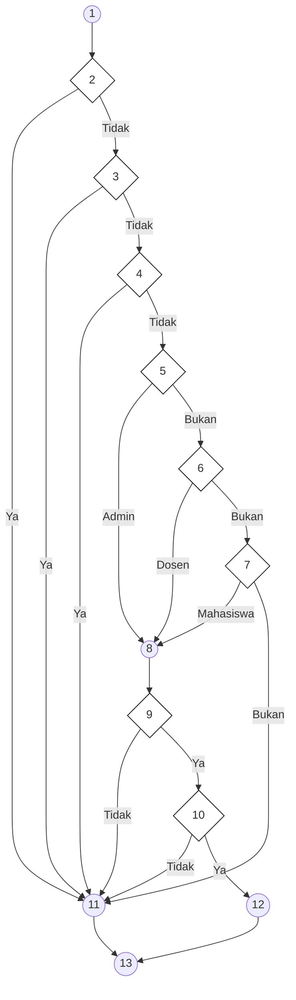
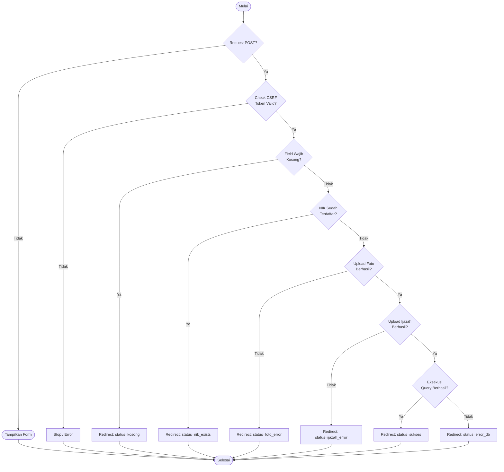
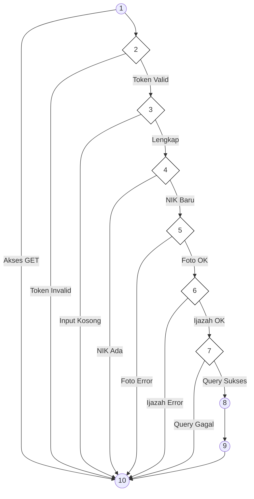
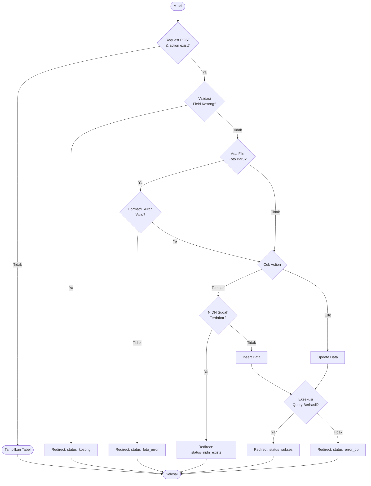
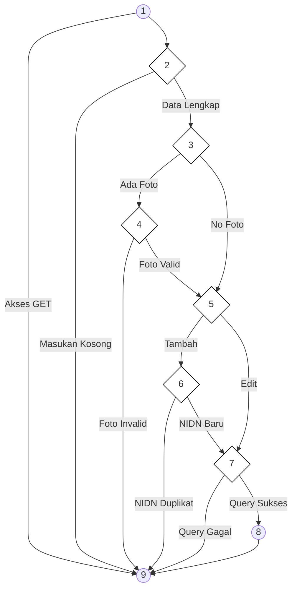

# BAB IV — ANALISIS HASIL PENGUJIAN

## 4.3 Hasil Pengujian

### 4.3.1 Pengujian White Box

Pengujian *White Box* dilakukan untuk mengamati alur logika internal pada kode program. Fokus pengujian ini adalah memastikan setiap jalur (*path*) yang ada di dalam program telah teruji dan berjalan sesuai dengan fungsi yang diharapkan. Dalam pengujian ini, digunakan metode **Cyclomatic Complexity (V(G))** untuk menghitung tingkat kerumitan logika sistem melalui tiga pendekatan rumus:

1.  **Rumus 1 (Edge-Node)**: $V(G) = E - N + 2$
2.  **Rumus 2 (Predicate Node)**: $V(G) = P + 1$
3.  **Rumus 3 (Region)**: $V(G) = R$ (Jumlah region/wilayah tertutup pada flowgraph)

---

### a. Pengujian Autentikasi Login

Analisis dilakukan pada file `admin/proses_login.php`.

**Tabel 4.12 Pemetaan Statement dan Node — Autentikasi Login**

| STATEMENT | NODE |
|:----------|:----:|
| `$username = $_POST['username']; $password = $_POST['password']; $role = $_POST['role'];` | 1 |
| `if (empty($username))` | 2 |
| `if (empty($password))` | 3 |
| `if (empty($role))` | 4 |
| `switch ($role) { case 'admin': ... }` | 5 |
| `switch ($role) { case 'dosen': ... }` | 6 |
| `switch ($role) { case 'mahasiswa': ... }` | 7 |
| `$sql = "SELECT ..."; $stmt->execute();` | 8 |
| `if ($result->num_rows == 1)` | 9 |
| `if (password_verify($password, $data['password']))` | 10 |
| `header("Location: login.php?status=gagal"); exit();` (Error Handler) | 11 |
| `$_SESSION['login'] = true; header("Location: $dashboard"); exit();` | 12 |
| `End` | 13 |

**Gambar 4.26 Flowchart Autentikasi Login**

**Gambar 4.27 Flowgraph Autentikasi Login**

**Hasil Perhitungan Modul Login:**
1.  **V(G) = E — N + 2** = 20 — 13 + 2 = **9**
2.  **V(G) = P + 1** = 8 + 1 = **9**
3.  **V(G) = R** (Jumlah Region) = **9**

**Tabel 4.15 Jalur Independen Modul Login**

| Region | Independent Path | Keterangan |
|:------:|:-----------------|:-----------|
| R1 | Start → 1 → 2 → 11 → 13 | Username kosong |
| R2 | Start → 1 → 2 → 3 → 11 → 13 | Password kosong |
| R3 | Start → 1 → 2 → 3 → 4 → 11 → 13 | Role kosong |
| R4 | Start → 1 → 2 → 3 → 4 → 5 → 6 → 7 → 11 → 13 | Role invalid |
| R5 | Start → 1 → 2 → 3 → 4 → 5 → 8 → 9 → 11 → 13 | Admin, tidak ditemukan |
| R6 | Start → 1 → 2 → 3 → 4 → 5 → 8 → 9 → 10 → 11 → 13 | Admin, password salah |
| R7 | Start → 1 → 2 → 3 → 4 → 5 → 6 → 8 → 9 → 11 → 13 | Dosen, tidak ditemukan |
| R8 | Start → 1 → 2 → 3 → 4 → 5 → 6 → 7 → 8 → 9 → 11 → 13 | Mahasiswa, tidak ada |
| R9 | Start → 1 → 2 → 3 → 4 → 5 → 8 → 9 → 10 → 12 → 13 | **Login BERHASIL** |

---

### b. Pengujian Proses Pendaftaran (PMB)

Analisis dilakukan pada file `pages/pendaftaran.php`.

**Tabel 4.16 Pemetaan Statement dan Node — Pendaftaran PMB**

| STATEMENT | NODE |
|:----------|:----:|
| `if ($_SERVER['REQUEST_METHOD'] == 'POST')` | 1 |
| `if ($_POST['csrf_token'] !== $_SESSION['csrf_token'])` | 2 |
| `if (empty($nama) \|\| empty($nik))` | 3 |
| `if ($nik_exists)` | 4 |
| `if ($email_exists)` | 5 |
| `if ($foto_error)` | 6 |
| `if ($ijazah_error)` | 7 |
| `if ($stmt->execute())` | 8 |
| `header("Location: pendaftaran?sukses"); exit();` | 9 |
| `End` | 10 |

**Gambar 4.28 Flowchart Pendaftaran PMB**

**Gambar 4.29 Flowgraph Pendaftaran PMB**

**Hasil Perhitungan Modul Pendaftaran:**
1.  **V(G) = E — N + 2** = 17 — 10 + 2 = **9**
2.  **V(G) = P + 1** = 8 + 1 = **9**
3.  **V(G) = R** (Jumlah Region) = **9**

**Tabel 4.17 Jalur Independen Modul Pendaftaran**

| Region | Independent Path | Keterangan |
|:------:|:-----------------|:-----------|
| R1 | Start → 1 → 10 | Akses form via GET |
| R2 | Start → 1 → 2 → 10 | Token CSRF invalid |
| R3 | Start → 1 → 2 → 3 → 10 | Isian wajib kosong |
| R4 | Start → 1 → 2 → 3 → 4 → 10 | NIK sudah terdaftar |
| R5 | Start → 1 → 2 → 3 → 4 → 5 → 10 | Format foto tidak valid |
| R6 | Start → 1 → 2 → 3 → 4 → 5 → 6 → 10 | Ijazah belum diunggah |
| R7 | Start → 1 → 2 → 3 → 4 → 5 → 6 → 7 → 10 | Gagal simpan ke database |
| R8 | Start → 1 → 2 → 3 → 4 → 5 → 6 → 7 → 8 → 9 → 10 | **Pendaftaran SUKSES** |
| R9 | Start → 1 → 2 → 4 → 5 → 7 → 9 → 10 | Skenario data duplikat |

---

### c. Pengujian Kelola Data Dosen

Analisis pada `admin/kelola_dosen.php`.

**Tabel 4.18 Pemetaan Statement dan Node — Kelola Dosen**

| STATEMENT | NODE |
|:----------|:----:|
| `if ($_SERVER['REQUEST_METHOD'] == 'POST' && isset($_POST['action']))` | 1 |
| `if (empty($nama) \|\| ...)` | 2 |
| `if (isset($_FILES['foto']))` | 3 |
| `if (!valid_format \|\| size > 2MB)` | 4 |
| `if ($action === 'tambah_dosen')` | 5 |
| `if ($nidn_exists)` | 6 |
| `if ($stmt->execute())` | 7 |
| `header("Location: kelola_dosen?sukses"); exit();` | 8 |
| `End` | 9 |

**Gambar 4.30 Flowchart Kelola Dosen**

**Gambar 4.31 Flowgraph Kelola Dosen**

**Hasil Perhitungan Modul Dosen:**
1.  **V(G) = E — N + 2** = 15 — 8 + 2 = **9**
2.  **V(G) = P + 1** = 8 + 1 = **9**
3.  **V(G) = R** (Jumlah Region) = **9**

**Tabel 4.19 Jalur Independen Modul Dosen**

| Region | Independent Path | Keterangan |
|:------:|:-----------------|:-----------|
| R1 | Start → 1 → 9 | Tampilan tabel utama |
| R2 | Start → 1 → 2 → 9 | Input wajib kosong |
| R3 | Start → 1 → 2 → 3 → 4 → 9 | Foto format tidak valid |
| R4 | Start → 1 → 2 → 3 → 5 → 6 → 9 | NIDN sudah dipakai |
| R5 | Start → 1 → 2 → 3 → 5 → 7 → 9 | Gagal INSERT ke database |
| R6 | Start → 1 → 2 → 3 → 5 → 7 → 8 → 9 | TAMBAH DATA SUKSES |
| R7 | Start → 1 → 2 → 3 → 4 → 5 → 7 → 9 | Gagal UPDATE data ke DB |
| R8 | Start → 1 → 2 → 3 → 4 → 5 → 7 → 8 → 9 | UPDATE DATA SUKSES |
| R9 | Start → 1 → 2 → 3 → 4 → 5 → 6 → 8 → 9 | Update data tanpa foto |

---

*Laporan pengujian teknis White Box ini disusun secara komprehensif untuk memastikan validitas alur logika pada sistem Website FIKOM UNISAN.*
