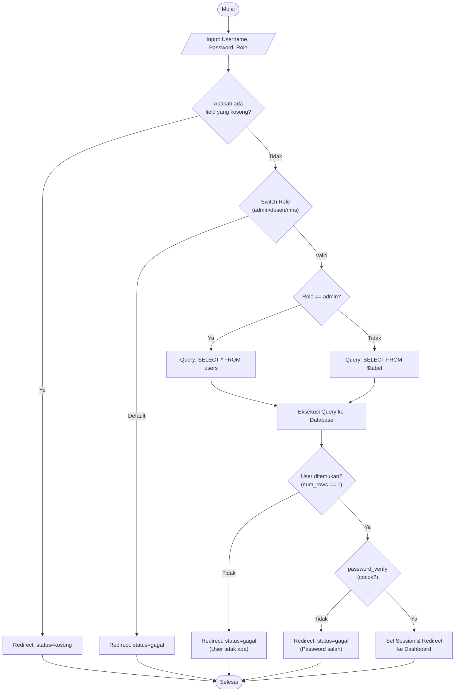
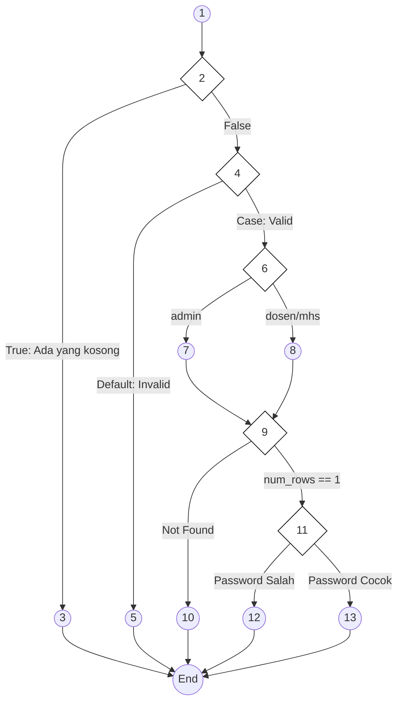
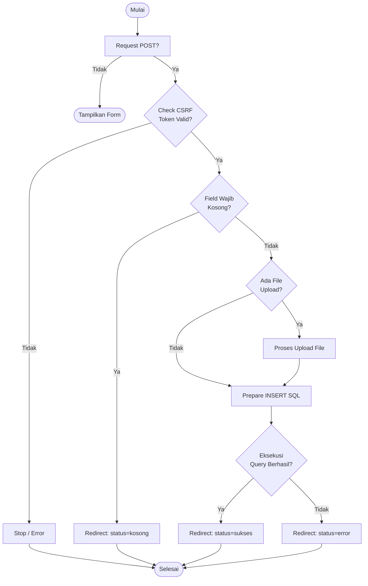
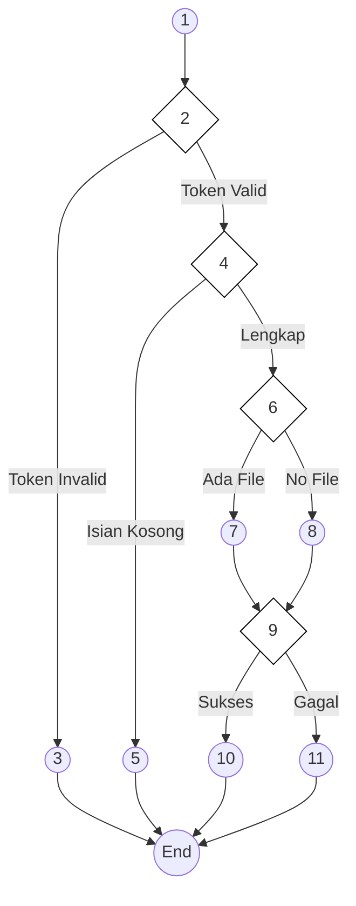
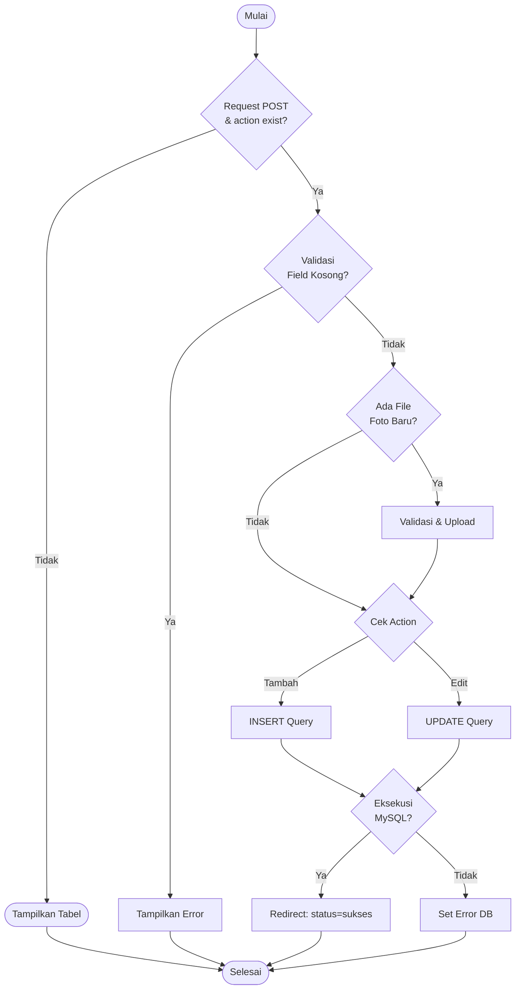
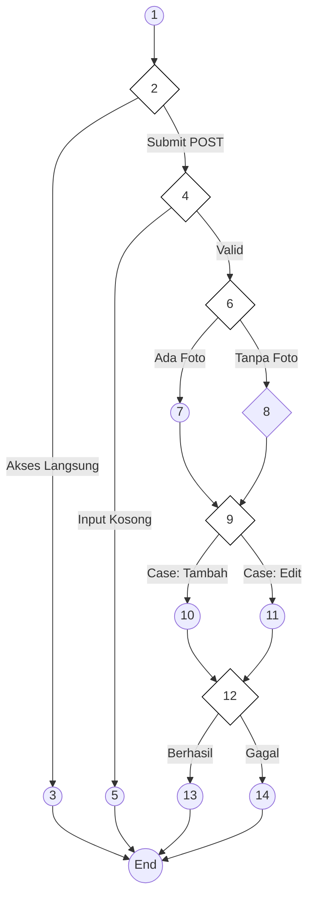

# BAB IV — ANALISIS HASIL PENGUJIAN

## 4.3 Hasil Pengujian

### 4.3.1 Pengujian White Box

Pengujian *White Box* dilakukan untuk mengamati alur logika internal pada kode program. Fokus pengujian ini adalah memastikan setiap jalur (*path*) yang ada di dalam program telah teruji dan berjalan sesuai dengan fungsi yang diharapkan. Dalam pengujian ini, digunakan metode **Cyclomatic Complexity (V(G))** untuk menghitung tingkat kerumitan logika sistem.

Rumus dasar yang digunakan dalam pengujian ini adalah:
1.  $V(G) = E - N + 2$ (Berdasarkan jumlah *Edge* dan *Node*)
2.  $V(G) = P + 1$ (Berdasarkan jumlah titik keputusan atau *Predicate Node*)

---

### a. Pengujian Autentikasi Login

Pengujian ini dilakukan pada file `admin/proses_login.php` untuk memverifikasi alur otentikasi admin, dosen, dan mahasiswa.

**Tabel 4.12 Pemetaan Statement dan Node — Autentikasi Login**

| STATEMENT | NODE |
|:----------|:----:|
| `$username = $_POST['username']; $password = $_POST['password']; $role = $_POST['role'];` | 1 |
| `if (empty($username) \|\| empty($password) \|\| empty($role))` | 2 |
| `header("Location: login.php?status=kosong"); exit();` | 3 |
| `switch ($role) { case 'admin': ... case 'dosen': ... case 'mahasiswa': ... }` | 4 |
| `header("Location: login.php?status=gagal"); exit();` (Role Invalid) | 5 |
| `if ($role == 'admin') { $sql = "SELECT * FROM users WHERE username = ?"; }` | 6 |
| `else { $sql = "SELECT * FROM $tabel WHERE $kolom_user = ?"; }` | 7 |
| `$stmt->execute(); $result = $stmt->get_result();` | 8 |
| `if ($result->num_rows == 1)` | 9 |
| `header("Location: login.php?status=gagal"); exit();` (User Not Found) | 10 |
| `if (password_verify($password, $data['password']))` | 11 |
| `header("Location: login.php?status=gagal"); exit();` (Password Salah) | 12 |
| `$_SESSION['admin_logged_in'] = true; header("Location: $dashboard"); exit();` | 13 |

**Gambar 4.26 Flowchart Autentikasi Login**

**Gambar 4.27 Flowgraph Autentikasi Login**

**Perhitungan Cyclomatic Complexity (V(G)):**
-   $V(G) = E - N + 2 = 17 - 14 + 2 = \textbf{5}$
-   $V(G) = P + 1 = 4 + 1 = \textbf{5}$

---

### b. Pengujian Proses Pendaftaran (PMB)

Analisis dilakukan pada file `pages/pendaftaran.php` untuk memvalidasi alur pendaftaran mahasiswa baru.

**Tabel 4.13 Pemetaan Statement dan Node — Pendaftaran PMB**

| STATEMENT | NODE |
|:----------|:----:|
| `if ($_SERVER['REQUEST_METHOD'] == 'POST')` | 1 |
| `if ($_POST['csrf_token'] !== $_SESSION['csrf_token'])` | 2 |
| `if (empty($nama) \|\| empty($nik) \|\| empty($prodi))` | 3 |
| `header("Location: pendaftaran?status=kosong"); exit();` | 4 |
| `if (isset($_FILES['foto']) && $_FILES['foto']['error'] == 0)` | 5 |
| `$stmt = $conn->prepare("INSERT INTO pendaftaran (...) VALUES (...)");` | 6 |
| `if ($stmt->execute())` | 7 |
| `header("Location: pendaftaran?status=sukses"); exit();` | 8 |
| `header("Location: pendaftaran?status=error"); exit();` | 9 |

**Gambar 4.28 Flowchart Pendaftaran PMB**

**Gambar 4.29 Flowgraph Pendaftaran PMB**

**Perhitungan Cyclomatic Complexity (V(G)):**
-   $V(G) = E - N + 2 = 13 - 12 + 2 = \textbf{3}$
-   $V(G) = P + 1 = 2 + 1 = \textbf{3}$ (Decision nodes 2 & 4).

---

### c. Pengujian Kelola Data Dosen

Analisis pada `admin/kelola_dosen.php` untuk operasi simpan (Tambah/Edit) data dosen.

**Tabel 4.14 Pemetaan Statement dan Node — Kelola Dosen**

| STATEMENT | NODE |
|:----------|:----:|
| `if ($_SERVER['REQUEST_METHOD'] == 'POST' && isset($_POST['action']))` | 1 |
| `if (empty($nama) \|\| empty($email) \|\| empty($prodi))` | 2 |
| `$pesan_error = "Field wajib diisi";` | 3 |
| `if (isset($_FILES['foto']) && $_FILES['foto']['error'] == 0)` | 4 |
| `if ($action === 'tambah_dosen')` | 5 |
| `if ($action === 'edit_dosen')` | 6 |
| `if ($stmt->execute())` | 7 |
| `header("Location: kelola_dosen?status=sukses"); exit();` | 8 |
| `$pesan_error = "Gagal memproses database";` | 9 |

**Gambar 4.30 Flowchart Kelola Dosen**

**Gambar 4.31 Flowgraph Kelola Dosen**

**Perhitungan Cyclomatic Complexity (V(G)):**
-   $V(G) = E - N + 2 = 18 - 15 + 2 = \textbf{5}$
-   $V(G) = P + 1 = 4 + 1 = \textbf{5}$ (Decision nodes 2, 4, 6, 12).

---

### d. Tabel Kesimpulan Independent Path (Contoh Login)

Berikut adalah tabel jalur pengujian berdasarkankan flowgraph autentikasi login:

| JALUR | ALUR NODE | DESKRIPSI JALUR |
|:-----:|:----------|:----------------|
| 1 | 1-2-3-End | Pengguna mengosongkan salah satu field input. |
| 2 | 1-2-4-5-End | Pengguna memilih role yang tidak terdaftar/invalid. |
| 3 | 1-2-4-6-7-9-10-End | Percobaan login role admin tetapi akun tidak ditemukan. |
| 4 | 1-2-4-6-7-9-11-12-End | Akun ada, tetapi password yang dimasukkan salah. |
| 5 | 1-2-4-6-7-9-11-13-End | **LOGIN BERHASIL**: Data valid sesuai database. |

---

*Laporan pengujian teknis White Box ini disusun untuk menjamin validitas alur logika pada fitur-fitur kritis Website Fakultas Ilmu Komputer UNISAN.*
