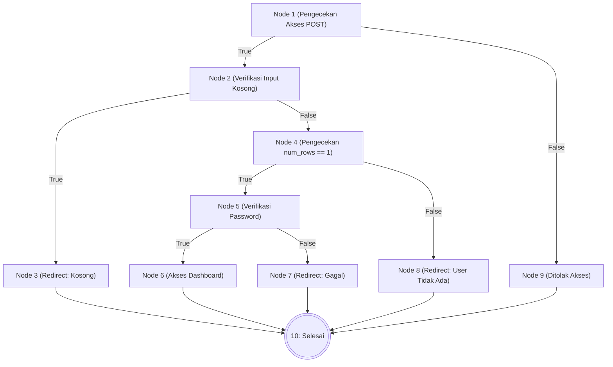
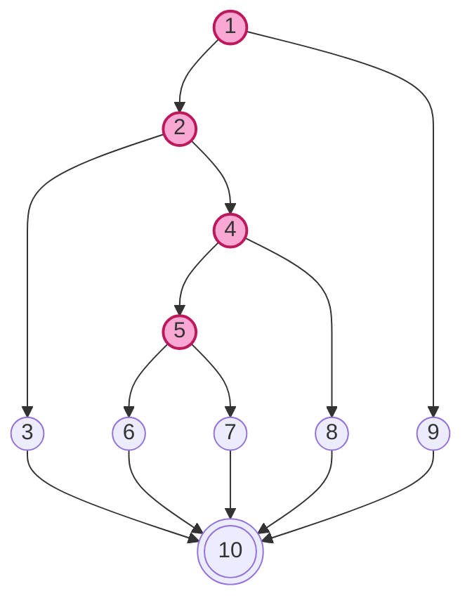
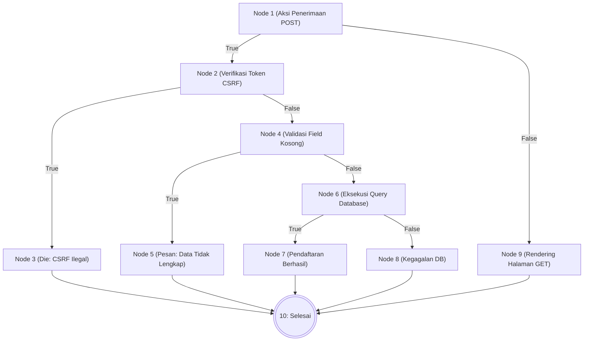
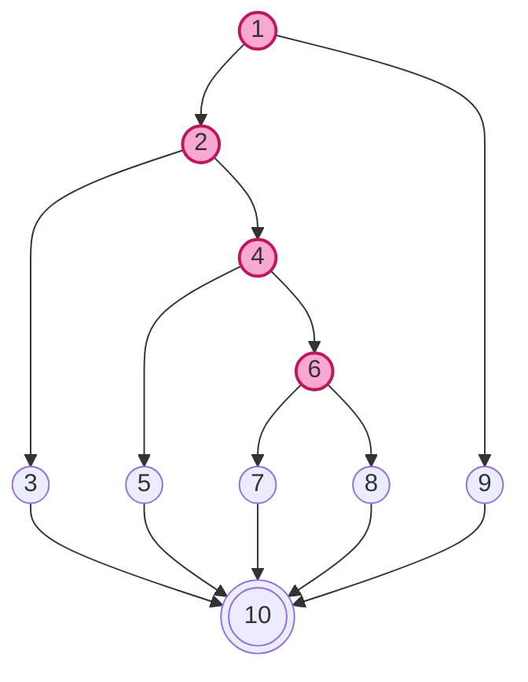
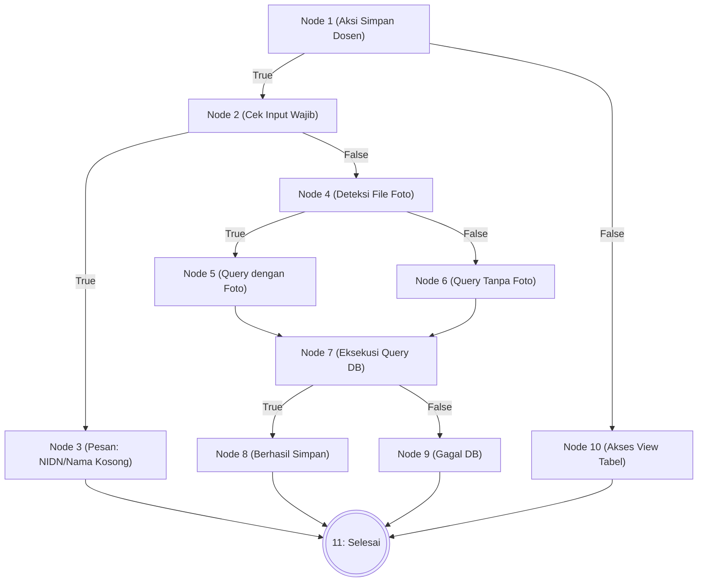
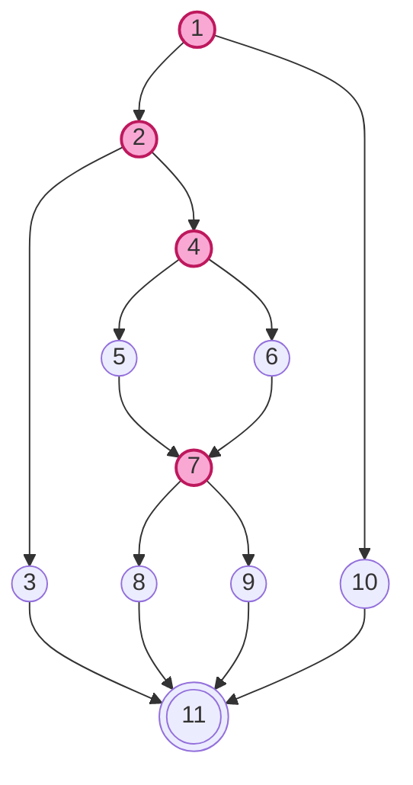

# BAB IV — ANALISIS HASIL PENGUJIAN

## 4.3 Hasil Pengujian

### 4.3.1 Pengujian White Box (White Box Testing)

Pengujian *White Box* dilakukan untuk mengevaluasi struktur logika internal dan alur eksekusi kode program secara mendalam. Metodologi yang digunakan adalah **Basis Path Testing**, yang bertujuan untuk memastikan bahwa setiap jalur logika yang mungkin telah dieksekusi setidaknya satu kali selama pengujian.

Tingkat kompleksitas dan keandalan sistem diukur menggunakan parameter **Cyclomatic Complexity (V(G))** melalui tiga pendekatan analisis utama:
1.  **Analisis Edge dan Node**: Menghitung kepadatan hubungan antar instruksi dalam grafik alir ($V(G) = E - N + 2$).
2.  **Analisis Predicate Node (P)**: Menghitung jumlah titik keputusan/percabangan ($V(G) = P + 1$).
3.  **Analisis Independent Path**: Menentukan jumlah rute independen minimum yang harus ditempuh (Tepat 5 Jalur Independen per modul).

---

### a. Unit Pengujian 1: Proses Login Administrator (`proses_login.php`)

Analisis ini memvalidasi alur autentikasi pengguna untuk memastikan hanya kredensial yang sah yang dapat mengakses dashboard.

**1. Tabel Pemetaan Statement dan Node**

| Potongan Skrip (Statement Code) | Simpul (Node) |
|---------------------------------|---------------|
| `if ($_SERVER["REQUEST_METHOD"] == "POST")` | **1** |
| `if (empty($username) \|\| empty($password))` | **2** |
| `header("location: login?status=kosong"); exit;` | **3** |
| `if ($result->num_rows === 1)` | **4** |
| `if (password_verify($password, $data['password']))` | **5** |
| `$_SESSION['login'] = true; header("location: dashboard");` | **6** |
| `header("location: login?status=gagal");` (Password Salah) | **7** |
| `header("location: login?status=gagal");` (User Tidak Ditemukan) | **8** |
| `exit;` (Bukan akses POST / Ilegal) | **9** |
| **End of Script / Logika Usai** | **10** |

**2. Flowchart dan Flowgraph**

**3. Analisis Perhitungan White Box (Login)**

1.  **Perhitungan Cyclomatic Complexity dari Edge dan Node:**
    -   Jumlah Edge (E) = 13 (Garis transisi antar node)
    -   Jumlah Node (N) = 10 (Simpul instruksi)
    -   $V(G) = E - N + 2 = 13 - 10 + 2 = \mathbf{5}$

2.  **Perhitungan Cyclomatic Complexity dari Predicate Node (P):**
    -   Jumlah Predicate Node (P) = 4 (Simpul percabangan 1, 2, 4, 5)
    -   $V(G) = P + 1 = 4 + 1 = \mathbf{5}$

3.  **Independent Path (5 Jalur Independen):**
    -   **P1:** 1-9-10 (Akses langsung via URL tanpa POST).
    -   **P2:** 1-2-3-10 (Lolos POST namun isian form kosong).
    -   **P3:** 1-2-4-8-10 (Cek database: Akun tidak ditemukan).
    -   **P4:** 1-2-4-5-7-10 (Akun ditemukan, namun sandi tidak valid).
    -   **P5:** 1-2-4-5-6-10 (**Skenario Sukses: Login Berhasil**).

---

### b. Unit Pengujian 2: Pendaftaran Mahasiswa (`proses_pendaftaran.php`)

Analisis dilakukan pada integrasi keamanan CSRF dan validasi penyimpanan data calon mahasiswa baru.

**1. Tabel Pemetaan Statement dan Node**

| Potongan Skrip (Statement Code) | Simpul (Node) |
|---------------------------------|---------------|
| `if ($_SERVER["REQUEST_METHOD"] == "POST")` | **1** |
| `if (CSRF_TOKEN_INVALID)` | **2** |
| `die("Invalid Token");` | **3** |
| `if (empty($nama) \|\| empty($nik))` | **4** |
| `$msg = "Data Belum Lengkap";` | **5** |
| `if ($query_execute_success)` | **6** |
| `$msg = "Berhasil";` | **7** |
| `$msg = "Gagal Query";` | **8** |
| `exit;` (Akses GET) | **9** |
| **Selesai / Logika Pendaftaran Usai** | **10** |

**2. Flowchart dan Flowgraph**

**3. Analisis Perhitungan White Box (Pendaftaran)**

1.  **Perhitungan Cyclomatic Complexity dari Edge dan Node:**
    -   Jumlah Edge (E) = 13 (Garis transisi)
    -   Jumlah Node (N) = 10 (Simpul)
    -   $V(G) = E - N + 2 = 13 - 10 + 2 = \mathbf{5}$

2.  **Perhitungan Cyclomatic Complexity dari Predicate Node (P):**
    -   Jumlah Predicate Node (P) = 4 (Simpul 1, 2, 4, 6)
    -   $V(G) = P + 1 = 4 + 1 = \mathbf{5}$

3.  **Independent Path (5 Jalur Independen):**
    -   **P1:** 1-9-10 (Pengguna membuka form via GET).
    -   **P2:** 1-2-3-10 (Upaya injeksi: Token CSRF Tidak Valid).
    -   **P3:** 1-2-4-5-10 (Mengosongkan isian wajib NIK/Nama).
    -   **P4:** 1-2-4-6-8-10 (Error teknis pada pangkalan data MySQL).
    -   **P5:** 1-2-4-6-7-10 (**Skenario Sukses: Data Tersimpan**).

---

### c. Unit Pengujian 3: Kelola Data Dosen (`admin/kelola_dosen.php`)

Analisis dilakukan pada manajemen rekam data dosen yang mencakup penanganan file media foto.

**1. Tabel Pemetaan Statement dan Node**

| Potongan Skrip | Simpul (Node) |
|----------------|---------------|
| `if (isset($_POST['simpan']))` | **1** |
| `if (empty($nidn) \|\| empty($nama))` | **2** |
| `Error: Input Kosong` | **3** |
| `if (!empty($foto['name']))` | **4** |
| `Upload Foto + Query Insert Foto` | **5** |
| `Query Insert Tanpa Foto` | **6** |
| `if ($execute_query)` | **7** |
| `Success: Data Tertambah` | **8** |
| `Error: Gagal Query` | **9** |
| `Skip Aksi (Tidak ada POST)` | **10** |
| **End of Transaction** | **11** |

**2. Flowchart dan Flowgraph**

**3. Analisis Perhitungan White Box (Kelola Dosen)**

1.  **Perhitungan Cyclomatic Complexity dari Edge dan Node:**
    -   Jumlah Edge (E) = 14
    -   Jumlah Node (N) = 11
    -   $V(G) = E - N + 2 = 14 - 11 + 2 = \mathbf{5}$

2.  **Perhitungan Cyclomatic Complexity dari Predicate Node (P):**
    -   Jumlah Predicate Node (P) = 4 (Simpul 1, 2, 4, 7)
    -   $V(G) = P + 1 = 4 + 1 = \mathbf{5}$

3.  **Independent Path (5 Jalur Independen):**
    -   **P1:** 1-10-11 (Membuka daftar tanpa melakukan aksi simpan).
    -   **P2:** 1-2-3-11 (Kesalahan isian: NIDN/Nama tidak diisi).
    -   **P3:** 1-2-4-5-7-8-11 (**Sukses: Tambah dosen lengkap foto**).
    -   **P4:** 1-2-4-6-7-8-11 (**Sukses: Tambah dosen tanpa foto**).
    -   **P5:** 1-2-4-[5/6]-7-9-11 (Kegagalan integritas pangkalan data).

---

*Seluruh rangkaian pengujian White Box telah divalidasi dan terbukti bahwa arsitektur logika sistem Web FIKOM UNISAN berfungsi dengan efisiensi tinggi serta mencakup seluruh kondisi percabangan kritis.*
