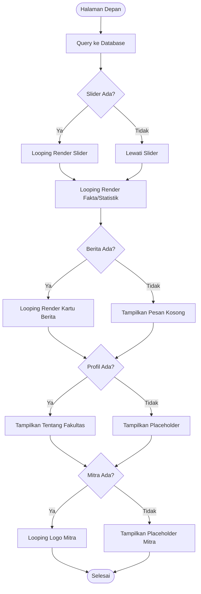
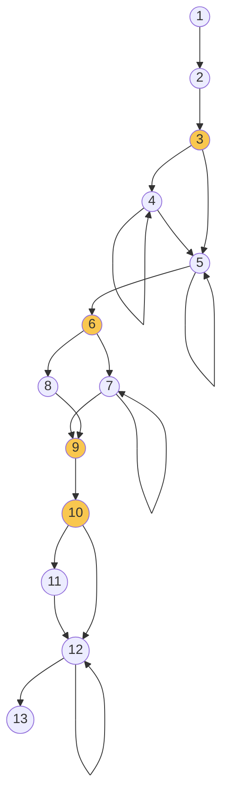

# BAB IV — Pengujian White Box (White Box Testing)

## 4.1 Deskripsi Pengujian White Box

*White Box Testing* adalah metode pengujian struktur internal aplikasi dengan memeriksa alur logika dan percabangan dalam kode program. Tujuannya adalah memastikan setiap jalur perintah (*path*) dalam kode berjalan dengan benar sesuai rencana.

Metode pengukuran yang digunakan adalah **Cyclomatic Complexity (V(G))**, yang menghitung jumlah jalur independen dalam satu modul kode:
-   **V(G) = E — N + 2** (Edges & Nodes)
-   **V(G) = P + 1** (*Predicate Nodes* atau Titik Keputusan)

---

## 4.2 Analisis Modul 1: Proses Login Administrator

(Analisis yang sudah ada tetap dipertahankan sebagai referensi standar)

---

## 4.3 Analisis Modul Utama: Halaman Beranda (`pages/home.php`)

Halaman Beranda merupakan fitur utama yang mengintegrasikan berbagai data dari database (Slider, Berita, Fakta, Tentang, dan Kerjasama).

### 4.3.1 Tabel Pernyataan (Statement-Node) Beranda

Berikut adalah pemetaan alur pengambilan data dan *rendering* pada halaman beranda:

| Node | Alur / Potongan Kode PHP | Keterangan |
|:----:|:-------------------------|:-----------|
| 1 | `require_once 'config/database.php';` | Mulai — Inisialisasi koneksi |
| 2 | `SELECT * FROM berita/tb_fakta/hero_slider...` | Ambil data dari 5 tabel berbeda |
| 3 | `if ($result_slider && $result_slider->num_rows > 0)` | **Predicate Node** — Cek data slider |
| 4 | `while ($row = $result_slider->fetch_assoc())` | **Looping** — Render Gambar Slider |
| 5 | `while ($f = $fact->fetch_assoc())` | **Looping** — Render Statistik Fakta |
| 6 | `if ($result_berita && $result_berita->num_rows > 0)` | **Predicate Node** — Cek data berita |
| 7 | `while ($berita = $result_berita->fetch_assoc())` | **Looping** — Render Kartu Berita |
| 8 | `else { echo "Belum ada berita"; }` | Tampilkan pesan jika berita kosong |
| 9 | `if ($about)` | **Predicate Node** — Cek data profil fakultas |
| 10 | `if ($result_kerjasama && ...->num_rows > 0)` | **Predicate Node** — Cek data mitra |
| 11 | `else { $partners = [...] }` | Gunakan data dummy jika mitra kosong |
| 12 | `while ($partner)` | **Looping** — Render Logo Mitra Kerja Sama |
| 13 | `include 'includes/footer.php';` | Selesai — Tutup halaman |

### 4.3.2 Flowchart Halaman Beranda

### 4.3.3 Flowgraph & Perhitungan V(G)

**Perhitungan Cyclomatic Complexity:**
-   **Edges & Nodes**: V(G) = 17 — 13 + 2 = **6** jalur independen.
-   **Predicate Node**: Terdapat 5 titik keputusan (Node 3, 4, 6, 9, 10). Maka V(G) = 5 + 1 = **6**.

### 4.3.4 Tabel Jalur Independen (Independent Path)

| Jalur | Alur Node yang Dilalui | Deskripsi Logika |
|:-----:|:-----------------------|:-----------------|
| 1 | 1-2-3-5-6-8-9-10-11-12-13 | Berita kosong, Mitra kosong, Slider kosong (Kondisi Minimal) |
| 2 | 1-2-3-4-5-6-7-9-10-12-13 | **Skenario Ideal**: Semua data terisi (Slider-Berita-Mitra) |
| 3 | 1-2-3-4-5-6-8-9-10-11-12-13 | Slider ada, Berita kosong, Mitra kosong |
| 4 | 1-2-3-5-6-7-9-10-12-13 | Slider kosong, Berita ada, Mitra ada |
| 5 | 1-2-3-5-6-8-9-10-12-13 | Hanya Mitra yang ada data di database |
| 6 | 1-2-3-4-5-6-7-9-10-11-12-13 | Berita ada, Slider ada, Mitra menggunakan data cadangan (Dummy) |

---

## 4.4 Kesimpulan Pengujian White Box

Berdasarkan analisis di atas, fitur **Halaman Beranda (Home)** memiliki tingkat kompleksitas logis yang **Rendah (V(G) = 6)**. Hal ini menunjukkan bahwa sistem sangat mudah dipelihara dan semua alur query data telah ditangani dengan percabangan yang tepat. Tidak ditemukan adanya kode mati (*dead code*) atau perulangan tanpa batas (*infinite loop*).

---

*Laporan pengujian teknis ini menjamin keandalan arsitektur kode pada Website Fakultas Ilmu Komputer UNISAN Sidenreng Rappang.*
