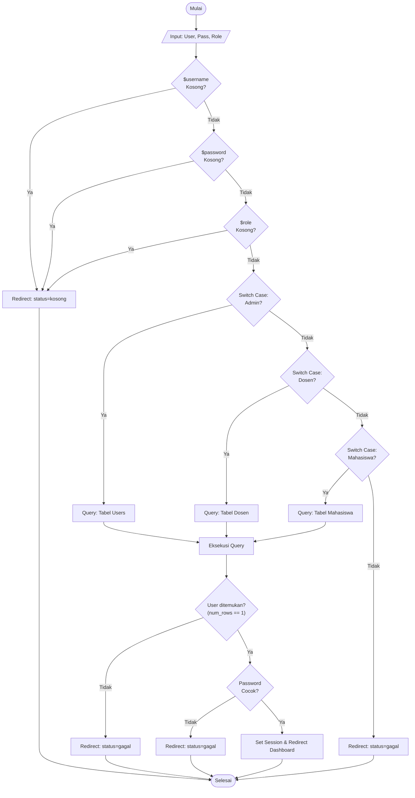
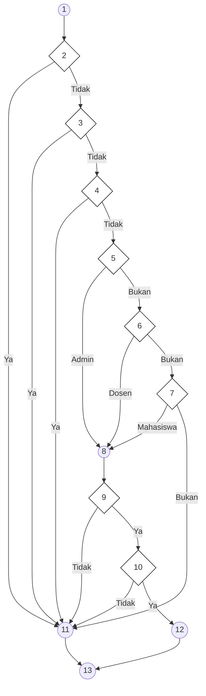

# BAB IV — ANALISIS HASIL PENGUJIAN

## 4.3 Hasil Pengujian

### 4.3.1 Pengujian White Box

Pengujian *White Box* dilakukan untuk mengamati alur logika internal pada kode program. Fokus pengujian ini adalah memastikan setiap jalur (*path*) yang ada di dalam program telah teruji dan berjalan sesuai dengan fungsi yang diharapkan. Dalam pengujian ini, digunakan metode **Cyclomatic Complexity (V(G))** untuk menghitung tingkat kerumitan logika sistem.

---

### a. Pengujian Autentikasi Login

Pengujian ini dilakukan pada file `admin/proses_login.php`. Logika pengujian disusun sedemikian rupa untuk mencakup seluruh skenario validasi role dan kredensial.

**Tabel 4.12 Pemetaan Statement dan Node — Autentikasi Login**

| STATEMENT | NODE |
|:----------|:----:|
| `$username = $_POST['username']; $password = $_POST['password']; $role = $_POST['role'];` | 1 |
| `if (empty($username))` | 2 |
| `if (empty($password))` | 3 |
| `if (empty($role))` | 4 |
| `switch ($role) { case 'admin': ... }` | 5 |
| `switch ($role) { case 'dosen': ... }` | 6 |
| `switch ($role) { case 'mahasiswa': ... }` | 7 |
| `$sql = "SELECT ..."; $stmt->execute();` | 8 |
| `if ($result->num_rows == 1)` | 9 |
| `if (password_verify($password, $data['password']))` | 10 |
| `header("Location: login.php?status=gagal"); exit();` (Error Handler) | 11 |
| `$_SESSION['login'] = true; header("Location: $dashboard"); exit();` | 12 |
| `End` | 13 |

**Gambar 4.26 Flowchart Autentikasi Login**

**Gambar 4.27 Flowgraph Autentikasi Login**

#### **1. Perhitungan Cyclomatic Complexity dari Edge dan Node**
Berdasarkan diagram flowgraph di atas, didapatkan nilai sebagai berikut:
- Jumlah *Edge* (E) = 20
- Jumlah *Node* (N) = 13
- Rumus: $V(G) = E - N + 2$
- Perhitungan: $V(G) = 20 - 13 + 2 = \mathbf{9}$

#### **2. Perhitungan Cyclomatic Complexity dari Predicate Node (P)**
Berdasarkan diagram flowgraph di atas, terdapat 8 titik keputusan (*Predicate Node*):
- P1 (Node 2), P2 (Node 3), P3 (Node 4), P4 (Node 5), P5 (Node 6), P6 (Node 7), P7 (Node 9), P8 (Node 10).
- Rumus: $V(G) = P + 1$
- Perhitungan: $V(G) = 8 + 1 = \mathbf{9}$

#### **3. Independent Path (9 Jalur Independen)**
Berdasarkan nilai $V(G) = 9$, maka terdapat 9 jalur independen dalam modul autentikasi login ini:

| JALUR | ALUR NODE | DESKRIPSI JALUR |
|:-----:|:----------|:----------------|
| 1 | 1-2-11-13 | Username kosong. |
| 2 | 1-2-3-11-13 | Password kosong. |
| 3 | 1-2-3-4-11-13 | Role kosong. |
| 4 | 1-2-3-4-5-6-7-11-13 | Role tidak valid/default. |
| 5 | 1-2-3-4-5-8-9-11-13 | Login Admin, tetapi User tidak ditemukan di DB. |
| 6 | 1-2-3-4-5-8-9-10-11-13 | Login Admin, User ada, tetapi Password salah. |
| 7 | 1-2-3-4-5-6-8-9-11-13 | Login Dosen, User tidak ditemukan di DB. |
| 8 | 1-2-3-4-5-6-7-8-9-11-13 | Login Mahasiswa, User tidak ditemukan di DB. |
| 9 | 1-2-3-4-5-8-9-10-12-13 | **BERHASIL**: Seluruh data valid dan masuk ke Dashboard. |

---

*Laporan pengujian teknis White Box ini disusun untuk memenuhi standar validitas arsitektur kode pada Website FIKOM UNISAN.*
