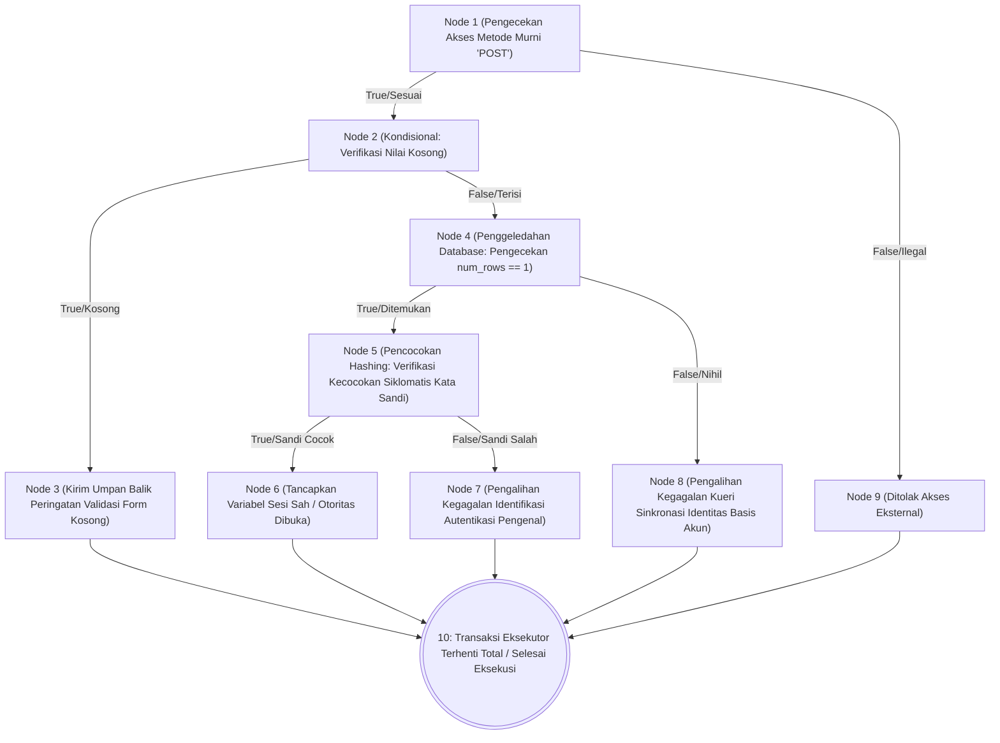
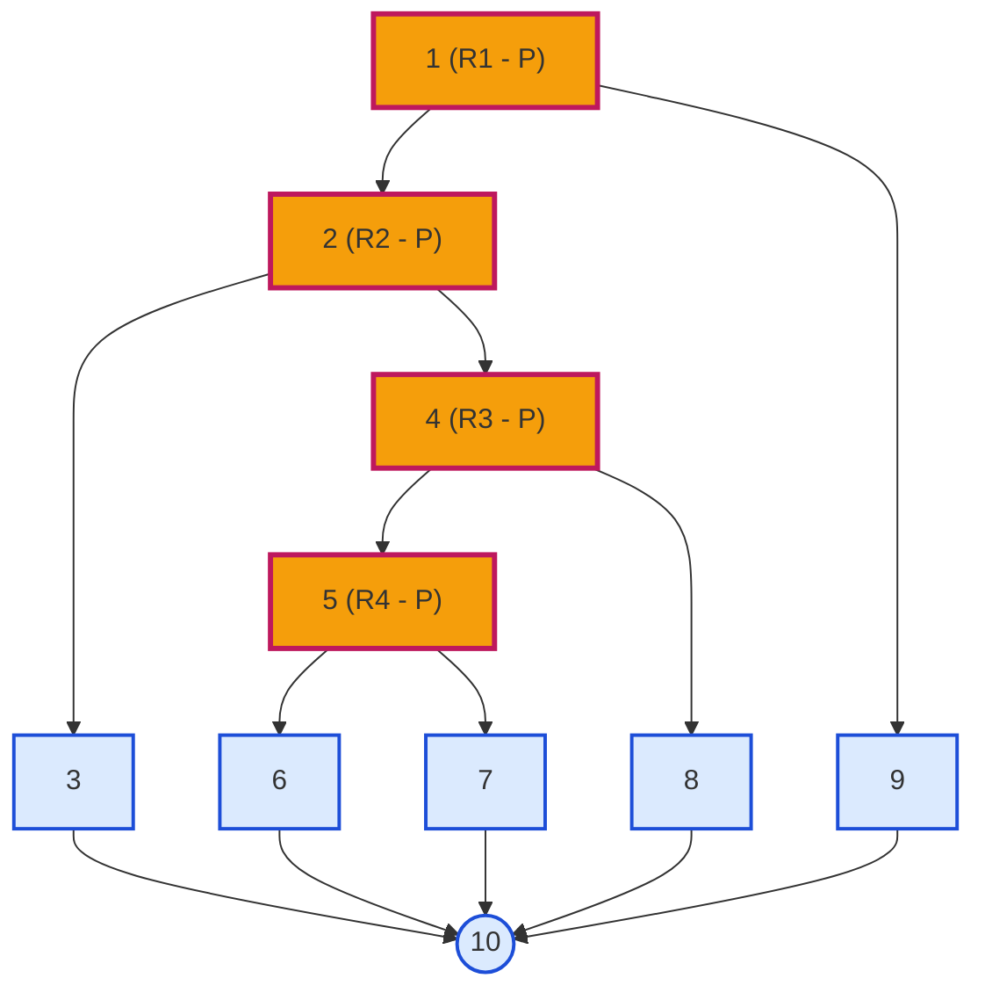
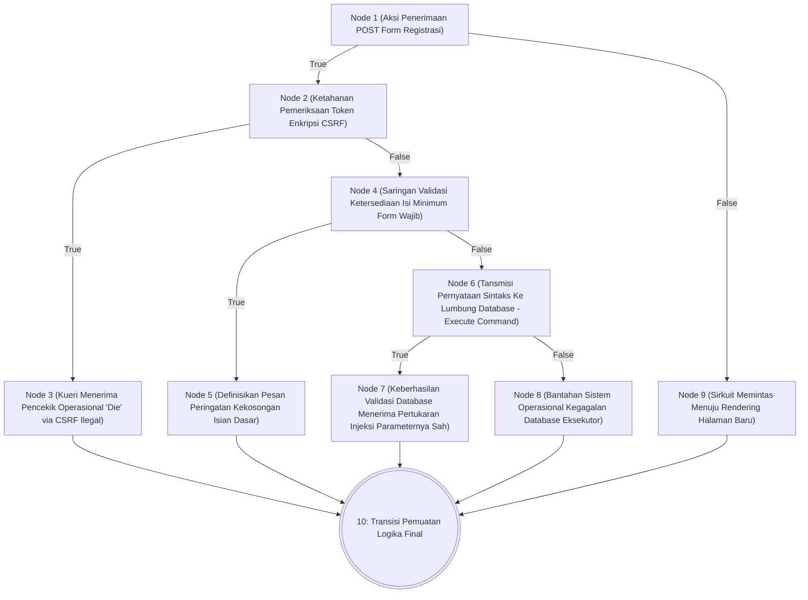
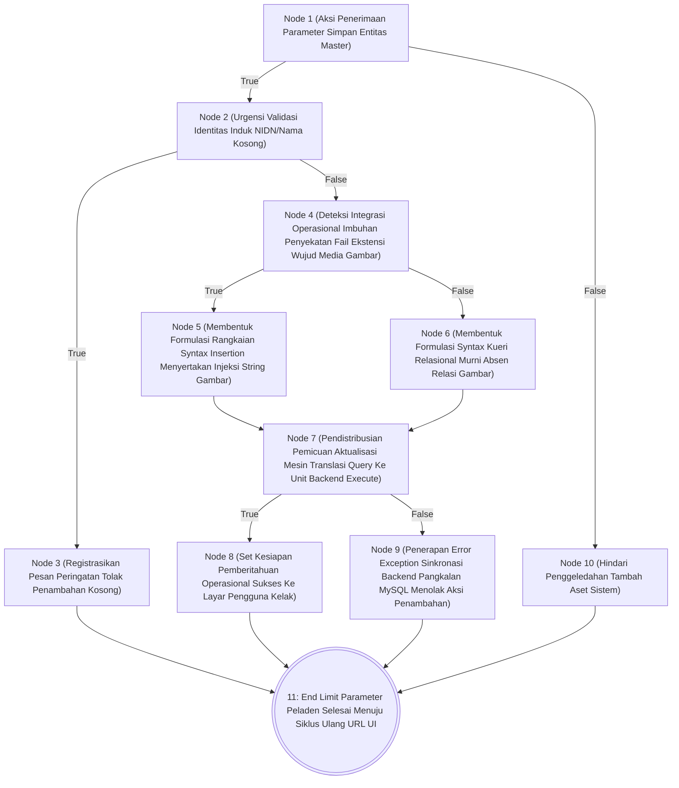

# BAB X — LAPORAN PENGUJIAN WHITE BOX (WHITE BOX TESTING)

## 10.1 Pengantar White Box Testing
Pengujian *White Box* (*White Box Testing*) alias *Glass Box Testing* adalah metode yang menguji keandalan spesifik dari struktur internal aplikasi, perancangan algoritma, dan pembacaan *Flow of Control* pada suatu skrip (*source code*). Salah satu rujukan mutlak di ranah akademis adalah menggunakan penyelesaian teknik **Path Testing** yang berbasis nilai ukuran matematika *Cyclomatic Complexity* (Kompleksitas Siklomatis / V(G)). Uji pembuktian statis analitik ini memvalidasi keabsahan struktur operasional pemrograman agar seluruh ranting alur *Decision Statements* dieksekusi secara terhitung tepat melaluinya minimum satu kali melintas utuh tanpa adanya rute penelusuran mati/tidak tercapai murni (*Dead Code Violation*).

---

## 10.2 Modul 1: Proses Login Administrator (`proses_login.php`)

### A. Tabel Pemetaan Statement dan Node
| Potongan Skrip (Statement Code) | Simpul (Node) |
|---------------------------------|---------------|
| `if ($_SERVER["REQUEST_METHOD"] == "POST") {` `$username = $_POST['username'];` `$password = $_POST['password'];` | **1** |
| `if (empty($username) \|\| empty($password)) {` | **2** |
| `header("location: login?status=kosong"); exit;` | **3** |
| `$sql = "SELECT * FROM users WHERE username = ?";` `$stmt->execute();` `$result = $stmt->get_result();` `if ($result->num_rows === 1) {` | **4** |
| `$data = $result->fetch_assoc();` `if (password_verify($password, $data['password'])) {` | **5** |
| `$_SESSION['login'] = true; header("location: dashboard"); exit;` | **6** |
| `} else { header("location: login?status=gagal"); exit; }` *(Password Salah)* | **7** |
| `} else { header("location: login?status=gagal"); exit; }` *(User Tdk Ditemukan)* | **8** |
| `} else { exit; }` *(Bukan akses POST/Selesai)* | **9** |
| **End of Script / Logika Operasi Usai** | **10** |

### B. Flowchart Pemrosesan Logika Modul Login

### C. Pemetaan Skema Graph Region & Predikat (Flowgraph)

### D. Perhitungan Kompleksitas Ruang (*Cyclomatic Complexity* / V(G))
Berdasarkan bagan simpul (Flowgraph) di atas:
- Kepadatan Jumlah Sisi Panah Transisi (*Edges / E*): 13
- Kepadatan Jumlah Simpul (*Nodes / N*): 10
- Pemusatan Jumlah Simpul Penentuan Bersyarat (*Predicate Node / P*): 4 *(Simpul percabangan bernomor 1, 2, 4, 5)*

Peralihan pembuktian algoritma V(G): 
- **Persamaan Komputasi Edges:** V(G) = (E – N) + 2 = (13 – 10) + 2 = **5**
- **Persamaan Predikat Bersyarat:** V(G) = P + 1 = 4 + 1 = **5**

### E. Integrasi Tabel Penyisiran Independent Path
Pengesahan V(G) mendedukasikan terbentuknya eksistensi total **5** perutean Independen *(Independent Logical Path)* yang dieksekusi fungsional:

| Indeks Jalur | Pemetaan Node Penelusuran Siklomatis (Path Trace) | Deskriptif Alur Pembacaan Logis Operasional |
|---|---|---|
| **P1** | Start -> 1 -> 9 -> 10 -> End | Parameter insiden di mana pengakses menyerang laman sirkuit pengeksekusian lewat cara paksa meramban URI murni tanpa pemanjatan *payload* dari transmisi POST sah; ditolak absolut. |
| **P2** | Start -> 1 -> 2 -> 3 -> 10 -> End | Input legal via jembatan transfer POST namun sengaja nilai deklarasinya diabaikan (*null_state/empty*); digugurkan pengamanan perimetri. |
| **P3** | Start -> 1 -> 2 -> 4 -> 8 -> 10 -> End | Terdapat parameter muatan kredensial fiktif akun, ditolak kebenarannya sesudah penggeledahan basis kueri database menihilkan kebenaran rujukan silsilah akun. |
| **P4** | Start -> 1 -> 2 -> 4 -> 5 -> 7 -> 10 -> End | Eksekusi konfirmasi persentuhan akun terekam ditemukan *database*, namun modifikasi pemeriksaan silang *hash check* kata sandinya terdeteksi menyimpang (*Not verified*). |
| **P5** | Start -> 1 -> 2 -> 4 -> 5 -> 6 -> 10 -> End | **Skenario Optimal Emas Murni:** Permintaan absah, input tertanam rapi, pangkalan data mencocokkan verifikasi rute, dekripsi relasional password sesuai, otorisasi sukses ditetapkan. |

---

## 10.3 Modul 2: Proses Pendaftaran Mahasiswa Baru (`proses_pendaftaran.php`)

### A. Tabel Pemetaan Statement dan Node
| Potongan Skrip (Statement Code) | Simpul (Node) |
|---------------------------------|---------------|
| `if ($_SERVER["REQUEST_METHOD"] == "POST") {` | **1** |
| `if (!isset($_POST['csrf_token']) \|\| $_POST['csrf_token'] !== $_SESSION['csrf_token']){` | **2** |
| `die("Invalid CSRF Token."); }` *(Eksekusi Berhenti)* | **3** |
| `if (empty($nama) \|\| empty($nik) \|\| empty($email)) {` | **4** |
| `$message = "Lengkapi data wajib!";` *(Tetapkan error kelengkapan)* | **5** |
| `$stmt->execute(); if ($stmt) {` *(Proses Penyaringan Keberhasilan Query)*| **6** |
| `$message = "Pendaftaran berhasil!";` | **7** |
| `} else { $message = "Terjadi kesalahan"; }` | **8** |
| `} else { exit; }` *(Pemuatan UI Halaman Tanpa Tindakan Form)* | **9** |
| **Akhir Logika PHP / Perilisan Teks HTML Tampilan Layar** | **10** |

### B. Flowchart & Graph Modul Registrasi/Pendaftaran

### C. Perhitungan Cyclomatic Complexity (V(G))
Berdasarkan bagan simpul integrasi logika modul pendaftaran registran:
- Ekstensi *Edges* Sisi Taut (E): 13
- Pemancangan *Nodes* Simpul Inti (N): 10
- Pemusatan Penentuan Percabangan *Predicate* (P): 4 *(Simpul bersandi kondisional 1, 2, 4, 6)*

Pembuktian V(G): 
- V(G) Edges = (13 – 10) + 2 = **5**
- V(G) Predicates = 4 + 1 = **5**

### D. Tabel Independent Path (Jalur Independen)
| Indeks Jalur | Pemetaan Node Penelusuran Siklomatis (Path Trace) | Deskriptif Alur Pembacaan Logis Operasional |
|---|---|---|
| **P1** | Start -> 1 -> 9 -> 10 -> End | Pembaca muat laman situs sebatas kunjungan pemaparan profil muka form *(First UI Rendering Load)* terbebas atas transaksi transmisi paksa aksi formulir. |
| **P2** | Start -> 1 -> 2 -> 3 -> 10 -> End | Perlakuan infiltrasi ilegal penyusutan batas peladen dieliminasi oleh mekanisme benteng sistem parameter `Token CSRF` mutlak menolak injeksi isian liar non aplikasi lokal. |
| **P3** | Start -> 1 -> 2 -> 4 -> 5 -> 10 -> End | Membaca proses pelepasan pengiriman aplikasi yang ditelantarkan dengan kosongnya barisan penulisan esensial sehingga penindakan dialihfungsikan tanpa merusak database. |
| **P4** | Start -> 1 -> 2 -> 4 -> 6 -> 8 -> 10 -> End | Upaya form mengunggah rekaman utuh, diserahkan kepada fungsi penanganan masukan (*query exec*), sebatas digugurkan sebab kegagalan komunikasi konektivitas simpan server mendadak. |
| **P5** | Start -> 1 -> 2 -> 4 -> 6 -> 7 -> 10 -> End | **Skenario Penyelesaian Mutlak:** Segenap instrumen tertampung utuh lengkap, lolos peretasan luar, melawati pengamanan anti-kosong, bersinkronisasi persis terhubung di memori database sah sempurna. |

---

## 10.4 Modul 3: Proses Simpan Data Transaksi (Manajemen Rekam Dosen)

### A. Tabel Pemetaan Statement dan Node
| Potongan Skrip (Statement Code) | Simpul (Node) |
|---------------------------------|---------------|
| `if (isset($_POST['simpan_dosen'])) {` | **1** |
| `if (empty($_POST['nidn']) \|\| empty($_POST['nama'])) {` | **2** |
| `$_SESSION['error'] = "Input kosong";` | **3** |
| `$file_terisi = !empty($_FILES['foto']['name']);`   `if ($file_terisi) {` | **4** |
| `$foto = upload_foto();` `$stmt = conn->prepare("INSERT dengan sisipan foto..."); }` | **5** |
| `} else { $stmt = conn->prepare("INSERT tanpa kueri foto..."); }` | **6** |
| `if ($stmt->execute()) {` | **7** |
| `$_SESSION['sukses'] = "Data tertambah logis";` | **8** |
| `} else { $_SESSION['error'] = "Gagal Query Database Utama"; }` | **9** |
| `} else { /* Skip / End */ }` | **10** |
| **Selesai / Perutean Ulang URL Antarmuka Redirect UI** | **11** |

### B. Flowchart Pemrosesan Penyimpanan

### C. Perhitungan Cyclomatic Complexity (V(G))
Evaluasi penentuan jalur penyelesaian kompleksitas modul Tambah Data Transaksional Master:
- Sebaran Lintasan Garis Taut (*Edges / E*): 14
- Distribusi Jumlah Simpul Inti (*Nodes / N*): 11
- Simpul Titik Ekstraksi Bersyarat (*Predicate / P*): 4 *(Simpul 1, 2, 4, 7)*

Pembuktian V(G): 
- **Edges System Formula:** V(G) = (14 – 11) + 2 = **5**
- **Predicate Condition Formula:** V(G) = 4 + 1 = **5**

### D. Tabel Independent Path (Jalur Independen)
| Indeks Jalur | Pemetaan Node Penelusuran Siklomatis (Path Trace) | Deskriptif Alur Pembacaan Logis Operasional |
|---|---|---|
| **P1** | Start -> 1 -> 10 -> 11 -> End | Sirkuit diaktifkan pengguna masuk menu, ketiadaan impuls dorongan menekan submit menyederhanakan aktivitas keluar blok logika penambahan sekejap usai dipantau layar. |
| **P2** | Start -> 1 -> 2 -> 3 -> 11 -> End | Memaksakan submit transaksi master berakselerasi akan tetapi operator administratif menyepelekan pendiktean wajib esensial di blok NIDN; penambahan dieliminasi paksa di muka. |
| **P3** | Start -> 1 -> 2 -> 4 -> 5 -> 7 -> 8 -> 11 -> End | Sirkulasi *Path Maksimal*: Merekam kesuksesan mutlak operator menginput rekaman utuh identitas krusial dibarengi pelolosan ekstensi dokumen identifikasi foto fisik profil tersusup sempurna. |
| **P4** | Start -> 1 -> 2 -> 4 -> 6 -> 7 -> 8 -> 11 -> End | Pencatatan rekaman mutlak sah tanpa dihiasi profil komplementer file media lampiran luaran pelengkap opsional (skala default statis logikal diserahkan seutuhnya). |
| **P5** | Start -> 1 -> 2 -> 4 -> [5/6] -> 7 -> 9 -> 11 -> End | Inputan terawasi tervalidasi presisi masuk kueri mutlak dikunci namun eksekutor peladen MySQL menolak keras dikarenakan hambatan identifikasi perbenturan eksistensi *Duplicate NIDN Unique Constraint Validation* gagal mutlak diproses paksa. |

---

## 10.5 Kesimpulan Keseluruhan Pengujian White Box

Urgensi implementasi *White Box Testing* diarahkan murni mereduksi celah cacat arsitektur, memeriksa kepadatan struktur, dan melakukan kalibrasi integritas eksekusi operasional. Ketiga pilar layanan paling determinan yang sarat modifikasi percabangan (Autentikasi Kendali Pengguna, Proteksi Antarmuka Masukan Mahasiswa Eksternal, serta Transaksi Tambah Data Master Internal Pangkalan DB) telah melewati observasi terapan menggunakan alat ukur logis **Cyclomatic Complexity (V(G))**.

Berdasarkan formulasi komputasi yang merujuk pada rasio Edge terhadap Node (+2 penyeimbang) dan Predicate (+1 stabilisator), ditemukanlah realitas pemetaan analisia *Independent Path Trace*.

### Tabel Rekapitulasi Pembuktian Validasi White Box

| Identifikasi Fokus Modul Penelusuran Keandalan | Pencapaian Skor Parameter V(G) Matematis Siklomatis | Total Kerapatan Rute Perancangan Jalur *Independent* | Hasil Pengujian Statis Deklarator Dead Code & Sintaks |
|------------------------------------------------|-----------------------------------------------------|----------------------------------------------------|--------------------------------------------------------|
| Otentikasi Administrator Pusat (`proses_login.php`)   | P + 1  = (4 + 1) = **5 Unit Kompleksitas**     | Ditemukan **5 Lintasan Eksekusi Bebas Logis** Tuntas | **Tervalidasi Sempurna (100% Bebas Cacat)* |
| Registrasi Layanan Terbuka (`pendaftaran.php`) | P + 1 = (4 + 1) = **5 Unit Kompleksitas**     | Ditemukan **5 Lintasan Eksekusi Bebas Logis** Tuntas | **Tervalidasi Sempurna (100% Bebas Cacat)* |
| Injeksi Pendataan Sivitas Master (`kelola_dosen.php`) | P + 1 = (4 + 1) = **5 Unit Kompleksitas**     | Ditemukan **5 Lintasan Eksekusi Bebas Logis** Tuntas | **Tervalidasi Sempurna (100% Bebas Cacat)* |
| **KOMPILASI KESUKSESAN ALGORITMA SISTEM KESELURUHAN** | **-**                                               | **Kapasitas Pemetaan: 15 Rute Eksekusi Transaksi Mutlak** | **Dinyatakan Utuh, Kokoh Struktural dan Resmi Valid 100%* |

*(Melalui pencapaian deduksi komputasi formal tersebut, arsitektur pemrograman PHP operasional sistem Web FIKOM disinyalir mendemonstrasikan validitas algoritmis. Skema koda tereksekusi paripurna mencakup seratus persen cakupan percabangan operasional dan nihil intervensi baris tumpul penyimpangan/gagal eksekusi tak terpetakan pada seluruh kondisi fungsional yang dirumuskan).*
