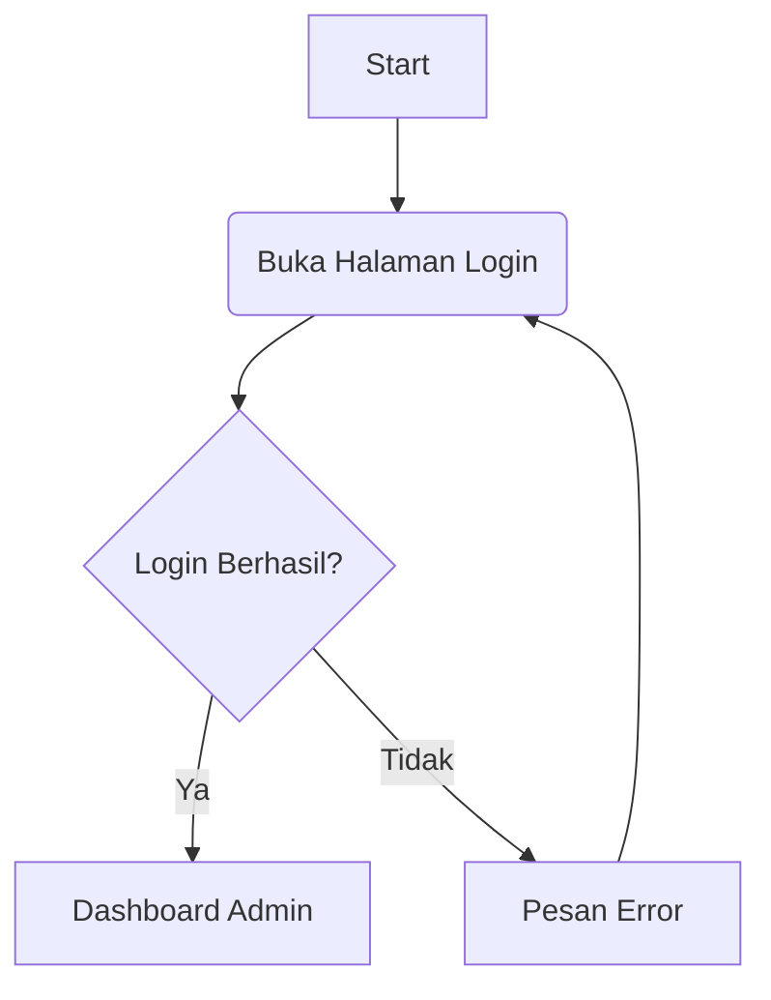

# Activity Diagram Admin - Web FIKOM

Dokumen ini berisi Activity Diagram untuk proses-proses utama yang dilakukan oleh Administrator di sistem Web FIKOM. Diagram dibuat menggunakan format **Mermaid**.

## 1. Login Admin

Proses autentikasi admin untuk masuk ke halaman dashboard.



```mermaid
activityDiagram
    start
    :Admin membuka halaman Login;
    :Input Username & Password;
    :Klik Tombol Login;
    if (Username ditemukan?) then (TIDAK)
        :Sistem menampilkan pesan error
        "Username tidak ditemukan";
        stop
    else (YA)
        if (Password Valid?) then (TIDAK)
             :Sistem menampilkan pesan error
             "Password salah";
             stop
        else (YA)
            :Sistem membuat Session Admin;
            :Redirect ke Dashboard;
            stop
        endif
    endif
```

## 2. Manajemen Berita (CRUD)

Proses pengelolaan berita yang mencakup Melihat (Read), Menambah (Create), Mengedit (Update), dan Menghapus (Delete).

### A. Melihat & Menambah Berita

```mermaid
activityDiagram
    start
    :Admin memilih menu "Kelola Berita";
    :Sistem menampilkan daftar berita;
    if (Admin klik "Tambah Berita"?) then (YA)
        :Admin mengisi form
        (Judul, Kategori, Konten, Upload Foto);
        :Klik Simpan;
        if (Validasi Input Sukses?) then (TIDAK)
            :Tampilkan pesan error;
        else (YA)
            :Upload Foto ke server;
            :Simpan data ke Database;
            :Tampilkan pesan sukses;
            :Reload Data Berita;
        endif
    endif
    stop
```

### B. Mengedit & Menghapus Berita

```mermaid
activityDiagram
    start
    :Admin melihat daftar berita;
    fork
        :Admin klik tombol "Edit";
        :Sistem menampilkan form edit
        dengan data lama;
        :Admin update data / ganti foto;
        :Klik Simpan Perubahan;
        :Sistem update Database & File;
    fork again
        :Admin klik tombol "Hapus";
        :Konfirmasi Hapus? (Alert);
        if (Ya) then (YES)
            :Sistem cari file foto lama;
            :Hapus file foto dari server;
            :Hapus data dari Database;
        else (NO)
            :Batal hapus;
        endif
    end fork
    :Sistem menampilkan pesan hasil;
    stop
```

## 3. Logout

Proses keluar dari sistem.

```mermaid
activityDiagram
    start
    :Admin klik tombol "Logout";
    :Sistem menghapus Session (session_destroy);
    :Redirect ke Halaman Login;
    stop
```
